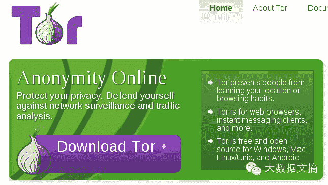
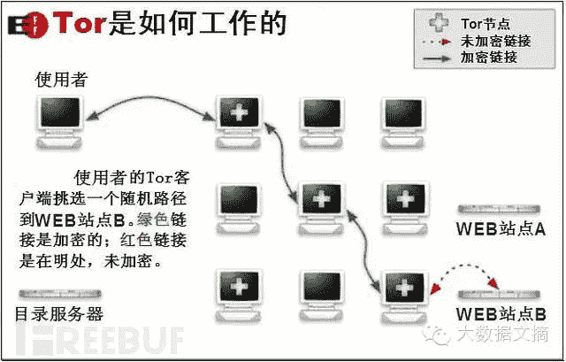
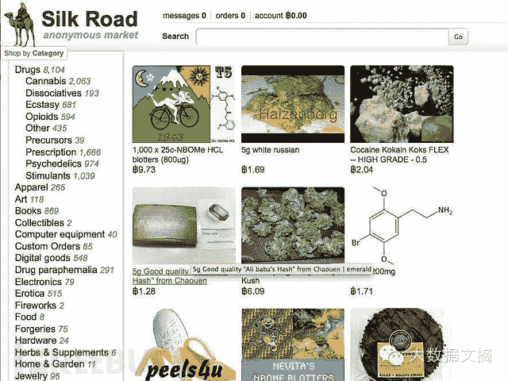
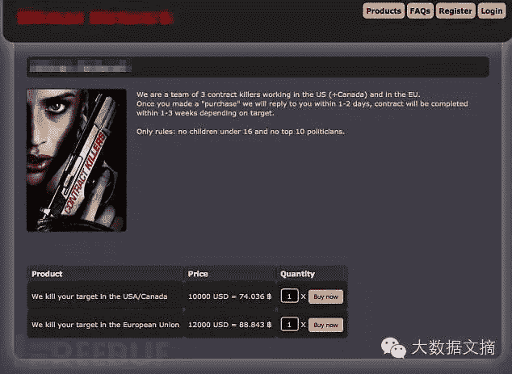
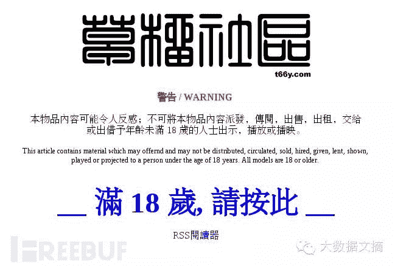
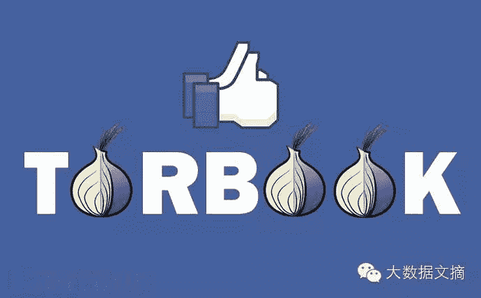
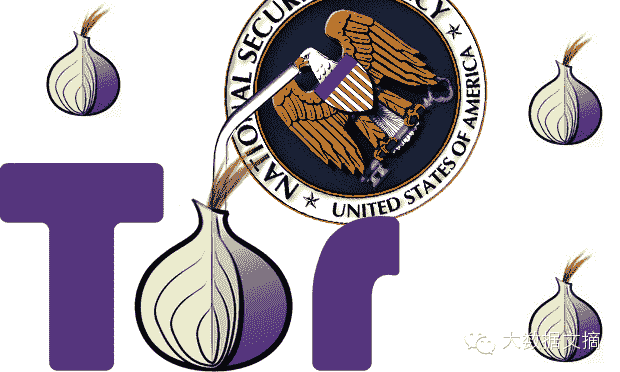

<!--yml
category: 暗网
date: 2022-11-04 11:34:20
-->

> 来源：[https://mp.weixin.qq.com/s?__biz=MzAxMzA2MDYxMw==&mid=205145985&idx=1&sn=c4e8328aa08bffdb5acc163bc975298c&scene=4#wechat_redirect](https://mp.weixin.qq.com/s?__biz=MzAxMzA2MDYxMw==&mid=205145985&idx=1&sn=c4e8328aa08bffdb5acc163bc975298c&scene=4#wechat_redirect)

> 

伴随着丝绸之路的兴衰，在过去的几年中，暗网已经被太多人关注。现在，FreeBuf情报组将带你走近“暗网”这个神秘的地下虚拟世界。

暗网并非十分庞大，甚至没有想象中那样特别的神秘。事实上，所谓“暗网”都是公共可见的网站，但却将真实的服务器IP隐藏了而已。这意为着，任何人都可以访问暗网，但“暗”就暗在这些网站隐藏极深，难以调查的幕后。

**藏匿在难以透光黑暗角落**

大部分的暗网网站使用匿名的Tor技术或使用类似的软件如I2P等。这类软将会加密网络流量并随机挑选位于世界各地的计算机传输数据，就像洋葱一样，加密过的数据会在每次传输后“剥开”加密层。从理论上讲，哪怕是数据源到数据目的地都被控制，这种技术完全也可以避免窃听和审查。

Tor官网与Tor的标志物洋葱，图片来自Tor官网

一般而言，当用户使用Tor后，浏览的任何网站都不可能很轻易的看到用户真实的IP地址。但当一个网站也同样使用了Tor隐藏技术后，只有同样使用Tor技术的用户才能够访问。对与使用Tor技术的网站和用户，数据都要经过三次随机的跳转才能够“碰面”。

图片来自m4rk.org

虽说网站的IP地址是隐藏的，然而却并不意味着这一切都是绝对的秘密。一些毒品销售网站，例如：丝绸之路、丝绸之路2.0、Agora和Eolution等网站拥有上千的常客。任何人使用Tor并知道网站的地址（通常以.onion结尾）都可以访问这些非法的在线市场（相关报道请戳）。

silkroad官网截图，图片来自m4rk.org

除了非法药品交易，也有很多”高端服务“，例如：Contract Killer，专业的杀手门户，只要目标在16岁以上，不是世界上任何圈内排名前10的人物，都有价格。像CK这类网站同样提供雇佣各类专业人士服务，包括前特种部队，佣兵队伍，黑客。如图，一队与CK签订协议的法国雇佣兵。

图片来自m4rk.org

**不要和“深网（the Deep Web) ”弄混**

一些新闻网站错误的将暗网描述成“占据了90%的互联网”，他们将无法被搜索引擎搜索出来的“深网”弄混了。这些没有被索引的网站在一定程度上包括了暗网，但“深网”网站也有很多普通网站类似，如需要注册的论坛(例如1024啥的)和像Gmail这种使用动态页面的网站。安全研究人员Nik Cubrilovic对使用隐藏技术的网站进行了爬取，与数亿个普通网站相比，可能10000余个暗网网站只占了0.01%。

可能下图中的WARNING算是大家都熟知的深网网站：

**暗中微光**

虽然暗网与出售毒品、武器、伪造证件和儿童色情有极大的关联，这些充满“活力”的行业确实利用了Tor匿名技术，但不是所有的暗网都想利用Tor技术来做这些见不得光的“暗”事。比如借鉴了维基解密的SecureDrop，使用Tor技术让新闻机构接受匿名人士提交的信息。甚至连Facebook也推出了暗网版，旨在照顾想要逃避监控和审查的用户利用Tor技术使用Facebook（facebookcorewwwi.onion）。

但最近由FBI和欧洲刑警组织展开的名为Onymous的联合行动查获了数十家使用Tor服务网站，其中包括六大在线毒品交易平台中的三个（包括silkroad2.0，但据新消息silkroad3.0已经开始运营），这让一向以安全著称的Tor规避执法机关和情报机构监视的能力受到了质疑和猜测（相关报道请戳）。现在，这些网站是如何被定位却成为了一个谜，一些安全研究人员推测，政府的黑客使用拒绝服务攻击Tor中继，使得网站强制使用被控制的Tor服务器，从而跟踪到他们的IP地址。或者是使用老式的刑侦手段，发展系统管理员为线人提供情报，亦或是找到了网站可利用的漏洞。

无论是那种方式，都证明了一点：即使是在最黑暗的暗网，哪怕有些许裂缝，也会透进微光。

摘自：www.FreeBuf.com

原文：http://www.freebuf.com/news/special/52445.html

摘自：大数据文摘（ID：BigDataDigest）

**P.S.如果您认为这篇文章不错，请分享至朋友圈。分享知识，传递快乐 :)**

**原创干货 清华大数据系列讲座**

回复“刘政应用创新”，看大数据分析

回复“吴军应用创新”，看数据为王和机器智能的时代

回复“吴甘沙技术前沿”，看大数据技术前沿的十个问题

回复“王迪技术前沿”，看数据驱动下的数字视频广告创新

回复“王迪应用创新”，看基于大数据的视频广告应用创新

回复“王新锐应用创新”，看金融大数据的法律实践

回复“RONG一”，看新闻传播大数据

回复“RONG二”，看医疗健康大数据

**清华@数据派 ID:Datapi**

**清华大数据产业联合会的微信公众平台，旨在传播数据科学理念，分享数据运营心得，扩展数据应用空间，捕捉数据产业商机。定期发布线下活动预告，独家发布讲座素材，清华大数据产业联合会活动报名唯一渠道。寻求合作请联系微信号@小数点（ID: decimal_point）**