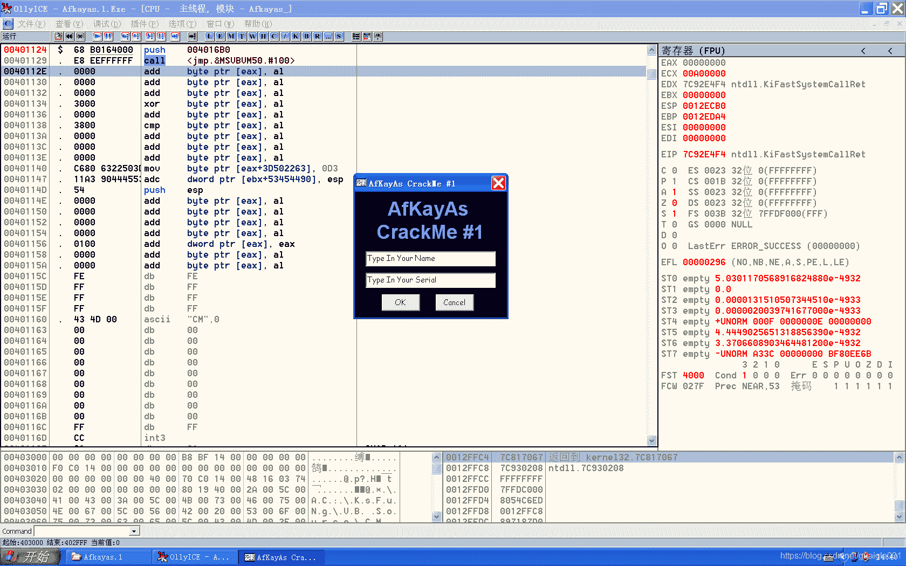

<!--yml
category: crackme160
date: 2022-04-27 18:17:42
-->

# CrackMe160 学习笔记 之 002_一剑名动江湖的博客-CSDN博客

> 来源：[https://blog.csdn.net/guaigle001/article/details/104030745](https://blog.csdn.net/guaigle001/article/details/104030745)

## 前言

打开程序，是一个很简单的界面。看来是要我们根据**用户名**写出对应的**序列号**。

如图。


## 分析

输入任意字符，搜索字符串 ***"You get Wrong" "Try Again"*** , 找到**判断关键跳转**的地方。

```
00402579   .  66:85F6       test    si, si
0040258B   .  74 58         je      short 004025E5
0040258D   .  68 801B4000   push    00401B80                         ;  UNICODE "You Get It"
00402592   .  68 9C1B4000   push    00401B9C                         ;  UNICODE CR,LF
00402597   .  FFD7          call    edi
00402599   .  8BD0          mov     edx, eax
0040259B   .  8D4D E8       lea     ecx, dword ptr [ebp-18]
0040259E   .  FFD3          call    ebx
004025A0   .  50            push    eax
004025A1   .  68 A81B4000   push    00401BA8                         ;  UNICODE "KeyGen It Now"

004025E5   >  68 C81B4000   push    00401BC8                         ;  UNICODE "You Get Wrong"
004025EA   .  68 9C1B4000   push    00401B9C                         ;  UNICODE CR,LF
004025EF   .  FFD7          call    edi
004025F1   .  8BD0          mov     edx, eax
004025F3   .  8D4D E8       lea     ecx, dword ptr [ebp-18]
004025F6   .  FFD3          call    ebx
004025F8   .  50            push    eax
004025F9   .  68 E81B4000   push    00401BE8                         ;  UNICODE "Try Again" 
```

可以得知，**根据si的值来判断是否注册成功**。继续向上寻找。

```
00402533   .  FF15 28414000 call    dword ptr [<&MSVBVM50.__vbaStrCm>;  MSVBVM50.__vbaStrCmp ；字符串比较函数
00402539   .  8BF0          mov     esi, eax 
```

通过**比较字符串是否相等确定si的值**。

```
00402516   .  8B3D 00414000 mov     edi, dword ptr [<&MSVBVM50.__vba>;  MSVBVM50.__vbaStrCat ; 字符串拼接函数
0040251C   .  50            push    eax
0040251D   .  68 701B4000   push    00401B70                         ;  UNICODE "AKA-"
00402522   .  51            push    ecx                              ; /String
00402523   .  FFD7          call    edi                              ; \__vbaStrCat
00402525   .  8B1D 70414000 mov     ebx, dword ptr [<&MSVBVM50.__vba>;  MSVBVM50.__vbaStrMove
0040252B   .  8BD0          mov     edx, eax
0040252D   .  8D4D E0       lea     ecx, dword ptr [ebp-20] 
```

将计算得出的字符串与AKA-**拼接得到最终的字符串**。

```
00402412   .  50            push    eax                              ; /用户名
00402413   .  8B1A          mov     ebx, dword ptr [edx]             ; |
00402415   .  FF15 E4404000 call    dword ptr [<&MSVBVM50.__vbaLenBs>; \__vbaLenBstr ; 得出字符串长度函数
0040241B   .  8BF8          mov     edi, eax                            ；长度存放在edi中
0040241D   .  8B4D E8       mov     ecx, dword ptr [ebp-18]             ；将字符串首地址送入ecx中
00402420   .  69FF FB7C0100 imul    edi, edi, 17CFB                     ；长度乘以0x17CFB
00402426   .  51            push    ecx                              ; /String
00402427   .  0F80 91020000 jo      004026BE                         ; |
0040242D   .  FF15 F8404000 call    dword ptr [<&MSVBVM50.#516>]     ; \rtcAnsiValueBstr 求出字符串第一个字母的ASCII码
00402433   .  0FBFD0        movsx   edx, ax                         ；并放入edx中
00402436   .  03FA          add     edi, edx                         ；与乘以0x17CFB后的长度相加
00402438   .  0F80 80020000 jo      004026BE
0040243E   .  57            push    edi
0040243F   .  FF15 E0404000 call    dword ptr [<&MSVBVM50.__vbaStrI4>;  MSVBVM50.__vbaStrI4 ；转成十进制数 
```

字符串计算过程

继续跟踪 0040243F 跳转的函数

```
7403BEE3    FF15 641A0274   call    dword ptr [<&OLEAUT32.#110>]     ; OLEAUT32.VarBstrFromI4
770FC6E0    E8 1D000000     call    770FC702
770FC716    E8 9ADDFFFF     call    770FA4B5 
```

可见从**004024F->7403BEE3->770FC6E0->770FC716** 最终来**到将字符串转为十进制的函数**
如下

```
770FA4B7    55              push    ebp
770FA4B8    8BEC            mov     ebp, esp
770FA4BA    837D 10 00      cmp     dword ptr [ebp+10], 0
770FA4BE    8B4D 0C         mov     ecx, dword ptr [ebp+C]
770FA4C1    0F85 BFD00200   jnz     77127586
770FA4C7    56              push    esi
770FA4C8    8BF1            mov     esi, ecx
770FA4CA    53              push    ebx
770FA4CB    8B45 08         mov     eax, dword ptr [ebp+8] ;ebp+8一开始存放的是16进制时字符串的值
770FA4CE    33D2            xor     edx, edx
770FA4D0    6A 0A           push    0A
770FA4D2    5B              pop     ebx
770FA4D3    F7F3            div     ebx ;循环除以10，当eax为0时退出循环
770FA4D5    83C2 30         add     edx, 30 ;edx存放除法的余数，得到对应的ASCII值
770FA4D8    66:8911         mov     word ptr [ecx], dx ；存入esi中
770FA4DB    41              inc     ecx
770FA4DC    41              inc     ecx ；ecx+2，准备存放下一个数，宽度是2个字节
770FA4DD    85C0            test    eax, eax ；是否退出循环
770FA4DF    8945 08         mov     dword ptr [ebp+8], eax
770FA4E2  ^ 77 E7           ja      short 770FA4CB
770FA4E4    66:8321 00      and     word ptr [ecx], 0
770FA4E8    49              dec     ecx
770FA4E9    49              dec     ecx
770FA4EA    5B              pop     ebx ;esi中存放的是最后的结果
770FA4EB    66:8B16         mov     dx, word ptr [esi]
770FA4EE    66:8B01         mov     ax, word ptr [ecx]
770FA4F1    66:8911         mov     word ptr [ecx], dx
770FA4F4    49              dec     ecx
770FA4F5    66:8906         mov     word ptr [esi], ax
770FA4F8    49              dec     ecx
770FA4F9    46              inc     esi
770FA4FA    46              inc     esi
770FA4FB    3BF1            cmp     esi, ecx
770FA4FD  ^ 72 EC           jb      short 770FA4EB
770FA4FF    5E              pop     esi
770FA500    5D              pop     ebp
770FA501    C2 0C00         retn    0C 
```

### 注册机代码

```
#include<stdio.h>
int main()
{
  char *name;
  scanf("%s",name);
  printf("AKA-%d",strlen(name)*0x17CFB+*name);
  return 0;
} 
```