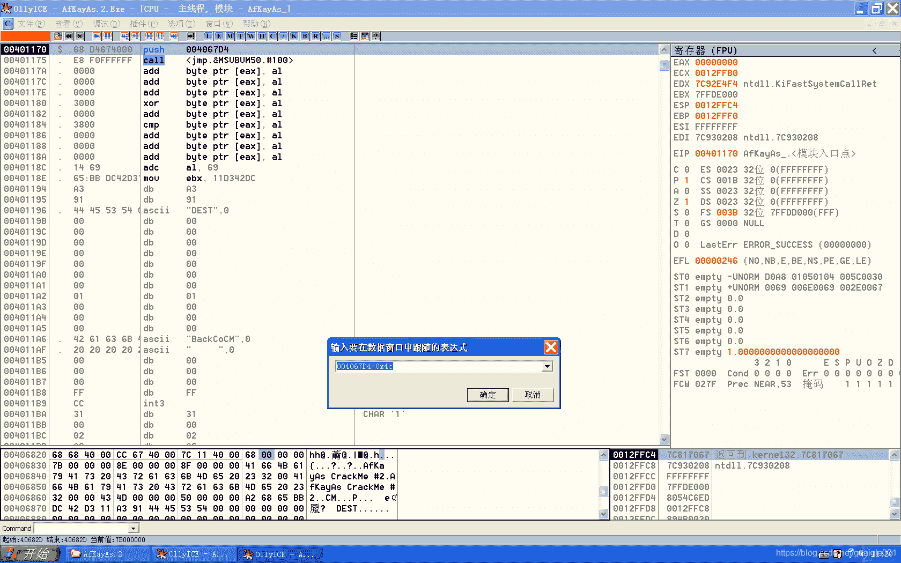
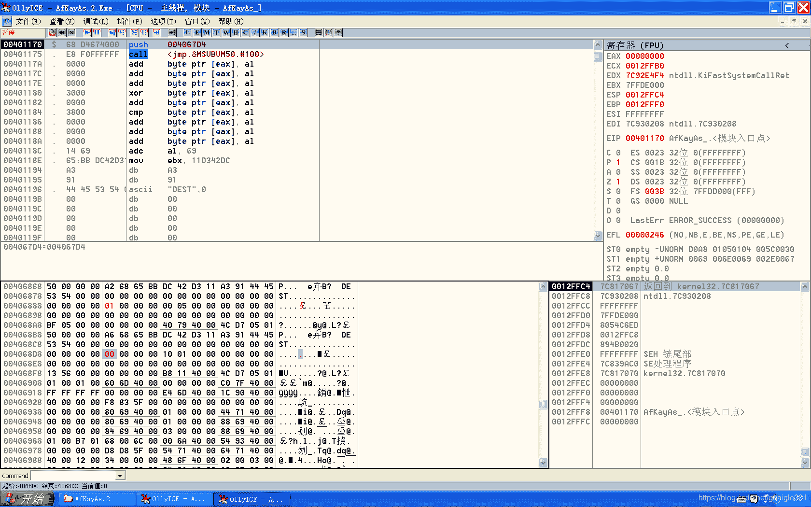
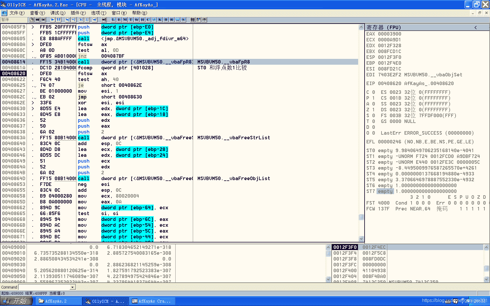

<!--yml
category: crackme160
date: 2022-04-27 18:17:29
-->

# CrackMe160 学习笔记 之 003_一剑名动江湖的博客-CSDN博客

> 来源：[https://blog.csdn.net/guaigle001/article/details/104074789](https://blog.csdn.net/guaigle001/article/details/104074789)

## 前言

003 在 002 的基础上增加了弹窗。以及增加了一段用浮点数计算的指令。

不过这并没有增加什么难度，无非在普通指令上多了个f。

## 去弹窗

使用 ***4C法***。


程序入口处压入地址+**0x4c**找到新地址**0x406868**。



***交换窗口出现的顺序***。

## 分析

### 计算用户名

```
004081F2   .  50            push    eax                              ; /name
004081F3   .  8B1A          mov     ebx, dword ptr [edx]             ; |
004081F5   .  FF15 F8B04000 call    dword ptr [<&MSVBVM50.__vbaLenBs>; \__vbaLenBstr ; 求字符串长度
004081FB   .  8BF8          mov     edi, eax
004081FD   .  8B4D E8       mov     ecx, dword ptr [ebp-18]
00408200   .  69FF 385B0100 imul    edi, edi, 15B38
00408206   .  51            push    ecx                              ; /String
00408207   .  0F80 B7050000 jo      004087C4                         ; |
0040820D   .  FF15 0CB14000 call    dword ptr [<&MSVBVM50.#516>]     ; \rtcAnsiValueBstr ; 求ASCII值
00408213   .  0FBFD0        movsx   edx, ax
00408216   .  03FA          add     edi, edx
00408218   .  0F80 A6050000 jo      004087C4
0040821E   .  57            push    edi
0040821F   .  FF15 F4B04000 call    dword ptr [<&MSVBVM50.__vbaStrI4>;  MSVBVM50.__vbaStrI4 ； 16进制数转字符串 
```

这部分和002是基本一样的，这里不再多加解释。

### 字符串转浮点数分析

这个函数是**vbaR8Str**内部

```
740F8CD4 >  83EC 08         sub     esp, 8
740F8CD7    8D4424 00       lea     eax, dword ptr [esp]
740F8CDB    50              push    eax
740F8CDC    6A 00           push    0
740F8CDE    E8 5627F3FF     call    7402B439
740F8CE3    50              push    eax
740F8CE4    FF7424 18       push    dword ptr [esp+18]               ; 压入字符串地址
740F8CE8    FF15 481A0274   call    dword ptr [<&OLEAUT32.#84>]      ; OLEAUT32.VarR8FromStr 字符串转浮点数
740F8CEE    85C0            test    eax, eax
740F8CF0    7D 0C           jge     short 740F8CFE                   ; eax为0，直接跳转
740F8CF2    50              push    eax
740F8CF3    E8 5027F3FF     call    7402B448 
740F8CF8    50              push    eax
740F8CF9    E8 D1B5F2FF     call    740242CF
740F8CFE    DD4424 00       fld     qword ptr [esp]                  ; 这里将转换后得到的浮点数压入ST0中
740F8D02    83C4 08         add     esp, 8
740F8D05    C2 0400         retn    4 
```

### 浮点数计算过程

```
004082E9   .  FF15 74B14000 call    dword ptr [<&MSVBVM50.__vbaR8Str>;  MSVBVM50.__vbaR8Str ; 字符串转浮点数，并压入ST0中
004082EF   .  D905 08104000 fld     dword ptr [401008]               ;  把浮点数10压入浮点寄存器ST0中,同时将原来ST0中的数保存到ST1中
004082F5   .  833D 00904000>cmp     dword ptr [409000], 0
004082FC   .  75 08         jnz     short 00408306
004082FE   .  D835 0C104000 fdiv    dword ptr [40100C]               ;  除以浮点数5,得到浮点数2，结果存储在ST0中
00408304   .  EB 0B         jmp     short 00408311
00408306   >  FF35 0C104000 push    dword ptr [40100C]
0040830C   .  E8 578DFFFF   call    <jmp.&MSVBVM50._adj_fdiv_m32>
00408311   >  83EC 08       sub     esp, 8
00408314   .  DFE0          fstsw   ax
00408316   .  A8 0D         test    al, 0D
00408318   .  0F85 A1040000 jnz     004087BF                          ; 此时， ST0:2.0000000000000000000 ST1:1511180.0000000000000
0040831E   .  DEC1          faddp   st(1), st                         ;  浮点寄存器ST0和ST1的值相加，结果存储在ST0中
00408320   .  DFE0          fstsw   ax                                ; 取出状态码
00408322   .  A8 0D         test    al, 0D
00408324   .  0F85 95040000 jnz     004087BF                          ; 如果溢出则跳转
0040832A   .  DD1C24        fstp    qword ptr [esp]
0040832D   .  FF15 48B14000 call    dword ptr [<&MSVBVM50.__vbaStrR8>;  MSVBVM50.__vbaStrR8 
```

这里用户名输入为 ***1***

```
004083F5   .  FF15 74B14000 call    dword ptr [<&MSVBVM50.__vbaR8Str>;  MSVBVM50.__vbaR8Str ;字符串转浮点数
004083FB   .  DC0D 10104000 fmul    qword ptr [401010]               ;  ST0 *= 3.000000000000000
00408401   .  83EC 08       sub     esp, 8
00408404   .  DC25 18104000 fsub    qword ptr [401018]               ;  ST0 -= 2.000000000000000
0040840A   .  DFE0          fstsw   ax                               ; 取出状态码
0040840C   .  A8 0D         test    al, 0D
0040840E   .  0F85 AB030000 jnz     004087BF                         ;  如果溢出则跳转
00408414   .  DD1C24        fstp    qword ptr [esp]                  ;  出栈
00408417   .  FF15 48B14000 call    dword ptr [<&MSVBVM50.__vbaStrR8>;  MSVBVM50.__vbaStrR8 ；浮点数转字符串 
```

```
004084DF   .  FF15 74B14000 call    dword ptr [<&MSVBVM50.__vbaR8Str>;  MSVBVM50.__vbaR8Str ; 同上
004084E5   .  DC25 20104000 fsub    qword ptr [401020]               ;  ST0 -= -15.00000000000000
004084EB   .  83EC 08       sub     esp, 8
004084EE   .  DFE0          fstsw   ax
004084F0   .  A8 0D         test    al, 0D
004084F2   .  0F85 C7020000 jnz     004087BF
004084F8   .  DD1C24        fstp    qword ptr [esp]
004084FB   .  FF15 48B14000 call    dword ptr [<&MSVBVM50.__vbaStrR8>;  MSVBVM50.__vbaStrR8 ; 同上 
```

## 判断

```
004085CE   > \8B45 E8       mov     eax, dword ptr [ebp-18]          ;  输入的序列号
004085D1   .  50            push    eax
004085D2   .  FF15 74B14000 call    dword ptr [<&MSVBVM50.__vbaR8Str>;  MSVBVM50.__vbaR8Str
004085D8   .  8B4D E4       mov     ecx, dword ptr [ebp-1C]
004085DB   .  DD9D 1CFFFFFF fstp    qword ptr [ebp-E4]
004085E1   .  51            push    ecx
004085E2   .  FF15 74B14000 call    dword ptr [<&MSVBVM50.__vbaR8Str>;  MSVBVM50.__vbaR8Str
004085E8   .  833D 00904000>cmp     dword ptr [409000], 0
004085EF   .  75 08         jnz     short 004085F9
004085F1   .  DCBD 1CFFFFFF fdivr   qword ptr [ebp-E4]               ;  [ebp-E4]/ST0
004085F7   .  EB 11         jmp     short 0040860A
0040860A   >  DFE0          fstsw   ax
0040860C   .  A8 0D         test    al, 0D
0040860E   .  0F85 AB010000 jnz     004087BF 
00408614   .  FF15 34B14000 call    dword ptr [<&MSVBVM50.__vbaFpR8>>;  MSVBVM50.__vbaFpR8
0040861A   .  DC1D 28104000 fcomp   qword ptr [401028]               ;  ST0 和浮点数1比较
00408620   .  DFE0          fstsw   ax                               ; 当输入相等时，fst寄存器值为4000
00408622   .  F6C4 40       test    ah, 40                           ; 如果相等，ZF置为0，不跳转
00408625   .  74 07         je      short 0040862E                              
00408627   .  BE 01000000   mov     esi, 1                           ；相等时进入
00408653   .  F7DE          neg     esi                              ；设置esi为FFFFFFFF
00408665   .  66:85F6       test    si, si
00408677   .  74 62         je      short 004086DB
00408679   .  8B35 14B14000 mov     esi, dword ptr [<&MSVBVM50.__vba>;  MSVBVM50.__vbaStrCat
0040867F   .  68 C06F4000   push    00406FC0                         ;  UNICODE "You Get It"
00408684   .  68 DC6F4000   push    00406FDC                         ; /String = CR,""
00408689   .  FFD6          call    esi                              ; \__vbaStrCat
0040868B   .  8BD0          mov     edx, eax
0040868D   .  8D4D E8       lea     ecx, dword ptr [ebp-18]
00408690   .  FF15 94B14000 call    dword ptr [<&MSVBVM50.__vbaStrMo>;  MSVBVM50.__vbaStrMove
00408696   .  50            push    eax
00408697   .  68 E86F4000   push    00406FE8                         ;  UNICODE "KeyGen It Now"
0040869C   .  FFD6          call    esi
004086DB   >  8B35 14B14000 mov     esi, dword ptr [<&MSVBVM50.__vba>;  MSVBVM50.__vbaStrCat
004086E1   .  68 08704000   push    00407008                         ;  UNICODE "You Get Wrong"
004086E6   .  68 DC6F4000   push    00406FDC                         ; /String = CR,""
004086EB   .  FFD6          call    esi                              ; \__vbaStrCat
004086ED   .  8BD0          mov     edx, eax
004086EF   .  8D4D E8       lea     ecx, dword ptr [ebp-18]
004086F2   .  FF15 94B14000 call    dword ptr [<&MSVBVM50.__vbaStrMo>;  MSVBVM50.__vbaStrMove
004086F8   .  50            push    eax
004086F9   .  68 28704000   push    00407028                         ;  UNICODE "Try Again"
004086FE   .  FFD6          call    esi 
```

可以看到，最后将输入的**序列号**值和计算后的**用户名**值**相除**后和**浮点数1**做比较，根据**是否相等来判断跳转**。

下面是 **fcomp** 指令不同状态下**AH**的值。

*   ST(0) > m32fp => AH = 00h
*   ST(0) == m32fp => AH = 40h
*   ST(0) < m32fp => AH = 01h


**此图展示了相等时浮点状态码的变化。**

## 注册机代码

```
#include<stdio.h>
int main()
{
  char* name;
  printf("name:");
  scanf("%[^\n]",name);  
  printf("serial:%d",(strlen(name)*0x15b38+*name+2)*3-2+15);
  return 0;
} 
```

## 补充

这个程序代码写的有点不严谨，输入的序列号为字符串时，会报类型错误。因为序列号最终是个数字。