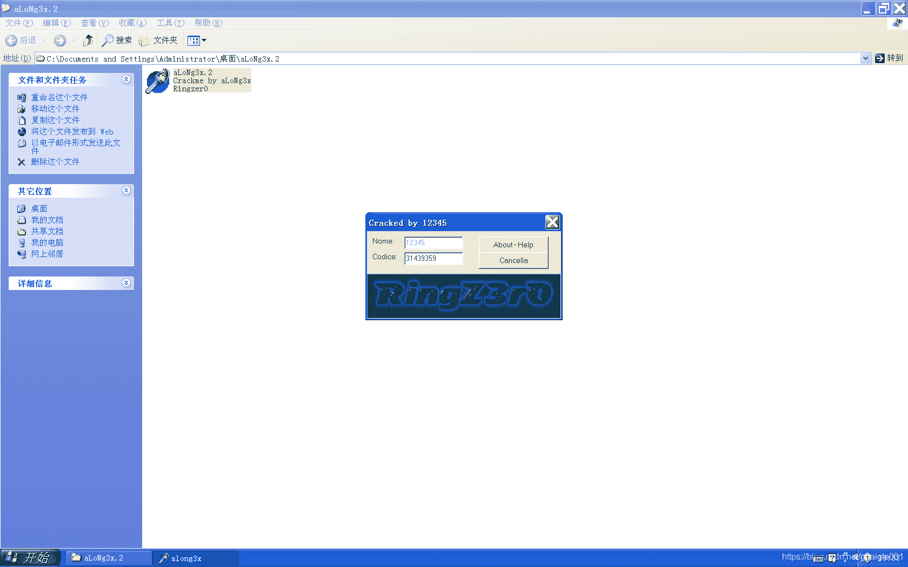
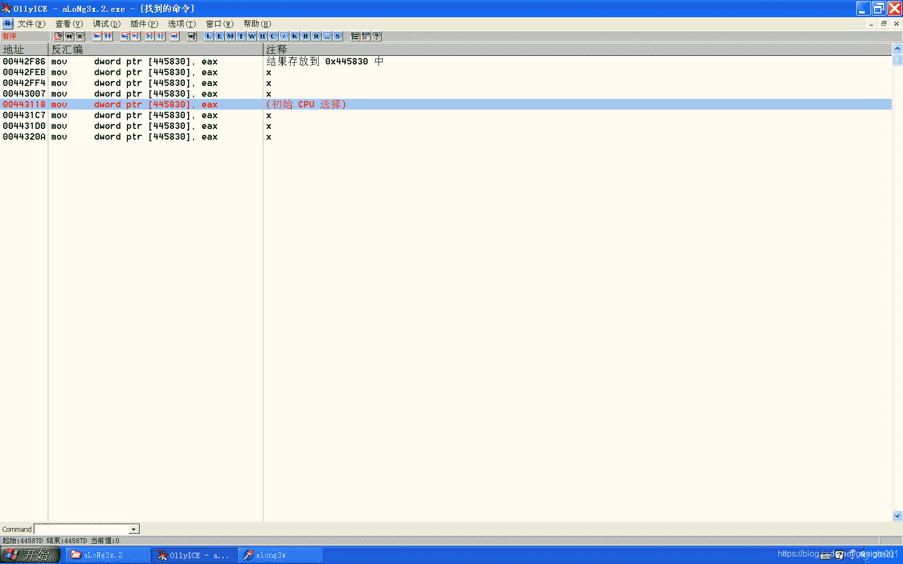

<!--yml
category: crackme160
date: 2022-04-27 18:17:23
-->

# CrackMe160 学习笔记 之 007_一剑名动江湖的博客-CSDN博客

> 来源：[https://blog.csdn.net/guaigle001/article/details/104102725](https://blog.csdn.net/guaigle001/article/details/104102725)

## 前言

这个程序是006的升级版,同样是需要我们消除按钮，显现处被按钮遮住的部分。

攻破后的程序如图。



## 思路

首先尝试输入，根据跳出的弹窗搜索字符串可以找到验证函数的位置。发现有两处。


这两处分别是两个验证函数的位置。

而且不同的输入跳出的弹窗是不一样的。

先说一下结论吧。

于是进入**3** 进行分析**验证函数**。

分析验证的代码时，发现有条语句赋了一个关键的值 ,由于不知道这个值从何而来，阻碍了分析。

如下。

```
00442FB4  |.  A1 30584400   mov     eax, dword ptr [445830] 
```

继续往下看，可以看到如下语句。

```
00442FEB  |.  A3 30584400   mov     dword ptr [445830], eax 
```

了解了赋值方式后，开始全局搜索这条指令。

如图。



一一排除，发现只有两处可能符合要找的内容。

继续分析，才知道这个赋值来自**codice**输入大于**0x7FFFFFF8**或者不是**纯数字**时。

不免感慨**作者**真的**很心机**。

一定得先输入一个不符合的数才能正确验证。

接下来的步骤就很轻松了。

## 分析

### 第一个验证函数

```
00442F39  |.  55            push    ebp
00442F3A  |.  68 22304400   push    00443022
00442F3F  |.  64:FF30       push    dword ptr fs:[eax]
00442F42  |.  64:8920       mov     dword ptr fs:[eax], esp
00442F45  |.  8D55 F8       lea     edx, dword ptr [ebp-8]
00442F48  |.  8B83 DC020000 mov     eax, dword ptr [ebx+2DC]
00442F4E  |.  E8 ED02FEFF   call    00423240                         ;  获取codice
00442F53  |.  8B45 F8       mov     eax, dword ptr [ebp-8]
00442F56  |.  8D55 FC       lea     edx, dword ptr [ebp-4]
00442F59  |.  E8 FAF9FBFF   call    00402958                         ;  字符串转十进制数
00442F5E  |.  8BF0          mov     esi, eax                         ;  保存到esi中
00442F60  |.  837D FC 00    cmp     dword ptr [ebp-4], 0
00442F64  |.  74 37         je      short 00442F9D                   ;  codice小于等于0x7FFFFFF8时成立
00442F66  |.  B8 38304400   mov     eax, 00443038                    ;  ASCII "You MUST insert a valid Long Integer Value in the Code Editor... Thank you :)"
00442F6B  |.  E8 00F6FFFF   call    00442570                         ;  跳出弹窗
00442F70  |.  8D55 F8       lea     edx, dword ptr [ebp-8]
00442F73  |.  8B83 DC020000 mov     eax, dword ptr [ebx+2DC]
00442F79  |.  E8 C202FEFF   call    00423240                         ;  获取codice
00442F7E  |.  8B45 F8       mov     eax, dword ptr [ebp-8]
00442F81  |.  E8 06FBFFFF   call    00442A8C                         ;  对codice进行运算
00442F86  |.  A3 30584400   mov     dword ptr [445830], eax          ;  结果存放到 0x445830 中
00442F8B  |.  BA 90304400   mov     edx, 00443090
00442F90  |.  8B83 DC020000 mov     eax, dword ptr [ebx+2DC]
00442F96  |.  E8 D502FEFF   call    00423270
00442F9B  |.  EB 6F         jmp     short 0044300C
00442F9D  |>  85F6          test    esi, esi
00442F9F  |.  7E 5A         jle     short 00442FFB                   ;  结果小于等于0时则跳转
00442FA1  |.  8D55 F8       lea     edx, dword ptr [ebp-8]
00442FA4  |.  8B83 D8020000 mov     eax, dword ptr [ebx+2D8]
00442FAA  |.  E8 9102FEFF   call    00423240                         ;  获取name
00442FAF  |.  8B4D F8       mov     ecx, dword ptr [ebp-8]
00442FB2  |.  8BD6          mov     edx, esi                         ;  从esi中取出codice放到edx中
00442FB4  |.  A1 30584400   mov     eax, dword ptr [445830]          ;  eax = [445830] 前置条件输入字符大于0x7FFFFFF8
00442FB9  |.  E8 EAF9FFFF   call    004429A8                         ;  关键比较函数
00442FBE  |.  84C0          test    al, al
00442FC0  |.  74 30         je      short 00442FF2
00442FC2  |.  33D2          xor     edx, edx
00442FC4  |.  8B83 CC020000 mov     eax, dword ptr [ebx+2CC]
00442FCA  |.  E8 6101FEFF   call    00423130
00442FCF  |.  B2 01         mov     dl, 1
00442FD1  |.  8B83 E8020000 mov     eax, dword ptr [ebx+2E8]
00442FD7  |.  E8 5401FEFF   call    00423130
00442FDC  |.  33D2          xor     edx, edx
00442FDE  |.  8B83 D8020000 mov     eax, dword ptr [ebx+2D8]
00442FE4  |.  8B08          mov     ecx, dword ptr [eax]
00442FE6  |.  FF51 60       call    dword ptr [ecx+60]
00442FE9  |.  33C0          xor     eax, eax
00442FEB  |.  A3 30584400   mov     dword ptr [445830], eax          ;  x
00442FF0  |.  EB 1A         jmp     short 0044300C
00442FF2  |>  33C0          xor     eax, eax
00442FF4  |.  A3 30584400   mov     dword ptr [445830], eax          ;  x
00442FF9  |.  EB 11         jmp     short 0044300C
00442FFB  |>  B8 9C304400   mov     eax, 0044309C                    ;  ASCII "Please... The Code Must be > 0"
00443000  |.  E8 6BF5FFFF   call    00442570                         ;  跳出弹窗
00443005  |.  33C0          xor     eax, eax
00443007  |.  A3 30584400   mov     dword ptr [445830], eax          ;  x
0044300C  |>  33C0          xor     eax, eax
0044300E  |.  5A            pop     edx
0044300F  |.  59            pop     ecx
00443010  |.  59            pop     ecx
00443011  |.  64:8910       mov     dword ptr fs:[eax], edx
00443014  |.  68 29304400   push    00443029
00443019  |>  8D45 F8       lea     eax, dword ptr [ebp-8]
0044301C  |.  E8 9707FCFF   call    004037B8
00443021  \.  C3            retn
00443022   .^ E9 5102FCFF   jmp     00403278
00443027   .^ EB F0         jmp     short 00443019
00443029   .  5E            pop     esi
0044302A   .  5B            pop     ebx
0044302B   .  59            pop     ecx
0044302C   .  59            pop     ecx
0044302D   .  5D            pop     ebp
0044302E   .  C3            retn 
```

### 字符串转十进制数

```
004029AA  |>  80EB 30       /sub     bl, 30
004029AD  |. |80FB 09       |cmp     bl, 9
004029B0  |. |77 2C         |ja      short 004029DE
004029B2  |. |39F8          |cmp     eax, edi
004029B4  |. |77 28         |ja      short 004029DE                  ;  value/10 > 0xCCCCCCC(214748394) 退出循环
004029B6  |. |8D0480        |lea     eax, dword ptr [eax+eax*4]
004029B9  |. |01C0          |add     eax, eax
004029BB  |. |01D8          |add     eax, ebx
004029BD  |. |8A1E          |mov     bl, byte ptr [esi]
004029BF  |. |46            |inc     esi
004029C0  |. |84DB          |test    bl, bl
004029C2  |.^\75 E6         \jnz     short 004029AA                  ;  取到的字符串为0时退出循环
004029C4  |>  FECD          dec     ch
004029C6  |.  74 10         je      short 004029D8
004029C8  |.  85C0          test    eax, eax
004029CA  |.  7C 12         jl      short 004029DE
004029CC  |>  59            pop     ecx
004029CD  |.  31F6          xor     esi, esi
004029CF  |>  8932          mov     dword ptr [edx], esi             ;  这一步很关键
004029D1  |.  5F            pop     edi
004029D2  |.  5E            pop     esi
004029D3  |.  5B            pop     ebx
004029D4  |.  C3            retn
004029DE  |>  5B            pop     ebx                              ;  Default case of switch 004029FE
004029DF  |. |29DE          sub     esi, ebx                         ;  esi = esi - ebx ; 字母从左数出现的位数
004029E1  |.^|EB EC         jmp     short 004029CF 
```

这个函数虽然在上一篇文章中分析过了，但还是有个地方要注意一下。

判断字符串的值大于 **0x7FFFFFF8**或者不是**纯数字** 的关键跳转。

这个跳转如果成立，则将**字符串长度**送入 **[ebp-4]**也就是**0x0012F684**中，这一步影响了后面的条件判断，**0x0045830**这一块内存的赋值和弹窗的跳出。

否则，清零，不跳转。

### codice计算值赋给0x445830的过程

```
00442A8C  /$  55            push    ebp
00442A8D  |.  8BEC          mov     ebp, esp
00442A8F  |.  51            push    ecx
00442A90  |.  53            push    ebx
00442A91  |.  56            push    esi
00442A92  |.  57            push    edi
00442A93  |.  8945 FC       mov     dword ptr [ebp-4], eax
00442A96  |.  8B45 FC       mov     eax, dword ptr [ebp-4]
00442A99  |.  E8 4A11FCFF   call    00403BE8                         ;  edx = 2
00442A9E  |.  33C0          xor     eax, eax
00442AA0  |.  55            push    ebp
00442AA1  |.  68 212B4400   push    00442B21
00442AA6  |.  64:FF30       push    dword ptr fs:[eax]
00442AA9  |.  64:8920       mov     dword ptr fs:[eax], esp
00442AAC  |.  8B45 FC       mov     eax, dword ptr [ebp-4]
00442AAF  |.  E8 800FFCFF   call    00403A34                         ;  返回字符串长度
00442AB4  |.  83F8 05       cmp     eax, 5
00442AB7  |.  7E 3D         jle     short 00442AF6
00442AB9  |.  BE 7B030000   mov     esi, 37B                         ;  esi = 0x37B
00442ABE  |.  8B45 FC       mov     eax, dword ptr [ebp-4]
00442AC1  |.  E8 6E0FFCFF   call    00403A34                         ;  返回字符串长度
00442AC6  |.  8BD8          mov     ebx, eax
00442AC8  |.  4B            dec     ebx                              ;  ebx = ebx - 1
00442AC9  |.  85DB          test    ebx, ebx
00442ACB  |.  7E 2B         jle     short 00442AF8                   ;  字符串长度小于等于0则跳转
00442ACD  |.  B9 01000000   mov     ecx, 1
00442AD2  |>  8B45 FC       /mov     eax, dword ptr [ebp-4]          ;  获取codice
00442AD5  |.  0FB60408      |movzx   eax, byte ptr [eax+ecx]         ;  从第二个字符开始向后取
00442AD9  |.  BF 11000000   |mov     edi, 11                         ;  edi = 0x11
00442ADE  |.  33D2          |xor     edx, edx                        ;  edx = 0
00442AE0  |.  F7F7          |div     edi                             ;  eax = eax / 0x11 ; edx = eax % 0x11
00442AE2  |.  42            |inc     edx                             ;  edx = edx + 1
00442AE3  |.  8B45 FC       |mov     eax, dword ptr [ebp-4]          ;  获取codice
00442AE6  |.  0FB64408 FF   |movzx   eax, byte ptr [eax+ecx-1]       ;  从第一个字符开始向后取
00442AEB  |.  0FAFD0        |imul    edx, eax                        ;  edx = edx * eax
00442AEE  |.  03F2          |add     esi, edx                        ;  esi = esi + edx
00442AF0  |.  41            |inc     ecx                             ;  ecx = ecx + 1
00442AF1  |.  4B            |dec     ebx                             ;  ebx = ebx - 1
00442AF2  |.^ 75 DE         \jnz     short 00442AD2                  ;  esi 存放最终计算结果
00442AF4  |.  EB 02         jmp     short 00442AF8
00442AF6  |>  33F6          xor     esi, esi
00442AF8  |>  8BC6          mov     eax, esi                         ;  eax = esi
00442AFA  |.  B9 48710000   mov     ecx, 7148                        ;  ecx = 0x7148
00442AFF  |.  99            cdq
00442B00  |.  F7F9          idiv    ecx                              ;  eax = eax / ecx ; edx = eax % ecx
00442B02  |.  8BC2          mov     eax, edx                         ;  eax = edx
00442B04  |.  99            cdq                                      ;  edx清零
00442B05  |.  33C2          xor     eax, edx
00442B07  |.  2BC2          sub     eax, edx
00442B09  |.  8BD8          mov     ebx, eax                         ;  ebx = eax
00442B0B  |.  33C0          xor     eax, eax
00442B0D  |.  5A            pop     edx
00442B0E  |.  59            pop     ecx
00442B0F  |.  59            pop     ecx
00442B10  |.  64:8910       mov     dword ptr fs:[eax], edx
00442B13  |.  68 282B4400   push    00442B28
00442B18  |>  8D45 FC       lea     eax, dword ptr [ebp-4]
00442B1B  |.  E8 980CFCFF   call    004037B8
00442B20  \.  C3            retn
00442B21   .^ E9 5207FCFF   jmp     00403278
00442B26   .^ EB F0         jmp     short 00442B18
00442B28   .  8BC3          mov     eax, ebx                         ;  eax = ebx
00442B2A   .  5F            pop     edi
00442B2B   .  5E            pop     esi
00442B2C   .  5B            pop     ebx
00442B2D   .  59            pop     ecx
00442B2E   .  5D            pop     ebp
00442B2F   .  C3            retn 
```

### 关键验证函数

```
004429A8  /$  55            push    ebp
004429A9  |.  8BEC          mov     ebp, esp
004429AB  |.  83C4 F4       add     esp, -0C
004429AE  |.  53            push    ebx
004429AF  |.  56            push    esi
004429B0  |.  57            push    edi
004429B1  |.  894D F8       mov     dword ptr [ebp-8], ecx           ;  name
004429B4  |.  8955 FC       mov     dword ptr [ebp-4], edx           ;  codice
004429B7  |.  8BF8          mov     edi, eax
004429B9  |.  8B45 F8       mov     eax, dword ptr [ebp-8]
004429BC  |.  E8 2712FCFF   call    00403BE8                         ;  edx=2
004429C1  |.  33C0          xor     eax, eax
004429C3  |.  55            push    ebp
004429C4  |.  68 7A2A4400   push    00442A7A
004429C9  |.  64:FF30       push    dword ptr fs:[eax]
004429CC  |.  64:8920       mov     dword ptr fs:[eax], esp
004429CF  |.  8B45 F8       mov     eax, dword ptr [ebp-8]
004429D2  |.  E8 5D10FCFF   call    00403A34                         ;  返回name长度
004429D7  |.  83F8 04       cmp     eax, 4
004429DA  |.  0F8E 82000000 jle     00442A62                         ;  长度得大于4
004429E0  |.  33DB          xor     ebx, ebx
004429E2  |.  8B45 F8       mov     eax, dword ptr [ebp-8]
004429E5  |.  E8 4A10FCFF   call    00403A34                         ;  返回name长度
004429EA  |.  85C0          test    eax, eax
004429EC  |.  7E 38         jle     short 00442A26                   ;  长度小于等于0则跳转
004429EE  |.  8945 F4       mov     dword ptr [ebp-C], eax           ;  保存name长度
004429F1  |.  BE 01000000   mov     esi, 1
004429F6  |>  8B45 F8       /mov     eax, dword ptr [ebp-8]          ;  两层循环
004429F9  |.  E8 3610FCFF   |call    00403A34                        ;  返回name长度
004429FE  |.  83F8 01       |cmp     eax, 1                          ;  这个比较有什么意义
00442A01  |.  7C 1D         |jl      short 00442A20
00442A03  |>  8B55 F8       |/mov     edx, dword ptr [ebp-8]         ;  edx保存name字符串
00442A06  |.  0FB65432 FF   ||movzx   edx, byte ptr [edx+esi-1]      ;  从字符串第一个字符向后取
00442A0B  |.  8B4D F8       ||mov     ecx, dword ptr [ebp-8]         ;  ecx保存name字符串
00442A0E  |.  0FB64C01 FF   ||movzx   ecx, byte ptr [ecx+eax-1]      ;  从字符串最后一个字符向前取
00442A13  |.  0FAFD1        ||imul    edx, ecx                       ;  edx = edx * ecx
00442A16  |.  0FAFD7        ||imul    edx, edi                       ;  edx = edx * edi
00442A19  |.  03DA          ||add     ebx, edx                       ;  ebx = ebx + edx
00442A1B  |.  48            ||dec     eax                            ;  eax = eax - 1
00442A1C  |.  85C0          ||test    eax, eax
00442A1E  |.^ 75 E3         |\jnz     short 00442A03                 ;  eax 为0时结束循环
00442A20  |>  46            |inc     esi                             ;  esi = esi + 1
00442A21  |.  FF4D F4       |dec     dword ptr [ebp-C]               ;  外层循环的计数减小
00442A24  |.^ 75 D0         \jnz     short 004429F6                  ;  ebp-c 为0时退出循环
00442A26  |>  8BC3          mov     eax, ebx                         ;  eax = ebx
00442A28  |.  99            cdq
00442A29  |.  33C2          xor     eax, edx                         ;  eax = eax ^ edx
00442A2B  |.  2BC2          sub     eax, edx                         ;  eax = eax - edx
00442A2D  |.  B9 2A2C0A00   mov     ecx, 0A2C2A                      ;  ecx = 0x0A2C2A
00442A32  |.  99            cdq
00442A33  |.  F7F9          idiv    ecx                              ;  eax = eax / ecx ; edx = eax % ecx
00442A35  |.  8BDA          mov     ebx, edx                         ;  ebx = edx
00442A37  |.  8B45 FC       mov     eax, dword ptr [ebp-4]           ;  取codice的值
00442A3A  |.  B9 59000000   mov     ecx, 59                          ;  ecx = 0x59
00442A3F  |.  99            cdq
00442A40  |.  F7F9          idiv    ecx                              ;  eax = eax / ecx
00442A42  |.  8BC8          mov     ecx, eax                         ;  ecx = eax
00442A44  |.  8B45 FC       mov     eax, dword ptr [ebp-4]           ;  取codice的值
00442A47  |.  BE 50000000   mov     esi, 50                          ;  esi = 0x50
00442A4C  |.  99            cdq
00442A4D  |.  F7FE          idiv    esi                              ;  eax = eax / esi ; edx = eax % esi
00442A4F  |.  03CA          add     ecx, edx                         ;  edx = edx + ecx
00442A51  |.  41            inc     ecx                              ;  ecx = ecx + 1
00442A52  |.  894D FC       mov     dword ptr [ebp-4], ecx
00442A55  |.  3B5D FC       cmp     ebx, dword ptr [ebp-4]
00442A58  |.  75 04         jnz     short 00442A5E                   ;  关键跳
00442A5A  |.  B3 01         mov     bl, 1
00442A5C  |.  EB 06         jmp     short 00442A64
00442A5E  |>  33DB          xor     ebx, ebx
00442A60  |.  EB 02         jmp     short 00442A64
00442A62  |>  33DB          xor     ebx, ebx
00442A64  |>  33C0          xor     eax, eax
00442A66  |.  5A            pop     edx
00442A67  |.  59            pop     ecx
00442A68  |.  59            pop     ecx
00442A69  |.  64:8910       mov     dword ptr fs:[eax], edx
00442A6C  |.  68 812A4400   push    00442A81
00442A71  |>  8D45 F8       lea     eax, dword ptr [ebp-8]
00442A74  |.  E8 3F0DFCFF   call    004037B8
00442A79  \.  C3            retn 
```

当一个按钮注册成功后，出现第二个按钮。

**第二个按钮注册方法**就是**重复第一个按钮的步骤**，这里就不啰嗦了。

## 补充

```
00442BA1  |.  53            push    ebx
00442BA2  |.  8BD8          mov     ebx, eax
00442BA4  |.  33C0          xor     eax, eax
00442BA6  |.  55            push    ebp
00442BA7  |.  68 9C2C4400   push    00442C9C
00442BAC  |.  64:FF30       push    dword ptr fs:[eax]
00442BAF  |.  64:8920       mov     dword ptr fs:[eax], esp
00442BB2  |.  8D55 F8       lea     edx, dword ptr [ebp-8]
00442BB5  |.  8B83 DC020000 mov     eax, dword ptr [ebx+2DC]
00442BBB  |.  E8 8006FEFF   call    00423240                         ;  获取codice
00442BC0  |.  8B45 F8       mov     eax, dword ptr [ebp-8]
00442BC3  |.  50            push    eax
00442BC4  |.  8D55 F4       lea     edx, dword ptr [ebp-C]
00442BC7  |.  8B83 D8020000 mov     eax, dword ptr [ebx+2D8]
00442BCD  |.  E8 6E06FEFF   call    00423240                         ;  获取name
00442BD2  |.  8B45 F4       mov     eax, dword ptr [ebp-C]
00442BD5  |.  5A            pop     edx
00442BD6  |.  E8 55FFFFFF   call    00442B30                         ;  字符串比较
00442BDB  |.  84C0          test    al, al
00442BDD  |.  0F84 86000000 je      00442C69                         ;  不相等则跳转
00442BE3  |.  8D45 FC       lea     eax, dword ptr [ebp-4]
00442BE6  |.  BA B02C4400   mov     edx, 00442CB0                    ;  ASCII "GREAT !!!"
00442BEB  |.  E8 600CFCFF   call    00403850                         ;  跳出弹窗
00442C62  |.  E8 09F9FFFF   call    00442570                         ;  跳出弹窗
00442CA7   .  C3            retn 
```

还有个**Cancella**弹窗，应该是用来迷惑眼球的。

当输入的**name**和**codice**相等时，会跳出**Great**弹窗。

这里就不多做分析了，感兴趣的可以自己研究一下。

## 注册机代码

```
#include<stdio.h>
#include<stdlib.h>
int main()
{
  char codice_origin[20];
  char codice[20]; 
  char* name;
  long long codice_v;
  int esi = 0x37B,edi=0,ebx=0,len_codice=0,len_name=0,codice_key=0;
  printf("codice:");
  scanf("%s",&codice_origin);  
  if((len_codice=strlen(codice_origin))<=5)
    return 0;
  for(int i=0;i<len_codice;i++)
    {
      if(codice_origin[i]>0x39) 
      {
      strncpy(codice,codice_origin,i);
      break;
      }
      if(i==len_codice && strtol(codice,&codice_v,10)/10-0xCCCCCCC<=0 ) 
        return 0;
      else
        strcpy(codice,codice_origin);
    }
  for(int i=0;i<len_codice-1;i++)
    {
      esi+=(codice[i+1]%0x11+1)*codice[i];
    }
  if(esi==0)
    return 0;
  esi%=0x7148;
  printf("esi=0x%x\n",esi);

  name=malloc(100);
  printf("name:");
  scanf("%s",name);
  if((len_name=strlen(name))<=4)
    return 0;
  edi=esi;
  for(int i=0;i<len_name;i++)
    {
      for(int j=0;j<len_name;j++)
        {
          ebx+=name[i]*name[len_name-1-j]*edi;
        }
    }
  printf("ebx=0x%x\n",ebx);

  while(1)
    {

      if(ebx%0xA2C2A == codice_key/0x59+codice_key%0x50+1)
        break;
      codice_key+=1;
    }
  printf("codice_key:%d",codice_key);
  free(name);
  return 0;
} 
```