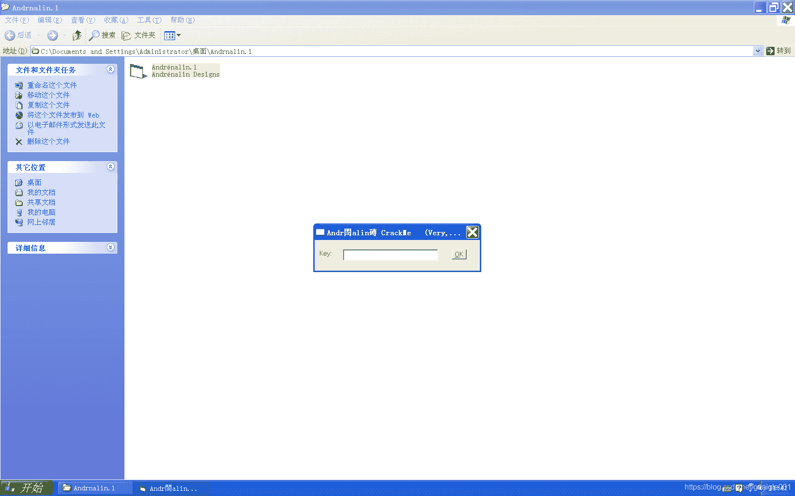

<!--yml
category: crackme160
date: 2022-04-27 18:17:21
-->

# CrackMe160 学习笔记 之 008_一剑名动江湖的博客-CSDN博客

> 来源：[https://blog.csdn.net/guaigle001/article/details/104105461](https://blog.csdn.net/guaigle001/article/details/104105461)

## 前言

这个程序需要我们写出正确的**KEY**。

打开程序甚至乱码。


由于过于简单，就来水一下博客。

给你一个表情自己体会。


## 分析

```
00401CD0   > \55            push    ebp
00401CD1   .  8BEC          mov     ebp, esp
00401D70   >  8B4D D8       mov     ecx, dword ptr [ebp-28]
00401D73   .  51            push    ecx
00401D74   .  68 541A4000   push    00401A54                         ;  UNICODE "SynTaX 2oo1"
00401D79   .  FF15 08314000 call    dword ptr [<&MSVBVM50.__vbaStrCm>;  MSVBVM50.__vbaStrCmp
00401D7F   .  8BF8          mov     edi, eax
00401D81   .  8D4D D8       lea     ecx, dword ptr [ebp-28]
00401D84   .  F7DF          neg     edi
00401D86   .  1BFF          sbb     edi, edi
00401D88   .  47            inc     edi
00401D89   .  F7DF          neg     edi
00401D9A   .  66:3BFE       cmp     di, si
00401D9D   .  0F84 A0000000 je      00401E43
00401DD3   .  C785 7CFFFFFF>mov     dword ptr [ebp-84], 00401AC4     ;  UNICODE "SuCCESFul !"
00401DDD   .  899D 74FFFFFF mov     dword ptr [ebp-8C], ebx
00401DE3   .  FFD7          call    edi                              ;  <&MSVBVM50.__vbaVarDup>
00401DE5   .  8D55 84       lea     edx, dword ptr [ebp-7C]
00401DE8   .  8D4D C4       lea     ecx, dword ptr [ebp-3C]
00401DEB   .  C745 8C 701A4>mov     dword ptr [ebp-74], 00401A70     ;  UNICODE "RiCHtiG ! ...nun weiter zu CrackMe 2 !"
00401E6D   .  C785 7CFFFFFF>mov     dword ptr [ebp-84], 00401B44     ;  UNICODE "leider NeiN !"
00401E77   .  899D 74FFFFFF mov     dword ptr [ebp-8C], ebx
00401E7D   .  FFD7          call    edi                              ;  <&MSVBVM50.__vbaVarDup>
00401E7F   .  8D55 84       lea     edx, dword ptr [ebp-7C]
00401E82   .  8D4D C4       lea     ecx, dword ptr [ebp-3C]
00401E85   .  C745 8C E01A4>mov     dword ptr [ebp-74], 00401AE0     ;  UNICODE "Leider Falsch !  Schau noch mal genau nach ..."
00401F41   .  C2 0400       retn    4 
```

其实就是将字符串 **“SynTaX 2oo1”** 和输入字符做比较，相等就跳出**Successful**的弹窗。