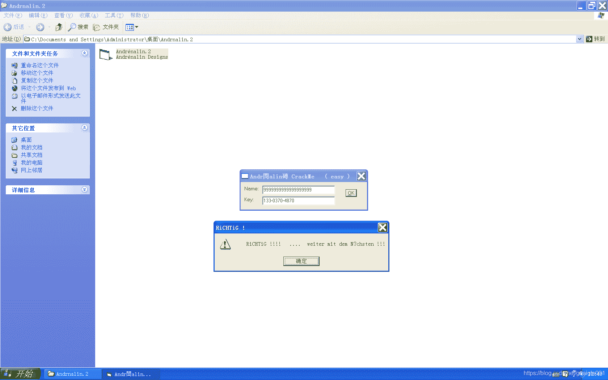
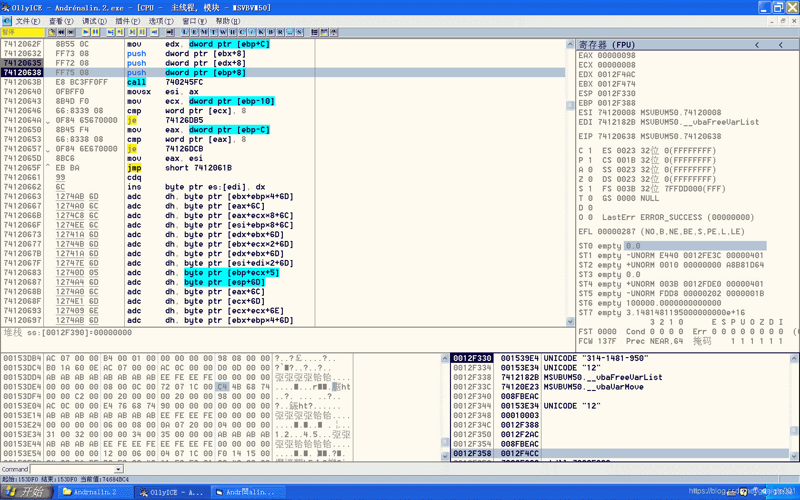

<!--yml
category: crackme160
date: 2022-04-27 18:17:19
-->

# CrackMe160 学习笔记 之 009_一剑名动江湖的博客-CSDN博客

> 来源：[https://blog.csdn.net/guaigle001/article/details/104124220](https://blog.csdn.net/guaigle001/article/details/104124220)

## 前言

这个程序同样需要我们写出正确的KEY，是008的升级版。

附上一张攻破后的图。



## 思路

首先输入任意字符，来到**验证函数**处。

```
004022AE   .  FF15 48414000 call    dword ptr [<&MSVBVM50.__vbaVarTs>; \__vbaVarTstEq 
```

看函数名猜测是判断两个字符串是否相等。

但是观察参数，并没有看到**明显**的字符串比较，继续跟进。

如图。


由此得出**name**和**key**。

重新把程序跑到验证函数之前，继续**观察堆栈**。

```
0012F4B4  |001539E4  UNICODE "314-1481-950" 
```

发现**key**已经生成了。

接下来对 **0x0012F4B4** 处下内存断点，把程序重新跑起来，统统断下。

分析起来就很方便了。

## 分析

由于VB生成了很多垃圾指令以及大量的跳转，**下面只展示关键代码**。

### 主要程序

```
00401FF0   > \55            push    ebp
00401FF1   .  8BEC          mov     ebp, esp
00402033   .  33F6          xor     esi, esi                         ;  esi清零
00402092   .  FF92 A0000000 call    dword ptr [edx+A0]               ;  获取name
00402098   .  3BC6          cmp     eax, esi
004020AE   >  8B45 A8       mov     eax, dword ptr [ebp-58]          ;  name
004020EF   .  51            push    ecx                              ; /Step8
004020F0   .  8D45 94       lea     eax, dword ptr [ebp-6C]          ; |
004020F3   .  BB 02000000   mov     ebx, 2                           ; |
004020F8   .  52            push    edx                              ; |/var18
004020F9   .  50            push    eax                              ; ||retBuffer8
004020FA   .  899D 54FFFFFF mov     dword ptr [ebp-AC], ebx          ; ||
00402100   .  899D 44FFFFFF mov     dword ptr [ebp-BC], ebx          ; ||
00402106   .  FF15 18414000 call    dword ptr [<&MSVBVM50.__vbaLenVa>; |\获取字符串长度
0040210C   .  8D8D 44FFFFFF lea     ecx, dword ptr [ebp-BC]          ; |
00402112   .  50            push    eax                              ; |End8
00402113   .  8D95 E8FEFFFF lea     edx, dword ptr [ebp-118]         ; |
00402119   .  51            push    ecx                              ; |Start8
0040211A   .  8D85 F8FEFFFF lea     eax, dword ptr [ebp-108]         ; |
00402120   .  52            push    edx                              ; |TMPend8
00402121   .  8D4D DC       lea     ecx, dword ptr [ebp-24]          ; |
00402124   .  50            push    eax                              ; |TMPstep8
00402125   .  51            push    ecx                              ; |Counter8
00402126   .  FF15 20414000 call    dword ptr [<&MSVBVM50.__vbaVarFo>; \__vbaVarForInit
0040212C   .  8B3D 04414000 mov     edi, dword ptr [<&MSVBVM50.__vba>;  MSVBVM50.__vbaFreeVarList
00402132   >  85C0          test    eax, eax
00402134   .  0F84 9C000000 je      004021D6                         ;  eax为0时结束循环
0040213A   .  8D55 94       lea     edx, dword ptr [ebp-6C]
0040213D   .  8D45 DC       lea     eax, dword ptr [ebp-24] 
00402140   .  52            push    edx
00402141   .  50            push    eax
00402142   .  C745 9C 01000>mov     dword ptr [ebp-64], 1
00402149   .  895D 94       mov     dword ptr [ebp-6C], ebx
0040214C   .  FF15 90414000 call    dword ptr [<&MSVBVM50.__vbaI4Var>;  MSVBVM50.__vbaI4Var
00402152   .  8D4D BC       lea     ecx, dword ptr [ebp-44]          ; |
00402155   .  50            push    eax                              ; |Start
00402156   .  8D55 84       lea     edx, dword ptr [ebp-7C]          ; |
00402159   .  51            push    ecx                              ; |dString8
0040215A   .  52            push    edx                              ; |RetBUFFER
0040215B   .  FF15 38414000 call    dword ptr [<&MSVBVM50.#632>]     ; \rtcMidCharVar
00402161   .  8D45 84       lea     eax, dword ptr [ebp-7C]          ;  12008
00402164   .  8D4D A8       lea     ecx, dword ptr [ebp-58]          ;  0 ????
00402167   .  50            push    eax                              ; /String8
00402168   .  51            push    ecx                              ; |ARG2
00402169   .  FF15 70414000 call    dword ptr [<&MSVBVM50.__vbaStrVa>; \__vbaStrVarVal
0040216F   .  50            push    eax                              ; /String
00402170   .  FF15 0C414000 call    dword ptr [<&MSVBVM50.#516>]     ; \rtcAnsiValueBstr
00402176   .  66:8985 4CFFF>mov     word ptr [ebp-B4], ax            ;  从字符串第一个字符向后取
0040217D   .  8D55 CC       lea     edx, dword ptr [ebp-34]
00402180   .  8D85 44FFFFFF lea     eax, dword ptr [ebp-BC]
00402186   .  52            push    edx                              ; /var18
00402187   .  8D8D 74FFFFFF lea     ecx, dword ptr [ebp-8C]          ; |
0040218D   .  50            push    eax                              ; |var28
0040218E   .  51            push    ecx                              ; |saveto8
0040218F   .  899D 44FFFFFF mov     dword ptr [ebp-BC], ebx          ; |
00402195   .  FF15 94414000 call    dword ptr [<&MSVBVM50.__vbaVarAd>; \求和
0040219B   .  8BD0          mov     edx, eax
0040219D   .  8D4D CC       lea     ecx, dword ptr [ebp-34]
004021A0   .  FFD6          call    esi                              ;  将求和后的数赋值给[0x0012F4B4]
004021A2   .  8D4D A8       lea     ecx, dword ptr [ebp-58]
004021A5   .  FF15 B8414000 call    dword ptr [<&MSVBVM50.__vbaFreeS>;  MSVBVM50.__vbaFreeStr
004021AB   .  8D55 84       lea     edx, dword ptr [ebp-7C]
004021AE   .  8D45 94       lea     eax, dword ptr [ebp-6C]
004021B1   .  52            push    edx
004021B2   .  50            push    eax
004021B3   .  53            push    ebx
004021B4   .  FFD7          call    edi
004021B6   .  83C4 0C       add     esp, 0C
004021B9   .  8D8D E8FEFFFF lea     ecx, dword ptr [ebp-118]
004021BF   .  8D95 F8FEFFFF lea     edx, dword ptr [ebp-108]
004021C5   .  8D45 DC       lea     eax, dword ptr [ebp-24]
004021C8   .  51            push    ecx                              ; /TMPend8
004021C9   .  52            push    edx                              ; |TMPstep8
004021CA   .  50            push    eax                              ; |Counter8
004021CB   .  FF15 AC414000 call    dword ptr [<&MSVBVM50.__vbaVarFo>; \指向下一个字符
004021D1   .^ E9 5CFFFFFF   jmp     00402132
004021D6   >  8D4D CC       lea     ecx, dword ptr [ebp-34] 
004021D9   .  8D95 54FFFFFF lea     edx, dword ptr [ebp-AC] 
004021DF   .  51            push    ecx                              ; /var18
004021E0   .  8D45 94       lea     eax, dword ptr [ebp-6C]          ; |
004021E3   .  52            push    edx                              ; |var28
004021E4   .  50            push    eax                              ; |SaveTo8
004021E5   .  C785 5CFFFFFF>mov     dword ptr [ebp-A4], 499602D2     ; |
004021EF   .  C785 54FFFFFF>mov     dword ptr [ebp-AC], 3            ; |
004021F9   .  FF15 5C414000 call    dword ptr [<&MSVBVM50.__vbaVarMu>; \将求和后的字符与0x499602D2相乘
004021FF   .  8BD0          mov     edx, eax
00402201   .  8D4D CC       lea     ecx, dword ptr [ebp-34]
00402204   .  FFD6          call    esi
00402206   .  8B1D A0414000 mov     ebx, dword ptr [<&MSVBVM50.__vba>;  MSVBVM50.__vbaMidStmtVar
0040222F   .  FFD3          call    ebx                              ;  对验证码第一次运算; <&MSVBVM50.__vbaMidStmtVar>
00402254   .  FFD3          call    ebx                              ;  对验证码第二次运算
00402292   >  8B45 A8       mov     eax, dword ptr [ebp-58]          ;  获取输入的key
00402295   .  8D4D CC       lea     ecx, dword ptr [ebp-34]
00402298   .  8945 9C       mov     dword ptr [ebp-64], eax
0040229B   .  8D45 94       lea     eax, dword ptr [ebp-6C]
0040229E   .  50            push    eax                              ; /var18
0040229F   .  51            push    ecx                              ; |var28
004022A0   .  C745 A8 00000>mov     dword ptr [ebp-58], 0            ; |
004022A7   .  C745 94 08800>mov     dword ptr [ebp-6C], 8008         ; |
004022AE   .  FF15 48414000 call    dword ptr [<&MSVBVM50.__vbaVarTs>; \__vbaVarTstEq
004022CB   .  0F84 C0000000 je      00402391                         ;  关键跳
00402308   .  C785 4CFFFFFF>mov     dword ptr [ebp-B4], 00401CA8     ;  UNICODE "RiCHTiG !"
00402312   .  C785 44FFFFFF>mov     dword ptr [ebp-BC], 8
0040231C   .  FFD3          call    ebx                              ;  <&MSVBVM50.__vbaVarDup>
0040231E   .  8D95 54FFFFFF lea     edx, dword ptr [ebp-AC]
00402324   .  8D4D 94       lea     ecx, dword ptr [ebp-6C]
00402327   .  C785 5CFFFFFF>mov     dword ptr [ebp-A4], 00401C3C     ;  UNICODE "  RiCHTiG !!!!   ....  weiter mit dem N"
00402355   .  FF15 28414000 call    dword ptr [<&MSVBVM50.#595>]     ;  MSVBVM50.rtcMsgBox
004023C2   .  C785 4CFFFFFF>mov     dword ptr [ebp-B4], 00401D9C     ;  UNICODE "LEiDER Falsch !  "
004023CC   .  C785 44FFFFFF>mov     dword ptr [ebp-BC], 8
004023D6   .  FFD3          call    ebx                              ;  <&MSVBVM50.__vbaVarDup>
004023D8   .  8D95 54FFFFFF lea     edx, dword ptr [ebp-AC]
004023DE   .  8D4D 94       lea     ecx, dword ptr [ebp-6C]
004023E1   .  C785 5CFFFFFF>mov     dword ptr [ebp-A4], 00401CC0     ;  UNICODE "Leider Falsch!   Nochmal veruschen ! Wenn Du es nicht schaffen solltest, schreib mir !  Andrenalin@g"
0040240F   .  FF15 28414000 call    dword ptr [<&MSVBVM50.#595>]     ;  MSVBVM50.rtcMsgBox
0040248E   .  C3            retn 
```

### 求和

```
74120ECC >  55              push    ebp
74120F33    FF2495 D70F1274 jmp     dword ptr [edx*4+74120FD7]
74127AFD    8B4D 10         mov     ecx, dword ptr [ebp+10]                  ; ecx = 0x0012F4AC
74127B00    0FBF46 08       movsx   eax, word ptr [esi+8]                    ; 当前字符
74127B04    0FBF49 08       movsx   ecx, word ptr [ecx+8]                    ; ecx = [0x0012F4B4]
74127B08    03C8            add     ecx, eax                                 ; ecx = ecx + eax
74127B0A    0FBFC1          movsx   eax, cx                                  ; 求和，保存结果在[0x0012F4B4]中
74127B0D    3BC1            cmp     eax, ecx
74127B0F    0F85 57030000   jnz     74127E6C
74127B15    66:BF 0200      mov     di, 2
74127B19    66:894B 08      mov     word ptr [ebx+8], cx
74127B1D  ^ E9 7994FFFF     jmp     74120F9B
74120FA0    5F              pop     edi
74120FA1    5E              pop     esi
74120FA2    5B              pop     ebx
74120FA3    8BE5            mov     esp, ebp
74120FA5    5D              pop     ebp
74120FA6    C2 0C00         retn    0C 
```

依次将字符串中所有字符累加求和。

### 将计算后的数赋值给[0x0012F4B4]

```
74120E23 >  56              push    esi
74120E24    57              push    edi
74120E38    75 49           jnz     short 74120E83
74120E83    8B4F 08         mov     ecx, dword ptr [edi+8]                   ; name
74120E8B    894E 08         mov     dword ptr [esi+8], ecx                   ; 计算后的值赋给0x0012F4B4
74120E9D    8BC6            mov     eax, esi
74120E9F    5F              pop     edi
74120EA0    5E              pop     esi
74120EA1    C3              retn 
```

其中，有用的指令就 ***mov dword ptr [esi+8], ecx*** 这一条。

### 乘法

```
74121986 >  55              push    ebp
74121987    33C0            xor     eax, eax
74121989    8BEC            mov     ebp, esp
741219F2    FF2495 A51A1274 jmp     dword ptr [edx*4+74121AA5]
74121A1B    0FBF4F 08       movsx   ecx, word ptr [edi+8]                    ; 取出0x0012F4B4存放的数到ecx中
74121A1F    56              push    esi
74121A20    FF73 08         push    dword ptr [ebx+8]
74121A23    51              push    ecx
74121A24    E8 1DCCF3FF     call    7405E646 
```

#### 7405E646 函数内部

```
7405E647    8BEC            mov     ebp, esp
7405E649    8B45 08         mov     eax, dword ptr [ebp+8]
7405E64C    F76D 0C         imul    dword ptr [ebp+C]                        ; eax = eax * 0x499602D2
7405E64F    8B4D 10         mov     ecx, dword ptr [ebp+10]
7405E652    0F80 2CC70300   jo      7409AD84                                 ; 溢出跳转
7405E658    66:C701 0300    mov     word ptr [ecx], 3
7405E65D    8941 08         mov     dword ptr [ecx+8], eax
7405E660    C9              leave
7405E661    C2 0C00         retn    0C 
```

#### 溢出时

```
7409AD84    52              push    edx
7409AD85    50              push    eax
7409AD86    DF2C24          fild    qword ptr [esp]                          ; 取溢出后的乘积值压入到ST0中
7409AD89    66:C701 0500    mov     word ptr [ecx], 5
7409AD8E    DD59 08         fstp    qword ptr [ecx+8]                        ; 弹出到[ecx+8] 中
7409AD91    66:83C4 08      add     sp, 8
7409AD95  ^ E9 C638FCFF     jmp     7405E660
7405E660    C9              leave
7405E661    C2 0C00         retn    0C 
```

由于乘数为**0x499602D2**，很容易溢出。

如果**溢出**，就用**64位数**来保存结果。

### 第一次计算key

```
740FF697 >  55              push    ebp
740FF698    8B4C24 0C       mov     ecx, dword ptr [esp+C]
740FF69C    8BEC            mov     ebp, esp
740FF6B6    E8 04000000     call    __vbaMidStmtVarB
740FF6BB    5D              pop     ebp
740FF6BC    C2 1000         retn    10 
```

#### 进入函数vbaMidStmtVarB

```
740FF6BF >  833D 64F01274 0>cmp     dword ptr [7412F064], 0
740FF6C6    55              push    ebp
740FF6C7    8BEC            mov     ebp, esp
740FF6DF    74 5F           je      short 740FF740                   ; 跳转
740FF740    66:3D 0800      cmp     ax, 8
740FF744   /74 09           je      short 740FF74F                   ; 不跳转
740FF746   |6A 08           push    8
740FF748   |57              push    edi
740FF749   |57              push    edi
740FF74A   |E8 3762F7FF     call    74075986 
```

#### 进入函数74075986

```
74075986    55              push    ebp
74075987    8BEC            mov     ebp, esp
74075989    83EC 20         sub     esp, 20
7407598C    8D45 E0         lea     eax, dword ptr [ebp-20]
7407598F    50              push    eax
74075990    50              push    eax
74075991    FF75 10         push    dword ptr [ebp+10]
74075994    FF75 0C         push    dword ptr [ebp+C]
74075997    FF75 08         push    dword ptr [ebp+8]
7407599A    E8 F457FCFF     call    7403B193
7407599F    50              push    eax
740759A0    E8 E059FBFF     call    7402B385                         ; 这个函数什么事情都没做
740759A5    8BE5            mov     esp, ebp
740759A7    5D              pop     ebp
740759A8    C2 0C00         retn    0C
740759AB    8B41 14         mov     eax, dword ptr [ecx+14]
740759AE    FF70 08         push    dword ptr [eax+8]
740759B1    E8 0D760000     call    7407CFC3
740759B6    8B40 0C         mov     eax, dword ptr [eax+C]
740759B9    C3              retn
740759BA    56              push    esi
740759BB    8B7424 08       mov     esi, dword ptr [esp+8]
740759BF    8B46 04         mov     eax, dword ptr [esi+4]
740759C2    48              dec     eax
740759C3    8946 04         mov     dword ptr [esi+4], eax
740759C6    74 04           je      short 740759CC
740759C8    5E              pop     esi
740759C9    C2 0400         retn    4 
```

#### 进入函数7403B193

```
7403B193    55              push    ebp
7403B194    33C0            xor     eax, eax
7403B196    8BEC            mov     ebp, esp
7403B1D7    E8 B1010000     call    rtcGetCurrentCalendar
7403B1F2    FF15 3C1A0274   call    dword ptr [<&OLEAUT32.#147>]     ; OLEAUT32.VariantChangeTypeEx
7403B39C    C3              retn 
```

#### 进入函数OLEAUT32.VariantChangeTypeEx

```
770F6AA8    55              push    ebp
770F6AA9    8BEC            mov     ebp, esp
770F6B2F    FF2485 18640F77 jmp     dword ptr [eax*4+770F6418]
7710AC31    DD46 08         fld     qword ptr [esi+8]                ; 内存写入到ST0中
7710AC34    8D45 E8         lea     eax, dword ptr [ebp-18]
7710AC37    50              push    eax
7710AC38    57              push    edi
7710AC39    FF75 10         push    dword ptr [ebp+10]
7710AC3C    51              push    ecx
7710AC3D    51              push    ecx
7710AC3E    DD1C24          fstp    qword ptr [esp]                  ; 从ST0弹出到 0x0012F290 中
7710AC41    E8 0A000000     call    VarBstrFromR8                    ; 浮点数转成字符串
7710AC46  ^ E9 67BFFEFF     jmp     770F6BB2 
```

#### 进入VarBstrFromR8

```
7710AC53    8BEC            mov     ebp, esp
7710AC55    81EC 08050000   sub     esp, 508
7710AC77    DD45 08         fld     qword ptr [ebp+8]                ; 把浮点数压入 浮点寄存器 ST0 中
7710AC7A    6A 0F           push    0F
7710AC7C    53              push    ebx
7710AC7D    57              push    edi
7710AC7E    FF75 10         push    dword ptr [ebp+10]
7710AC81    51              push    ecx
7710AC82    51              push    ecx
7710AC83    DD1C24          fstp    qword ptr [esp]                  ; 弹出到 0x12ED60中
7710AC86    E8 12FEFFFF     call    7710AA9D
7710AC9A    66:C74475 AC 30>mov     word ptr [ebp+esi*2-54], 30
7710ACA1  ^ E9 E5FEFFFF     jmp     7710AB8B 
```

#### 进入函数7710AA9D

```
7710AA9F    55              push    ebp
7710AAA0    8BEC            mov     ebp, esp
7710AB03    E8 4EFFFFFF     call    7710AA56                         ; 把浮点数转成十进制数存入[ebp-58]中
7710AB1C    8D5445 AC       lea     edx, dword ptr [ebp+eax*2-54]    ; 新生成key的地址
7710AB20    8A4C35 A0       mov     cl, byte ptr [ebp+esi-60]        ; 从[ebp-58]中依次向前取字符
7710AB24    8AC1            mov     al, cl                           ; al = cl
7710AB26    C0E8 04         shr     al, 4                            ; 取字符的十位
7710AB29    66:0FB6C0       movzx   ax, al
7710AB2D    80E1 0F         and     cl, 0F                           ; 取字符的个位
7710AB30    83C0 30         add     eax, 30                          ; 转成ASCII码
7710AB33    66:8902         mov     word ptr [edx], ax               ; 十位赋值到新key中
7710AB36    66:0FB6C1       movzx   ax, cl                           ; 用ax是因为是宽字符，占两个字节
7710AB3A    42              inc     edx
7710AB3B    42              inc     edx                              ; edx = edx + 2 ; 宽字符，取下一个数
7710AB3C    83C0 30         add     eax, 30
7710AB3F    66:8902         mov     word ptr [edx], ax               ; 个位赋值到新key中
7710AB42    42              inc     edx
7710AB43    42              inc     edx                              ; edx = edx + 2 ; 宽字符，取下一个数
7710AB44    4E              dec     esi                              ; esi = esi - 1 ; 取前一个字符，小端计数法
7710ABCE    66:C745 AC 2D00 mov     word ptr [ebp-54], 2D            ; 用“-”覆盖字符串的一位
7710ABD4    0F84 CA8D0100   je      771239A4 
```

由此得到新的key。

#### 进入函数__vbaMidStmtBstrB

```
740FF7A6    8B45 18         mov     eax, dword ptr [ebp+18]          ; 取字符串地址
740FF7A9    BF 00000000     mov     edi, 0
740FF7AE    8B18            mov     ebx, dword ptr [eax]             ; 地址赋值给0x0012F4B4 
```

key值最终存放在0x0012F4B4中。

第二次计算和第一次基本一致，就不啰嗦了。

## 注册机代码

```
#include<stdio.h>
int main()
{
  char* name;
  int len=0;
  long eax=0;
  printf("name:");
  scanf("%[^\n]",name);
  len=strlen(name);
  for(int i=0;i<len;i++)
    eax+=name[i];
  eax*=0x499602D2;
  sprintf(name,"%ld",eax);
  name[3]=0x2D;
  name[8]=0x2D;
  printf("key:%s",name);
  return 0;
} 
```