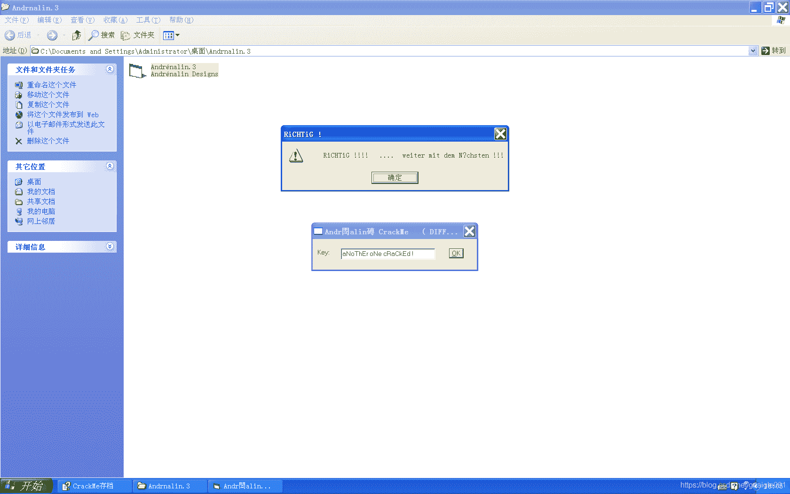
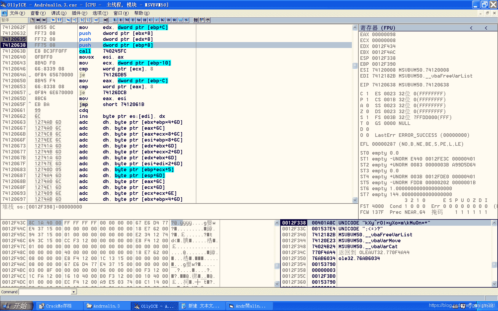

<!--yml
category: crackme160
date: 2022-04-27 18:17:17
-->

# CrackMe160 学习笔记 之 010_一剑名动江湖的博客-CSDN博客

> 来源：[https://blog.csdn.net/guaigle001/article/details/104126577](https://blog.csdn.net/guaigle001/article/details/104126577)

## 前言

这个程序是009的升级版。

似乎还加了**反调试**的功能。

不过，并不妨碍我们攻破它。

如图。



## 思路

在验证函数处下断点。

如图。

观察发现是把输入转换后的字符串和**固定的字符串**比较。

同样的套路，观察堆栈，这个程序又用**0x0012F4B4**来保存生成后的新字符串。

继续下**内存断点**，轻松解决。

又可以水一篇博客了。


## 分析

这个程序的代码和上个程序基本一致，所以不分析了，就看一下不同的地方。

```
00401FAA   .  FF15 08414000 call    dword ptr [<&MSVBVM50.#516>]     ; \rtcAnsiValueBstr
00401FB0   .  66:05 0A00    add     ax, 0A                           ;  ax = ax + 0x0A
00401FB4   .  0F80 B0020000 jo      0040226A
00401FBA   .  0FBFD0        movsx   edx, ax
00401FBD   .  52            push    edx
00401FBE   .  FF15 70414000 call    dword ptr [<&MSVBVM50.#537>]     ;  MSVBVM50.rtcBstrFromAnsi
00401FC4   .  8985 7CFFFFFF mov     dword ptr [ebp-84], eax
00401FCA   .  8D45 CC       lea     eax, dword ptr [ebp-34]
00401FCD   .  8D8D 74FFFFFF lea     ecx, dword ptr [ebp-8C]
00401FD3   .  50            push    eax
00401FD4   .  8D95 64FFFFFF lea     edx, dword ptr [ebp-9C]
00401FDA   .  51            push    ecx
00401FDB   .  52            push    edx
00401FDC   .  C785 74FFFFFF>mov     dword ptr [ebp-8C], 8
00401FE6   .  FFD3          call    ebx
00401FE8   .  8BD0          mov     edx, eax
00401FEA   .  8D4D CC       lea     ecx, dword ptr [ebp-34]
00401FED   .  FFD6          call    esi 
```

把字符串每个字符都加上**0x0A**生成新字符串。

## 注册机代码

```
#include<stdio.h>
int main()
{
  char key[]="kXy^rO|*yXo*m\\kMuOn*+"; 
  int len=strlen(key);
    for(int i=0;i<len;i++)
    {
         key[i]-=0x0A;
    }
   printf("key:%s",key);
  return 0;
} 
```