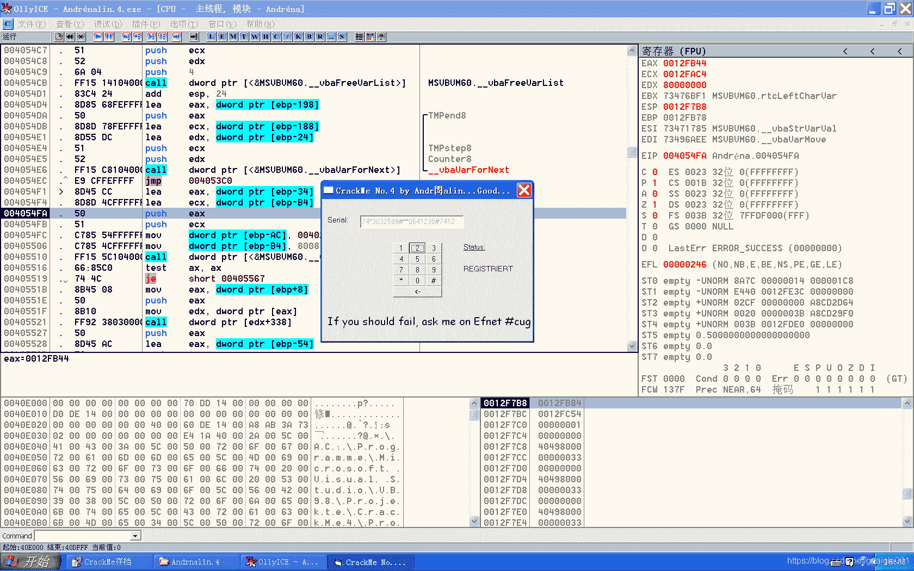
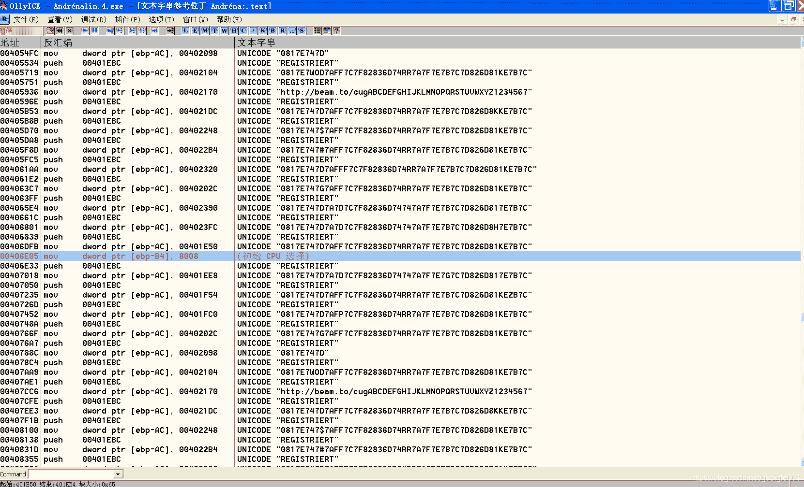
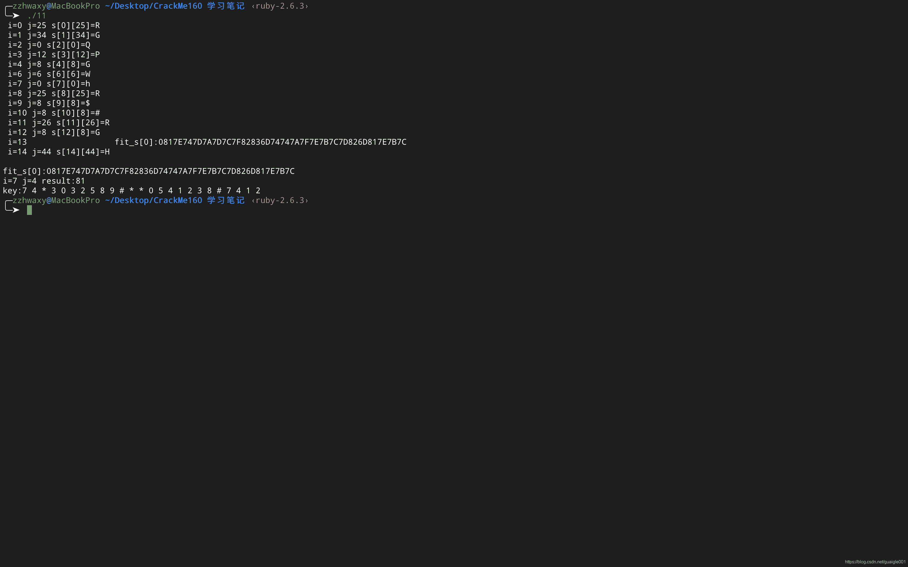

<!--yml
category: crackme160
date: 2022-04-27 18:17:15
-->

# CrackMe160 学习笔记 之 011_一剑名动江湖的博客-CSDN博客

> 来源：[https://blog.csdn.net/guaigle001/article/details/104147030](https://blog.csdn.net/guaigle001/article/details/104147030)

## 前言

这个程序并不算难，但是有点恶心人。

先附上一张成功注册后的图片。



## 思路

搜索字符串。


可以看到大量的字符串，这也是等会破解的关建。

进入程序**验证函数**，在入口处下断点，发现**一直断下**。

说明这个程序**每一秒都对输入做了判断**。

这样的话下**调试**起来挺方便的。

取消断点的话**ATL+B** 取消，需要用的时候再把断点加回来。

翻了一下主体，这部分指令又臭又长，而且大部分是相同的。

估计是作者这样写是用来恶心人的。

继续同样的套路，在**验证函数**处下**断点**。

```
7710A836    E8 31FFFFFF     call    VarBstrCmp 
```

可以看到**输入的字符串最后生成的长度不断变化**。

这部分由前面**取的字符串长度**影响。

由于取的字符串长度**从1增加到8再减小到1**，所以这里也是这么变化的，一轮循环是**15**次。

继续在 **0x0012FB4C**处可以找到计算后新字符串的位置。

这里就**不下**内存断点了，因为代码太长了，改成**手动观察**。

## 分析

由于代码大都相同，这里只分析**第一次验证的时候**。

### 第一次验证

```
00404650   > \55            push    ebp
00404651   .  8BEC          mov     ebp, esp
00404653   .  83EC 0C       sub     esp, 0C
00404670   .  56            push    esi
00404671   .  57            push    edi
004047BD   >  8B45 B8       mov     eax, dword ptr [ebp-48]
004047C0   .  50            push    eax
004047C1   .  68 2C1E4000   push    00401E2C
004047C6   .  FF15 58104000 call    dword ptr [<&MSVBVM60.__vbaStrCmp>]    ;  和空字符串作比较,但是输入不可能为空
004047ED   . /74 25         je      short 00404814                         ;  必跳转
00404891   .  8B3D 08104000 mov     edi, dword ptr [<&MSVBVM60.__vbaVarMov>;  复制字符串
004048AA   .  FFD7          call    edi                              ;  <&MSVBVM60.__vbaVarMove>
004048B5   .  89B5 54FFFFFF mov     dword ptr [ebp-AC], esi                ;  存放要比较字符串的地址
004048CF   .  FFD7          call    edi
004048D1   .  B8 01000000   mov     eax, 1
004048D6   .  8D95 4CFFFFFF lea     edx, dword ptr [ebp-B4]
004048DC   .  8985 54FFFFFF mov     dword ptr [ebp-AC], eax
004048E2   .  8985 44FFFFFF mov     dword ptr [ebp-BC], eax
004048E8   .  8D45 BC       lea     eax, dword ptr [ebp-44]
004048EB   .  52            push    edx                              ; /Step8
004048EC   .  8D4D 9C       lea     ecx, dword ptr [ebp-64]          ; |
004048EF   .  50            push    eax                              ; |/var18
004048F0   .  51            push    ecx                              ; ||retBuffer8
004048F1   .  89B5 4CFFFFFF mov     dword ptr [ebp-B4], esi          ; ||
004048F7   .  89B5 3CFFFFFF mov     dword ptr [ebp-C4], esi          ; ||
004048FD   .  FF15 30104000 call    dword ptr [<&MSVBVM60.__vbaLenVa>; |\__vbaLenVar
00404903   .  50            push    eax                              ; |End8
00404904   .  8D95 3CFFFFFF lea     edx, dword ptr [ebp-C4]          ; |
0040490A   .  8D85 08FFFFFF lea     eax, dword ptr [ebp-F8]          ; |
00404910   .  52            push    edx                              ; |Start8
00404911   .  8D8D 18FFFFFF lea     ecx, dword ptr [ebp-E8]          ; |
00404917   .  50            push    eax                              ; |TMPend8
00404918   .  8D55 DC       lea     edx, dword ptr [ebp-24]          ; |
0040491B   .  51            push    ecx                              ; |TMPstep8
0040491C   .  52            push    edx                              ; |Counter8
0040491D   .  FF15 38104000 call    dword ptr [<&MSVBVM60.__vbaVarFo>; \__vbaVarForInit
00404923   .  8B35 80104000 mov     esi, dword ptr [<&MSVBVM60.__vba>;  MSVBVM60.__vbaStrVarVal
00404929   .  8B1D B4104000 mov     ebx, dword ptr [<&MSVBVM60.#617>>;  MSVBVM60.rtcLeftCharVar
0040492F   >  85C0          test    eax, eax
00404931   .  0F84 29010000 je      00404A60
00404937   .  8D45 BC       lea     eax, dword ptr [ebp-44]
0040493A   .  6A 01         push    1                                               ;  取的字符数量
0040493C   .  8D4D 8C       lea     ecx, dword ptr [ebp-74]
0040493F   .  50            push    eax
00404940   .  51            push    ecx
00404941   .  FFD3          call    ebx                                             ;  取从左数前n个字符,字符串保存在ebp-6c中
00404943   .  8D55 8C       lea     edx, dword ptr [ebp-74]
00404946   .  8D45 B0       lea     eax, dword ptr [ebp-50]
00404949   .  52            push    edx
0040494A   .  50            push    eax
0040494B   .  FFD6          call    esi
0040494D   .  50            push    eax
0040494E   .  FF15 D8104000 call    dword ptr [<&MSVBVM60.#581>]     ;  MSVBVM60.rtcR8ValFromBstr
00404954   .  DD9D 34FFFFFF fstp    qword ptr [ebp-CC]               ;  弹出到ebp-CC中
0040495A   .  8D4D 9C       lea     ecx, dword ptr [ebp-64]
0040495D   .  8D55 DC       lea     edx, dword ptr [ebp-24]
00404960   .  51            push    ecx
00404961   .  52            push    edx
00404962   .  C745 A4 01000>mov     dword ptr [ebp-5C], 1
00404969   .  C745 9C 02000>mov     dword ptr [ebp-64], 2
00404970   .  FF15 AC104000 call    dword ptr [<&MSVBVM60.__vbaI4Var>;  MSVBVM60.__vbaI4Var
00404976   .  50            push    eax
00404977   .  8D45 BC       lea     eax, dword ptr [ebp-44]
0040497A   .  8D4D B8       lea     ecx, dword ptr [ebp-48]
0040497D   .  50            push    eax
0040497E   .  51            push    ecx
0040497F   .  FFD6          call    esi
00404981   .  50            push    eax
00404982   .  FF15 4C104000 call    dword ptr [<&MSVBVM60.#631>]     ;  MSVBVM60.rtcMidCharBstr
00404988   .  8BD0          mov     edx, eax
0040498A   .  8D4D B4       lea     ecx, dword ptr [ebp-4C]
0040498D   .  FF15 BC104000 call    dword ptr [<&MSVBVM60.__vbaStrMo>;  MSVBVM60.__vbaStrMove
00404993   .  50            push    eax                              ; /String
00404994   .  FF15 20104000 call    dword ptr [<&MSVBVM60.#516>]                   ; \获取输入字符串第n个字符ASCII码,循环
0040499A   .  0FBFD0        movsx   edx, ax
0040499D   .  8995 FCFCFFFF mov     dword ptr [ebp-304], edx
004049A3   .  C785 7CFFFFFF>mov     dword ptr [ebp-84], 5
004049AD   .  DB85 FCFCFFFF fild    dword ptr [ebp-304]                            ;  将输入的字符串第n个字符的数值压入ST0中
004049B3   .  DD9D F4FCFFFF fstp    qword ptr [ebp-30C]                            ;  弹出
004049B9   .  DD85 F4FCFFFF fld     qword ptr [ebp-30C]                            ;  再压入
004049BF   .  DC85 34FFFFFF fadd    qword ptr [ebp-CC]                             ;  求和
004049C5   .  DD5D 84       fstp    qword ptr [ebp-7C]                             ;  弹出到ebp-7c中
004049C8   .  DFE0          fstsw   ax
004049CA   .  A8 0D         test    al, 0D
004049CC   .  0F85 FA1F0000 jnz     004069CC
004049D2   .  8D85 7CFFFFFF lea     eax, dword ptr [ebp-84]
004049D8   .  50            push    eax
004049D9   .  FF15 94104000 call    dword ptr [<&MSVBVM60.#572>]                   ;  转成16进制字符串
004049DF   .  8D4D CC       lea     ecx, dword ptr [ebp-34]
004049E2   .  8985 74FFFFFF mov     dword ptr [ebp-8C], eax
004049E8   .  8D95 6CFFFFFF lea     edx, dword ptr [ebp-94]
004049EE   .  51            push    ecx
004049EF   .  8D85 5CFFFFFF lea     eax, dword ptr [ebp-A4]
004049F5   .  52            push    edx
004049F6   .  50            push    eax
004049F7   .  C785 6CFFFFFF>mov     dword ptr [ebp-94], 8
00404A01   .  FF15 84104000 call    dword ptr [<&MSVBVM60.__vbaVarCat>]            ;  连接字符串,并在前面补0
00404A07   .  8BD0          mov     edx, eax
00404A09   .  8D4D CC       lea     ecx, dword ptr [ebp-34]
00404A0C   .  FFD7          call    edi
00404A0E   .  8D4D B0       lea     ecx, dword ptr [ebp-50]
00404A11   .  8D55 B4       lea     edx, dword ptr [ebp-4C]
00404A14   .  51            push    ecx
00404A15   .  8D45 B8       lea     eax, dword ptr [ebp-48]
00404A18   .  52            push    edx
00404A19   .  50            push    eax
00404A1A   .  6A 03         push    3
00404A43   .  8D95 08FFFFFF lea     edx, dword ptr [ebp-F8]
00404A49   .  52            push    edx                              ; /TMPend8
00404A4A   .  8D85 18FFFFFF lea     eax, dword ptr [ebp-E8]          ; |
00404A50   .  8D4D DC       lea     ecx, dword ptr [ebp-24]          ; |
00404A53   .  50            push    eax                              ; |TMPstep8
00404A54   .  51            push    ecx                              ; |Counter8
00404A55   .  FF15 C8104000 call    dword ptr [<&MSVBVM60.__vbaVarFo>; \__vbaVarForNext
00404A5B   .^ E9 CFFEFFFF   jmp     0040492F
00404A60   >  8D55 CC       lea     edx, dword ptr [ebp-34]
00404A63   .  8D85 4CFFFFFF lea     eax, dword ptr [ebp-B4]
00404A69   .  52            push    edx                              ; /var18
00404A6A   .  50            push    eax                              ; |var28
00404A6B   .  C785 54FFFFFF>mov     dword ptr [ebp-AC], 00401E50     ; |UNICODE "0817E747D7AFF7C7F82836D74RR7A7F7E7B7C7D826D81KE7B7C"
00404A75   .  C785 4CFFFFFF>mov     dword ptr [ebp-B4], 8008         ; |
00404A7F   .  FF15 5C104000 call    dword ptr [<&MSVBVM60.__vbaVarTs>; \__vbaVarTstEq
00404A85   .  66:85C0       test    ax, ax
00404A88   .  74 4C         je      short 00404AD6
00404A8A   .  8B45 08       mov     eax, dword ptr [ebp+8]
00404A8D   .  50            push    eax
00404A8E   .  8B08          mov     ecx, dword ptr [eax]
00404A90   .  FF91 38030000 call    dword ptr [ecx+338]
00404A96   .  8D55 AC       lea     edx, dword ptr [ebp-54]
00404A99   .  50            push    eax
00404A9A   .  52            push    edx
00404A9B   .  FF15 3C104000 call    dword ptr [<&MSVBVM60.__vbaObjSe>;  MSVBVM60.__vbaObjSet
00404AA1   .  8B08          mov     ecx, dword ptr [eax]
00404AA3   .  68 BC1E4000   push    00401EBC                         ;  UNICODE "REGISTRIERT" 
```

### 取字符串从左数前n个字符

#### 间接调用

```
73476BF1 >  55              push    ebp
73476BF2    8BEC            mov     ebp, esp
73476BF4    83EC 10         sub     esp, 10
73476BF7    8B45 10         mov     eax, dword ptr [ebp+10]                         ; 取出需要取的字符数
73476BFA    56              push    esi                                             ; MSVBVM60.__vbaStrVarVal
73476BFB    03C0            add     eax, eax                                        ; eax = eax * 2;占的字节数，宽字符，每个字符占两个字节
73476BFD    57              push    edi
73476BFE    50              push    eax
73476BFF    8D45 F0         lea     eax, dword ptr [ebp-10]
73476C02    FF75 0C         push    dword ptr [ebp+C]
73476C05    50              push    eax
73476C06    E8 6FFFFFFF     call    rtcLeftVar                                      ; 关键函数
73476C0B    8BF0            mov     esi, eax
73476C0D    8B45 08         mov     eax, dword ptr [ebp+8]
73476C10    8BF8            mov     edi, eax
73476C12    A5              movs    dword ptr es:[edi], dword ptr [esi]
73476C13    A5              movs    dword ptr es:[edi], dword ptr [esi]
73476C14    A5              movs    dword ptr es:[edi], dword ptr [esi]             ; 截取后的新字符串地址赋值到ebp-6c中
73476C15    A5              movs    dword ptr es:[edi], dword ptr [esi]
73476C16    5F              pop     edi
73476C17    5E              pop     esi
73476C18    C9              leave
73476C19    C2 0C00         retn    0C 
```

#### 进入函数rtLeftVar

```
73476B7A >  55              push    ebp
73476B7B    8BEC            mov     ebp, esp
73476B7D    83EC 10         sub     esp, 10
73476B80    56              push    esi
73476B81    57              push    edi
73476B82    FF35 94EF4973   push    dword ptr [7349EF94]
73476B88    FF15 78123973   call    dword ptr [<&KERNEL32.TlsGetValue>]             ; kernel32.TlsGetValue
73476B8E    8D70 50         lea     esi, dword ptr [eax+50]
73476B91    56              push    esi
73476B92    FF75 0C         push    dword ptr [ebp+C]
73476B95    E8 37FFFFFF     call    73476AD1                                        ; 取输入的字符串地址
73476B9A    83F8 FF         cmp     eax, -1
73476B9D    74 37           je      short 73476BD6                                  ; 判断字符串不为空
73476B9F    FF75 10         push    dword ptr [ebp+10]
73476BA2    50              push    eax
73476BA3    E8 7FFFFFFF     call    rtcLeftBstr                                     ; 真正取前n个字符的函数
73476BA8    66:833E 08      cmp     word ptr [esi], 8
73476BAC    8945 F8         mov     dword ptr [ebp-8], eax
73476BAF    66:C745 F0 0800 mov     word ptr [ebp-10], 8
73476BB5    75 0D           jnz     short 73476BC4
73476BB7    FF76 08         push    dword ptr [esi+8]
73476BBA    FF15 F4193973   call    dword ptr [<&OLEAUT32.#6>]                      ; OLEAUT32.SysFreeString
73476BC0    66:8326 00      and     word ptr [esi], 0
73476BC4    8B45 08         mov     eax, dword ptr [ebp+8]
73476BC7    8D75 F0         lea     esi, dword ptr [ebp-10]
73476BCA    8BF8            mov     edi, eax
73476BCC    A5              movs    dword ptr es:[edi], dword ptr [esi]
73476BCD    A5              movs    dword ptr es:[edi], dword ptr [esi]
73476BCE    A5              movs    dword ptr es:[edi], dword ptr [esi]
73476BCF    A5              movs    dword ptr es:[edi], dword ptr [esi]
73476BD0    5F              pop     edi
73476BD1    5E              pop     esi
73476BD2    C9              leave
73476BD3    C2 0C00         retn    0C 
```

#### 进入函数rtcLeftBstr

```
73476B57    FF15 001A3973   call    dword ptr [<&OLEAUT32.#150>]     ; OLEAUT32.SysAllocStringByteLen 
```

#### 进入函数SysAllocStringByteLen

```
770F4C37    55              push    ebp
770F4C6E    75 2B           jnz     short 770F4C9B
770F4C9B    57              push    edi
770F4C9C    8BCB            mov     ecx, ebx
770F4C9E    8BD1            mov     edx, ecx
770F4CA0    C1E9 02         shr     ecx, 2                           ; 右移两位，计算需要复制的次数，4个字节4个字节复制
770F4CA3    8BF8            mov     edi, eax                         ; 要复制的地址
770F4CA5    F3:A5           rep     movs dword ptr es:[edi], dword p>; 依次复制
770F4CA7    8BCA            mov     ecx, edx                         ; 余数赋给ecx
770F4CA9    83E1 03         and     ecx, 3                           ; 不满四个字节，求剩余的次数
770F4CAC    F3:A4           rep     movs byte ptr es:[edi], byte ptr>; 将剩下的字符复制
770F4CAE    5F              pop     edi
770F4CAF  ^ EB BF           jmp     short 770F4C70
770F4C70    C60418 00       mov     byte ptr [eax+ebx], 0            ; 字符串结尾补0 
```

### 连接字符串的关键指令

```
7710A99A    8BCB            mov     ecx, ebx
7710A99C    8BD1            mov     edx, ecx
7710A99E    C1E9 02         shr     ecx, 2
7710A9A1    8BF8            mov     edi, eax
7710A9A3    F3:A5           rep     movs dword ptr es:[edi], dword ptr [esi]
7710A9A5    8BCA            mov     ecx, edx
7710A9A7    83E1 03         and     ecx, 3
7710A9AA    F3:A4           rep     movs byte ptr es:[edi], byte ptr [esi]
7710A9AC    8B4D 08         mov     ecx, dword ptr [ebp+8]
7710A9AF    8B75 0C         mov     esi, dword ptr [ebp+C]
7710A9B2    8D3C03          lea     edi, dword ptr [ebx+eax]
7710A9B5    8BC1            mov     eax, ecx
7710A9B7    C1E9 02         shr     ecx, 2
7710A9BA    F3:A5           rep     movs dword ptr es:[edi], dword ptr [esi]
7710A9BC    8BC8            mov     ecx, eax
7710A9BE    83E1 03         and     ecx, 3
7710A9C1    F3:A4           rep     movs byte ptr es:[edi], byte ptr [esi] 
```

和上面的复制字符串差不多，就不分析了.

感兴趣的可以自己研究一下。

## 注册机代码

如果使用**正向**的方法求解的时间**复杂度太高**了，根本别想算出来。

一开始写的我笔记本风扇呼呼的转。

所以只有用逆向的方法来求解了。

观察所给出的最终生成的字符串，有几个特点。

*   1.转换后的数字为**16**进制，可以排除掉那些奇奇怪怪的字符
*   2.输入字符为 **“0123456789*#”**，所以最终生成的字符串*相邻字符*的差值不可能过大
*   3.生成**key**的长度是固定的，为**51*2=0x66**个字节(原来是**宽字符**，我这里写注册机的时候没用)

我们知道除去**开头的0**，最终50个字符里可能的组合有**1x50，2x25，5x10，7x8**(可能是7个字符长度和8个混合的)。

由于计算后的字符为ASCII码，范围上至少**两个字节**，**1x50** 可以排除

利用**特性2**，差值不可能过大，那么就只剩下**2x25**这一种组合方式了。

#### 补充

**n 为取字符串从左数前n个字符**
**n在1-8之间变化**

| n的值 | 计算后的字符范围 |
| --- | --- |
| 1 | 0x30-0x42 |
| 2 | 0x30-0x9C |
| 3 | 0x30-0x420 |
| 4 | 0x30-0x2748 |
| 5 | 0x30-0x186D8 |
| 6 | 0x30-0xF4278 |
| 7 | 0x30-0x9896B8 |
| 8 | 0x30-0x5F5E138 |

于是开始写注册机。

写这个代码还是花了我一点时间的。

```
#include<stdio.h>
#include<stdlib.h>
#include<math.h>
int main()
{
  char s[][55]={
    "0817E747D7AFF7C7F82836D74RR7A7F7E7B7C7D826D81KE7B7C", \
    "0817E747D7A7D7C7F82836D74747A7F7E7G7C7D826D817E7B7C", \
    "Q817E747D7AFF7C7F82836D74RR7A7F7E7B7C7D826D81KEZB7C", \
    "0817E747D7AFP7C7F82836D74RR7A7F7E7B7C7D826D81KE7B7C", \
    "0817E747G7AFF7C7F82836D74RR7A7F7E7B7C7D826D81KE7B7C", \
    "0817E747D", \
    "0817E7WOD7AFF7C7F82836D74RR7A7F7E7B7C7D826D81KE7B7C", \
    "http://beam.to/cugABCDEFGHIJKLMNOPQRSTUVWXYZ1234567", \
    "0817E747D7AFF7C7F82836D74RR7A7F7E7B7C7D826D8KKE7B7C", \
    "0817E747$7AFF7C7F82836D74RR7A7F7E7B7C7D826D81KE7B7C", \
    "0817E747#7AFF7C7F82836D74RR7A7F7E7B7C7D826D81KE7B7C", \
    "0817E747D7AFFF7C7F82836D74RR7A7F7E7B7C7D826D81KE7B7C", \
    "0817E747G7AFF7C7F82836D74RR7A7F7E7B7C7D826D81KE7B7C", \
    "0817E747D7A7D7C7F82836D74747A7F7E7B7C7D826D817E7B7C", \
    "0817E747D7A7D7C7F82836D74747A7F7E7B7C7D826D8H7E7B7C"
  };
  int v;
  char key[51];
  char fit_s[][55]={0};
  int flag=0;
  int len_fit_s=0;
  int  c;
  int m=0,n=0;
  for(int i=0;i<16;i++)
    {
      for(int j=0;s[i][j]!='\0';j++)
        {

          if(s[i][j]<0x30 || s[i][j] > 0x46 || s[i][j]>0x39 && s[i][j]<0x41)
            {
              flag=1;
              printf(" i=%d j=%d s[%d][%d]=%c \n",i,j,i,j,s[i][j]);
              break;
            }
          else
            flag=0;
        }
      if(!flag && strlen(s[i])==51){
        memcpy(fit_s[len_fit_s],s[i],sizeof(char)*strlen(s[i])); 
        printf(" i=%d                  fit_s[%d]:%s \n",i,len_fit_s,fit_s[len_fit_s]);
        len_fit_s++;
      }
    }
  printf("\n");
  for(int i=0;i<len_fit_s;i++)
    printf("fit_s[%d]:%s\n",i,fit_s[i]);

    for( m=0;m<10;m++)
    {
        for( n=0;n<10;n++)
        {
            if(m*10+n+m+0x30==0x81)
              {
                printf("i=%d j=%d result:%x ",m,n,m*10+n+m+0x30); 
            goto NEXT;
          }
        }
    }
 NEXT:
  printf("\nkey:");
   for(int i=0;i<len_fit_s;i++)
    {
      for(int j=1;j<strlen(fit_s[i]);j+=2)
        {
          c=(fit_s[i][j]-0x30)*16+(fit_s[i][j+1]-0x30>>4)*10+(int)(fit_s[i][j+1]>=0x41?fit_s[i][j+1]-0x41:fit_s[i][j+1]-0x30);
          printf("%c ",c-m*10-n);
        }
      printf("\n");
    }

  return 0;
} 
```

### 运行结果



从而确定**唯一解**。