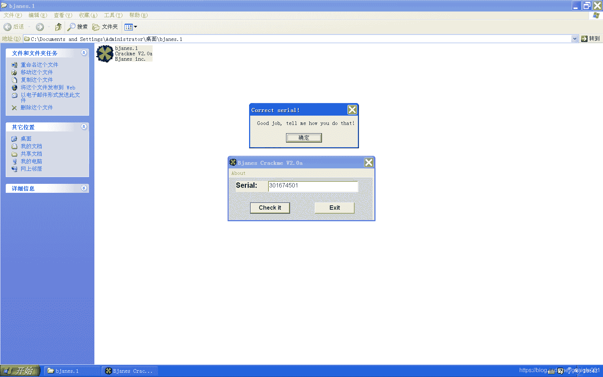
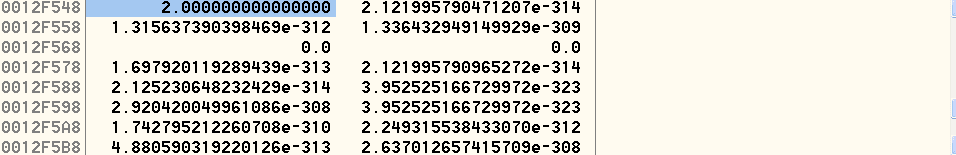
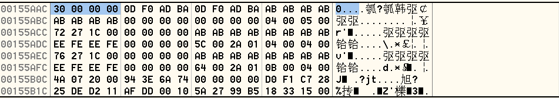

<!--yml
category: crackme160
date: 2022-04-27 18:17:07
-->

# CrackMe160 学习笔记 之 014_一剑名动江湖的博客-CSDN博客

> 来源：[https://blog.csdn.net/guaigle001/article/details/104162318](https://blog.csdn.net/guaigle001/article/details/104162318)

## 前言

这个程序只需写出正确的验证码就行了。

如图。



## 思路

先在验证函数处下断点。

```
004039B6   .  FF15 A0104000   call    dword ptr [<&MSVBVM60.__vbaVarTstNe>] ; \验证字符是否相等的函数 
```

这里从传人的两个**参数+8**的位置找到**真正要比较的字符**。




一个在**0x00155AAC**处，另一个在**0x0012F548**处。

两个数存放的**类型不同**，竟然能够比较也是挺神奇的。

不管这个细节，继续观察程序。

因为只有一个输入框，肯定是和**固定的字符串**做比较。

接下来的任务就是找到这个字符串。

从验证函数处向上观察，看到如下语句。

```
0040398D   .  8B45 D8         mov     eax, dword ptr [ebp-28]               ;  用eax来保存地址ebp-28处存放的字符 
```

说明字符的值是从**ebp-28**赋值过来的，不多说，下**内存断点**。

经过一番查找。

可以确定**ebp-28**的值来自**ebp-18**。

```
004038F1   > \66:8B45 E8      mov     ax, word ptr [ebp-18]                 ;  计数器ebp-18的值赋给ax 
```

重新打开程序，继续下**内存断点**。

```
00403760   .  C745 E8 0100000>mov     dword ptr [ebp-18], 1                 ;  ebp-18初始化为1 
```

发现**ebp-18**有初始值，随着验证次数不断增加，并且长度和输入字符串长度有关。

这样我们就找到了固定的字符串 **“123456789”**，和2异或得到最终的key。

接下来就没什么可分析的了。

## 分析

### 函数主体

```
00403620   > \55            push    ebp
00403621   .  8BEC          mov     ebp, esp
004036BB   .  FF91 A0000000 call    dword ptr [ecx+A0]               ;  字符串地址赋给ebp-1C
004036C1   .  3BC3          cmp     eax, ebx
004036C3   .  DBE2          fclex
004036C5   .  7D 12         jge     short 004036D9
004036D9   > \8B45 E4         mov     eax, dword ptr [ebp-1C]
004036DC   .  50              push    eax                              ; /String
004036DD   .  FF15 08104000   call    dword ptr [<&MSVBVM60.__vbaLenBs>; \__vbaLenBstr
004036E3   .  33C9            xor     ecx, ecx
004036E5   .  83F8 09         cmp     eax, 9                           ;  输入字符串长度和9作比较
004036E8   .  0F95C1          setne   cl                               ;  长度不相等时置为1
004036EB   .  F7D9            neg     ecx                              ;  求补码，相等时为0，不等时为0xFFFFFFFF
004036ED   .  8BF1            mov     esi, ecx
004036EF   .  8D4D E4         lea     ecx, dword ptr [ebp-1C]
004036F2   .  FF15 C0104000   call    dword ptr [<&MSVBVM60.__vbaFreeS>;  ebp-1c 清零
004036F8   .  8D4D D4         lea     ecx, dword ptr [ebp-2C]
004036FB   .  FF15 C4104000   call    dword ptr [<&MSVBVM60.__vbaFreeO>;  MSVBVM60.__vbaFreeObj
00403701   .  66:3BF3         cmp     si, bx
00403704   .  0F85 1A030000   jnz     00403A24                         ;  不相等验证失败
00403727   .  FF91 A0000000   call    dword ptr [ecx+A0]               ;  字符串地址赋值给ebp-1C
0040372D   .  3BC3            cmp     eax, ebx
0040372F   .  DBE2            fclex
00403731   .  7D 12           jge     short 00403745                   ;  跳转
00403745   > \8B45 E4         mov     eax, dword ptr [ebp-1C]
00403748   .  50              push    eax                              ; /String
00403749   .  FF15 08104000   call    dword ptr [<&MSVBVM60.__vbaLenBs>; \__vbaLenBstr
0040374F   .  8BC8            mov     ecx, eax
00403751   .  FF15 50104000   call    dword ptr [<&MSVBVM60.__vbaI2I4>>;  MSVBVM60.__vbaI2I4
00403757   .  8D4D E4         lea     ecx, dword ptr [ebp-1C]
0040375A   .  8985 14FFFFFF   mov     dword ptr [ebp-EC], eax
00403760   .  C745 E8 0100000>mov     dword ptr [ebp-18], 1            ;  ebp-18初始化为1
00403767   .  FF15 C0104000   call    dword ptr [<&MSVBVM60.__vbaFreeS>;  ebp-1c清零
0040376D   .  8D4D D4         lea     ecx, dword ptr [ebp-2C]
00403770   .  FF15 C4104000   call    dword ptr [<&MSVBVM60.__vbaFreeO>;  MSVBVM60.__vbaFreeObj
00403776   .  8B35 AC104000   mov     esi, dword ptr [<&MSVBVM60.__vba>;  MSVBVM60.__vbaStrMove
0040377C   >  66:8B8D 14FFFFF>mov     cx, word ptr [ebp-EC]
00403783   .  66:394D E8      cmp     word ptr [ebp-18], cx            ;  ebp-18(计数器)和字符串长度比较
00403787   .  0F8F 17030000   jg      00403AA4
004037E5   .  FF92 A0000000   call    dword ptr [edx+A0]               ;  字符串地址赋值给ebp-1C
004037EB   .  85C0            test    eax, eax
004037ED   .  DBE2            fclex
004037EF   .  7D 12           jge     short 00403803                   ;  跳转
00403831   .  FFD6            call    esi                              ;  把字符地址复制到ebp-28中
00403833   .  50              push    eax                              ; /String
00403834   .  FF15 1C104000   call    dword ptr [<&MSVBVM60.#516>]     ; \rtcAnsiValueBstr
0040383A   .  8B4D E4         mov     ecx, dword ptr [ebp-1C]          ;  ecx保存输入字符串首地址
0040383D   .  33DB            xor     ebx, ebx                         ;  ebx清零
0040383F   .  66:3D 3900      cmp     ax, 39                           ;  返回值和ASCII码9作比较
00403843   .  8D45 C0         lea     eax, dword ptr [ebp-40]
00403846   .  50              push    eax
00403847   .  57              push    edi
00403848   .  0F9FC3          setg    bl                               ;  如果大于则置为1
0040384B   .  51              push    ecx
0040384C   .  F7DB            neg     ebx
0040384E   .  FF15 44104000   call    dword ptr [<&MSVBVM60.#631>]     ;  MSVBVM60.rtcMidCharBstr
00403854   .  8BD0            mov     edx, eax
00403856   .  8D4D E0         lea     ecx, dword ptr [ebp-20]
00403859   .  FFD6            call    esi
0040385B   .  50              push    eax                              ; /String
0040385C   .  FF15 1C104000   call    dword ptr [<&MSVBVM60.#516>]     ; \rtcAnsiValueBstr
00403862   .  33D2            xor     edx, edx
00403864   .  66:3D 3000      cmp     ax, 30                           ;  和ASCII码0作比较
00403868   .  0F9CC2          setl    dl                               ;  如果小于则置为1
0040386B   .  F7DA            neg     edx
0040386D   .  8D45 D8         lea     eax, dword ptr [ebp-28]
00403870   .  23DA            and     ebx, edx                         ;  ebx = ebx + edx
004038AA   .  66:85DB         test    bx, bx                           ;  如果不在范围里，bx值为0xFFFF
004038AD   .  0F85 6F010000   jnz     00403A22                         ;  超出范围则跳转
004038D3   .  FF91 A0000000   call    dword ptr [ecx+A0]               ;  字符串地址赋值给ebp-1C
004038D9   .  85C0            test    eax, eax
004038DB   .  DBE2            fclex
004038DD   .  7D 12           jge     short 004038F1                   ;  必跳转
004038F1   > \66:8B45 E8      mov     ax, word ptr [ebp-18]            ;  计数器ebp-18的值赋给ax
004038F5   .  8B1D 74104000   mov     ebx, dword ptr [<&MSVBVM60.#536>>;  MSVBVM60.rtcStrFromVar
004038FB   .  66:35 0200      xor     ax, 2                            ;  ax = ax ^ 2
004038FF   .  8D4D A0         lea     ecx, dword ptr [ebp-60]
00403902   .  0F80 A4020000   jo      00403BAC                         ;  溢出跳转
00403908   .  51              push    ecx
00403909   .  66:8945 A8      mov     word ptr [ebp-58], ax
0040390D   .  C745 A0 0200000>mov     dword ptr [ebp-60], 2
00403914   .  FFD3            call    ebx                              ;  <&MSVBVM60.#536>
00403916   .  8BD0            mov     edx, eax
00403918   .  8D4D D8         lea     ecx, dword ptr [ebp-28]
0040391B   .  FFD6            call    esi                              ;  将要比较的字符串地址复制到0x12F5E8中
0040393F   .  FFD6            call    esi                                   ;  复制输入字符串的地址到esi中
00403941   .  50              push    eax                                   ; /String
00403942   .  FF15 1C104000   call    dword ptr [<&MSVBVM60.#516>]          ; \取当前字符的ASCII码
00403948   .  8D4D B0         lea     ecx, dword ptr [ebp-50]
0040394B   .  66:8945 B8      mov     word ptr [ebp-48], ax
0040394F   .  51              push    ecx
00403950   .  C745 B0 0200000>mov     dword ptr [ebp-50], 2
00403957   .  FFD3            call    ebx                                   ;  转成ASCII码字符串
00403959   .  8BD0            mov     edx, eax
0040395B   .  8D4D DC         lea     ecx, dword ptr [ebp-24]
0040395E   .  FFD6            call    esi                                   ;  复制到ebp-24中
00403960   .  50              push    eax
00403961   .  FF15 84104000   call    dword ptr [<&MSVBVM60.__vbaR8Str>]    ;  转成浮点数
00403967   .  DC25 D8104000   fsub    qword ptr [4010D8]                    ;  [ST0] = [ST0] - (0)48.00000000000000
0040396D   .  8D55 90         lea     edx, dword ptr [ebp-70]
00403970   .  6A 01           push    1
00403972   .  52              push    edx
00403973   .  C785 30FFFFFF 0>mov     dword ptr [ebp-D0], 8005
0040397D   .  DD9D 38FFFFFF   fstp    qword ptr [ebp-C8]                    ;  计算后的数值弹出到ebp-c8中
00403983   .  DFE0            fstsw   ax
00403985   .  A8 0D           test    al, 0D
00403987   .  0F85 1A020000   jnz     00403BA7
0040398D   .  8B45 D8         mov     eax, dword ptr [ebp-28]               ;  用eax来保存地址ebp-28处存放的字符
00403990   .  C745 D8 0000000>mov     dword ptr [ebp-28], 0
00403997   .  8945 98         mov     dword ptr [ebp-68], eax
0040399A   .  8D45 80         lea     eax, dword ptr [ebp-80]
0040399D   .  50              push    eax
0040399E   .  C745 90 0800000>mov     dword ptr [ebp-70], 8
004039A5   .  FF15 B0104000   call    dword ptr [<&MSVBVM60.#619>]          ;  MSVBVM60.rtcRightCharVar
004039AB   .  8D8D 30FFFFFF   lea     ecx, dword ptr [ebp-D0]
004039B1   .  8D55 80         lea     edx, dword ptr [ebp-80]
004039B4   .  51              push    ecx                                   ; /ecx+8处保存输入字符串当前位的用浮点数保存的计算后的值
004039B5   .  52              push    edx                                   ; |edx+8保存的是要比较字符的值
004039B6   .  FF15 A0104000   call    dword ptr [<&MSVBVM60.__vbaVarTstNe>] ; \验证字符是否相等的函数
00403A04   . /75 1C           jnz     short 00403A22                        ;  关键跳
00403A06   . |8B7D 08         mov     edi, dword ptr [ebp+8]
00403A09   . |B8 01000000     mov     eax, 1
00403A0E   . |66:0345 E8      add     ax, word ptr [ebp-18]                 ;  计数器ebp-18加一
00403A12   . |0F80 94010000   jo      00403BAC
00403A18   . |8945 E8         mov     dword ptr [ebp-18], eax
00403A1B   . |33DB            xor     ebx, ebx
00403A1D   .^|E9 5AFDFFFF     jmp     0040377C                              ;  字符相等则指向下个跳转，最多9次 
```

### call dword ptr [edx+A0] 这个函数

```
73476A74 >  56                push    esi
73476A75    8BF1              mov     esi, ecx
73476A77    57                push    edi
73476A78    8BFA              mov     edi, edx
73476A7A    8B06              mov     eax, dword ptr [esi]                  ; eax清零
73476A7C    85C0              test    eax, eax
73476A7E    74 07             je      short 73476A87                        ; eax为0则跳转
73476A80    50                push    eax
73476A81    FF15 F4193973     call    dword ptr [<&OLEAUT32.#6>]            ; OLEAUT32.SysFreeString
73476A87    893E              mov     dword ptr [esi], edi                  ; 复制字符串地址到[esi]中
73476A89    8BC7              mov     eax, edi
73476A8B    5F                pop     edi
73476A8C    5E                pop     esi
73476A8D    C3                retn 
```

## 注册机代码

```
#include<stdio.h>
int main()
{

  printf("key:");
  for(int i=0;i<9;i++)
    printf("%d",((i+1)^2)%10);
  return 0;
} 
```