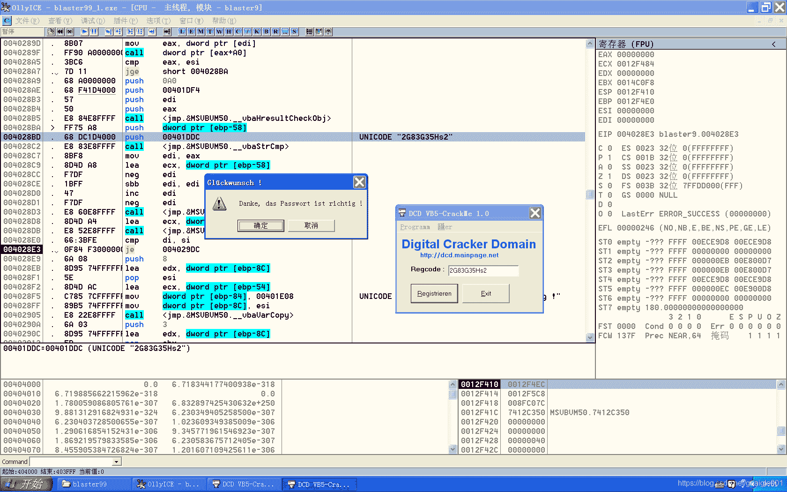

<!--yml
category: crackme160
date: 2022-04-27 18:17:05
-->

# CrackMe160 学习笔记 之 015_一剑名动江湖的博客-CSDN博客

> 来源：[https://blog.csdn.net/guaigle001/article/details/104165667](https://blog.csdn.net/guaigle001/article/details/104165667)

## 前言

这个程序需要去弹窗和写出正确的注册码。



## 思路

### 去弹窗

搜索字符串来到弹窗调用函数处。

```
00402CFE      E8 1DE4FFFF   call    <jmp.&MSVBVM50.#595> 
```

**nop**掉。

由于要点了确定才会跳出接下来的程序，把跳转

```
00402D53     /75 05         jnz     short 00402D5A 
```

改为**强制跳转**。

```
00402D53     /75 05         jmp     short 00402D5A 
```

去弹窗就完成了。

打开新程序，可以看到是把输入字符和一个固定字符串"**2G83G35Hs2**"做比较。

从而得出正确的注册码。

由于太简单就不分析了。

这个程序分分钟就搞定了，毫无挑战难度。

