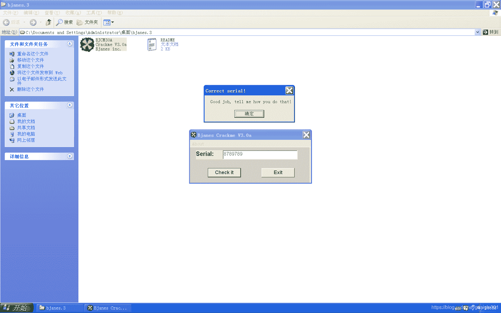
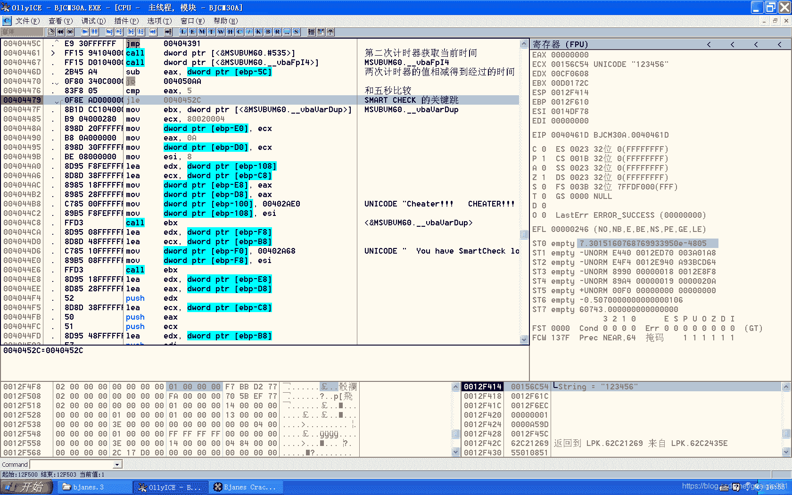

<!--yml
category: crackme160
date: 2022-04-27 18:17:01
-->

# CrackMe160 学习笔记 之 017_一剑名动江湖的博客-CSDN博客

> 来源：[https://blog.csdn.net/guaigle001/article/details/104209544](https://blog.csdn.net/guaigle001/article/details/104209544)

## 前言

先附上一致破解后的图。


做这个**CrackMe**还是花了我不少时间的。

确实难度上比其他几个有所上升。

算法本身并不难，主要是字符串并没有明文比较，以及不断**套娃**。

虽然这个套娃并没做什么复杂的操作，调试起来也挺心累的。


## 思路

首先调试程序的程序就会发现有个**SMART CHECK**的弹窗阻碍调试，绕过即可,下面会给绕过方法。

观察验证函数

```
00404E27   .  FF15 6C104000 call    dword ptr [<&MSVBVM60.__vbaVarTs>; \将ebp-2C地址处的字符串和固定字符串相比较 
```

将生成的字符串和固定字符串 **“FFFF”** 比较。

然后你就会发现这个生成的字符串并不是通过前面的运算得到的，而是**被藏在套娃函数里**。

```
00403A6A   .  8B16          mov     edx, dword ptr [esi]             ;  乘积
00403A6C   .  8B7E 04       mov     edi, dword ptr [esi+4]           ;  求和
00403A6F   .  3BD7          cmp     edx, edi                         ;  关键比较
00403A71   .  C745 C8 0B000>mov     dword ptr [ebp-38], 0B
00403A78   .  0F94C0        sete    al                               ;  相等时 al = 1
00403A7B   .  F7D8          neg     eax                              ;  求补码
00403A7D   .  66:8945 D0    mov     word ptr [ebp-30], ax            ;  相等时 ax=FFFF
0040 
```

最终发现字符串是**通过求和和乘积的比较判断生成的,**怪不得相等时为**FFFF**。

了解了这些，剩下的就好分析了。

## 分析

### SMART CHECK

```
00404230   > \55            push    ebp
00404231   .  8BEC          mov     ebp, esp
00404320   .  FF15 94104000 call    dword ptr [<&MSVBVM60.#535>]               ;  计时器获取当前时间
00404326   .  FF15 D0104000 call    dword ptr [<&MSVBVM60.__vbaFpI4>]          ;  MSVBVM60.__vbaFpI4
0040432C   .  8945 A4       mov     dword ptr [ebp-5C], eax
0040432F   .  8D95 08FFFFFF lea     edx, dword ptr [ebp-F8]
00404335   .  8D85 F8FEFFFF lea     eax, dword ptr [ebp-108]                   ;  第一层循环
0040433B   .  52            push    edx                                        ; /Step8
0040433C   .  8D8D E8FEFFFF lea     ecx, dword ptr [ebp-118]                   ; |
00404342   .  50            push    eax                                        ; |End8
00404343   .  8D95 A4FEFFFF lea     edx, dword ptr [ebp-15C]                   ; |
00404349   .  51            push    ecx                                        ; |Start8
0040434A   .  8D85 B4FEFFFF lea     eax, dword ptr [ebp-14C]                   ; |
00404350   .  52            push    edx                                        ; |TMPend8
00404351   .  8D4D 80       lea     ecx, dword ptr [ebp-80]                    ; |
00404354   .  BB 02000000   mov     ebx, 2                                     ; |ebx = 2
00404359   .  50            push    eax                                        ; |TMPstep8
0040435A   .  51            push    ecx                                        ; |Counter8
0040435B   .  C785 10FFFFFF>mov     dword ptr [ebp-F0], 1                      ; |步长为1
00404365   .  899D 08FFFFFF mov     dword ptr [ebp-F8], ebx                    ; |
0040436B   .  C785 00FFFFFF>mov     dword ptr [ebp-100], 3E8                   ; |end = 0x3E8
00404375   .  899D F8FEFFFF mov     dword ptr [ebp-108], ebx                   ; |
0040437B   .  C785 F0FEFFFF>mov     dword ptr [ebp-110], 1                     ; |start = 1
00404385   .  899D E8FEFFFF mov     dword ptr [ebp-118], ebx                   ; |
0040438B   .  FF15 38104000 call    dword ptr [<&MSVBVM60.__vbaVarForInit>]    ; \循环初始化变量
00404391   >  3BC7          cmp     eax, edi                                   ;  循环成立，返回值为1
00404393   .  0F84 C8000000 je      00404461                                   ;  不相等，必不跳转
00404399   .  B8 01000000   mov     eax, 1
0040439E   .  8D95 08FFFFFF lea     edx, dword ptr [ebp-F8]
004043A4   .  8985 10FFFFFF mov     dword ptr [ebp-F0], eax
004043AA   .  8985 F0FEFFFF mov     dword ptr [ebp-110], eax
004043B0   .  8D85 F8FEFFFF lea     eax, dword ptr [ebp-108]                   ;  第二层循环
004043B6   .  52            push    edx                                        ; /Step8
004043B7   .  8D8D E8FEFFFF lea     ecx, dword ptr [ebp-118]                   ; |
004043BD   .  50            push    eax                                        ; |End8
004043BE   .  8D95 84FEFFFF lea     edx, dword ptr [ebp-17C]                   ; |
004043C4   .  51            push    ecx                                        ; |Start8
004043C5   .  8D85 94FEFFFF lea     eax, dword ptr [ebp-16C]                   ; |
004043CB   .  52            push    edx                                        ; |TMPend8
004043CC   .  8D4D A8       lea     ecx, dword ptr [ebp-58]                    ; |
004043CF   .  50            push    eax                                        ; |TMPstep8
004043D0   .  51            push    ecx                                        ; |Counter8
004043D1   .  899D 08FFFFFF mov     dword ptr [ebp-F8], ebx                    ; |步长仍为1
004043D7   .  C785 00FFFFFF>mov     dword ptr [ebp-100], 0FA                   ; |end = 0xFA
004043E1   .  899D F8FEFFFF mov     dword ptr [ebp-108], ebx                   ; |
004043E7   .  899D E8FEFFFF mov     dword ptr [ebp-118], ebx                   ; |start = 1
004043ED   .  FF15 38104000 call    dword ptr [<&MSVBVM60.__vbaVarForInit>]    ; \__vbaVarForInit
004043F3   >  3BC7          cmp     eax, edi
004043F5   .  74 4D         je      short 00404444
004043F7   .  68 342A4000   push    00402A34                                   ;  UNICODE "IS SMARTCHECK LOADED???"
004043FC   .  68 342A4000   push    00402A34                                   ;  UNICODE "IS SMARTCHECK LOADED???"
00404401   .  FF15 68104000 call    dword ptr [<&MSVBVM60.__vbaStrCmp>]        ;  我比较我自己
00404407   .  85C0          test    eax, eax                                   ;  必为0
00404409   .  75 1F         jnz     short 0040442A                             ;  不跳转
0040440B   .  8D95 08FFFFFF lea     edx, dword ptr [ebp-F8]
00404411   .  8D4D DC       lea     ecx, dword ptr [ebp-24]
00404414   .  C785 10FFFFFF>mov     dword ptr [ebp-F0], 1
0040441E   .  899D 08FFFFFF mov     dword ptr [ebp-F8], ebx
00404424   .  FF15 08104000 call    dword ptr [<&MSVBVM60.__vbaVarMove>]       ;  MSVBVM60.__vbaVarMove
0040442A   >  8D95 84FEFFFF lea     edx, dword ptr [ebp-17C]
00404430   .  8D85 94FEFFFF lea     eax, dword ptr [ebp-16C]
00404436   .  52            push    edx                                        ; /TMPend8
00404437   .  8D4D A8       lea     ecx, dword ptr [ebp-58]                    ; |
0040443A   .  50            push    eax                                        ; |TMPstep8
0040443B   .  51            push    ecx                                        ; |Counter8
0040443C   .  FF15 E8104000 call    dword ptr [<&MSVBVM60.__vbaVarForNext>]    ; \__vbaVarForNext
00404442   .^ EB AF         jmp     short 004043F3
00404444   >  8D95 A4FEFFFF lea     edx, dword ptr [ebp-15C]
0040444A   .  8D85 B4FEFFFF lea     eax, dword ptr [ebp-14C]
00404450   .  52            push    edx                                        ; /TMPend8
00404451   .  8D4D 80       lea     ecx, dword ptr [ebp-80]                    ; |
00404454   .  50            push    eax                                        ; |TMPstep8
00404455   .  51            push    ecx                                        ; |Counter8
00404456   .  FF15 E8104000 call    dword ptr [<&MSVBVM60.__vbaVarForNext>]    ; \__vbaVarForNext
0040445C   .^ E9 30FFFFFF   jmp     00404391
00404461   >  FF15 94104000 call    dword ptr [<&MSVBVM60.#535>]               ;  第二次计时器获取当前时间
00404467   .  FF15 D0104000 call    dword ptr [<&MSVBVM60.__vbaFpI4>]          ;  MSVBVM60.__vbaFpI4
0040446D   .  2B45 A4       sub     eax, dword ptr [ebp-5C]                    ;  两次计时器的值相减得到经过的时间
00404470   .  0F80 340C0000 jo      004050AA
00404476   .  83F8 05       cmp     eax, 5                                     ;  和五秒比较
00404479      0F8E AD000000 jle     0040452C                                   ;  SMART CHECK 的关键跳 
```

这个作者还是挺心机的。

先是获取当前时间，然后使用**二重循环**共计**1000*250=250000**次循环试图来增加我们的调试时间。

再获取当前时间，相减，就可以得出在这个循环里浪费的时间。

最后和**5s**做比较，如果大于**5s**，判定成功，弹出弹窗，那么你就完美的落入作者的圈套了。

然而只要我的手速够快，这个所谓的**SMART CHECK**就奈何不了我。

直接在**0x00404479**处下断点，**F9**，此时**eax**为**0**。



此时这个**SMART CHECK 就被完美绕过**了。

### 第一次循环

```
00404573   .  52            push    edx                              ; /String
00404574   .  FF15 14104000 call    dword ptr [<&MSVBVM60.__vbaLenBs>; \获取长度
0040457A   .  33DB          xor     ebx, ebx
0040457C   .  83F8 05       cmp     eax, 5
0040457F   .  0F9CC3        setl    bl                               ;  字符串长度小于5则置为1
0040466E   .  FF15 38104000 call    dword ptr [<&MSVBVM60.__vbaVarForInit>]            ; \初始化循环
00404674   .  8D8D 7CFFFFFF lea     ecx, dword ptr [ebp-84]
0040467A   .  8985 30FEFFFF mov     dword ptr [ebp-1D0], eax                           ;  将eax的值赋给计数器ebp-1D0
00404680   .  FF15 F0104000 call    dword ptr [<&MSVBVM60.__vbaFreeStr>]               ;  MSVBVM60.__vbaFreeStr
00404686   .  8D8D 5CFFFFFF lea     ecx, dword ptr [ebp-A4]
0040468C   .  FF15 F4104000 call    dword ptr [<&MSVBVM60.__vbaFreeObj>]               ;  MSVBVM60.__vbaFreeObj
00404692   .  8B1D DC104000 mov     ebx, dword ptr [<&MSVBVM60.__vbaStrMove>]          ;  MSVBVM60.__vbaStrMove
00404698   >  39BD 30FEFFFF cmp     dword ptr [ebp-1D0], edi                           ;  循环结束时相等
0040469E   .  0F84 F5010000 je      00404899                                           ;  循环出口
0040473A   > \B8 01000000   mov     eax, 1                           ;  eax初始化为1
00404751   .  8985 00FFFFFF mov     dword ptr [ebp-100], eax         ;  ebp-100初始化为1
00404757   .  8D45 94       lea     eax, dword ptr [ebp-6C]          ;  从ebp-64取出偏移量
00404751   .  8985 00FFFFFF mov     dword ptr [ebp-100], eax         ;  ebp-100初始化为1
00404757   .  8D45 94       lea     eax, dword ptr [ebp-6C]          ;  从ebp-64取出偏移量
004047A4   .  50            push    eax                              ; /加法的参数 ebp-64
004047A5   .  8D95 38FFFFFF lea     edx, dword ptr [ebp-C8]          ; |
004047AB   .  51            push    ecx                              ; |加法的参数 ebp-100 为1
004047AC   .  52            push    edx                              ; |最后加法的结果保存在ebp-C0中
004047AD   .  FF15 C8104000 call    dword ptr [<&MSVBVM60.__vbaVarAd>; \加法的目的是计算偏移量,取下一个字符
004047B3   .  50            push    eax
004047B4   .  FF15 C4104000 call    dword ptr [<&MSVBVM60.__vbaI4Var>;  MSVBVM60.__vbaI4Var
004047BA   .  50            push    eax                              ;  偏移量
004047BB   .  8B85 78FFFFFF mov     eax, dword ptr [ebp-88]          ;  字符串地址
004047C1   .  50            push    eax                              ;  压入字符串地址
004047C2   .  FFD7          call    edi                              ;  同理,要比较的第二个参数
004047C4   .  8BD0          mov     edx, eax                         ;  edx = eax
004047C6   .  8D8D 70FFFFFF lea     ecx, dword ptr [ebp-90]
004047CC   .  FFD3          call    ebx                              ;  [ecx] = [edx]
004047CE   .  50            push    eax                              ;  压入下一个字符的地址
004047CF   .  FF15 68104000 call    dword ptr [<&MSVBVM60.__vbaStrCm>;  将字符串当前字符和下一个字符作比较
00404838   .  66:85FF       test    di, di
0040483B   .  74 37         je      short 00404874                   ;  不相等则跳转
00404846   .  51            push    ecx                              ; /var18
00404847   .  8D85 48FFFFFF lea     eax, dword ptr [ebp-B8]          ; |
0040484D   .  52            push    edx                              ; |var28
0040484E   .  50            push    eax                              ; |保存结果到ebp-B0中
0040484F   .  C785 10FFFFFF>mov     dword ptr [ebp-F0], 1            ; |[ebp-F0] = 1
00404859   .  C785 08FFFFFF>mov     dword ptr [ebp-F8], 2            ; |
00404863   .  FF15 C8104000 call    dword ptr [<&MSVBVM60.__vbaVarAd>; \这个加法的作用是计算相邻相等字符的次数
00404869   .  8BD0          mov     edx, eax                         ;  edx = eax
00404886   .  FF15 E8104000 call    dword ptr [<&MSVBVM60.__vbaVarFo>; \__vbaVarForNext
0040488C   .  8985 30FEFFFF mov     dword ptr [ebp-1D0], eax         ;  循环存在下一个数时返回1，否则返回0
00404892   .  33FF          xor     edi, edi                         ;  edi 清零
00404894   .^\E9 FFFDFFFF   jmp     00404698 
```

第一次循环的作用就是找出**所有字符都相等的字符串**并过滤。

### __vbaVarForInit函数

```
73499120    6A 01           push    1
73499122    58              pop     eax 
```

其中这两条语句的作用和**eax=1**一致。

### vbaVarMove函数

```
73496B78    8946 08         mov     dword ptr [esi+8], eax 
```

关键赋值语句。

### 在0x004047C2处的call edi（返回值为下一个字符的地址）函数

#### 第一层

```
73476E5B    8B45 0C         mov     eax, dword ptr [ebp+C]           ; eax保存加法结果
73476E5E    8D4400 FF       lea     eax, dword ptr [eax+eax-1]       ; eax = eax * 2 - 1;宽字符
73476E62    50              push    eax
73476E63    FF75 08         push    dword ptr [ebp+8]
73476E66    E8 B5FEFFFF     call    rtcMidBstr 
```

#### 进入rtMidBstr

```
73476D20 >  8B4424 08       mov     eax, dword ptr [esp+8]           ; 把上个eax计算的结果赋给当前eax
73476D27    8D78 FF         lea     edi, dword ptr [eax-1]           ; edi = eax - 1
73476D41    8BDF            mov     ebx, edi                         ; ebx = edi;计算得到宽字符的真正的偏移量赋给ebx
73476D9D    8B4424 14       mov     eax, dword ptr [esp+14]          ; eax取字符串地址
73476DA1    03D8            add     ebx, eax                         ; ebx = ebx + eax
73476DA3    53              push    ebx                              ; 加上偏移量得到新字符串
73476DA4    FF15 001A3973   call    dword ptr [<&OLEAUT32.#150>]     ; OLEAUT32.SysAllocStringByteLen 
```

#### 进入OLEAUT32.SysAllocStringByteLen函数

```
770F4C47    E8 74FCFFFF     call    770F48C0                         ; 这个函数修改了ebp+C的值
770F4C4C    85C0            test    eax, eax
770F4C4E    7C 61           jl      short 770F4CB1
770F4C50    8B4D 0C         mov     ecx, dword ptr [ebp+C]           ; ecx=[ebp+C]
770F4C53    8D43 15         lea     eax, dword ptr [ebx+15]          ; eax = 2 + 15 = 0x17
770F4C56    83E0 F0         and     eax, FFFFFFF0                    ; eax = eax & FFFFFFF0
770F4C59    50              push    eax
770F4C5A    E8 81FEFFFF     call    770F4AE0
770F4C5F    85C0            test    eax, eax
770F4C61    74 1B           je      short 770F4C7E
770F4C63    56              push    esi
770F4C64    8B75 08         mov     esi, dword ptr [ebp+8]           ; 偏移后的新字符串
770F4C67    8918            mov     dword ptr [eax], ebx
770F4C69    83C0 04         add     eax, 4                           ; eax = eax + 4 ;得到存放新字符的地址
770F4CA0    C1E9 02         shr     ecx, 2
770F4CA3    8BF8            mov     edi, eax
770F4CA5    F3:A5           rep     movs dword ptr es:[edi], dword ptr [esi]
770F4CA7    8BCA            mov     ecx, edx
770F4CA9    83E1 03         and     ecx, 3
770F4CAC    F3:A4           rep     movs byte ptr es:[edi], byte ptr [esi]                  ; 复制新字符 关键赋值 
```

##### 进入函数770F48C0

```
770F48D3    FFD6            call    esi
770F48D5    85C0            test    eax, eax
770F48D7    8B7D 08         mov     edi, dword ptr [ebp+8]
770F48DA    8907            mov     dword ptr [edi], eax             ; 关键赋值 
```

###### 进入call esi这个函数

```
7C8097D0 >  8BFF            mov     edi, edi
7C8097D2    55              push    ebp
7C8097D3    8BEC            mov     ebp, esp
7C8097D5    64:A1 18000000  mov     eax, dword ptr fs:[18]           ; 关键赋值1
7C8097DB    8B4D 08         mov     ecx, dword ptr [ebp+8]
7C8097DE    83F9 40         cmp     ecx, 40
7C8097E1    0F83 85B30300   jnb     7C844B6C
7C8097E7    8360 34 00      and     dword ptr [eax+34], 0
7C8097EB    8B8488 100E0000 mov     eax, dword ptr [eax+ecx*4+E10]   ; 关键赋值2
7C8097F2    5D              pop     ebp
7C8097F3    C2 0400         retn    4 
```

##### 进入函数770F4AE0

```
770F4AE0    8BFF            mov     edi, edi
770F4AE2    55              push    ebp
770F4AE3    8BEC            mov     ebp, esp
770F4AE5    833D 14101777 0>cmp     dword ptr [77171014], 0
770F4AEC    56              push    esi
770F4AED    8B75 08         mov     esi, dword ptr [ebp+8]
770F4AF0    75 37           jnz     short 770F4B29
770F4AF2    83FE 40         cmp     esi, 40
770F4AF5    0F87 DC000000   ja      770F4BD7
770F4AFB    83FE 20         cmp     esi, 20
770F4AFE  ^ 77 AF           ja      short 770F4AAF
770F4B00    8D41 10         lea     eax, dword ptr [ecx+10]          ; 关键赋值
770F4B03    33D2            xor     edx, edx
770F4B05    3930            cmp     dword ptr [eax], esi
770F4B07    72 17           jb      short 770F4B20                   ; 当[eax]为0x10时退出循环
770F4B09    8320 00         and     dword ptr [eax], 0
770F4B0C    8B40 04         mov     eax, dword ptr [eax+4]           ; eax=[eax+4]
770F4B0F    5E              pop     esi
770F4B10    5D              pop     ebp
770F4B11    C2 0400         retn    4
770F4B20    42              inc     edx                              ; edx = edx + 1
770F4B21    83C0 08         add     eax, 8                           ; eax = eax + 8
770F4B24    83FA 06         cmp     edx, 6
770F4B27  ^ 72 DC           jb      short 770F4B05 
```

这个函数**返回值为字符串的下一个字符**。

其实我也看不懂那几个指令在做什么。但都是为了得到**eax**的**新地址**。

### 特殊判断

```
004048E4   > \8B95 7CFFFFFF mov     edx, dword ptr [ebp-84]                     ;  保存字符串地址
004048EA   .  52            push    edx                                         ; /String
004048EB   .  FF15 14104000 call    dword ptr [<&MSVBVM60.__vbaLenBstr>]        ; \__vbaLenBstr
004048F1   .  83E8 01       sub     eax, 1                                      ;  字符串长度减一
004048F4   .  8D8D 08FFFFFF lea     ecx, dword ptr [ebp-F8]
004048FA   .  0F80 AA070000 jo      004050AA                                    ;  溢出跳转
00404900   .  8985 10FFFFFF mov     dword ptr [ebp-F0], eax                     ;  传入参数:字符串长度减一
00404906   .  8D45 B8       lea     eax, dword ptr [ebp-48]
00404909   .  50            push    eax                                         ; /字符串相邻字符相等的次数
0040490A   .  51            push    ecx                                         ; |字符串长度减一
0040490B   .  C785 08FFFFFF>mov     dword ptr [ebp-F8], 8003                    ; |
00404915   .  FF15 6C104000 call    dword ptr [<&MSVBVM60.__vbaVarTstEq>]       ; \__vbaVarTstEq
0040491B   .  8D8D 7CFFFFFF lea     ecx, dword ptr [ebp-84]
00404921   .  66:8985 CCFEF>mov     word ptr [ebp-134], ax                      ;   不相等时返回值为0，相等时返回值为0xFFFFFFFF
00404928   .  FF15 F0104000 call    dword ptr [<&MSVBVM60.__vbaFreeStr>]        ;  MSVBVM60.__vbaFreeStr
0040492E   .  8D8D 5CFFFFFF lea     ecx, dword ptr [ebp-A4]
00404934   .  FF15 F4104000 call    dword ptr [<&MSVBVM60.__vbaFreeObj>]        ;  MSVBVM60.__vbaFreeObj
0040493A   .  66:39BD CCFEF>cmp     word ptr [ebp-134], di                      ;  只有当字符串所有字符全相同时，
00404941   .  0F85 97050000 jnz     00404EDE                                    ;  跳转才会成立,成立时，失败 
```

为什么作者会**不允许字符串所有字符相同**呢？

因为我们把这个判断绕过的时候，就可以**突破验证**了。

### 第二个循环

```
004049AD   .  FF15 14104000 call    dword ptr [<&MSVBVM60.__vbaLenBstr>]         ; \__vbaLenBstr
004049B3   .  8985 00FFFFFF mov     dword ptr [ebp-100], eax                     ;  字符串长度保存到ebp-100
004049B9   .  8D85 08FFFFFF lea     eax, dword ptr [ebp-F8]
004049BF   .  8D8D F8FEFFFF lea     ecx, dword ptr [ebp-108]
004049C5   .  50            push    eax                                          ; /ebp-0xf0 存放步长
004049C6   .  8D95 E8FEFFFF lea     edx, dword ptr [ebp-118]                     ; |
004049CC   .  51            push    ecx                                          ; |ebp-100 结尾处
004049CD   .  8D85 44FEFFFF lea     eax, dword ptr [ebp-1BC]                     ; |
004049D3   .  52            push    edx                                          ; |ebp-110 开始处
004049D4   .  8D8D 54FEFFFF lea     ecx, dword ptr [ebp-1AC]                     ; |
004049DA   .  50            push    eax                                          ; |TMPend8
004049DB   .  8D55 94       lea     edx, dword ptr [ebp-6C]                      ; |
004049DE   .  51            push    ecx                                          ; |TMPstep8
004049DF   .  52            push    edx                                          ; |Counter8
004049E0   .  C785 F8FEFFFF>mov     dword ptr [ebp-108], 3                       ; |
004049EA   .  C785 F0FEFFFF>mov     dword ptr [ebp-110], 1                       ; |
004049F4   .  C785 E8FEFFFF>mov     dword ptr [ebp-118], 2                       ; |
004049FE   .  FF15 38104000 call    dword ptr [<&MSVBVM60.__vbaVarForInit>]      ; \初始化循环变量
00404A22   > /39BD 2CFEFFFF cmp     dword ptr [ebp-1D4], edi
00404A28   . |0F84 1D030000 je      00404D4B                                     ;  第二个循环出口
00404A80   .  FF15 14104000 call    dword ptr [<&MSVBVM60.__vbaLenBstr>]    ; \获取字符串长度
00404A86   .  8D8D 48FFFFFF lea     ecx, dword ptr [ebp-B8]
00404A8C   .  8985 50FFFFFF mov     dword ptr [ebp-B0], eax
00404A92   .  51            push    ecx
00404A93   .  C785 48FFFFFF>mov     dword ptr [ebp-B8], 3
00404A9D   .  FF15 A8104000 call    dword ptr [<&MSVBVM60.#572>]            ;  转成ASCII码
00404AA3   .  8BD0          mov     edx, eax
00404AA5   .  8D8D 64FFFFFF lea     ecx, dword ptr [ebp-9C]
00404AAB   .  FFD3          call    ebx                                     ;  地址复制到ebp-9c中
00404AAD   .  8B16          mov     edx, dword ptr [esi]
00404AAF   .  56            push    esi
00404AB0   .  FF92 08030000 call    dword ptr [edx+308]
00404AB6   .  50            push    eax
00404AB7   .  8D85 58FFFFFF lea     eax, dword ptr [ebp-A8]
00404ABD   .  50            push    eax
00404ABE   .  FF15 40104000 call    dword ptr [<&MSVBVM60.__vbaObjSet>]     ;  MSVBVM60.__vbaObjSet
00404AC4   .  8B85 58FFFFFF mov     eax, dword ptr [ebp-A8]
00404ACA   .  8D8D 38FFFFFF lea     ecx, dword ptr [ebp-C8]
00404AD0   .  6A 01         push    1                                       ;  取1个字符
00404AD2   .  8D95 28FFFFFF lea     edx, dword ptr [ebp-D8]
00404AD8   .  51            push    ecx
00404AD9   .  52            push    edx
00404ADA   .  89BD 58FFFFFF mov     dword ptr [ebp-A8], edi
00404AE0   .  8985 40FFFFFF mov     dword ptr [ebp-C0], eax
00404AE6   .  C785 38FFFFFF>mov     dword ptr [ebp-C8], 9
00404AF0   .  FF15 D4104000 call    dword ptr [<&MSVBVM60.#617>]            ;  从左数取n个字符
00404AF6   .  8D85 28FFFFFF lea     eax, dword ptr [ebp-D8]                 ;  结果保存在ebp-D0中
00404AFC   .  8D8D 78FFFFFF lea     ecx, dword ptr [ebp-88]
00404B02   .  50            push    eax                                     ; /String8
00404B03   .  51            push    ecx                                     ; |ARG2
00404B04   .  FF15 90104000 call    dword ptr [<&MSVBVM60.__vbaStrVarVal>]  ; \__vbaStrVarVal
00404B0A   .  50            push    eax                                     ; /String
00404B0B   .  FF15 28104000 call    dword ptr [<&MSVBVM60.#516>]            ; \转成ASCII码
00404B29   .  FF15 A8104000 call    dword ptr [<&MSVBVM60.#572>]     ;  转成ASCII码字符串
00404B2F   .  8BD0          mov     edx, eax
00404B31   .  8D8D 60FFFFFF lea     ecx, dword ptr [ebp-A0]
00404B37   .  FFD3          call    ebx                              ;  字符串地址复制到ebp-A0中
00404B39   .  BA 6C294000   mov     edx, 0040296C                    ;  固定字符串"*"
00404B3E   .  8D8D 6CFFFFFF lea     ecx, dword ptr [ebp-94]
00404B44   .  FF15 B0104000 call    dword ptr [<&MSVBVM60.__vbaStrCo>;  固定字符串拷贝到ebp-94中
00404B4A   .  8B95 60FFFFFF mov     edx, dword ptr [ebp-A0]
00404B50   .  8D8D 70FFFFFF lea     ecx, dword ptr [ebp-90]
00404B56   .  89BD 60FFFFFF mov     dword ptr [ebp-A0], edi
00404B5C   .  FFD3          call    ebx                              ;  转化后的字符串地址从ebp-A0移动到ebp-90中
00404B5E   .  8B95 64FFFFFF mov     edx, dword ptr [ebp-9C]
00404B64   .  8D8D 74FFFFFF lea     ecx, dword ptr [ebp-8C]
00404B6A   .  89BD 64FFFFFF mov     dword ptr [ebp-9C], edi
00404B70   .  FFD3          call    ebx                              ;  固定字符串地址从ebp-9C移动到ebp-8c中,并清空ebp-9C
00404B72   .  8B06          mov     eax, dword ptr [esi]
00404B74   .  8D8D 68FFFFFF lea     ecx, dword ptr [ebp-98]
00404B7A   .  8D95 6CFFFFFF lea     edx, dword ptr [ebp-94]
00404B80   .  51            push    ecx                              ;  ecx+8:字符串首地址的ASCII码
00404B81   .  52            push    edx                              ;  edx+8:字符串首地址的ASCII码
00404B82   .  8D8D 70FFFFFF lea     ecx, dword ptr [ebp-90]
00404B88   .  8D95 74FFFFFF lea     edx, dword ptr [ebp-8C]
00404B8E   .  51            push    ecx                              ;  ecx:字符串首地址的ASCII码
00404B8F   .  52            push    edx                              ;  edx:字符串长度
00404B90   .  56            push    esi                              ;  ???
00404B91   .  FF90 F8060000 call    dword ptr [eax+6F8]              ;  套娃函数:计算name[0]*strlen(name)的值并把结果放入ebp-98中
00404B97   .  3BC7          cmp     eax, edi                         ;  套娃结束
00404BBC   .  FFD3          call    ebx                              ;  把乘法结果从ebp-98移动到ebp-38中
00404CBA   .  FFD3          call    ebx                              ;  ebp-88保存了字符串第n个字符的地址
00404CBC   .  50            push    eax                              ; /String
00404CBD   .  FF15 28104000 call    dword ptr [<&MSVBVM60.#516>]     ; \rtcAnsiValueBstr
00404CC3   .  66:8985 00FFF>mov     word ptr [ebp-100], ax           ;  取字符到ebp-100中
00404CCA   .  8D55 CC       lea     edx, dword ptr [ebp-34]
00404CCD   .  8D85 F8FEFFFF lea     eax, dword ptr [ebp-108]
00404CD3   .  52            push    edx                              ; /加法的参数 ebp-2C
00404CD4   .  8D8D 38FFFFFF lea     ecx, dword ptr [ebp-C8]          ; |
00404CDA   .  50            push    eax                              ; |加法的参数 ebp-100
00404CDB   .  51            push    ecx                              ; |保存结果的位置 ebp-C0
00404CDC   .  C785 F8FEFFFF>mov     dword ptr [ebp-108], 2           ; |
00404CE6   .  FF15 C8104000 call    dword ptr [<&MSVBVM60.__vbaVarAd>; \__vbaVarAdd
00404D3A   .  FF15 E8104000 call    dword ptr [<&MSVBVM60.__vbaVarFo>; \__vbaVarForNext 
```

#### 套娃函数1

```
00403900   > \55            push    ebp                              ;  套娃函数1号
00403901   .  8BEC          mov     ebp, esp
00403945   .  8939          mov     dword ptr [ecx], edi             ;  清零
0040394F   .  8B55 0C       mov     edx, dword ptr [ebp+C]           ;  传入的第二个参数赋值给edx
00403956   .  52            push    edx                              ;  压入存放求乘积后地址的堆栈值
00403961   .  FF90 FC060000 call    dword ptr [eax+6FC]              ;  进入套娃函数2号
00403988   .  8945 D0       mov     dword ptr [ebp-30], eax
0040398B   .  8B45 10       mov     eax, dword ptr [ebp+10]          ;  传入的第三个参数赋值给eax
0040398E   .  52            push    edx
0040398F   .  50            push    eax                              ;  压入存放求和后地址的堆栈值
00403990   .  56            push    esi
00403991   .  895D C8       mov     dword ptr [ebp-38], ebx
00403994   .  FF91 FC060000 call    dword ptr [ecx+6FC]              ;  进入套娃函数2号
004039B0   > \8B4D 14       mov     ecx, dword ptr [ebp+14]          ;  取固定字符串
004039B3   .  8B11          mov     edx, dword ptr [ecx]
004039B5   .  8D4D C0       lea     ecx, dword ptr [ebp-40]
004039B8   .  FF15 B0104000 call    dword ptr [<&MSVBVM60.__vbaStrCo>;  把字符串拷贝到ebp-40中
004039BE   .  8B55 C0       mov     edx, dword ptr [ebp-40]          ;  固定字符 "*"或"="
004039C1   .  8B3D 68104000 mov     edi, dword ptr [<&MSVBVM60.__vba>;  MSVBVM60.__vbaStrCmp
004039C7   .  52            push    edx
004039C8   .  68 FC284000   push    004028FC                         ;  固定字符串“>”
004039CD   .  FFD7          call    edi                              ;  <&MSVBVM60.__vbaStrCmp>
004039CF   .  85C0          test    eax, eax
004039D1   .  75 39         jnz     short 00403A0C                   ;  不相等则跳转
00403A54   > \8B4D C0       mov     ecx, dword ptr [ebp-40]
00403A57   .  51            push    ecx                              ;  固定字符串
00403A58   .  68 0C294000   push    0040290C                         ;  固定字符串 "="
00403A5D   .  FFD7          call    edi
00403A5F   .  85C0          test    eax, eax
00403A61   .  75 37         jnz     short 00403A9A                   ;  相等时不跳转
00403A63   .  8B76 50       mov     esi, dword ptr [esi+50]
00403A66   .  8D4D C8       lea     ecx, dword ptr [ebp-38]
00403A69   .  51            push    ecx
00403A6A   .  8B16          mov     edx, dword ptr [esi]             ;  乘积
00403A6C   .  8B7E 04       mov     edi, dword ptr [esi+4]           ;  求和
00403A6F   .  3BD7          cmp     edx, edi                         ;  关键比较
00403A71   .  C745 C8 0B000>mov     dword ptr [ebp-38], 0B
00403A78   .  0F94C0        sete    al                               ;  相等时 al = 1
00403A7B   .  F7D8          neg     eax                              ;  求补码
00403A7D   .  66:8945 D0    mov     word ptr [ebp-30], ax            ;  相等时 ax=FFFF
00403A81   .  FF15 A8104000 call    dword ptr [<&MSVBVM60.#572>]     ;  MSVBVM60.rtcHexBstrFromVar
00403A87   .  8BD0          mov     edx, eax
00403A89   .  8D4D E8       lea     ecx, dword ptr [ebp-18]
00403A8C   .  FF15 DC104000 call    dword ptr [<&MSVBVM60.__vbaStrMo>;  移动到ebp-18中
00403C3B   .  68 6C294000   push    0040296C                         ;  固定字符串 "*"
00403C40   .  FFD7          call    edi
00403C42   .  85C0          test    eax, eax
00403C44   .  75 1F         jnz     short 00403C65
00403C46   .  8B76 50       mov     esi, dword ptr [esi+50]
00403C49   .  8D55 D8       lea     edx, dword ptr [ebp-28]
00403C4C   .  52            push    edx
00403C4D   .  8B4E 04       mov     ecx, dword ptr [esi+4]
00403C50   .  0FAF0E        imul    ecx, dword ptr [esi]             ;  name[0]*strlen(name),结果保存在ecx中
00403C53   .  0F80 CA000000 jo      00403D23
00403C59   .  894D E0       mov     dword ptr [ebp-20], ecx
00403C5C   .  C745 D8 03000>mov     dword ptr [ebp-28], 3
00403C63   .  EB 4D         jmp     short 00403CB2
00403CB2   > \FF15 A8104000 call    dword ptr [<&MSVBVM60.#572>]     ;  MSVBVM60.rtcHexBstrFromVar
00403CB8   .  8BD0          mov     edx, eax
00403CBA   .  8D4D E8       lea     ecx, dword ptr [ebp-18]
00403CBD   .  FF15 DC104000 call    dword ptr [<&MSVBVM60.__vbaStrMo>;  计算后的字符串地址移动到ebp-18中
00403CF7   .  8B45 08       mov     eax, dword ptr [ebp+8]
00403CFA   .  50            push    eax
00403CFB   .  8B10          mov     edx, dword ptr [eax]
00403CFD   .  FF52 08       call    dword ptr [edx+8]
00403D00   .  8B45 18       mov     eax, dword ptr [ebp+18]
00403D03   .  8B4D E8       mov     ecx, dword ptr [ebp-18]
00403D06   .  8908          mov     dword ptr [eax], ecx             ;  保存新字符串到ebp+18中 
```

#### 套娃函数2

```
00403D30   > \55            push    ebp                              ;  套娃函数2号
00403D31   .  8BEC          mov     ebp, esp
00403D9C   .  897D A0       mov     dword ptr [ebp-60], edi          ;  ebp-60初始化为0
00403D9F   .  C745 98 02000>mov     dword ptr [ebp-68], 2            ;  ebp-68初始化为2
00403DA8   .  8B55 0C       mov     edx, dword ptr [ebp+C]           ;  参数传入edx
00403DB9   .  FF15 DC104000 call    dword ptr [<&MSVBVM60.__vbaStrMo>;  地址移动到ebp-18中
00403DC5   .  51            push    ecx                              ; /String
00403DC6   .  FF15 14104000 call    dword ptr [<&MSVBVM60.__vbaLenBs>; \返回长度
00403DC5   .  51            push    ecx                              ; /String
00403DC6   .  FF15 14104000 call    dword ptr [<&MSVBVM60.__vbaLenBs>; \返回长度
00403DF3   .  52            push    edx                              ; /Step8
00403DF4   .  8D4D BC       lea     ecx, dword ptr [ebp-44]          ; |
00403DF7   .  50            push    eax                              ; |End8
00403DF8   .  8D95 68FFFFFF lea     edx, dword ptr [ebp-98]          ; |
00403DFE   .  51            push    ecx                              ; |Start8
00403DFF   .  8D85 78FFFFFF lea     eax, dword ptr [ebp-88]          ; |
00403E05   .  52            push    edx                              ; |TMPend8
00403E06   .  8D4D D0       lea     ecx, dword ptr [ebp-30]          ; |
00403E09   .  50            push    eax                              ; |TMPstep8
00403E0A   .  51            push    ecx                              ; |Counter8
00403E0B   .  C745 E0 10000>mov     dword ptr [ebp-20], 10           ; |START: 1
00403E12   .  C745 A0 FFFFF>mov     dword ptr [ebp-60], -1           ; |END: 1
00403E19   .  C745 90 01000>mov     dword ptr [ebp-70], 1            ; |STEP: FFFF
00403E20   .  FF15 38104000 call    dword ptr [<&MSVBVM60.__vbaVarFo>; \__vbaVarForInit
00403E26   .  8B3D 28104000 mov     edi, dword ptr [<&MSVBVM60.#516>>;  MSVBVM60.rtcAnsiValueBstr
00403E2C   >  85C0          test    eax, eax
00403E2E   .  0F84 88020000 je      004040BC                         ;  循环初始化成立，返回1，不跳转
00403E34   .  66:8B45 E4    mov     ax, word ptr [ebp-1C]
00403E38   .  66:05 0100    add     ax, 1                            ;  ax = ax + 1
00403E3C   .  0F80 E9020000 jo      0040412B
00403E42   .  66:3D 0300    cmp     ax, 3                            ;  ASCII码最多3个字符，所以ax最大为3
00403E5D   .  50            push    eax                              ; /String
00403E5E   .  FF15 14104000 call    dword ptr [<&MSVBVM60.__vbaLenBs>; \计算字符串长度
00403E64   .  8D4D D0       lea     ecx, dword ptr [ebp-30]
00403E67   .  8D55 98       lea     edx, dword ptr [ebp-68]
00403E6A   .  51            push    ecx                              ; /var18
00403E6B   .  52            push    edx                              ; |var28
00403E6C   .  8945 A0       mov     dword ptr [ebp-60], eax          ; |[ebp-60] = eax
00403E6F   .  C745 98 03800>mov     dword ptr [ebp-68], 8003         ; |
00403E76   .  FF15 6C104000 call    dword ptr [<&MSVBVM60.__vbaVarTs>; \ebp-28和ebp-60比较
00403E7C   .  66:85C0       test    ax, ax                           ;  相等时eax为FFFFFFFF
00403EB1   .  FF15 DC104000 call    dword ptr [<&MSVBVM60.__vbaStrMo>;  移动到ebp-48中
00403EC4   .  FFD7          call    edi                              ;  求出ASCII码
00403EC6   .  66:3D 3000    cmp     ax, 30
00403ECA   .  7C 12         jl      short 00403EDE
00403ECC   .  66:3D 3900    cmp     ax, 39
00403ED0   .  7F 0C         jg      short 00403EDE
00403ED2   .  8B4D B8       mov     ecx, dword ptr [ebp-48]
00403ED5   .  51            push    ecx
00403ED6   .  FFD7          call    edi
00403ED8   .  66:2D 3000    sub     ax, 30
00403EDC   .  EB 28         jmp     short 00403F06
00403EDE   >  66:3D 4100    cmp     ax, 41
00403EE2   .  0F8C B7010000 jl      0040409F
00403EE8   .  66:3D 4600    cmp     ax, 46
00403EEC   .  0F8F AD010000 jg      0040409F
00403EF2   .  8B4D B8       mov     ecx, dword ptr [ebp-48]
00403EF5   .  51            push    ecx
00403EF6   .  FFD7          call    edi
00403EF8   .  66:2D 4100    sub     ax, 41
00403EFC   .  0F80 29020000 jo      0040412B
00403F02   .  66:05 0A00    add     ax, 0A
00403F06   >  0F80 1F020000 jo      0040412B
00403F0C   .  8BD6          mov     edx, esi
00403F0E   .  8D4D 88       lea     ecx, dword ptr [ebp-78]
00403F11   .  66:8945 A0    mov     word ptr [ebp-60], ax            ;  [ebp-60] = ax
00403F15   .  C745 98 02000>mov     dword ptr [ebp-68], 2
00403F1C   .  FF15 0C104000 call    dword ptr [<&MSVBVM60.__vbaVarVa>;  MSVBVM60.__vbaVarVargNofree
00403F22   .  50            push    eax
00403F23   .  8D55 98       lea     edx, dword ptr [ebp-68]          ;  加法参数1
00403F26   .  8D45 A8       lea     eax, dword ptr [ebp-58]          ;  加法参数2
00403F2B   . /E9 63010000   jmp     00404093
00404093   > \FF15 C8104000 call    dword ptr [<&MSVBVM60.__vbaVarAd>; \__vbaVarAdd
004040B1   .  FF15 E8104000 call    dword ptr [<&MSVBVM60.__vbaVarFo>; \__vbaVarForNext
004040B7   .^ E9 70FDFFFF   jmp     00403E2C 
```

这里我就只展示了**关键指令**，那些不会走到的指令就不展示了。

### 最后

```
00404D4B   > \8D4D CC       lea     ecx, dword ptr [ebp-34]          ;  最后加法的结果保存在ebp-2C中
00404D4E   .  51            push    ecx
00404D4F   .  FF15 A8104000 call    dword ptr [<&MSVBVM60.#572>]     ;  转成16进制字符串
00404D55   .  8BD0          mov     edx, eax
00404D57   .  8D8D 70FFFFFF lea     ecx, dword ptr [ebp-90]
00404D5D   .  FFD3          call    ebx                              ;  加法结果的地址移动到ebp-90中
00404D5F   .  BA 0C294000   mov     edx, 0040290C                    ;  固定字符串"="
00404D64   .  8D8D 78FFFFFF lea     ecx, dword ptr [ebp-88]
00404D6A   .  FF15 B0104000 call    dword ptr [<&MSVBVM60.__vbaStrCo>;  固定字符串拷贝到ebp-88中
00404D70   .  8B95 70FFFFFF mov     edx, dword ptr [ebp-90]
00404D76   .  8D8D 7CFFFFFF lea     ecx, dword ptr [ebp-84]
00404D7C   .  89BD 70FFFFFF mov     dword ptr [ebp-90], edi
00404D82   .  FFD3          call    ebx                              ;  加法结果的地址移动到ebp-84中
00404D9D   .  50            push    eax                              ;  压入存放加法结果字符串的地址
00404D9E   .  51            push    ecx                              ;  压入存放乘法结果字符串的地址
00404D9F   .  56            push    esi
00404DA0   .  FF92 F8060000 call    dword ptr [edx+6F8]              ;  进入套娃函数1,这里才是真正的验证函数
00404DBC   > \8B85 74FFFFFF mov     eax, dword ptr [ebp-8C]          ;  最终生成的字符串从ebp-8C移动到eax中
00404DD6   .  8985 50FFFFFF mov     dword ptr [ebp-B0], eax          ;  [ebp-B0]=eax
00404DE2   .  FF15 08104000 call    dword ptr [<&MSVBVM60.__vbaVarMo>;  最终生成的字符串从ebp-B0移动到ebp-2C中
00404E11   .  C785 10FFFFFF>mov     dword ptr [ebp-F0], 00402B58     ;  UNICODE "FFFF"
00404E1B   .  52            push    edx                              ; /var18
00404E1C   .  50            push    eax                              ; |"FFFF",宽字符，8个字节
00404E1D   .  C785 08FFFFFF>mov     dword ptr [ebp-F8], 8008         ; |
00404E27   .  FF15 6C104000 call    dword ptr [<&MSVBVM60.__vbaVarTs>; \将ebp-2C地址处的字符串和固定字符串相比较
00404E2D   .  66:85C0       test    ax, ax                           ;  
00404E30   .  0F84 AD000000 je      00404EE3                         ;  不相等则跳转，这个是关键跳 
```

这里还有个坑，最后比较固定字符串的时候会算上字符串的长度，如果只修改字符串的值，同样不会成功的。

## 注册机代码

因为符合条件的字符串太多了，所以我注册机就只能这样写了。

```
#include<stdio.h>
int main()
{
  char* name;
  int len;
  int result=0;
  int count=0;
  printf("name:");
  scanf("%[^\n]",name);
  if((len=strlen(name))<5)
    return 0;
  for(int i=0;i<len;i++)
    {
      result+=name[i];
      if(i<len-1)
        {
          if(name[i]==name[i+1])
            count++;
          if(count==len-1)、
            return 0;

        }

    }
  if(result==name[0]*len)
    printf("key:%s",name);
  return  0;
} 
```