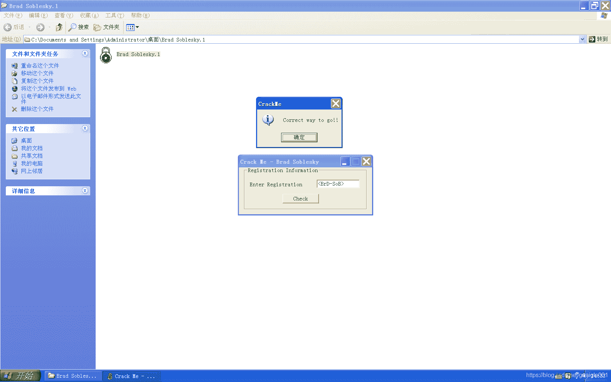

<!--yml
category: crackme160
date: 2022-04-27 18:16:59
-->

# CrackMe160 学习笔记 之 018_一剑名动江湖的博客-CSDN博客

> 来源：[https://blog.csdn.net/guaigle001/article/details/104209802](https://blog.csdn.net/guaigle001/article/details/104209802)

## 前言

先吐下槽，终于不是**VB**的程序了，能看正常一点的汇编代码了。

这个程序也是异常的简单，太简单就没什么兴致写博客了。



## 思路

验证函数处和固定字符串"<BrD-SoB>"比较。

结束。

## 分析

主要程序分析完了，顺便看看库函数吧。

### lstrlenA 函数

```
7C80BE46 >  6A 08           push    8
7C80BE48    68 80BE807C     push    7C80BE80
7C80BE4D    E8 8466FFFF     call    7C8024D6
7C80BE52    8B45 08         mov     eax, dword ptr [ebp+8]           ; 字符串地址
7C80BE55    85C0            test    eax, eax                         ; 判断不为空
7C80BE57    0F84 F0A70200   je      7C83664D
7C80BE5D    8365 FC 00      and     dword ptr [ebp-4], 0             ; ebp-4 清零
7C80BE61    8D50 01         lea     edx, dword ptr [eax+1]           ; edx 保存第一个字符下一个的地址
7C80BE64    8A08            mov     cl, byte ptr [eax]               ; 从字符串取一个字节的字符
7C80BE66    40              inc     eax                              ; 计数器加一，指向下一个字符
7C80BE67    84C9            test    cl, cl                           ; 判断是否结尾
7C80BE69  ^ 75 F9           jnz     short 7C80BE64                   ; 不为0则跳转
7C80BE6B    2BC2            sub     eax, edx                         ; 用 长度+1的地址-起始+1的地址 得到真实长度
7C80BE6D    834D FC FF      or      dword ptr [ebp-4], FFFFFFFF
7C80BE71    E8 9B66FFFF     call    7C802511
7C80BE76    C2 0400         retn    4 
```

### lstrcmpA 函数的关键代码

```
7C80A951    66:3B0E         cmp     cx, word ptr [esi]
7C80A954    897D FC         mov     dword ptr [ebp-4], edi
7C80A957    8975 1C         mov     dword ptr [ebp+1C], esi
7C80A95A    0F85 B1000000   jnz     7C80AA11
7C80A960    66:3BCB         cmp     cx, bx
7C80A963    0F84 A8000000   je      7C80AA11
7C80A969    47              inc     edi
7C80A96A    47              inc     edi
7C80A96B    66:8B0F         mov     cx, word ptr [edi]
7C80A96E    46              inc     esi
7C80A96F    46              inc     esi
7C80A970    66:3B0E         cmp     cx, word ptr [esi]
7C80A973    897D FC         mov     dword ptr [ebp-4], edi
7C80A976    8975 1C         mov     dword ptr [ebp+1C], esi
7C80A979    0F85 92000000   jnz     7C80AA11
7C80A97F    66:3BCB         cmp     cx, bx
7C80A982    0F84 89000000   je      7C80AA11
7C80A988    47              inc     edi
7C80A989    47              inc     edi
7C80A98A    66:8B0F         mov     cx, word ptr [edi]
7C80A98D    46              inc     esi
7C80A98E    46              inc     esi 
```

这个函数后面基本就是这段代码的复制粘贴。

这个反汇编有点蠢，写个**JNZ**跳回去不就行了。

懒得写注释了，看得懂的自然懂。