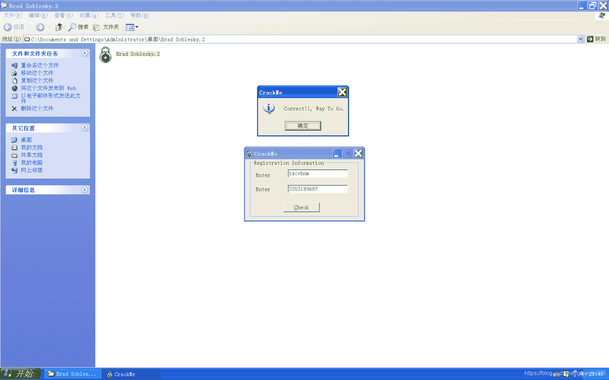

<!--yml
category: crackme160
date: 2022-04-27 18:16:57
-->

# CrackMe160 学习笔记 之 019_一剑名动江湖的博客-CSDN博客

> 来源：[https://blog.csdn.net/guaigle001/article/details/104215159](https://blog.csdn.net/guaigle001/article/details/104215159)

## 前言

这是一个短小的程序。

需要根据用户名写出对应的注册机。



## 思路

整个程序流程一目了然，就算法和一个关键的验证函数。

## 分析

```
004014DF  /.  55            push    ebp
004014E0  |.  8BEC          mov     ebp, esp
00401505  |.  C745 F0 45632>mov     dword ptr [ebp-10], 81276345     ;  ebp-10 初始化为81276345
00401551  |.  E8 34080000   call    <jmp.&MFC42.#3097_CWnd::GetDlgItemTextA>            ;  name
00401556  |.  8D4D E8       lea     ecx, dword ptr [ebp-18]
00401559  |.  51            push    ecx
0040155A  |.  68 E9030000   push    3E9
0040155F  |.  8B8D 40FEFFFF mov     ecx, dword ptr [ebp-1C0]
00401565  |.  E8 20080000   call    <jmp.&MFC42.#3097_CWnd::GetDlgItemTextA>            ;  key
0040156A  |.  8D4D EC       lea     ecx, dword ptr [ebp-14]
0040156D  |.  E8 DE020000   call    00401850
00401572  |.  8945 E4       mov     dword ptr [ebp-1C], eax
00401575  |.  837D E4 05    cmp     dword ptr [ebp-1C], 5                               ;  name长度必须大于等于5
00401579  |.  7D 43         jge     short 004015BE
004015BE  |> \C745 E0 00000>mov     dword ptr [ebp-20], 0                               ;  初始化为0
004015C5  |.  EB 09         jmp     short 004015D0
004015C7  |>  8B55 E0       /mov     edx, dword ptr [ebp-20]
004015CA  |.  83C2 01       |add     edx, 1
004015CD  |.  8955 E0       |mov     dword ptr [ebp-20], edx
004015D0  |>  8B45 E0        mov     eax, dword ptr [ebp-20]
004015D3  |.  3B45 E4       |cmp     eax, dword ptr [ebp-1C]                            ;  计数器和name长度比较
004015D6  |.  7D 42         |jge     short 0040161A                                     ;  大于等于则退出循环
004015D8  |.  8B4D E0       |mov     ecx, dword ptr [ebp-20]
004015DB  |.  51            |push    ecx
004015DC  |.  8D4D EC       |lea     ecx, dword ptr [ebp-14]                            ;  name
004015DF  |.  E8 1C030000   |call    00401900
004015E4  |.  0FBED0        |movsx   edx, al                                            ;  edx保存第n位的ASCII码
004015E7  |.  8B45 F0       |mov     eax, dword ptr [ebp-10]
004015EA  |.  03C2          |add     eax, edx                                           ;  eax = eax + edx
004015EC  |.  8945 F0       |mov     dword ptr [ebp-10], eax                            ;  求和后的结果保存到ebp-10中
004015EF  |.  8B4D E0       |mov     ecx, dword ptr [ebp-20]
004015F2  |.  C1E1 08       |shl     ecx, 8                                             ;  计数器左移8位
004015F5  |.  8B55 F0       |mov     edx, dword ptr [ebp-10]
004015F8  |.  33D1          |xor     edx, ecx                                           ;  edx = edx ^ ecx
004015FA  |.  8955 F0       |mov     dword ptr [ebp-10], edx                            ;  异或后的结果保存到ebp-10中
004015FD  |.  8B45 E0       |mov     eax, dword ptr [ebp-20]                            ;  取计数器的值
00401600  |.  83C0 01       |add     eax, 1                                             ;  eax = eax + 1
00401603  |.  8B4D E4       |mov     ecx, dword ptr [ebp-1C]                            ;  ecx 保存name长度
00401606  |.  0FAF4D E0     |imul    ecx, dword ptr [ebp-20]                            ;  ecx 乘以计数器的值
0040160A  |.  F7D1          |not     ecx                                                ;  求反码
0040160C  |.  0FAFC1        |imul    eax, ecx                                           ;  相乘
0040160F  |.  8B55 F0       |mov     edx, dword ptr [ebp-10]
00401612  |.  0FAFD0        |imul    edx, eax                                           ;  相乘
00401615  |.  8955 F0       |mov     dword ptr [ebp-10], edx                            ;  最终结果保存在ebp-10中
00401618  |.^ EB AD         \jmp     short 004015C7
0040161D  |.  50            push    eax
0040161E  |.  68 54404000   push    00404054                                      ;  ASCII "%lu"
00401623  |.  8D4D DC       lea     ecx, dword ptr [ebp-24]
00401626  |.  51            push    ecx
00401627  |.  E8 52070000   call    <jmp.&MFC42.#2818_CString::Format>
0040162C  |.  83C4 0C       add     esp, 0C
0040162F  |.  8D4D DC       lea     ecx, dword ptr [ebp-24]
00401632  |.  E8 79020000   call    004018B0
00401637  |.  50            push    eax                                           ;  计算后的字符串
00401638  |.  8D4D E8       lea     ecx, dword ptr [ebp-18]                       ;  输入的字符串
0040163B  |.  E8 80020000   call    004018C0                                      ;  字符串比较函数
00401640  |.  85C0          test    eax, eax
00401642  |.  0F85 FF000000 jnz     00401747                                      ;  关键跳 
```

## 注册机代码

```
#include<stdio.h>
int main()
{
  char *name;
  int ecx=0,ebp_10=0x81276345;
  int len;
  printf("name:");
  scanf("%[^\n]",name);
  len=strlen(name);
  while(ecx<len)
    {
      ebp_10+=name[ecx];
      ebp_10^=(ecx<<8);
      ebp_10*=(~(len*ecx))*(ecx+1);
      ecx++;
      printf("\n");
    } 
  printf("%lu",ebp_10);

  return 0;
} 
```