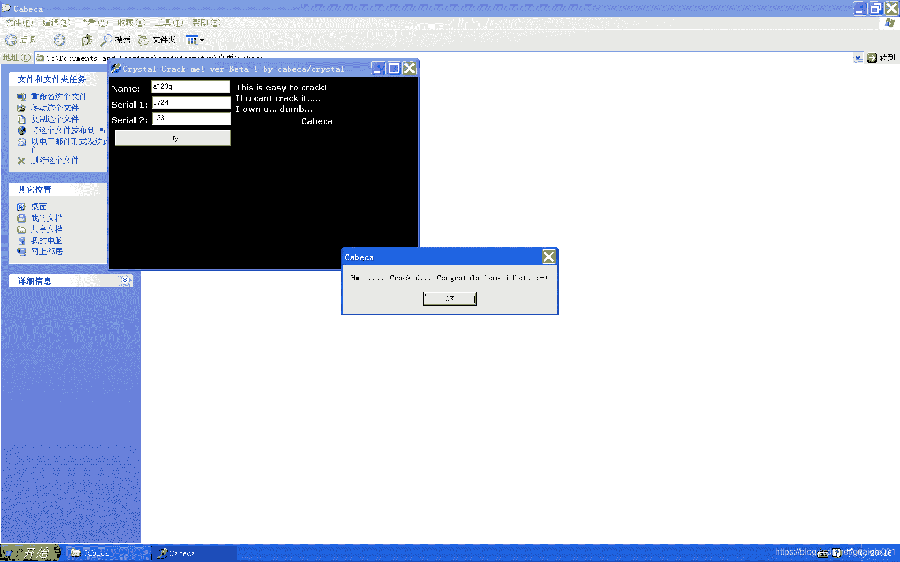

<!--yml
category: crackme160
date: 2022-04-27 18:16:55
-->

# CrackMe160 学习笔记 之 021_一剑名动江湖的博客-CSDN博客

> 来源：[https://blog.csdn.net/guaigle001/article/details/104215984](https://blog.csdn.net/guaigle001/article/details/104215984)

## 前言

简单，随手秒。



## 思路

打开程序，name里随便输入几个数字。弹窗直接报没有输入。

说明不接受数字类型的输入。那么就只接受字母喽。

```
0042D3DE  |.  833D 14F74200>cmp     dword ptr [42F714], 0
0042D3E5  |.  74 45         je      short 0042D42C
0042D3E7  |.  833D 18F74200>cmp     dword ptr [42F718], 0
0042D3EE  |.  74 3C         je      short 0042D42C 
```

判断在这里终止。

重新打开程序，在**0x42F714**或者**0x42F718**处下内存断点。

可以看到赋值来自**一条非常长**的**case**语句。

```
0042CF98   > \8105 14F74200>add     dword ptr [42F714], 427          ;  Case 61 of switch 0042CE34
0042CFA2   .  8305 18F74200>add     dword ptr [42F718], 79
0042CFA9   .  C3            retn
0042CFAA   >  8105 14F74200>add     dword ptr [42F714], 6BC          ;  Case 62 of switch 0042CE34
0042CFB4   .  8305 18F74200>add     dword ptr [42F718], 6F
0042CFBB   .  C3            retn
0042CFBC   >  8105 14F74200>add     dword ptr [42F714], 491          ;  Case 63 of switch 0042CE34
0042CFC6   .  8105 18F74200>add     dword ptr [42F718], 2E2
0042CFD0   .  C3            retn
0042CFD1   >  8105 14F74200>add     dword ptr [42F714], 474D         ;  Case 64 of switch 0042CE34
0042CFDB   .  8105 18F74200>add     dword ptr [42F718], 2FA
0042CFE5   .  C3            retn
0042CFE6   >  8105 14F74200>add     dword ptr [42F714], 400          ;  Case 65 of switch 0042CE34
0042CFF0   .  8305 18F74200>add     dword ptr [42F718], 0E
0042CFF7   .  C3            retn
0042CFF8   >  8105 14F74200>add     dword ptr [42F714], 6D0          ;  Case 66 of switch 0042CE34
0042D002   .  8305 18F74200>add     dword ptr [42F718], 0D
0042D009   .  C3            retn
0042D00A   >  8105 14F74200>add     dword ptr [42F714], 67D          ;  Case 67 of switch 0042CE34
0042D014   .  8305 18F74200>add     dword ptr [42F718], 0C
0042D01B   .  C3            retn
0042D01C   >  8105 14F74200>add     dword ptr [42F714], 750          ;  Case 68 of switch 0042CE34
0042D026   .  8305 18F74200>add     dword ptr [42F718], 0B
0042D02D   .  C3            retn
0042D02E   >  8105 14F74200>add     dword ptr [42F714], 43C          ;  Case 69 of switch 0042CE34
0042D038   .  8305 18F74200>add     dword ptr [42F718], 63
0042D03F   .  C3            retn
0042D040   >  8105 14F74200>add     dword ptr [42F714], 764          ;  Case 6A of switch 0042CE34
0042D04A   .  8105 18F74200>add     dword ptr [42F718], 378
0042D054   .  C3            retn
0042D055   >  8105 14F74200>add     dword ptr [42F714], 0C0          ;  Case 6B of switch 0042CE34
0042D05F   .  8305 18F74200>add     dword ptr [42F718], 4D
0042D066   .  C3            retn
0042D067   >  8105 14F74200>add     dword ptr [42F714], 277D         ;  Case 6C of switch 0042CE34
0042D071   .  8105 18F74200>add     dword ptr [42F718], 22B
0042D07B   .  C3            retn
0042D07C   >  8105 14F74200>add     dword ptr [42F714], 81E          ;  Case 6D of switch 0042CE34
0042D086   .  8305 18F74200>add     dword ptr [42F718], 5A
0042D08D   .  C3            retn
0042D08E   >  8105 14F74200>add     dword ptr [42F714], 0E07         ;  Case 6E of switch 0042CE34
0042D098   .  8305 18F74200>add     dword ptr [42F718], 62
0042D09F   .  C3            retn
0042D0A0   >  8105 14F74200>add     dword ptr [42F714], 8E           ;  Case 6F of switch 0042CE34
0042D0AA   .  8105 18F74200>add     dword ptr [42F718], 1D2C
0042D0B4   .  C3            retn
0042D0B5   >  8105 14F74200>add     dword ptr [42F714], 9A670        ;  Case 70 of switch 0042CE34
0042D0BF   .  8105 18F74200>add     dword ptr [42F718], 8C7F3
0042D0C9   .  C3            retn
0042D0CA   >  8105 14F74200>add     dword ptr [42F714], 0D57         ;  Case 71 of switch 0042CE34
0042D0D4   .  8105 18F74200>add     dword ptr [42F718], 288
0042D0DE   .  C3            retn
0042D0DF   >  8105 14F74200>add     dword ptr [42F714], 5FEB         ;  Case 72 of switch 0042CE34
0042D0E9   .  8105 18F74200>add     dword ptr [42F718], 21A
0042D0F3   .  C3            retn
0042D0F4   >  8105 14F74200>add     dword ptr [42F714], 8B0          ;  Case 73 of switch 0042CE34
0042D0FE   .  FF05 18F74200 inc     dword ptr [42F718]
0042D104   .  C3            retn
0042D105   >  8105 14F74200>add     dword ptr [42F714], 4BB          ;  Case 74 of switch 0042CE34
0042D10F   .  8305 18F74200>add     dword ptr [42F718], 40
0042D116   .  C3            retn
0042D117   >  8105 14F74200>add     dword ptr [42F714], 8C2          ;  Case 75 of switch 0042CE34
0042D121   .  8305 18F74200>add     dword ptr [42F718], 4B
0042D128   .  C3            retn
0042D129   >  8105 14F74200>add     dword ptr [42F714], 1CA6         ;  Case 76 of switch 0042CE34
0042D133   .  8305 18F74200>add     dword ptr [42F718], 4E
0042D13A   .  C3            retn
0042D13B   >  8105 14F74200>add     dword ptr [42F714], 395          ;  Case 78 of switch 0042CE34
0042D145   .  8305 18F74200>add     dword ptr [42F718], 26
0042D14C   .  C3            retn
0042D14D   >  8105 14F74200>add     dword ptr [42F714], 251E         ;  Case 77 of switch 0042CE34
0042D157   .  8305 18F74200>add     dword ptr [42F718], 5
0042D15E   .  C3            retn
0042D15F   >  8105 14F74200>add     dword ptr [42F714], 2D13         ;  Case 79 of switch 0042CE34
0042D169   .  8305 18F74200>add     dword ptr [42F718], 8
0042D170   .  C3            retn
0042D171   >  8105 14F74200>add     dword ptr [42F714], 1900         ;  Case 7A of switch 0042CE34
0042D17B   .  8105 18F74200>add     dword ptr [42F718], 1C8
0042D185   .  C3            retn
0042D186   >  8105 14F74200>add     dword ptr [42F714], 428          ;  Case 41 of switch 0042CE34
0042D190   .  8105 18F74200>add     dword ptr [42F718], 1610
0042D19A   .  C3            retn
0042D19B   >  8105 14F74200>add     dword ptr [42F714], 0B1630       ;  Case 42 of switch 0042CE34
0042D1A5   .  8305 18F74200>add     dword ptr [42F718], 2
0042D1AC   .  C3            retn
0042D1AD   >  8105 14F74200>add     dword ptr [42F714], 0D86         ;  Case 43 of switch 0042CE34
0042D1B7   .  8105 18F74200>add     dword ptr [42F718], 270F
0042D1C1   .  C3            retn
0042D1C2   >  8105 14F74200>add     dword ptr [42F714], 11A4         ;  Case 44 of switch 0042CE34
0042D1CC   .  8105 18F74200>add     dword ptr [42F718], 46FF33C
0042D1D6   .  C3            retn
0042D1D7   >  8105 14F74200>add     dword ptr [42F714], 11F0A        ;  Case 45 of switch 0042CE34
0042D1E1   .  8105 18F74200>add     dword ptr [42F718], 8B3C
0042D1EB   .  C3            retn
0042D1EC   >  8105 14F74200>add     dword ptr [42F714], 3CC2         ;  Case 46 of switch 0042CE34
0042D1F6   .  8105 18F74200>add     dword ptr [42F718], 8618
0042D200   .  C3            retn
0042D201   >  8105 14F74200>add     dword ptr [42F714], 3E1A8        ;  Case 47 of switch 0042CE34
0042D20B   .  8105 18F74200>add     dword ptr [42F718], 6C81C
0042D215   .  C3            retn
0042D216   >  8105 14F74200>add     dword ptr [42F714], 91E4         ;  Case 48 of switch 0042CE34
0042D220   .  8105 18F74200>add     dword ptr [42F718], 27E945
0042D22A   .  C3            retn
0042D22B   >  8105 14F74200>add     dword ptr [42F714], 6B42         ;  Case 49 of switch 0042CE34
0042D235   .  8105 18F74200>add     dword ptr [42F718], 2FC7C3
0042D23F   .  C3            retn
0042D240   >  8105 14F74200>add     dword ptr [42F714], 516A4        ;  Case 4A of switch 0042CE34
0042D24A   .  8105 18F74200>add     dword ptr [42F718], 0B8F47C
0042D254   .  C3            retn
0042D255   >  8105 14F74200>add     dword ptr [42F714], 4345A        ;  Case 4B of switch 0042CE34
0042D25F   .  8105 18F74200>add     dword ptr [42F718], 115C7
0042D269   .  C3            retn
0042D26A   >  8105 14F74200>add     dword ptr [42F714], 1BFDD9       ;  Case 4C of switch 0042CE34
0042D274   .  8105 18F74200>add     dword ptr [42F718], 12B54
0042D27E   .  C3            retn
0042D27F   >  8105 14F74200>add     dword ptr [42F714], 286D         ;  Case 4D of switch 0042CE34
0042D289   .  8105 18F74200>add     dword ptr [42F718], 0B348C
0042D293   .  C3            retn
0042D294   >  8105 14F74200>add     dword ptr [42F714], 401          ;  Case 4E of switch 0042CE34
0042D29E   .  8105 18F74200>add     dword ptr [42F718], 357CE174
0042D2A8   .  C3            retn
0042D2A9   >  8105 14F74200>add     dword ptr [42F714], 674          ;  Case 4F of switch 0042CE34
0042D2B3   .  8105 18F74200>add     dword ptr [42F718], 317CD7
0042D2BD   .  C3            retn
0042D2BE   >  8105 14F74200>add     dword ptr [42F714], 9C           ;  Case 50 of switch 0042CE34
0042D2C8   .  8105 18F74200>add     dword ptr [42F718], 7DD834
0042D2D2   .  C3            retn
0042D2D3   >  8105 14F74200>add     dword ptr [42F714], 156          ;  Case 51 of switch 0042CE34
0042D2DD   .  8105 18F74200>add     dword ptr [42F718], 39CD0
0042D2E7   .  C3            retn
0042D2E8   >  8105 14F74200>add     dword ptr [42F714], 8627         ;  Case 52 of switch 0042CE34
0042D2F2   .  8105 18F74200>add     dword ptr [42F718], 0BF44A
0042D2FC   .  C3            retn
0042D2FD   >  8105 14F74200>add     dword ptr [42F714], 748190       ;  Case 53 of switch 0042CE34
0042D307   .  8105 18F74200>add     dword ptr [42F718], 854686
0042D311   .  C3            retn
0042D312   >  8105 14F74200>add     dword ptr [42F714], 0A568        ;  Case 54 of switch 0042CE34
0042D31C   .  8105 18F74200>add     dword ptr [42F718], 13220
0042D326   .  C3            retn
0042D327   >  8105 14F74200>add     dword ptr [42F714], 15592        ;  Case 55 of switch 0042CE34
0042D331   .  8105 18F74200>add     dword ptr [42F718], 302E
0042D33B   .  C3            retn
0042D33C   >  8105 14F74200>add     dword ptr [42F714], 1DD9         ;  Case 56 of switch 0042CE34
0042D346   .  8105 18F74200>add     dword ptr [42F718], 1C43
0042D350   .  C3            retn
0042D351   >  8105 14F74200>add     dword ptr [42F714], 266A         ;  Case 58 of switch 0042CE34
0042D35B   .  8105 18F74200>add     dword ptr [42F718], 2BA96C08
0042D365   .  C3            retn
0042D366   >  8105 14F74200>add     dword ptr [42F714], 3CC0         ;  Case 57 of switch 0042CE34
0042D370   .  8105 18F74200>add     dword ptr [42F718], 4EFC8
0042D37A   .  C3            retn
0042D37B   >  8105 14F74200>add     dword ptr [42F714], 8311         ;  Case 59 of switch 0042CE34
0042D385   .  8105 18F74200>add     dword ptr [42F718], 1C46
0042D38F   .  C3            retn
0042D390   >  8105 14F74200>add     dword ptr [42F714], 0CE1B        ;  Case 5A of switch 0042CE34
0042D39A   .  8105 18F74200>add     dword ptr [42F718], 0B1664
0042D3A4   .  C3            retn 
```

知道了赋值方式，剩下的就轻松了。

## 分析

```
0042D3DE  |.  833D 14F74200>cmp     dword ptr [42F714], 0
0042D3E5  |.  74 45         je      short 0042D42C
0042D3E7  |.  833D 18F74200>cmp     dword ptr [42F718], 0
0042D3EE  |.  74 3C         je      short 0042D42C
0042D3C4  /.  55            push    ebp
0042D3C5  |.  8BEC          mov     ebp, esp
0042D3F9  |.  E8 E2C9FEFF   call    00419DE0                         ;  获取name
0042D3FE  |.  837D FC 00    cmp     dword ptr [ebp-4], 0
0042D402  |.  74 28         je      short 0042D42C
0042D404  |.  8D55 F8       lea     edx, dword ptr [ebp-8]
0042D407  |.  8B83 E4010000 mov     eax, dword ptr [ebx+1E4]
0042D40D  |.  E8 CEC9FEFF   call    00419DE0                         ;  获取serial 1
0042D412  |.  837D F8 00    cmp     dword ptr [ebp-8], 0
0042D416  |.  74 14         je      short 0042D42C
0042D418  |.  8D55 F4       lea     edx, dword ptr [ebp-C]
0042D41B  |.  8B83 EC010000 mov     eax, dword ptr [ebx+1EC]
0042D421  |.  E8 BAC9FEFF   call    00419DE0                         ;  获取serial 2
0042D426  |.  837D F4 00    cmp     dword ptr [ebp-C], 0
0042D42A  |.  75 44         jnz     short 0042D470                   ;  不为空则跳转
0042D42C  |>  B8 C4D54200   mov     eax, 0042D5C4                    ;  ASCII "Fill all boxes first dumb!"
0042D431  |.  E8 56F6FFFF   call    0042CA8C                         ;  弹窗
0042D485  |.  A1 14F74200   mov     eax, dword ptr [42F714]          ;  从[42F714]取字符串
0042D48A  |.  E8 C190FDFF   call    00406550                         ;  printf ?
0042D48F  |.  8B45 F0       mov     eax, dword ptr [ebp-10]          ;  转换后的十进制保存在ebp-10中
0042D492  |.  50            push    eax
0042D493  |.  8D55 FC       lea     edx, dword ptr [ebp-4]
0042D496  |.  8B83 E4010000 mov     eax, dword ptr [ebx+1E4]
0042D49C  |.  E8 3FC9FEFF   call    00419DE0                         ;  serial 1 保存到ebp-4中
0042D4A1  |.  8B55 FC       mov     edx, dword ptr [ebp-4]           ;  输入的serial 1
0042D4A4  |.  58            pop     eax                              ;  计算后的字符串
0042D4A5  |.  E8 2664FDFF   call    004038D0                         ;  字符串比较函数
0042D4AA  |.  75 39         jnz     short 0042D4E5                   ;  不相等则跳转
0042D4AC  |.  8D55 F0       lea     edx, dword ptr [ebp-10]
0042D470  |> \833D 14F74200>cmp     dword ptr [42F714], 0
0042D477  |.  74 6C         je      short 0042D4E5
0042D479  |.  833D 18F74200>cmp     dword ptr [42F718], 0
0042D480  |.  74 63         je      short 0042D4E5
0042D482  |.  8D55 F0       lea     edx, dword ptr [ebp-10]
0042D4AF  |.  A1 18F74200   mov     eax, dword ptr [42F718]          ;  从[42F718]取字符串
0042D4B4  |.  E8 9790FDFF   call    00406550                         ;  printf ?
0042D4B9  |.  8B45 F0       mov     eax, dword ptr [ebp-10]          ;  转换后的十进制保存在ebp-10中
0042D4BC  |.  50            push    eax
0042D4BD  |.  8D55 FC       lea     edx, dword ptr [ebp-4]
0042D4C0  |.  8B83 EC010000 mov     eax, dword ptr [ebx+1EC]
0042D4C6  |.  E8 15C9FEFF   call    00419DE0                         ;  serial 2 保存到ebp-4中
0042D4CB  |.  8B55 FC       mov     edx, dword ptr [ebp-4]           ;  输入的serial 2
0042D4CE  |.  58            pop     eax                              ;  计算后的字符串
0042D4CF  |.  E8 FC63FDFF   call    004038D0                         ;  字符串比较函数
0042D4D4  |.  75 0F         jnz     short 0042D4E5                   ;  不相等则跳转
0042D4D6  |.  B8 E8D54200   mov     eax, 0042D5E8                    ;  ASCII "Hmmm.... Cracked... Congratulations idiot! :-)"
0042D4DB  |.  E8 ACF5FFFF   call    0042CA8C
0042D4E0  |.  E9 A5000000   jmp     0042D58A 
```

## 注册机

这个跳转太长了，写起来没有意义,就不写了。