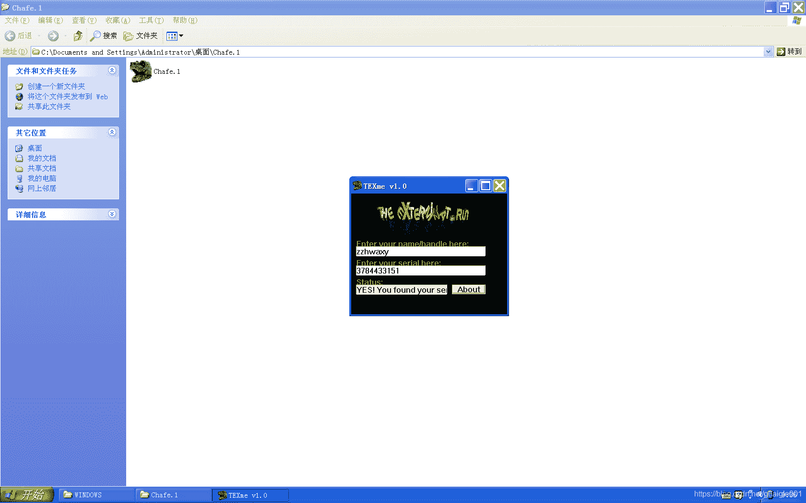
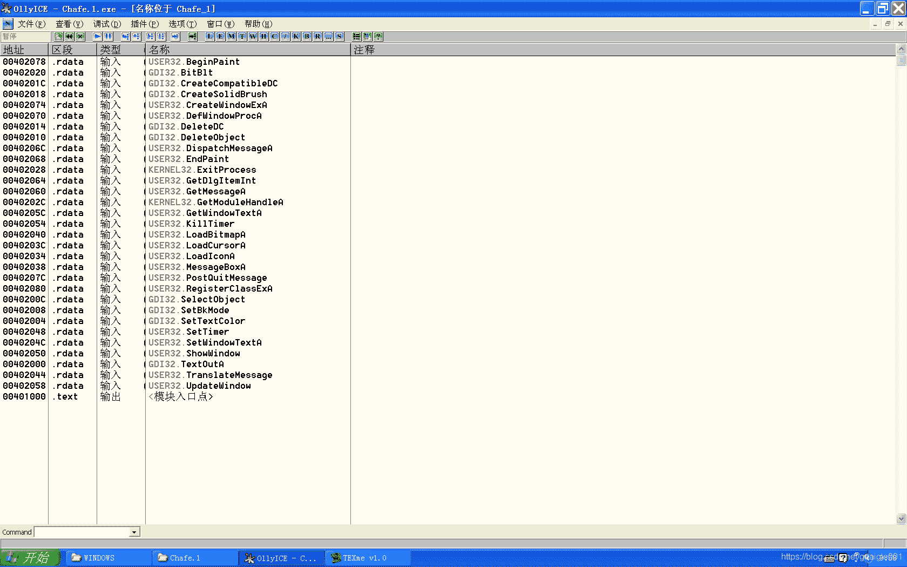
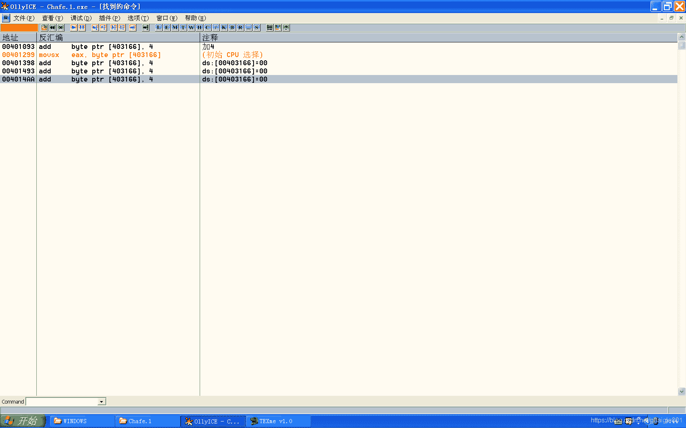

<!--yml
category: crackme160
date: 2022-04-27 18:16:51
-->

# CrackMe160 学习笔记 之 023_一剑名动江湖的博客-CSDN博客

> 来源：[https://blog.csdn.net/guaigle001/article/details/104231682](https://blog.csdn.net/guaigle001/article/details/104231682)

## 前言

这个程序需要我们写出注册机。



## 思路

没有注册按钮。说明是由定时器来判断输入的。

查看**API**。


找到**获取name输入**和**获取key输入**的函数。

在验证函数可以看到如下语句。

```
004012AE  |> \A2 67314000   mov     byte ptr [403167], al            ;  [403167] = al
004012B3  |.  83F8 10       cmp     eax, 10                          ;  得到的结果和0x10作比较 
```

而当输入错误的值时，结果才为**8**。

猜测还有其他对al赋值的语句。搜索指令。



一共四条。全部满足就能注册成功了。

## 分析

接下来我是按顺序分析的。

### 第一处：获取name

```
00401069   .  6A 14         push    14                               ; /Count = 14 (20.)
0040106B   .  68 8C314000   push    0040318C                         ; |Buffer = Chafe_1.0040318C
00401070   .  FF35 74314000 push    dword ptr [403174]               ; |hWnd = 0082033E (class='Edit',parent=008302CA)
00401076   .  E8 7D040000   call    <jmp.&USER32.GetWindowTextA>     ; \返回值为name的长度
0040107B   .  B9 14000000   mov     ecx, 14                          ;  ecx = 14
00401080   .  2BC8          sub     ecx, eax                         ;  ecx = ecx - eax
00401082   .  8DB8 8C314000 lea     edi, dword ptr [eax+40318C]      ;  0x40318C为name首地址,edi初始化为字符串结尾
00401088   >  C607 00       mov     byte ptr [edi], 0                ;  清零
0040108B   .  47            inc     edi                              ;  edi 指向下一个字符
0040108C   .  49            dec     ecx                              ;  计数器减一
0040108D   .^ 75 F9         jnz     short 00401088
0040108F   .  85C0          test    eax, eax
00401091   .  74 10         je      short 004010A3                   ;  name长度为0则跳转
00401093   .  8005 66314000>add     byte ptr [403166], 4             ;  加4
0040109A   .  C605 68314000>mov     byte ptr [403168], 0             ;  清零
004010A1   .  EB 06         jmp     short 004010A9
004010A3   >  8825 66314000 mov     byte ptr [403166], ah
004010A9   >  C9            leave
004010AA   .  C3            retn 
```

### 第二处：获取key

```
00401475   .  6A 00         push    0                                ; /IsSigned = FALSE
00401477   .  8D45 FC       lea     eax, dword ptr [ebp-4]           ; |
0040147A   .  50            push    eax                              ; |pSuccess
0040147B   .  6A 64         push    64                               ; |ControlID = 64 (100.)
0040147D   .  FF35 70314000 push    dword ptr [403170]               ; |hWnd = 008302CA ('TEXme v1.0',class='TEXcls')
00401483   .  E8 64000000   call    <jmp.&USER32.GetDlgItemInt>      ; \GetDlgItemInt
00401488   .  A3 88314000   mov     dword ptr [403188], eax          ;  返回输入的序列号int值
0040148D   .  837D FC 00    cmp     dword ptr [ebp-4], 0
00401491   .  74 07         je      short 0040149A
00401493   .  8005 66314000>add     byte ptr [403166], 4
0040149A   >  C9            leave
0040149B   .  C3            retn 
```

### 第三处：循环计算

```
00401361   .  8D3D 8C314000 lea     edi, dword ptr [40318C]          ;  取输入name的地址
00401367   .  0FBE05 683140>movsx   eax, byte ptr [403168]           ;  计数器的值赋给eax
0040136E   .  03F8          add     edi, eax
00401370   .  FE05 68314000 inc     byte ptr [403168]                ;  计数器加一
00401376   .  A1 88314000   mov     eax, dword ptr [403188]          ;  取出序列号的int值放入eax中
0040137B   .  8B25 A0314000 mov     esp, dword ptr [4031A0]
00401381   .  40            inc     eax                              ;  eax = eax + 1
00401382   .  FF05 88314000 inc     dword ptr [403188]               ;  序列号int值加一
00401388   .  3307          xor     eax, dword ptr [edi]             ;  做异或操作
0040138A   .  A3 88314000   mov     dword ptr [403188], eax          ;  用异或后新的值覆盖原来的int值
0040138F   .  803D 68314000>cmp     byte ptr [403168], 10            ;  计数器和0x10比较
00401396   .  75 07         jnz     short 0040139F
00401398   .  8005 66314000>add     byte ptr [403166], 4
0040139F   >  C9            leave
004013A0   .  C3            retn 
```

### 第四处：

```
0040149C   .  A1 88314000   mov     eax, dword ptr [403188]
004014A1   .  05 78241109   add     eax, 9112478
004014A6   .  85C0          test    eax, eax                                  ;  只有溢出才会为0
004014A8   .  75 09         jnz     short 004014B3
004014AA   .  8005 66314000>add     byte ptr [403166], 4
004014B1   .  EB 07         jmp     short 004014BA
004014B3   >  C605 66314000>mov     byte ptr [403166], 0
004014BA   >  8B25 A0314000 mov     esp, dword ptr [4031A0]
004014C0   .  C9            leave
004014C1   .  C3            retn 
```

### 验证函数

```
00401299  |.  0FBE05 663140>movsx   eax, byte ptr [403166]                    ;  从[403166]取出eax
004012A0  |.  3A05 67314000 cmp     al, byte ptr [403167]
004012A6  |.  75 06         jnz     short 004012AE                            ;  不相等则跳转
004012AE  |> \A2 67314000   mov     byte ptr [403167], al                     ;  [403167] = al
004012B3  |.  83F8 10       cmp     eax, 10                                   ;  得到的结果和0x10作比较
004012B6  |.  74 16         je      short 004012CE                            ;  关键跳
004012B8  |.  68 65304000   push    00403065                                  ; /Text = "Your serial is not valid."
004012BD  |.  FF35 7C314000 push    dword ptr [40317C]                        ; |hWnd = 00090352 ('Your serial is not valid.',class='Edit',parent=008302CA)
004012C3  |.  E8 66020000   call    <jmp.&USER32.SetWindowTextA>              ; \SetWindowTextA
004012C8  |.  33C0          xor     eax, eax
004012CA  |.  C9            leave
004012CB  |.  C2 1000       retn    10
004012CE  |>  68 7F304000   push    0040307F                                  ; /Text = "YES! You found your serial!!"
004012D3  |.  FF35 7C314000 push    dword ptr [40317C]                        ; |hWnd = 00090352 ('Your serial is not valid.',class='Edit',parent=008302CA)
004012D9  |.  E8 50020000   call    <jmp.&USER32.SetWindowTextA>              ; \SetWindowTextA
004012DE  |.  33C0          xor     eax, eax
004012E0  |.  C9            leave
004012E1  |.  C2 1000       retn    10 
```

其中，**每一处都会走验证函数**。

## 注册机代码

```
#include<stdio.h>
#include<limits.h>
#define real_v(x)  (x)>len? (0):(name[x])
int main()
{
  char name[20];
  int count=0x10;
  int len=0;
  unsigned int key=UINT_MAX-0x9112478+1;
  printf("name:");
  scanf("%[^\n]",name);
  len=strlen(name);
  while(count>0)
    {
      count--;
      key^=real_v(count)+(real_v(count+1)<<8)+(real_v(count+2)<<16)+(real_v(count+3)<<24);
      key--;

    }
  printf("key=%u \n",key);
  return 0;
} 
```