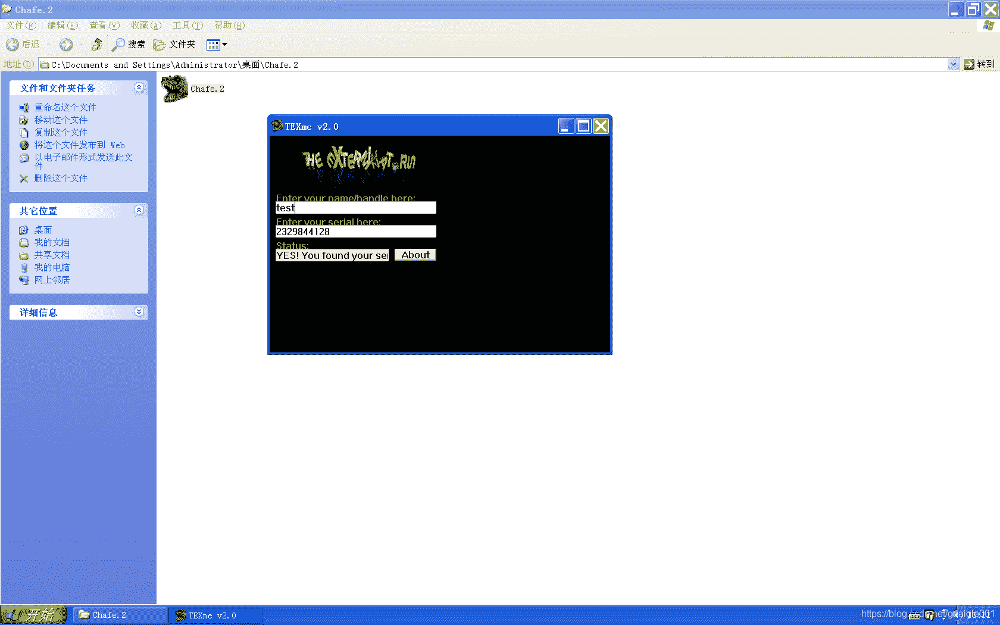
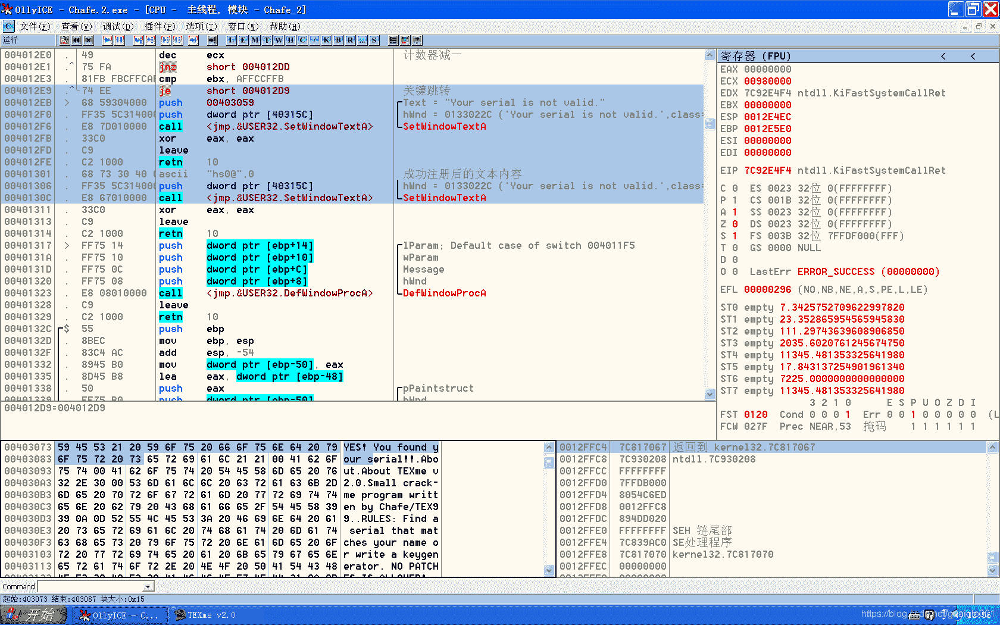
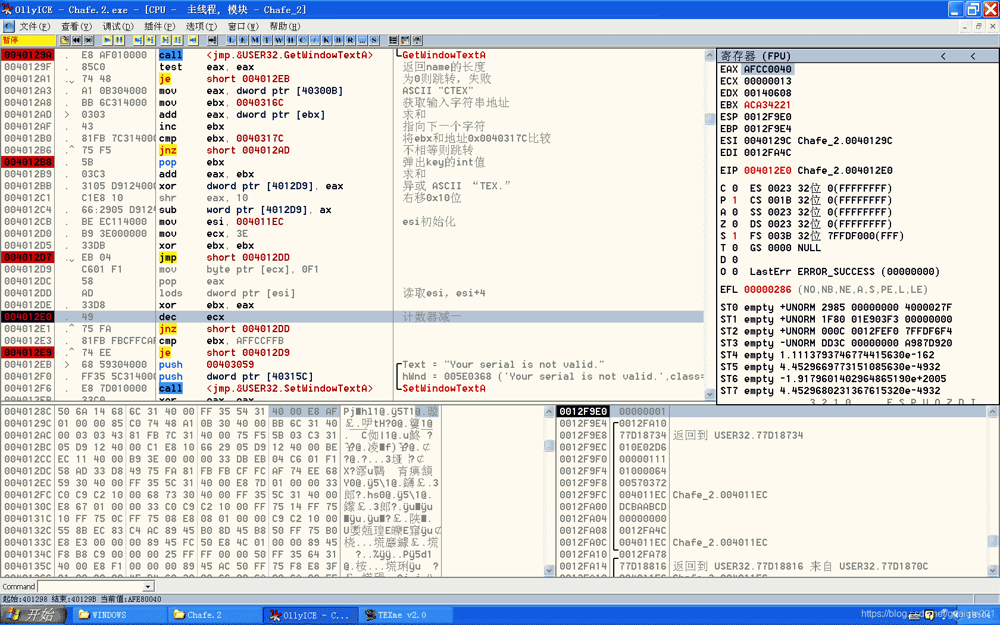
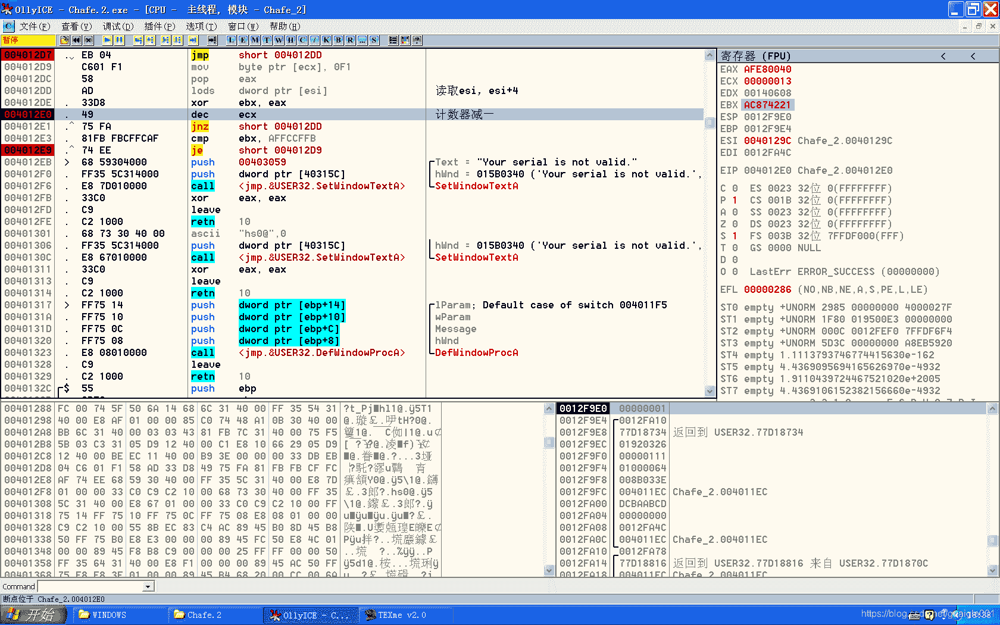

<!--yml
category: crackme160
date: 2022-04-27 18:16:49
-->

# CrackMe160 学习笔记 之 024_一剑名动江湖的博客-CSDN博客

> 来源：[https://blog.csdn.net/guaigle001/article/details/104247170](https://blog.csdn.net/guaigle001/article/details/104247170)

## 前言

这个程序和023是一个作者。

说实话，这个作者是真的牛逼，能用**汇编**写出这样的程序。

每次调他写的程序就很头疼。

然而我还是差不多只花了一天就写出了注册机。



## 思路

这个程序没有明显的字符串，搜索字符串在这里不管用了。

那么从**API**入手。

和上个程序一样，找到获取name和获取key的函数。

因为是重复同样的步骤，我这里就不啰嗦了。

找到关键跳转。

**虽然我这里写了注释，但是一开始可能并不那么容易看出来**。

```
004012E9   .^\74 EE         je      short 004012D9                   ;  关键跳转
004012EB   >  68 59304000   push    00403059                         ; /Text = "Your serial is not valid."
004012F0   .  FF35 5C314000 push    dword ptr [40315C]               ; |hWnd = 0133022C ('Your serial is not valid.',class='Edit',parent=01630166)
004012F6   .  E8 7D010000   call    <jmp.&USER32.SetWindowTextA>     ; \SetWindowTextA
004012FB   .  33C0          xor     eax, eax
004012FD   .  C9            leave
004012FE   .  C2 1000       retn    10
00401301   .  68 73 30 40 0>ascii   "hs0@",0                         ;  成功注册后的文本内容
00401306   .  FF35 5C314000 push    dword ptr [40315C]               ; |hWnd = 0133022C ('Your serial is not valid.',class='Edit',parent=01630166)
0040130C   .  E8 67010000   call    <jmp.&USER32.SetWindowTextA>     ; \SetWindowTextA 
```

首先观察这一条指令。

```
00401301   .  68 73 30 40 0>ascii   "hs0@",0                         ;  成功注册后的文本内容 
```

OD有点不智能，并不能分析出这条指令。

但比较上一条指令，就能得出 **push 403073** 才是真正的内容，而不是解释成数据。

如图。



还可以发现

```
004012BB   .  3105 D9124000 xor     dword ptr [4012D9], eax          ;  异或 ASCII “TEX.”
004012C1   .  C1E8 10       shr     eax, 10                          ;  右移0x10位
004012C4   .  66:2905 D9124>sub     word ptr [4012D9], ax 
```

这个程序对**0x004012D9**处的四个字节进行了修改，这可是代码段啊。

也就是说，**这个程序会修改自身的指令来完成验证**。

知道了这些，剩下来的就好分析了。

注册机是写的真的心累。

## 分析

整个程序很短小简洁。

```
00401273   .  6A 00         push    0                                ; /IsSigned = FALSE
00401275   .  8D45 FC       lea     eax, dword ptr [ebp-4]           ; |
00401278   .  50            push    eax                              ; |pSuccess
00401279   .  6A 64         push    64                               ; |ControlID = 64 (100.)
0040127B   .  FF35 50314000 push    dword ptr [403150]               ; |hWnd = 01630166 ('TEXme v2.0',class='CTEX')
00401281   .  E8 BC010000   call    <jmp.&USER32.GetDlgItemInt>      ; \GetDlgItemInt
00401286   .  837D FC 00    cmp     dword ptr [ebp-4], 0             ;  返回key的int值
0040128A   .  74 5F         je      short 004012EB
0040128C   .  50            push    eax
0040128D   .  6A 14         push    14                               ; /Count = 14 (20.)
0040128F   .  68 6C314000   push    0040316C                         ; |Buffer = Chafe_2.0040316C
00401294   .  FF35 54314000 push    dword ptr [403154]               ; |hWnd = 00A2020E (class='Edit',parent=01630166)
0040129A   .  E8 AF010000   call    <jmp.&USER32.GetWindowTextA>     ; \GetWindowTextA
0040129F   .  85C0          test    eax, eax                         ;  返回name的长度
004012A1   .  74 48         je      short 004012EB                   ;  为0则跳转，失败
004012A3   .  A1 0B304000   mov     eax, dword ptr [40300B]          ;  ASCII "CTEX"
004012A8   .  BB 6C314000   mov     ebx, 0040316C                    ;  获取输入字符串地址
004012AD   >  0303          add     eax, dword ptr [ebx]             ;  求和
004012AF   .  43            inc     ebx                              ;  指向下一个字符
004012B0   .  81FB 7C314000 cmp     ebx, 0040317C                    ;  将ebx和地址0x0040317C比较
004012B6   .^ 75 F5         jnz     short 004012AD                   ;  不相等则跳转
004012B8   .  5B            pop     ebx                              ;  弹出key的int值
004012B9   .  03C3          add     eax, ebx                         ;  求和
004012BB   .  3105 D9124000 xor     dword ptr [4012D9], eax          ;  异或 ASCII “TEX.”
004012C1   .  C1E8 10       shr     eax, 10                          ;  右移0x10位
004012C4   .  66:2905 D9124>sub     word ptr [4012D9], ax
004012CB   .  BE EC114000   mov     esi, 004011EC                    ;  esi初始化
004012D0   .  B9 3E000000   mov     ecx, 3E
004012D5   .  33DB          xor     ebx, ebx
004012D7   .  EB 04         jmp     short 004012DD
004012D9   >  A4            movs    byte ptr es:[edi], byte ptr [esi>
004012DA      6B            db      6B                               ;  CHAR 'k'
004012DB      1D            db      1D
004012DC      58            db      58                               ;  CHAR 'X'
004012DD   >  AD            lods    dword ptr [esi]                  ;  读取esi，esi+4
004012DE   .  33D8          xor     ebx, eax
004012E0   .  49            dec     ecx                              ;  计数器减一
004012E1   .^ 75 FA         jnz     short 004012DD
004012E3   .  81FB FBCFFCAF cmp     ebx, AFFCCFFB
004012E9   .^ 74 EE         je      short 004012D9                   ;  关键跳转
004012EB   >  68 59304000   push    00403059                         ; /Text = "Your serial is not valid."
004012F0   .  FF35 5C314000 push    dword ptr [40315C]               ; |hWnd = 0133022C ('Your serial is not valid.',class='Edit',parent=01630166)
004012F6   .  E8 7D010000   call    <jmp.&USER32.SetWindowTextA>     ; \SetWindowTextA
004012FB   .  33C0          xor     eax, eax
004012FD   .  C9            leave
004012FE   .  C2 1000       retn    10
00401301   .  68 73 30 40 0>ascii   "hs0@",0                         ;  成功注册后的文本内容
00401306   .  FF35 5C314000 push    dword ptr [40315C]               ; |hWnd = 0133022C ('Your serial is not valid.',class='Edit',parent=01630166)
0040130C   .  E8 67010000   call    <jmp.&USER32.SetWindowTextA>     ; \SetWindowTextA
00401311   .  33C0          xor     eax, eax
00401313   .  C9            leave
00401314   .  C2 1000       retn    10 
```

## 注册机代码

用逆向的方法求出注册机。
如果用穷举法，那是真的蠢。
**下面给出公式**。
懂的人自然都懂。

```
 58A91A69(name^计算出的固定值，这里只是举个例子)
+      KEY
  ----------------
  58??????  >>0x10 -> 58??
^ 00584554
  ----------------
  58??????
- 000058??
  ----------------
  585426EB 
```

```
 int array[]={
  0x55, 0x8B, 0xEC, 0x83, 0xC4, 0xFC, 0x8B, 0x45, 0x0C, 0x83, 0xF8, 0x10, 0x75, 0x0D, 0x6A, 0x00,
  0xE8, 0x6B, 0x02, 0x00, 0x00, 0x33, 0xC0, 0xC9, 0xC2, 0x10, 0x00, 0x83, 0xF8, 0x0F, 0x75, 0x0E,
  0x8B, 0x45, 0x08, 0xE8, 0x18, 0x01, 0x00, 0x00, 0x33, 0xC0, 0xC9, 0xC2, 0x10, 0x00, 0x83, 0xF8,
  0x01, 0x75, 0x06, 0x33, 0xC0, 0xC9, 0xC2, 0x10, 0x00, 0x3D, 0x11, 0x01, 0x00, 0x00, 0x0F, 0x85,
  0xE7, 0x00, 0x00, 0x00, 0x8B, 0x45, 0x14, 0x3B, 0x05, 0x60, 0x31, 0x40, 0x00, 0x75, 0x1A, 0x6A,
  0x00, 0x68, 0x96, 0x30, 0x40, 0x00, 0x68, 0xA7, 0x30, 0x40, 0x00, 0xFF, 0x75, 0x08, 0xE8, 0x17,
  0x02, 0x00, 0x00, 0x33, 0xC0, 0xC9, 0xC2, 0x10, 0x00, 0x3B, 0x05, 0x58, 0x31, 0x40, 0x00, 0x74,
  0x0C, 0x3B, 0x05, 0x54, 0x31, 0x40, 0x00, 0x0F, 0x85, 0xAE, 0x00, 0x00, 0x00, 0xC7, 0x05, 0xD9,
  0x12, 0x40, 0x00, 0x54, 0x45, 0x58, 0x00, 0x6A, 0x00, 0x8D, 0x45, 0xFC, 0x50, 0x6A, 0x64, 0xFF,
  0x35, 0x50, 0x31, 0x40, 0x00, 0xE8, 0xBC, 0x01, 0x00, 0x00, 0x83, 0x7D, 0xFC, 0x00, 0x74, 0x5F,
  0x50, 0x6A, 0x14, 0x68, 0x6C, 0x31, 0x40, 0x00, 0xFF, 0x35, 0x54, 0x31, 0x40, 0x00, 0xE8, 0xAF,
  0x01, 0x00, 0x00, 0x85, 0xC0, 0x74, 0x48, 0xA1, 0x0B, 0x30, 0x40, 0x00, 0xBB, 0x6C, 0x31, 0x40,
  0x00, 0x03, 0x03, 0x43, 0x81, 0xFB, 0x7C, 0x31, 0x40, 0x00, 0x75, 0xF5, 0x5B, 0x03, 0xC3, 0x31,
  0x05, 0xD9, 0x12, 0x40, 0x00, 0xC1, 0xE8, 0x10, 0x66, 0x29, 0x05, 0xD9, 0x12, 0x40, 0x00, 0xBE,
  0xEC, 0x11, 0x40, 0x00, 0xB9, 0x3E, 0x00, 0x00, 0x00, 0x33, 0xDB, 0xEB, 0x04, 0x54, 0x45, 0x58,
  0x00, 0xAD, 0x33, 0xD8, 0x49, 0x75, 0xFA, 0x81
};
#include<stdio.h>
#define real_v(x)  (x)>len? (0):(name[x])
#define real_n(x)  (x)>len_array? (0):(array[x])
#define offset (0x4012D9-0x4011EC)
int main()
{
  char* name;
  unsigned int key=0xAFFCCFFB,rerverse_key;
  unsigned int key_1,key_2,key_3,key_4;
  int len=0,len_array=sizeof(array)/sizeof(int);
  int count=0x0;
  unsigned int ebx=0,eax='XETC';
  printf("name:");
  scanf("%[^\n]",name);
  len=strlen(name);
  while(count< offset-4)
    {
      ebx^=real_n(count)+(real_n(count+1)<<8)+(real_n(count+2)<<16)+(real_n(count+3)<<24);
      count+=4;
    }

  key^=0x81FA7549;

  key^=0xD833AD04;

  key^=ebx;

  array[offset]=key>>8&0xFF;
  array[offset+1]=key>>16&0xFF;
  array[offset+2]=key>>24&0xFF;
  array[offset+3]=key&0xFF;

  count=0;
  while(count< 0x40317c-0x40316c)
    {
      eax+=real_v(count)+(real_v(count+1)<<8)+(real_v(count+2)<<16)+(real_v(count+3)<<24);

      count++;
    }

  rerverse_key=array[offset]+(array[offset+1]<<8)+(array[offset+2]<<16)+(array[offset+3]<<24);
  key=0;

  key_1=rerverse_key>>24&0xFF;
  key_2=(rerverse_key>>16&0xFF)^0x00^0x58;
  key_3=(rerverse_key>>8&0xFF)+0x58+((rerverse_key&0xFF)+key_2>0xFF?1:0)^0x45;
  key_4=((rerverse_key&0xFF)+key_2)%0x100^0x54;

  printf("key=%u\n",(key_1<<24)+(key_2<<16)+(key_3<<8)+key_4-eax);
  return 0;
} 
```

### 补充

调试这个程序的时候有一个坑。

**断点会影响最后生成的值**。如图。


真正的值。


只要**不在0x4011EC到0x4012E4区间下断点**就行了。或者下完直接取消。

这也是我注册机为什么写这么久的原因。

我还写了一个正向的程序用来验证。

```
 int array[]={
  0x55, 0x8B, 0xEC, 0x83, 0xC4, 0xFC, 0x8B, 0x45, 0x0C, 0x83, 0xF8, 0x10, 0x75, 0x0D, 0x6A, 0x00,
  0xE8, 0x6B, 0x02, 0x00, 0x00, 0x33, 0xC0, 0xC9, 0xC2, 0x10, 0x00, 0x83, 0xF8, 0x0F, 0x75, 0x0E,
  0x8B, 0x45, 0x08, 0xE8, 0x18, 0x01, 0x00, 0x00, 0x33, 0xC0, 0xC9, 0xC2, 0x10, 0x00, 0x83, 0xF8,
  0x01, 0x75, 0x06, 0x33, 0xC0, 0xC9, 0xC2, 0x10, 0x00, 0x3D, 0x11, 0x01, 0x00, 0x00, 0x0F, 0x85,
  0xE7, 0x00, 0x00, 0x00, 0x8B, 0x45, 0x14, 0x3B, 0x05, 0x60, 0x31, 0x40, 0x00, 0x75, 0x1A, 0x6A,
  0x00, 0x68, 0x96, 0x30, 0x40, 0x00, 0x68, 0xA7, 0x30, 0x40, 0x00, 0xFF, 0x75, 0x08, 0xE8, 0x17,
  0x02, 0x00, 0x00, 0x33, 0xC0, 0xC9, 0xC2, 0x10, 0x00, 0x3B, 0x05, 0x58, 0x31, 0x40, 0x00, 0x74,
  0x0C, 0x3B, 0x05, 0x54, 0x31, 0x40, 0x00, 0x0F, 0x85, 0xAE, 0x00, 0x00, 0x00, 0xC7, 0x05, 0xD9,
  0x12, 0x40, 0x00, 0x54, 0x45, 0x58, 0x00, 0x6A, 0x00, 0x8D, 0x45, 0xFC, 0x50, 0x6A, 0x64, 0xFF,
  0x35, 0x50, 0x31, 0x40, 0x00, 0xE8, 0xBC, 0x01, 0x00, 0x00, 0x83, 0x7D, 0xFC, 0x00, 0x74, 0x5F,
  0x50, 0x6A, 0x14, 0x68, 0x6C, 0x31, 0x40, 0x00, 0xFF, 0x35, 0x54, 0x31, 0x40, 0x00, 0xE8, 0xAF,
  0x01, 0x00, 0x00, 0x85, 0xC0, 0x74, 0x48, 0xA1, 0x0B, 0x30, 0x40, 0x00, 0xBB, 0x6C, 0x31, 0x40,
  0x00, 0x03, 0x03, 0x43, 0x81, 0xFB, 0x7C, 0x31, 0x40, 0x00, 0x75, 0xF5, 0x5B, 0x03, 0xC3, 0x31,
  0x05, 0xD9, 0x12, 0x40, 0x00, 0xC1, 0xE8, 0x10, 0x66, 0x29, 0x05, 0xD9, 0x12, 0x40, 0x00, 0xBE,
  0xEC, 0x11, 0x40, 0x00, 0xB9, 0x3E, 0x00, 0x00, 0x00, 0x33, 0xDB, 0xEB, 0x04, 0x54, 0x45, 0x58,
  0x00, 0xAD, 0x33, 0xD8, 0x49, 0x75, 0xFA, 0x81, 0xFB, 0xFB, 0xCF, 0xFC

};

#include<stdio.h>
#define real_v(x)  (x)>len? (0):(name[x])
#define real_n(x)  (x)>len_array? (0):(array[x])

#define offset (0x4012D9-0x4011EC)
int main(int argc, const char * argv[])
{
  char* name;
  unsigned int key=1234;
  int len=0,len_array=sizeof(array)/sizeof(int);
  int count=0;
  int sub_result=0;
  unsigned int eax='XETC';

  printf("name:");
  name=malloc(100);
  scanf("%[^\n]",name);
  len=strlen(name);
  while(count< 0x40317c-0x40316c)
    {
      eax+=real_v(count)+(real_v(count+1)<<8)+(real_v(count+2)<<16)+(real_v(count+3)<<24);

      count++;
    }
  eax+=key;
  printf("eax=%0X\n",eax);
  printf("%02X %02X %02X %02X\n",array[offset],array[offset+1],array[offset+2],array[offset+3]);

  array[offset]  ^=eax&0xFF;
  array[offset+1]^=eax>>8&0xFF;
  array[offset+2]^=eax>>16&0xFF;
  array[offset+3]^=eax>>24&0xFF;

  printf("%02X %02X %02X %02X\n",array[offset],array[offset+1],array[offset+2],array[offset+3]);
  eax>>=0x10;
  sub_result=array[offset]+(array[offset+1]<<8)-eax;
  array[offset]=sub_result&0xFF;
  array[offset+1]=sub_result>>8;

  printf("argv[1] %02X %02X %02X %02X\n",array[offset],array[offset+1],array[offset+2],array[offset+3]);
  eax=0;
  count=0;
  while(count< 0x3E*4)
    {
      eax^=real_n(count)+(real_n(count+1)<<8)+(real_n(count+2)<<16)+(real_n(count+3)<<24);

      count+=4;
    }
  printf("count=%d %08X %08X\n",count/4,eax,real_n(count)+(real_n(count+1)<<8)+(real_n(count+2)<<16)+(real_n(count+3)<<24));

  return 0;
} 
```