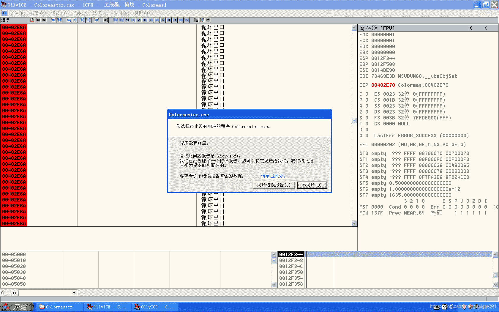
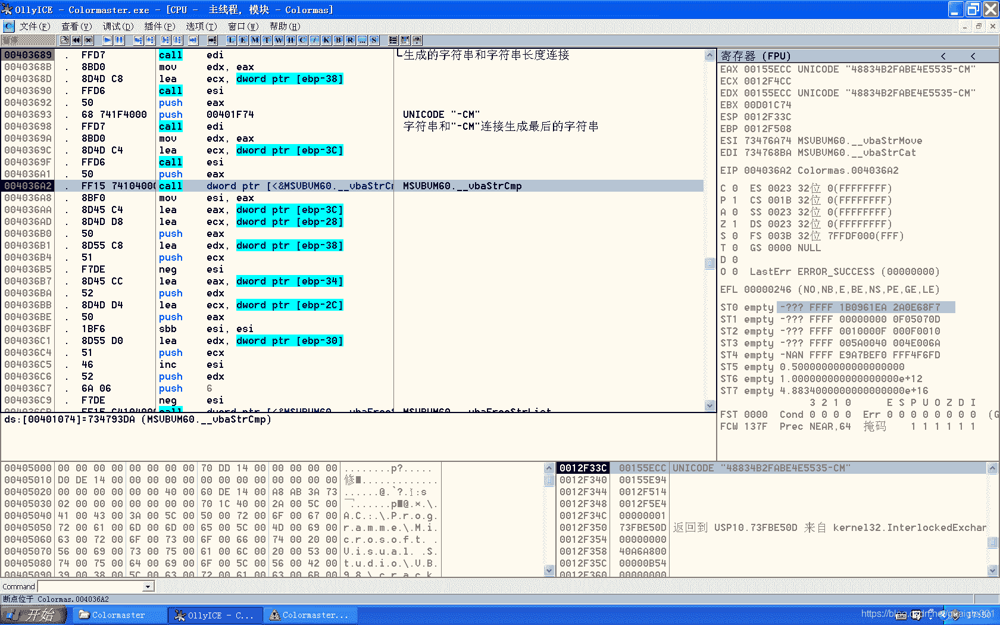
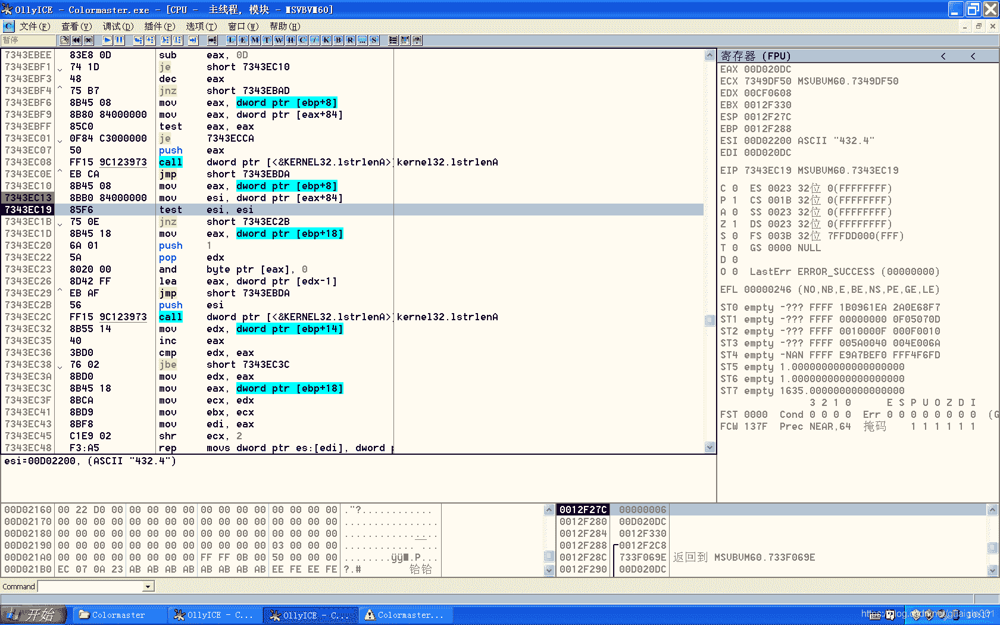

<!--yml
category: crackme160
date: 2022-04-27 18:16:44
-->

# CrackMe160 学习笔记 之 026_一剑名动江湖的博客-CSDN博客

> 来源：[https://blog.csdn.net/guaigle001/article/details/104267085](https://blog.csdn.net/guaigle001/article/details/104267085)

## 前言

一开始我是这样想的，这种难度不高指令又特别多的程序，而且还是**VB**，调试起来真的浪费时间。

调着调着发现没有这么简单。

这个程序竟然有**反调试**的功能，会**修改最终生成的KEY**！

竟然在这里栽了个跟斗。

而且为了调试这个程序，虚拟机不知死机了多少次。



不过索性还是做出来了。


## 思路

整个程序并不难，就是计算并拼接字符串。

重点在于它的反调试功能。

下面是输入“**test_**”时，生成的**KEY**。


**真正的KEY。**



为什么生成的**KEY**会不同呢？

因为第一次我在循环里下了断点，导致最后取到的是第一个字符的ASCII码。

本来正常循环应该取到的是最后一个字符的ASCII码并计算的。

那么不下断点就能避免反调试吗？

错。

根据我的测试，**在代码段0x402B11 ～ 0x403099 间运行时或者下断点都会让最终生成的KEY改变**。**F9步过即可。**

而且这个状态是延续的。除非关掉程序。

在此程序段之外下断点最后跑的就是正常值。

因为对VB研究得不深，我暂时还没能搞明白它的机制。

以后有机会再说吧。

## 分析

```
00402B10   > \55            push    ebp
00402B11   .  8BEC          mov     ebp, esp
00402B13   .  83EC 0C       sub     esp, 0C
00402B16   .  68 C6114000   push    <jmp.&MSVBVM60.__vbaExceptHandler>                ;  SE 处理程序安装
00402C06   .  FF91 A0000000 call    dword ptr [ecx+A0]                                ;  输入name字符串地址保存到ebp-28中
00402CB5   .  52            push    edx                                               ; /获取name
00402CB6   .  FF15 10104000 call    dword ptr [<&MSVBVM60.__vbaLenBstr>]              ; \返回长度
00402CBC   .  33C9          xor     ecx, ecx
00402CBE   .  83F8 04       cmp     eax, 4                                            ;  长度和4比较
00402CC1   .  0F9EC1        setle   cl                                                ;  如果小于，cl置为1
00402CC4   .  F7D9          neg     ecx                                               ;  求补码
00402CC6   .  66:898D DCFEF>mov     word ptr [ebp-124], cx
00402CCD   .  8D4D D8       lea     ecx, dword ptr [ebp-28]
00402CD0   .  FF15 F0104000 call    dword ptr [<&MSVBVM60.__vbaFreeStr>]              ;  MSVBVM60.__vbaFreeStr
00402CD6   .  8D4D B8       lea     ecx, dword ptr [ebp-48]
00402CD9   .  FF15 F4104000 call    dword ptr [<&MSVBVM60.__vbaFreeObj>]              ;  MSVBVM60.__vbaFreeObj
00402CDF   .  66:399D DCFEF>cmp     word ptr [ebp-124], bx
00402CE6   .  0F84 B0000000 je      00402D9C                                          ;  大于则跳转
00402DF4   .  52            push    edx                                               ; /压入name字符串地址
00402DF5   .  FF15 10104000 call    dword ptr [<&MSVBVM60.__vbaLenBstr>]              ; \又获取name长度
00402E0D   .  50            push    eax                                               ; /Step8
00402E0E   .  8D95 FCFEFFFF lea     edx, dword ptr [ebp-104]                          ; |
00402E14   .  51            push    ecx                                               ; |End8
00402E15   .  8D85 88FEFFFF lea     eax, dword ptr [ebp-178]                          ; |
00402E1B   .  52            push    edx                                               ; |Start8
00402E1C   .  8D8D 98FEFFFF lea     ecx, dword ptr [ebp-168]                          ; |
00402E22   .  50            push    eax                                               ; |TMPend8
00402E23   .  8D55 DC       lea     edx, dword ptr [ebp-24]                           ; |
00402E26   .  51            push    ecx                                               ; |TMPstep8
00402E27   .  52            push    edx                                               ; |Counter8
00402E28   .  C785 0CFFFFFF>mov     dword ptr [ebp-F4], 3                             ; |STEP:1
00402E32   .  C785 04FFFFFF>mov     dword ptr [ebp-FC], 1                             ; |START:1
00402E3C   .  C785 FCFEFFFF>mov     dword ptr [ebp-104], 2                            ; |END:strlen(name)
00402E46   .  FF15 3C104000 call    dword ptr [<&MSVBVM60.__vbaVarForInit>]           ; \循环初始化变量
00402E64   > /399D 7CFEFFFF cmp     dword ptr [ebp-184], ebx                          ;  循环终止条件
00402E6A   . |0F84 29020000 je      00403099                                          ;  循环出口
00402EB4   .  50            push    eax                                               ; /取字符串
00402EB5   .  FF15 24104000 call    dword ptr [<&MSVBVM60.#516>]                      ; \取首字符ASCII码
00402EBB   .  8B0E          mov     ecx, dword ptr [esi]
00402EBD   .  56            push    esi
00402EBE   .  8985 E8FEFFFF mov     dword ptr [ebp-118], eax                          ;  ASCII码保存到ebp-118中
00402EF4   .  FF52 50       call    dword ptr [edx+50]                                ;  取[ebp-124]+84的地址赋值给ebp-28
00402F12   > \8B45 D8       mov     eax, dword ptr [ebp-28]                           ;  字符串432.4保存到eax中
00402F15   .  50            push    eax
00402F16   .  FF15 B0104000 call    dword ptr [<&MSVBVM60.__vbaR8Str>]                ;  字符串转浮点数
00402F1C   .  0FBF8D E8FEFF>movsx   ecx, word ptr [ebp-118]                           ;  保存的ASCII码从ebp-118移动到ecx中
00402F23   .  898D 74FEFFFF mov     dword ptr [ebp-18C], ecx                          ;  保存的ASCII码从ecx移动到ebp-18c中
00402F29   .  8D55 8C       lea     edx, dword ptr [ebp-74]
00402F2C   .  DB85 74FEFFFF fild    dword ptr [ebp-18C]                               ;  字符串首字符ASCII码压入ST0中
00402F32   .  52            push    edx
00402F33   .  C785 0CFFFFFF>mov     dword ptr [ebp-F4], 5
00402F3D   .  C745 94 15000>mov     dword ptr [ebp-6C], 15
00402F44   .  C745 8C 02000>mov     dword ptr [ebp-74], 2
00402F4B   .  DD9D 6CFEFFFF fstp    qword ptr [ebp-194]                               ;  弹出到ebp-194中
00402F51   .  DC8D 6CFEFFFF fmul    qword ptr [ebp-194]                               ;  和ST0中432.4相乘
00402F57   .  DC0D 00114000 fmul    qword ptr [401100]                                ;  和固定数17.79相乘
00402F5D   .  DD9D 14FFFFFF fstp    qword ptr [ebp-EC]                                ;  弹出到ebp-EC中
00402F73   .  50            push    eax                                               ;  31 00 35 00
00402F74   .  FF15 C0104000 call    dword ptr [<&MSVBVM60.#573>]                      ;  把ebp-68里的字符串转成宽字符型ASCII码放到ebp-7C中
00402F7A   .  8B8D D4FEFFFF mov     ecx, dword ptr [ebp-12C]
00402F80   .  8D95 0CFFFFFF lea     edx, dword ptr [ebp-F4]
00402F86   .  8D85 7CFFFFFF lea     eax, dword ptr [ebp-84]
00402F8C   .  52            push    edx                                               ; /上面的乘法结果
00402F8D   .  8B19          mov     ebx, dword ptr [ecx]                              ; |
00402F8F   .  8D8D 6CFFFFFF lea     ecx, dword ptr [ebp-94]                           ; |
00402F95   .  50            push    eax                                               ; |15
00402F96   .  51            push    ecx                                               ; |除法结果保存在ebp-124中
00402F97   .  FF15 98104000 call    dword ptr [<&MSVBVM60.__vbaVarDiv>]               ; \__vbaVarDiv
00402F9D   .  8D55 D0       lea     edx, dword ptr [ebp-30]
00402FA0   .  50            push    eax                                               ; /String8
00402FA1   .  52            push    edx                                               ; |ARG2
00402FA2   .  FF15 A0104000 call    dword ptr [<&MSVBVM60.__vbaStrVarVal>]            ; \除法结果转成字符串
004030C6   .  8985 E4FEFFFF mov     dword ptr [ebp-11C], eax                          ;  这一步竟然是给[ebp-11C]+84赋值
004030CC   .  FF52 50       call    dword ptr [edx+50]                                ;  取[ebp-11C]+84的地址赋值给ebp-28
004030F0   .  8B4D D8       mov     ecx, dword ptr [ebp-28]                           ;  从ebp-28取出浮点数字符串
004030F6   .  FF15 B0104000 call    dword ptr [<&MSVBVM60.__vbaR8Str>]                ;  转成浮点数压入ST0中
004030FC   .  FF15 64104000 call    dword ptr [<&MSVBVM60.__vbaFPFix>]                ;  清除小数位
00403102   .  83EC 08       sub     esp, 8
00403105   .  DD1C24        fstp    qword ptr [esp]                                   ;  弹出到[esp]中
00403108   .  FF15 7C104000 call    dword ptr [<&MSVBVM60.__vbaStrR8>]                ;  转成字符串
0040310E   .  8BD0          mov     edx, eax
00403110   .  8D4D D4       lea     ecx, dword ptr [ebp-2C]
00403113   .  FF15 DC104000 call    dword ptr [<&MSVBVM60.__vbaStrMove>]              ;  字符串移动到ebp-2C中
004032EA   .  8B4D D4       mov     ecx, dword ptr [ebp-2C]                           ;  从ebp-2C取出浮点数字符串到ecx中
004032ED   .  8985 60FEFFFF mov     dword ptr [ebp-1A0], eax                          ;  字符串首字符ASCII码保存到ebp-1A0中
004032F3   .  DB85 60FEFFFF fild    dword ptr [ebp-1A0]                               ;  压入浮点寄存器ST0中
004032F9   .  51            push    ecx
004032FA   .  DD9D 58FEFFFF fstp    qword ptr [ebp-1A8]                               ;  弹出到ebp-1A8中
00403300   .  FF15 B0104000 call    dword ptr [<&MSVBVM60.__vbaR8Str>]                ;  MSVBVM60.__vbaR8Str
00403306   .  DC85 58FEFFFF fadd    qword ptr [ebp-1A8]                               ;  浮点数求和
0040330C   .  8B16          mov     edx, dword ptr [esi]
0040330E   .  56            push    esi
0040330F   .  C785 0CFFFFFF>mov     dword ptr [ebp-F4], 5
00403319   .  DD9D 14FFFFFF fstp    qword ptr [ebp-EC]                                ;  结果弹出到ebp-EC中
00403365   .  FF15 B0104000 call    dword ptr [<&MSVBVM60.__vbaR8Str>]                ;  MSVBVM60.__vbaR8Str
0040336B   .  66:6BDB 19    imul    bx, bx, 19                                        ;  bx = bx * 0x19
0040336F   .  0F80 0B050000 jo      00403880
00403375   .  0FBFC3        movsx   eax, bx
00403378   .  8985 54FEFFFF mov     dword ptr [ebp-1AC], eax
0040337E   .  8D4D 8C       lea     ecx, dword ptr [ebp-74]
00403381   .  DB85 54FEFFFF fild    dword ptr [ebp-1AC]                               ;  乘法结果压入ebp-1AC中
00403387   .  8D95 7CFFFFFF lea     edx, dword ptr [ebp-84]
0040338D   .  51            push    ecx
0040338E   .  52            push    edx                                               ;  压入要保存的地址ebp-7C
0040338F   .  C745 8C 05000>mov     dword ptr [ebp-74], 5
00403396   .  DD9D 4CFEFFFF fstp    qword ptr [ebp-1B4]                               ;  弹出到ebp-1B4中
0040339C   .  DCA5 4CFEFFFF fsub    qword ptr [ebp-1B4]                               ;  减去乘法结果
004033A2   .  DD5D 94       fstp    qword ptr [ebp-6C]                                ;  弹出到ebp-6C中
004033A5   .  DFE0          fstsw   ax
004033A7   .  A8 0D         test    al, 0D
004033A9   .  0F85 CC040000 jnz     0040387B
004033AF   .  FF15 C0104000 call    dword ptr [<&MSVBVM60.#573>]                      ;  结果16进制字符串保存到ebp-7C中
0040340E   .  FF15 C0104000 call    dword ptr [<&MSVBVM60.#573>]                      ;  把前面的结果转成16进制字符串
00403493   .  FF15 10104000 call    dword ptr [<&MSVBVM60.__vbaLenBstr>]              ; \又又又求长度
00403499   .  0FAFD8        imul    ebx, eax                                          ;  ebx = ebx * eax
0040349C   .  8B8D ACFEFFFF mov     ecx, dword ptr [ebp-154]
004034A2   .  C785 FCFEFFFF>mov     dword ptr [ebp-104], 3
004034AC   .  0F80 CE030000 jo      00403880
004034B2   .  83EB 1B       sub     ebx, 1B                                           ;  ebx = ebx - 0x1B
004034B5   .  8D95 0CFFFFFF lea     edx, dword ptr [ebp-F4]                           ;  字符串1：ebp-EC 浮点数
004034BB   .  0F80 BF030000 jo      00403880
004034C1   .  899D 04FFFFFF mov     dword ptr [ebp-FC], ebx
004034C7   .  8B19          mov     ebx, dword ptr [ecx]
004034C9   .  8D85 7CFFFFFF lea     eax, dword ptr [ebp-84]                           ;  字符串2：ebp-7C
004034CF   .  52            push    edx
004034D0   .  8D8D 6CFFFFFF lea     ecx, dword ptr [ebp-94]
004034D6   .  50            push    eax
004034D7   .  51            push    ecx
004034D8   .  FF15 A4104000 call    dword ptr [<&MSVBVM60.__vbaVarCat>]               ;  连接字符串，地址保存在ebp-8C中
004034DE   .  50            push    eax                                               ;  字符串1：ebp-8C
004034DF   .  8D95 4CFFFFFF lea     edx, dword ptr [ebp-B4]                           ;  字符串2：ebp-AC
004034E5   .  8D85 3CFFFFFF lea     eax, dword ptr [ebp-C4]
004034EB   .  52            push    edx
004034EC   .  50            push    eax
004034ED   .  FF15 A4104000 call    dword ptr [<&MSVBVM60.__vbaVarCat>]               ;  连接字符串，地址保存在ebp-BC中
004034F3   .  8D8D FCFEFFFF lea     ecx, dword ptr [ebp-104]
004034F9   .  50            push    eax                                               ;  字符串1：ebp-BC
004034FA   .  8D95 2CFFFFFF lea     edx, dword ptr [ebp-D4]
00403500   .  51            push    ecx                                               ;  字符串2：ebp-FC
00403501   .  52            push    edx
00403502   .  FF15 A4104000 call    dword ptr [<&MSVBVM60.__vbaVarCat>]               ;  连接字符串，地址保存在ebp-CC中
00403508   .  50            push    eax                                               ; /String8
00403689   .  FFD7          call    edi                                               ; \生成的字符串和字符串长度连接
0040368B   .  8BD0          mov     edx, eax
0040368D   .  8D4D C8       lea     ecx, dword ptr [ebp-38]
00403690   .  FFD6          call    esi
00403692   .  50            push    eax
00403693   .  68 741F4000   push    00401F74                                          ;  UNICODE "-CM"
00403698   .  FFD7          call    edi                                               ;  字符串和"-CM"连接生成最后的字符串
004036A2   .  FF15 74104000 call    dword ptr [<&MSVBVM60.__vbaStrCmp>]               ;  MSVBVM60.__vbaStrCmp
004036EB   . /0F84 AB000000 je      0040379C                                          ;  关键跳 
```

### call dword ptr [edx+50] 这个函数

因为它取的是固定字符串，我就找了一下，取的是参数+84的地址。


## 注册机代码

```
#include<stdio.h>
int main()
{

  int len;
  double s;
  char* key;
  char* name;
  printf("name:");
  key=malloc(100);
  name=malloc(100);
  scanf("%[^\n]",name);
  if((len=strlen(name))<5)
    return 0;
  int eax=name[len-1]*432.4*17.79/15;
  sprintf(key,"%d%X%X%d%d%s",eax+name[0],eax-name[0]*0x19,eax,len*name[0]-0x1B,len,"-CM");
  printf("%s\n",key);
  free(name);
  free(key);
  return 0;
} 
```