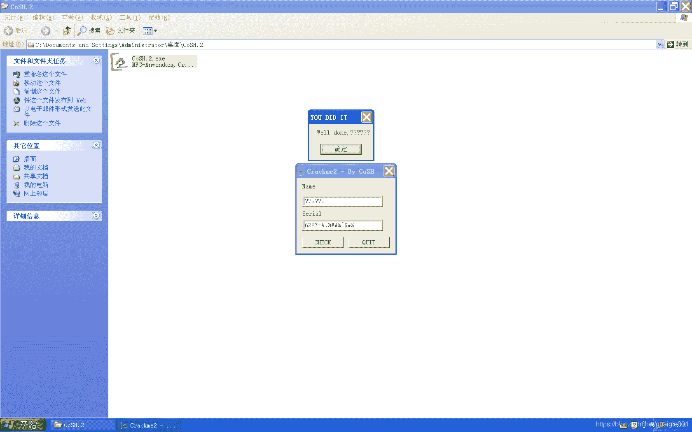

<!--yml
category: crackme160
date: 2022-04-27 18:16:40
-->

# CrackMe160 学习笔记 之 028_一剑名动江湖的博客-CSDN博客

> 来源：[https://blog.csdn.net/guaigle001/article/details/104270725](https://blog.csdn.net/guaigle001/article/details/104270725)

## 前言

这个题目又给我水博客的机会了。




## 思路

固定字符注册码。它还只比较前几位，真的不严谨。

本来还想看一下库函数的，跳转太多就作罢了，下次一定。

## 分析

```
004014B0   .  64:A1 0000000>mov     eax, dword ptr fs:[0]
004014B6   .  6A FF         push    -1
004014B8   .  68 701B4000   push    00401B70
004014BD   .  50            push    eax
004014BE   .  64:8925 00000>mov     dword ptr fs:[0], esp
004014C5   .  83EC 08       sub     esp, 8
004014C8   .  53            push    ebx
004014C9   .  55            push    ebp
004014CA   .  56            push    esi
004014CB   .  8BF1          mov     esi, ecx
004014CD   .  57            push    edi
004014CE   .  8DBE A0000000 lea     edi, dword ptr [esi+A0]
004014D4   .  8BCF          mov     ecx, edi
004014D6   .  E8 6F030000   call    <jmp.&MFC42.#3876_CWnd::GetWindo>;  获取name长度
004014DB   .  8B1D FC214000 mov     ebx, dword ptr [<&USER32.PostQui>;  USER32.PostQuitMessage
004014E1   .  83F8 05       cmp     eax, 5                           ;  和5比较
004014E4   .  7E 50         jle     short 00401536                   ;  小于则跳转
004014E6   .  8D6E 60       lea     ebp, dword ptr [esi+60]
004014E9   .  8BCD          mov     ecx, ebp
004014EB   .  E8 5A030000   call    <jmp.&MFC42.#3876_CWnd::GetWindo>;  获取serial长度
004014F0   .  83F8 05       cmp     eax, 5                           ;  和5比较
004014F3   .  7E 41         jle     short 00401536                   ;  小于则跳转
004014F5   .  8D86 E0000000 lea     eax, dword ptr [esi+E0]
004014FB   .  8BCF          mov     ecx, edi
004014FD   .  50            push    eax
004014FE   .  E8 41030000   call    <jmp.&MFC42.#3874_CWnd::GetWindo>;  获取name地址
00401503   .  8DBE E4000000 lea     edi, dword ptr [esi+E4]
00401509   .  8BCD          mov     ecx, ebp
0040150B   .  57            push    edi
0040150C   .  E8 33030000   call    <jmp.&MFC42.#3874_CWnd::GetWindo>;  获取key地址
00401511   .  8B07          mov     eax, dword ptr [edi]
00401513   .  8038 36       cmp     byte ptr [eax], 36               ;  6
00401516   .  75 1E         jnz     short 00401536
00401518   .  8078 01 32    cmp     byte ptr [eax+1], 32             ;  2
0040151C   .  75 18         jnz     short 00401536
0040151E   .  8078 02 38    cmp     byte ptr [eax+2], 38             ;  8
00401522   .  75 12         jnz     short 00401536
00401524   .  8078 03 37    cmp     byte ptr [eax+3], 37             ;  7
00401528   .  75 0C         jnz     short 00401536
0040152A   .  8078 04 2D    cmp     byte ptr [eax+4], 2D             ;  -
0040152E   .  75 06         jnz     short 00401536
00401530   .  8078 05 41    cmp     byte ptr [eax+5], 41             ;  A
00401534   .  74 17         je      short 0040154D                   ;  关键跳
00401536   >  6A 00         push    0
00401538   .  68 64304000   push    00403064                         ;  ASCII "ERROR"
0040153D   .  68 38304000   push    00403038                         ;  ASCII "One of the Details you entered was wrong"
00401542   .  8BCE          mov     ecx, esi
00401544   .  E8 F5020000   call    <jmp.&MFC42.#4224_CWnd::MessageB>
00401549   .  6A 00         push    0
0040154B   .  FFD3          call    ebx
0040154D   >  8D8E E0000000 lea     ecx, dword ptr [esi+E0]
00401553   .  8D5424 14     lea     edx, dword ptr [esp+14]
00401557   .  51            push    ecx
00401558   .  68 2C304000   push    0040302C                         ;  ASCII "Well done,"
0040155D   .  52            push    edx
0040155E   .  E8 D5020000   call    <jmp.&MFC42.#926_operator+>
00401563   .  68 3C314000   push    0040313C
00401568   .  50            push    eax
00401569   .  8D4424 18     lea     eax, dword ptr [esp+18]
0040156D   .  C74424 28 000>mov     dword ptr [esp+28], 0
00401575   .  50            push    eax
00401576   .  E8 B7020000   call    <jmp.&MFC42.#924_operator+>
0040157B   .  8B00          mov     eax, dword ptr [eax]
0040157D   .  6A 00         push    0
0040157F   .  68 20304000   push    00403020                         ;  ASCII "YOU DID IT" 
```