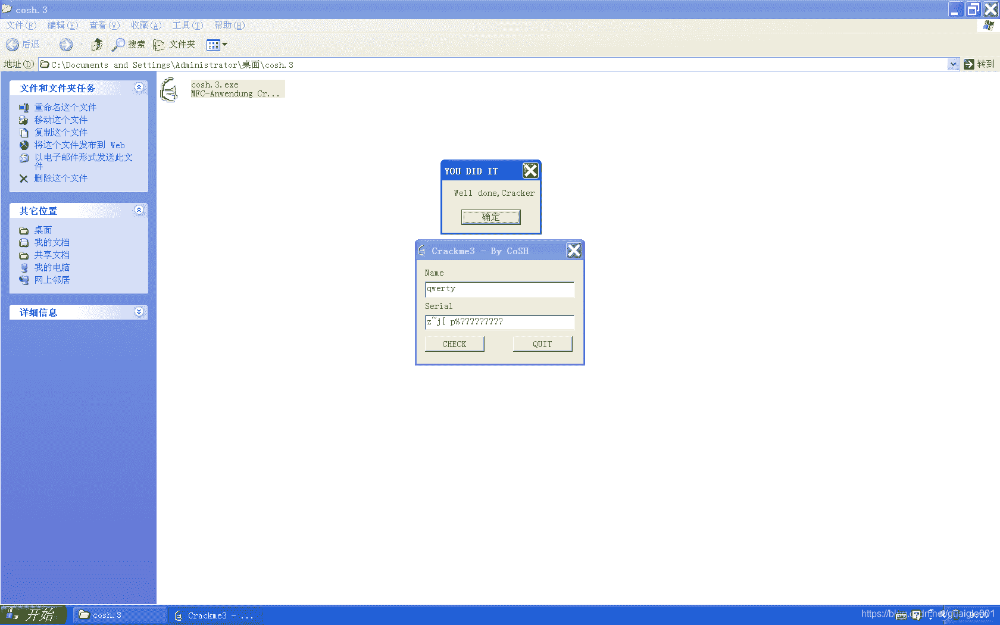

<!--yml
category: crackme160
date: 2022-04-27 18:16:37
-->

# CrackMe160 学习笔记 之 029_一剑名动江湖的博客-CSDN博客

> 来源：[https://blog.csdn.net/guaigle001/article/details/104273912](https://blog.csdn.net/guaigle001/article/details/104273912)

## 前言

又是一个简单的题。


水一水博客。


## 思路

比上个crackme进步一点。至少作者知道用逐个字符串比较来避免明文serial了。

但并没有增加什么难度。

而且这个程序依旧写的不严谨，serial比name长依然可以验证通过。

## 分析

```
004014B1  |.  8BEC          mov     ebp, esp
004014B3  |.  6A FF         push    -1
004014B5  |.  68 C21B4000   push    00401BC2                         ;  SE 处理程序安装
004014BA  |.  64:A1 0000000>mov     eax, dword ptr fs:[0]
004014C0  |.  50            push    eax
004014C1  |.  64:8925 00000>mov     dword ptr fs:[0], esp
004014C8  |.  83EC 14       sub     esp, 14
004014CB  |.  53            push    ebx
004014CC  |.  56            push    esi
004014CD  |.  57            push    edi
004014CE  |.  894D E0       mov     dword ptr [ebp-20], ecx
004014D1  |.  8D4D E4       lea     ecx, dword ptr [ebp-1C]
004014D4  |.  E8 83030000   call    <jmp.&MFC42.#540_CString::CStrin>
004014D9  |.  C745 FC 00000>mov     dword ptr [ebp-4], 0
004014E0  |.  8D4D F0       lea     ecx, dword ptr [ebp-10]
004014E3  |.  E8 74030000   call    <jmp.&MFC42.#540_CString::CStrin>
004014E8  |.  C645 FC 01    mov     byte ptr [ebp-4], 1
004014EC  |.  8B4D E0       mov     ecx, dword ptr [ebp-20]
004014EF  |.  81C1 A0000000 add     ecx, 0A0
004014F5  |.  E8 AA030000   call    <jmp.&MFC42.#3876_CWnd::GetWindo>;  获取name长度
004014FA  |.  8945 EC       mov     dword ptr [ebp-14], eax
004014FD  |.  837D EC 05    cmp     dword ptr [ebp-14], 5            ;  和5比较
00401501  |.  7F 05         jg      short 00401508                   ;  大于则跳转
00401503  |.  E9 BB000000   jmp     004015C3
00401508  |>  8B4D E0       mov     ecx, dword ptr [ebp-20]
0040150B  |.  83C1 60       add     ecx, 60
0040150E  |.  E8 91030000   call    <jmp.&MFC42.#3876_CWnd::GetWindo>;  获取serial长度
00401513  |.  8945 E8       mov     dword ptr [ebp-18], eax
00401516  |.  837D E8 05    cmp     dword ptr [ebp-18], 5            ;  和5比较
0040151A  |.  7F 05         jg      short 00401521                   ;  大于则跳转
0040151C  |.  E9 A2000000   jmp     004015C3
00401521  |>  8B45 E0       mov     eax, dword ptr [ebp-20]
00401524  |.  05 E0000000   add     eax, 0E0
00401529  |.  50            push    eax
0040152A  |.  8B4D E0       mov     ecx, dword ptr [ebp-20]
0040152D  |.  81C1 A0000000 add     ecx, 0A0
00401533  |.  E8 66030000   call    <jmp.&MFC42.#3874_CWnd::GetWindo>;  获取name地址
00401538  |.  8B4D E0       mov     ecx, dword ptr [ebp-20]
0040153B  |.  81C1 E4000000 add     ecx, 0E4
00401541  |.  51            push    ecx
00401542  |.  8B4D E0       mov     ecx, dword ptr [ebp-20]
00401545  |.  83C1 60       add     ecx, 60
00401548  |.  E8 51030000   call    <jmp.&MFC42.#3874_CWnd::GetWindo>;  获取serial地址
0040154D  |.  8B55 E0       mov     edx, dword ptr [ebp-20]
00401550  |.  81C2 E0000000 add     edx, 0E0
00401556  |.  52            push    edx
00401557  |.  8D4D E4       lea     ecx, dword ptr [ebp-1C]
0040155A  |.  E8 39030000   call    <jmp.&MFC42.#858_CString::operat>;  name地址保存到ebp-1C
0040155F  |.  8B45 E0       mov     eax, dword ptr [ebp-20]
00401562  |.  05 E4000000   add     eax, 0E4
00401567  |.  50            push    eax
00401568  |.  8D4D F0       lea     ecx, dword ptr [ebp-10]
0040156B  |.  E8 28030000   call    <jmp.&MFC42.#858_CString::operat>;  serial地址保存到ebp-10
00401570  |.  33C0          xor     eax, eax
00401572  |.  33DB          xor     ebx, ebx
00401574  |.  33C9          xor     ecx, ecx
00401576  |.  B9 01000000   mov     ecx, 1                           ;  ecx = 1
0040157B  |.  33D2          xor     edx, edx
0040157D  |.  8B45 E4       mov     eax, dword ptr [ebp-1C]          ;  从ebp-1C取出name地址保存到eax中
00401580  |>  8A18          /mov     bl, byte ptr [eax]
00401582  |.  32D9          |xor     bl, cl                          ;  bl = bl ^ cl
00401584  |.  8818          |mov     byte ptr [eax], bl              ;  异或后的值覆盖原来的值
00401586  |.  41            |inc     ecx                             ;  cl = cl + 1
00401587  |.  40            |inc     eax                             ;  指向下一个字符
00401588  |.  8038 00       |cmp     byte ptr [eax], 0               ;  比较是否到结尾
0040158B  |.^ 75 F3         \jnz     short 00401580
0040158D  |.  33C0          xor     eax, eax
0040158F  |.  33DB          xor     ebx, ebx
00401591  |.  33C9          xor     ecx, ecx
00401593  |.  B9 0A000000   mov     ecx, 0A                          ;  ecx = 0xA
00401598  |.  33D2          xor     edx, edx
0040159A  |.  8B45 F0       mov     eax, dword ptr [ebp-10]          ;  从ebp-10取出serial地址保存到eax中
0040159D  |>  8A18          /mov     bl, byte ptr [eax]
0040159F  |.  32D9          |xor     bl, cl
004015A1  |.  8818          |mov     byte ptr [eax], bl              ;  异或后的值覆盖原来的值
004015A3  |.  41            |inc     ecx                             ;  cl = cl + 1
004015A4  |.  40            |inc     eax                             ;  指向下一个字符
004015A5  |.  8038 00       |cmp     byte ptr [eax], 0
004015A8  |.^ 75 F3         \jnz     short 0040159D
004015AA  |.  8B45 E4       mov     eax, dword ptr [ebp-1C]          ;  异或后的name
004015AD  |.  8B55 F0       mov     edx, dword ptr [ebp-10]          ;  异或后的serial
004015B0  |>  33C9          /xor     ecx, ecx
004015B2  |.  8A18          |mov     bl, byte ptr [eax]
004015B4  |.  8A0A          |mov     cl, byte ptr [edx]
004015B6  |.  3AD9          |cmp     bl, cl                          ;  逐个字符比较，不相等则失败
004015B8  |.  75 09         |jnz     short 004015C3                  ;  关键跳
004015BA  |.  40            |inc     eax                             ;  指向下一个字符
004015BB  |.  42            |inc     edx                             ;  指向下一个字符
004015BC  |.  8038 00       |cmp     byte ptr [eax], 0               ;  比较name是否到结尾
004015BF  |.^ 75 EF         \jnz     short 004015B0
004015C1  |.  EB 16         jmp     short 004015D9
004015C3  |>  6A 00         push    0
004015C5  |.  68 6C304000   push    0040306C                         ;  ASCII "ERROR"
004015CA  |.  68 40304000   push    00403040                         ;  ASCII "One of the Details you entered was wrong"
004015CF  |.  8B4D E0       mov     ecx, dword ptr [ebp-20]
004015D2  |.  E8 BB020000   call    <jmp.&MFC42.#4224_CWnd::MessageB>
004015D7  |.  EB 14         jmp     short 004015ED
004015D9  |>  6A 00         push    0
004015DB  |.  68 34304000   push    00403034                         ;  ASCII "YOU DID IT"
004015E0  |.  68 20304000   push    00403020                         ;  ASCII "Well done,Cracker" 
```

## 注册机代码

```
#include<stdio.h>
int main()
{
  char* name;
  int len=0;
  printf("name:");
  scanf("%[^\n]",name);
  if((len=strlen(name))<=5)
    return 0;
  for(int i=0;i<len;i++)
    {
      printf("%c",name[i]^(i+1)^(0xA+i));
    }
  return 0;

} 
```