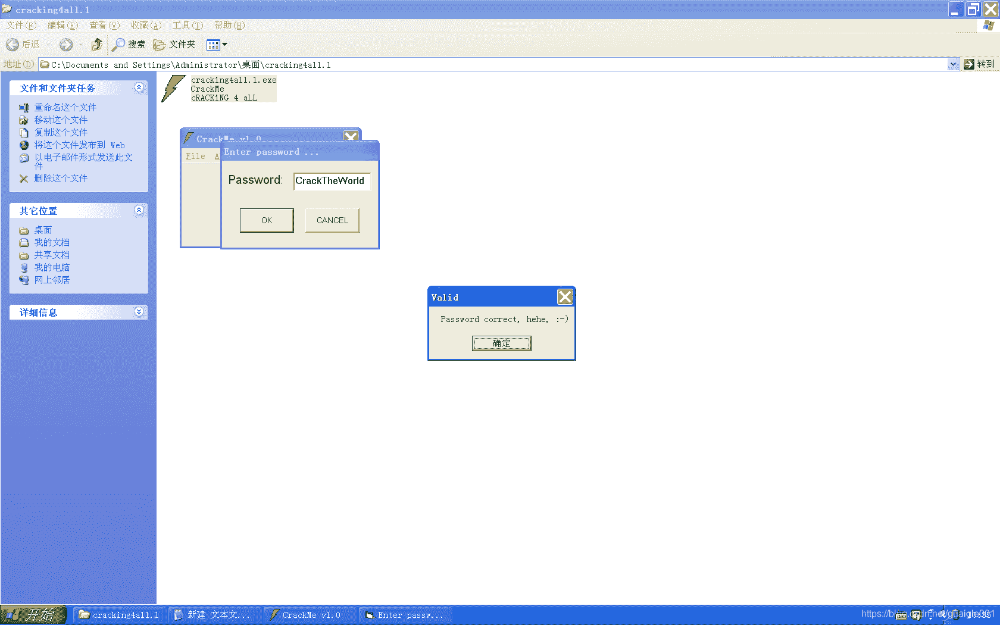
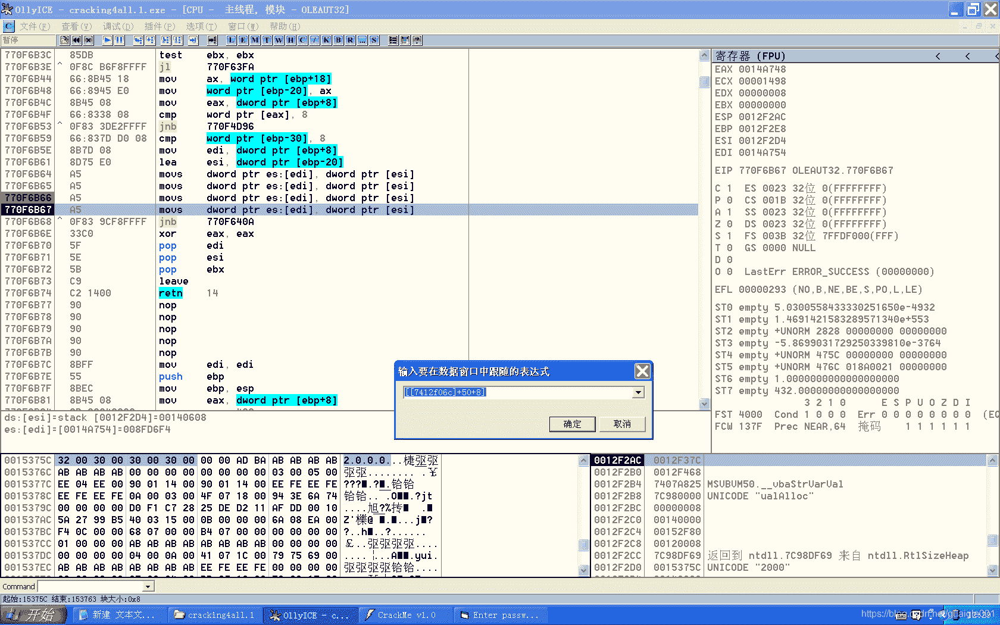

<!--yml
category: crackme160
date: 2022-04-27 18:16:35
-->

# CrackMe160 学习笔记 之 030_一剑名动江湖的博客-CSDN博客

> 来源：[https://blog.csdn.net/guaigle001/article/details/104276972](https://blog.csdn.net/guaigle001/article/details/104276972)

## 前言

这个也是简单题。

不过VB的反汇编看起来要花点时间。

不像上一个，几分钟就搞定了。



继续水博客。


## 思路

注册码是固定字符串。只不过它加了点运算，没有那么直接而已。

## 分析

```
004030F0   > \55            push    ebp
004030F1   .  8BEC          mov     ebp, esp
004030F3   .  83EC 0C       sub     esp, 0C
004030F6   .  68 56104000   push    <jmp.&MSVBVM50.__vbaExceptHandle>;  SE 处理程序安装
0040318C   .  FF92 A0000000 call    dword ptr [edx+A0]               ;  取字符串地址
004031BE   .  FF15 F8604000 call    dword ptr [<&MSVBVM50.__vbaVarMo>;  从edx移动到ecx中
004031C4   .  8D4D B8       lea     ecx, dword ptr [ebp-48]
004031C7   .  FF15 B0614000 call    dword ptr [<&MSVBVM50.__vbaFreeO>;  MSVBVM50.__vbaFreeObj
004031CD   .  8D4D D8       lea     ecx, dword ptr [ebp-28]
004031D0   .  8D55 A8       lea     edx, dword ptr [ebp-58]
004031D3   .  51            push    ecx                              ; /var18
004031D4   .  52            push    edx                              ; |retBuffer8
004031D5   .  BE 01000000   mov     esi, 1                           ; |esi初始化为1
004031DA   .  FF15 18614000 call    dword ptr [<&MSVBVM50.__vbaLenVa>; \__vbaLenVar
004031E0   .  50            push    eax
004031E1   .  FF15 74614000 call    dword ptr [<&MSVBVM50.__vbaI2Var>;  MSVBVM50.__vbaI2Var
004031E7   .  8985 F8FEFFFF mov     dword ptr [ebp-108], eax         ;  ebp-108保存长度
004031ED   .  8BFE          mov     edi, esi                         ;  edi = esi
004031EF   >  66:3BBD F8FEF>cmp     di, word ptr [ebp-108]
004031F6   .  8B1D 6C614000 mov     ebx, dword ptr [<&MSVBVM50.__vba>;  MSVBVM50.__vbaStrVarVal
004031FC   .  0F8F 2D010000 jg      0040332F                         ;  循环出口
00403202   .  66:83FE 04    cmp     si, 4                            ;  和4比较
00403206   .  7E 05         jle     short 0040320D                   ;  大于4时esi重新初始化为1
00403208   .  BE 01000000   mov     esi, 1                           ;  esi = 1
0040320D   >  0FBFCF        movsx   ecx, di                          ;  计数器初始化
00403210   .  8D45 A8       lea     eax, dword ptr [ebp-58]
00403213   .  8D55 D8       lea     edx, dword ptr [ebp-28]
00403216   .  50            push    eax                              ; /Length8
00403217   .  51            push    ecx                              ; |START: ecx
00403218   .  8D45 98       lea     eax, dword ptr [ebp-68]          ; |
0040321B   .  52            push    edx                              ; |原字符串
0040321C   .  50            push    eax                              ; |RetBUFFER
0040321D   .  C745 B0 01000>mov     dword ptr [ebp-50], 1            ; |LENGTH: 1
00403224   .  C745 A8 02000>mov     dword ptr [ebp-58], 2            ; |
0040322B   .  FF15 38614000 call    dword ptr [<&MSVBVM50.#632>]     ; \取第n个字符保存到ebp-60
00403231   .  B8 02000000   mov     eax, 2                           ;  eax = 2
00403236   .  8D8D 78FFFFFF lea     ecx, dword ptr [ebp-88]
0040323C   .  0FBFD6        movsx   edx, si                          ;  edx = si
0040323F   .  8985 78FFFFFF mov     dword ptr [ebp-88], eax
00403245   .  8945 88       mov     dword ptr [ebp-78], eax
00403248   .  51            push    ecx                              ; /Length8
00403249   .  8D45 88       lea     eax, dword ptr [ebp-78]          ; |
0040324C   .  52            push    edx                              ; |START: edx
0040324D   .  8D8D 68FFFFFF lea     ecx, dword ptr [ebp-98]          ; |
00403253   .  50            push    eax                              ; |dString8
00403254   .  51            push    ecx                              ; |RetBUFFER
00403255   .  C745 80 01000>mov     dword ptr [ebp-80], 1            ; |LENGTH: 1
0040325C   .  C745 90 D0070>mov     dword ptr [ebp-70], 7D0          ; |
00403263   .  FF15 38614000 call    dword ptr [<&MSVBVM50.#632>]     ; \取固定字符串“2000”第n个字符保存到ebp-90
00403269   .  8D55 98       lea     edx, dword ptr [ebp-68]
0040326C   .  8D45 C0       lea     eax, dword ptr [ebp-40]
0040326F   .  52            push    edx
00403270   .  50            push    eax
00403271   .  FFD3          call    ebx                              ;  返回真实字符串地址
00403273   .  50            push    eax                              ; /String
00403274   .  FF15 0C614000 call    dword ptr [<&MSVBVM50.#516>]     ; \返回字符ASCII码
0040327A   .  0FBFD0        movsx   edx, ax                          ;  edx = ax
0040327D   .  8D8D 68FFFFFF lea     ecx, dword ptr [ebp-98]
00403283   .  8D45 BC       lea     eax, dword ptr [ebp-44]
00403286   .  51            push    ecx
00403287   .  50            push    eax
00403288   .  8995 E8FEFFFF mov     dword ptr [ebp-118], edx         ;  [ebp-118] = edx
0040328E   .  FFD3          call    ebx                              ;  返回真实字符串地址
00403290   .  50            push    eax                              ; /String
00403291   .  FF15 0C614000 call    dword ptr [<&MSVBVM50.#516>]     ; \返回字符ASCII码
00403297   .  8B95 E8FEFFFF mov     edx, dword ptr [ebp-118]         ;  edx = [ebp-118]
0040329D   .  0FBFC8        movsx   ecx, ax                          ;  ecx = ax
004032A0   .  33D1          xor     edx, ecx                         ;  edx = edx ^ ecx
004032A2   .  8D85 58FFFFFF lea     eax, dword ptr [ebp-A8]
004032A8   .  52            push    edx
004032A9   .  50            push    eax
004032AA   .  FF15 64614000 call    dword ptr [<&MSVBVM50.#608>]     ;  MSVBVM50.rtcVarBstrFromAnsi
004032B0   .  8D4D C8       lea     ecx, dword ptr [ebp-38]
004032B3   .  8D95 58FFFFFF lea     edx, dword ptr [ebp-A8]
004032B9   .  51            push    ecx
004032BA   .  8D85 48FFFFFF lea     eax, dword ptr [ebp-B8]
004032C0   .  52            push    edx
004032C1   .  50            push    eax
004032C2   .  FF15 70614000 call    dword ptr [<&MSVBVM50.__vbaVarCa>;  地址保存到ebp-B0
004032C8   .  8BD0          mov     edx, eax
004032CA   .  8D4D C8       lea     ecx, dword ptr [ebp-38]
004032CD   .  FF15 F8604000 call    dword ptr [<&MSVBVM50.__vbaVarMo>;  地址从ebp-B0移动到ebp-30
00403312   .  66:46         inc     si                               ;  si = si + 1
00403314   .  B8 01000000   mov     eax, 1                           ;  eax = 1
00403319   .  66:03C7       add     ax, di                           ;  ax = ax + di
0040331C   .  0F80 44020000 jo      00403566
00403322   .  0F80 3E020000 jo      00403566
00403328   .  8BF8          mov     edi, eax                         ;  edi = eax
0040332A   .^ E9 C0FEFFFF   jmp     004031EF
00403338   .  50            push    eax                              ; /var18
00403339   .  51            push    ecx                              ; |var28
0040333A   .  C785 40FFFFFF>mov     dword ptr [ebp-C0], 004027C8     ; |UNICODE "qBQSYdXUe_B\V"
00403344   .  C785 38FFFFFF>mov     dword ptr [ebp-C8], 8008         ; |
0040334E   .  FF15 44614000 call    dword ptr [<&MSVBVM50.__vbaVarTs>; \__vbaVarTstEq
00403370   . /0F84 E8000000 je      0040345E                         ;  关键跳 
```

其中，我想知道固定字符串“2000”地址从哪里来的。就找了一下。

如图。

这里的跳转实在太多了，至于怎么计算出的得到的就懒得找了。感兴趣的可以去研究一下。

### 注册机算法

```
#include<stdio.h>
int main()
{
  char* name;
  char* const_s="2000";
  int len=0;
  printf("name:");
  scanf("%[^\n]",name);
  if((len=strlen(name))<=5)
     return 0;
  for(int i=0;i<len;i++)
    {
      printf("%c",name[i]^const_s[i%4]);
    }
  return 0;
} 
```