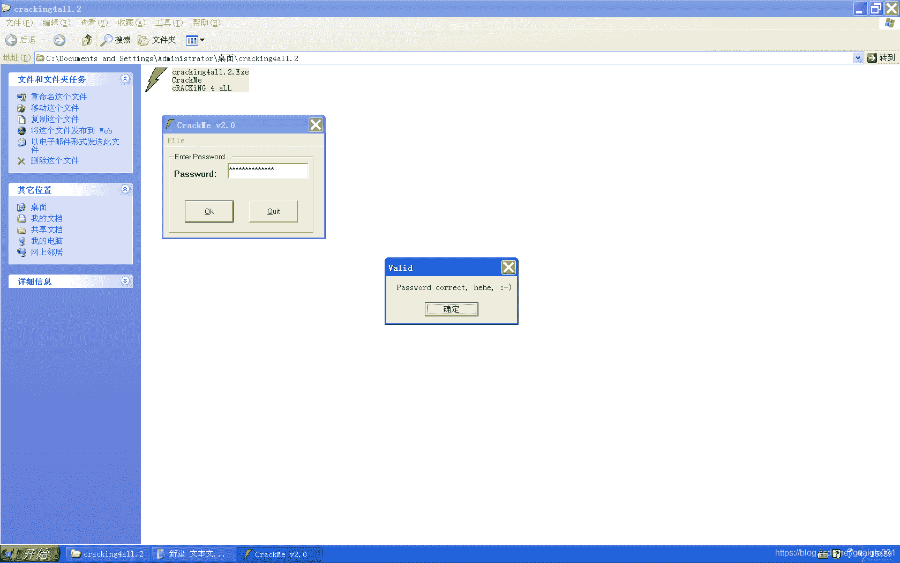

<!--yml
category: crackme160
date: 2022-04-27 18:16:33
-->

# CrackMe160 学习笔记 之 031_一剑名动江湖的博客-CSDN博客

> 来源：[https://blog.csdn.net/guaigle001/article/details/104280189](https://blog.csdn.net/guaigle001/article/details/104280189)

## 前言

和上个题目差不多，就是多加了一步异或。


最近连续几个都是这种简单题目。

逼着我水博客。


## 分析

```
00402B40   > \55            push    ebp
00402B41   .  8BEC          mov     ebp, esp
00402B43   .  83EC 0C       sub     esp, 0C
00402B46   .  68 36104000   push    <jmp.&MSVBVM50.__vbaExceptHandle>;  SE 处理程序安装
00402C14   .  FF15 00614000 call    dword ptr [<&MSVBVM50.__vbaVarMo>;  字符串地址从ebp-60移动到ebp-20中
00402C44   .  8985 E8FEFFFF mov     dword ptr [ebp-118], eax         ;  字符串长度保存在ebp-118中
00402C4A   .  B8 01000000   mov     eax, 1                           ;  eax = 1
00402C59   .  8B1D 40614000 mov     ebx, dword ptr [<&MSVBVM50.#632>>;  MSVBVM50.rtcMidCharVar
00402C5F   .  0F8F EF000000 jg      00402D54
00402C65   .  0FBFD0        movsx   edx, ax
00402C68   .  8D4D 98       lea     ecx, dword ptr [ebp-68]
00402C6B   .  8D45 D8       lea     eax, dword ptr [ebp-28]
00402C6E   .  51            push    ecx                              ; /Length8
00402C6F   .  52            push    edx                              ; |START:1
00402C70   .  8D4D 88       lea     ecx, dword ptr [ebp-78]          ; |
00402C73   .  50            push    eax                              ; |字符串地址:ebp-20
00402C74   .  51            push    ecx                              ; |新字符串地址:ebp-70
00402C75 > .  C745 A0 01000>mov     dword ptr [ebp-60], 1            ; |LENGTH:1
00402C7C   .  C745 98 02000>mov     dword ptr [ebp-68], 2            ; |
00402C83   .  FFD3          call    ebx                              ; \rtcMidCharVar
00402C85   .  8D95 78FFFFFF lea     edx, dword ptr [ebp-88]
00402C8B   .  6A 01         push    1                                ;  取1个字符
00402C8D   .  8D85 68FFFFFF lea     eax, dword ptr [ebp-98]
00402C93   .  52            push    edx
00402C94   .  50            push    eax
00402C95   .  C745 80 04000>mov     dword ptr [ebp-80], 4            ;  取字符4
00402C9C   .  C785 78FFFFFF>mov     dword ptr [ebp-88], 2
00402CA6   .  FF15 AC614000 call    dword ptr [<&MSVBVM50.#617>]     ;  从左数取1个字符地址保存到ebp-90中
00402CAC   .  8D8D 68FFFFFF lea     ecx, dword ptr [ebp-98]
00402CB2   .  8D55 AC       lea     edx, dword ptr [ebp-54]
00402CB5   .  51            push    ecx
00402CB6   .  52            push    edx
00402CB7   .  FFD7          call    edi
00402CB9   .  50            push    eax
00402CBA   .  FFD6          call    esi                              ;  转成ASCII码
00402CBC   .  0FBFD8        movsx   ebx, ax                          ;  保存在ebx中
00402CBF   .  8D45 88       lea     eax, dword ptr [ebp-78]
00402CC2   .  8D4D B0       lea     ecx, dword ptr [ebp-50]
00402CC5   .  50            push    eax
00402CC6   .  51            push    ecx
00402CC7   .  FFD7          call    edi
00402CC9   .  50            push    eax
00402CCA   .  FFD6          call    esi                              ;  转成ASCII码
00402CCC   .  0FBFD0        movsx   edx, ax                          ;  保存在edx中
00402CCF   .  33DA          xor     ebx, edx                         ;  ebx = ebx ^ edx
00402CD1   .  8D85 58FFFFFF lea     eax, dword ptr [ebp-A8]
00402CD7   .  53            push    ebx
00402CD8   .  50            push    eax
00402CD9   .  FF15 6C614000 call    dword ptr [<&MSVBVM50.#608>]     ;  异或的结果保存在ebp-0xA0中
00402CDF   .  8D4D C8       lea     ecx, dword ptr [ebp-38]          ;  字符串1地址:ebp-30
00402CE2   .  8D95 58FFFFFF lea     edx, dword ptr [ebp-A8]          ;  字符串2地址:ebp-0xA0
00402CE8   .  51            push    ecx
00402CE9   .  8D85 48FFFFFF lea     eax, dword ptr [ebp-B8]
00402CEF   .  52            push    edx
00402CF0   .  50            push    eax
00402CF1   .  FF15 78614000 call    dword ptr [<&MSVBVM50.__vbaVarCa>;  连接字符串保存到ebp-0xB0中
00402CF7   .  8BD0          mov     edx, eax
00402CF9   .  8D4D C8       lea     ecx, dword ptr [ebp-38]
00402CFC   .  FF15 00614000 call    dword ptr [<&MSVBVM50.__vbaVarMo>;  从ebp-0xB0移动到ebp-30中
00402D3A   .  B8 01000000   mov     eax, 1                           ;  eax = 1
00402D3F   .  83C4 18       add     esp, 18
00402D42   .  66:0345 C4    add     ax, word ptr [ebp-3C]            ;  计数器值加一
00402D46   .  0F80 A0030000 jo      004030EC
00402D4C   .  8945 C4       mov     dword ptr [ebp-3C], eax          ;  保存计数器的值
00402D4F   .^ E9 FEFEFFFF   jmp     00402C52
00402D54   >  8D55 C8       lea     edx, dword ptr [ebp-38]
00402D57   .  8D45 98       lea     eax, dword ptr [ebp-68]
00402D5A   .  52            push    edx                              ; /var18
00402D5B   .  50            push    eax                              ; |retBuffer8
00402D5C   .  C745 E8 01000>mov     dword ptr [ebp-18], 1            ; |
00402D63   .  FF15 20614000 call    dword ptr [<&MSVBVM50.__vbaLenVa>; \又取了字符串长度
00402D69   .  50            push    eax
00402D6A   .  FF15 7C614000 call    dword ptr [<&MSVBVM50.__vbaI2Var>;  MSVBVM50.__vbaI2Var
00402D70   .  B9 01000000   mov     ecx, 1                           ;  ecx = 1
00402D75   .  8985 E0FEFFFF mov     dword ptr [ebp-120], eax         ;  字符串长度保存在ebp-120中
00402D7B   .  8BC1          mov     eax, ecx
00402D7D   .  8945 C4       mov     dword ptr [ebp-3C], eax
00402D80   >  66:3B85 E0FEF>cmp     ax, word ptr [ebp-120]           ;  重复了上个题目的步骤
00402EB5   .^\E9 C6FEFFFF   jmp     00402D80
00402EC3   .  50            push    eax                              ; /var18
00402EC4   .  51            push    ecx                              ; |var28
00402EC5   .  C785 30FFFFFF>mov     dword ptr [ebp-D0], 0040259C     ; |UNICODE "VeiajeEjbavwij"
00402ECF   .  C785 28FFFFFF>mov     dword ptr [ebp-D8], 8008         ; |
00402ED9   .  FF15 A4614000 call    dword ptr [<&MSVBVM50.__vbaVarTs>; \__vbaVarTstNe
00402EDF   .  66:85C0       test    ax, ax
00402EE2   .  0F84 A1000000 je      00402F89
00402FA2   .  51            push    ecx                              ; /var18
00402FA3   .  52            push    edx                              ; |var28
00402FA4   .  C785 30FFFFFF>mov     dword ptr [ebp-D0], 0040259C     ; |UNICODE "VeiajeEjbavwij"
00402FAE   .  C785 28FFFFFF>mov     dword ptr [ebp-D8], 8008         ; |
00402FB8   .  FF15 4C614000 call    dword ptr [<&MSVBVM50.__vbaVarTs>; \__vbaVarTstEq
00402FBE   .  66:85C0       test    ax, ax
00402FC1   .  0F84 8F000000 je      00403056                         ;  关键跳 
```

### 注册机代码

```
#include<stdio.h>
int main()
{
  char* name;
  char* const_s="2000";
  int len=0;
  printf("name:");
  scanf("%[^\n]",name);
  for(int i=0;i<len;i++)
    {
      printf("%c",name[i]^'4'^const_s[i%4]);
    }
  return 0;
} 
```