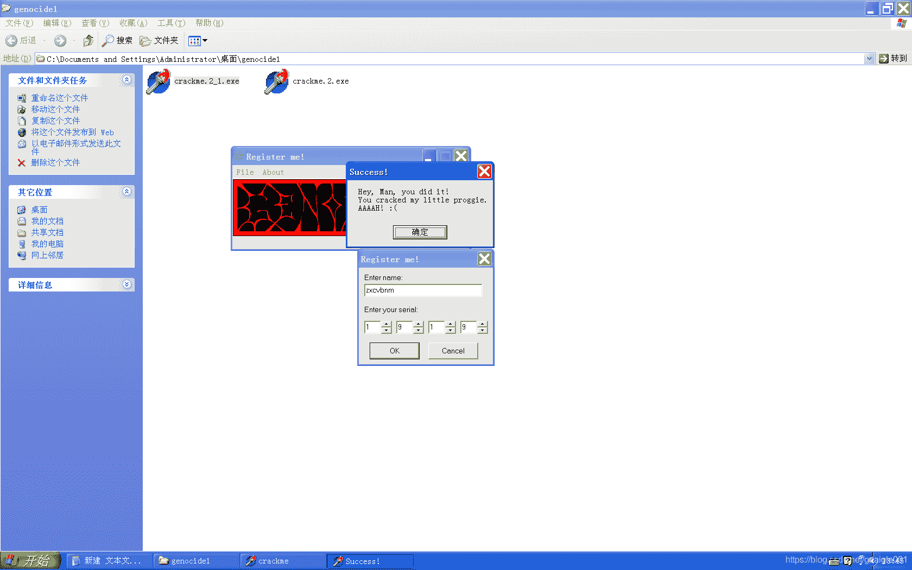

<!--yml
category: crackme160
date: 2022-04-27 18:16:31
-->

# CrackMe160 学习笔记 之 032_一剑名动江湖的博客-CSDN博客

> 来源：[https://blog.csdn.net/guaigle001/article/details/104294761](https://blog.csdn.net/guaigle001/article/details/104294761)

## 前言

这个程序算法流程并不难。

主要因为它不是直接调用函数的，是通过寄存器调用的，一开始有点让人摸不着头脑。



## 思路

**UPX**壳。脱壳。

绕过检测文件。**dump**下来生成新程序。(懒得在虚拟机里创建 文件了)

首先当然是搜索找到**获取name和key的函数**。

通过观察发现，每次**输入key**以后都会走这个函数。

```
00437DD3  |> \E8 00FEFFFF   call    00437BD8                         ;  Default case of switch 00437D34 
```

而且只有输入key的时候会走验证函数，name不会。

分析这个函数，找到关键跳。

```
00437CC9  |. /75 14         jnz     short 00437CDF                   ;  关键跳,不为0则跳转 
```

其中关键跳影响了**EnableWindow**这个函数。

如果成立，那么OK按钮可点击，验证成功。

其实从它一开始屏蔽了按钮，那么在EnableWindow处设置为False，也可以找到线索。

## 分析

下面尽量只分析一些关键的函数。

### 文件验证

```
004383DC > $  55            push    ebp
004383DD   .  8BEC          mov     ebp, esp
004383DF   .  83C4 F4       add     esp, -0C
004383E2   .  B8 E4824300   mov     eax, 004382E4
004383E7   .  E8 4CCFFCFF   call    00405338
004383EC   .  BA 98844300   mov     edx, 00438498                    ;  ASCII "Reg.dat"
004383F1   .  B8 60A74300   mov     eax, 0043A760
004383F6   .  E8 67C6FCFF   call    00404A62
004383FB   .  BA 80000000   mov     edx, 80
00438400   .  B8 60A74300   mov     eax, 0043A760
00438405   .  E8 87C8FCFF   call    00404C91
0043840A   .  E8 69A3FCFF   call    00402778
0043840F   .  85C0          test    eax, eax
00438411      74 15         je      short 00438428
00438413      6A 00         push    0
00438415   .  68 A0844300   push    004384A0                         ; |Title = "Missing!"
0043841A   .  68 AC844300   push    004384AC                         ; |Text = "Hey, where is my little Reg.dat",CR,"I love it so much that I can't",CR,"live without it. Return it back! Arrgh!"
0043841F   .  6A 00         push    0                                ; |hOwner = NULL
00438421   .  E8 BED5FCFF   call    <jmp.&user32.MessageBoxA>        ; \MessageBoxA 
```

**je** 修改为 **jmp** 即可,生成新文件。

### KEY输入事件

```
0042F43C   .  53            push    ebx
0042F43D   .  8BD8          mov     ebx, eax                         ;  ebx = eax
0042F43F   .  8BC3          mov     eax, ebx                         ;  eax = ebx
0042F441   .  E8 0ADAFEFF   call    0041CE50
0042F446   .  66:83BB 2A010>cmp     word ptr [ebx+12A], 0
0042F44E   .  74 0E         je      short 0042F45E
0042F450   .  8BD3          mov     edx, ebx
0042F452   .  8B83 2C010000 mov     eax, dword ptr [ebx+12C]
0042F458   .  FF93 28010000 call    dword ptr [ebx+128]              ;  从这进入
0042F45E   >  5B            pop     ebx
0042F45F   .  C3            retn 
```

### 分别是4个KEY的按钮

```
00437E70   .  B8 01000000   mov     eax, 1
00437E75   .  E8 A2FEFFFF   call    00437D1C
00437E7A   .  C3            retn
00437E7B      90            nop
00437E7C   .  B8 02000000   mov     eax, 2
00437E81   .  E8 96FEFFFF   call    00437D1C
00437E86   .  C3            retn
00437E87      90            nop
00437E88   .  B8 03000000   mov     eax, 3
00437E8D   .  E8 8AFEFFFF   call    00437D1C
00437E92   .  C3            retn
00437E93      90            nop
00437E94   .  B8 04000000   mov     eax, 4
00437E99   .  E8 7EFEFFFF   call    00437D1C
00437E9E   .  C3            retn
00437E9F      90            nop
00437EA0   .  6A 00         push    0                                ; /Style = MB_OK|MB_APPLMODAL
00437EA2   .  68 B47E4300   push    00437EB4                         ; |Title = "Success!"
00437EA7   .  68 C07E4300   push    00437EC0                         ; |Text = "Hey, Man, you did it!",CR,"You cracked my little proggie.",CR,"AAAAH! :("
00437EAC   .  6A 00         push    0                                ; |hOwner = NULL
00437EAE   .  E8 31DBFCFF   call    <jmp.&user32.MessageBoxA>        ; \MessageBoxA
00437EB3   .  C3            retn 
```

最下面一个是成功的弹窗。

### SWITCH跳转分支表

```
00437D1C  /$  55            push    ebp
00437D1D  |.  8BEC          mov     ebp, esp
00437D1F  |.  6A 00         push    0
00437D21  |.  53            push    ebx
00437D22  |.  8BD8          mov     ebx, eax
00437D24  |.  33C0          xor     eax, eax
00437D26  |.  55            push    ebp
00437D27  |.  68 EE7D4300   push    00437DEE
00437D2C  |.  64:FF30       push    dword ptr fs:[eax]
00437D2F  |.  64:8920       mov     dword ptr fs:[eax], esp
00437D32  |.  8BC3          mov     eax, ebx
00437D34  |.  48            dec     eax                              ;  Switch (cases 1..4)
00437D35  |.  74 0E         je      short 00437D45
00437D37  |.  48            dec     eax
00437D38  |.  74 2F         je      short 00437D69
00437D3A  |.  48            dec     eax
00437D3B  |.  74 50         je      short 00437D8D
00437D3D  |.  48            dec     eax
00437D3E  |.  74 71         je      short 00437DB1
00437D40  |.  E9 8E000000   jmp     00437DD3
00437D45  |>  8D55 FC       lea     edx, dword ptr [ebp-4]           ;  Case 1 of switch 00437D34
00437D48  |.  A1 28A74300   mov     eax, dword ptr [43A728]
00437D4D  |.  8B80 E8010000 mov     eax, dword ptr [eax+1E8]
00437D53  |.  E8 6854FEFF   call    0041D1C0                         ;  获取输入值
00437D58  |.  8B45 FC       mov     eax, dword ptr [ebp-4]           ;  地址保存到eax中
00437D5B  |.  E8 D0EBFCFF   call    00406930
00437D60  |.  89049D 38A743>mov     dword ptr [ebx*4+43A738], eax    ;  kEY1的值保存到固定地址
00437D67  |.  EB 6A         jmp     short 00437DD3
00437D69  |>  8D55 FC       lea     edx, dword ptr [ebp-4]           ;  Case 2 of switch 00437D34
00437D6C  |.  A1 28A74300   mov     eax, dword ptr [43A728]
00437D71  |.  8B80 EC010000 mov     eax, dword ptr [eax+1EC]
00437D77  |.  E8 4454FEFF   call    0041D1C0                         ;  获取输入值
00437D7C  |.  8B45 FC       mov     eax, dword ptr [ebp-4]
00437D7F  |.  E8 ACEBFCFF   call    00406930
00437D84  |.  89049D 38A743>mov     dword ptr [ebx*4+43A738], eax    ;  kEY2的值保存到固定地址
00437D8B  |.  EB 46         jmp     short 00437DD3
00437D8D  |>  8D55 FC       lea     edx, dword ptr [ebp-4]           ;  Case 3 of switch 00437D34
00437D90  |.  A1 28A74300   mov     eax, dword ptr [43A728]
00437D95  |.  8B80 F0010000 mov     eax, dword ptr [eax+1F0]
00437D9B  |.  E8 2054FEFF   call    0041D1C0                         ;  获取输入值
00437DA0  |.  8B45 FC       mov     eax, dword ptr [ebp-4]
00437DA3  |.  E8 88EBFCFF   call    00406930
00437DA8  |.  89049D 38A743>mov     dword ptr [ebx*4+43A738], eax    ;  kEY3的值保存到固定地址
00437DAF  |.  EB 22         jmp     short 00437DD3
00437DB1  |>  8D55 FC       lea     edx, dword ptr [ebp-4]           ;  Case 4 of switch 00437D34
00437DB4  |.  A1 28A74300   mov     eax, dword ptr [43A728]
00437DB9  |.  8B80 F4010000 mov     eax, dword ptr [eax+1F4]
00437DBF  |.  E8 FC53FEFF   call    0041D1C0                         ;  获取输入值
00437DC4  |.  8B45 FC       mov     eax, dword ptr [ebp-4]
00437DC7  |.  E8 64EBFCFF   call    00406930
00437DCC  |.  89049D 38A743>mov     dword ptr [ebx*4+43A738], eax    ;  kEY4的值保存到固定地址
00437DD3  |> \E8 00FEFFFF   call    00437BD8                         ;  关键验证函数; Default case of switch 00437D34
00437DD8  |.  33C0          xor     eax, eax
00437DDA  |.  5A            pop     edx
00437DDB  |.  59            pop     ecx
00437DDC  |.  59            pop     ecx
00437DDD  |.  64:8910       mov     dword ptr fs:[eax], edx
00437DE0  |.  68 F57D4300   push    00437DF5
00437DE5  |>  8D45 FC       lea     eax, dword ptr [ebp-4]           ;  输入的keY地址
00437DE8  |.  E8 0FB9FCFF   call    004036FC
00437DED  \.  C3            retn
00437DEE   .^ E9 ADB3FCFF   jmp     004031A0
00437DF3   .^ EB F0         jmp     short 00437DE5
00437DF5   .  5B            pop     ebx
00437DF6   .  59            pop     ecx
00437DF7   .  5D            pop     ebp
00437DF8   .  C3            retn 
```

#### call 00406930这个函数

```
00406930  /$  55            push    ebp
00406931  |.  8BEC          mov     ebp, esp
00406933  |.  83C4 F0       add     esp, -10
00406936  |.  53            push    ebx
00406937  |.  56            push    esi
00406938  |.  33D2          xor     edx, edx
0040693A  |.  8955 F8       mov     dword ptr [ebp-8], edx
0040693D  |.  8BD8          mov     ebx, eax                         ;  ebx = eax
0040693F  |.  33C0          xor     eax, eax
00406941  |.  55            push    ebp
00406942  |.  68 98694000   push    00406998
00406947  |.  64:FF30       push    dword ptr fs:[eax]
0040694A  |.  64:8920       mov     dword ptr fs:[eax], esp
0040694D  |.  8D55 FC       lea     edx, dword ptr [ebp-4]
00406950  |.  8BC3          mov     eax, ebx                         ;  eax = ebx
00406952  |.  E8 F5BFFFFF   call    0040294C                         ;  计算十进制值
00406957  |.  8BF0          mov     esi, eax                         ;  esi = eax
00406959  |.  837D FC 00    cmp     dword ptr [ebp-4], 0
0040695D  |.  74 23         je      short 00406982                   ;  输入异常时跳转
0040695F  |.  8D55 F8       lea     edx, dword ptr [ebp-8]
00406962  |.  B8 50644000   mov     eax, 00406450
00406967  |.  E8 14DEFFFF   call    00404780
0040696C  |.  8B45 F8       mov     eax, dword ptr [ebp-8]
0040696F  |.  50            push    eax
00406970  |.  895D F0       mov     dword ptr [ebp-10], ebx
00406973  |.  C645 F4 0B    mov     byte ptr [ebp-C], 0B
00406977  |.  8D55 F0       lea     edx, dword ptr [ebp-10]
0040697A  |.  33C9          xor     ecx, ecx
0040697C  |.  58            pop     eax
0040697D  |.  E8 76FDFFFF   call    004066F8                         ;  跳出弹窗
00406982  |>  33C0          xor     eax, eax
00406984  |.  5A            pop     edx
00406985  |.  59            pop     ecx
00406986  |.  59            pop     ecx
00406987  |.  64:8910       mov     dword ptr fs:[eax], edx
0040698A  |.  68 9F694000   push    0040699F
0040698F  |>  8D45 F8       lea     eax, dword ptr [ebp-8]
00406992  |.  E8 65CDFFFF   call    004036FC
00406997  \.  C3            retn 
```

这个函数会对输入的KEY进行读取。

过滤掉一些奇怪的字符。

保证最后的值是一个整数。如果不符合条件，会报错误弹窗。

#### call 00437BD8 这个函数

```
00437BD8  /$  55            push    ebp
00437BD9  |.  8BEC          mov     ebp, esp
00437BDB  |.  6A 00         push    0
00437BDD  |.  6A 00         push    0
00437BDF  |.  53            push    ebx
00437BE0  |.  56            push    esi
00437BE1  |.  33C0          xor     eax, eax
00437BE3  |.  55            push    ebp
00437BE4  |.  68 0C7D4300   push    00437D0C
00437BE9  |.  64:FF30       push    dword ptr fs:[eax]
00437BEC  |.  64:8920       mov     dword ptr fs:[eax], esp
00437BEF  |.  8D55 FC       lea     edx, dword ptr [ebp-4]
00437BF2  |.  A1 28A74300   mov     eax, dword ptr [43A728]
00437BF7  |.  8B80 0C020000 mov     eax, dword ptr [eax+20C]
00437BFD  |.  E8 BE55FEFF   call    0041D1C0                         ;  获取输入name地址保存在ebp-4中
00437C02  |.  8B45 FC       mov     eax, dword ptr [ebp-4]
00437C05  |.  E8 6EBDFCFF   call    00403978                         ;  返回name长度
00437C0A  |.  83F8 05       cmp     eax, 5                           ;  和5比较
00437C0D  |.  0F8C AF000000 jl      00437CC2                         ;  小于则跳转
00437C13  |.  8B45 FC       mov     eax, dword ptr [ebp-4]           ;  取name地址
00437C16  |.  0FB600        movzx   eax, byte ptr [eax]              ;  取name[0]
00437C19  |.  B9 0A000000   mov     ecx, 0A                          ;  ecx = 0x0A
00437C1E  |.  99            cdq
00437C1F  |.  F7F9          idiv    ecx                              ;  eax = eax / ecx
00437C21  |.  A3 2CA74300   mov     dword ptr [43A72C], eax          ;  除法结果保存到43A72C
00437C26  |.  8B45 FC       mov     eax, dword ptr [ebp-4]           ;  取name地址
00437C29  |.  0FB640 02     movzx   eax, byte ptr [eax+2]            ;  取name[2]
00437C2D  |.  B9 0A000000   mov     ecx, 0A                          ;  ecx = 0x0A
00437C32  |.  99            cdq
00437C33  |.  F7F9          idiv    ecx                              ;  eax = eax / ecx
00437C35  |.  A3 30A74300   mov     dword ptr [43A730], eax          ;  除法结果保存到43A730
00437C3A  |.  8B45 FC       mov     eax, dword ptr [ebp-4]           ;  取name地址
00437C3D  |.  0FB640 03     movzx   eax, byte ptr [eax+3]            ;  取name[3]
00437C41  |.  B9 0A000000   mov     ecx, 0A                          ;  ecx = 0x0A
00437C46  |.  99            cdq
00437C47  |.  F7F9          idiv    ecx                              ;  eax = eax / ecx
00437C49  |.  A3 34A74300   mov     dword ptr [43A734], eax          ;  除法结果保存到43A734
00437C4E  |.  8B45 FC       mov     eax, dword ptr [ebp-4]           ;  取name地址
00437C51  |.  0FB640 04     movzx   eax, byte ptr [eax+4]            ;  取name[4]
00437C55  |.  B9 0A000000   mov     ecx, 0A                          ;  ecx = 0x0A
00437C5A  |.  99            cdq
00437C5B  |.  F7F9          idiv    ecx                              ;  eax = eax / ecx
00437C5D  |.  A3 38A74300   mov     dword ptr [43A738], eax          ;  除法结果保存到43A738
00437C62  |.  BE 01000000   mov     esi, 1                           ;  计数器初始化为1
00437C67  |.  BB 2CA74300   mov     ebx, 0043A72C                    ;  ebx赋值为第一个除法结果
00437C6C  |>  8D55 F8       /lea     edx, dword ptr [ebp-8]
00437C6F  |.  8B03          |mov     eax, dword ptr [ebx]
00437C71  |.  E8 8AECFCFF   |call    00406900                        ;  printf %d
00437C76  |.  8B45 F8       |mov     eax, dword ptr [ebp-8]
00437C79  |.  E8 FABCFCFF   |call    00403978                        ;  获取字符长度
00437C7E  |.  48            |dec     eax                             ;  长度减一
00437C7F  |.  74 0C         |je      short 00437C8D
00437C81  |.  8B03          |mov     eax, dword ptr [ebx]
00437C83  |.  B9 0A000000   |mov     ecx, 0A                         ;  ecx = 0xA
00437C88  |.  99            |cdq
00437C89  |.  F7F9          |idiv    ecx                             ;  eax = eax /  ecx
00437C8B  |.  8903          |mov     dword ptr [ebx], eax            ;  覆盖原来的结果
00437C8D  |>  46            |inc     esi                             ;  计数器加一
00437C8E  |.  83C3 04       |add     ebx, 4                          ;  指向下一个除法结果地址
00437C91  |.  83FE 05       |cmp     esi, 5
00437C94  |.^ 75 D6         \jnz     short 00437C6C
00437C96  |.  BE 01000000   mov     esi, 1                           ;  计数器初始化为1
00437C9B  |.  B8 2CA74300   mov     eax, 0043A72C                    ;  eax赋值为第一个除法结果地址
00437CA0  |.  BA 3CA74300   mov     edx, 0043A73C                    ;  edx赋值为存放第一个KEY值的地址
00437CA5  |>  8B0A          /mov     ecx, dword ptr [edx]
00437CA7  |.  3B08          |cmp     ecx, dword ptr [eax]
00437CA9  |.  74 07         |je      short 00437CB2                  ;  相等则跳转
00437CAB  |.  B9 01000000   |mov     ecx, 1
00437CB0  |.  EB 15         |jmp     short 00437CC7
00437CB2  |>  33C9          |xor     ecx, ecx                        ;  ecx清零
00437CB4  |.  46            |inc     esi
00437CB5  |.  83C2 04       |add     edx, 4
00437CB8  |.  83C0 04       |add     eax, 4
00437CBB  |.  83FE 05       |cmp     esi, 5
00437CBE  |.^ 75 E5         \jnz     short 00437CA5
00437CC0  |.  EB 05         jmp     short 00437CC7
00437CC2  |>  B9 01000000   mov     ecx, 1                           ;  ecx赋值为1
00437CC7  |>  85C9          test    ecx, ecx
00437CC9  |.  75 14         jnz     short 00437CDF                   ;  关键跳,不为0则跳转
00437CCB  |.  A1 28A74300   mov     eax, dword ptr [43A728]
00437CD0  |.  8B80 E0010000 mov     eax, dword ptr [eax+1E0]
00437CD6  |.  B2 01         mov     dl, 1
00437CD8  |.  E8 7B54FEFF   call    0041D158
00437CDD  |.  EB 12         jmp     short 00437CF1
00437CDF  |>  A1 28A74300   mov     eax, dword ptr [43A728]
00437CE4  |.  8B80 E0010000 mov     eax, dword ptr [eax+1E0]
00437CEA  |.  33D2          xor     edx, edx
00437CEC  |.  E8 6754FEFF   call    0041D158
00437CF1  |>  33C0          xor     eax, eax
00437CF3  |.  5A            pop     edx
00437CF4  |.  59            pop     ecx
00437CF5  |.  59            pop     ecx
00437CF6  |.  64:8910       mov     dword ptr fs:[eax], edx
00437CF9  |.  68 137D4300   push    00437D13
00437CFE  |>  8D45 F8       lea     eax, dword ptr [ebp-8]
00437D01  |.  BA 02000000   mov     edx, 2                           ;  edx = 2
00437D06  |.  E8 15BAFCFF   call    00403720
00437D0B  \.  C3            retn 
```

其中下面两个都是**间接取地址跳转**。

```
00437D6C  |.  A1 28A74300   mov     eax, dword ptr [43A728]
00437D71  |.  8B80 EC010000 mov     eax, dword ptr [eax+1EC] 
```

```
00437CCB  |.  A1 28A74300   mov     eax, dword ptr [43A728]
00437CD0  |.  8B80 E0010000 mov     eax, dword ptr [eax+1E0] 
```

##### call 0041D158 这个函数

```
0041D158  /$  3A50 45       cmp     dl, byte ptr [eax+45]            ;  和0作比较
0041D15B  |.  74 11         je      short 0041D16E                   ;  相等则跳转
0041D15D  |.  8850 45       mov     byte ptr [eax+45], dl
0041D160  |.  6A 00         push    0
0041D162  |.  33C9          xor     ecx, ecx
0041D164  |.  BA 0CB00000   mov     edx, 0B00C
0041D169  |.  E8 FE070000   call    0041D96C
0041D16E  \>  C3            retn 
```

影响了弹窗是否能点击。

### 成立时

```
00420414   .  50            push    eax                              ; /Enable = TRUE
00420415   .  8B83 CC000000 mov     eax, dword ptr [ebx+CC]          ; |
0042041B   .  50            push    eax                              ; |hWnd
0042041C   .  E8 E353FEFF   call    <jmp.&user32.EnableWindow>       ; \EnableWindow
00420421   >  5B            pop     ebx
00420422   .  C3            retn 
```

## 注册机代码

因为ASCII码最多为三位，我这么写是没问题的。

```
#include<stdio.h>
#define cal_key(x) x/0xA>9?x/0xA/0xA:x/0xA
int main()
{
  char* name;
  int len=0;
  printf("name:");
  scanf("%[^\n]",name);
  if((len=strlen(name))<5)
    return 0;
  printf("key:%d %d %d %d",cal_key(name[0]),cal_key(name[2]),cal_key(name[3]),cal_key(name[4]));
  return 0;
} 
```