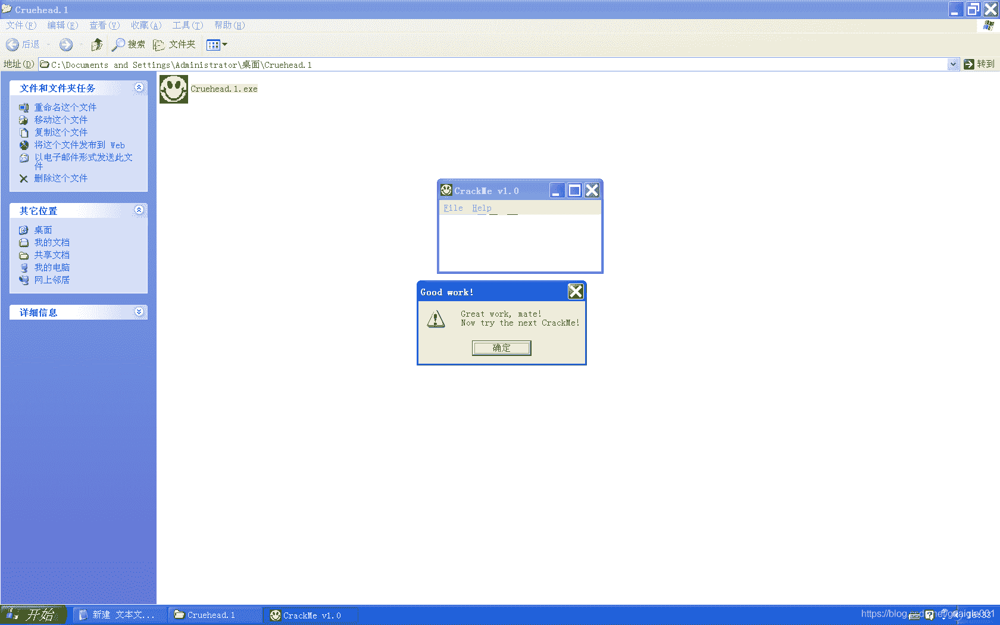

<!--yml
category: crackme160
date: 2022-04-27 18:16:29
-->

# CrackMe160 学习笔记 之 033_一剑名动江湖的博客-CSDN博客

> 来源：[https://blog.csdn.net/guaigle001/article/details/104298492](https://blog.csdn.net/guaigle001/article/details/104298492)

## 前言

简单题，分分钟做出来的那种。



又可以开始水博客了。


## 思路

整个指令很短，很容易找到验证函数。

指令也都很简单很容易就分析出来了。

## 分析

### 点击事件

```
00401228   .  68 8E214000   push    0040218E                         ;  压入name地址
0040122D   .  E8 4C010000   call    0040137E                         ;  计算NAME
00401232   .  50            push    eax
00401233   .  68 7E214000   push    0040217E                         ;  压入KEY地址
00401238   .  E8 9B010000   call    004013D8                         ;  计算KEY
0040123D   .  83C4 04       add     esp, 4
00401240   .  58            pop     eax
00401241   .  3BC3          cmp     eax, ebx                         ;  比较计算结果
00401243   .  74 07         je      short 0040124C                   ;  关键跳
00401245   .  E8 18010000   call    00401362                         ;  失败弹窗
0040124A   .^ EB 9A         jmp     short 004011E6
0040124C   >  E8 FC000000   call    0040134D                         ;  成功弹窗 
```

### 计算name

```
0040137E  /$  8B7424 04     mov     esi, dword ptr [esp+4]           ;  name地址保存到esi
00401382  |.  56            push    esi
00401383  |>  8A06          /mov     al, byte ptr [esi]
00401385  |.  84C0          |test    al, al
00401387  |.  74 13         |je      short 0040139C                  ;  为0则跳转
00401389  |.  3C 41         |cmp     al, 41
0040138B  |.  72 1F         |jb      short 004013AC                  ;  小于'A'则跳转
0040138D  |.  3C 5A         |cmp     al, 5A
0040138F  |.  73 03         |jnb     short 00401394                  ;  大于等于'Z'则跳转
00401391  |.  46            |inc     esi                             ;  指向下一个字符
00401392  |.^ EB EF         |jmp     short 00401383
00401394  |>  E8 39000000   |call    004013D2
00401399  |.  46            |inc     esi                             ;  指向下一个字符
0040139A  |.^ EB E7         \jmp     short 00401383
0040139C  |>  5E            pop     esi
0040139D  |.  E8 20000000   call    004013C2                         ;  求和
004013A2  |.  81F7 78560000 xor     edi, 5678                        ;  edi = edi ^ 0x5678
004013A8  |.  8BC7          mov     eax, edi
004013AA  |.  EB 15         jmp     short 004013C1 
```

#### call 004013D2

```
004013D2  /$  2C 20         sub     al, 20                           ;  al = al - 0x20
004013D4  |.  8806          mov     byte ptr [esi], al               ;  转成大写
004013D6  \.  C3            retn 
```

#### call 004013C2

```
004013C2  /$  33FF          xor     edi, edi
004013C4  |.  33DB          xor     ebx, ebx
004013C6  |>  8A1E          /mov     bl, byte ptr [esi]
004013C8  |.  84DB          |test    bl, bl
004013CA  |.  74 05         |je      short 004013D1                  ;  为0则跳转
004013CC  |.  03FB          |add     edi, ebx                        ;  edi = edi + ebx
004013CE  |.  46            |inc     esi                             ;  指向下一个字符
004013CF  |.^ EB F5         \jmp     short 004013C6
004013D1  \>  C3            retn 
```

### 计算KEY

```
004013D8  /$  33C0          xor     eax, eax
004013DA  |.  33FF          xor     edi, edi
004013DC  |.  33DB          xor     ebx, ebx
004013DE  |.  8B7424 04     mov     esi, dword ptr [esp+4]
004013E2  |>  B0 0A         /mov     al, 0A                          ;  al = 0xA
004013E4  |.  8A1E          |mov     bl, byte ptr [esi]
004013E6  |.  84DB          |test    bl, bl
004013E8  |.  74 0B         |je      short 004013F5                  ;  为0则跳转
004013EA  |.  80EB 30       |sub     bl, 30
004013ED  |.  0FAFF8        |imul    edi, eax
004013F0  |.  03FB          |add     edi, ebx
004013F2  |.  46            |inc     esi
004013F3  |.^ EB ED         \jmp     short 004013E2
004013F5  |>  81F7 34120000 xor     edi, 1234                        ;  edi = edx ^ 0x1234
004013FB  |.  8BDF          mov     ebx, edi
004013FD  \.  C3            retn 
```

转成十进制并异或0x1234。

## 注册机代码

顺带说一下，name一个字符也能注册成功也是挺奇葩的。

```
#include<stdio.h>
int main()
{
  char* name;
  int len=0;
  int eax=0;
  printf("name:");
  name=malloc(100);
  scanf("%[^\n]",name);
  len=strlen(name);

  for(int i=0;i<len;i++)
    {
      if(name[i]<0x41)
        return 0;
      if(name[i]>=0x5A)
        name[i]-=0x20;
      eax+=name[i];
    }
  eax^=0x5678^0x1234;
  printf("key:%d",eax);
  free(name);
  return 0;
} 
```