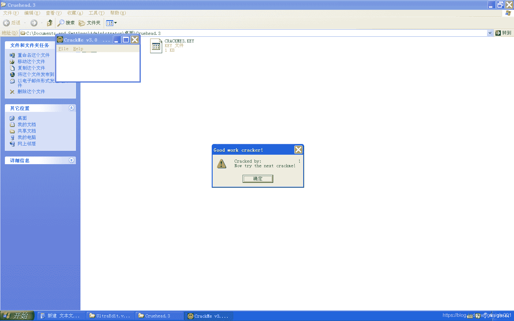

<!--yml
category: crackme160
date: 2022-04-27 18:16:27
-->

# CrackMe160 学习笔记 之 034_一剑名动江湖的博客-CSDN博客

> 来源：[https://blog.csdn.net/guaigle001/article/details/104301747](https://blog.csdn.net/guaigle001/article/details/104301747)

## 前言

这个题目我犯了一个愚蠢的错误。

最后生成的前两位必为**0x1234**，我就一直在找0x12的ASCII码。

忘了可以直接以16进制数写进内存的。



## 思路

文件验证首先找到**CreateFileA**函数。

```
0040102D  |.  E8 76040000   call    <jmp.&KERNEL32.CreateFileA>      ; \CreateFileA 
```

然后开始分析。

## 分析

### 程序开始对文件的验证

```
00401016  |.  6A 00         push    0                                ; /hTemplateFile = NULL
00401018  |.  68 80000000   push    80                               ; |Attributes = NORMAL
0040101D  |.  6A 03         push    3                                ; |Mode = OPEN_EXISTING
0040101F  |.  6A 00         push    0                                ; |pSecurity = NULL
00401021  |.  6A 03         push    3                                ; |ShareMode = FILE_SHARE_READ|FILE_SHARE_WRITE
00401023  |.  68 000000C0   push    C0000000                         ; |Access = GENERIC_READ|GENERIC_WRITE
00401028  |.  68 D7204000   push    004020D7                         ; |FileName = "CRACKME3.KEY"
0040102D  |.  E8 76040000   call    <jmp.&KERNEL32.CreateFileA>      ; \CreateFileA
00401032  |.  83F8 FF       cmp     eax, -1
00401035  |.  75 0C         jnz     short 00401043
00401037  |>  68 0E214000   push    0040210E                         ;  ASCII "CrackMe v3.0             "
0040103C  |.  E8 B4020000   call    004012F5
00401041  |.  EB 6B         jmp     short 004010AE
00401043  |>  A3 F5204000   mov     dword ptr [4020F5], eax
00401048  |.  B8 12000000   mov     eax, 12
0040104D  |.  BB 08204000   mov     ebx, 00402008
00401052  |.  6A 00         push    0                                ; /pOverlapped = NULL
00401054  |.  68 A0214000   push    004021A0                         ; |pBytesRead = Cruehead.004021A0
00401059  |.  50            push    eax                              ; |BytesToRead => 12 (18.)
0040105A  |.  53            push    ebx                              ; |Buffer => Cruehead.00402008
0040105B  |.  FF35 F5204000 push    dword ptr [4020F5]               ; |hFile = NULL
00401061  |.  E8 30040000   call    <jmp.&KERNEL32.ReadFile>         ; \ReadFile
00401066  |.  833D A0214000>cmp     dword ptr [4021A0], 12           ;  读的字节数和0x12比较
0040106D  |.^ 75 C8         jnz     short 00401037                   ;  不相等则跳转
0040106F  |.  68 08204000   push    00402008
00401074  |.  E8 98020000   call    00401311
00401079  |.  8135 F9204000>xor     dword ptr [4020F9], 12345678     ;  异或
00401083  |.  83C4 04       add     esp, 4
00401086  |.  68 08204000   push    00402008
0040108B  |.  E8 AC020000   call    0040133C
00401090  |.  83C4 04       add     esp, 4
00401093  |.  3B05 F9204000 cmp     eax, dword ptr [4020F9]
00401099  |.  0F94C0        sete    al                               ;  成立时al为1
0040109C  |.  50            push    eax                              ;  压入eax
0040109D  |.  84C0          test    al, al
0040109F  |.^ 74 96         je      short 00401037
00401187  |.  58            pop     eax                              ;  弹出eax
00401188  |.  3C 01         cmp     al, 1                            ;  比较al的值
0040118A  |.  75 17         jnz     short 004011A3                   ;  关键跳
0040118C  |.  68 86214000   push    00402186                         ;  ASCII "Now try the next crackme!"
00401191  |.  68 6A214000   push    0040216A                         ;  ASCII "Cracked by:                 Now try the next crackme!"
00401196  |.  68 08204000   push    00402008
0040119B  |.  E8 C2010000   call    00401362                         ;  跳出弹窗 
```

### call 00401311

```
00401311  /$  33C9          xor     ecx, ecx                         ;  kernel32.7C80189C
00401313  |.  33C0          xor     eax, eax
00401315  |.  8B7424 04     mov     esi, dword ptr [esp+4]           ;  读入文件内容的地址
00401319  |.  B3 41         mov     bl, 41                           ;  bl = 0x41
0040131B  |>  8A06          /mov     al, byte ptr [esi]              ;  从文件中逐个取字符
0040131D  |.  32C3          |xor     al, bl                          ;  al = al ^ bl
0040131F  |.  8806          |mov     byte ptr [esi], al              ;  覆盖原来的字符串
00401321  |.  46            |inc     esi                             ;  指向下一个字符
00401322  |.  FEC3          |inc     bl                              ;  bl = bl + 1
00401324  |.  0105 F9204000 |add     dword ptr [4020F9], eax         ;  求和
0040132A  |.  3C 00         |cmp     al, 0
0040132C  |.  74 07         |je      short 00401335                  ;  判断是否读到结尾
0040132E  |.  FEC1          |inc     cl
00401330  |.  80FB 4F       |cmp     bl, 4F                          ;  计数器读到4F时终止
00401333  |.^ 75 E6         \jnz     short 0040131B
00401335  |>  890D 49214000 mov     dword ptr [402149], ecx
0040133B  \.  C3            retn 
```

### call 0040133C

```
0040133C  /$  8B7424 04     mov     esi, dword ptr [esp+4]           ;  取修改后的字符串
00401340  |.  83C6 0E       add     esi, 0E                          ;  偏移0xE个字节
00401343  |.  8B06          mov     eax, dword ptr [esi]             ;  取4个字节到eax中
00401345  \.  C3            retn 
```

其中，我算了一下。

因为异或后最大值为**0x7F**(11111111),求和以后为**0x6F2**。

和**0x12345678**异或以后前两位必为**0x1234**。

这也是我为什么一开始一直在找0x12的ASCII码的原因。

## 注册机代码

取任意14位，求最后4位。

```
#include<stdio.h>
int main()
{
  int ebx=0x41,eax=0;
  char s[14];
  int len=strlen(s);
  printf("the start 14 byte of name:");
  scanf("%[^\n]",name);
  for(int i=0;i<len;i++)
    {
      s[i]^=ebx;
      ebx+=1;
      eax+=s[i];
    }
  printf("left 4 byte:%X\n",eax^0x12345678);
  return 0;
} 
```