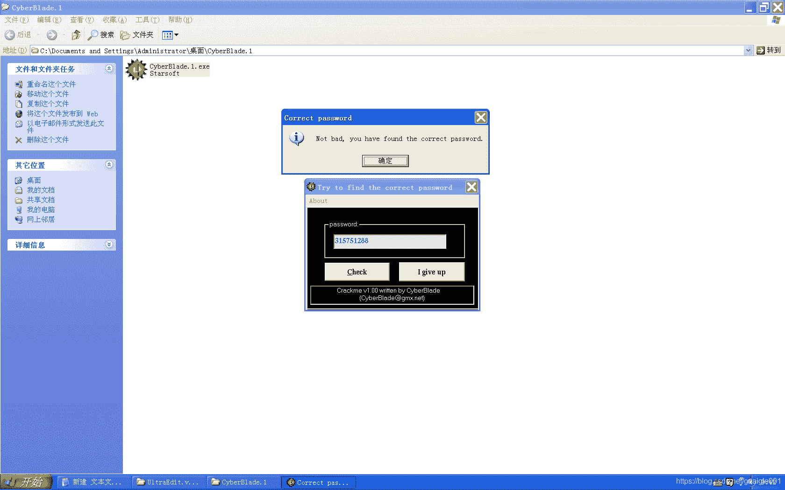
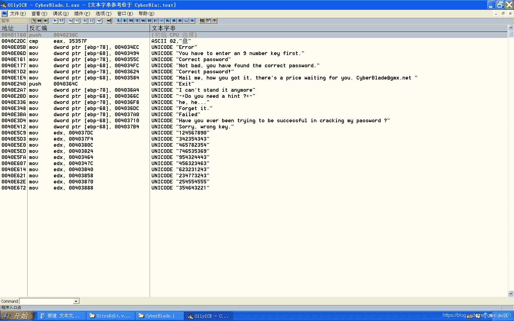

<!--yml
category: crackme160
date: 2022-04-27 18:16:24
-->

# CrackMe160 学习笔记 之 037_一剑名动江湖的博客-CSDN博客

> 来源：[https://blog.csdn.net/guaigle001/article/details/104307047](https://blog.csdn.net/guaigle001/article/details/104307047)

## 前言

还算简单。



## 思路

固定字符串比较，加了一点浮点指令的计算。

## 分析

```
0040DF60    55              push    ebp
0040DF61    8BEC            mov     ebp, esp
0040DF80    8B5D 08         mov     ebx, dword ptr [ebp+8]           ; 取参数中取出ebx
0040DF83    8BC3            mov     eax, ebx
0040DF85    56              push    esi
0040DF86    83E3 FE         and     ebx, FFFFFFFE                    ; &运算
0040DFE9    FF92 A0000000   call    dword ptr [edx+A0]               ; 取输入字符串地址到ebp-1C
0040E00E    FF15 28114100   call    dword ptr [<&MSVBVM50.__vbaStrCm>; MSVBVM50.__vbaStrCmp
0040E014    8BF0            mov     esi, eax                         ; 不相等时eax为1
0040E016    8D4D E4         lea     ecx, dword ptr [ebp-1C]
0040E019    F7DE            neg     esi                              ; 不相等时求补码为FFFFFFFF
0040E01B    1BF6            sbb     esi, esi                         ; 带进位减法
0040E01D    46              inc     esi                              ; 加一
0040E01E    F7DE            neg     esi
0040E032   /74 7D           je      short 0040E0B1                   ; 相等则跳转
0040E0CC    FF92 A0000000   call    dword ptr [edx+A0]               ; 取输入字符串地址到ebp-1C
0040E0EC    FF15 5C114100   call    dword ptr [<&MSVBVM50.__vbaR8Str>; 转成浮点数压入ST0中
0040E0F2    DB43 4C         fild    dword ptr [ebx+4C]               ; 将固定值转成浮点数压入ST0中
0040E0F5    DD9D 38FFFFFF   fstp    qword ptr [ebp-C8]               ; 弹出到ebp-C8中
0040E0FB    DCA5 38FFFFFF   fsub    qword ptr [ebp-C8]               ; 相减
0040E101    DFE0            fstsw   ax
0040E103    A8 0D           test    al, 0D
0040E105    0F85 EB030000   jnz     0040E4F6
0040E10B    FF15 14114100   call    dword ptr [<&MSVBVM50.__vbaFpR8>>; MSVBVM50.__vbaFpR8
0040E111    DC1D 08104000   fcomp   qword ptr [401008]               ; 和浮点数0作比较
0040E135    F7DF            neg     edi                              ; 求补码
0040E137    66:85FF         test    di, di
0040E13A    0F84 2C010000   je      0040E26C                         ; 关键跳 
```

## 补充

搜索的时候还看到一堆字符串，应该是作者用来迷惑人的吧。

