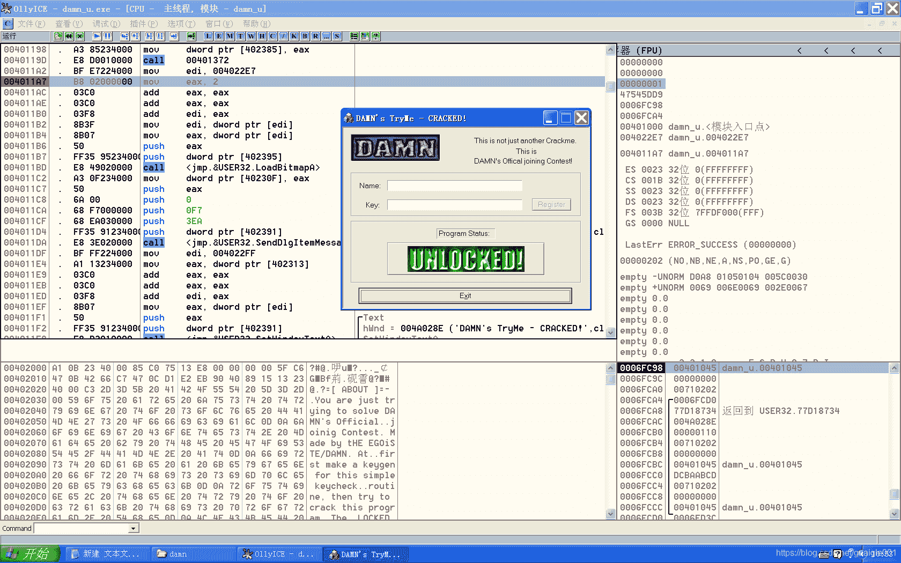

<!--yml
category: crackme160
date: 2022-04-27 18:16:22
-->

# CrackMe160 学习笔记 之 039_一剑名动江湖的博客-CSDN博客

> 来源：[https://blog.csdn.net/guaigle001/article/details/104323808](https://blog.csdn.net/guaigle001/article/details/104323808)

## 前言

这个程序有几个指令一开始没看懂，查了一下才知道。


### PATCH

如下修改即可。



## 思路

很容易就可以发现有一个跳转表。

根据不同的输入进入不同的函数。

```
004010D4   > \33C0          xor     eax, eax                         ;  Case 111 (WM_COMMAND) of switch 0040104F
004010D6   .  66:8B45 10    mov     ax, word ptr [ebp+10]
004010DA   .  66:3D EA03    cmp     ax, 3EA
004010DE   .  0F84 C5010000 je      004012A9                         ;  状态弹窗
004010E4   .  66:3D F203    cmp     ax, 3F2
004010E8   .^ 74 BE         je      short 004010A8
004010EA   .  66:3D ED03    cmp     ax, 3ED
004010EE   .  74 15         je      short 00401105                   ;  关键跳
004010F0   .  66:3D EB03    cmp     ax, 3EB
004010F4   .  74 2C         je      short 00401122                   ;  修改name输入
004010F6   .  66:3D EC03    cmp     ax, 3EC
004010FA   .  74 4B         je      short 00401147                   ;  修改KEY输入
004010FC   .  33C0          xor     eax, eax
004010FE   .  5E            pop     esi
004010FF   .  5F            pop     edi
00401100   .  5B            pop     ebx
00401101   .  C9            leave
00401102   .  C2 1000       retn    10 
```

其中，只有修改KEY的时候才会发生验证。

```
00401353  |.  38444F 01     |cmp     byte ptr [edi+ecx*2+1], al      ;  给keyp[ecx*2+1]赋值
00401357  |.  75 16         |jnz     short 0040136F                  ;  关键跳 
```

为了让最后eax为1，EnableWindow函数启用，需要让循环不被提前终止。

这就是变相的赋值呗。

## 分析

### 修改name输入

```
00401122   > \6A 22         push    22                               ; /Count = 22 (34.)
00401124   .  68 53234000   push    00402353                         ; |Buffer = damn_u.00402353
00401129   .  68 EB030000   push    3EB                              ; |ControlID = 3EB (1003.)
0040112E   .  FF35 91234000 push    dword ptr [402391]               ; |hWnd = 00730268 ('DAMN's TryMe - CRACKED!',class='#32770')
00401134   .  E8 C6020000   call    <jmp.&USER32.GetDlgItemTextA>    ; \GetDlgItemTextA
00401139   .  A3 89234000   mov     dword ptr [402389], eax          ;  name字符串长度赋值给固定地址
0040113E   .  33C0          xor     eax, eax
00401140   .  5E            pop     esi
00401141   .  5F            pop     edi
00401142   .  5B            pop     ebx
00401143   .  C9            leave
00401144   .  C2 1000       retn    10 
```

### 修改key输入

```
00401147   > \6A 22         push    22                               ; /Count = 22 (34.)
00401149   .  68 21234000   push    00402321                         ; |Buffer = damn_u.00402321
0040114E   .  68 EC030000   push    3EC                              ; |ControlID = 3EC (1004.)
00401153   .  FF35 91234000 push    dword ptr [402391]               ; |hWnd = 00730268 ('DAMN's TryMe - CRACKED!',class='#32770')
00401159   .  E8 A1020000   call    <jmp.&USER32.GetDlgItemTextA>    ; \GetDlgItemTextA
0040115E   .  A3 8D234000   mov     dword ptr [40238D], eax          ;  KEY字符串长度赋值给固定地址
00401163   .  E8 8B010000   call    004012F3                         ;  验证函数
00401168   .  50            push    eax                              ; /Enable
00401169   .  FF35 85234000 push    dword ptr [402385]               ; |hWnd = 00C10236 ('Register',class='Button',parent=00730268)
0040116F   .  E8 79020000   call    <jmp.&USER32.EnableWindow>       ; \EnableWindow
00401174   .  33C0          xor     eax, eax
00401176   .  5E            pop     esi
00401177   .  5F            pop     edi
00401178   .  5B            pop     ebx
00401179   .  C9            leave 
```

#### 验证函数

```
004012F4  |.  8B0D 89234000 mov     ecx, dword ptr [402389]          ;  取出name长度
004012FA  |.  85C9          test    ecx, ecx
004012FC  |.  74 71         je      short 0040136F                   ;  和0作比较
004012FE  |.  49            dec     ecx                              ;  长度减一
004012FF  |.  8BF1          mov     esi, ecx                         ;  减一后的值保存到esi中
00401301  |.  BF 53234000   mov     edi, 00402353                    ;  name地址保存到edi中
00401306  |.  BB 4E4D4144   mov     ebx, 44414D4E                    ;  ebx = 0x44414D4E
0040130B  |.  33D2          xor     edx, edx                         ;  edx清零
0040130D  |.  8BCA          mov     ecx, edx                         ;  ecx清零
0040130F  |>  33C0          /xor     eax, eax                        ;  eax清零
00401311  |.  8A040F        |mov     al, byte ptr [edi+ecx]          ;  取name字符
00401314  |.  03D0          |add     edx, eax                        ;  求和
00401316  |.  D1CB          |ror     ebx, 1                          ;  ebx循环右移1位
00401318  |.  D3CB          |ror     ebx, cl                         ;  ebx循环右移cl位
0040131A  |.  33DA          |xor     ebx, edx                        ;  ebx = ebx ^ edx
0040131C  |.  3BCE          |cmp     ecx, esi
0040131E  |.  74 03         |je      short 00401323
00401320  |.  41            |inc     ecx                             ;  计数器加一
00401321  |.^ EB EC         \jmp     short 0040130F
00401323  |>  81CB 10101010 or      ebx, 10101010                    ;  ebx = ebx | 0x10101010
00401329  |.  87DA          xchg    edx, ebx                         ;  交换指令
0040132B  |.  BF 21234000   mov     edi, 00402321                    ;  KEY地址保存到edi中
00401330  |.  8B0D 8D234000 mov     ecx, dword ptr [40238D]          ;  取出KEY长度
00401336  |.  83F9 08       cmp     ecx, 8                           ;  和8比较
00401339  |.  75 34         jnz     short 0040136F                   ;  不相等则跳转
0040133B  |.  33C9          xor     ecx, ecx                         ;  ecx清零
0040133D  |>  33C0          /xor     eax, eax                        ;  eax清零
0040133F  |.  C1C2 08       |rol     edx, 8                          ;  edx循环左移8位
00401342  |.  8AC2          |mov     al, dl                          ;  al = dl
00401344  |.  8AD8          |mov     bl, al                          ;  bl = al
00401346  |.  24 0F         |and     al, 0F                          ;  al = al & 0xF
00401348  |.  C0EB 04       |shr     bl, 4                           ;  bl逻辑右移4位
0040134B  |.  80E3 0F       |and     bl, 0F                          ;  bl = bl & 0xF
0040134E  |.  3C 0A         |cmp     al, 0A
00401350  |.  1C 69         |sbb     al, 69                          ;  al = al - 0x69 - CF
00401352  |.  2F            |das                                     ;  当al<0xA时，al-=0x66,否则,al-=0x60
00401353  |.  38444F 01     |cmp     byte ptr [edi+ecx*2+1], al      ;  给keyp[ecx*2+1]赋值
00401357  |.  75 16         |jnz     short 0040136F                  ;  关键跳
00401359  |.  8AC3          |mov     al, bl                          ;  al = bl
0040135B  |.  3C 0A         |cmp     al, 0A
0040135D  |.  1C 69         |sbb     al, 69                          ;  al = al - 0x69 - CF
0040135F  |.  2F            |das                                     ;  当al<0xA时，al-=0x66,否则,al-=0x60
00401360  |.  38044F        |cmp     byte ptr [edi+ecx*2], al        ;  给keyp[ecx*2]赋值
00401363  |.  75 0A         |jnz     short 0040136F                  ;  关键跳
00401365  |.  41            |inc     ecx
00401366  |.  83F9 04       |cmp     ecx, 4                          ;  比较4次
00401369  |.^ 75 D2         \jnz     short 0040133D
0040136B  |.  33C0          xor     eax, eax
0040136D  |.  40            inc     eax                              ;  eax = 1
0040136E  |.  C3            retn
0040136F  |>  33C0          xor     eax, eax
00401371  \.  C3            retn 
```

## 注册机代码

我觉得有几个指令还蛮重要的，懒得写了。

如果你研究过了就会发现，它做了复杂的操作但是做的是简单的事情。

```
#include<stdio.h>
#define ROR(x,n)  (((x)<<(32-(n)))|(x)>>(n))
#define ROL(x,n)  (((x)>>(32-(n)))|(x)<<(n))
#define cal_key(x) (x)<0xA?  ((unsigned)((x)-0x69-1)-0x66)&0xFF:((unsigned)((x)-0x69)-0x60)&0xFF
int main()
{
  char* name;
  unsigned int edx=0;
  unsigned len=0;
  unsigned int ebx=0x44414D4E;
  printf("name:");
  name=malloc(20);
  scanf("%[^\n]",name);
  len=strlen(name);
  for(int i=0;i<len;i++)
    {
      edx+=name[i];

      ebx=ROR(ebx,1+i)^edx;

    }
  ebx|=0x10101010;
  printf("ebx:%X\n",ebx);
  printf("key:");
  for(int i=0;i<4;i++)
    {

      ebx=ROL(ebx,8);

      unsigned int  temp=ebx&0xF;

      printf("%c",(unsigned)(cal_key(((edx&0xFFFFFF00)+ebx&0xFF)>>4)));
      printf("%c",(unsigned)cal_key(temp));
    }

  free(name);
  return 0;
} 
```