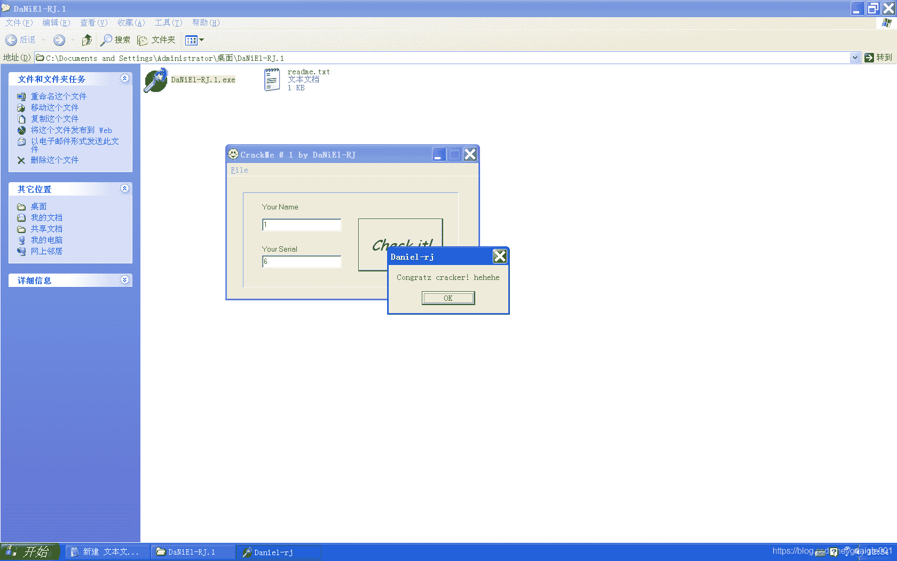

<!--yml
category: crackme160
date: 2022-04-27 18:16:20
-->

# CrackMe160 学习笔记 之 040_一剑名动江湖的博客-CSDN博客

> 来源：[https://blog.csdn.net/guaigle001/article/details/104326349](https://blog.csdn.net/guaigle001/article/details/104326349)

## 前言

又是一个简单题。



太简单就不写注册机了。

## 思路

把每个字符加5生成新字符串。

## 分析

```
0042D4CD  |.  E8 8EC9FEFF   call    00419E60                         ;  获取name地址保存到ebp-8中
0042D4D2  |.  837D F8 00    cmp     dword ptr [ebp-8], 0
0042D4D6  |.  74 14         je      short 0042D4EC                   ;  为0则跳转
0042D4D8  |.  8D55 F4       lea     edx, dword ptr [ebp-C]
0042D4DB  |.  8B86 E0010000 mov     eax, dword ptr [esi+1E0]
0042D4E1  |.  E8 7AC9FEFF   call    00419E60                         ;  获取key地址保存到ebp-C中
0042D4E6  |.  837D F4 00    cmp     dword ptr [ebp-C], 0
0042D4EA  |.  75 0F         jnz     short 0042D4FB                   ;  不为0则跳转
0042D4EC  |>  B8 C8D54200   mov     eax, 0042D5C8                    ;  ASCII "One of the fields is empty!"
0042D4F1  |.  E8 02FCFFFF   call    0042D0F8                         ;  弹窗
0042D4F6  |.  E9 8C000000   jmp     0042D587
0042D4FB  |>  BB 01000000   mov     ebx, 1                           ;  ebx初始化为1
0042D500  |.  8D55 F8       lea     edx, dword ptr [ebp-8]
0042D503  |.  8B86 DC010000 mov     eax, dword ptr [esi+1DC]
0042D509  |.  E8 52C9FEFF   call    00419E60                         ;  又保存了一遍？
0042D50E  |.  8B45 F8       mov     eax, dword ptr [ebp-8]
0042D511  |.  E8 AA62FDFF   call    004037C0                         ;  获取name长度
0042D516  |.  8BF8          mov     edi, eax                         ;  长度保存到edi中
0042D518  |.  8D45 FC       lea     eax, dword ptr [ebp-4]
0042D51B  |.  E8 2460FDFF   call    00403544
0042D520  |.  3BFB          cmp     edi, ebx
0042D522  |.  7C 32         jl      short 0042D556
0042D524  |>  8D55 F8       /lea     edx, dword ptr [ebp-8]
0042D527  |.  8B86 DC010000 |mov     eax, dword ptr [esi+1DC]
0042D52D  |.  E8 2EC9FEFF   |call    00419E60                        ;  又保存了一遍？？
0042D532  |.  8B45 F8       |mov     eax, dword ptr [ebp-8]
0042D535  |.  33D2          |xor     edx, edx                        ;  edx清零
0042D537  |.  8A5418 FF     |mov     dl, byte ptr [eax+ebx-1]        ;  取字符
0042D53B  |.  83C2 05       |add     edx, 5                          ;  edx = edx + 5
0042D53E  |.  8D45 F0       |lea     eax, dword ptr [ebp-10]
0042D541  |.  E8 A261FDFF   |call    004036E8                        ;  把edx的地址保存到ebp-0x10
0042D546  |.  8B55 F0       |mov     edx, dword ptr [ebp-10]
0042D549  |.  8D45 FC       |lea     eax, dword ptr [ebp-4]
0042D54C  |.  E8 7762FDFF   |call    004037C8                        ;  连接字符串保存到ebp-4中
0042D551  |.  43            |inc     ebx                             ;  计数器加一
0042D552  |.  3BFB          |cmp     edi, ebx
0042D554  |.^ 7D CE         \jge     short 0042D524
0042D556  |>  8D55 F8       lea     edx, dword ptr [ebp-8]
0042D559  |.  8B86 E0010000 mov     eax, dword ptr [esi+1E0]
0042D55F      E8 FCC8FEFF   call    00419E60                         ;  把生成的新字符串保存到ebp-8中
0042D564  |.  8B45 F8       mov     eax, dword ptr [ebp-8]
0042D567  |.  8B55 FC       mov     edx, dword ptr [ebp-4]
0042D56A  |.  E8 6163FDFF   call    004038D0                         ;  字符串比较
0042D56F  |.  75 0C         jnz     short 0042D57D                   ;  关键跳 
```