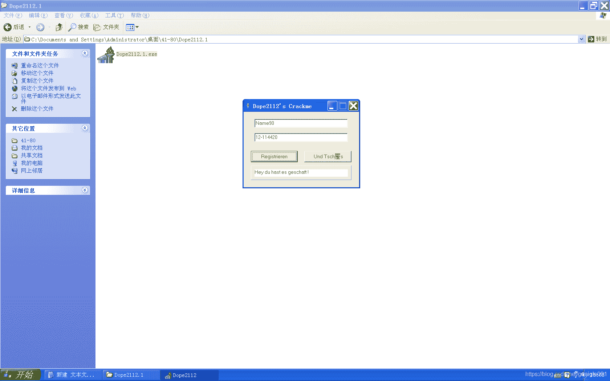

<!--yml
category: crackme160
date: 2022-04-27 18:16:18
-->

# CrackMe160 学习笔记 之 044_一剑名动江湖的博客-CSDN博客

> 来源：[https://blog.csdn.net/guaigle001/article/details/104343052](https://blog.csdn.net/guaigle001/article/details/104343052)

## 前言

感觉这个题目中规中矩。

都是一些反汇编里常见的函数。

眼睛瞄一下就能看出来了。



## 思路

和计算出的字符串比较。

## 分析

看着这个跳转表，注册机写起来也没意义。

```
00421BAE  |.  E8 45FCFEFF   call    004117F8                         ;  获取name地址保存到ebp-18中
00421BB3  |.  8B45 E8       mov     eax, dword ptr [ebp-18]
00421BB6  |.  8D55 FC       lea     edx, dword ptr [ebp-4]
00421BB9  |.  E8 8A36FEFF   call    00405248                         ;  转小写
00421BBE  |.  8D55 F8       lea     edx, dword ptr [ebp-8]
00421BC1  |.  8B86 B0010000 mov     eax, dword ptr [esi+1B0]
00421BC7  |.  E8 2CFCFEFF   call    004117F8                         ;  获取serial地址保存到ebp-8中
00421BCC  |.  8B45 FC       mov     eax, dword ptr [ebp-4]
00421BCF  |.  E8 9017FEFF   call    00403364                         ;  取出name长度
00421BD4  |.  8845 EF       mov     byte ptr [ebp-11], al
00421BD7  |.  807D EF 06    cmp     byte ptr [ebp-11], 6             ;  和6比较
00421BDB  |.  73 15         jnb     short 00421BF2                   ;  不小于则跳转
00421BDD  |.  8B86 C0010000 mov     eax, dword ptr [esi+1C0]
00421BE3  |.  BA A81D4200   mov     edx, 00421DA8                    ;  ASCII "Der Name muss min. 6 Zeichen lang sein"
00421BE8  |.  E8 3BFCFEFF   call    00411828                         ;  弹窗
00421BED  |.  E9 72010000   jmp     00421D64
00421BF2  |>  33C0          xor     eax, eax                         ;  eax清零
00421BF4  |>  33D2          /xor     edx, edx
00421BF6  |.  8AD0          |mov     dl, al
00421BF8  |.  8B4D FC       |mov     ecx, dword ptr [ebp-4]          ;  取name地址赋值给ecx
00421BFB  |.  0FB65411 FF   |movzx   edx, byte ptr [ecx+edx-1]
00421C00  |.  83C2 9F       |add     edx, -61                        ;  Switch (cases 61..7A)
00421C03  |.  83FA 19       |cmp     edx, 19
00421C06  |.  0F87 D7000000 |ja      00421CE3
00421C0C  |.  FF2495 131C42>|jmp     dword ptr [edx*4+421C13]
00421C13  |.  7B1C4200      |dd      Dope2112.00421C7B               ;  分支表 被用于 00421C0C
00421C17  |.  7F1C4200      |dd      Dope2112.00421C7F
00421C1B  |.  831C4200      |dd      Dope2112.00421C83
00421C1F  |.  871C4200      |dd      Dope2112.00421C87
00421C23  |.  8B1C4200      |dd      Dope2112.00421C8B
00421C27  |.  8F1C4200      |dd      Dope2112.00421C8F
00421C2B  |.  931C4200      |dd      Dope2112.00421C93
00421C2F  |.  971C4200      |dd      Dope2112.00421C97
00421C33  |.  9B1C4200      |dd      Dope2112.00421C9B
00421C37  |.  9F1C4200      |dd      Dope2112.00421C9F
00421C3B  |.  A31C4200      |dd      Dope2112.00421CA3
00421C3F  |.  A71C4200      |dd      Dope2112.00421CA7
00421C43  |.  AB1C4200      |dd      Dope2112.00421CAB
00421C47  |.  AF1C4200      |dd      Dope2112.00421CAF
00421C4B  |.  B31C4200      |dd      Dope2112.00421CB3
00421C4F  |.  B71C4200      |dd      Dope2112.00421CB7
00421C53  |.  BB1C4200      |dd      Dope2112.00421CBB
00421C57  |.  BF1C4200      |dd      Dope2112.00421CBF
00421C5B  |.  C31C4200      |dd      Dope2112.00421CC3
00421C5F  |.  C71C4200      |dd      Dope2112.00421CC7
00421C63  |.  CB1C4200      |dd      Dope2112.00421CCB
00421C67  |.  CF1C4200      |dd      Dope2112.00421CCF
00421C6B  |.  D31C4200      |dd      Dope2112.00421CD3
00421C6F  |.  D71C4200      |dd      Dope2112.00421CD7
00421C73  |.  DB1C4200      |dd      Dope2112.00421CDB
00421C77  |.  DF1C4200      |dd      Dope2112.00421CDF
00421C7B  |>  B2 18         |mov     dl, 18                          ;  Case 61 ('a') of switch 00421C00
00421C7D  |.  EB 66         |jmp     short 00421CE5
00421C7F  |>  B2 25         |mov     dl, 25                          ;  Case 62 ('b') of switch 00421C00
00421C81  |.  EB 62         |jmp     short 00421CE5
00421C83  |>  B2 42         |mov     dl, 42                          ;  Case 63 ('c') of switch 00421C00
00421C85  |.  EB 5E         |jmp     short 00421CE5
00421C87  |>  B2 0C         |mov     dl, 0C                          ;  Case 64 ('d') of switch 00421C00
00421C89  |.  EB 5A         |jmp     short 00421CE5
00421C8B  |>  B2 0D         |mov     dl, 0D                          ;  Case 65 ('e') of switch 00421C00
00421C8D  |.  EB 56         |jmp     short 00421CE5
00421C8F  |>  B2 06         |mov     dl, 6                           ;  Case 66 ('f') of switch 00421C00
00421C91  |.  EB 52         |jmp     short 00421CE5
00421C93  |>  B2 36         |mov     dl, 36                          ;  Case 67 ('g') of switch 00421C00
00421C95  |.  EB 4E         |jmp     short 00421CE5
00421C97  |>  B2 2B         |mov     dl, 2B                          ;  Case 68 ('h') of switch 00421C00
00421C99  |.  EB 4A         |jmp     short 00421CE5
00421C9B  |>  B2 17         |mov     dl, 17                          ;  Case 69 ('i') of switch 00421C00
00421C9D  |.  EB 46         |jmp     short 00421CE5
00421C9F  |>  B2 2F         |mov     dl, 2F                          ;  Case 6A ('j') of switch 00421C00
00421CA1  |.  EB 42         |jmp     short 00421CE5
00421CA3  |>  B2 13         |mov     dl, 13                          ;  Case 6B ('k') of switch 00421C00
00421CA5  |.  EB 3E         |jmp     short 00421CE5
00421CA7  |>  B2 82         |mov     dl, 82                          ;  Case 6C ('l') of switch 00421C00
00421CA9  |.  EB 3A         |jmp     short 00421CE5
00421CAB  |>  B2 9B         |mov     dl, 9B                          ;  Case 6D ('m') of switch 00421C00
00421CAD  |.  EB 36         |jmp     short 00421CE5
00421CAF  |>  B2 92         |mov     dl, 92                          ;  Case 6E ('n') of switch 00421C00
00421CB1  |.  EB 32         |jmp     short 00421CE5
00421CB3  |>  B2 03         |mov     dl, 3                           ;  Case 6F ('o') of switch 00421C00
00421CB5  |.  EB 2E         |jmp     short 00421CE5
00421CB7  |>  B2 63         |mov     dl, 63                          ;  Case 70 ('p') of switch 00421C00
00421CB9  |.  EB 2A         |jmp     short 00421CE5
00421CBB  |>  B2 21         |mov     dl, 21                          ;  Case 71 ('q') of switch 00421C00
00421CBD  |.  EB 26         |jmp     short 00421CE5
00421CBF  |>  B2 42         |mov     dl, 42                          ;  Case 72 ('r') of switch 00421C00
00421CC1  |.  EB 22         |jmp     short 00421CE5
00421CC3  |>  B2 5C         |mov     dl, 5C                          ;  Case 73 ('s') of switch 00421C00
00421CC5  |.  EB 1E         |jmp     short 00421CE5
00421CC7  |>  B2 29         |mov     dl, 29                          ;  Case 74 ('t') of switch 00421C00
00421CC9  |.  EB 1A         |jmp     short 00421CE5
00421CCB  |>  B2 C7         |mov     dl, 0C7                         ;  Case 75 ('u') of switch 00421C00
00421CCD  |.  EB 16         |jmp     short 00421CE5
00421CCF  |>  B2 66         |mov     dl, 66                          ;  Case 76 ('v') of switch 00421C00
00421CD1  |.  EB 12         |jmp     short 00421CE5
00421CD3  |>  B2 58         |mov     dl, 58                          ;  Case 77 ('w') of switch 00421C00
00421CD5  |.  EB 0E         |jmp     short 00421CE5
00421CD7  |>  B2 0A         |mov     dl, 0A                          ;  Case 78 ('x') of switch 00421C00
00421CD9  |.  EB 0A         |jmp     short 00421CE5
00421CDB  |>  B2 28         |mov     dl, 28                          ;  Case 79 ('y') of switch 00421C00
00421CDD  |.  EB 06         |jmp     short 00421CE5
00421CDF  |>  B2 50         |mov     dl, 50                          ;  Case 7A ('z') of switch 00421C00
00421CE1  |.  EB 02         |jmp     short 00421CE5
00421CE3  |>  B2 5D         |mov     dl, 5D                          ;  dl = 0x5D; Default case of switch 00421C00
00421CE5  |>  02DA          |add     bl, dl                          ;  bl = bl + dl
00421CE7  |.  40            |inc     eax                             ;  计数器加一
00421CE8  |.  3C 06         |cmp     al, 6
00421CEA  |.^ 0F85 04FFFFFF \jnz     00421BF4
00421CF0  |.  8D55 F0       lea     edx, dword ptr [ebp-10]
00421CF3  |.  33C0          xor     eax, eax
00421CF5  |.  8A45 EF       mov     al, byte ptr [ebp-11]            ;  从ebp-11取出长度
00421CF8  |.  69C0 7E4A0000 imul    eax, eax, 4A7E                   ;  eax = eax * 0x4A7E
00421CFE  |.  E8 7136FEFF   call    00405374                         ;  转成十进制地址保存在ebp-10中
00421D03  |.  8D55 E4       lea     edx, dword ptr [ebp-1C]
00421D06  |.  33C0          xor     eax, eax
00421D08  |.  8AC3          mov     al, bl
00421D0A  |.  E8 6536FEFF   call    00405374                         ;  前面求和转成十进制地址保存在ebp-1C中
00421D0F  |.  FF75 E4       push    dword ptr [ebp-1C]
00421D12  |.  68 D81D4200   push    00421DD8                         ;  "-"
00421D17  |.  FF75 F0       push    dword ptr [ebp-10]
00421D1A  |.  8D45 F4       lea     eax, dword ptr [ebp-C]
00421D1D  |.  BA 03000000   mov     edx, 3                           ;  连接字符串数量
00421D22  |.  E8 FD16FEFF   call    00403424                         ;  连接三个字符串保存到ebp-1C中
00421D27  |.  8D55 E8       lea     edx, dword ptr [ebp-18]
00421D2A  |.  8B86 B0010000 mov     eax, dword ptr [esi+1B0]
00421D30  |.  E8 C3FAFEFF   call    004117F8                         ;  获取serial地址保存到ebp-18中
00421D35  |.  8B55 E8       mov     edx, dword ptr [ebp-18]
00421D38  |.  8B45 F4       mov     eax, dword ptr [ebp-C]
00421D3B  |.  E8 3417FEFF   call    00403474                         ;  字符串比较
00421D40  |.  75 12         jnz     short 00421D54                   ;  关键跳 
```