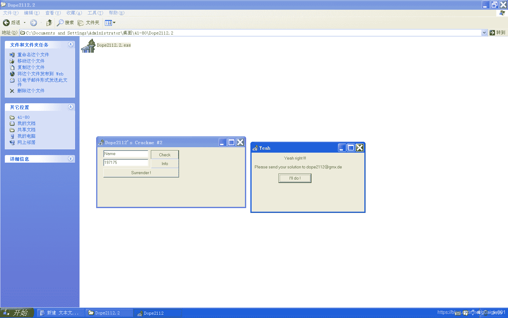

<!--yml
category: crackme160
date: 2022-04-27 18:16:15
-->

# CrackMe160 学习笔记 之 045_一剑名动江湖的博客-CSDN博客

> 来源：[https://blog.csdn.net/guaigle001/article/details/104353433](https://blog.csdn.net/guaigle001/article/details/104353433)

## 前言

这是个简单的题。不过我不知道他怎么把字符串藏起来的。



## 思路

定位到点击事件分析。

## 分析

以后这种简单的题目都不写注册机了。

```
00421DE4  |.  BB 37000000   mov     ebx, 37                          ;  ebx初始化0x37
00421DE9  |.  8D55 F8       lea     edx, dword ptr [ebp-8]
00421DEC  |.  8B86 B0010000 mov     eax, dword ptr [esi+1B0]
00421DF2  |.  E8 89FAFEFF   call    00411880                         ;  获取serial地址保存到ebp-8中
00421DF7  |.  8D55 FC       lea     edx, dword ptr [ebp-4]
00421DFA  |.  8B86 AC010000 mov     eax, dword ptr [esi+1AC]
00421E00  |.  E8 7BFAFEFF   call    00411880                         ;  获取key地址保存到ebp-4中
00421E05  |.  8B45 FC       mov     eax, dword ptr [ebp-4]
00421E08  |.  E8 5715FEFF   call    00403364                         ;  获取name长度
00421E0D  |.  83F8 04       cmp     eax, 4
00421E10  |.  7D 0C         jge     short 00421E1E                   ;  大于等于则跳转
00421E12  |.  A1 64464200   mov     eax, dword ptr [424664]
00421E17  |.  E8 C8BAFFFF   call    0041D8E4                         ;  弹窗
00421E1C  |.  EB 4D         jmp     short 00421E6B
00421E1E  |>  8B45 FC       mov     eax, dword ptr [ebp-4]
00421E21  |.  E8 3E15FEFF   call    00403364                         ;  又获取name长度？
00421E26  |.  85C0          test    eax, eax
00421E28  |.  7C 14         jl      short 00421E3E
00421E2A  |.  40            inc     eax                              ;  长度加一
00421E2B  |.  33D2          xor     edx, edx                         ;  计数器清零
00421E2D  |>  8B4D FC       /mov     ecx, dword ptr [ebp-4]
00421E30  |.  0FB64C11 FF   |movzx   ecx, byte ptr [ecx+edx-1]
00421E35  |.  C1E1 09       |shl     ecx, 9                          ;  左移9位
00421E38  |.  03D9          |add     ebx, ecx                        ;  ebx = ebx + ecx
00421E3A  |.  42            |inc     edx                             ;  计数器加一
00421E3B  |.  48            |dec     eax
00421E3C  |.^ 75 EF         \jnz     short 00421E2D
00421E3E  |>  8D55 F4       lea     edx, dword ptr [ebp-C]
00421E41  |.  8BC3          mov     eax, ebx
00421E43  |.  E8 E834FEFF   call    00405330                         ;  十进制打印保存在ebp-C中
00421E48  |.  8B45 F4       mov     eax, dword ptr [ebp-C]
00421E4B  |.  8B55 F8       mov     edx, dword ptr [ebp-8]           ;  kEY地址
00421E4E  |.  E8 2116FEFF   call    00403474                         ;  字符串比较
00421E53  |.  75 0C         jnz     short 00421E61                   ;  关键跳
00421E55  |.  A1 68464200   mov     eax, dword ptr [424668]
00421E5A  |.  E8 85BAFFFF   call    0041D8E4                         ;  弹窗
00421E5F  |.  EB 0A         jmp     short 00421E6B
00421E61  |>  A1 64464200   mov     eax, dword ptr [424664]
00421E66  |.  E8 79BAFFFF   call    0041D8E4                         ;  弹窗 
```