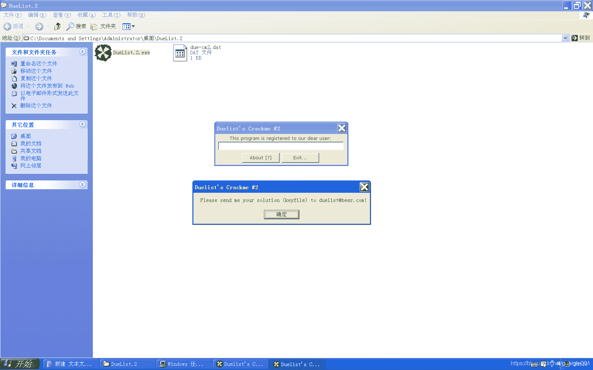

<!--yml
category: crackme160
date: 2022-04-27 18:16:13
-->

# CrackMe160 学习笔记 之 047_一剑名动江湖的博客-CSDN博客

> 来源：[https://blog.csdn.net/guaigle001/article/details/104364145](https://blog.csdn.net/guaigle001/article/details/104364145)

## 前言

这个题目要出凑出KEYFILE。

如果懒得凑的话，直接绕过也是可以的。



最后的KEYFILE。


## 思路

这种题目直接找**CreateFileA**函数即可。

## 分析

```
004010A9   .  E8 2F020000   call    <jmp.&KERNEL32.ReadFile>         ; \ReadFile
004010AE   .  85C0          test    eax, eax                         ;  判断文件长度不为0
004010B0   .  75 02         jnz     short 004010B4                   ;  不为0则跳转
004010B2   .  EB 43         jmp     short 004010F7
004010B4   >  33DB          xor     ebx, ebx                         ;  ebx清零
004010B6   .  33F6          xor     esi, esi                         ;  esi清零
004010B8   .  833D 73214000>cmp     dword ptr [402173], 12           ;  文件长度和0x12比较
004010BF   .  7C 36         jl      short 004010F7                   ;  小于则跳转
004010C1   >  8A83 1A214000 mov     al, byte ptr [ebx+40211A]        ;  取文件中的字符
004010C7   .  3C 00         cmp     al, 0
004010C9   .  74 08         je      short 004010D3                   ;  文件是否结尾
004010CB   .  3C 01         cmp     al, 1                            ;  和1比较
004010CD   .  75 01         jnz     short 004010D0
004010CF   .  46            inc     esi
004010D0   >  43            inc     ebx                              ;  指向下一个
004010D1   .^ EB EE         jmp     short 004010C1
004010D3   >  83FE 02       cmp     esi, 2                           ;  1的个数和2比较
004010D6   .  7C 1F         jl      short 004010F7                   ;  小于则跳转
004010D8   .  33F6          xor     esi, esi
004010DA   .  33DB          xor     ebx, ebx
004010DC   >  8A83 1A214000 mov     al, byte ptr [ebx+40211A]
004010E2   .  3C 00         cmp     al, 0
004010E4   .  74 09         je      short 004010EF                   ;  文件是否结尾
004010E6   .  3C 01         cmp     al, 1                            ;  和1比较
004010E8   .  74 05         je      short 004010EF
004010EA   .  03F0          add     esi, eax                         ;  读到第一个1之前求和
004010EC   .  43            inc     ebx                              ;  指向下一个
004010ED   .^ EB ED         jmp     short 004010DC
004010EF   >  81FE D5010000 cmp     esi, 1D5                         ;  求出的和和0x1D5比较
004010F5   .  74 1D         je      short 00401114                   ;  关键跳
004010F7   >  6A 00         push    0                                ; |/Style = MB_OK|MB_APPLMODAL
004010F9   .  68 01204000   push    00402001                         ; ||Title = "Duelist's Crackme #2"
004010FE   .  68 86204000   push    00402086                         ; ||Text = "Your current keyfile is invalid... Please obtain a valid one from the software author!"
00401103   .  6A 00         push    0                                ; ||hOwner = NULL
00401105   .  E8 5D020000   call    <jmp.&USER32.MessageBoxA>        ; |\MessageBoxA
0040110A   .  E8 AA010000   call    <jmp.&KERNEL32.ExitProcess>      ; \ExitProcess
0040110F   .  E9 AE000000   jmp     004011C2
00401114   >  33F6          xor     esi, esi
00401116   >  43            inc     ebx
00401117   .  8A83 1A214000 mov     al, byte ptr [ebx+40211A]
0040111D   .  3C 00         cmp     al, 0
0040111F   .  74 18         je      short 00401139                   ;  文件是否结尾
00401121   .  3C 01         cmp     al, 1                            ;  和1比较
00401123   .  74 14         je      short 00401139
00401125   .  83FE 0F       cmp     esi, 0F                          ;  和0xF比较
00401128   .  73 0F         jnb     short 00401139
0040112A   .  3286 1A214000 xor     al, byte ptr [esi+40211A]
00401130   .  8986 60214000 mov     dword ptr [esi+402160], eax
00401136   .  46            inc     esi
00401137   .^ EB DD         jmp     short 00401116
00401139   >  43            inc     ebx
0040113A   .  33F6          xor     esi, esi                         ;  esi清零
0040113C   >  8A83 1A214000 mov     al, byte ptr [ebx+40211A]
00401142   .  3C 00         cmp     al, 0
00401144   .  74 09         je      short 0040114F                   ;  文件是否结尾
00401146   .  3C 01         cmp     al, 1
00401148   .^ 74 F2         je      short 0040113C                   ;  如果为1则死循环
0040114A   .  03F0          add     esi, eax                         ;  求和
0040114C   .  43            inc     ebx
0040114D   .^ EB ED         jmp     short 0040113C
0040114F   >  81FE B2010000 cmp     esi, 1B2
00401155   .^ 75 A0         jnz     short 004010F7
00401114   > \33F6          xor     esi, esi
00401116   >  43            inc     ebx
00401117   .  8A83 1A214000 mov     al, byte ptr [ebx+40211A]
0040111D   .  3C 00         cmp     al, 0
0040111F   .  74 18         je      short 00401139                   ;  文件是否结尾
00401121   .  3C 01         cmp     al, 1                            ;  和1比较
00401123   .  74 14         je      short 00401139
00401125   .  83FE 0F       cmp     esi, 0F                          ;  和0xF比较
00401128   .  73 0F         jnb     short 00401139
0040112A   .  3286 1A214000 xor     al, byte ptr [esi+40211A]
00401130   .  8986 60214000 mov     dword ptr [esi+402160], eax
00401136   .  46            inc     esi
00401137   .^ EB DD         jmp     short 00401116
00401139   >  43            inc     ebx
0040113A   .  33F6          xor     esi, esi                         ;  esi清零
0040113C   >  8A83 1A214000 mov     al, byte ptr [ebx+40211A]
00401142   .  3C 00         cmp     al, 0
00401144   .  74 09         je      short 0040114F                   ;  文件是否结尾
00401146   .  3C 01         cmp     al, 1
00401148   .^ 74 F2         je      short 0040113C                   ;  如果为1则死循环
0040114A   .  03F0          add     esi, eax                         ;  求和
0040114C   .  43            inc     ebx
0040114D   .^ EB ED         jmp     short 0040113C
0040114F   >  81FE B2010000 cmp     esi, 1B2
00401155   .^ 75 A0         jnz     short 004010F7                   ;  关键跳 
```