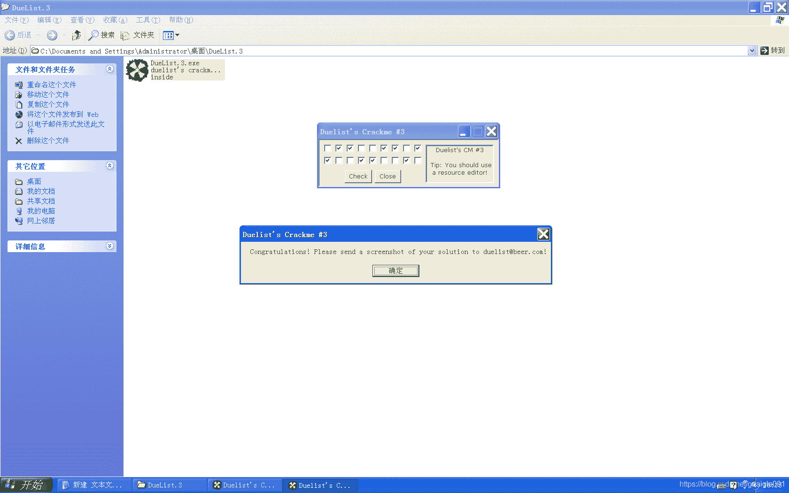
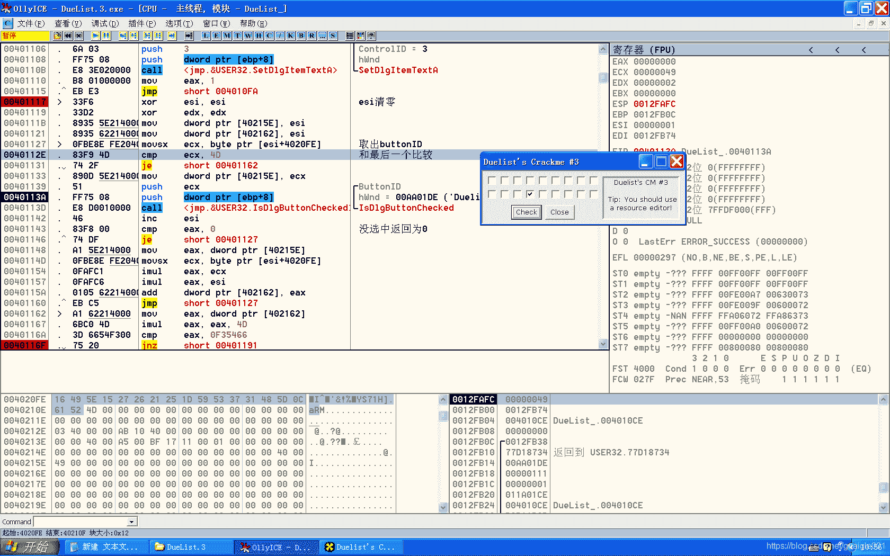
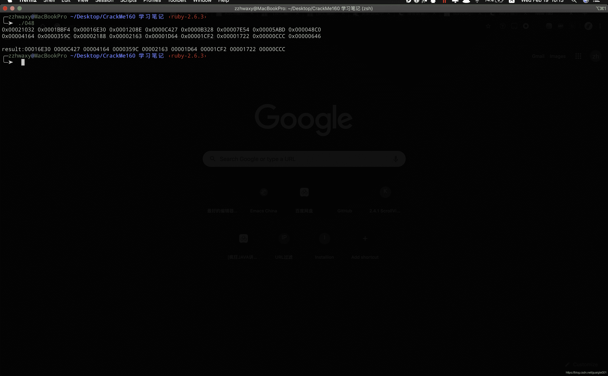

<!--yml
category: crackme160
date: 2022-04-27 18:16:11
-->

# CrackMe160 学习笔记 之 048_一剑名动江湖的博客-CSDN博客

> 来源：[https://blog.csdn.net/guaigle001/article/details/104395490](https://blog.csdn.net/guaigle001/article/details/104395490)

## 前言

这个题目挺新颖的。



本身不难，但是注册机写的有点心累。


## 思路

直接从搜索字符串找到点击事件，开始分析。

有个地址保存着所有按钮的ID。


点击不同的按钮会产生不同的值，复杂度取决于概率问题。

值得注意的一点是，作者还**混淆了按钮的顺序**，怪不得说让我们用资源查看器看。

## 分析

CHECK 按钮点击事件

```
00401117   > /33F6          xor     esi, esi                         ;  esi清零
00401119   . |33D2          xor     edx, edx
0040111B   . |8935 5E214000 mov     dword ptr [40215E], esi
00401121   . |8935 62214000 mov     dword ptr [402162], esi
00401127   > |0FBE8E FE2040>movsx   ecx, byte ptr [esi+4020FE]       ;  取出buttonID
0040112E   . |83F9 4D       cmp     ecx, 4D                          ;  和最后一个比较
00401131   . |74 2F         je      short 00401162
00401133   . |890D 5E214000 mov     dword ptr [40215E], ecx
00401139   . |51            push    ecx                              ; /ButtonID
0040113A   . |FF75 08       push    dword ptr [ebp+8]                ; |hWnd
0040113D   . |E8 D0010000   call    <jmp.&USER32.IsDlgButtonChecked> ; \IsDlgButtonChecked
00401142   . |46            inc     esi                              ;  指向下一个字符
00401143   . |83F8 00       cmp     eax, 0                           ;  没选中返回为0,选中为1
00401146   .^|74 DF         je      short 00401127
00401148   . |A1 5E214000   mov     eax, dword ptr [40215E]          ;  取出选中的buttonID赋给eax
0040114D   . |0FBE8E FE2040>movsx   ecx, byte ptr [esi+4020FE]       ;  取出选中的button下一个ID赋给ecx
00401154   . |0FAFC1        imul    eax, ecx                         ;  eax = eax * ecx
00401157   . |0FAFC6        imul    eax, esi                         ;  eax = eax * esi
0040115A   . |0105 62214000 add     dword ptr [402162], eax          ;  结果保存到固定地址
00401160   .^|EB C5         jmp     short 00401127
00401162   > |A1 62214000   mov     eax, dword ptr [402162]          ;  从固定地址取出结果
00401167   . |6BC0 4D       imul    eax, eax, 4D                     ;  eax = eax * 0x4D
0040116A   . |3D 6654F300   cmp     eax, 0F35466
0040116F   . |75 20         jnz     short 00401191                   ;  关键跳 
```

## 注册机代码

我这个注册机效率应该挺高的了，因为排了序还消除了递归，不过还可以有优化的空间。

虽然代码不好看懂，但是我就是不写注释。

因为我觉得看得懂的人自然看得懂。

```
 unsigned int  a[]={0x16, 0x49, 0x5E, 0x15, 0x27, 0x26, 0x21, 0x25, 0x1D, 0x59, 0x53, 0x37, 0x31, 0x48, 0x5D, 0x0C,0x61, 0x52, 0x4D};
 int eax[30]={0};
int ecx=0;
int len=sizeof(a)/sizeof(unsigned int)-1;
void cal_add(int count ,unsigned int left_sum);
#include<stdio.h>
int main()
{

  unsigned int result=0xF35466/0x4D;
  int flag=0,count=0;
  for(int i=0;i<len;i++)
    {
      a[i]*=a[i+1]*(i+1);

    }
  for(int i=0;i<len-1;i++)
    {
      for(int j=i+1;j<len;j++)
        {
          if(a[i]<a[j])
            {
              a[i]^=a[j];
              a[j]^=a[i];
              a[i]^=a[j];
            }
        }
    }
  for(int i=0;i<len;i++)
    {
        printf("0x%08X ",a[i]);
        if(i==8)
          printf("\n");
    }
  printf("\n\n");
    cal_add(0,result);

  return 0;

}
void cal_add(int count,unsigned int left_sum)
{
 START:
  while(left_sum>=a[count])
    {

      left_sum-=a[count];
      eax[ecx++]=count++;

      if(left_sum==0)
        {
          printf("result:");
          for(int i=0;i<ecx;i++)
            printf("%08X ",a[eax[i]]);
          printf("\n");
          goto BACK2;
        }
      if(count>=len)
        goto BACK;
    }
  while(left_sum<a[count])
    {
      count++;
      if(count>=len)
        goto BACK;
    }
  goto START;
 BACK:

  if(ecx==0||ecx==len || (ecx==1 && eax[ecx-1]==len-1))
    return;

  if(eax[ecx-1]<len-1)
    {
      left_sum=left_sum+a[eax[ecx-1]];
      count=eax[ecx-1]+1;
      ecx--;
      goto START;
    }

  if(eax[ecx-1]==len-1)
    {
    BACK2:
      left_sum=left_sum+a[eax[ecx-1]];
      ecx--;
      left_sum+=a[eax[ecx-1]];
      count=eax[ecx-1]+1;
      ecx--;
      goto START;
    }
} 
```

## 运行结果

