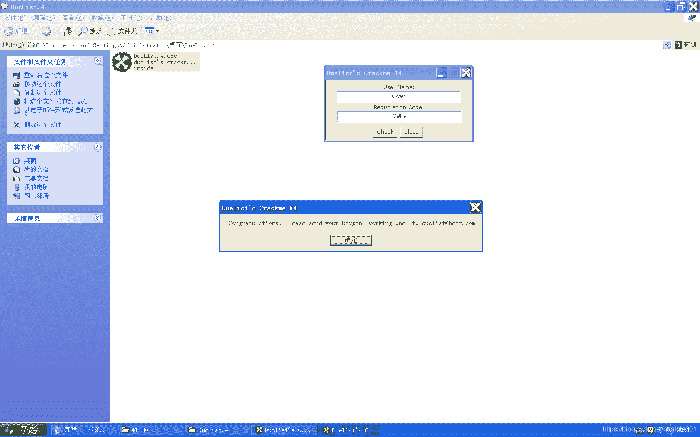
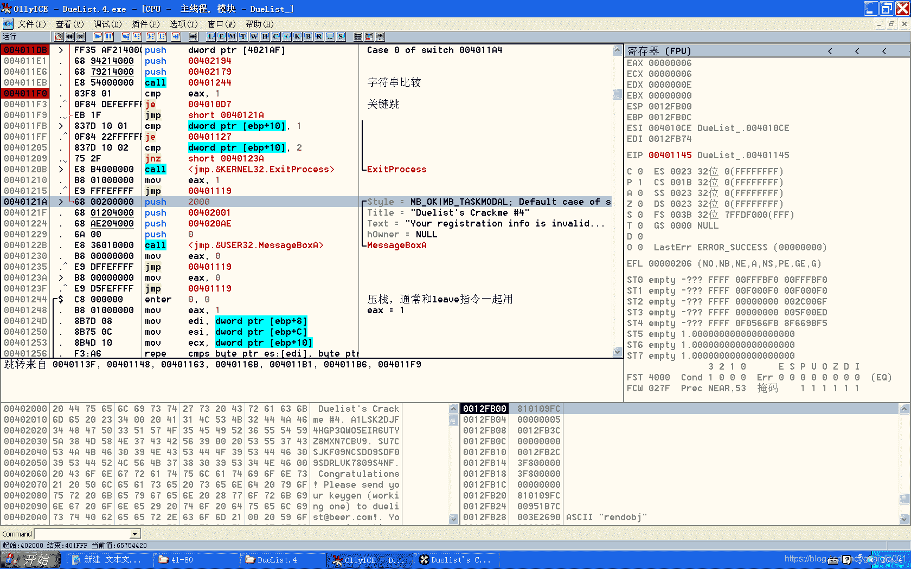

<!--yml
category: crackme160
date: 2022-04-27 18:16:08
-->

# CrackMe160 学习笔记 之 049_一剑名动江湖的博客-CSDN博客

> 来源：[https://blog.csdn.net/guaigle001/article/details/104399709](https://blog.csdn.net/guaigle001/article/details/104399709)

## 前言

这个题目虽然简单，做起来给人一种眼前一亮的感觉。


Mac终端上0和O挺像的，我一开始还输错了没发现。

## 思路

首先找到判断的位置。

再一步一步往前分析。

可以看到失败跳转有7处。

## 分析

```
00401127   > /6A 00         push    0                                ; /lParam = 0
00401129   . |6A 00         push    0                                ; |wParam = 0
0040112B   . |6A 0E         push    0E                               ; |Message = WM_GETTEXTLENGTH
0040112D   . |6A 03         push    3                                ; |ControlID = 3
0040112F   . |FF75 08       push    dword ptr [ebp+8]                ; |hWnd
00401132   . |E8 41020000   call    <jmp.&USER32.SendDlgItemMessageA>; \SendDlgItemMessageA
00401137   . |A3 AF214000   mov     dword ptr [4021AF], eax          ;  返回长度到0x4021AF
0040113C   . |83F8 00       cmp     eax, 0                           ;  长度和0比较
0040113F   . |0F84 D5000000 je      0040121A
00401145   . |83F8 08       cmp     eax, 8                           ;  长度和8比较
00401148   . |0F8F CC000000 jg      0040121A                         ;  大于则失败
0040114E   . |8BF0          mov     esi, eax                         ;  name长度保存到esi中
00401150   . |6A 00         push    0                                ; /lParam = 0
00401152   . |6A 00         push    0                                ; |wParam = 0
00401154   . |6A 0E         push    0E                               ; |Message = WM_GETTEXTLENGTH
00401156   . |6A 04         push    4                                ; |ControlID = 4
00401158   . |FF75 08       push    dword ptr [ebp+8]                ; |hWnd
0040115B   . |E8 18020000   call    <jmp.&USER32.SendDlgItemMessageA>; \SendDlgItemMessageA
00401160   . |83F8 00       cmp     eax, 0                           ;  长度和0比较
00401163   . |0F84 B1000000 je      0040121A
00401169   . |3BF0          cmp     esi, eax                         ;  name长度和key长度比较
0040116B   . |0F85 A9000000 jnz     0040121A                         ;  不相等则失败
00401171   . |68 60214000   push    00402160                         ; /lParam = 402160
00401176   . |6A 08         push    8                                ; |wParam = 8
00401178   . |6A 0D         push    0D                               ; |Message = WM_GETTEXT
0040117A   . |6A 03         push    3                                ; |ControlID = 3
0040117C   . |FF75 08       push    dword ptr [ebp+8]                ; |hWnd
0040117F   . |E8 F4010000   call    <jmp.&USER32.SendDlgItemMessageA>; \SendDlgItemMessageA
00401184   . |68 79214000   push    00402179                         ; /lParam = 402179
00401189   . |6A 10         push    10                               ; |wParam = 10
0040118B   . |6A 0D         push    0D                               ; |Message = WM_GETTEXT
0040118D   . |6A 04         push    4                                ; |ControlID = 4
0040118F   . |FF75 08       push    dword ptr [ebp+8]                ; |hWnd
00401192   . |E8 E1010000   call    <jmp.&USER32.SendDlgItemMessageA>; \SendDlgItemMessageA
00401197   . |B9 FFFFFFFF   mov     ecx, -1                          ;  ecx = -1
0040119C   > |41            inc     ecx                              ;  ecx = 0
0040119D   . |0FBE81 602140>movsx   eax, byte ptr [ecx+402160]       ;  取name首地址
004011A4   . |83F8 00       cmp     eax, 0                           ;  Switch (cases 0..7A)
004011A7   . |74 32         je      short 004011DB                   ;  循环出口
004011A9   . |BE FFFFFFFF   mov     esi, -1                          ;  esi = -1
004011AE   . |83F8 41       cmp     eax, 41
004011B1   . |7C 67         jl      short 0040121A                   ;  小于'A'则失败
004011B3   . |83F8 7A       cmp     eax, 7A
004011B6   . |77 62         ja      short 0040121A                   ;  大于'z'则失败
004011B8   . |83F8 5A       cmp     eax, 5A
004011BB   . |7C 03         jl      short 004011C0
004011BD   . |83E8 20       sub     eax, 20                          ;  大于0x5A转大写，但有些不是字母啊; Cases 5A ('Z'),5B ('['),5C ('\'),5D (']'),5E ('^'),5F ('_'),60 ('`'),61 ('a'),62 ('b'),63 ('c'),64 ('d'),65 ('e'),66 ('f'),67 ('g'),68 ('h'),69 ('i'),6A ('j'),6B ('k'),6C ('l'),6D ('m')... of switch 004011A4
004011C0   > |46            inc     esi                              ;  指向下一个字符; Cases 41 ('A'),42 ('B'),43 ('C'),44 ('D'),45 ('E'),46 ('F'),47 ('G'),48 ('H'),49 ('I'),4A ('J'),4B ('K'),4C ('L'),4D ('M'),4E ('N'),4F ('O'),50 ('P'),51 ('Q'),52 ('R'),53 ('S'),54 ('T')... of switch 004011A4
004011C1   . |0FBE96 172040>movsx   edx, byte ptr [esi+402017]       ;  edx取固定字符串的字符
004011C8   . |3BC2          cmp     eax, edx                         ;  找到偏移量
004011CA   .^|75 F4         jnz     short 004011C0
004011CC   . |0FBE86 3C2040>movsx   eax, byte ptr [esi+40203C]       ;  根据偏移量得到新字符
004011D3   . |8981 94214000 mov     dword ptr [ecx+402194], eax      ;  保存新字符
004011D9   .^|EB C1         jmp     short 0040119C
004011DB   > |FF35 AF214000 push    dword ptr [4021AF]               ;  Case 0 of switch 004011A4
004011E1   . |68 94214000   push    00402194
004011E6   . |68 79214000   push    00402179
004011EB   . |E8 54000000   call    00401244                         ;  字符串比较
004011F0   . |83F8 01       cmp     eax, 1
004011F3   .^|0F84 DEFEFFFF je      004010D7                         ;  关键跳 
```

### call 00401244

```
00401244  /$  C8 000000     enter   0, 0                             ;  压栈，通常和leave指令一起用
00401248  |.  B8 01000000   mov     eax, 1                           ;  eax = 1
0040124D  |.  8B7D 08       mov     edi, dword ptr [ebp+8]           ;  输入的KEY
00401250  |.  8B75 0C       mov     esi, dword ptr [ebp+C]           ;  生成的KEY
00401253  |.  8B4D 10       mov     ecx, dword ptr [ebp+10]          ;  比较次数
00401256  |.  F3:A6         repe    cmps byte ptr es:[edi], byte ptr>;  循环逐个比较
00401258  |.  67:E3 05      jcxz    short 00401260                   ;  ecx为0则跳转
0040125B  |.  B8 00000000   mov     eax, 0
00401260  |>  C9            leave
00401261  \.  C2 0C00       retn    0C 
```

## 注册机代码

```
 char* s="A1LSK2DJF4HGP3QWO5EIR6UTYZ8MXN7CBV9";
char* t="SU7CSJKF09NCSDO9SDF09SDRLVK7809S4NF";
#include<stdio.h>
int main()
{
  char* name;
  int len=0,len_s=0;
  len_s=strlen(s);
  scanf("%[^\n]",name);
  if((len=strlen(name))>8)
    return 0;

  for(int i=0;i<len;i++)
    {
      if(name[i]>=0x41 && name[i]<=0x7A)
        {
          if(name[i]>=0x5A)
            name[i]-=0x20;
        }else
        return 0;
    }
  printf("key:");
  for(int i=0;i<len;i++)
    for(int j=0;j<len_s;j++)
      {
        if(name[i]==s[j])
          {
            printf("%c",t[j]);
          }
      }
  return 0;
} 
```