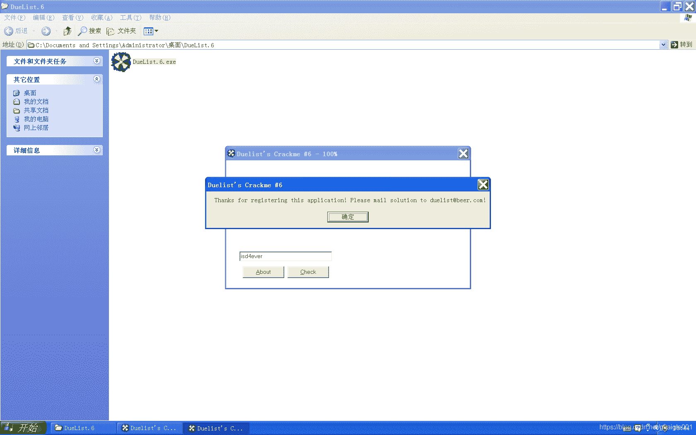
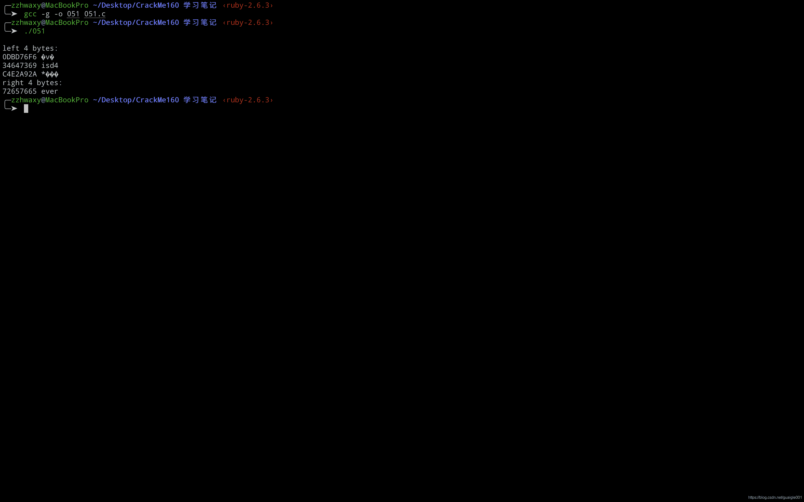

<!--yml
category: crackme160
date: 2022-04-27 18:16:05
-->

# CrackMe160 学习笔记 之 051_一剑名动江湖的博客-CSDN博客

> 来源：[https://blog.csdn.net/guaigle001/article/details/104445119](https://blog.csdn.net/guaigle001/article/details/104445119)

## 前言

题目倒是不难。



注册机花了点时间。

你可能不信，为了写这几行破代码，花了我一个下午。

## 思路

直接搜字符串即可。

## 分析

### 点击事件

```
004011ED  |.  6A 09         push    9                                ; /Count = 9
004011EF  |.  68 21214000   push    00402121                         ; |Buffer = DueList_.00402121
004011F4  |.  6A 69         push    69                               ; |ControlID = 69 (105.)
004011F6  |.  FF75 08       push    dword ptr [ebp+8]                ; |hWnd
004011F9  |.  E8 A0020000   call    <jmp.&USER32.GetDlgItemTextA>    ; \GetDlgItemTextA
004011FE  |.  83F8 08       cmp     eax, 8                           ;  判断返回的长度是否为8
00401201  |.  74 24         je      short 00401227                   ;  不成立则失败，跳转
00401203  |.  68 FE204000   push    004020FE                         ; /Text = "Duelist's Crackme #6 - 100%"
00401208  |.  FF75 08       push    dword ptr [ebp+8]                ; |hWnd
0040120B  |.  E8 C4020000   call    <jmp.&USER32.SetWindowTextA>     ; \SetWindowTextA
00401210  |.  6A 00         push    0                                ; /Style = MB_OK|MB_APPLMODAL
00401212  |.  68 9C204000   push    0040209C                         ; |Title = "Duelist's Crackme #6"
00401217  |.  68 19204000   push    00402019                         ; |Text = "The activation code you entered is incorrect!"
0040121C  |.  6A 00         push    0                                ; |hOwner = NULL
0040121E  |.  E8 87020000   call    <jmp.&USER32.MessageBoxA>        ; \MessageBoxA
00401223  |.  C9            leave
00401224  |.  C2 1000       retn    10
00401227  |>  FF75 08       push    dword ptr [ebp+8]
0040122A  |.  E8 1CFEFFFF   call    0040104B                         ;  验证函数
0040122F  |.  83F8 01       cmp     eax, 1                           ;  eax和1比较，不相等则失败
00401232  |.  75 18         jnz     short 0040124C                   ;  关键跳 
```

### 验证函数

```
0040104B  /$  C8 000000     enter   0, 0                             ;  压栈，通常和leave指令一起用
0040104F  |.  68 C4204000   push    004020C4                         ; /Text = "Duelist's Crackme #6 -   0%"
00401054  |.  FF75 08       push    dword ptr [ebp+8]                ; |hWnd
00401057  |.  E8 78040000   call    <jmp.&USER32.SetWindowTextA>     ; \SetWindowTextA
0040105C  |.  A1 21214000   mov     eax, dword ptr [402121]          ;  取出输入值送入eax
00401061  |.  B9 02000000   mov     ecx, 2                           ;  ecx = 2
00401066  |.  99            cdq
00401067  |.  F7F1          div     ecx                              ;  eax = eax / 2
00401069  |.  8BF0          mov     esi, eax                         ;  结果保存到esi中
0040106B  |.  B8 44554536   mov     eax, 36455544                    ;  eax = 0x36455544
00401070  |.  8B0D 21214000 mov     ecx, dword ptr [402121]          ;  取出输入值前四个字节送入ecx
00401076  |>  C1C0 06       /rol     eax, 6                          ;  循环左移6位
00401079  |.  32E0          |xor     ah, al                          ;  ah = ah ^ al
0040107B  |.  02C1          |add     al, cl                          ;  al = al + cl
0040107D  |.  49            |dec     ecx                             ;  计数器减一
0040107E  |.^ 75 F6         \jnz     short 00401076                  ;  ecx 为0则循环结束
00401080  |.  3D 85180704   cmp     eax, 4071885
00401085  |.  75 4E         jnz     short 004010D5
00401087  |.  68 E1204000   push    004020E1                         ; /Text = "Duelist's Crackme #6 -  50%"
0040108C  |.  FF75 08       push    dword ptr [ebp+8]                ; |hWnd
0040108F  |.  E8 40040000   call    <jmp.&USER32.SetWindowTextA>     ; \SetWindowTextA
00401094  |.  A1 25214000   mov     eax, dword ptr [402125]          ;  取输入值后四个字节送入eax中
00401099  |.  B9 02000000   mov     ecx, 2                           ;  ecx = 2
0040109E  |.  99            cdq
0040109F  |.  F7F1          div     ecx
004010A1  |.  8BF0          mov     esi, eax                         ;  结果保存到esi中
004010A3  |.  B8 52495343   mov     eax, 43534952                    ;  eax = 0x43534952
004010A8  |.  8B0D 25214000 mov     ecx, dword ptr [402125]
004010AE  |>  C1C0 06       /rol     eax, 6
004010B1  |.  32E0          |xor     ah, al
004010B3  |.  02C1          |add     al, cl
004010B5  |.  49            |dec     ecx
004010B6  |.^ 75 F6         \jnz     short 004010AE
004010B8  |.  3D 27D1004B   cmp     eax, 4B00D127
004010BD      75 16         jnz     short 004010D5                   ;  关键跳
004010BF  |.  68 FE204000   push    004020FE                         ; /Text = "Duelist's Crackme #6 - 100%"
004010C4  |.  FF75 08       push    dword ptr [ebp+8]                ; |hWnd
004010C7  |.  E8 08040000   call    <jmp.&USER32.SetWindowTextA>     ; \SetWindowTextA
004010CC  |.  B8 01000000   mov     eax, 1                           ;  eax = 1
004010D1  |.  C9            leave
004010D2  |.  C2 0400       retn    4
004010D5  |>  68 FE204000   push    004020FE                         ; /Text = "Duelist's Crackme #6 - 100%"
004010DA  |.  FF75 08       push    dword ptr [ebp+8]                ; |hWnd
004010DD  |.  E8 F2030000   call    <jmp.&USER32.SetWindowTextA>     ; \SetWindowTextA
004010E2  |.  33C0          xor     eax, eax                         ;  eax清零
004010E4  |.  C9            leave
004010E5  \.  C2 0400       retn    4 
```

## 注册机代码

```
#define ROR(x,n)  (((x)>>n)|(x)<<(32-n))
#define UNSIGNED_SUB(x,y) (x)<(y) ?  ((x)-(y))&0xFF : (x)-(y)

unsigned int count=0;
char key[8];
void cal_key(unsigned int v,unsigned int result);
#include<stdio.h>

int main()
{
  unsigned int left_s=0x4071885;
  unsigned int right_s= 0x4B00D127;
  printf("left 4 bytes:\n");
  cal_key(left_s,0x36455544);
  printf("right 4 bytes:\n");
  cal_key(right_s,0x43534952);
  return 0;
}
void cal_key(unsigned int v ,unsigned int result)
{
  count=0;
  while(count<0xFFFFFFFF)
    {
      count++;
      v=(UNSIGNED_SUB((v&0x000000FF),(count&0xFF))) | (v&0xFFFFFF00);

      v=v^((v&0x000000FF)<<8);

      v=ROR(v,6);
      if(v==result)
        {
          printf("%08X ",count);
          sprintf(key,"%c%c%c%c\n",count&0xFF,count>>8&0xFF,count>>16&0xFF,count>>24&0xFF);
          printf("%s",key);
        }

    }
} 
```

### 运行结果

左右连起来即可。
