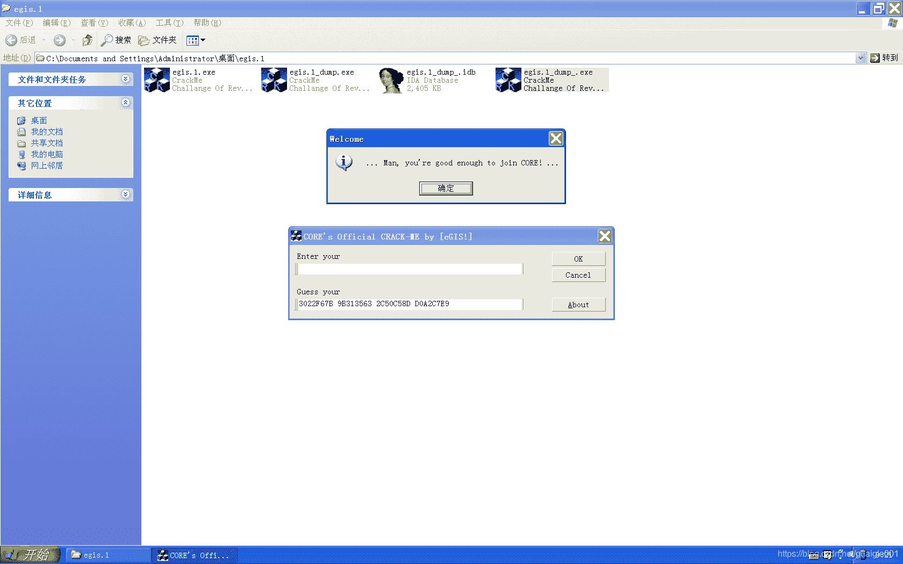
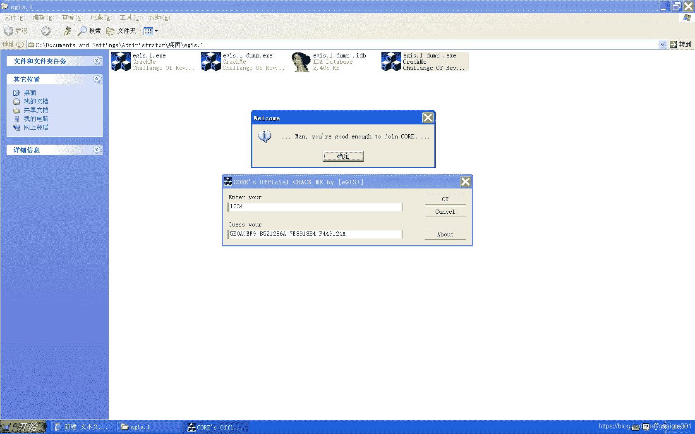
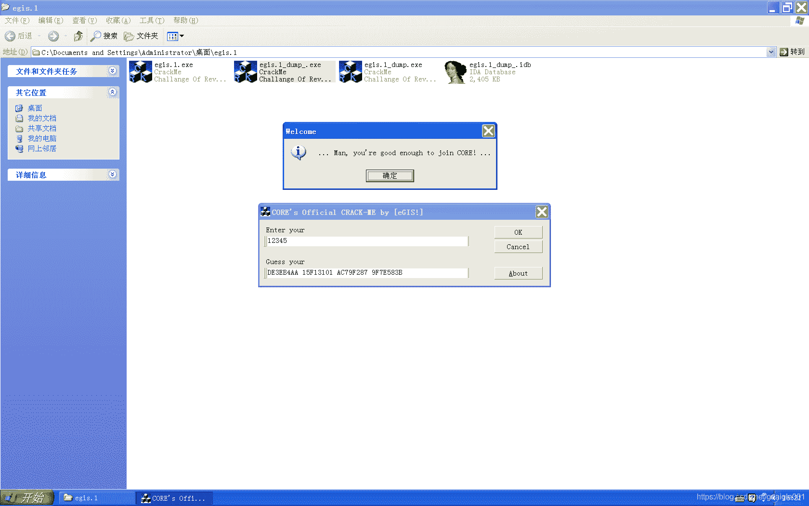
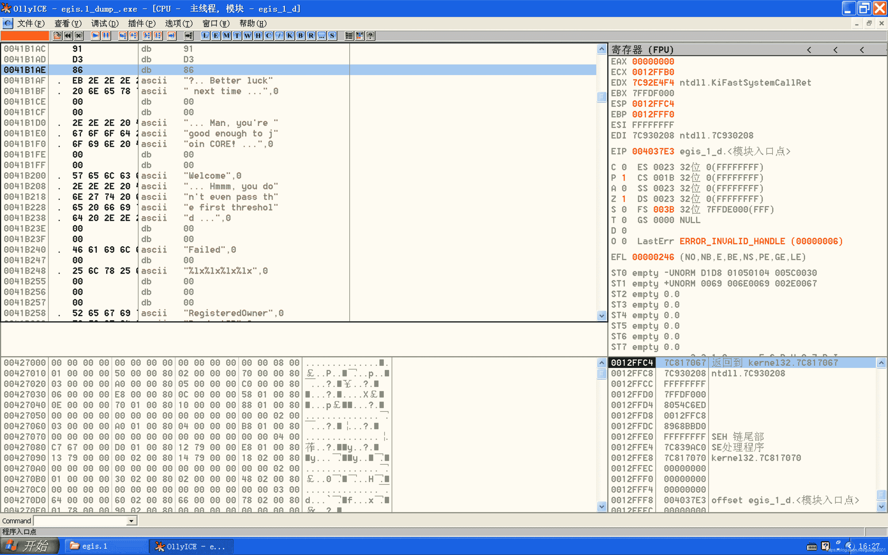
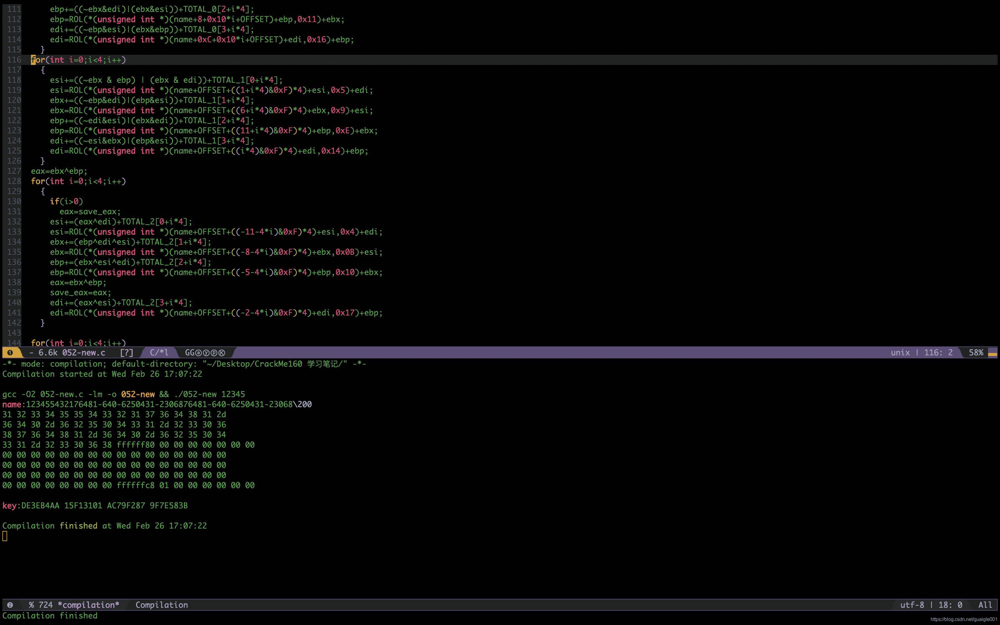

<!--yml
category: crackme160
date: 2022-04-27 18:16:02
-->

# CrackMe160 学习笔记 之 052_一剑名动江湖的博客-CSDN博客

> 来源：[https://blog.csdn.net/guaigle001/article/details/104520389](https://blog.csdn.net/guaigle001/article/details/104520389)

## 前言

这个题目做了我好几天，难度不用我说了吧。

话不多说，先放图。

## 输入为空



## 输入小于4个字符



## 输入大于4个字符



## 思路

作者没有给我们查找字符串的机会，不过可以找到这个。


很明显就是最后判断的信息。

接着全局查找这条指令，来到点击事件的入口处。

```
push    0041B208 
```

首先关注的当然是比较的指令了。

```
00401EB7    8B5404 1C       mov     edx, dword ptr [esp+eax+1C]
00401EBB    8B4C04 2C       mov     ecx, dword ptr [esp+eax+2C]
00401EBF    3BD1            cmp     edx, ecx
00401EC1   /75 26           jnz     short 00401EE9                   ; 关键跳
00401EC3   |83C0 04         add     eax, 4                           ; 向后移动四个字节
00401EC6   |83F8 10         cmp     eax, 10                          ; 一共比较16个字节 
```

把**0x12EF70**地址处的四个字节和**0x12EF80**地址处的四个字节依次比较，一共四轮循环。

这些字节是怎么生成的呢？

**0x12EF80**处的字节 由这个函数 **call 00401700** 生成，取决于输入的用户名。

**0x12EF70**处的字节 由这个函数 **call 00403&AF** 生成，取决于输入的密钥。

然后分别把这两部分算法逆出来。当然花了点时间。

下面说明三个很重要的坑。

### 坑点1: 输入字符串的修改

```
00401E18    894C34 34       mov     dword ptr [esp+esi+34], ecx      ; 写入字符在计算出的位置 
```

这个程序会用在字符串的某一个位置(计算得出的)写入字符串长度的8倍，从而修改了整个字符串，导致md5的结果偏差。

### 坑点2:修改md5计算的结果

```
00401E37    8B5C24 2C       mov     ebx, dword ptr [esp+2C]          ; 取12EF80处的地址赋值给ebx
00401E56    81E3 FFFF0000   and     ebx, 0FFFF                       ; 清空高4位
00401E62    895C24 44       mov     dword ptr [esp+44], ebx          ; 给12EF80重新赋值 
```

会清空最后md5计算后的高四位。

### 坑点3:md5不止计算一次

```
00401E2D    83C7 40         add     edi, 40
00401E30    83C4 08         add     esp, 8
00401E33    3BFE            cmp     edi, esi
00401E35  ^ 7C E7           jl      short 00401E1E                   ; 是否下一次计算 
```

当输入字符串长度小于等于4时，md5只计算一次

当输入字符串长度大于4时，计算次数会逐渐增加，当然一般人输不了那么长的字符，一般是2次。

解决了这三个坑，注册机就很容易写出来了。

## 分析

```
00401C5B    50              push    eax                              ; 压入输入name地址
00401C5C    8D4D 5C         lea     ecx, dword ptr [ebp+5C]
00401C5F    E8 A3F50000     call    00411207                         ; 获取name地址保存到12EF90中
00401C64    8D8C24 24040000 lea     ecx, dword ptr [esp+424]
00401C6B    6A 64           push    64
00401C6D    51              push    ecx                              ; 压入输入key地址
00401C6E    8D8D AC000000   lea     ecx, dword ptr [ebp+AC]
00401C74    E8 8EF50000     call    00411207                         ; 获取key地址保存到12F378中
00401C79    8D7C24 3C       lea     edi, dword ptr [esp+3C]          ; 取name地址
00401C7D    83C9 FF         or      ecx, FFFFFFFF                    ; ecx = 0xFFFFFFFF
00401C80    33C0            xor     eax, eax                         ; eax清零
00401C82    8D9424 30020000 lea     edx, dword ptr [esp+230]
00401C89    F2:AE           repne   scas byte ptr es:[edi]           ; + strlen(name) + 1
00401C8B    F7D1            not     ecx                              ; 取反得到name长度
00401C8D    2BF9            sub     edi, ecx                         ; edi: 得到name地址
00401C8F    8BC1            mov     eax, ecx                         ; 字符串拷贝到12F184中
00401C91    8BF7            mov     esi, edi
00401C93    8BFA            mov     edi, edx
00401C95    C1E9 02         shr     ecx, 2
00401C98    F3:A5           rep     movs dword ptr es:[edi], dword p>
00401C9A    8BC8            mov     ecx, eax
00401C9C    83E1 03         and     ecx, 3
00401C9F    F3:A4           rep     movs byte ptr es:[edi], byte ptr>
00401CA1    8D8C24 30020000 lea     ecx, dword ptr [esp+230]
00401CA8    51              push    ecx
00401CA9    E8 42610000     call    00407DF0                         ; 翻转字符串
00401CAE    8DBC24 34020000 lea     edi, dword ptr [esp+234]         ; 又计算了翻转字符串长度
00401CB5    83C9 FF         or      ecx, FFFFFFFF
00401CB8    33C0            xor     eax, eax
00401CBA    83C4 04         add     esp, 4
00401CBD    F2:AE           repne   scas byte ptr es:[edi]
00401CBF    F7D1            not     ecx
00401CC1    2BF9            sub     edi, ecx                         ; 翻转字符串地址保存到edi中
00401CC3    8D5424 3C       lea     edx, dword ptr [esp+3C]
00401CC7    8BF7            mov     esi, edi                         ; 翻转字符串地址从edi保存到esi中
00401CC9    8BD9            mov     ebx, ecx
00401CCB    8BFA            mov     edi, edx
00401CCD    83C9 FF         or      ecx, FFFFFFFF
00401CD0    F2:AE           repne   scas byte ptr es:[edi]
00401CD2    8BCB            mov     ecx, ebx
00401CD4    4F              dec     edi                              ; 指向原字符串后一位
00401CD5    C1E9 02         shr     ecx, 2                           ; 赋值新字符串到原字符串末尾，相当于连接字符串
00401CD8    F3:A5           rep     movs dword ptr es:[edi], dword p>
00401CDA    8BCB            mov     ecx, ebx
00401CDC    8D4424 18       lea     eax, dword ptr [esp+18]
00401CE0    83E1 03         and     ecx, 3
00401CE3    50              push    eax
00401CE4    68 74B24100     push    0041B274                         ; ASCII "SOFTWARE\Microsoft\Windows\CurrentVersion"
00401CE9    68 02000080     push    80000002
00401CEE    F3:A4           rep     movs byte ptr es:[edi], byte ptr>
00401CF0    FF15 0C604100   call    dword ptr [<&advapi32.RegOpenKey>; advapi32.RegOpenKeyA
00401CF6    8B1D 08604100   mov     ebx, dword ptr [<&advapi32.RegQu>; advapi32.RegQueryValueExA
00401CFC    8D4C24 14       lea     ecx, dword ptr [esp+14]
00401D00    8D9424 30020000 lea     edx, dword ptr [esp+230]         ; 翻转后的字符串
00401D07    51              push    ecx
00401D08    8B4C24 1C       mov     ecx, dword ptr [esp+1C]
00401D0C    8D4424 14       lea     eax, dword ptr [esp+14]
00401D10    52              push    edx
00401D11    50              push    eax
00401D12    6A 00           push    0
00401D14    68 68B24100     push    0041B268                         ; ASCII "ProductID"
00401D19    C74424 24 01000>mov     dword ptr [esp+24], 1
00401D21    C74424 28 00010>mov     dword ptr [esp+28], 100
00401D29    51              push    ecx
00401D2A    FFD3            call    ebx                              ; 读出一个key保存到12F184中
00401D2C    8DBC24 30020000 lea     edi, dword ptr [esp+230]         ; 读出的key
00401D33    83C9 FF         or      ecx, FFFFFFFF
00401D36    33C0            xor     eax, eax
00401D38    8D5424 3C       lea     edx, dword ptr [esp+3C]          ; 拼接后的新字符串
00401D3C    F2:AE           repne   scas byte ptr es:[edi]           ; 计算读出的key长度
00401D3E    F7D1            not     ecx
00401D40    2BF9            sub     edi, ecx                         ; edi保存key地址
00401D42    C74424 10 01000>mov     dword ptr [esp+10], 1
00401D4A    8BF7            mov     esi, edi                         ; key保存到esi中
00401D4C    8BFA            mov     edi, edx                         ; 新字符串保存到edi中
00401D4E    8BD1            mov     edx, ecx                         ; edx保存key长度
00401D50    83C9 FF         or      ecx, FFFFFFFF
00401D53    F2:AE           repne   scas byte ptr es:[edi]           ; 计算新字符串长度
00401D55    8BCA            mov     ecx, edx
00401D57    4F              dec     edi                              ; 指向字符串后一位
00401D58    C1E9 02         shr     ecx, 2
00401D5B    F3:A5           rep     movs dword ptr es:[edi], dword p>; 和上面一样的拼接字符串
00401D5D    8BCA            mov     ecx, edx
00401D8C    8DBC24 30020000 lea     edi, dword ptr [esp+230]         ; 原来读出的key
00401D93    83C9 FF         or      ecx, FFFFFFFF
00401D96    33C0            xor     eax, eax
00401D98    8D5424 3C       lea     edx, dword ptr [esp+3C]
00401D9C    F2:AE           repne   scas byte ptr es:[edi]           ; 求原来的key长度
00401D9E    F7D1            not     ecx
00401DA0    2BF9            sub     edi, ecx
00401DA2    8BF7            mov     esi, edi
00401DA4    8BD9            mov     ebx, ecx
00401DA6    8BFA            mov     edi, edx
00401DA8    83C9 FF         or      ecx, FFFFFFFF
00401DAB    F2:AE           repne   scas byte ptr es:[edi]           ; 遍历最新的字符串
00401DAD    8BCB            mov     ecx, ebx
00401DAF    4F              dec     edi                              ; 指向字符串后一位
00401DB0    C1E9 02         shr     ecx, 2
00401DB3    F3:A5           rep     movs dword ptr es:[edi], dword p>; 又拼接了一遍
00401DB5    8BCB            mov     ecx, ebx
00401DB7    83E1 03         and     ecx, 3
00401DBA    F3:A4           rep     movs byte ptr es:[edi], byte ptr>; 草，一共拼了两遍
00401DBC    8D7C24 3C       lea     edi, dword ptr [esp+3C]
00401DC0    83C9 FF         or      ecx, FFFFFFFF
00401DC3    F2:AE           repne   scas byte ptr es:[edi]           ; 求最新的字符串长度
00401DC5    F7D1            not     ecx
00401DC7    8D4424 2C       lea     eax, dword ptr [esp+2C]
00401DCB    49              dec     ecx
00401DCC    50              push    eax
00401DCD    8BF1            mov     esi, ecx                         ; esi = ecx
00401DCF    E8 0CF9FFFF     call    004016E0                         ; 从12RF80处16个字节写入固定值
00401DD4    8D5434 40       lea     edx, dword ptr [esp+esi+40]
00401DD8    B9 13000000     mov     ecx, 13                          ; ecx = 0x13
00401DDD    33C0            xor     eax, eax
00401DDF    8BFA            mov     edi, edx
00401DE1    F3:AB           rep     stos dword ptr es:[edi]          ; 这一块地址清零,应该是md5算法里的步骤
00401DE3    83C4 04         add     esp, 4
00401DE6    46              inc     esi                              ; esi = esi + 1
00401DE7    66:AB           stos    word ptr es:[edi]
00401DE9    8BCE            mov     ecx, esi
00401DEB    AA              stos    byte ptr es:[edi]
00401DEC    83E1 3F         and     ecx, 3F                          ; ecx = ecx  & 0x3F
00401DEF    B8 40000000     mov     eax, 40                          ; eax = 0x40
00401DF4    2BC1            sub     eax, ecx                         ; eax = 0x40 - ecx
00401DF6    C602 80         mov     byte ptr [edx], 80               ; 最后一位补80
00401DF9    83F8 07         cmp     eax, 7                           ; 相减后的长度和7比较
00401DFC    7F 03           jg      short 00401E01
00401DFE    83C0 40         add     eax, 40
00401E01    03F0            add     esi, eax                         ; esi = esi + eax
00401E03    8D7C24 3C       lea     edi, dword ptr [esp+3C]
00401E07    83C9 FF         or      ecx, FFFFFFFF
00401E0A    33C0            xor     eax, eax
00401E0C    F2:AE           repne   scas byte ptr es:[edi]           ; 计算字符串长度
00401E0E    F7D1            not     ecx
00401E10    49              dec     ecx                              ; 不包含0的真实长度
00401E11    33FF            xor     edi, edi                         ; edi清零
00401E13    C1E1 03         shl     ecx, 3                           ; ecx = ecx * 8
00401E16    85F6            test    esi, esi
00401E18    894C34 34       mov     dword ptr [esp+esi+34], ecx      ; 写入奇怪的字符
00401E1C    7E 19           jle     short 00401E37
00401E1E    8D5424 2C       lea     edx, dword ptr [esp+2C]
00401E22    8D443C 3C       lea     eax, dword ptr [esp+edi+3C]
00401E26    52              push    edx
00401E27    50              push    eax
00401E28    E8 D3F8FFFF     call    00401700                         ; 对12EF80处的四个字节进行运算
00401E2D    83C7 40         add     edi, 40
00401E30    83C4 08         add     esp, 8
00401E33    3BFE            cmp     edi, esi
00401E35  ^ 7C E7           jl      short 00401E1E                   ; 是否下一次计算
00401E37    8B5C24 2C       mov     ebx, dword ptr [esp+2C]          ; 取12EF80处的地址赋值给ebx
00401E3B    8D4C24 28       lea     ecx, dword ptr [esp+28]
00401E3F    8D5424 24       lea     edx, dword ptr [esp+24]
00401E43    51              push    ecx
00401E44    8D4424 24       lea     eax, dword ptr [esp+24]
00401E48    52              push    edx
00401E49    8D4C24 24       lea     ecx, dword ptr [esp+24]
00401E4D    50              push    eax
00401E4E    51              push    ecx                              ; 压入要保存的地址
00401E4F    8D9424 34040000 lea     edx, dword ptr [esp+434]         ; 取输入的key地址
00401E56    81E3 FFFF0000   and     ebx, 0FFFF                       ; 清空高4位
00401E5C    68 48B24100     push    0041B248                         ; ASCII "%lx%lx%lx%lx"
00401E61    52              push    edx
00401E62    895C24 44       mov     dword ptr [esp+44], ebx          ; 给12EF80重新赋值
00401E66    E8 44190000     call    004037AF                         ; 16进制打印
00401E6B    83C4 18         add     esp, 18
00401E6E    83F8 04         cmp     eax, 4
00401E71    74 1E           je      short 00401E91
00401E91    33F6            xor     esi, esi                         ; esi 清零
00401E93    8D7C24 1C       lea     edi, dword ptr [esp+1C]
00401E97    B8 DEC0AD0B     mov     eax, 0BADC0DE
00401E9C    8D4E 50         lea     ecx, dword ptr [esi+50]          ; ecx = esi + 50
00401E9F    99              cdq
00401EA0    F7F9            idiv    ecx                              ; eax = eax / ecx
00401EA2    50              push    eax
00401EA3    57              push    edi
00401EA4    E8 E7FCFFFF     call    00401B90                         ; 计算key
00401EA9    83C4 08         add     esp, 8
00401EAC    46              inc     esi                              ; 计数器加一
00401EAD    83C7 04         add     edi, 4
00401EB0    83FE 03         cmp     esi, 3                           ; 一共比较三次
00401EB3  ^ 7C E2           jl      short 00401E97
00401EB5    33C0            xor     eax, eax
00401EB7    8B5404 1C       mov     edx, dword ptr [esp+eax+1C]
00401EBB    8B4C04 2C       mov     ecx, dword ptr [esp+eax+2C]
00401EBF    3BD1            cmp     edx, ecx
00401EC1    75 26           jnz     short 00401EE9                   ; 关键跳
00401EC3    83C0 04         add     eax, 4                           ; 向后移动四个字节
00401EC6    83F8 10         cmp     eax, 10                          ; 一共比较16个字节
00401EC9  ^ 7C EC           jl      short 00401EB7 
```

### md5计算

整个指令太长了，我就放最后一段。

```
00401B60    8B4424 2C       mov     eax, dword ptr [esp+2C]
00401B64    8B08            mov     ecx, dword ptr [eax]             ; ecx = x1
00401B66    8B50 08         mov     edx, dword ptr [eax+8]           ; edx = x3
00401B69    03CE            add     ecx, esi                         ; ecx = esi + x1
00401B6B    8B70 04         mov     esi, dword ptr [eax+4]           ; esi = x2
00401B6E    8908            mov     dword ptr [eax], ecx             ; [12EF80]= esi + x1
00401B70    8B48 0C         mov     ecx, dword ptr [eax+C]           ; ecx = x4
00401B73    03F7            add     esi, edi                         ; esi = x2 + edi
00401B75    03D5            add     edx, ebp                         ; edx = x3 + ebp
00401B77 >  8970 04         mov     dword ptr [eax+4], esi           ; [12EF84]= edi + x2
00401B7A    5F              pop     edi
00401B7B    03CB            add     ecx, ebx                         ; ecx = ebx + x4
00401B7D    5E              pop     esi
00401B7E    5D              pop     ebp
00401B7F    8950 08         mov     dword ptr [eax+8], edx           ; [12EF88] = ebp + x3
00401B82    8948 0C         mov     dword ptr [eax+C], ecx           ; [12EF8C] = ebx + x4
00401B85    5B              pop     ebx
00401B86    83C4 14         add     esp, 14 
```

### key计算

```
00401B90    8B4424 04       mov     eax, dword ptr [esp+4]
00401B94    53              push    ebx
00401B95    8B5C24 0C       mov     ebx, dword ptr [esp+C]
00401B99    56              push    esi
00401B9A    8B30            mov     esi, dword ptr [eax]             ; x1:取当前四个字节
00401B9C    57              push    edi
00401B9D    8B78 04         mov     edi, dword ptr [eax+4]           ; x2:取后四个字节
00401BA0    85DB            test    ebx, ebx
00401BA2    76 71           jbe     short 00401C15
00401BA4    55              push    ebp
00401BA5    8BEF            mov     ebp, edi                         ; ebp = x2
00401BA7    B9 01000000     mov     ecx, 1                           ; ecx = 1
00401BAC    C1ED 1F         shr     ebp, 1F                          ; x2右移31位，取出最高位
00401BAF    896C24 18       mov     dword ptr [esp+18], ebp          ; 最高位存进esp+18中
00401BB3    8BC6            mov     eax, esi                         ; eax = x1
00401BB5    8BD7            mov     edx, edi                         ; edx = x2
00401BB7    33ED            xor     ebp, ebp                         ; ebp清零
00401BB9    E8 B21B0000     call    00403770                         ; SHLD(x1,x2,1); x1<<=1;
00401BBE    8B4C24 18       mov     ecx, dword ptr [esp+18]
00401BC2    0BEA            or      ebp, edx                         ; ebp = edx
00401BC4    0BC8            or      ecx, eax                         ; ecx = 最高位 | eax
00401BC6    33D2            xor     edx, edx                         ; edx 清零
00401BC8    8BF1            mov     esi, ecx                         ; ecx的值保存到x1中
00401BCA    B9 0B000000     mov     ecx, 0B                          ; ecx = 0xB
00401BCF    8BC6            mov     eax, esi                         ; 取x1到eax中
00401BD1    8BFD            mov     edi, ebp
00401BD3    83E0 04         and     eax, 4                           ; eax = eax & 4
00401BD6    E8 951B0000     call    00403770
00401BDB    8BCE            mov     ecx, esi                         ; ecx = x1
00401BDD    33ED            xor     ebp, ebp                         ; ebp = 0
00401BDF    81E1 00200000   and     ecx, 2000                        ; 判断x1的第14位
00401BE5    33D5            xor     edx, ebp                         ; 无意义，edx不变
00401BE7    33C1            xor     eax, ecx                         ; eax = eax ^ (x1 &0x2000)
00401BE9    B9 12000000     mov     ecx, 12                          ; ecx = 0x12
00401BEE    E8 7D1B0000     call    00403770                         ; SHLD(x1^(x1&0x2000).0,0x12);x1<<=0x12;
00401BF3    8BCE            mov     ecx, esi                         ; 取x1到ecx中
00401BF5    33D5            xor     edx, ebp                         ; 无意义，edx不变
00401BF7    81E1 00000080   and     ecx, 80000000                    ; 判断x1的最高位
00401BFD    33C1            xor     eax, ecx
00401BFF    B9 01000000     mov     ecx, 1                           ; ecx = 1
00401C04    E8 671B0000     call    00403770
00401C09    33F0            xor     esi, eax
00401C0B    33FA            xor     edi, edx
00401C0D    4B              dec     ebx                              ; 计数器减一
00401C0E  ^ 75 95           jnz     short 00401BA5
00401C10    8B4424 14       mov     eax, dword ptr [esp+14]
00401C14    5D              pop     ebp
00401C15    8930            mov     dword ptr [eax], esi             ; 给当前四个字节赋新值
00401C17    8978 04         mov     dword ptr [eax+4], edi           ; 给后面四个字节赋值
00401C1A    5F              pop     edi
00401C1B    5E              pop     esi
00401C1C    5B              pop     ebx
00401C1D    C3              retn 
```

其中esi，edi保存了最后生成的值。

esi只在第1，4部分被改变。
esi只在第1部分被改变。

## 注册机代码

```
 #define ROL(x,n)  ((x)<<n |(x)>>(32-n))
#define offset_esi(x) ((x)>7?(x):((x)+0x40))
#define OFFSET  (0x40*now_time)
#define TEST {\
  if(i==0&&now_time==1) \
    Print(); \
}
#include<stdio.h>
#include<string.h>

unsigned int x1,x2,x3,x4;
unsigned int eax,ebx,ecx,edx,esi,edi,ebp;
unsigned int special_char_pos;
unsigned int save_eax=0;
unsigned int recycle_time=0,now_time;
unsigned TOTAL_0[]={
  0xD76AA478,0xE8C7B756,0x242070DB,0xC1BDCEEE,
  0xF57C0FAF,0x4787C62A,0xA8304613,0xFD469501,
  0x698098D8,0x8B44F7Af,0xFFFF5BB1,0x895CD7BE,
  0x6B901122,0xFD987193,0xA679438E,0x49B40821
};
unsigned TOTAL_1[]={
  0xF61E2562,0xC040B340,0x265E5A51,0xE9B6C7AA,
  0xD62F105D,0x02441453,0xD8A1E681,0xE7D3FBC8,
  0x21E1CDE6,0xC33707D6,0xF4D50D87,0x455A14Ed,
  0xA9E3E905,0xFCEFA3F8,0x676F02D9,0x8D2A4C8A
};
unsigned TOTAL_2[]={
  0xFFFA3942,0x8771F681,0x6D9D6122,0xFDE5380C,
  0xA4BEEA44,0x4BDECFA9,0xF6BB4B60,0xBEBFBC70,
  0x289B7EC6,0xEAA127FA,0xD4EF3085,0x04881D05,
  0xD9D4D039,0xE6DB99E5,0x1FA27CF8,0xC4AC5665
};
unsigned TOTAL_3[]={
  0xF4292244,0x432AFF97,0xAB9423A7,0xFC93A039,
  0x655B59C3,0x8F0CCC92,0xFFEFF47D,0x85845DD1,
  0x6FA87E4F,0xFE2CE6E0,0xA3014314,0x4E0811A1,
  0xF7537E82,0xBD3AF235,0x2AD7D2BB,0xEB86D391
};
void Print();
void cal_key(unsigned int *esi,unsigned int *edi,unsigned int sum);
int main(int argc,char **argv)
{
  x1=0x67452301;x2=0xEFCDAB89;x3=~x1;x4=~x2;
  char name[128];
  unsigned int len=0;
  memset(name,0,sizeof(name));
  printf("name:");
  if(argc!=2)
    scanf("%[^\n]",name);
  else
    sprintf(name,"%s",argv[1]);
  if((len=strlen(name))<0)
    return 0;
  for(int i=0;i<len;i++)
    {
      name[i+len]=name[len-i-1];

    }
  sprintf(name,"%s%s%c",name,"76481-640-6250431-2306876481-640-6250431-23068",0x80 );
  special_char_pos=offset_esi(0x40-(strlen(name)+1&0x3F))+strlen(name)+0x12EF54+0x34;

  name[special_char_pos-0x0012EF90+1]=strlen(name)<<3&0xFF;
  name[special_char_pos-0x0012EF90+2]=strlen(name)<<3>>8;
  printf("%s\n",name);
  recycle_time=(offset_esi(0x40-((len*2+0x2F)&0x3F))+len*2+0x2F)/0x40;
  for(int i=0;i<128;i++)
    {
      printf("%02x ",name[i]);
      if((i+1)%16==0)
        printf("\n");
    }
  printf("\n");

  len=4;
 START:
  eax=0;ebx=x4;ecx=0;edx=0;esi=x1;edi=x2;ebp=x3;
  for(int i=0;i<4;i++)
    {
      esi+=((~edi&ebx)|(ebp&edi))+TOTAL_0[0+i*4];
      esi=ROL(*(unsigned int *)(name+0x10*i+OFFSET)+esi,7)+edi;
      ebx+=((edi&esi)|(~esi&ebp))+TOTAL_0[1+i*4];
      ebx=ROL(*(unsigned int *)(name+4+0x10*i+OFFSET)+ebx,0xC)+esi;
      ebp+=((~ebx&edi)|(ebx&esi))+TOTAL_0[2+i*4];
      ebp=ROL(*(unsigned int *)(name+8+0x10*i+OFFSET)+ebp,0x11)+ebx;
      edi+=((~ebp&esi)|(ebx&ebp))+TOTAL_0[3+i*4];
      edi=ROL(*(unsigned int *)(name+0xC+0x10*i+OFFSET)+edi,0x16)+ebp;
    }
  Print();
  for(int i=0;i<4;i++)
    {
      esi+=((~ebx & ebp) | (ebx & edi))+TOTAL_1[0+i*4];
      esi=ROL(*(unsigned int *)(name+OFFSET+((1+i*4)&0xF)*4)+esi,0x5)+edi;
      ebx+=((~ebp&edi)|(ebp&esi))+TOTAL_1[1+i*4];
      ebx=ROL(*(unsigned int *)(name+OFFSET+((6+i*4)&0xF)*4)+ebx,0x9)+esi;
      ebp+=((~edi&esi)|(ebx&edi))+TOTAL_1[2+i*4];
      ebp=ROL(*(unsigned int *)(name+OFFSET+((11+i*4)&0xF)*4)+ebp,0xE)+ebx;
      edi+=((~esi&ebx)|(ebp&esi))+TOTAL_1[3+i*4];
      edi=ROL(*(unsigned int *)(name+OFFSET+((i*4)&0xF)*4)+edi,0x14)+ebp;
    }
  eax=ebx^ebp;
  for(int i=0;i<4;i++)
    {
      if(i>0)
        eax=save_eax;
      esi+=(eax^edi)+TOTAL_2[0+i*4];
      esi=ROL(*(unsigned int *)(name+OFFSET+((-11-4*i)&0xF)*4)+esi,0x4)+edi;
      ebx+=(ebp^edi^esi)+TOTAL_2[1+i*4];
      ebx=ROL(*(unsigned int *)(name+OFFSET+((-8-4*i)&0xF)*4)+ebx,0x0B)+esi;
      ebp+=(ebx^esi^edi)+TOTAL_2[2+i*4];
      ebp=ROL(*(unsigned int *)(name+OFFSET+((-5-4*i)&0xF)*4)+ebp,0x10)+ebx;
      eax=ebx^ebp;
      save_eax=eax;
      edi+=(eax^esi)+TOTAL_2[3+i*4];
      edi=ROL(*(unsigned int *)(name+OFFSET+((-2-4*i)&0xF)*4)+edi,0x17)+ebp;
    }

  for(int i=0;i<4;i++)
    {
      esi+=((~ebx|edi)^ebp)+TOTAL_3[0+i*4];
      esi=ROL(*(unsigned int *)(name+OFFSET+(-4*i&0xF)*4)+esi,6)+edi;
      ebx+=((~ebp|esi)^edi)+TOTAL_3[1+i*4];
      ebx=ROL(*(unsigned int *)(name+OFFSET+((-9-4*i)&0xF)*4)+ebx,0xA)+esi;
      ebp+=((~edi|ebx)^esi)+TOTAL_3[2+i*4];
      ebp=ROL(*(unsigned int * )(name+OFFSET+((-2-4*i)&0xF)*4)+ebp,0xF)+ebx;
      edi+=((~esi|ebp)^ebx)+TOTAL_3[3+i*4];
      edi=ROL(*(unsigned int *)(name+OFFSET+((5-4*i)&0xF)*4)+edi,0x15)+ebp;
    }
  x1+=esi;
  x2+=edi;
  x3+=ebp;
  x4+=ebx;

  now_time++;
  if(now_time<recycle_time)
    goto START;
  x1=x1&0xFFFF;
  cal_key(&x3,&x4,0x0BADC0DE/0x52);
  cal_key(&x2,&x3,0x0BADC0DE/0x51);
  cal_key(&x1,&x2,0x0BADC0DE/0x50);
  printf("key:%X %X %X %X\n",x1,x2,x3,x4);
  return 0;
}
void cal_key(unsigned int* esi,unsigned int* edi,unsigned int  sum)
{

  for(unsigned int i=0;i<sum;i++)
    {
      *edi^=((((((*esi&4)<<0x0B)^(*esi&0x2000))<<0x12) ^ (*esi&0x80000000))>>0x1F);
      unsigned int  tmp=*esi;
      *esi=(*esi>>1)|((*edi&1)<<0x1F);
      *edi=(*edi>>1)|((tmp&1)<<0x1F);
    }
  return;
}

void Print()
{
  printf("eax= %08X\n",eax);
  printf("ebx= %08X\n",ebx);
  printf("ecx= %08X\n",ecx);
  printf("edx= %08X\n",edx);
  printf("esi= %08X\n",esi);
  printf("edi= %08X\n",edi);
  printf("ebp= %08X\n\n",ebp);
} 
```

### key的算法

```
#include<stdio.h>
#define SHLD(x1,x2,cl){                         \
    x2=((x2)<<cl) | ((x1)>>(0x20-cl));          \
  }
#define TEST {\
  if(i==0x255F35-1)\
Print();\
}
void Print();
unsigned int esi,edi,eax,edx;
int main()
{
  esi=0x99F32DF2 ;
  edi=0xF995A4DE;

  for(unsigned int i=0;i<0x0BADC0DE/0x51;i++)
    {

      unsigned int temp=edi;
      SHLD(esi,edi,1)
        esi<<=1;
      esi|=temp>>0x1F;
      eax=esi;
      eax&=4;
      edx=0;

      eax<<=0x0B;
      eax^=(esi&0x2000);

      eax<<=0x12;

      eax^=(esi&0x80000000);
      SHLD(eax,edx,1)
        eax<<=1;
      esi^=eax;
      edi^=edx;
    }
  Print();
  return 0;
}
void Print()
{
  printf("eax=%08X\n",eax);
  printf("edx=%08X\n",edx);
  printf("esi=%08X\n",esi);
  printf("edi=%08X\n\n",edi);
} 
```

### key的逆向算法

```
#include<stdio.h>
unsigned int esi,edi,tmp;
int main()
{
  esi=0x4E86EF06;
  edi=0xF03E5F6C;

  for(int i=0;i<0x0BADC0DE/0x52;i++)
    {
      edi^=((((((esi&4)<<0x0B)^(esi&0x2000))<<0x12) ^ (esi&0x80000000))>>0x1F);

      tmp=esi;
      esi=(esi>>1)|((edi&1)<<0x1F);
      edi=(edi>>1)|((tmp&1)<<0x1F);
    }
  printf("%0X %0X\n",esi,edi);
  return 0;
} 
```

### 测试代码

```
#include<stdio.h>
unsigned int tmp;
unsigned int x1=0x00DA06,x2=0x95FA2A1B,x3=0x7B0E4FA9,x4=0x5B734324;
void cal_key(unsigned int *esi,unsigned int *edi,unsigned int sum);
int main()
{

  cal_key(&x3,&x4,0x0BADC0DE/0x52);
  printf("%X %X %X %X\n",x1,x2,x3,x4);
  cal_key(&x2,&x3,0x0BADC0DE/0x51);
  printf("%X %X %X %X\n",x1,x2,x3,x4);
  cal_key(&x1,&x2,0x0BADC0DE/0x50);
  printf("%X %X %X %X\n",x1,x2,x3,x4);
  return 0;
}
void cal_key(unsigned int* esi,unsigned int* edi,unsigned int  sum)
{

  for(unsigned int i=0;i<sum;i++)
    {
      *edi^=((((((*esi&4)<<0x0B)^(*esi&0x2000))<<0x12) ^ (*esi&0x80000000))>>0x1F);

      tmp=*esi;
      *esi=(*esi>>1)|((*edi&1)<<0x1F);
      *edi=(*edi>>1)|((tmp&1)<<0x1F);
    }

  return;

} 
```

其实Print()和TEST都是我用来测试状态的代码。

## 运行结果

