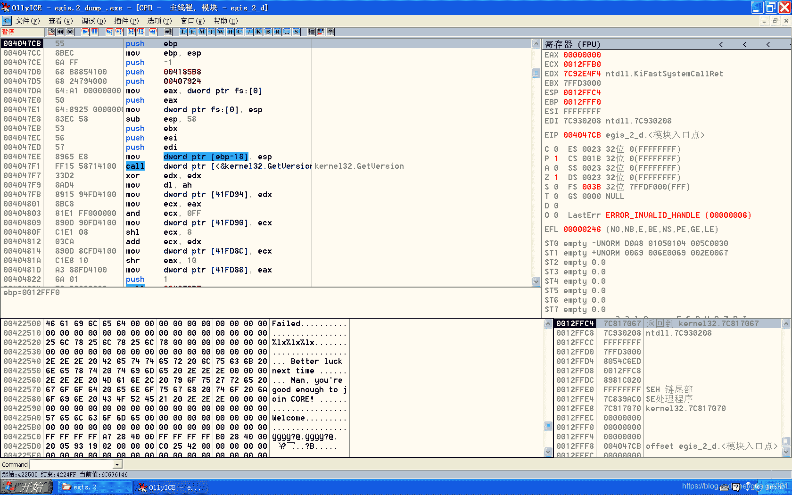

<!--yml
category: crackme160
date: 2022-04-27 18:15:56
-->

# CrackMe160 学习笔记 之 053_一剑名动江湖的博客-CSDN博客

> 来源：[https://blog.csdn.net/guaigle001/article/details/104577476](https://blog.csdn.net/guaigle001/article/details/104577476)

## 前言

这个题目花了两天还没做出来，其中写注册机的时候涉及了矩阵的运算。

这一块不是很熟，算来算去始终算不对，我裂开了。
]

感觉在这一块花太多的时间没有意义。

现在先存个档，以后等我研究透了线性代数再来解决注册机的问题吧。

## 思路

首先搜索字符串。发现作者依旧把字符串藏起来了。

不过仍然有办法，打开16进制文本编辑器。搜索失败字符串的位置。

计算得到在内存里偏移的位置，下内存断点。（或者push 地址这条指令也行）

前面的过程和上个题目大同小异，比较计算得出的md5从4个数变成了3个数。

还有这个程序好像是针对64位的，xp里得不到产品ID。

## 分析

因为和上个程序差不多，所以前面的分析比较简略。

```
0040212A    E8 D7050100     call    00412706                         ; 获取输入name保存到12EF18中
0040212F    83C4 F8         add     esp, -8
00402132    8D85 ECFBFFFF   lea     eax, dword ptr [ebp-414]         ; 要压入的地址
00402138    8B4D FC         mov     ecx, dword ptr [ebp-4]
0040213B    C74424 04 64000>mov     dword ptr [esp+4], 64
00402143    81C1 AC000000   add     ecx, 0AC
00402149    890424          mov     dword ptr [esp], eax
0040214C    E8 B5050100     call    00412706                         ; 获取输入key保存到12F10C中
00402151    8DB5 E0FDFFFF   lea     esi, dword ptr [ebp-220]
00402157    8DBD F8F9FFFF   lea     edi, dword ptr [ebp-608]         ; 取出name地址
0040215D    8A17            mov     dl, byte ptr [edi]               ; 复制字符串到12F300中，花里胡哨的
0040215F    47              inc     edi
00402160    8816            mov     byte ptr [esi], dl
00402162    46              inc     esi
00402163    84D2            test    dl, dl
00402165  ^ 75 F6           jnz     short 0040215D
00402167    57              push    edi
00402168    8D85 E0FDFFFF   lea     eax, dword ptr [ebp-220]         ; 取出name地址
0040216E    50              push    eax
0040216F    E8 FC6B0000     call    00408D70                         ; 翻转字符串
00402174    8DBD F8F9FFFF   lea     edi, dword ptr [ebp-608]
0040217A    8D95 E0FDFFFF   lea     edx, dword ptr [ebp-220]
00402180    83C4 08         add     esp, 8
00402183    B9 FFFFFFFF     mov     ecx, -1
00402188    33C0            xor     eax, eax
0040218A    F2:AE           repne   scas byte ptr es:[edi]           ; 拼接字符串
00402259    41              inc     ecx                              ; 计算字符串长度保存到eax中
0040225A    40              inc     eax
0040225B    8A11            mov     dl, byte ptr [ecx]
0040225D    84D2            test    dl, dl
0040225F  ^ 75 F8           jnz     short 00402259                   ; 字符串结尾时不跳转
00402261    57              push    edi
00402262    8D55 E0         lea     edx, dword ptr [ebp-20]
00402265    8BD8            mov     ebx, eax                         ; 字符串长度保存到ebx中
00402267    52              push    edx
00402268    E8 73F2FFFF     call    004014E0                         ; MD5初始化
0040226D    8DBD F8F9FFFF   lea     edi, dword ptr [ebp-608]         ; 取出name地址
00402273    83C4 08         add     esp, 8
00402276    03FB            add     edi, ebx                         ; 移动到字符串结尾
004022BB    8D53 01         lea     edx, dword ptr [ebx+1]           ; edx =strlen(name) + 1
004022BE    8D8D F8F9FFFF   lea     ecx, dword ptr [ebp-608]         ; 取出name地址
004022C4    83E2 3F         and     edx, 3F                          ; edx = edx & 0x3F
004022C7    C6040B 80       mov     byte ptr [ebx+ecx], 80           ; 结尾处写入0x80
004022CB    F7DA            neg     edx                              ; 求补码
004022CD    8BC2            mov     eax, edx
004022CF    83C0 40         add     eax, 40                          ; eax = eax + 0x40
004022D2    83F8 07         cmp     eax, 7
004022D5    7F 06           jg      short 004022DD
004022D7    8D82 80000000   lea     eax, dword ptr [edx+80]          ; eax = edx +0x80
004022DD    8DBD F8F9FFFF   lea     edi, dword ptr [ebp-608]         ; 取出name地址
004022E3    8D7418 01       lea     esi, dword ptr [eax+ebx+1]       ; esi = eax + ebx + 1
004022E7    33C0            xor     eax, eax
004022E9    8A37            mov     dh, byte ptr [edi]
004022EB    8BCF            mov     ecx, edi
004022ED    84F6            test    dh, dh
004022EF    74 08           je      short 004022F9
004022F1    41              inc     ecx                              ; 计算新字符串长度保存到eax中
004022F2    40              inc     eax
004022F3    8A11            mov     dl, byte ptr [ecx]
004022F5    84D2            test    dl, dl                           ; 判断是否为字符串结尾
004022F7  ^ 75 F8           jnz     short 004022F1
004022F9    C1E0 03         shl     eax, 3                           ; 长度*8
004022FC    8D95 F8F9FFFF   lea     edx, dword ptr [ebp-608]
00402302    33DB            xor     ebx, ebx
00402304    85F6            test    esi, esi
00402306    894416 F8       mov     dword ptr [esi+edx-8], eax       ; 特殊位置写入字符
00402319    E8 E2F1FFFF     call    00401500                         ; md5计算
00402341    E8 51240000     call    00404797                         ; 16进制打印
00402346    83C4 18         add     esp, 18
00402349    83F8 03         cmp     eax, 3
0040234C    74 29           je      short 00402377                   ; 比较输入的key数量
00402388    E8 43F7FFFF     call    00401AD0                         ; 计算输入的key
0040238D    B8 C0C54100     mov     eax, 0041C5C0
00402392    BA C0C44100     mov     edx, 0041C4C0
00402397    83C4 0C         add     esp, 0C
0040239A    50              push    eax
0040239B    52              push    edx
0040239C    53              push    ebx
0040239D    E8 2EF7FFFF     call    00401AD0                         ; 计算输入的key
004023A2    83C4 10         add     esp, 10
004023A5    B8 FDFFFFFF     mov     eax, -3                          ; eax 初始化为 -3
004023AA    8B5485 FC       mov     edx, dword ptr [ebp+eax*4-4]
004023AE    3B5485 EC       cmp     edx, dword ptr [ebp+eax*4-14]
004023B2    75 2C           jnz     short 004023E0
004023B4    40              inc     eax                              ; 计数器加一
004023B5  ^ 75 F3           jnz     short 004023AA 
```

### CALL 00401AD0

```
00401AD4    8B5C24 1C       mov     ebx, dword ptr [esp+1C]          ; y2: 传入的固定地址
00401AD8    8B6C24 18       mov     ebp, dword ptr [esp+18]          ; y1: 传入的固定地址
00401ADC    83EC 2C         sub     esp, 2C
00401ADF    33C0            xor     eax, eax
00401AE1    33F6            xor     esi, esi
00401AE3    33FF            xor     edi, edi
00401AE5    8B5424 40       mov     edx, dword ptr [esp+40]          ; x1:当前传入的四字节地址
00401AE9    894424 24       mov     dword ptr [esp+24], eax
00401AED    83C2 04         add     edx, 4
00401AF0    895424 18       mov     dword ptr [esp+18], edx          ; x2:后传入的四字节地址
00401AF4    8B4424 18       mov     eax, dword ptr [esp+18]
00401AF8    8B5424 40       mov     edx, dword ptr [esp+40]
00401AFC    8B4D 00         mov     ecx, dword ptr [ebp]             ; ecx = y1 + esi * 4
00401AFF    8B00            mov     eax, dword ptr [eax]             ; eax = x2
00401B01    2303            and     eax, dword ptr [ebx]             ; eax = x2 & ( y2 + esi * 4 )
00401B03    8B12            mov     edx, dword ptr [edx]             ; edx = x1
00401B05    23D1            and     edx, ecx                         ; edx = x1 & ( y1 + esi * 4 )
00401B07    894424 20       mov     dword ptr [esp+20], eax          ; eax的值保存起来，下一个函数用
00401B0B    891424          mov     dword ptr [esp], edx             ; edx的值保存到栈顶
00401B0E    E8 9DFFFFFF     call    00401AB0                         ; 判断edx有几个1
00401B13    894424 1C       mov     dword ptr [esp+1C], eax          ; 循环次数保存到esp+1c中
00401B17    8B5424 20       mov     edx, dword ptr [esp+20]          ; edx = x2 & y2
00401B1B    891424          mov     dword ptr [esp], edx             ; edx的值保存到栈顶
00401B1E    E8 8DFFFFFF     call    00401AB0                         ; 判断edx有几个1
00401B23    8B5424 1C       mov     edx, dword ptr [esp+1C]          ; 取出上次的循环次数到edx中
00401B27    03FF            add     edi, edi                         ; edi = edi * 2
00401B29    81E2 FF000000   and     edx, 0FF                         ; edx只保留后两位
00401B2F    46              inc     esi                              ; 计数器加一
00401B30    83C3 04         add     ebx, 4                           ; y2指向下四个字节
00401B33    B9 FF000000     mov     ecx, 0FF                         ; ecx = 0xFF
00401B38    23CE            and     ecx, esi                         ; esi只保留后两位存到ecx中
00401B3A    83C5 04         add     ebp, 4                           ; y1指向下四个字节
00401B3D    25 FF000000     and     eax, 0FF                         ; eax只保留后两位
00401B42    33D0            xor     edx, eax                         ; 两次计算的次数异或保存到edx中
00401B44    83E2 01         and     edx, 1                           ; edx = edx & 1
00401B47    33FA            xor     edi, edx                         ; edi = edi ^ edx
00401B49    83F9 20         cmp     ecx, 20                          ; 一共循环0x20次
00401B4C  ^ 7C A6           jl      short 00401AF4
00401B4E    33F6            xor     esi, esi
00401B50    897C24 28       mov     dword ptr [esp+28], edi          ; 第一次计算结果保存到esp+28中
00401B54    8B7C24 24       mov     edi, dword ptr [esp+24]          ; 接下来重复第一次的步骤
00401B58    8B4424 18       mov     eax, dword ptr [esp+18]
00401B5C    8B5424 40       mov     edx, dword ptr [esp+40]
00401B60    8B4D 00         mov     ecx, dword ptr [ebp]
00401B63    8B00            mov     eax, dword ptr [eax]
00401B65    2303            and     eax, dword ptr [ebx]
00401B67    8B12            mov     edx, dword ptr [edx]
00401B69    23D1            and     edx, ecx
00401B6B    894424 1C       mov     dword ptr [esp+1C], eax
00401B6F    891424          mov     dword ptr [esp], edx
00401B72    E8 39FFFFFF     call    00401AB0
00401B77    894424 20       mov     dword ptr [esp+20], eax
00401B7B    8B5424 1C       mov     edx, dword ptr [esp+1C]
00401B7F    891424          mov     dword ptr [esp], edx
00401B82    E8 29FFFFFF     call    00401AB0
00401B87    8B5424 20       mov     edx, dword ptr [esp+20]
00401B8B    03FF            add     edi, edi                         ; edi = edi * 2
00401B8D    81E2 FF000000   and     edx, 0FF
00401B93    46              inc     esi
00401B94    83C3 04         add     ebx, 4
00401B97    B9 FF000000     mov     ecx, 0FF
00401B9C    23CE            and     ecx, esi
00401B9E    83C5 04         add     ebp, 4
00401BA1    25 FF000000     and     eax, 0FF
00401BA6    33D0            xor     edx, eax
00401BA8    83E2 01         and     edx, 1
00401BAB    33FA            xor     edi, edx
00401BAD    83F9 20         cmp     ecx, 20
00401BB0  ^ 7C A6           jl      short 00401B58                   ; 计算出第二个值
00401BB2    8B4424 40       mov     eax, dword ptr [esp+40]
00401BB6    8B5424 18       mov     edx, dword ptr [esp+18]
00401BBA    897C24 24       mov     dword ptr [esp+24], edi
00401BBE    8BCF            mov     ecx, edi
00401BC0    8B7C24 28       mov     edi, dword ptr [esp+28]
00401BC4    8938            mov     dword ptr [eax], edi             ; 给x1重新赋值
00401BC6    890A            mov     dword ptr [edx], ecx             ; 给x2重新赋值 
```

分两次计算高位和低位，结果都存放到edi中，互不干扰。

### call 401AB0

```
00401AB0    8B5424 04       mov     edx, dword ptr [esp+4]           ; 取出栈顶中的值
00401AB4    33C0            xor     eax, eax
00401AB6    85D2            test    edx, edx
00401AB8    74 08           je      short 00401AC2                   ; edx为0时退出循环
00401ABA    8D4A FF         lea     ecx, dword ptr [edx-1]           ; ecx = edx - 1
00401ABD    40              inc     eax                              ; 计数器加一
00401ABE    23D1            and     edx, ecx                         ; edx = edx & (edx-1)
00401AC0  ^ 75 F8           jnz     short 00401ABA
00401AC2    C3              retn 
```

这个函数的功能是计算1的个数。

## 注册机代码(还没写完)

```
char KEY_1[]={
  0x35, 0xEF, 0xCF, 0x0B, 0x6B, 0xDE, 0x9F, 0x17, 0x98, 0xE7, 0xE7, 0xC5, 0xAC, 0x79, 0x7F, 0x5E,
  0x59, 0xF3, 0xFE, 0xBC, 0xB7, 0xC6, 0xFD, 0xF9, 0x6A, 0xAD, 0xFB, 0x73, 0xD6, 0xBC, 0x3F, 0x2F,
  0xD5, 0x5A, 0xF7, 0xE7, 0xAF, 0x95, 0xEE, 0x4F, 0x5E, 0x2B, 0xDD, 0x9F, 0x76, 0xCD, 0x74, 0xFF,
  0xB9, 0x76, 0xBA, 0xBF, 0xE8, 0xBA, 0xE9, 0x7E, 0xD1, 0x75, 0xD3, 0xFD, 0x4E, 0x97, 0x4D, 0xF7,
  0xA7, 0xCB, 0xA6, 0x7B, 0x99, 0x0E, 0x9B, 0x6E, 0x32, 0x1D, 0x36, 0xDD, 0x60, 0x1A, 0x6C, 0x3A,
  0xC0, 0x34, 0xD8, 0x74, 0x81, 0x69, 0xB0, 0xE9, 0x06, 0xF3, 0x60, 0x53, 0x0C, 0xE6, 0xC1, 0xA6,
  0x1D, 0xEC, 0x83, 0xCD, 0x3F, 0xF8, 0x07, 0x1B, 0x7E, 0xF0, 0x0F, 0x36, 0xFD, 0xE0, 0x1F, 0x6C,
  0xFA, 0xC1, 0x3F, 0xD8, 0xF0, 0xA3, 0x7F, 0x30, 0xE1, 0x47, 0xFF, 0x60, 0xC2, 0x8F, 0xFE, 0xC1,
  0x80, 0x3F, 0xFD, 0x03, 0x02, 0xFE, 0xF4, 0x0F, 0x01, 0x7F, 0xFA, 0x07, 0x04, 0xFC, 0xE9, 0x1F,
  0x08, 0xF8, 0xD3, 0x3F, 0x10, 0xF0, 0xA7, 0x7F, 0x47, 0xE0, 0x9F, 0x7E, 0x8E, 0xC0, 0x3F, 0xFD,
  0x21, 0xE0, 0x4F, 0xFF, 0x32, 0x42, 0xFF, 0xF4, 0x19, 0xA1, 0x7F, 0x7A, 0xC3, 0x48, 0xFD, 0xD3,
  0x83, 0xB1, 0xFA, 0x27, 0x06, 0x63, 0xF5, 0x4F, 0x0D, 0xC6, 0xEA, 0x9F, 0x61, 0xA4, 0xFE, 0x69,
  0x1E, 0xAC, 0xD5, 0xBF, 0x39, 0x78, 0xAB, 0xFF, 0x76, 0xD0, 0x56, 0x7F, 0xED, 0xA0, 0xAD, 0xFE,
  0xDE, 0x61, 0x5B, 0x7D, 0xBC, 0xC3, 0xB6, 0xFA, 0x7D, 0xA7, 0x6D, 0x75, 0xFA, 0x4E, 0xDB, 0xEA,
  0x80, 0x8F, 0xB5, 0x2D, 0x00, 0x1F, 0x6B, 0x5B, 0x01, 0x3E, 0xD6, 0xB6, 0xF1, 0xBD, 0xB6, 0x55,
  0xE3, 0x7B, 0x6D, 0xAB, 0xC2, 0xD7, 0xDA, 0xD6, 0x08, 0x98, 0x58, 0x5B, 0x06, 0x5C, 0xAC, 0xED,
};
char KEY_2[]={
  0x49, 0x13, 0x4D, 0x9B, 0x92, 0x26, 0x9A, 0x36, 0xA4, 0x89, 0xA6, 0xCD, 0x48, 0x9A, 0x68, 0xDA,
  0x90, 0x34, 0xD1, 0xB4, 0x21, 0x69, 0xA2, 0x69, 0x43, 0xD2, 0x44, 0xD3, 0x24, 0x4D, 0x34, 0x6D,
  0x86, 0xA4, 0x89, 0xA6, 0x0D, 0x49, 0x13, 0x4D, 0x1A, 0x92, 0x26, 0x9A, 0x6B, 0x48, 0x9A, 0x68,
  0x35, 0x24, 0x4D, 0x34, 0xD7, 0x90, 0x34, 0xD1, 0xAE, 0x21, 0x69, 0xA2, 0xBA, 0x86, 0xA4, 0x89,
  0x5D, 0x43, 0xD2, 0x44, 0x75, 0x0D, 0x49, 0x13, 0xEA, 0x1A, 0x92, 0x26, 0xD5, 0x35, 0x24, 0x4D,
  0xAA, 0x6B, 0x48, 0x9A, 0x54, 0xD7, 0x90, 0x34, 0xA9, 0xAE, 0x21, 0x69, 0x52, 0x5D, 0x43, 0xD2,
  0xA5, 0xBA, 0x86, 0xA4, 0x4B, 0x75, 0x0D, 0x49, 0x96, 0xEA, 0x1A, 0x92, 0x2C, 0xD5, 0x35, 0x24,
  0x58, 0xAA, 0x6B, 0x48, 0xB1, 0x54, 0xD7, 0x90, 0x62, 0xA9, 0xAE, 0x21, 0xC4, 0x52, 0x5D, 0x43,
  0x89, 0xA5, 0xBA, 0x86, 0x24, 0x96, 0xEA, 0x1A, 0x12, 0x4B, 0x75, 0x0D, 0x48, 0x2C, 0xD5, 0x35,
  0x90, 0x58, 0xAA, 0x6B, 0x20, 0xB1, 0x54, 0xD7, 0x81, 0xC4, 0x52, 0x5D, 0x02, 0x89, 0xA5, 0xBA,
  0x40, 0x62, 0xA9, 0xAE, 0x0A, 0x24, 0x96, 0xEA, 0x05, 0x12, 0x4B, 0x75, 0x2A, 0x90, 0x58, 0xAA,
  0x55, 0x20, 0xB1, 0x54, 0xAA, 0x40, 0x62, 0xA9, 0x54, 0x81, 0xC4, 0x52, 0x15, 0x48, 0x2C, 0xD5,
  0xA9, 0x02, 0x89, 0xA5, 0x53, 0x05, 0x12, 0x4B, 0xA7, 0x0A, 0x24, 0x96, 0x4E, 0x15, 0x48, 0x2C,
  0x9D, 0x2A, 0x90, 0x58, 0x3A, 0x55, 0x20, 0xB1, 0x75, 0xAA, 0x40, 0x62, 0xEA, 0x54, 0x81, 0xC4,
  0xAB, 0x4E, 0x15, 0x48, 0x56, 0x9D, 0x2A, 0x90, 0xAC, 0x3A, 0x55, 0x20, 0xD5, 0xA9, 0x02, 0x89,
  0xAA, 0x53, 0x05, 0x12, 0x55, 0xA7, 0x0A, 0x24, 0xB3, 0xEA, 0x54, 0x81, 0x59, 0x75, 0xAA, 0x40,
};
char KEY_3[]={
  0xF5, 0xE7, 0x10, 0xAE, 0xB6, 0xFF, 0x87, 0x70, 0x6D, 0xFF, 0x0F, 0xE1, 0xDF, 0xDE, 0x1F, 0x42,
  0xBF, 0xBD, 0x3F, 0x84, 0xEF, 0xEF, 0x21, 0xDC, 0xDB, 0xFF, 0x43, 0x38, 0x7B, 0x5B, 0x7F, 0x88,
  0xF3, 0x96, 0xFE, 0x90, 0x82, 0x57, 0xF4, 0x07, 0x04, 0xAF, 0xE8, 0x0F, 0xE3, 0x0D, 0xFD, 0xA1,
  0xC3, 0x3B, 0xFA, 0xC3, 0x4F, 0xF0, 0x8A, 0xFE, 0x9B, 0xC0, 0x15, 0x7D, 0x27, 0x78, 0x45, 0x7F,
  0x09, 0x5E, 0xD1, 0x1F, 0x13, 0xBC, 0xA2, 0x3F, 0x36, 0x81, 0x2B, 0xFA, 0x68, 0x22, 0x57, 0x74,
  0x45, 0x5A, 0xCA, 0x15, 0x93, 0x86, 0x72, 0xC5, 0xA5, 0xA9, 0x5C, 0x51, 0x4B, 0x53, 0xB9, 0xA2,
  0x22, 0x2D, 0xE5, 0x0A, 0xD0, 0x44, 0xAE, 0xE8, 0x5F, 0x84, 0xA5, 0xDC, 0xBB, 0x28, 0x4B, 0x39,
  0x77, 0x51, 0x96, 0x72, 0x8B, 0xB4, 0x94, 0x2B, 0x16, 0x69, 0x29, 0x57, 0x2D, 0xD2, 0x52, 0xAE,
  0xEF, 0xA2, 0x2C, 0xE5, 0xDB, 0x65, 0x59, 0x4A, 0xB7, 0xCB, 0xB2, 0x94, 0x6A, 0xB7, 0x65, 0xA9,
  0xA5, 0xBD, 0x96, 0x25, 0x4A, 0x7B, 0x2D, 0x4B, 0x95, 0xF6, 0x5A, 0x96, 0x2F, 0xCD, 0xB5, 0xAC,
  0x5B, 0xBA, 0x6B, 0xD9, 0xB3, 0x54, 0xD7, 0x32, 0xD0, 0x4E, 0xCB, 0xD2, 0x67, 0xA9, 0xAE, 0x65,
  0xCE, 0x52, 0x5D, 0xCB, 0x30, 0x0B, 0x75, 0x2D, 0x98, 0x85, 0xBA, 0x16, 0x60, 0x16, 0xEA, 0x5A,
  0xC0, 0x2C, 0xD4, 0xB5, 0x0E, 0xD3, 0x50, 0x57, 0x1D, 0xA6, 0xA1, 0xAE, 0x3E, 0x6C, 0x43, 0xDD,
  0x79, 0xF8, 0x86, 0x3A, 0xF2, 0xF0, 0x0D, 0x75, 0xE5, 0xE1, 0x1B, 0xEA, 0xCF, 0xE3, 0x37, 0x54,
  0x85, 0x79, 0xA8, 0xEB, 0x74, 0x7E, 0xBF, 0x21, 0xE8, 0xFC, 0x7E, 0x43, 0x9E, 0xC7, 0x6F, 0xA8,
  0x38, 0xAF, 0xDF, 0xD0, 0xD1, 0xF9, 0xFD, 0x86, 0xA7, 0xD3, 0xFB, 0x8D, 0x4A, 0x87, 0xF7, 0x9B,
};
char KEY_4[]={
  0xDF, 0x8E, 0xCF, 0xDF, 0xFE, 0x76, 0x7C, 0xFE, 0xFC, 0xED, 0xF8, 0xFC, 0xF9, 0xDB, 0xF1, 0xF9,
  0xF2, 0xB7, 0xE3, 0xF3, 0xBF, 0x1D, 0x9F, 0xBF, 0x7F, 0x3B, 0x3E, 0x7F, 0xE5, 0x6F, 0xC7, 0xE7,
  0xCB, 0xDF, 0x8E, 0xCF, 0x5F, 0xFE, 0x76, 0x7C, 0xBE, 0xFC, 0xED, 0xF8, 0x97, 0xBF, 0x1D, 0x9F,
  0x2F, 0x7F, 0x3B, 0x3E, 0xE0, 0xCB, 0xDF, 0x8E, 0xC1, 0x97, 0xBF, 0x1D, 0xF0, 0xE5, 0x6F, 0xC7,
  0x7C, 0xF9, 0xDB, 0xF1, 0xF8, 0xF2, 0xB7, 0xE3, 0x82, 0x2F, 0x7F, 0x3B, 0x05, 0x5F, 0xFE, 0x76,
  0x56, 0xC1, 0x97, 0xBF, 0x55, 0xF0, 0xE5, 0x6F, 0x15, 0x7C, 0xF9, 0xDB, 0x2A, 0xF8, 0xF2, 0xB7,
  0xAB, 0xE0, 0xCB, 0xDF, 0x0A, 0xBE, 0xFC, 0xED, 0x61, 0x15, 0x7C, 0xF9, 0xC3, 0x2A, 0xF8, 0xF2,
  0x86, 0x55, 0xF0, 0xE5, 0xAC, 0x82, 0x2F, 0x7F, 0x58, 0x05, 0x5F, 0xFE, 0xB0, 0x0A, 0xBE, 0xFC,
  0x0C, 0xAB, 0xE0, 0xCB, 0x19, 0x56, 0xC1, 0x97, 0x32, 0xAC, 0x82, 0x2F, 0x65, 0x58, 0x05, 0x5F,
  0x97, 0x61, 0x15, 0x7C, 0x2E, 0xC3, 0x2A, 0xF8, 0x5C, 0x86, 0x55, 0xF0, 0xB9, 0x0C, 0xAB, 0xE0,
  0x73, 0x19, 0x56, 0xC1, 0xE7, 0x32, 0xAC, 0x82, 0xCB, 0xB0, 0x0A, 0xBE, 0xCE, 0x65, 0x58, 0x05,
  0x9C, 0xCB, 0xB0, 0x0A, 0x72, 0x2E, 0xC3, 0x2A, 0x39, 0x97, 0x61, 0x15, 0xE4, 0x5C, 0x86, 0x55,
  0xC8, 0xB9, 0x0C, 0xAB, 0x23, 0xE7, 0x32, 0xAC, 0x46, 0xCE, 0x65, 0x58, 0x8D, 0x9C, 0xCB, 0xB0,
  0x1B, 0x39, 0x97, 0x61, 0x36, 0x72, 0x2E, 0xC3, 0x6C, 0xE4, 0x5C, 0x86, 0xD9, 0xC8, 0xB9, 0x0C,
  0x91, 0x73, 0x19, 0x56, 0xCB, 0x46, 0xCE, 0x65, 0x96, 0x8D, 0x9C, 0xCB, 0xB2, 0x91, 0x73, 0x19,
  0x65, 0x23, 0xE7, 0x32, 0x2C, 0x1B, 0x39, 0x97, 0x59, 0x36, 0x72, 0x2E, 0xB3, 0x6C, 0xE4, 0x5C,
};
#include <iostream>

#include"Eigen/Core"
#include "Eigen/Dense"
using namespace Eigen;
using namespace std;

unsigned long x=0xA760F7467969293F;
unsigned long high_bit,low_bit;
unsigned  long edi=0,ebx,ecx,eax,edx;
typedef Matrix<double ,1,64>  Vector64d;
typedef Matrix<double,64,1> RowVector64d;
typedef Matrix<double ,64,64> Matrix64;

int main()
{
  RowVector64d  reuslt;
  Vector64d key__,one;
  Matrix64 mat;

  for(int i=0;i<0x40;i++)
    {
      reuslt(i)=(int)((x>>(0x40-i-1))&1);
      key__(i)=0;

    }
  for(int i=0;i<0x40;i++)
    {
      for(int j=0;j<0x40;j++)
        {
          if(j<0x20)
            {
              mat(j,i)=((*(unsigned int*)(&*(KEY_1+i*4)))>>(0x20-j-1))&1;
            }
          else
            {
              mat(j,i)=((*(unsigned int*)(&*(KEY_2+i*4)))>>(0x20-j-1))&1;
            }
        }
    }
  printf("\n");

  key__=  mat.colPivHouseholderQr().solve(reuslt);

  for(int i=0;i<0x40;i++)
    printf("%lf ",key__(i));

  return 0;
} 
```

### md5计算

```
 #define ROL(x,n)  ((x)<<n |(x)>>(32-n))
#define offset_esi(x) ((x)>7?(x):((x)+0x40))
#define OFFSET  (0x40*now_time)
#define TEST {\
  if(i==0&&now_time==1) \
    Print(); \
}
#include<stdio.h>
#include<string.h>

unsigned int x1,x2,x3,x4;
unsigned int eax,ebx,ecx,edx,esi,edi,ebp;
unsigned int special_char_pos;
unsigned int save_eax=0;
unsigned int recycle_time=0,now_time;
unsigned TOTAL_0[]={
  0xD76AA478,0xE8C7B756,0x242070DB,0xC1BDCEEE,
  0xF57C0FAF,0x4787C62A,0xA8304613,0xFD469501,
  0x698098D8,0x8B44F7Af,0xFFFF5BB1,0x895CD7BE,
  0x6B901122,0xFD987193,0xA679438E,0x49B40821
};
unsigned TOTAL_1[]={
  0xF61E2562,0xC040B340,0x265E5A51,0xE9B6C7AA,
  0xD62F105D,0x02441453,0xD8A1E681,0xE7D3FBC8,
  0x21E1CDE6,0xC33707D6,0xF4D50D87,0x455A14Ed,
  0xA9E3E905,0xFCEFA3F8,0x676F02D9,0x8D2A4C8A
};
unsigned TOTAL_2[]={
  0xFFFA3942,0x8771F681,0x6D9D6122,0xFDE5380C,
  0xA4BEEA44,0x4BDECFA9,0xF6BB4B60,0xBEBFBC70,
  0x289B7EC6,0xEAA127FA,0xD4EF3085,0x04881D05,
  0xD9D4D039,0xE6DB99E5,0x1FA27CF8,0xC4AC5665
};
unsigned TOTAL_3[]={
  0xF4292244,0x432AFF97,0xAB9423A7,0xFC93A039,
  0x655B59C3,0x8F0CCC92,0xFFEFF47D,0x85845DD1,
  0x6FA87E4F,0xFE2CE6E0,0xA3014314,0x4E0811A1,
  0xF7537E82,0xBD3AF235,0x2AD7D2BB,0xEB86D391
};
void Print();
void cal_key(unsigned int *esi,unsigned int *edi,unsigned int sum);
int main(int argc,char **argv)
{
  x1=0x67452301;x2=0xEFCDAB89;x3=~x1;x4=~x2;
  char name[128];
  unsigned int len=0;
  memset(name,0,sizeof(name));
  printf("name:");
  if(argc!=2)
    scanf("%[^\n]",name);
  else
    sprintf(name,"%s",argv[1]);
  if((len=strlen(name))<0)
    return 0;
  for(int i=0;i<len;i++)
    {
      name[i+len]=name[len-i-1];
      name[i+len+len]=name[len-i-1];
      name[i+len+len+len]=name[len-i-1];

    }
  sprintf(name,"%s%c",name,0x80 );
  special_char_pos=(offset_esi(0x40-((len*4+1)&0x3F))+strlen(name))-8;
  recycle_time=(offset_esi(0x40-((len*4+1)&0x3F))+strlen(name))/0x40;
  name[special_char_pos]=strlen(name)<<3&0xFF;
  name[special_char_pos+1]=strlen(name)<<3>>8;
  printf("%s\n",name);
  for(int i=0;i<128;i++)
    {
      printf("%02x ",name[i]);
      if((i+1)%16==0)
        printf("\n");
    }
  printf("\n");

  len=4;
 START:
  eax=0;ebx=x4;ecx=0;edx=0;esi=x1;edi=x2;ebp=x3;
  for(int i=0;i<4;i++)
    {
      esi+=((~edi&ebx)|(ebp&edi))+TOTAL_0[0+i*4];
      esi=ROL(*(unsigned int *)(name+0x10*i+OFFSET)+esi,7)+edi;
      ebx+=((edi&esi)|(~esi&ebp))+TOTAL_0[1+i*4];
      ebx=ROL(*(unsigned int *)(name+4+0x10*i+OFFSET)+ebx,0xC)+esi;
      ebp+=((~ebx&edi)|(ebx&esi))+TOTAL_0[2+i*4];
      ebp=ROL(*(unsigned int *)(name+8+0x10*i+OFFSET)+ebp,0x11)+ebx;
      edi+=((~ebp&esi)|(ebx&ebp))+TOTAL_0[3+i*4];
      edi=ROL(*(unsigned int *)(name+0xC+0x10*i+OFFSET)+edi,0x16)+ebp;
    }
  for(int i=0;i<4;i++)
    {
      esi+=((~ebx & ebp) | (ebx & edi))+TOTAL_1[0+i*4];
      esi=ROL(*(unsigned int *)(name+OFFSET+((1+i*4)&0xF)*4)+esi,0x5)+edi;
      ebx+=((~ebp&edi)|(ebp&esi))+TOTAL_1[1+i*4];
      ebx=ROL(*(unsigned int *)(name+OFFSET+((6+i*4)&0xF)*4)+ebx,0x9)+esi;
      ebp+=((~edi&esi)|(ebx&edi))+TOTAL_1[2+i*4];
      ebp=ROL(*(unsigned int *)(name+OFFSET+((11+i*4)&0xF)*4)+ebp,0xE)+ebx;
      edi+=((~esi&ebx)|(ebp&esi))+TOTAL_1[3+i*4];
      edi=ROL(*(unsigned int *)(name+OFFSET+((i*4)&0xF)*4)+edi,0x14)+ebp;
    }
  eax=ebx^ebp;
  for(int i=0;i<4;i++)
    {
      if(i>0)
        eax=save_eax;
      esi+=(eax^edi)+TOTAL_2[0+i*4];
      esi=ROL(*(unsigned int *)(name+OFFSET+((-11-4*i)&0xF)*4)+esi,0x4)+edi;
      ebx+=(ebp^edi^esi)+TOTAL_2[1+i*4];
      ebx=ROL(*(unsigned int *)(name+OFFSET+((-8-4*i)&0xF)*4)+ebx,0x0B)+esi;
      ebp+=(ebx^esi^edi)+TOTAL_2[2+i*4];
      ebp=ROL(*(unsigned int *)(name+OFFSET+((-5-4*i)&0xF)*4)+ebp,0x10)+ebx;
      eax=ebx^ebp;
      save_eax=eax;
      edi+=(eax^esi)+TOTAL_2[3+i*4];
      edi=ROL(*(unsigned int *)(name+OFFSET+((-2-4*i)&0xF)*4)+edi,0x17)+ebp;
    }

  for(int i=0;i<4;i++)
    {
      esi+=((~ebx|edi)^ebp)+TOTAL_3[0+i*4];
      esi=ROL(*(unsigned int *)(name+OFFSET+(-4*i&0xF)*4)+esi,6)+edi;
      ebx+=((~ebp|esi)^edi)+TOTAL_3[1+i*4];
      ebx=ROL(*(unsigned int *)(name+OFFSET+((-9-4*i)&0xF)*4)+ebx,0xA)+esi;
      ebp+=((~edi|ebx)^esi)+TOTAL_3[2+i*4];
      ebp=ROL(*(unsigned int * )(name+OFFSET+((-2-4*i)&0xF)*4)+ebp,0xF)+ebx;
      edi+=((~esi|ebp)^ebx)+TOTAL_3[3+i*4];
      edi=ROL(*(unsigned int *)(name+OFFSET+((5-4*i)&0xF)*4)+edi,0x15)+ebp;
    }
  x1+=esi;
  x2+=edi;
  x3+=ebp;
  x4+=ebx;
  printf("dddddd x1=%X x2=%X x3=%X x4=%X\n",x1,x2,x3,x4);
  now_time++;
  if(now_time<recycle_time)
    goto START;
  x1=x1&0xFFFF;
  return 0;
}

void Print()
{
  printf("eax= %08X\n",eax);
  printf("ebx= %08X\n",ebx);
  printf("ecx= %08X\n",ecx);
  printf("edx= %08X\n",edx);
  printf("esi= %08X\n",esi);
  printf("edi= %08X\n",edi);
  printf("ebp= %08X\n\n",ebp);
} 
```

### key的正向算法

```
char KEY_1[]={
  0x35, 0xEF, 0xCF, 0x0B, 0x6B, 0xDE, 0x9F, 0x17, 0x98, 0xE7, 0xE7, 0xC5, 0xAC, 0x79, 0x7F, 0x5E,
  0x59, 0xF3, 0xFE, 0xBC, 0xB7, 0xC6, 0xFD, 0xF9, 0x6A, 0xAD, 0xFB, 0x73, 0xD6, 0xBC, 0x3F, 0x2F,
  0xD5, 0x5A, 0xF7, 0xE7, 0xAF, 0x95, 0xEE, 0x4F, 0x5E, 0x2B, 0xDD, 0x9F, 0x76, 0xCD, 0x74, 0xFF,
  0xB9, 0x76, 0xBA, 0xBF, 0xE8, 0xBA, 0xE9, 0x7E, 0xD1, 0x75, 0xD3, 0xFD, 0x4E, 0x97, 0x4D, 0xF7,
  0xA7, 0xCB, 0xA6, 0x7B, 0x99, 0x0E, 0x9B, 0x6E, 0x32, 0x1D, 0x36, 0xDD, 0x60, 0x1A, 0x6C, 0x3A,
  0xC0, 0x34, 0xD8, 0x74, 0x81, 0x69, 0xB0, 0xE9, 0x06, 0xF3, 0x60, 0x53, 0x0C, 0xE6, 0xC1, 0xA6,
  0x1D, 0xEC, 0x83, 0xCD, 0x3F, 0xF8, 0x07, 0x1B, 0x7E, 0xF0, 0x0F, 0x36, 0xFD, 0xE0, 0x1F, 0x6C,
  0xFA, 0xC1, 0x3F, 0xD8, 0xF0, 0xA3, 0x7F, 0x30, 0xE1, 0x47, 0xFF, 0x60, 0xC2, 0x8F, 0xFE, 0xC1,
  0x80, 0x3F, 0xFD, 0x03, 0x02, 0xFE, 0xF4, 0x0F, 0x01, 0x7F, 0xFA, 0x07, 0x04, 0xFC, 0xE9, 0x1F,
  0x08, 0xF8, 0xD3, 0x3F, 0x10, 0xF0, 0xA7, 0x7F, 0x47, 0xE0, 0x9F, 0x7E, 0x8E, 0xC0, 0x3F, 0xFD,
  0x21, 0xE0, 0x4F, 0xFF, 0x32, 0x42, 0xFF, 0xF4, 0x19, 0xA1, 0x7F, 0x7A, 0xC3, 0x48, 0xFD, 0xD3,
  0x83, 0xB1, 0xFA, 0x27, 0x06, 0x63, 0xF5, 0x4F, 0x0D, 0xC6, 0xEA, 0x9F, 0x61, 0xA4, 0xFE, 0x69,
  0x1E, 0xAC, 0xD5, 0xBF, 0x39, 0x78, 0xAB, 0xFF, 0x76, 0xD0, 0x56, 0x7F, 0xED, 0xA0, 0xAD, 0xFE,
  0xDE, 0x61, 0x5B, 0x7D, 0xBC, 0xC3, 0xB6, 0xFA, 0x7D, 0xA7, 0x6D, 0x75, 0xFA, 0x4E, 0xDB, 0xEA,
  0x80, 0x8F, 0xB5, 0x2D, 0x00, 0x1F, 0x6B, 0x5B, 0x01, 0x3E, 0xD6, 0xB6, 0xF1, 0xBD, 0xB6, 0x55,
  0xE3, 0x7B, 0x6D, 0xAB, 0xC2, 0xD7, 0xDA, 0xD6, 0x08, 0x98, 0x58, 0x5B, 0x06, 0x5C, 0xAC, 0xED,
};
char KEY_2[]={
  0x49, 0x13, 0x4D, 0x9B, 0x92, 0x26, 0x9A, 0x36, 0xA4, 0x89, 0xA6, 0xCD, 0x48, 0x9A, 0x68, 0xDA,
  0x90, 0x34, 0xD1, 0xB4, 0x21, 0x69, 0xA2, 0x69, 0x43, 0xD2, 0x44, 0xD3, 0x24, 0x4D, 0x34, 0x6D,
  0x86, 0xA4, 0x89, 0xA6, 0x0D, 0x49, 0x13, 0x4D, 0x1A, 0x92, 0x26, 0x9A, 0x6B, 0x48, 0x9A, 0x68,
  0x35, 0x24, 0x4D, 0x34, 0xD7, 0x90, 0x34, 0xD1, 0xAE, 0x21, 0x69, 0xA2, 0xBA, 0x86, 0xA4, 0x89,
  0x5D, 0x43, 0xD2, 0x44, 0x75, 0x0D, 0x49, 0x13, 0xEA, 0x1A, 0x92, 0x26, 0xD5, 0x35, 0x24, 0x4D,
  0xAA, 0x6B, 0x48, 0x9A, 0x54, 0xD7, 0x90, 0x34, 0xA9, 0xAE, 0x21, 0x69, 0x52, 0x5D, 0x43, 0xD2,
  0xA5, 0xBA, 0x86, 0xA4, 0x4B, 0x75, 0x0D, 0x49, 0x96, 0xEA, 0x1A, 0x92, 0x2C, 0xD5, 0x35, 0x24,
  0x58, 0xAA, 0x6B, 0x48, 0xB1, 0x54, 0xD7, 0x90, 0x62, 0xA9, 0xAE, 0x21, 0xC4, 0x52, 0x5D, 0x43,
  0x89, 0xA5, 0xBA, 0x86, 0x24, 0x96, 0xEA, 0x1A, 0x12, 0x4B, 0x75, 0x0D, 0x48, 0x2C, 0xD5, 0x35,
  0x90, 0x58, 0xAA, 0x6B, 0x20, 0xB1, 0x54, 0xD7, 0x81, 0xC4, 0x52, 0x5D, 0x02, 0x89, 0xA5, 0xBA,
  0x40, 0x62, 0xA9, 0xAE, 0x0A, 0x24, 0x96, 0xEA, 0x05, 0x12, 0x4B, 0x75, 0x2A, 0x90, 0x58, 0xAA,
  0x55, 0x20, 0xB1, 0x54, 0xAA, 0x40, 0x62, 0xA9, 0x54, 0x81, 0xC4, 0x52, 0x15, 0x48, 0x2C, 0xD5,
  0xA9, 0x02, 0x89, 0xA5, 0x53, 0x05, 0x12, 0x4B, 0xA7, 0x0A, 0x24, 0x96, 0x4E, 0x15, 0x48, 0x2C,
  0x9D, 0x2A, 0x90, 0x58, 0x3A, 0x55, 0x20, 0xB1, 0x75, 0xAA, 0x40, 0x62, 0xEA, 0x54, 0x81, 0xC4,
  0xAB, 0x4E, 0x15, 0x48, 0x56, 0x9D, 0x2A, 0x90, 0xAC, 0x3A, 0x55, 0x20, 0xD5, 0xA9, 0x02, 0x89,
  0xAA, 0x53, 0x05, 0x12, 0x55, 0xA7, 0x0A, 0x24, 0xB3, 0xEA, 0x54, 0x81, 0x59, 0x75, 0xAA, 0x40,
};
char KEY_3[]={
  0xF5, 0xE7, 0x10, 0xAE, 0xB6, 0xFF, 0x87, 0x70, 0x6D, 0xFF, 0x0F, 0xE1, 0xDF, 0xDE, 0x1F, 0x42,
  0xBF, 0xBD, 0x3F, 0x84, 0xEF, 0xEF, 0x21, 0xDC, 0xDB, 0xFF, 0x43, 0x38, 0x7B, 0x5B, 0x7F, 0x88,
  0xF3, 0x96, 0xFE, 0x90, 0x82, 0x57, 0xF4, 0x07, 0x04, 0xAF, 0xE8, 0x0F, 0xE3, 0x0D, 0xFD, 0xA1,
  0xC3, 0x3B, 0xFA, 0xC3, 0x4F, 0xF0, 0x8A, 0xFE, 0x9B, 0xC0, 0x15, 0x7D, 0x27, 0x78, 0x45, 0x7F,
  0x09, 0x5E, 0xD1, 0x1F, 0x13, 0xBC, 0xA2, 0x3F, 0x36, 0x81, 0x2B, 0xFA, 0x68, 0x22, 0x57, 0x74,
  0x45, 0x5A, 0xCA, 0x15, 0x93, 0x86, 0x72, 0xC5, 0xA5, 0xA9, 0x5C, 0x51, 0x4B, 0x53, 0xB9, 0xA2,
  0x22, 0x2D, 0xE5, 0x0A, 0xD0, 0x44, 0xAE, 0xE8, 0x5F, 0x84, 0xA5, 0xDC, 0xBB, 0x28, 0x4B, 0x39,
  0x77, 0x51, 0x96, 0x72, 0x8B, 0xB4, 0x94, 0x2B, 0x16, 0x69, 0x29, 0x57, 0x2D, 0xD2, 0x52, 0xAE,
  0xEF, 0xA2, 0x2C, 0xE5, 0xDB, 0x65, 0x59, 0x4A, 0xB7, 0xCB, 0xB2, 0x94, 0x6A, 0xB7, 0x65, 0xA9,
  0xA5, 0xBD, 0x96, 0x25, 0x4A, 0x7B, 0x2D, 0x4B, 0x95, 0xF6, 0x5A, 0x96, 0x2F, 0xCD, 0xB5, 0xAC,
  0x5B, 0xBA, 0x6B, 0xD9, 0xB3, 0x54, 0xD7, 0x32, 0xD0, 0x4E, 0xCB, 0xD2, 0x67, 0xA9, 0xAE, 0x65,
  0xCE, 0x52, 0x5D, 0xCB, 0x30, 0x0B, 0x75, 0x2D, 0x98, 0x85, 0xBA, 0x16, 0x60, 0x16, 0xEA, 0x5A,
  0xC0, 0x2C, 0xD4, 0xB5, 0x0E, 0xD3, 0x50, 0x57, 0x1D, 0xA6, 0xA1, 0xAE, 0x3E, 0x6C, 0x43, 0xDD,
  0x79, 0xF8, 0x86, 0x3A, 0xF2, 0xF0, 0x0D, 0x75, 0xE5, 0xE1, 0x1B, 0xEA, 0xCF, 0xE3, 0x37, 0x54,
  0x85, 0x79, 0xA8, 0xEB, 0x74, 0x7E, 0xBF, 0x21, 0xE8, 0xFC, 0x7E, 0x43, 0x9E, 0xC7, 0x6F, 0xA8,
  0x38, 0xAF, 0xDF, 0xD0, 0xD1, 0xF9, 0xFD, 0x86, 0xA7, 0xD3, 0xFB, 0x8D, 0x4A, 0x87, 0xF7, 0x9B,
};
char KEY_4[]={
  0xDF, 0x8E, 0xCF, 0xDF, 0xFE, 0x76, 0x7C, 0xFE, 0xFC, 0xED, 0xF8, 0xFC, 0xF9, 0xDB, 0xF1, 0xF9,
  0xF2, 0xB7, 0xE3, 0xF3, 0xBF, 0x1D, 0x9F, 0xBF, 0x7F, 0x3B, 0x3E, 0x7F, 0xE5, 0x6F, 0xC7, 0xE7,
  0xCB, 0xDF, 0x8E, 0xCF, 0x5F, 0xFE, 0x76, 0x7C, 0xBE, 0xFC, 0xED, 0xF8, 0x97, 0xBF, 0x1D, 0x9F,
  0x2F, 0x7F, 0x3B, 0x3E, 0xE0, 0xCB, 0xDF, 0x8E, 0xC1, 0x97, 0xBF, 0x1D, 0xF0, 0xE5, 0x6F, 0xC7,
  0x7C, 0xF9, 0xDB, 0xF1, 0xF8, 0xF2, 0xB7, 0xE3, 0x82, 0x2F, 0x7F, 0x3B, 0x05, 0x5F, 0xFE, 0x76,
  0x56, 0xC1, 0x97, 0xBF, 0x55, 0xF0, 0xE5, 0x6F, 0x15, 0x7C, 0xF9, 0xDB, 0x2A, 0xF8, 0xF2, 0xB7,
  0xAB, 0xE0, 0xCB, 0xDF, 0x0A, 0xBE, 0xFC, 0xED, 0x61, 0x15, 0x7C, 0xF9, 0xC3, 0x2A, 0xF8, 0xF2,
  0x86, 0x55, 0xF0, 0xE5, 0xAC, 0x82, 0x2F, 0x7F, 0x58, 0x05, 0x5F, 0xFE, 0xB0, 0x0A, 0xBE, 0xFC,
  0x0C, 0xAB, 0xE0, 0xCB, 0x19, 0x56, 0xC1, 0x97, 0x32, 0xAC, 0x82, 0x2F, 0x65, 0x58, 0x05, 0x5F,
  0x97, 0x61, 0x15, 0x7C, 0x2E, 0xC3, 0x2A, 0xF8, 0x5C, 0x86, 0x55, 0xF0, 0xB9, 0x0C, 0xAB, 0xE0,
  0x73, 0x19, 0x56, 0xC1, 0xE7, 0x32, 0xAC, 0x82, 0xCB, 0xB0, 0x0A, 0xBE, 0xCE, 0x65, 0x58, 0x05,
  0x9C, 0xCB, 0xB0, 0x0A, 0x72, 0x2E, 0xC3, 0x2A, 0x39, 0x97, 0x61, 0x15, 0xE4, 0x5C, 0x86, 0x55,
  0xC8, 0xB9, 0x0C, 0xAB, 0x23, 0xE7, 0x32, 0xAC, 0x46, 0xCE, 0x65, 0x58, 0x8D, 0x9C, 0xCB, 0xB0,
  0x1B, 0x39, 0x97, 0x61, 0x36, 0x72, 0x2E, 0xC3, 0x6C, 0xE4, 0x5C, 0x86, 0xD9, 0xC8, 0xB9, 0x0C,
  0x91, 0x73, 0x19, 0x56, 0xCB, 0x46, 0xCE, 0x65, 0x96, 0x8D, 0x9C, 0xCB, 0xB2, 0x91, 0x73, 0x19,
  0x65, 0x23, 0xE7, 0x32, 0x2C, 0x1B, 0x39, 0x97, 0x59, 0x36, 0x72, 0x2E, 0xB3, 0x6C, 0xE4, 0x5C,
};
#include<stdio.h>

#define NUMBER_OF_ONE(x,y){                     \
  y=0;                                          \
  while(x){                                     \
    y++;                                        \
    x&=(x-1);                                   \
  };}                                           \ 
unsigned long cal_key(unsigned int  long  x,char* KEY_1,char* KEY_2 );
int main()
{
  unsigned int x3=0x34567890;
  unsigned long t1=0x1234567867899876;
  unsigned int tmp;

  t1=cal_key(0x1234567867899876,KEY_1,KEY_2);

  printf("x=%016lX\n",t1);

  return 0;
}

unsigned long cal_key(unsigned long x,char* KEY_1,char* KEY_2)
{
  unsigned  long edi=0,y1,y2,eax,edx;
  for(int i=0;i<0x40;i++)
    {
      printf("%d ",*(int*)(&*(KEY_1+i*4)));
      edx=(x>>0x20)&(*(int*)(&*(KEY_1+i*4)));
      eax=(x&0xFFFFFFFF)&(*(int*)(&*(KEY_2+i*4)));

      NUMBER_OF_ONE(eax,y1);
      NUMBER_OF_ONE(edx,y2);
      edi*=2;
      edi^=(y1^y2)&1;

    }
   printf("\n");
  return edi;

} 
```