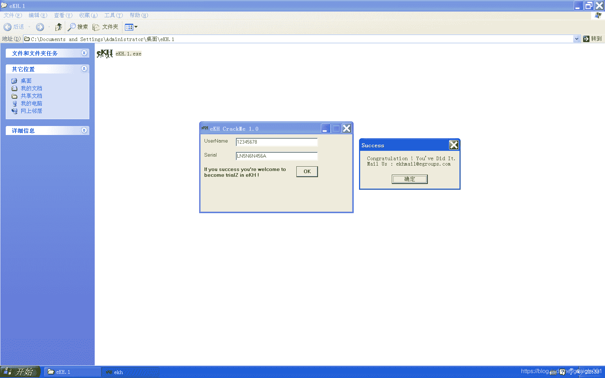

<!--yml
category: crackme160
date: 2022-04-27 18:15:58
-->

# CrackMe160 学习笔记 之 054_一剑名动江湖的博客-CSDN博客

> 来源：[https://blog.csdn.net/guaigle001/article/details/104436707](https://blog.csdn.net/guaigle001/article/details/104436707)

## 前言

做个简单的题目放松一下。



## 思路

直接分析即可。

## 分析

### OK按钮点击事件

```
00427B65  |.  E8 26E2FEFF   call    00415D90                         ;  获取name保存到ebp-4
00427B6A  |.  8B45 FC       mov     eax, dword ptr [ebp-4]
00427B6D  |.  E8 3EBCFDFF   call    004037B0                         ;  获取name长度
00427B72  |.  48            dec     eax                              ;  长度减一
00427B73  |.  7C 30         jl      short 00427BA5                   ;  判断长度是否大于1
00427B75  |.  8D55 FC       lea     edx, dword ptr [ebp-4]
00427B78  |.  8B83 EC010000 mov     eax, dword ptr [ebx+1EC]
00427B7E  |.  E8 0DE2FEFF   call    00415D90                         ;  获取key保存到ebp-4
00427B83  |.  8B45 FC       mov     eax, dword ptr [ebp-4]
00427B86  |.  50            push    eax
00427B87  |.  8D55 F8       lea     edx, dword ptr [ebp-8]
00427B8A  |.  8B83 DC010000 mov     eax, dword ptr [ebx+1DC]
00427B90  |.  E8 FBE1FEFF   call    00415D90                         ;  获取name保存到ebp-8
00427B95  |.  8B45 F8       mov     eax, dword ptr [ebp-8]
00427B98  |.  5A            pop     edx
00427B99  |.  E8 82FEFFFF   call    00427A20                         ;  验证函数
00427B9E  |.  3D 4E61BC00   cmp     eax, 0BC614E
00427BA3  |.  7D 1E         jge     short 00427BC3                   ;  关键跳 
```

### 验证函数

```
00427A59  |.  E8 52BDFDFF   call    004037B0                         ;  返回name长度
00427A5E  |.  8BF0          mov     esi, eax
00427A60  |.  85F6          test    esi, esi
00427A62  |.  7E 3C         jle     short 00427AA0                   ;  长度小于等于0则跳转
00427A64  |.  B8 01000000   mov     eax, 1                           ;  eax = 1
00427A69  |>  8BD0          /mov     edx, eax                        ;  edx 保存计数器值
00427A6B  |.  8B4D FC       |mov     ecx, dword ptr [ebp-4]          ;  取name
00427A6E  |.  0FB64C11 FF   |movzx   ecx, byte ptr [ecx+edx-1]       ;  挨个取name字符
00427A73  |.  03D9          |add     ebx, ecx                        ;  ebx = ebx + ecx
00427A75  |.  71 05         |jno     short 00427A7C                  ;  不溢出跳转
00427A77  |.  E8 B4AFFDFF   |call    00402A30                        ;  只要小于0，就会乘-1，这里应该走不到
00427A7C  |>  C1E3 08       |shl     ebx, 8                          ;  左移8位
00427A7F  |.  8B0D 80884200 |mov     ecx, dword ptr [428880]         ;  eKH_1.004279FC
00427A85  |.  0FB65411 FF   |movzx   edx, byte ptr [ecx+edx-1]       ;  从固定字符串取出字符
00427A8A  |.  0BDA          |or      ebx, edx                        ;  ebx = ebx | edx
00427A8C  |.  85DB          |test    ebx, ebx
00427A8E  |.  7D 0C         |jge     short 00427A9C                  ;  大于等于0则跳转
00427A90  |.  6BD3 FF       |imul    edx, ebx, -1                    ;  edx = ecx * -1
00427A93  |.  71 05         |jno     short 00427A9A
00427A95  |.  E8 96AFFDFF   |call    00402A30
00427A9A  |>  8BDA          |mov     ebx, edx
00427A9C  |>  40            |inc     eax                             ;  指向下一个字符
00427A9D  |.  4E            |dec     esi                             ;  esi为0时结束循环
00427A9E  |.^ 75 C9         \jnz     short 00427A69
00427AA0  |>  81F3 78563412 xor     ebx, 12345678                    ;  ebx = ebx ^ 0x12345678
00427AA6  |.  8D55 F0       lea     edx, dword ptr [ebp-10]
00427AA9  |.  8BC3          mov     eax, ebx
00427AAB  |.  E8 44E9FDFF   call    004063F4                         ;  转成10进制保存到ebp-10中
00427AB0  |.  8B45 F0       mov     eax, dword ptr [ebp-10]
00427AB3  |.  E8 F8BCFDFF   call    004037B0                         ;  返回新字符串的长度
00427AB8  |.  8BF0          mov     esi, eax
00427ABA  |.  85F6          test    esi, esi
00427ABC  |.  7E 38         jle     short 00427AF6                   ;  判断新字符串长度是否小于等于0
00427ABE  |>  8BC3          /mov     eax, ebx                        ;  从ebx取出
00427AC0  |.  B9 0A000000   |mov     ecx, 0A
00427AC5  |.  99            |cdq
00427AC6  |.  F7F9          |idiv    ecx                             ;  除以10
00427AC8  |.  6215 3C7B4200 |bound   edx, qword ptr [427B3C]         ;  edx为除法余数
00427ACE  |.  8A92 84884200 |mov     dl, byte ptr [edx+428884]
00427AD4  |.  8D45 F0       |lea     eax, dword ptr [ebp-10]
00427AD7  |.  E8 FCBBFDFF   |call    004036D8                        ;  转成字符保存到ebp-10中
00427ADC  |.  8B55 F0       |mov     edx, dword ptr [ebp-10]
00427ADF  |.  8D45 F4       |lea     eax, dword ptr [ebp-C]
00427AE2  |.  E8 D1BCFDFF   |call    004037B8                        ;  连接字符串保存到ebp-C中
00427AE7  |.  8BC3          |mov     eax, ebx
00427AE9  |.  B9 0A000000   |mov     ecx, 0A
00427AEE  |.  99            |cdq
00427AEF  |.  F7F9          |idiv    ecx                             ;  除以10
00427AF1  |.  8BD8          |mov     ebx, eax                        ;  保存到ebx中
00427AF3  |.  4E            |dec     esi                             ;  计数器减一
00427AF4  |.^ 75 C8         \jnz     short 00427ABE
00427AF6  |>  8B45 F4       mov     eax, dword ptr [ebp-C]
00427AF9  |.  8B55 F8       mov     edx, dword ptr [ebp-8]
00427AFC  |.  E8 BFBDFDFF   call    004038C0                         ;  字符串比较函数 
```

## 注册机代码

```
 #include<stdio.h>
int main()
{
  char* name;
  char* s="LANNYDIBANDINGINANAKEKHYANGNGENTOT";
  char* t="LANNY5646521";
  int len=0;
  unsigned int ebx=0;
  printf("name:");
  scanf("%[^\n]",name);
  if((len=strlen(name))<=0)
    return 0;
  for(int i=0;i<len;i++)
    {
      ebx+=name[i];
      ebx<<=8;
      ebx|=s[i];
      if(ebx>=0x80000000)
        ebx*=-1;
    }
  ebx^=0x12345678;
  sprintf(name,"%d",ebx);
  len=strlen(name);
  printf("key:");
  for(int i=0;i<len;i++)
    {
      printf("%c",t[ebx%10]);
      ebx/=10;
    }
  return 0;
} 
```