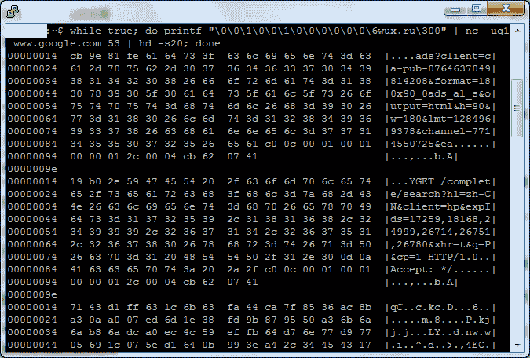

<!--yml
category: 防火墙
date: 2026-06-12 19:02:27
-->

# GFW考古：gfw-looking-glass.sh

> 来源：[https://gfw.report/blog/gfw_looking_glass/zh/](https://gfw.report/blog/gfw_looking_glass/zh/)

我近日被[@gfwrev](https://twitter.com/gfwrev)所写的[一行脚本](https://twitter.com/gfwrev/status/25220534979)深深吸引。尽管它已经失效，但它所流露出来的创意与美感仍值得被记录。

这行名为`gfw-looking-glass.sh`的脚本如下：

```
while true; do printf "\0\0\1\0\0\1\0\0\0\0\0\0\6wux.ru\300" | nc -uq1 $SOME_IP 53 | hd -s20; done 
```

如下图所示，它可以被用来[打印出GFW内存中的某一部分](https://twitter.com/gfwrev/status/25222642896)。这是怎么做到的呢?



## nc

`nc -uq1 $SOME_IP 53` 会把在stdin收到的信息以UDP包的形式发送给`$SOME_IP`的53端口。如@gfwrev所[解释](https://twitter.com/gfwrev/status/25221199247)的，`$SOME_IP`可以是满足以下两个条件的任何IP地址：1）**不会**回应发送到其53端口的任何信息；2）在防火长城的另一面（比如，如果从中国发送，目的地IP地址则需是在外国）。条件1确保任何回复均伪造自GFW，而非目的IP；条件2确保你精心准备的DNS请求会被GFW看到。

## 背景介绍

一点点有关DNS格式和DNS压缩指针的介绍对理解这个漏洞利用很有帮助。

#### DNS通用格式

下图是DNS请求和回复的通用格式：

```
 0                   1                   2                   3
 0 1 2 3 4 5 6 7 8 9 0 1 2 3 4 5 6 7 8 9 0 1 2 3 4 5 6 7 8 9 0 1
+-+-+-+-+-+-+-+-+-+-+-+-+-+-+-+-+-+-+-+-+-+-+-+-+-+-+-+-+-+-+-+-+
|         Identification        |              flags            |
+-+-+-+-+-+-+-+-+-+-+-+-+-+-+-+-+-+-+-+-+-+-+-+-+-+-+-+-+-+-+-+-+
|      number of questions      |      number of answer RRs     |
+-+-+-+-+-+-+-+-+-+-+-+-+-+-+-+-+-+-+-+-+-+-+-+-+-+-+-+-+-+-+-+-+
|     number of authority RRs   |    number of additional RRs   |
+-+-+-+-+-+-+-+-+-+-+-+-+-+-+-+-+-+-+-+-+-+-+-+-+-+-+-+-+-+-+-+-+
|                            questions                          |
+-+-+-+-+-+-+-+-+-+-+-+-+-+-+-+-+-+-+-+-+-+-+-+-+-+-+-+-+-+-+-+-+
|                 answers(varaible number of RRs)               |
+-+-+-+-+-+-+-+-+-+-+-+-+-+-+-+-+-+-+-+-+-+-+-+-+-+-+-+-+-+-+-+-+
|                anthority(varaible number of RRs)              |
+-+-+-+-+-+-+-+-+-+-+-+-+-+-+-+-+-+-+-+-+-+-+-+-+-+-+-+-+-+-+-+-+
|         additional information(varaible number of RRs)        |
+-+-+-+-+-+-+-+-+-+-+-+-+-+-+-+-+-+-+-+-+-+-+-+-+-+-+-+-+-+-+-+-+ 
```

#### Questions栏格式

以下是Questions栏展开后的样子：

```
 0                   1
 0 1 2 3 4 5 6 7 8 9 0 1 2 3 4 5
+-+-+-+-+-+-+-+-+-+-+-+-+-+-+-+-+
|           query name          |
\                               \
|                               |
+-+-+-+-+-+-+-+-+-+-+-+-+-+-+-+-+
|           query type          |
+-+-+-+-+-+-+-+-+-+-+-+-+-+-+-+-+
|           query class         |
+-+-+-+-+-+-+-+-+-+-+-+-+-+-+-+-+ 
```

#### Query Name栏格式

当查询域名为`www.google.com`时，它可以被以下格式所表示：

```
 0                   1
 0 1 2 3 4 5 6 7 8 9 0 1 2 3 4 5
+-+-+-+-+-+-+-+-+-+-+-+-+-+-+-+-+
|3| www |6|   google  |3| com |0|
+-+-+-+-+-+-+-+-+-+-+-+-+-+-+-+-+ 
```

一个使用[压缩指针](https://www.freesoft.org/CIE/RFC/1035/43.htm)的例子如下：

```
 0                   1
 0 1 2 3 4 5 6 7 8 9 0 1 2 3 4 5 6 7 8 9
+-+-+-+-+-+-+-+-+-+-+-+-+-+-+-+-+-+-+-+-+
|3|  www|1|1|           offset          |
+-+-+-+-+-+-+-+-+-+-+-+-+-+-+-+-+-+-+-+-+ 
```

我们可以看到`www`后跟随着一个两字节的指针。这个指针的两个最高位为1，剩下的14位代表offset。当offset == n时，它指向整个DNS请求的n字节。

## 对精心准备的DNS请求的解释

我们现在来看一看这个精心准备好的DNS请求：

```
printf "\0\0\1\0\0\1\0\0\0\0\0\0\6wux.ru\300" | xxd -b -c 4 
```

```
00000000: 00000000 00000000 00000001 00000000  ....
00000004: 00000000 00000001 00000000 00000000  ....
00000008: 00000000 00000000 00000000 00000000  ....
0000000c: 00000110 01110111 01110101 01111000  .wux
00000010: 00101110 01110010 01110101 11000000  .ru. 
```

其前12字节和通常的DNS请求相同：

*   ID=0;
*   Recursion Desired Flag is set;
*   questions 数量 = 1;
*   answer RRs 数量 = 0;
*   authority RRs 数量 = 0;
*   additional RRs 数量 = 0.

最有意思的部分在第12到19字节。

起初我以为`\6wux.ru`是作者笔误，应为`\3wux\2ru`。但后来意识到，`\6wux.ru`是作者故意为之，旨在同时演示GFW是如何处理查询域名的。具体来讲，虽然`\6wux.ru`不符合协议格式，但却仍和符合格式的`\3wux\2ru`一样，可以触发GFW的审查。这说明[“GFW实际上是先将域名转换为字符串进行匹配的”](https://gfwrev.blogspot.com/2009/11/gfwdns.html)。

如背景介绍中所述，一个指针占两个字节。而我们准备的DNS查询包中的指针只有一个字节。这个缺了一半的指针导致GFW将在内存中的下一个字节当作指针offset的一部分。我们可以知道这个offset的可能值为`0`到`2^8-1`。当offset大于整个DNS查询包的长度时，GFW会跳出查询包，并将内存中的某一部分当作域名的一部分。GFW似乎并没有检查offset已经大于整个DNS查询包的长度的情况。

现在GFW已经把其一部分内存中的内容当作查询域名的一部分，我们要做的就是触发GFW以得到包含查询域名的伪造的DNS应答包。@gfwrev在此使用了`wux.ru` 作为`kw{rnd}`类关键词。关键词的匹配模式已经被总结在[这篇论文](https://www.usenix.org/system/files/conference/foci14/foci14-anonymous.pdf#page=5)的Table 2 (b)中。

## 对GFW伪造的DNS应答包的解释

收到DNS应答后，`hd -s20`会帮我们截去应答包的前20个字节。这前20字节包括了12字节的各种项，以及questions栏的前8个字节：`\6wux.ru\300`。

留下的部分则包含两项：1) GFW内存中的内容 2) 和紧随其后的answers栏。以截图中第一个hexdump举例，其中的2）answers栏为：

```
c0 0c 00 01 00 01 00 00 01 2c 00 04 cb 62 07 41 
```

*   `c0 0c` 代表域名。它实际上是一个指向查询域名栏开头部分的指针。
*   `00 01` 和 `00 01` 分别代表回应类型为A（IPv4地址的意思），回应class类型为IN。这很有意思因为在那个`gfw-looking-glass.sh`还能用的年代，GFW伪造的[一型DNS应答包](https://gfwrev.blogspot.com/2009/11/gfwdns.html)不管查询类型或查询class类型为何，都会把回应类型设置为A，回应class类型设置为IN。
*   `00 00 01 2c` 代表DNS TTL为300秒。
*   `00 04` 代表数据长度为4字节。
*   `cb 62 07 41` 是伪造的IP地址：`203.98.7.65`。

除去以上answers栏中字节，我们就得到了GFW内存中的内容。

截屏中的几个应答包questions栏长度很有意思。以截图中第一个应答包为例，questions起始于8个字节`\6wux.ru\300`，并跟随着122字节的GFW内存中的内容：`cb 9e ... 65 61`。截图中的两个独立的应答包的questions栏均有130字节。考虑到其不同于域名的最大长度256字节和被`.`分割的每个子域名的最大长度63字节，我们猜测130字节可能是GFW的人为限定。

## 备注

*   **gfw-looking-glass.sh 之后的故事** @gfwrev在2014年的11月[发现](https://twitter.com/gfwrev/status/533564218113789952)GFW “再也不认真处理DNS域名压缩指针了”。@gfwrev因此[想出了一系列利用压缩指针绕过DNS审查的新方法](https://gist.github.com/klzgrad/f124065c0616022b65e5)。其测试结果显示截止2014年11月，V2EX和Google的DNS服务器可以成功处理包含压缩指针的DNS查询。

*   **为什么要用不完整的指针?** 一个很容易引起的好奇是我们能否自己指定offset来控制要观察的GFW内存的相对位置。随着GFW不再处理DNS压缩指针，除非有更多的证据出土，这一问题的历史真相已不得而知。

*   **kw{rnd} like keywords** GFW Report在2020年3月测试了几个之前已知的`kw{rnd}`类型的关键词，但它们都无法触发GFW的审查了。

*   **关于130字节的人为限定的猜测** 在2020年3月，GFW可以处理和审查最大长度（256字节）的DNS请求。测试方法如下：

```
dig $(python -c "print( 'a.'*121 + 'twitter.com')") @"$SOME_IP" 
```

## 贡献

GFW Report未在此工作的任何阶段中作出任何贡献。一切贡献、成果均来自[@gfwrev](https://twitter.com/gfwrev)。

## 联系

这篇报告首发于[GFW Report](https://gfw.report/blog/gfw_looking_glass/zh/)。我们还在[net4people](https://github.com/net4people/bbs/issues/25)和[ntc.party](https://ntc.party/t/gfw-archaeology-gfw-looking-glass-sh/394)同步更新了这篇报告。

我们鼓励您公开地或私下地分享与报告中的发现和假设相关的问题、评论或证据。我们私下的联系方式可见[GFW Report](https://gfw.report)的页脚。

* * *