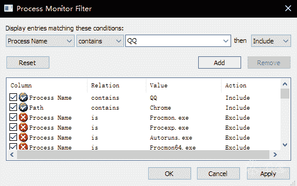

<!--yml
category: 社会工程
date: 2022-11-10 10:30:36
-->

# QQ在窥探我们的隐私，真的是这样的吗？-FancyPig's blog

> 来源：[https://www.iculture.cc/sg/pig=274](https://www.iculture.cc/sg/pig=274)

# 关于QQ读取Chrome历史记录的澄清

本文仅作为参考，不针对任何企业。

## 前言

之前看到群里有人说QQ会读取Chrome的历史记录，而且还被火绒的自定义规则拦截了，到底是真是假呢？

## 正文

尝试验证一下，下面附验证的整个过程。

打开虚拟机，装好QQ和Chrome，然后打开Process Monitor Filter。使用规则简单的过滤下。

果然看到了读取AppData\Local\Google\Chrome\User Data\Default\History等目录的操作。

而且时间也是恰到好处的十分钟。

这是实锤了QQ和Chrome过不去啊，这我可不信，把规则去掉，重新翻了一下才发现果然是冤枉QQ了啊。

受害人之多令人震惊，仔细一看，这玩意是遍历了`Appdata\Local\`下的所有文件夹，然后加上`User Data\Default\History`去读啊。`User Data\Default\History`是谷歌系浏览器（火狐等浏览器不熟，不清楚目录如何）默认的历史纪录存放位置，Chrome中枪也就很正常了。

然后就该研究研究QQ为啥要这么干了，读取到的浏览器历史记录又拿来干啥了呢？

挂上x32dbg，动态调试找到位置。

然后去IDA里直接反编译出来，如下（位置在AppUtil.dll中 .text:510EFB98 附近）

这一段的逻辑还是很好看懂的，先读取各种 User Data\Default\History 文件，读到了就复制到Temp目录下的temphis.db。回去看下Procmom，果然没错。

再之后的操作就简单了，SQLite读取数据库，然后`select url from urls`，这是在干什么大家都懂哈。后面就不接着讲了，有兴趣的可以自己接着看。

结论，QQ并不是特意读取Chrome的历史记录的，而是会试图读取电脑里所有谷歌系浏览器的历史记录并提取链接，确认会中招的浏览器包括但不限于Chrome、Chromium、360极速、360安全、猎豹、2345等浏览器。

晚上来编辑一下，刚才去试了下TIM，果然经典重现，而且比QQ还离谱，不多说直接上图。

## 总结

### 影响范围

*   QQ Windows 9.0.4(发布于2018/06/15)之后的版本 (thx: @ddsfeng #315)
*   TIM Windows 3.1.0(发布于2020/07/29)之后的版本

### 具体行为

1.  登录10分钟之后，读取浏览器浏览历史

    *   读取 `%LocalAppData%` 目录下所有基于Chromium的浏览器历史记录；
    *   读取IE历史(FindFirstUrlCacheEntryW)
2.  对读取到的url进行md5，并在本地进行比较
3.  md5匹配的情况下，上传相应分组ID（主要为电商、股票等关键词）

    *   第三个字符串应为 `uland.taobao.com/sem/tbsearch?` (来自知乎用户Harrion)

### 事件进展

*   目前，QQ 9.4.2 (发布于2021/01/17 20:32)移除了相应代码，暂停了侵害行为
*   目前，TIM 3.3.0 (发布于2021/01/17 21:39)移除了相应代码，暂停了侵害行为

## 参考原文

[《关于QQ读取Chrome历史记录的澄清 》](https://www.iculture.cc/?golink=aHR0cHM6Ly9iYnMucGVkaXkuY29tL3RocmVhZC0yNjUzNTkuaHRt)