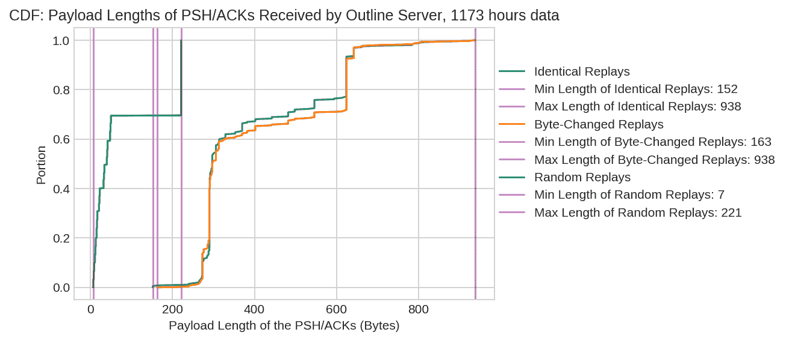
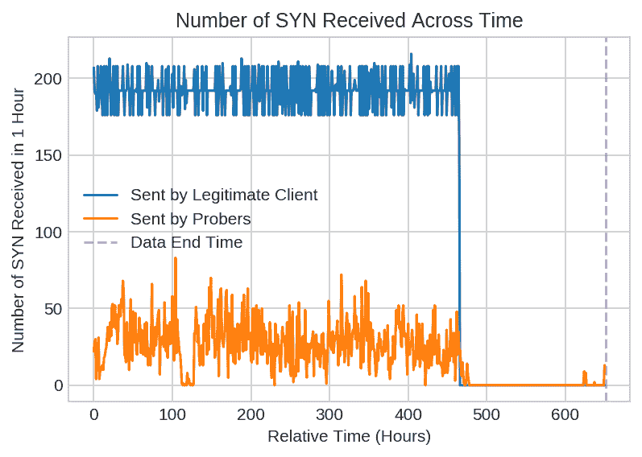
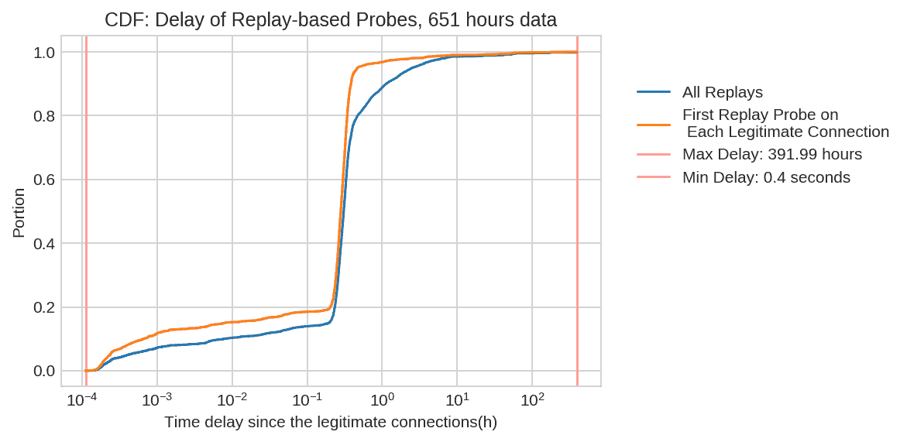
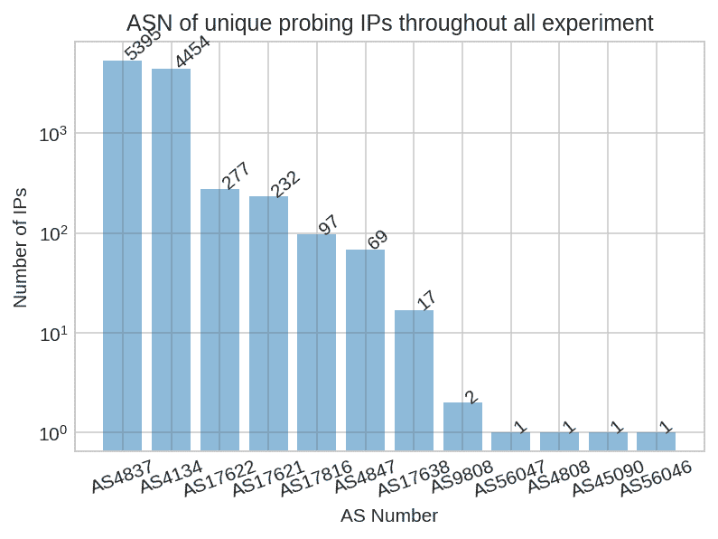
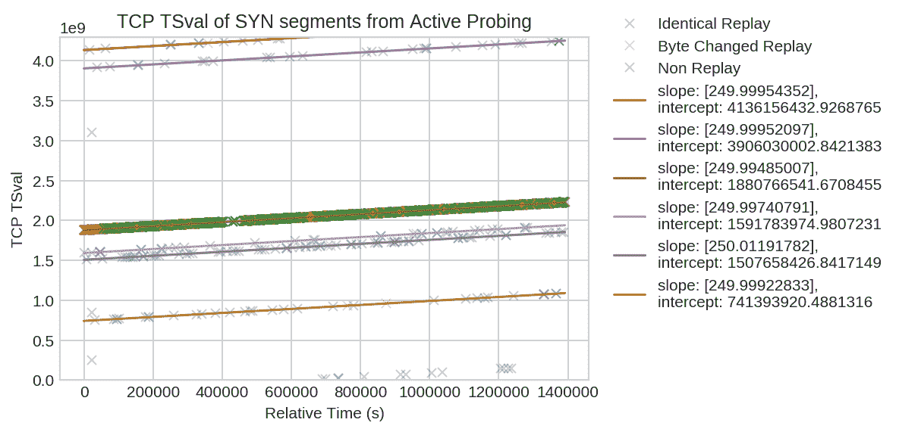
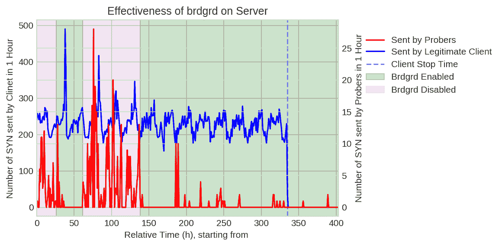

<!--yml
category: 防火墙
date: 2026-06-12 19:02:37
-->

# Shadowsocks 是如何被检测和封锁的

> 来源：[https://gfw.report/blog/gfw_shadowsocks/zh/](https://gfw.report/blog/gfw_shadowsocks/zh/)

在中国，[*Shadowsocks*](https://shadowsocks.org/en/) 是最流行的翻墙软件之一。从2019年5月起，大量的中国网民反馈他们的Shadowsocks服务器被封锁了。这篇报告是我们对中国的防火长城（GFW）是如何检测和封锁Shadowsocks及其衍生翻墙软件的初步调查结果。通过网络测量实验，我们发现GFW会**被动的监视网络流量**从而识别出疑似Shadowsocks的网络流量；然后对对应的Shadowscoks服务器进行**主动探测**已验证其怀疑的正确与否。Shadowscoks的封锁程度可能受**人为因素**在政治敏感时期的控制。我们提出一种**规避方法**，即改变网络数据包在Shadowsocks握手阶段的大小。这种方法被证明可以在现阶段有效减少主动探测。我们会继续与开发者合作让Shadowsocks及其衍生工具变得更加难以封锁。

## 主要发现

*   防火长城（GFW）已经启用主动探测的手段来识别Shadowsocks服务器。GFW采用被动监测与主动探测相结合的方式：其首先监测网络连接找出疑似Shadowsocks的连接，然后再把自己伪装成一个客户端，尝试对疑似Shadowsocks的服务器进行连接，从而验证自己的猜测。[*我们知道GFW可以对多种翻墙工具进行主动探测*](https://ensa.fi/active-probing/)，现在Shadowsocks也成了其中一员。
*   主动探测系统可以发送多种不同类型的探测。其中一些探测是基于对之前合法客户端建立的连接的**重放**；而另一些探测则似乎与之前的合法连接并不相关。
*   如同之前的研究发现，主动探测来自**大量不同的源IP地址**。这使得基于源IP来过滤GFW探测包不太可行。亦如之前的研究发现，网络层面的侧通道显示这些来自数以千计的IP地址的主动探测并非完全相互独立，而是源于GFW的集中控制。
*   很少量的（大于13个）合法连接即足以触发对于Shadowsocks服务器的主动探测。只要合法客户端还在使用服务器，主动探测就会持续下去。GFW通常在合法连接到达服务器后的数秒内发送第一个主动探测。
*   一旦GFW主动识别出Shadowsocks服务器，GFW可能会丢弃所有发送自服务器IP地址，或服务器Shadowsocks端口的数据包。但GFW也可能不立即采取封锁措施。Shadowsocks的封锁程度可能受人为因素在政治敏感时期的控制。
*   GFW的被动监测模块至少会根据网络数据包的长度来怀疑可疑流量。改变数据包的长度，比如所在服务端安装[*brdgrd*](https://github.com/NullHypothesis/brdgrd)，即可通过干扰被动监测模块对Shadowsocks流量的识别，进而显著减少主动探测的数量。

## 我们怎么知道的？

我们在境外搭建了自己的Shadowsocks服务器并从中国用客户端连接它们，与此同时，在服务器和客户端两端抓包进行分析。所有的实验都是在2019年7月5号到2019年11月11号之间进行的。其中的绝大部分实验都是在[*2019年9月16日开始的一次大规模封锁*](https://github.com/net4people/bbs/issues/16)后进行的。

在绝大部分实验中，我们使用了[*shadowsocks-libev*](https://github.com/shadowsocks/shadowsocks-libev) [*v3.3.1*](https://github.com/shadowsocks/shadowsocks-libev/tree/v3.3.1)作为客户端和服务端，因为它是一个被积极维护且具有代表性的Shadowsocks实现。我们相信我们所发现的这些弱点在其他Shadowsocks及其衍生工具，如[*Outline VPN*](https://getoutline.org/)，中同样存在。

若非明确指出，我们未对任何实验中的客户端及服务器的网络功能进行修改，比如更改防火墙的设置。Shadowsocks可以使用不同的加密设置，我们对[*Stream ciphers*](https://shadowsocks.org/en/spec/Stream-Ciphers.html)和[*AEAD ciphers*](https://shadowsocks.org/en/spec/AEAD-Ciphers.html)都进行了测试。

## 主动探测的一些细节

Shadowsocks是一项加密通讯协议，其数据包的内容被设计得（应）不包含任何固定特征。其两种加密模式都基于一个主密码，两种模式分别为：[*Stream*](https://shadowsocks.org/en/spec/Stream-Ciphers.html)(不推荐使用)和 [*AEAD*](https://shadowsocks.org/en/spec/AEAD-Ciphers.html)(推荐)。这两种加密模式虽都要求客户端事先知道主密码；但是Stream加密模式的服务器仅能对客户端进行较弱的验证。除非使用额外的技术手段，两种模式都不能防御对之前发送过的验证数据包的重放攻击。

### 主动探测的类型及审查者意图

我们目前观察到五种不同的主动探测荷载。

基于重放的探测：

1.  重放某一合法连接中第一个携带数据的数据包中的荷载。
2.  重放某一合法连接中第一个携带数据的数据包中的荷载，但更改第0字节。
3.  重放某一合法连接中第一个携带数据的数据包中的荷载，但更改第0–7和第62–63字节。

看似随机的探测（并非基于我们所观察到的合法连接）：

4.  荷载长度为7到50字节，占所有看似随机的主动探测的70%。
5.  荷载长度为221字节，占所有看似随机的主动探测的30%。

我们怀疑GFW的主动探测系统根据服务器对这几种不同类型的主动探测的反馈来判定其是否为Shadowsocks服务器。

Shadowsocks-libev有一个[*重放过滤器*](https://github.com/shadowsocks/shadowsocks-org/issues/44); 但是大多数的Shadowsocks实现则没有。重放过滤器可以防御一模一样的重放（类型1），如果载荷的最初几字节被改变了（类型2和3）那么过滤器就无法防御了。过滤器本身也不够阻止主动探测模块去比较服务器对多种探测的反应。

### 多少次合法连接就能触发主动探测

对主动探测的触发似乎需要达到一定的阀值。比如在一项实验中，仅仅13次连接就足以引起GFW的怀疑并触发主动探测。初步结果显示，使用了AEAD的Shadowsocks，可能需要稍微多一点点的连接才会触发主动探测。

### 合法连接与主动探测的关系

我们让客服端每5分钟对Shadowsocks服务器进行16次连接。虽然我们的服务器触发了大量的主动探测，但不知为何，其并未被GFW封锁。

上图显示在客户端与服务器有通讯的时间里，服务器会收到主动探测。当合法客户端与服务器的通讯停止下来后，大部分的主动探测也停了。值得指出的是，每小时中主动探测的数量并非固定值，与合法客服端的连接数目比也并非1:1。

### 主动探测的延迟性

GFW的主动探测系统可以将合法连接的载荷保存下来，然后延迟一段时间再发起一个新的连接进行重放。下图显示了合法连接与重放攻击之间的延时关系。由于一个合法的载荷可能被多次重放（某一次实验中观察到的最大值为47次），我们呈现两组关系：桔黄色的线代表基于一个合法载荷的第一次重放；蓝色的线代表所有基于重放的探测（不限定为第一次）。

结果显示多于90%的重放攻击发生在合法连接发送后的一小时之内。观察到的最短的延迟仅有0.4秒，而最长延迟竟有大约400小时。

### 主动探测的源

我们在目前所有实验中总计观察到3,5477次主动探测。它们来自1,0547个不同的IP地址，IP地址均属于中国。

**源自治系统**。主动探测来源占比最多的两个自治系统 AS 4837 (CHINA169-BACKBONE CNCGROUP China169 Backbone,CN) 和 AS 4134 (CHINANET-BACKBONE No.31,Jin-rong Street,CN)，分别为中国联通和中国电信的主干网。这一结果与之前对[*主动探测的研究*](https://ensa.fi/active-probing/imc2015.pdf#page=8)一致。

**中心化结构**。尽管这些主动探测来源于上千个不同的IP地址，有迹象显示它们的行为均受到一小撮进程的集中管控。下图显示了每个主动探测的SYN包所携带的[*TCP timestamp*](https://tools.ietf.org/html/rfc7323#section-3)值。TCP timestamp是一个32位的计数器，其以固定的速度进行增长。其不是一个绝对值，而是一个取决于TCP实现和系统上次重启时间的相对值。下图显示这些来源于上千个独立的IP地址的主动探测，共享着很少量的TCP timestamp序列。在这次实验中，至少观察到9个不同的物理系统或进程，而绝大多数主动探测似乎来源于同一进程。我们说“至少”和“似乎”是因为如果两个或以上的独立进程的截距非常相近，那么我们可能把它们误认为一个进程。序列的斜率显示timestamp的增长速度为250HZ。

## 如何规避针对Shadowsocks的封锁？

GFW对于Shadowsocks的检测需要两步：

1.  第一步，被动监测并识别疑似Shadowsocks的连接。
2.  第二步，主动探测疑似Shadowsocks的服务器。

因此，为避免封锁，我们可以（1）设法避免被监测模块怀疑到，或者（2）让服务器以不被怀疑的方式回应主动探测。我们将展示如何通过安装改变数据包大小的软件来达到目标（1）。

[*Brdgrd*](https://github.com/NullHypothesis/brdgrd) 是一款可以被安装在Shadowsocks服务器上，从而导致Shadowsocks客服端发送较小的数据包的软件。它设计之初衷是用来干扰GFW识别Tor节点，因为它迫使GFW在检测之前首先对TCP流进行复杂的重组。但这里我们利用它可以改变从客户端到服务器的数据包大小的功能。改变数据包的大小可以干扰流量识别环节，从而在极大程度上缓解主动探测。

上图显示了一个受到主动探测的Shadowsocks服务器，在开启brdgrd后的数小时内不再收到主动探测。而当我们关闭brdgrd，主动探测立刻继续。我们第二次开启brdgrd，主动探测在之后的40小时里完全停止，但之后又有些许主动探测。

另一组实验显示，在第一次运行Shadowoscks之初就启用brdgrd也许更加的有效。

Brdgrd的原理是将TCP Window Size改写为一个小得罕见的值。因此，审查者可能可以检测出brdgrd被使用了。因此，尽管brdgrd可以在现阶段有效的减少主动探测，其不能被看作是一个一劳永逸的解决方案。

## 尚未解决的问题

尽管我们已经清楚GFW会主动探测Shadowsocks服务器，我们仍不清楚主动探测与Shadowsocks服务器被封之间的关系。我们有33组Shadowsocks服务器分布于世界各地。尽管它们中的大多数都遭受到了大量的主动探测，但是仅有3台服务器被封锁。更有趣的是，其中一台被封锁的服务器只被使用了很短的一段时间，因此受到的主动探测数量应该比很多未被封锁的服务器要少得多。

我们提出3种假设试图解释这一有趣的现象：

*   Shadowsocks服务器的封锁是由人为的因素控制的。也就是说，GFW也许维护了一份在不同程度上被怀疑为Shadowsocks服务器的清单，然后根据人工因素来决定对服务器进行封锁还是解封。这一假设可以解释为什么更多的服务器是在政治敏感时期被封锁的。

*   另一个假设是GFW的主动探测对于一些我们实验采用的Shadowsocks实现无效。确实，我们被封锁的那3台服务器都是使用了与其他实验中的Shadowsocks不同的实现。如果GFW是根据某些Shadowsocks服务器实现对主动探测的特有反应来识别判断的话，那么这一假设更有可能为真。

*   第三个假设是对于Shadowsocks的封锁在地理上存在着不一致性。我们被封锁的那3台服务器所在的数据中心不同于其他大多数实验，使用的客服端也是位于一般的居民网络，而非数据中心。如果GFW更注意属于某些数据中心的IP地址，抑或更注意来自一般居民网络的客户端连接，那么这一假设更有可能为真。

## 致谢

我们想在此感谢以下人员对此主题的讨论和研究：

*   Shadowsocks-libev的开发者们
*   Vinicius Fortuna以及来自Jigsaw的Outline VPN开发者们
*   Eric Wustrow以及其他多名来自科罗拉多大学博尔德分校的研究人员

## 联系我们

这篇报告首发于[GFW Report](https://gfw.report/blog/gfw_shadowsocks/zh.html)。我们还在[net4people](https://github.com/net4people/bbs/issues/22)和[ntc.party](https://ntc.party/t/how-china-detects-and-blocks-shadowsocks/289)同步更新了这篇报告。

我们鼓励您公开地或私下地分享与报告中的发现和假设相关的问题、评论或证据。我们私下的联系方式可见[GFW Report](https://gfw.report/)的页脚。

* * *