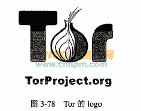
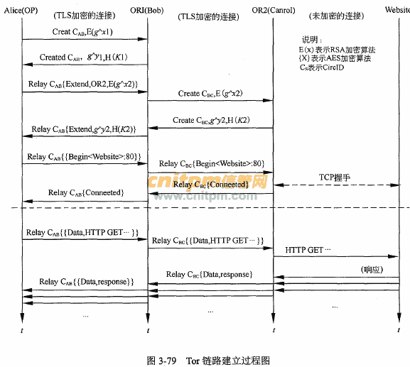

<!--yml
category: 暗网
date: 2022-11-04 11:36:40
-->

# Tor简介-信息安全工程师知识点 - 综合知识 - 信管网

> 来源：[https://www.cnitpm.com/pm1/63833.html](https://www.cnitpm.com/pm1/63833.html)

****信息安全工****程师****知识****点：******Tor简介**

Tor(TheOnionRouter)或许不是网络罩名访问的唯一手段，但毫无疑问它是目前最流行、最受开发者欢迎的。这个免费、开源的程序可以给网络流量进行三重加密，并将用户流量在世界各地的电脑终端里跳跃传递，这样就很难去追踪它的来源。大部分的Tor用户只把它作为一个匿名浏览网页的工具，不过实际上它潜力十足：Tor软件可以在操作系统后台运行，创建一个代理链接将用户连接到Tor网络。随着越来越多的软件甚至操作系统都开始允许用户选择通过Tor 链接发送所有流量，这使得你几乎可以用任何类型的在线服务来掩盖自己的身份。

Tor是第二代洋葱路由(onionrouting)的一种实现，用户通过Tor可以在因特网上进行匿名交流。

流量分析是一种主要的网络的监视行为。Tor是一个能够抵御流量分析的软件项目。Tor将通信信息通过一个由遍及全球的志愿者运行的中继(relay)所组成的分布式网络转发，以此来保护信息的安全。Tor在传输数据时封包不但经过加密，传输过程中会经过哪些路由也是随机的，因此不但很难追踪，也不易得知通信的内容。Tor能与现有的许多应用程序配合工作，包括Web浏览器、即时通信客户端、远程登录和基于TCP协议的其他应用程序。

洋葱、代理(OnionProxy，OP)使用源路由方式随机选择洋葱、路由器( OnionRouter,OR)组成匿名传输路径，将后面路径的数据和地址一间加密作为前段路径IP包的载荷进行传送，并且每个洋葱路由器只和柏邻的洋葱路由器通信并传输数据，这样就能有效隐藏了目的节点。当用户有匿名需求，通过OP从目录服务器下载Tor网络状态信息。然后会根据得到的洋葱路由，构建一条转发路径。每个洋葱路由器担任传输中继，而且这些洋葱路由只和相邻的洋葱路由进行通信并传输数据。

如图3-79，假定Alice是我们的OP(客户端)，通过Tor随机选择一个Tor匿名网络中的路由器作为Tor网络的接入点并且与这个路由器进行短期的国话密钥协商，然后逐跳扩展匿名链路，直到到达目标点。

在连接的建立阶段，是由消息的发送者的洋葱代理路由器OP来选择创建整条匿名路径的。客户端通过OP选择一条通过网络的路径并构造一个环路(circuit，虚拟环路)。在这个环路里每一个在路径上OR(洋葱路由器)知道它的前序节点和后序节点，但是不知道在环路里的任意的其他节点。客户端的OP首先根据目录服务器中获得所有OR的信息，按照预定的算法选择一个路由节点加入通信线路，使用Diffie-Hellman握手协商通信对称密钥建立通信链路，以及对通信数据加密。

在新的虚拟电路建立过程中，用户的OP会以每次一跳的进度，递增的构建线路，图3-79即为Tor建立一个新的通信虚拟电路的过程，用户的OP(Alice)在选定的路径中发送一个createdcell到第一个中继路由节点(Bob)，并标志以一个新的链路编号CirCIDCAB。这个createdcell的负载包括Diffie-Hellman握手(gx)的前一半，用那个OR(Bob)的洋葱密钥来加密。Bob以一个包括gy和协商密钥的晗希K=gxy的已建立单元回应。一旦线路被建立起来， Alice和Bob可以互相发送以协商密钥加密的转播单元。为了将线路扩震，Alice发送一个转发扩展单元给Bob，指明下一个OR(Carol)的地址和给她的加密过的gx2。Bob复制半个握手到建立单元，并发送给Carol来扩展电路，并将此线路赋以新的circIDCBC。Alice无须知道这个circID; Bob只使用CAB和Alice连接，只使用CBC和Carol连接。当Carol回应一个己建立单元后， Bob将负载打包为转播己扩展单元并把它传给Alice。现在线路己经扩展到Carol，而且Alice 和Carol共享一个共同的密钥K=gx1y2。Alice只需按照上面的步骤并告诉线路中的最后一个节点再扩展一跳，就可以将线路扩展到第三个节点。

虚拟电路的建立是在Tor初始化运行环境的基础上，生成用来确定身份信息和加密传输数据的公钥，即所需要的身份密钥和洋葱密钥，首先选取入口路由节点建立M连接，继而根据目前己知的路由节点扩展转发节点链路，完成中继路由节点的随机选择，OP节点通过己建立的信道，继续将连接拓展至其他的OR节点，直至扩展最后一跳路由节点，作为退出节点，建立一条多层加密信道。

Tor浏览器是非盈利性质的Tor项目开发的一款免费应用。它是火狐浏览器的安全强化版，可以把你所有的网络流量都通过Tor的匿名网络加密。得益于三重加密系统和让流量在全球的电脑上传递， Tor浏览器可能是最接近真正的网络匿名的工具。

想发送匿名邮件?最简单的方法是使用Tor浏览器的电子邮件服务。不过首先你需要在TorMail申请一个新邮箱(该服务己于2013年8月10日下线)。不同于其他需要提供手机号码才能申请的邮箱(比如Gmail)，申请Tor邮箱无须提供任何个人信息。还有一款一次性的电子邮件服务GuerrillaMail。只需轻轻一点，你就可以建立一个新的、随机生成的邮箱。如果和Tor浏览器结合使用则效果拔群:没人(包括GuerrillaMail本身)能通过这个临时邮箱追踪到你的IP地址。然而对电子邮件进行信息加密可不是件容易的事。用户通常需要通过复制和粘贴来把信息弄进文本框，然后还要使用PGP(PrettyGoodPrivacy，一个隐私保护程序)来加密和解密。为了避免这一麻烦，可以使用有隐私保护的邮件服务商，比如Riseup.net，或者使用Mozilla开发的邮件程序Thunderbird、隐私插件Enigmail 或者可以通过Tor 发送信息的插件TorBirdy。Adium和Pidgin是Mac以及Windows上最常用的支持加密协议OTR的即时通讯客户端， Tor也同样支持该软件。不过Tor现在正在打造一款更安全的匿名即时通信软件， InstantBird。

GoogleDrive和Dropbox在用户隐私方面做得并不好，而Onionshare是一个可以让任何人通过Tor传送大文件的开源软件。当你使用它时，程序会通过"Tor隐藏服务(TorHiddenService)" ，创建一个本地的、临时的匿名网站。文件接收方需要得到一个以.onion为后缀的文件地址，然后就可以通过Tor浏览器安全、匿名地下载文件了。

手机以及平板电脑上的匿名工具开发还远远落后于电脑，不过它们正在迎头赶上。"守卫项目(TheGuardianProject) "开发了一个叫Orbot的App，能在Android系统上使用τor了。手机上的浏览器、电子邮件和信息都能通过Orbot设置成使用Tor代理。iOS设备目前还没有这类服务。不过iOS的应用程序商店里有Onion浏览器，这可以帮助iPhone和iPad用户匿名访问网络。Tor的开发者逐步修补了一些程序漏洞，不过目前该App还不完善，山特维克建议用户再等待一段时间。实际上她建议敏感用户应当坚持使用更成熟的Tor桌面端服务"如果我需要重名，那么我可不会去考虑手机平台"。

即使使用Tor软件来在互联网中变身"黑影人"电脑仍然会有少量信息泄露到网上。美国国家安全局甚至可以从未加密的Windows错误信息来辨别、追踪用户。攻击者也能通过访问的网页来攻击电脑，突破浏览器，并发送未受保护的信息来暴露用户的位置。而基于Tor匿名网络的Whonix操作系统会在本地创建多重虚拟主机，作为真实主机的映像，任何试图攻破计算机的攻击者将会被限制在虚拟主就中。