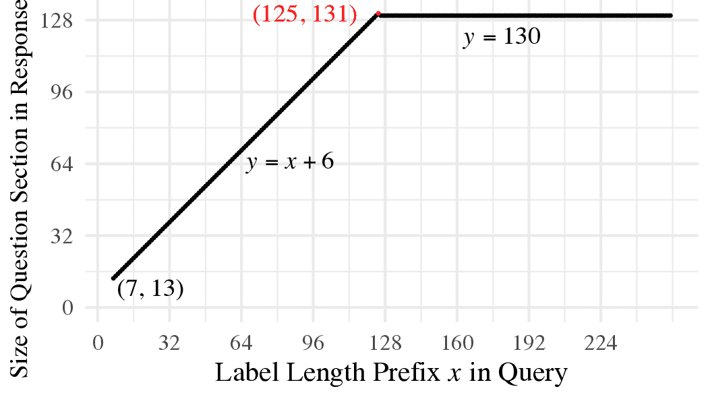
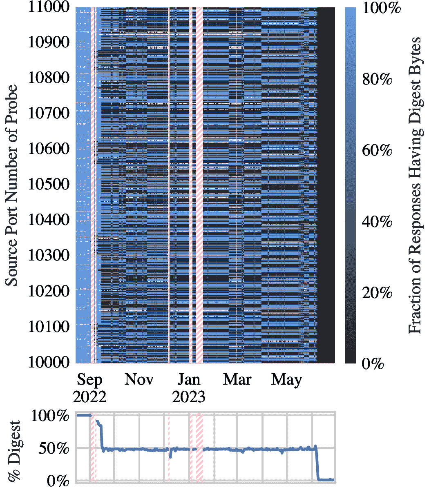
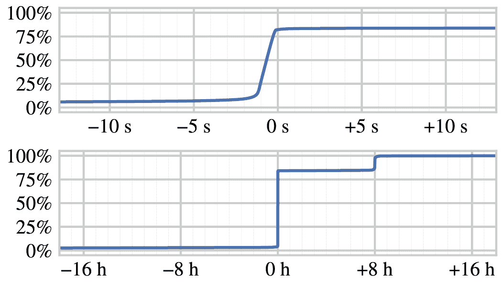
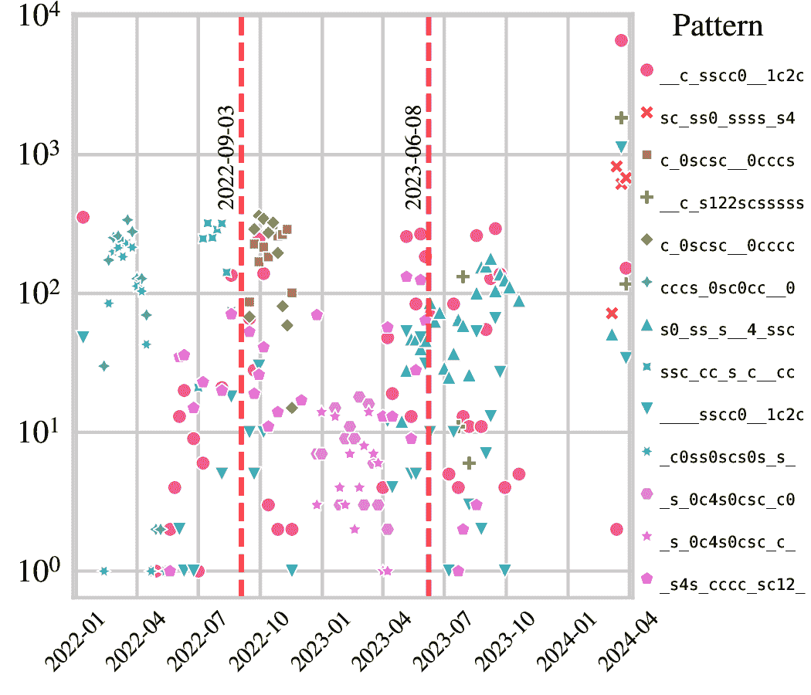
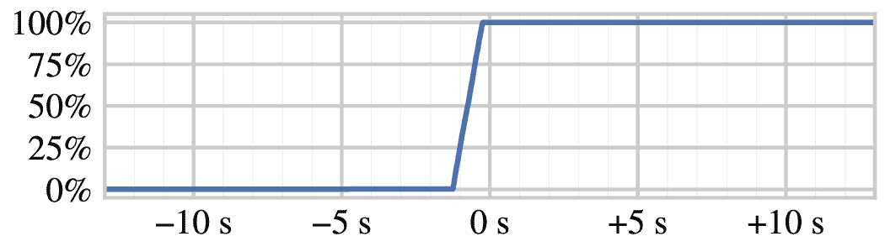
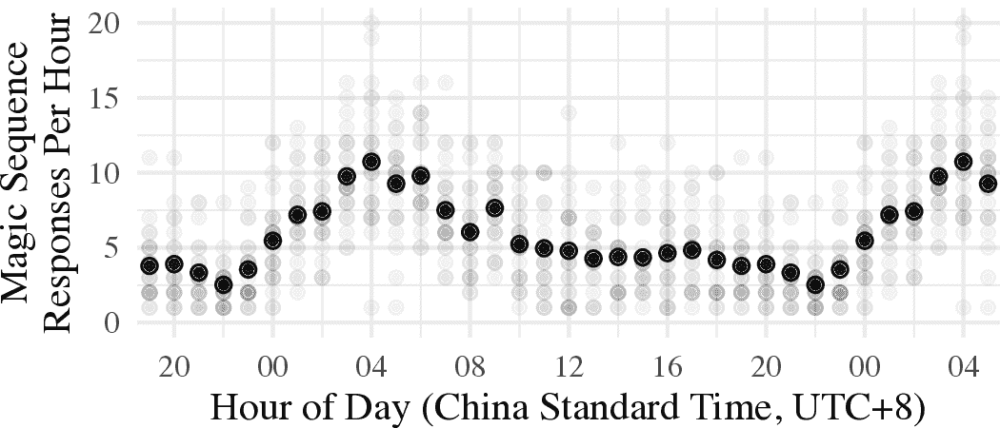
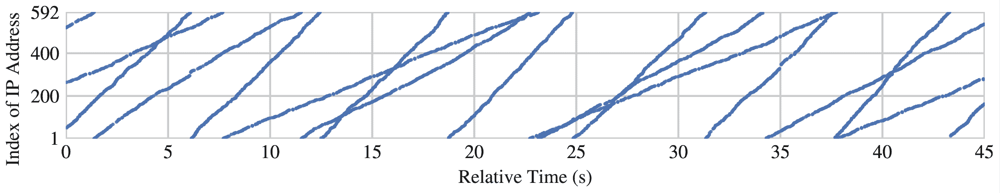
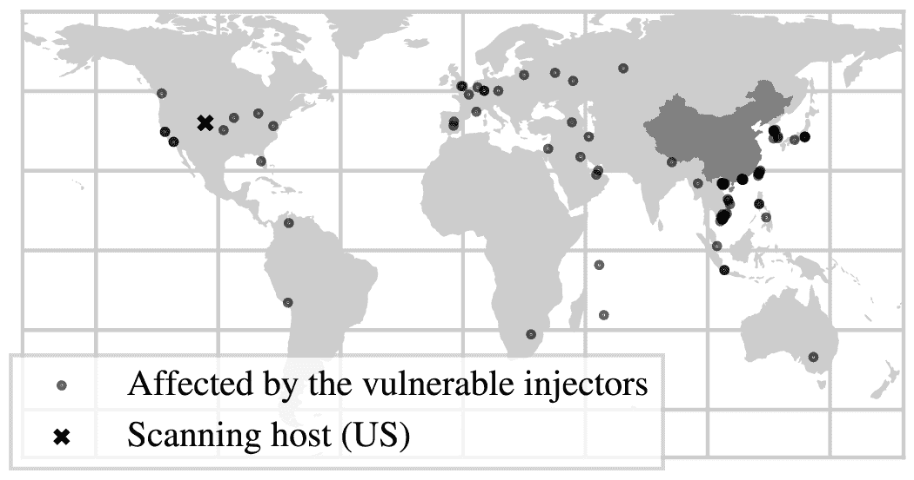
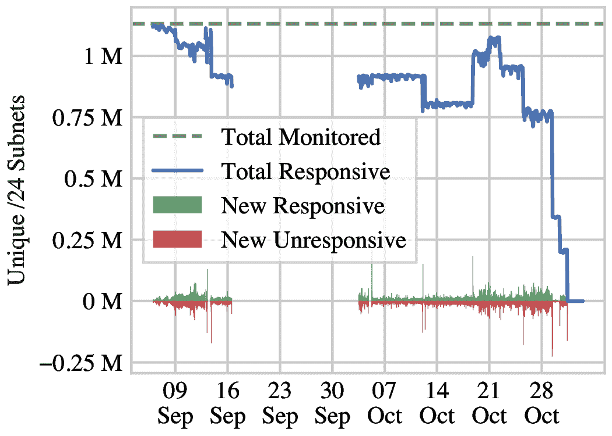

<!--yml
category: 防火墙
date: 2026-06-12 19:00:38
-->

# Wallbleed（墙出血）：中国防火长城中的内存数据泄露漏洞

> 来源：[https://gfw.report/publications/ndss25/zh/](https://gfw.report/publications/ndss25/zh/)

# Wallbleed（墙出血）：中国防火长城中的内存数据泄露漏洞

我们发现了一个名为Wallbleed（墙出血）的缓冲区过度读取漏洞，该漏洞存在于中国防火长城（GFW）的DNS注入子系统中。Wallbleed导致某些影响全国范围的审查设备在处理特制的DNS请求时会泄露至多125字节的内存数据。这一漏洞为我们提供了一个难得的机会，以深入了解防火长城最著名的网络攻击手段之一——DNS注入——的内部架构，以及审查者的操作行为。

为了理解Wallbleed的形成原因和影响，我们从2021年10月开始进行了为期两年的持续性、全网范围的测量。我们（1）逆向工程了DNS注入器的解析逻辑，（2）评估了哪些信息被泄露以及中国国内和海外的互联网用户受到何种影响，并且（3）实时监测审查者的修补行为。我们识别出可能来自审查系统内部的流量，分析了审查系统的内存管理和负载均衡机制，并观察到注入节点的进程级变化。为了协助分析，我们还利用了一个新的旁路信道来区分注入器的不同进程。我们的监测显示审查者在2023年11月对Wallbleed进行了一次不正确的修补，并在2024年3月完成了彻底修复。

Wallbleed漏洞例证了审查设备对互联网用户造成的危害不仅在于其对言论自由的明显侵犯。如果实现不当，审查设备还会对互联网用户的隐私和保密性构成严重威胁。

中国的国家互联网审查系统，通称为防火长城（GFW），由多个部分和子系统组成，每个部分都采用不同的技术来控制对在线信息的访问。其中一个主要组成部分是DNS注入子系统，该系统伪造对被审查域名的DNS查询响应。直到2024年3月，某些DNS注入设备一直存在一个解析漏洞，该漏洞在特定条件下能使发送的伪造DNS响应包含多达125字节的设备内存。我们将这一漏洞称为Wallbleed，以此向类似的缓冲区过度读取漏洞如Heartbleed [[1](#cite:Heartbleed)]，Ticketbleed [[2](#cite:Ticketbleed)]和Cloudbleed [[3](#cite:Cloudbleed-post-1), [4](#cite:Cloudbleed-post-2)]致敬。

在本研究中，我们分析了Wallbleed的成因和影响。我们的研究证实Wallbleed至少存在了两年。（类似漏洞的报告最早可追溯到2010年[[5](#cite:gfw-looking-glass-twitter)], [[6](#cite:gfw-looking-glass-post)]）。我们在2021年10月至2024年4月期间进行了持续监测。该漏洞在2023年11月得到部分修补，但DNS注入器仍然容易受到某些特制查询的攻击，直到2024年3月漏洞才得到彻底修复。

Wallbleed为我们提供了前所未有的机会来了解防火长城（GFW），包括其内部架构和审查者的操作行为。虽然先前的研究已经探讨了中国封锁了哪些域名和资源，但对防火长城网络中间设备的内部运作机制知之甚少[[7](#cite:Anonymous2014a), [8](#cite:Anonymous2020a), [9](#cite:Hoang2021a)]。通过分析Wallbleed泄露的数据，我们能够辨识防火长城的底层架构，我们还逆向工程了导致Wallbleed的解析漏洞，用C语言创建了一个行为完全相同的实现。在研究过程中，我们发现了防火长城DNS注入的一些此前未知特征，例如每个注入进程都独立地按固定顺序循环使用一个虚假IP地址列表，这构成了一个可以区分注入器节点中多个进程的旁路信道。最后，我们进行了长期的、全网范围的测量来监控审查者的修补活动，以利用这个难得的机会来深入了解审查者如何维护防火长城。

我们检查了Wallbleed泄露的内存内容，发现了明显的网络协议头、载荷数据、x86_64栈帧和可执行代码（尽管我们提供了证据表明这不是防火长城本身的代码）。我们发送了带有可识别字节模式的流量，让其通过防火长城，并在某些情况下在后续的Wallbleed响应中找到了这些标记。这一观察证明了该漏洞泄露的数据中至少包含了一些被防火长城看到的流量。在Wallbleed泄露的内存中，我们看到了明文网络流量和协议的样本，包括IP、TCP、UDP和HTTP，并非所有泄漏的流量都与DNS审查有关。我们还进行了全IPv4范围的扫描，以估计中国内外可能有多少IP地址的流量被带有Wallbleed漏洞的审查设备处理。我们发现，即使是源IP地址和目标IP地址都在中国之外的某些流量也可能受到影响，因为这些流量通过中国的网络边界进行路由。

进行此类研究伴随着重大的伦理考量。我们在[第IX节](#sec:9-ethics)中对此进行了深入讨论。讨论的内容包括了是否应披露一个存在于被许多人视为有害系统的漏洞[[10](#cite:InternetSociety2023), [11](#cite:Anderson2012b)]。注入伪造的DNS响应是防火长城每天进行的众多持续性网络攻击中的一种。这些攻击的意图和效果是众所周知的：限制人们获取信息。Wallbleed可以作为一个例子，说明审查设备不仅明显侵犯言论自由，而且还会带来安全和隐私风险。虽然这个特定的漏洞最终得到了修复，但只要此类设备存在，就仍然还是一个隐患。

GFW的DNS注入子系统是部署在中国的网络边界的一系列中间设备，这些设备监控对被封锁域名的DNS查询。当它们检测到这样的查询时，会注入一个DNS响应返回给客户端，伪造源地址，使其看似来自预期的DNS解析服务器。注入的响应是对查询的错误回答，包含一个错误且无用的IP地址。当客户端随后尝试连接到该IP地址时，它不会连接到预期的目标服务器，而是会遇到错误。这些注入的中间设备是“旁路（on-path）”设备，而非“直通（in-path）”设备：它们不会阻止查询到达合法的DNS解析器服务器，也不会阻止真实的响应到达客户端。但由于注入的伪造响应会更快到达客户端（因为它们的注入地点在网络路径中比真正的解析服务器更靠近客户端），所以其抢答会“胜出” [[12](#cite:Duan2012a)]。在正常情况下，每个查询仅预期接收一个DNS响应，因此客户端会接受最先收到的响应。

DNS注入子系统是双向的： 它对离开中国或进入中国的查询都做出响应。 这一特性为分析该系统提供了便利： 相比于在中国境内获取和维护一个网络观察点， 从外部向中国发送数据包要容易得多。 通过向中国境内的非活动IP地址发送DNS查询， 我们可以确保收到的任何响应都是中间设备伪造的， 而非终端主机的真实回复。

正如GFW由不同的组件组成，DNS注入也是由至少三种不同类型的DNS注入器完成的。关于DNS注入这个主题的基础研究包括2009年gfwrev的工作[[13](#cite:gfwrev-understanding-dns-poisoning)]，2014年Anonymous的工作[[7](#cite:Anonymous2014a)]，2020年Anonymous等人的“三重审查(Triplet censors)”[[8](#cite:Anonymous2020a)]，以及2021年Hoang等人的“防火长城有多强大？（How great is the Great Firewall?）”[[9](#cite:Hoang2021a)]。不同类型的注入器在封锁列表、IP和DNS层的网络指纹以及解析逻辑的特性上均有所不同。Wallbleed漏洞仅存在于其中一种注入器中，即Anonymous等人称为“3号注入器”("Injector 3")的那种[[8](#cite:Anonymous2020a) §4.1]。

DNS注入长期以来一直是GFW的主要技术之一。但仅仅绕过它是不够的，因为还有其他审查系统在运作。即使客户端能够通过某种方式获得正确的DNS响应，其通信仍可能被其他审查方式阻断，例如IP地址过滤[[14](#cite:Chai2019a) §4.1]，TLS SNI过滤[[14](#cite:Chai2019a), [15](#cite:Bock2021c), [16](#cite:Hoang2024a)]或TLS ESNI过滤[[14](#cite:Chai2019a), [17](#cite:Bock2020ESNI)]。在本文中，我们只关注DNS注入，并且只关注这一种DNS注入器。

中国政府并不是唯一使用DNS注入进行审查的国家。例如，请参阅Master和Garman在2023年调查中的表1“DNS篡改”一栏[[18](#cite:Master2023a)]，以及Nourin等人对土库曼斯坦的审查设备对DNS和其他协议进行双向注入的研究[[19](#cite:Nourin2023a)]。

由于Wallbleed漏洞源于低级别的解析错误，了解DNS消息在传输线和内存中的表示方式将非常重要。DNS消息的格式在RFC 1035中指定[[20](#cite:rfc1035)]。查询和响应具有相同的基本格式：一个12字节的头部，后跟四个可变长度的部分：问题（question）、答案（answer）、授权（authority）和附加（additional）。我们将只关注问题（question）和答案（answer）部分。问题（question）部分包含被查询的DNS名称（或在响应中，响应所针对的名称）。答案（answer）部分仅在响应中存在，包含查询请求的信息（通常是一个IP地址），以一种称为resource record（资源记录）的数据结构表示。

[图1](#fig:1-the-structure-of-an-injected-dns-response)是一个注入的DNS响应示例。它展示了理解本研究中出现的DNS消息所需的一切。我们将一致地使用这些字段名称和背景颜色。

| 1234      ID |  |
| 8180      flags |
| 0001      QDCOUNT |
| 0001      ANCOUNT |
| 0000      NSCOUNT |
| 0000      ARCOUNT |
| 03 r s f 03 o r g 00       QNAME |  |
| 0001      QTYPE (A, IPv4 address) |
| 0001      QCLASS (IN) |
| c00c      NAME (pointer to QNAME) |  |
| 0001      TYPE (A, IPv4 address) |
| 0001      CLASS (IN) |
| 000000ec      TTL (236 seconds) |
| 0004      RDLENGTH |
| 1f0d 5b 21       RDATA (31.13.91.33) |

[Fig. 1](#fig:1-the-structure-of-an-injected-dns-response): The structure of an injected DNS response.

该消息是一个DNS响应（而不是查询），这可以通过标志的最高有效位被设置来识别。它有一个问题（question）和一个答案（answer）；授权（authority）和附加（additional）部分是空的。问题（question）部分中的QNAME是DNS客户端请求解析的名称，rsf.org。答案（answer）部分由GFW注入器构建。它声称客户端的QNAME解析为一个不正确的IPv4地址（注入器可能使用的数百个地址之一）。

最重要的是理解DNS名称的编码。名称在DNS协议中无处不在：每个问题（question）部分（QNAME字段）中都有一个，且每个资源记录（NAME字段）中至少有一个。名称是标签的序列。标签是字节的序列，以一个字节的长度前缀。名称在一个空标签处结束，即仅由长度前缀00组成。名称example.com 有三个标签，分别为7、3和0字节。其编码长度为13字节：07 e x a m p l e 03 c o m00。

名称长度前缀编码有一个例外。如果长度前缀的两个最高有效位被设置，那么该字节的其他6位和下一个字节的8位形成一个14位的压缩指针，指示名称中剩余的标签从消息中的给定字节偏移开始。消息压缩很有用，因为DNS消息中通常包含多次相同的名称，或几个具有共同后缀的名称。压缩指针模式 c00c是一个需要识别的模式。它指向字节偏移12，即问题（question）部分的QNAME字段的偏移量。Wallbleed易受攻击的注入器不会将QNAME复制到答案（answer）部分，而是用一个 c00c压缩指针开始答案（answer）部分。（使用压缩指针并不是GFW独有的；合法的解析器也会使用它们。在GFW中存在的各种DNS注入器中，有些使用 c00c，有些则复制QNAME[[8](#cite:Anonymous2020a) §4.1]。）

DNS名称的格式，带有长度前缀和指针间接，容易导致解析器的内存安全错误。在处理标签长度前缀时，必须检查标签的结尾是否在消息的边界内。缺乏这样的检查是Wallbleed溢出漏洞的根本原因。

这是一个格式良好的查询，其QNAME，rsf.org，在GFW的封锁列表上：

1234 0100 0001 0000 0000 0000 03 r s f 03 o r g 00 0001 0001

如果我们将这些字节通过UDP数据报发送到目的端口53，从中国境外的主机发送到中国境内的主机，我们会收到一个注入的DNS响应。（实际上会收到多个响应，因为这个QNAME在多种注入器的封锁列表上。）任何中国境内的目标IP地址都可以，即使是一个无响应的地址——查询只需经过一个在途的注入中间设备即可。

一个注入的响应如下所示（这是[图1](#fig:1-the-structure-of-an-injected-dns-response)的更紧凑形式）：

1234 8180 0001 0001 0000 0000 03 r s f 03 o r g 00 0001 0001 c00c 0001 0001 000000ec 0004 1f 0d 5b 21

ID和问题（question）部分是从查询中复制的。标志已设置为适合响应。答案（answer）部分错误地声称名称rsf.org （由压缩指针 c00c表示）解析为IPv4地址31.13.91.33（1f0d 5b 21 ）。如[附录A](#app:a-an-example-ordered-pool-of-fake-ip-address)中详细说明的，这个假地址是注入器可能使用的众多地址之一。如果我们再次发送查询，可能会得到不同的地址。

现在看看如果我们人为地将org 标签的长度前缀从03（3）增加到20（32）会发生什么：

1234 0100 0001 0000 0000 0000 03 r s f 20 o r g 00 0001 0001

首先，我们现在只得到一个注入的响应：格式错误的查询被Wallbleed以外的注入器忽略。答案部分的TTL和IP地址与之前不同，这是预期的：这些通常在每个响应中都会变化。更重要的是，注入的响应在答案部分之前包含29个额外字节。这些字节来自处理查询的注入设备的内存。在这个例子中，泄露的字节是一个UPnP HTTP头的片段：

12348180 0001 0001 0000 0000 03 r s f 20 o r g 00 0001 0001 C u s t o m / 1 . 0   U P n P / 1 . 0   P r o c / V e r 0d c00c 0001 0001 000000820004 68 f4 2e a5

每当注入器响应这样的查询时，它都会暴露出其内存的一小部分，每次内容都不同。

我们假设注入器设备内部可能发生了如下过程。在其网络接口上观察到DNS查询后，注入器将数据包复制到内存中进行处理。其目标是从查询中解析QNAME，与封锁列表进行比对，并在需要时注入响应。在解析QNAME时，注入器首先看到3字节的标签rsf：到目前为止，一切正常。但长度前缀20表示下一个标签长32字节，这超出了org 标签和空标签、QTYPE和QCLASS字段，并超过了查询的末尾。由于未能执行边界检查，注入器将内存中数据包后面的字节视为查询的一部分——就好像QNAME是38字节 03 r s f 20 o r g 00 00 01 ⋅⋅⋅ P r o c / 。尽管名称末尾有多余的字节，但它仍然匹配封锁列表，原因将在[第III-A节](#sec:3a-blocklist-matching)中解释。注入器将整个QNAME（如其所见）复制到DNS响应中。 接下来的4字节（在此示例中， V e r 0d ）被解释为查询的QTYPE和QCLASS，并也被复制到响应中。

为什么解析器在 / 字节处停止，而不是将其视为长度前缀并读取另一个标签？我们在[附录B](#app:b-reverse-engineered-dns-parsing-and-injection-algorithm)中提供了解析算法的精确逆向工程描述，回答了这个和其他问题。在这种情况下，这是因为QNAME解析器在第一个超过查询末尾的标签长度前缀后停止。

当注入器检查名称是否在其封锁列表中时，它不会使用名称的有线格式表示。相反，它将QNAME展平为一个以00字节结尾的点分隔字符串。这个字符串被传递给封锁列表查找函数。证据是，当查询中的标签包含ASCII点字符 . 或空字节00时，封锁列表匹配器分别将其解释为标签分隔符或名称终止符。例如，如果名称example.com 在封锁列表上，以下任一QNAME 07 e x a m p l e 03 c o m 00 或 0f e x a m p l e . c o m 00 a b c 00 会引发注入。尽管这些名称在DNS级别是不同的（第一个由三个标签组成，分别为7、3和0字节；第二个由两个标签组成，分别为15和0字节），但它们都被展平为相同的有效字符串“example.com”。

这解释了为什么QNAME 03 r s f 20 o r g 00 00 01  ⋅⋅⋅  P r o c / 在前一个示例中被注入器理解为匹配封锁列表规则rsf.org。尽管第二个标签不仅仅是org，而是org加上许多额外的字节，但这些额外字节中的第一个是00，当它被展平为字符串时终止了名称。额外的字节包含在注入的DNS响应中，但它们不影响封锁列表匹配。

这也解释了为什么我们修改了org标签的长度前缀，而不是rsf标签。如果我们延长了rsf标签，03在 o r g 之前会被解释为展平名称字符串中的一个字面字符——因为字符串“rsf\x03org”不匹配封锁列表上的任何内容，它不会得到响应。而通过延长org标签，rsf和org仍然是单独的标签，最后的空标签00成为字符串终止符。改变第一个长度前缀是可行的，但随后第二个长度前缀也必须更改为一个点，以便在最终字符串中分隔标签： 20 r s f . o r g 00。

封锁列表规则不是字面名称，而是模式，类似于正则表达式[[9](#cite:Hoang2021a) §4.1]。例如，单个规则可以封锁整个域及其子域。模式的构建并不统一（显示出易错的人为管理迹象）。我们一直使用的rsf.org 模式是结尾锚定和标签锚定的：rsf.org 和x.rsf.org 匹配该模式，但xrsf.org、rsf.org.x和rsf.orgx 不匹配。作为正则表达式，它可能是`(.*\.)*rsf\.org$`。 相比之下，shadowvpn.com的模式是开始锚定而不是标签锚定的：shadowvpn.com、shadowvpn.comx和shadowvpn.com.x匹配它，但xshadowvpn.com和x.shadowvpn.com不匹配。它的正则表达式将是`^shadowvpn\.com.*`。

单个响应中可能泄露的最大字节数是125。这是因为注入响应中的问题（question）部分最大为131字节，而触发响应的查询中最短的问题（question）部分长度为6字节。响应中的问题（question）部分在开头包含查询中问题（question）部分的副本；其余部分是泄露的内存。为了最大化泄露的内存量，需最小化查询中问题（question）部分的大小（查询实际有多大），并最大化响应中问题（question）部分的大小（注入器认为查询有多大）。

最小化查询大小的第一步是省略QTYPE和QCLASS字段。当这些字段缺失时，注入器会从其自身内存中读取它们。QCLASS没有影响，而QTYPE仅控制注入器是生成类型A（IPv4）还是类型AAAA（IPv6）的响应。对于未知的QTYPE，注入器默认为类型A；只有当QTYPE是 001c时，它们才发送类型AAAA的响应。在任何情况下，问题（question）部分的大小都是相同的。

最小化查询大小的另一部分是使用短的QNAME。为了找到触发注入响应的短DNS名称，我们枚举了所有形式为a.b、a.bc和ab.c的名称，其中a、b和c的范围包括字符‘a’–‘z’、‘0’–‘9’、‘-’和‘_’，并将它们发送到中国的DNS查询中。我们找到了八个有效的短名称：3.tt、4.tt、5.tt、6.tt、7.tt、8.tt、9.tt和x.co。 这些名称中的每一个都需要6字节来编码（例如，01 3 02t t00）。

在[第III节](#sec:3-demonstrating-overflow)的开头，我们通过将QNAME标签的长度前缀从3增加到32，导致注入器泄露了29个字节。直观地说，为了泄露更多字节，应该进一步增加标签的长度。这种直觉是正确的，但仅在某个程度上有效。[图2](#fig:2-question-section-size-label-length-prefix)显示了随着查询中标签长度的增加，响应中的问题（question）部分大小会发生变化。（我们关注的注入器不会强制执行RFC 1035对标签的63字节长度限制[[20](#cite:rfc1035) §4.1.4]，而是简单地将每个字节值解释为长度。）它们逐一增加，直到响应问题（question）部分达到最大131字节。超过该点后，问题（question）部分会略小于最大值，为130字节。



[图2](#fig:2-question-section-size-label-length-prefix): 注入DNS响应中的问题（question）部分大小与查询中标签长度前缀x的关系。我们使用[第III节](#sec:3a-blocklist-matching)中的“嵌入点字符”和“嵌入空终止符”技巧，将变长标签长度前缀置于问题（question）部分的开头。 在QNAME查询中x r s f . o r g 00 。我们使用了[第III-A节](#sec:3a-blocklist-matching)中的“嵌入点字符”和“嵌入空终止符”技巧，以便将可变标签长度前缀放置在问题（question）部分的开头。

这种奇怪的行为是由于查询解析算法的混乱逻辑造成的（见[附录B](#app:b-reverse-engineered-dns-parsing-and-injection-algorithm)）。导致算法主循环终止的两个条件是：在处理标签内容时，QNAME的总长度超过127字节，以及解析器刚刚读取的长度前缀超出查询的范围。当QNAME恰好为127字节（包括最终的标签长度前缀）时，131字节的sweet spot（最佳点）出现了。在这种情况下，第一个退出条件被避免，允许循环的下一次迭代在退出之前读取1个额外的字节。QNAME的127个字节，加上缺失的QTYPE和QCLASS的4个字节，使得问题（question）部分的总长度为131个字节。

QNAME长度限制是这种类型注入器的一般特性，与Wallbleed解析错误无关。我们向中国发送了逐渐增长长度的良好格式的查询（a.google.sm、aa.google.sm、aaa.google.sm，...），使用一个已知与封锁列表匹配的基本域google.sm。一旦最后一个标签的末尾的 m 字节被推出前127个字节，注入器就停止响应。对于类型A和类型AAAA的查询，以及QNAME中的任何标签数量，限制都是相同的。RFC 1035规定的最大名称长度为255字节[[20](#cite:rfc1035) §2.3.4]。

虽然知道绝对限制及其原因令人满意，但在实践中，130字节和131字节之间几乎没有区别。在本文的许多实验中（一些是在我们理解解析算法的细微差别之前进行的），我们使用了ff的标签长度前缀，这比最大可能值少1字节。对于足够大的长度前缀，130字节的问题（question）部分响应与2012年klzgrad的发现一致[[6](#cite:gfw-looking-glass-post)]。

GFW尝试在2023年9月至11月之间修补Wallbleed，增加了对DNS消息解析算法的限制。我们在[第VII节](#sec:7-monitoring-the-censors-patching-behavior)中记录了补丁的进展。QTYPE和QCLASS字段不再可以省略，且QCLASS必须为 0001。此外，标签长度前缀溢出查询末尾但未达到127字节QNAME长度阈值的查询将被忽略。如下查询不再能泄露DNS注入器内存：

00000120 0001 0000 0000 0000 03 w w w 06 g o o g l e ff c o m 00

但第一个补丁忽略了解析循环中的一个退出条件。一个带有QTYPE和QCLASS的查询，且最终标签长度前缀超过127字节阈值，仍然会导致解析器认为查询比实际大。稍微修改的探测格式仍然可以引出内存内容：

00000120 0001 0000 0000 0000 03 w w w 06 g o o g l e 03 c o m ff0001 0001

我们将补丁前和补丁后的漏洞分别命名为Wallbleed v1和Wallbleed v2。我们在本文描述的大多数实验中使用了Wallbleed v1探测。在补丁后，我们能够使用修改后的探测恢复实验，直到Wallbleed v2在2024年3月最终被修补。在Wallbleed v2中，只有最大长度溢出是可能的：标签长度为ff有效，但20无效。我们发现最短的域名，如3.tt，不再能作为触发器，因此在后来的实验中使用了te.rs，下一个最短的有效域名。

这里我们评论了一些触发注入条件的其他细节。请注意，GFW中还有其他类型的DNS注入器[[8](#cite:Anonymous2020a), [9](#cite:Hoang2021a)]，它们有自己的封锁列表和实现上的怪癖。

注入器默认响应类型为A。 DNS注入器仅响应QNAME与某个封锁列表匹配的查询。易受攻击的注入器对类型AAAA的查询注入类型AAAA的响应，对所有其他类型的查询注入类型A的响应。

注入器适用于IPv4和IPv6。 承载DNS查询的UDP数据报可以通过IPv4或IPv6发送；注入器对两者都响应，并根据查询伪造IPv4或IPv6响应。（这里我们指的是查询发送的IP版本，而不是查询的QTYPE。通过IPv4发送的查询可能请求IPv6地址，反之亦然。）2023年5月9日，我们发送了QNAME为 ff g o o g l e . s m 00 的Wallbleed探针到阿里云（北京，AS37963）的一个IPv6主机和中国的一个非DNS服务器2400:dd01:103a:4041::101。在这两种情况下，我们都得到了包含泄露内存的注入DNS响应。然而，我们无法在相反方向触发DNS注入，即从中国的VPS发送查询到美国的VPS或其他IPv6地址。这可能是因为注入器没有部署在我们从中国VPS到我们测试的外国目的地的路径上。

仅查看目标端口53。 2023年5月9日，我们从美国的VPS向中国的VPS发送了google.sm 的查询，UDP目标端口在0到65535之间变化。只有发送到端口53的查询导致了注入。这一观察结果与Lowe等人在2007年[[21](#cite:Lowe2007a) §6.4]和Anonymous等人在2020年[[8](#cite:Anonymous2020a) §2.1]的先前发现一致。

为了更好地理解漏洞泄露了哪些信息，我们进行了为期两年的纵向测量，从2021年11月21日到2023年11月29日。[表I](#tbl:1-experiment-timeline-vantage-points)总结了这个实验以及后续章节的实验。

[表I](#tbl:1-experiment-timeline-vantage-points)：实验时间线和观察点。总共，我们在腾讯云（TC，北京）（AS45090）使用了三个VPS，在科罗拉多大学博尔德分校（Scan，CO）（AS104）和马萨诸塞大学阿默斯特分校（Long，MA）（AS1249）各使用了一台机器。

| 实验 | 时间跨度 | 持续时间 | 中国主机 | 美国主机 | 章节 |
| 特征化 | 2021年10月2日 – 2022年2月10日 |   | 4  | 月 | 1 (TC，北京)   | 1 (Long, MA) | [§III-B](#sec:3b-maximizing-leaked-bytes-per-response) |
| 重新特征化 | 2023年5月9日 – 9月10日 | & 2024年2月   | 5  | 月 | 1 (TC，北京)   | 1 (Long, MA) | [§III](#sec:3-demonstrating-overflow) |
| 纵向 | 2021年11月21日 – 2024年4月16日 |  | 2  | 年 | 3 (TC，北京)   | 1 (Long, MA) | [§IV](#sec:4-what-information-is-leaked) |
| 观察我们自己的 | 2023年8月12日 – 9月8日 | & 2024年3月13日   | 4  | 周 | 1 (TC，北京)   | 1 (Scan, CO) | [§V](#sec:5-seeing-out-own-traffic) |
| 互联网扫描 | 2023年6月25日 & 8月23日 | & 2024年3月6日   | 3  | 天 | -   | 1 (Scan, CO) | [§VI](#sec:6-ip-addresses-affected-by-wallbleed) |
| 补丁行为 | 2023年9月6日 – 11月7日 | & 2024年3月6日 – 4月16日 2024  | 3  | 月 | 2 (TC，北京)   | 2 (Scan & Long) | [§VII](#sec:7-monitoring-the-censors-patching-behavior), [§III-C](#sec:3c-Incomplete-patch-wallbleed-v2) |

基于[第III-B节](#sec:3b-maximizing-leaked-bytes-per-response)中的观察，我们设计了以下Wallbleed探针来触发漏洞：

00000120 0001 0000 0000 0000 01 3 ff t t

该探针是对3.tt的查询，但在QNAME的终止空标签之前被截断（省略了QCLASS和QTYPE字段），并且将tt标签长度前缀从02增加到ff。（根据[脚注3](#fn:minor-subtlety-implicit-null-terminator)，对于这么短的QNAME，不需要最终的00标签。）如在[第III-B节](#sec:3b-maximizing-leaked-bytes-per-response)中解释的那样，这个探针导致了124字节的内存泄漏。

实验设置。我们从美国大学的主机向中国的一个IP地址发送了Wallbleed探针。中国的地址是腾讯云（AS45090）下我们控制的一个VPS。我们在一千个端口号（从10001到11000）的范围内变化探针的UDP源端口，因为之前的工作表明源端口号可能会影响DNS注入[[22](#cite:Bhaskar2022a)]。我们以每秒100个数据包（pps）的速率发送探针，并在两年内收集了51亿个Wallbleed响应。

查询名称。我们最初使用的QNAME 3.tt显然已经从注入器的封锁列表中删除，并于2023年8月7日11:04:01（中国标准时间，UTC+8）停止引发注入响应。我们将QNAME更改为4.tt，这是来自[第III-B节](#sec:3b-maximizing-leaked-bytes-per-response)的另一个短名称。

查看124字节泄露的内存片段样本，可以立即发现它们包含网络流量片段。这些片段至少部分来源于通过注入设备的包：在[第V节](#sec:5-seeing-out-own-traffic)中，我们展示了我们自己通过GFW发送的包负载的恢复。然而，协议的混合与预期的所有进入或离开中国的流量的统一样本不同。

在对响应样本进行初步手动分析后，我们使用正则表达式搜索常见或敏感字符串。为了降低分析可识别个人信息的风险，我们的程序仅输出匹配的数量。如[表II](#tbl:2-regex-matches-wallbleed-responses-2years)所示，我们发现了UPnP、SSDP、HTTP、SMTP、SSH和TLS的实例，以及可能的敏感信息，如HTTP cookies和密码。

[表II](#tbl:2-regex-matches-wallbleed-responses-2years)：对观察到的51亿个Wallbleed响应进行正则表达式匹配的次数，历时两年。

| 正则表达式 | 协议 | 计数 | 比例 |
| ssdp:discover | SSDP | 184 | M | 3.61% |
| UPnP/IGD\xml | UPnP | 174 | M | 3.41% |
| (?s)[3-4]\xfftt.....-CONTROL | [(§IV-B)](#sec:4b-the-four-digest-bytes) | 121 | M | 2.37% |
| \x45\x00 | [(§IV-A)](#sec:4a-wallbleed-leaks-network-traffic) | 2.8 | M | 0.05% |
| uuid:WAN | SSDP | 34 | M | 0.67% |
| Host:␣ | HTTP | 21 | M | 0.41% |
| (?i)Date:\s* … | [(§IV-C)](#sec:4c-how-long-bytes-remain-in-memory) | 16 | M | 0.31% |
| \x7f\x00\x00 | [(§IV-D)](#sec:4d-inferring-the-gfws-internal-architecture) | 2.8 | M | 0.05% |
| Cookie:␣ | HTTP | 2.0 | M | 0.04% |
| RCPT␣TO | SMTP | 72.5 | k | 0.0014% |
| &key= | URL | 58.1 | k | 0.0011% |
| MAIL␣FROM | SMTP | 42.4 | k | 0.0008% |
| &password= | URL | 26.9 | k | 0.0005% |

值得注意的是，内存中包含了除DNS之外的应用层协议。由于注入器仅在UDP端口53上响应DNS查询（[第III-D节](#sec:3d-other-details-of-injection-triggering)），我们可能预期只会看到DNS或仅有UDP端口53的流量；但实际上，我们看到了各种协议，包括那些通常在不同端口和传输协议上运行的协议。相当大的一部分由UPnP（通用即插即用）和SSDP（简单服务发现协议）组成。UPnP使用HTTP——但UPnP的数量比其他形式的HTTP多一个数量级。[第III节](#sec:3-demonstrating-overflow)中的示例响应就是一个这样的UPnP实例。我们从1.66亿个UPnP片段中提取了HTTP Location头：在每个案例中，URL的主机部分是RFC 1918[[23](#cite:rfc1918)]的私有范围内的字面IP地址。私有地址与UPnP和SSDP一致，后者通常用于本地网络中的服务发现。然而，很难解释为什么它们在易受攻击的注入器的内存中以如此高的频率出现。

除了应用层协议，还有网络层和传输层的头和数据包。例如，有IPv4头。为了找到这些，我们首先寻找通常开始于IPv4头的两字节模式4500 ，然后（将后续字节解释为头）过滤出有效的IP校验和。[表III](#tbl:3-common-protocol-fields-ipv-headers)显示了181,834个IPv4头中协议字段的分布。TCP、UDP和ICMP是最常见的，还有43个其他协议的长尾。

有7,743个案例中，IP头后面跟着TCP头和足够的数据，形成了一个完整的TCP段，具有一致的长度字段和有效的IP和TCP校验和。TCP头包含标志和端口号，我们可以通过这些启发式地推断出IP头中的两个IP地址哪个是服务器，哪个是客户端。为了避免分析可识别个人信息，我们将IP地址匿名化为两种粗略的类别：私有（RFC 1918）和公共。然后我们统计了客户端/服务器和私有/公共的比例；结果如[表IV](#tbl:4-client-server-private-public-tcp-flows)所示。

[表IV](#tbl:4-client-server-private-public-tcp-flows)：从7743个完整的TCP段推断出的客户端/服务器和私有/公共流量。

| 客户端地址 | 服务器地址 | 计数 |
| 私有 | 私有 | 384 |
| 私有 | 公共 | 6,276 |
| 公共 | 私有 | 193 |
| 公共 | 公共 | 890 |

由于DNS注入器监控公共互联网流量，我们预期从其内存中恢复的TCP段大多会有公共IP地址；然而，只有11%的TCP段是公共到公共的。大多数实际上涉及一个私有客户端和一个公共服务器。因为私有IP地址不是全球可路由的，人们可能会怀疑它们代表了GFW的内部流量（这与上面关于UPnP的观察一致）。然而，内存泄漏的有限大小意味着我们只能统计相对较短的TCP段（最多125字节）。也有可能我们看到的TCP段被封装在一个更高级别的协议中，如GRE，而不是直接路由通过中间设备。

在纵向实验的开始，Wallbleed响应中泄露数据的前4个字节与其他字节不同。它们通常看起来更随机，这在泄漏的其他部分由可读的ASCII组成时尤其明显。不同的字节序列可能归因于部分覆盖的内存，但这不同：它始终是前4个字节，并且它们不像其他字节那样包含网络协议的片段。我们称这些字节为“摘要”字节，假设它们代表查询包的哈希，可能用于负载均衡目的。（这只是一个猜测——我们尝试过，但没有找到能再现摘要字节的哈希算法。）摘要字节在2022年和2023年分两个阶段从Wallbleed响应中消失。

摘要字节实际上并不是随机的，而是由DNS查询的内容决定的，包括其UDP四元组。在2022年2月15日（当时所有Wallbleed响应都有摘要字节），我们发送了具有相同有效载荷和源、目标IP地址和端口的Wallbleed探针。在所有114,717个结果注入中，前4个字节完全是d8fd d0 41 。然而，保持四元组不变并改变有效载荷中的一位，会导致摘要字节发生变化。这可以与[第V-A节](#sec:5a-timestamped-magic-sequence-probes)中的注入器进程分配进行比较，后者依赖于四元组而不是有效载荷。

我们通过寻找一个特定的字符串ACHE-CONTROL （HTTP Cache-Control头的一部分）来测量摘要字节随时间的普遍性，该字符串经常出现在Wallbleed响应的开头（[表II](#tbl:2-regex-matches-wallbleed-responses-2years)）。当摘要字节存在时，字符串的前4个字节会被覆盖。[图3](#fig:3-wallbleed-response-rate-digest-transition)显示了摘要字节在九个月内分两个阶段消失的过程。当我们开始测量时，所有响应都有摘要字节。第一个缺少摘要字节的响应是在2022年9月3日星期六01:31（中国标准时间，UTC+8）。此后，摘要字节的存在与否取决于探针的源端口，在任何给定时间点，大约一半的端口会引发摘要字节。导致摘要字节的端口映射偶尔会发生变化，但始终保持在50%的比例——我们怀疑这代表了负载均衡。在2023年6月8日星期四15:33（UTC+8）之后，摘要字节几乎完全消失。



[图3](#fig:3-wallbleed-response-rate-digest-transition)：下图显示了Wallbleed响应中带有摘要字节的比例，按一天内所有探针源端口的平均值计算。在2022年9月3日之前，所有响应都有摘要字节；在2023年6月8日之后，没有响应有摘要字节；在此期间，一半有，一半没有。在过渡期内，给定源端口是否引发摘要字节在短时间内是一致的。上图显示了按探针源端口和日期的摘要响应率，始终接近0%或100%。

我们通过寻找自然出现的时间戳来估计字节在内存中停留的时间，即HTTP Date头。这些字符串的格式为Date: Wed, 21 Apr 2021 00:00:00 GMT，表示HTTP响应生成的时间。[图4](#fig:4-cdf-http-date-timestamps-relative-to-capture)显示了包含完整Date头的1630万Wallbleed响应的年龄分布：即响应接收时间与其Date头中编码的时间戳之间的差异。大多数Date头来自最近的过去：75%在0到5秒之间，7%更老。大约10%在捕获时间相对的未来几乎正好8小时，这可能是服务器错误地将本地时间报告为UTC的结果。

在[第V-A节](#sec:5a-timestamped-magic-sequence-probes)中，我们进行了类似的 内存年龄实验，使用我们自己故意放置的时间戳。



[图4](#fig:4-cdf-http-date-timestamps-relative-to-capture)：HTTP Date时间戳相对于捕获时间的累积分布。上图的刻度为秒；下图的刻度为小时。大多数时间戳小于5秒。时区错误使得一些看起来在未来8小时。

泄露的内存偶尔包含看起来像x86_64指针的内容。这些是小端字节序的64位值，其最高有效的16位为零，并且位于常规地址范围内。在Linux上，典型的栈指针地址范围是0x00007f0000000000–0x00007fffffffffff，而代码和堆指针的地址范围是0x0000550000000000–0x000056ffffffffff。

在Linux上，典型的栈包含一个栈地址，后跟一个代码地址（分别对应于保存的帧指针和返回地址）。我们在泄露的有效载荷中寻找这些模式。我们找到了70,497个例子，并注意到几个常见的模式。我们基于每个有效载荷中存在的14个64位字创建了模式模板。例如，一个栈地址（在典型的Linux栈指针范围内的64位值）被替换为单个字符‘s’。以这种方式，代码指针（‘c’）和常见数字，包括零（‘0’）、−128（‘1’）、22（‘2’）和4（‘4’）被替换，剩余未标记的字被转换为‘_’。这产生了3,559个独特的模式，我们在[图5](#fig:5-when-we-see-stack-pattern.weekly)中绘制了最常出现的模式。



[图5](#fig:5-when-we-see-stack-pattern.weekly)：泄露内存中常见栈帧模式的计数，按周时间显示。‘s’和‘c’分别对应于栈和代码地址，数字对应于我们观察到的特定常见64位值。红色垂直线表示我们观察到摘要字节模式变化的时间（[图3](#fig:3-wallbleed-response-rate-digest-transition)）。

两条红线表示摘要字节转换的阶段，来自[图3](#fig:3-wallbleed-response-rate-digest-transition)。第一条线在2023年9月3日，与最常见的栈帧模式的变化相吻合；第二条线在2023年6月8日，没有显示出明显的模式变化。我们无法从这些变化的模式中得出更具体的结论；它们可能纯属巧合。

我们看到的栈帧与启用了ASLR的Linux栈帧一致，表明给定模式在某些位上看到随机化：在栈/代码指针中，最低有效的12位是一致的，对应于4KB页面中的一致偏移。在一些栈帧中，我们还观察到似乎是glibc栈金丝雀[[24](#cite:glibc-canary)]，由一个随机值指示，其最低有效的8位设置为0，位于栈/代码地址对之前。

我们还观察到x86_64指令序列，如函数序言。我们认为这些是GFW在网络上看到的代码，而不是GFW本身的代码，原因有二。首先，在基于栈的内存泄露中指令泄露是不可能的，因为Linux在分配前清除页面，并且不允许在可写页面中执行代码。其次，我们还在大学网络监听中观察到x86_64代码，这似乎是微软代码更新发送（签名的）明文二进制文件[[25](#cite:phaedrus_windows_update)]。

在[第IV-A节](#sec:4a-wallbleed-leaks-network-traffic)中，我们看到Wallbleed泄露了至少一些网络流量，甚至是非DNS流量，这些流量通过了注入设备。这里我们通过一个专门的实验确认了这一事实。我们将自己标记的流量发送到中国境内，后来能够在Wallbleed响应中恢复其中的一部分。

标记流量只能在发送后的几秒钟内恢复。恢复率很低，并且随时间变化。注入设备在内部被划分为多个独立的进程，我们通过一个先前未记录的侧信道揭示了这一点，该侧信道在注入的虚假IP地址的排序中。每个进程都有自己的内存：只有当Wallbleed探针恰好被分配到同一进程时，才能恢复过去的流量。数据包到进程的分配是确定性的，并且至少取决于探针的源端口。通过IPv6发送的探针可能会恢复最初通过IPv4发送的流量，反之亦然。

我们为这个实验开发了一个新的探针。魔法序列探针是一个UDP数据包，发送到端口53，其40字节的有效载荷是20字节序列的两个副本：

G F W B l e e d exp pkt rep timestamp       

其中`exp`是实验ID，`pkt`是递增的数据包ID，`rep`在探针中为序列的第一个副本时为0，第二个副本时为1，`timestamp`是一个纪元时间戳。固定字符串“GFWBleed”和唯一ID使得在Wallbleed响应中识别魔法序列变得容易。时间戳让我们可以估计恢复的魔法序列在内存中存在多久。虽然魔法序列探针使用UDP和目标端口53，但其结构与DNS不同。

在发送魔法序列探针的同时，我们也发送了Wallbleed探针，如[第IV节](#sec:4-what-information-is-leaked)中所述，以恢复我们试图放入内存中的序列。我们从美国的一所大学向中国的目的地发送了探针，时间从2023年8月12日到9月8日（[表I](#tbl:1-experiment-timeline-vantage-points)）。目的地主机与[第IV节](#sec:4-what-information-is-leaked)中使用的不同，以避免两个实验之间的潜在干扰。我们以平均30个数据包每秒的速率从单个源端口10000发送魔法序列探针。我们从199个源端口（范围为20001至20199）以100个数据包每秒的速率发送Wallbleed探针。选择使用单个源端口进行魔法序列探针的决定最终变得非常重要，因为它有助于揭示离散的注入器进程的存在。我们收集了包含魔法序列的3,521个Wallbleed响应。

恢复的流量通常不超过1秒钟。[图6](#fig:6-cdf-timestamp-magic-sequence-difference)显示了魔法序列探针中编码的时间戳与在Wallbleed响应中恢复的时间之间的差异。与[第IV-C节](#sec:4c-how-long-bytes-remain-in-memory)中的HTTP Date时间戳一样，流量在注入器的内存中存活时间很短：99%的恢复的魔法序列时间戳在过去1.5秒内。−1秒到0秒之间的均匀斜率是`timestamp`一秒粒度的结果。与HTTP Date实验不同，这里不存在时区混淆的可能性。



[图6](#fig:6-cdf-timestamp-magic-sequence-difference)：魔法序列中存储的时间戳与我们在Wallbleed响应中恢复它时的时间差的累积分布。图中显示了2023年8月12日至9月8日期间收集的3,521个包含魔法序列的Wallbleed响应的分布。时间差的范围是−10.19秒到−0.23秒。

恢复流量的可能性在一天的周期中变化。[图7](#fig:7-magic-sequence-likelihood-time-of-day)显示了28天内每小时包含魔法序列的Wallbleed响应的数量。虽然我们以恒定速率发送Wallbleed探针和魔法序列探针，但每小时恢复的探针数量在24小时周期中变化，峰值在04:00到05:00之间，谷值在22:00到23:00之间（中国标准时间，UTC+8）。这与中国互联网流量量的反向昼夜模式一致：注入器处理的流量越多，我们观察到自己数据包的可能性就越小。



[图7](#fig:7-magic-sequence-likelihood-time-of-day)：观察到魔法序列的可能性取决于一天中的时间。淡色背景点代表了从2023年8月14日开始的四周内每小时收到的包含魔法序列的Wallbleed响应数量。深色前景点是所有28天中相应小时的平均值。

数据包在内存中具有一致的对齐方式。当我们恢复一个魔法序列时，我们无法获得完整的40字节。几乎总是，开头部分被触发响应的Wallbleed探针的字节覆盖。使用[第IV节](#sec:4-what-information-is-leaked)中的Wallbleed探针，前18字节被覆盖，最后22字节保持完整。注入设备可能在内存中将数据包的第一个字节对齐到一致的位置。其他观察支持这一假设：在[第IV-B节](#sec:4b-the-four-digest-bytes)中，我们利用了常见的`ACHE-CONTROL`字符串的对齐来测试摘要字节的存在。

只有一部分源端口曾经看到过魔法序列。我们从单个源端口（10000）发送魔法序列探针。尽管我们从199个不同的源端口（20001–20199）发送了Wallbleed探针，但只有64个源端口曾经恢复过魔法序列。（那些恢复的平均恢复了55个魔法序列。）进一步的调查使我们相信，每个DNS注入设备由多个独立的进程组成，每个进程都有自己的内存缓冲区，并且数据包根据包括源端口在内的特征被确定性地分配到一个进程。（但不是有效载荷，因为魔法序列探针具有可变的有效载荷。这与[第IV-B节](#sec:4b-the-four-digest-bytes)的摘要字节形成对比，后者确实依赖于有效载荷。）只有当Wallbleed探针被分配到与原始魔法序列探针相同的进程时，它才有机会恢复它。（这可以解释[图3](#fig:3-wallbleed-response-rate-digest-transition)中的水平带：在一段时间内，一半的进程使用摘要字节，一半没有。）在下一小节中，我们将展示更多关于多进程假设的证据，以注入的DNS响应的虚假IP地址中一个先前未知的侧信道的形式。

先前的研究表明，GFW的DNS注入从一个固定的池中提取虚假响应IP地址，并且根据查询的名称使用池的不同子集[[8](#cite:Anonymous2020a) §3.2]，[[9](#cite:Hoang2021a) §5.3]。现在尚未被理解的是，这些池也是有序的和循环的。当以足够高的速率（每秒约100个查询或更多——远高于注入器的自然注入速率）进行探测时，使用一致的查询名称和源/目标IP地址和端口元组，注入的响应会以相同的顺序反复循环通过IP地址（偶尔会有注入器响应其他用户查询的间隙）。通过重复探测，可以获得序列的多个副本，调和间隙，并恢复给定查询名称的完整虚假IP地址有序列表。4.tt查询名称的592个IP地址的示例有序列表出现在[附录A](#app:a-an-example-ordered-pool-of-fake-ip-address)中。

选择任何IP地址作为循环中的“第一个”，我们可以从IP地址构建到其索引的反向映射。独立于Wallbleed泄漏，每个DNS响应在注入时揭示了注入器的内部索引变量。[图8](#fig:8-vulnerable-injectors-fake-ip-pool)显示了在从199个源端口以高速率探测时，Wallbleed响应中包含的IP地址的索引在45秒间隔内的变化。我们看到的不是一个，而是三个大致线性的序列。它们是循环的：当一个达到顶部时，它会回绕到底部。相同的源端口始终映射到相同的序列。对我们来说，这看起来像是注入设备内多个进程上的基于哈希的负载平衡。负载平衡分配的输入包括数据包的UDP四元组，但不包括其数据有效载荷（因为魔法序列探针的有效载荷是可变的）。保持四元组的其余部分不变，源端口根据它们被分配到的注入器进程分为少数等价类。这解释了为什么只有199个源端口中的64个恢复了魔法序列：那些是恰好被分配到与源端口10000的魔法序列探针相同的进程的端口。



[图8](#fig:8-vulnerable-injectors-fake-ip-pool)：2023年8月23日，在45秒内从199个不同的源端口进行高频率探测后收到的Wallbleed响应样本。每个响应中的IP地址已被反向映射到其在[附录A](#app:a-an-example-ordered-pool-of-fake-ip-address)中的有序列表中的索引（从1到592）。这些索引不是随机的，而是形成了三个不同的循环序列——每个源端口始终映射到其中一个。每个序列代表DNS注入器中的一个进程，具有自己的地址列表迭代器和内存分配。只有199个源端口中的64个映射到正确的进程以恢复[第V-A节](#sec:5a-timestamped-magic-sequence-probes)的魔法序列探针。

Wallbleed提供了一种方法来判断IPv4和IPv6数据包是否在相同的GFW节点上处理。如果我们通过GFW发送一个独特的IPv4有效载荷，并在基于IPv6的Wallbleed查询中看到该有效载荷的部分泄露在内存中，那么我们就知道有节点在相同的内存中处理IPv4和IPv6。

我们从MaxMind的GeoLite2国家代码数据库[[26](#cite:MaxMind)]（下载于2024年3月12日）中收集了一组地理定位到中国的IPv6前缀，排除了基于RouteViews BGP数据（下载于2024年3月13日）未路由的前缀。我们向每个IPv6前缀中的8个随机地址发送了一个Wallbleed v2探针。如果至少6个响应了Wallbleed泄漏，我们就保留该前缀。我们从这些610个IPv6前缀中抽样得到133k个随机IPv6地址，这些地址很可能通过GFW节点。对于IPv4地址，我们随机抽样了126k个响应于2024年3月6日进行的IPv4范围ZMap扫描的IPv4地址。

对每个IPv4和IPv6地址，我们发送了一个针：一个UDP端口53数据包，具有900字节的有效载荷，由一个8字节字符串、2字节实验ID和4字节索引的重复序列组成，用于标识我们将针发送到哪个IP地址。同时，我们以每秒50个数据包的速度向每个地址发送Wallbleed v2探针，并收集响应以查看是否包含先前发送的针。我们在80分钟内重复了五次这个过程。

有70个实例显示，一个地址接收到的Wallbleed泄漏有效载荷包含一个最初发送到不同地址的针。在这些实例中，12个从IPv4针泄漏到IPv4探测地址，47个从IPv6泄漏到IPv6，8个从IPv4泄漏到IPv6，3个从IPv6泄漏到IPv4。IPv4到IPv6和IPv6到IPv4泄漏的存在表明，易受Wallbleed影响的DNS注入器在相同的内存空间中处理IPv4和IPv6流量。

易受Wallbleed影响的DNS注入器是GFW的一部分。这些注入器是否影响了中国的每个部分，或者中国以外的任何地方？有多少IP地址可能通过了易受攻击的注入器，从而可能被泄露？我们从中国境外进行了IPv4范围的扫描以回答这些问题。Wallbleed v1和v2都影响了中国各地的IP地址，这与在网络边界部署DNS注入的假设一致。在许多情况下，即使是从美国发送到中国以外地方的探针也得到了Wallbleed注入，因为网络路径经过了边界。

我们使用ZMap[[27](#cite:zmap)]从美国的一所大学扫描了公共IPv4地址空间。为了发现受Wallbleed v1影响的IP地址，我们将以下有效载荷发送到UDP端口53：

00000120 0001 0000 0000 0000 01 4 10 t t

该有效载荷旨在从Wallbleed注入器中引发溢出，仅需少量（14字节）的溢出即可确认漏洞。如[脚注3](#fn:minor-subtlety-implicit-null-terminator)中所述，这个非常短的QNAME不需要尾随的00即可生效。我们以250 Mbps的速率发送数据包，扫描耗时三个小时。

我们选择了名称4.tt ，因为它不太可能出现在中国以外国家的DNS封锁列表中。直到2020年11月，4.tt 还是一个中文赌博网站。 （赌博是GFW封锁的主题之一[[28](#cite:cngov_decree_292) Art. 15]， [[9](#cite:Hoang2021a) §4.2]。）该名称不再解析为IP地址，自至少2023年7月以来一直如此。在我们的扫描中使用一个以中国为重点且已失效的名称减少了触发其他国家DNS注入器的可能性。

为了发现受Wallbleed v2影响的IP地址，我们将以下有效载荷发送到UDP端口53：

00000100 0001 0000 0000 0000 02 t e 02 r s ff 0001 0001

如[第III-C节](#sec:3c-Incomplete-patch-wallbleed-v2)中介绍，te.rs 是Wallbleed v2的最短有效QNAME，标签长度前缀必须超过解析器中的一个常量阈值。

限制。我们仅进行了三次扫描：2023年6月25日和2023年8月23日针对Wallbleed v1，2024年3月6日针对Wallbleed v2。我们从美国的一个主机进行扫描：其他位置与中国的不同网络路径可能会得到不同的结果。这项快照研究的结果反映了扫描时的路由模式，我们无法预测它们随时间的变化。类似的注入器中间盒——无论是否具有类似Wallbleed的漏洞——可能存在于其他国家，但我们的扫描不会发现它们，因为我们使用了一个特定于中国的被封锁域名。

除非另有说明，本节的分析基于2023年8月23日的扫描。2023年6月25日的Wallbleed v1扫描和2024年3月6日的Wallbleed v2扫描的结果在质量上相似。 该扫描从245.4百万个不同的IP地址中引发了248.3百万个响应。2.17百万个IP地址有多个响应，最多的一个案例有20,270个响应，这可能是路由环路的结果。[[29](#cite:Bock2021b), [30](#cite:Alaraj2023a)]。

我们使用了两步过滤来将Wallbleed注入与其他响应分开。首先，我们过滤了响应中答案部分包含Wallbleed注入器已知使用的虚假IP地址的响应。具体来说，我们保留了以资源记录形式结束的响应c00c 0001 0001 TTL 0004 a b c d (类型A)，或c00c 001c 0001 TTL 0010 a b c d e f g h (类型AAAA)， 其中a.b.c.d 或a:b:c:d:e:f:g:h 是[附录A](#app:a-an-example-ordered-pool-of-fake-ip-address)中的IP地址之一。（类型A和类型AAAA响应都是可能的，尽管探针没有指定QTYPE。）接下来， 我们过滤了以字节模式开头的响应 00008180 0001 0001 0000 0000 01 4 10 t t ；即探针的QNAME和ID字段的响应，标志等于 8180，这是受影响注入器的特征。

过滤后，剩下244,911,941个响应（占所有响应的98.6%）来自242,442,549个不同的IP地址，这些是确定的Wallbleed注入。[表V](#tbl:5-udp-payload-length-answer-rr-wallbleed-responses-ipv-scan)显示了UDP有效载荷长度和DNS答案资源记录类型的分布。

[表V](#tbl:5-udp-payload-length-answer-rr-wallbleed-responses-ipv-scan)：Wallbleed v1扫描中Wallbleed响应的UDP长度和DNS资源记录类型。

| UDP负载长度（字节） | 响应数量 | 类型 |
| 52 | 244,881,083 | A |
| 64 | 30,837 | AAAA |
| 33 | 8 | A |
| 48 | 7 | A |
| 45, 46, 50, 51, 158 | 1 | A |
| 68 | 1 | AAAA |

在几乎所有情况下（99.99%），对我们探针的响应是一个52字节的A型（IPv4）响应。52字节是预期的长度，考虑到探针中的标签长度前缀和注入器回答部分的固定大小。在少数情况下，响应是64字节的AAAA型（IPv6）响应。对此效果有一个解释：因为我们的探针没有包含QTYPE字段，注入器从探针后内存中的字节中获取QTYPE。注入器默认是A型响应，但在特殊情况下，如果QTYPE对应的字节值为 001c，注入器会生成一个AAAA型响应。

我们使用IP地理定位和IP到ASN映射来查找在水平扫描中接收到Wallbleed响应的IP地址的位置（在过滤掉非Wallbleed响应后，如前一小节所述）。不出所料，几乎所有的IP地址都报告在中国，并且代表了该国的每个地理区域。少数响应的IP地址报告在中国以外（经过多数据库交叉检查以减少地理定位错误的可能性）。

我们在国家级IP2Location LITE DB5数据库[[31](#cite:ip2location)]（2023年6月30日）和CAIDA ASN数据库[[32](#cite:caida-asn)]（2023年7月18日）中查找了每个受Wallbleed响应影响的IP地址。接收到Wallbleed响应的2.42亿个IP地址映射到32个国家或地区，属于381个AS，拥有554个不同的ASN。[表VI](#tbl:6-ases-greatest-wallbleed-affected-ips-china)显示了按响应IP地址数量排列的前十个AS，全部位于中国。

 [表VI](#tbl:6-ases-greatest-wallbleed-affected-ips-china)：拥有最多Wallbleed受影响IP地址的自治系统（AS）。所有这些自治系统都位于中国，根据地理定位数据库的信息。当一个自治系统拥有多个编号（ASN）时，我们展示受影响IP地址最多的那个编号。

| 自治系统名称 | 自治系统编号 | # IP数量 |
| China Telecom | 4134, … | 104.2 M |
| China Unicom Backbone | 4837, … | 54.9 M |
| China Mobile | 9808, … | 23.9 M |
| China TieTong | 9394, … | 12.8 M |
| China Unicom | 4837, … | 12.7 M |
| Alibaba | 37963, … | 7.3 M |
| Tencent | 45090, … | 5.2 M |
| China Networks IX | 4847 | 3.7 M |
| CERNET | 4538 | 3.1 M |
| Oriental Cable Network | 9812 | 1.7 M | 

为了更精细的粒度，我们抽样了10,000个IP地址，这些地址在国家级地理定位中被放置在中国，并在城市和省级IP2Location LITE DB5数据库中查找[[31](#cite:ip2location)]（2023年8月24日）。抽样的IP地址代表了中国的所有22个省、5个自治区和4个直辖市。因此，我们推测易受Wallbleed影响的DNS注入器影响了整个国家，而不仅仅是某些地区。

[表VII](#tbl:7-networks-outside-china-wallbleed-responses-us-horizontal-scans)：在美国进行水平扫描时接收到Wallbleed响应的中国以外的网络。表中展示了2023年6月25日和2023年8月23日的两次扫描。表格显示了受影响IP地址数量最多的十个自治系统（AS）。在6月的扫描中，总共有来自37个国家的104个非中国自治系统，在8月的扫描中，有来自31个国家的99个自治系统。

| 自治系统名称 | 自治系统编号 | 国家代码 | # 独立IP数量 |
| 六月 | 八月 |
| Dreamline | 9457 | KR | 1,534 | 1,086 |
| MASTER-7-AS | 26380 | AU | 315 | 489 |
| Anpple Tech | 133847 | MY | 243 | 257 |
| Chinanet Backbone | 4134 | HK | 235 | 248 |
| AZT | 53587 | US | 186 | 168 |
| Network Joint | 133762 | HK | 63 | 61 |
| HK Broadband | 9269 | HK | 50 | 85 |
| STACKS-INC-01 | 398704 | HK | 31 | 78 |
| Viettel Group | 7552 | VN | 31 | 30 |
| Aofei Data | 135391 | HK | 29 | 28 |

只有110,676个（0.05%）IP地址在国家级地理定位中被映射到中国以外的国家。考虑到DNS注入已知会影响仅仅经过中国的网络路径，地址在中国以外受到影响并非不可能[[33](#cite:Sparks2012a)]。但由于地理定位数据库可能不准确[[34](#cite:proxies-lie) §6.2]，我们应用了额外的过滤来消除不太确定在中国以外的地址：

1)

我们使用了三个不同的数据库：MaxMind GeoLite2 city[[26](#cite:MaxMind)]（2023年9月1日）、IP2Location LITE DB5[[31](#cite:ip2location)]（2023年8月24日）和IPGeolocation.io[[35](#cite:ipgeolocation-io)]（2023年10月2日）。如果一个IP地址在任何数据库中被映射到中国，我们就排除其整个/24网络。

2)

我们在Team Cymru[[36](#cite:team-cymru-asn)]（2023年10月2日）和CAIDA[[32](#cite:caida-asn)]（2023年6月27日）的ASN数据库中查找了每个IP地址。当一个ASN的注册国家是中国时，我们也排除其整个/24网络。

过滤器设计为保守型，即它倾向于将IP地址归类为中国。经过过滤后，还剩下6,822个IP地址。[表VII](#tbl:7-networks-outside-china-wallbleed-responses-us-horizontal-scans)按AS对其进行了总结，[图9](#fig:9-geolocation-ip-outside-china-wallbleed-response-us)展示了它们的地理位置。



[图9](#fig:9-geolocation-ip-outside-china-wallbleed-response-us)：在美国主机扫描时接收到Wallbleed响应的中国以外IP地址的城市级地理定位。

尽管可能仍然存在一些错误的地理定位，但很明显，一些中国以外的流量可能已暴露于Wallbleed所代表的隐私风险中。2010年，Sparks等人观察到109个地区存在DNS污染，主要是由于GFW在通往TLD服务器的传输路径上进行的DNS注入[[33](#cite:Sparks2012a) §4.4]。2021年，墨西哥的主机无法访问whatsapp.net ，因为GFW向中国的根DNS服务器查询注入了伪造的响应[[37](#cite:Mexico2021dns), [38](#cite:Nosyk2023a)]。

我们预计GFW最终会修补Wallbleed漏洞。通过持续监控和全中国范围的扫描，我们记录了2023年9月/10月对Wallbleed v1的补丁过程，以及2024年3月对Wallbleed v2的补丁过程。

实验设置。 为了持续监控，我们从美国向我们在中国控制的IP地址发送Wallbleed探针和普通DNS查询，速率为100 pps。我们使用4.tt 进行v1探针，使用te.rs 进行v2探针。普通DNS查询作为对照，用于区分漏洞的修补与注入器离线或QNAME从封锁列表中移除的情况。如果注入器停止响应Wallbleed探针，但继续不间断地响应普通探针，这表明审查者可以在最小停机时间内对GFW进行热补丁。另一方面，如果注入器在一段时间内对两者都停止响应，随后仅恢复对普通探针的响应，那么我们可以测量与补丁相关的停机时间。我们在UMass Amherst使用一台机器，对2023年9月6日至11月7日的Wallbleed v1和2024年3月6日至4月16日的Wallbleed v2进行了持续监控。

我们还对中国的约一百万个地址进行了扫描。这些扫描旨在测试补丁是否会在不同地区的不同时间发生，或在全国范围内同时发生。我们从[第VI节](#sec:6-ip-addresses-affected-by-wallbleed)中发现的2.15亿个响应的IPv4地址中，每个/24子网选择一个代表，得到1,130,343个IP地址。我们使用ZMap[[27](#cite:zmap)]每15分钟向这些IP地址发送一个Wallbleed探针。我们在科罗拉多大学博尔德分校进行这些扫描，时间为2023年9月6日至11月7日的Wallbleed v1，以及2024年3月28日至4月16日的Wallbleed v2。

实验结果。 [图10](#fig:10-subnets-responded-wallbleedv-us)显示了在ZMap扫描中响应Wallbleed v1探针的/24子网数量，以及每小时的流失率：即在一个小时内响应但在下一个小时内不响应的IP地址数量，反之亦然。我们按小时聚合响应的IP地址，以减少因数据包丢失导致的假阴性。



[图10](#fig:10-subnets-responded-wallbleedv-us)：我们跟踪了响应Wallbleed v1探针的IPv4 /24子网数量随时间的变化。我们在2023年9月6日至11月7日期间，每15分钟扫描1,130,343个IP地址（每个子网一个）。我们未能在2023年9月17日至10月4日期间收集数据。Wallbleed v1的补丁分为两个主要阶段：2023年9月6日至14日；以及2023年10月22日至11月1日。

在10月23日之前，响应率有一些变化，当时Wallbleed漏洞在大约一周内被修补。从10月23日开始，我们观察到响应率逐步下降，因为漏洞逐步被修补。最后三个步骤发生在10月30日（星期一）、10月31日（星期二）和11月1日（星期三），每天在同一时间：10:00到12:00（中国标准时间，UTC+8）。在11月1日12:00之后，我们不再看到任何我们扫描的IP地址的Wallbleed v1响应。我们检查了在10月30日步骤中变为无响应的IP地址。39,000个地址中有86%属于一个不再响应的/20子网，这表明这些离散步骤对应于大块IP地址的同步变化，而不是更随机的负载平衡更新方式。

Wallbleed v2在2024年3月28日被完全修补。不幸的是，我们只捕获了补丁过程的最后60分钟，在四次水平扫描中。与Wallbleed v1类似，Wallbleed v2也是在离散步骤中修补的。我们将Wallbleed v2最终修补的时间隔离在2024年3月28日16:01:30到16:16:30之间（与v1不同的时间）。

在最后一小时的捕获中，42,084个IP地址引发了Wallbleed v2响应。有趣的是，其中33,779个（80.3%）地址属于AS4538（CERNET，中国教育和科研网中心），以及属于中国移动和中国各大学的49个自治系统的长尾。这一观察支持了CERNET维护国家GFW基础设施子集的假设。CERNET中的DNS注入器与GFW的其他部分具有共同的Wallbleed v2漏洞，表明统一的管理和协调的补丁。同时，其独特的补丁时间表显示了其在操作和维护中的一定独立性。

GFW的DNS注入是互联网审查中最古老且研究最多的形式之一。我们所知的最早文献记录来自2002年的两个独立研究，一个由Dong进行[[39](#cite:Dong2002a)]，另一个由Zittrain和Edelman进行[[40](#cite:Zittrain2003a)]，两者都发现所有注入响应中使用了一个虚假的IP地址。2009年，gfwrev发现了中国的两种DNS注入器，具有不同的指纹，并记录了除2002年使用的IP地址外的另外七个响应IP地址[[13](#cite:gfwrev-understanding-dns-poisoning)]。2014年，Anonymous等人分析了注入响应中的IP ID和TTL模式，推断出存在367个独立的注入过程，每秒注入0到60个虚假DNS响应[[7](#cite:Anonymous2014a) §7]。到2016年，使用的虚假IP地址数量已增长到至少174个[[41](#cite:Farnan2016a), [42](#cite:Pearce2017b)]。Anonymous等人在2020年区分了至少三种DNS注入器的指纹[[8](#cite:Anonymous2020a)]。Hoang等人在2021年的大规模测量显示，跟踪GFW的DNS域名封锁列表的变化有助于理解中国的审查趋势[[9](#cite:Hoang2021a)]。

最类似并确实启发了我们工作的过去研究是gfw-looking-glass.sh，这是由gfwrev的klzgrad在2010年发布的一个单行shell脚本[[5](#cite:gfw-looking-glass-twitter), [6](#cite:gfw-looking-glass-post)]。据我们所知，这是GFW中第一个内存转储漏洞。名称在2字节压缩指针的第一个字节后截断的DNS查询导致GFW的DNS解析器将附近的内存视为名称的一部分，并在注入响应中泄露出来。在我们发现Wallbleed之前，该漏洞已被修复。该脚本顺便证明了包含嵌入点字符的查询名称， 06 w u x . r u ，与正确分成独立标签的名称相同， 03 w u x 02 r u ， 表明当时GFW也是在将名称序列化为点分字符串后再与封锁列表匹配，而不是在结构化标签上匹配。2014年，klzgrad发现GFW的DNS注入器已停止解释压缩指针，开启了使用非常规方式使用指针的查询来规避DNS注入的机会[[43](#cite:klzgrad-gist-dns-compression-pointer-mutation)]。

Wallbleed由Sakamoto和Wedwards在2023年独立发现[[44](#cite:Sakamoto2024a)]。他们分析了泄露的数据，推断出GFW进程的特征，并提出了利用该漏洞的几种攻击。除了确认他们的观察外，我们还通过自2021年10月以来超过两年的纵向和全网测量进一步研究了Wallbleed。我们揭示了Wallbleed的根本原因，重建了C代码中的解析逻辑，使用了一种新颖的旁路信道来识别易受攻击的注入器中的单个进程，检查了受影响的IP地址，并在2023年11月的第一次不完整补丁后发现了Wallbleed v2漏洞。

Wallbleed的命名类似于其他类似的内存泄露漏洞。Heartbleed是OpenSSL中的一个漏洞，允许客户端一次泄露多达64 KB的TLS服务器内存[[1](#cite:Heartbleed)]。Cloudbleed是2017年在Cloudflare内容分发网络的边缘服务器上使用的HTML解析器中的一个漏洞[[3](#cite:Cloudbleed-post-1), [4](#cite:Cloudbleed-post-2)]。类似地，Ticketbleed记录了F5中间盒中的一个漏洞[[2](#cite:Ticketbleed)]。

本研究中出现了三个主要的伦理考量。首先是实验数据的处理，例如我们在纵向实验中收集的两年数据。如果我们认为Wallbleed对通过易受攻击注入器的用户流量构成隐私风险，那么泄露数据的存储和分析需要谨慎和小心。第二个是是否或在何种情况下可以利用一个可能被视为敌对网络攻击者的系统中的安全漏洞[[10](#cite:InternetSociety2023), [11](#cite:Anderson2012b)]——在这种情况下是GFW。第三个是如何进行披露。

[第V节](#sec:5-seeing-out-own-traffic)的实验表明，Wallbleed泄露给第三方的至少一些数据源自通过防火墙的流量。这带来了隐私问题：网络流量可能包含敏感信息，如用户名、密码或网页请求。我们将研究计划提交给我们的机构审查委员会（IRB），该委员会豁免了这项研究，因为它不涉及人类受试者。以下是我们对这些数据的考虑和保护措施。

数据收集。在减少数据收集和进行有意义的分析之间存在不可避免的权衡。一旦了解了Wallbleed漏洞，泄露一个字节就足以确认其存在，但这种有限的测量无法让我们研究防火墙的架构或互联网用户受到的影响。对内存中（而非存储的）数据的即时分析可以让我们报告一些结果，但我们不会注意到也无法分析意外的变化，例如[第IV-B节](#sec:4b-the-four-digest-bytes)中“摘要”字节的逐渐消失。因此，我们专注于保护收集的数据，而不是人为地限制收集的内容。最终，在团队内部和与审稿人讨论后，我们决定在本工作发表后删除收集的数据。

利用此类漏洞在伦理上是复杂的。从道义论的角度来看[[45](#cite:kohno2023ethical) §4.1]，安全研究人员可能会决定在任何情况下都不利用他们无法控制的系统中的漏洞，因为这样做可能会产生难以预测的意外和负面影响。或者，从结果论的角度来看[[45](#cite:kohno2023ethical) §4.1]，必须权衡研究的好处与其风险。

我们在研究中识别出两个潜在危害和负面影响的高层次来源：（1）我们收集的数据可能包含敏感信息，可能会泄露；（2）我们发送的探针可能导致GFW或其他中间设备或终端主机崩溃或故障。我们在[第IX-A节](#sec:9a-data-handling)中讨论了第一个风险来源。下面我们讨论如何管理第二个风险来源。

鉴于我们利用的系统本身被许多人视为危害的来源[[10](#cite:InternetSociety2023), [11](#cite:Anderson2012b)]，即使我们的实验对GFW造成损害，也将通过阻碍审查来减少对超过十亿人的危害。特别是，GFW的任何崩溃都不太可能阻碍网络流量。过去的研究表明，GFW的DNS注入器是路径设备[[7](#cite:Anonymous2014a), [8](#cite:Anonymous2020a), [9](#cite:Hoang2021a), [12](#cite:Duan2012a), [21](#cite:Lowe2007a), [39](#cite:Dong2002a), [46](#cite:Tschantz2016a), [47](#cite:Xu2011a), [48](#cite:Wang2017a)]；也就是说，它们通过获取流量的镜像副本工作，而不是传输链中的一个环节。最后，先前的工作已经利用其他有害系统中的漏洞，如僵尸网络和中间设备，以研究这些问题系统[[29](#cite:Bock2021b), [49](#cite:stone2009your), [50](#cite:mirian2023line), [51](#cite:kanich2008spamalytics), [52](#cite:Bock2021a)]。

为了最大限度地减少其他中间设备和终端主机崩溃的风险，我们在实验的前18个月内谨慎地仅向我们控制的主机发送流量。只有在观察到没有不利影响后，我们才开始进行全网扫描。遵循互联网扫描的最佳实践[[27](#cite:zmap)]，我们将每个不在我们控制下的主机的流量量限制为每15分钟仅一个UDP数据包。我们在扫描的源IP地址上托管了一个网页，显示项目描述并解释如何选择退出扫描。在研究过程中，我们收到并尊重了一次选择退出请求。

披露此类漏洞也是复杂的。通过报告该漏洞，我们是否最终在“帮助”GFW？还需要考虑立即披露和延迟披露之间的权衡：现在消除用户的隐私风险，还是花时间更深入地了解审查系统，以便可能在未来避免更大的风险和危害？

我们决定采取协调披露的策略，但只有在利用漏洞的机会尽可能多地了解DNS注入子系统之后。两个因素促使我们最终决定披露。第一个是用户隐私的风险。一旦未修补的漏洞被公开，可能会被不关心用户安全的其他人利用。第二个是Wallbleed漏洞并没有降低DNS审查系统的有效性。修复Wallbleed后，注入器继续像以前一样干扰连接，但它们不会做得更多。

这种伦理计算是特定于这种情况的。在其他情况下，我们可能会做出不同的决定。如果GFW存在实现错误，导致它未能审查一部分连接，并且未增加对用户的风险，我们就没有义务报告它。我们的义务不是针对抽象的错误修复，而是针对用户的安全。我们坚持认为，像Wallbleed这样的漏洞的唯一正确修复方法是将受影响的设备（即GFW注入器）从网络中移除：真正的“bug”是这些设备的存在，而不是它们无疑存在的特定实现错误。 它们无疑存在。2023年11月的不完整补丁导致了Wallbleed v2变种的出现，这进一步证明了这一点：只要注入器存在，它们就会对用户构成风险。

最终，我们披露的决定被漏洞修补所无效化，因为我们无法在向CNCERT报告问题之前就已修补了漏洞。这篇论文也是我们披露策略的一部分：记录和公开这个漏洞将引起更多人对审查的许多危险的关注。

我们的研究提供了一个独特的案例研究，展示了在保护用户数据和研究数据的实用性之间的平衡。在事后看来，我们可以看到一些地方我们本可以选择收集更少的数据（从而降低收集个人信息的风险），但我们注意到，事先很难知道非结构化数据的最佳边界。例如，我们通过研究大量完整的负载数据了解到4字节“摘要字节”特性。事后看来，我们可能只需泄露4字节就能发现GFW的这一特性，因此可能看起来不需要收集更多的数据。但如果事先不了解这一特性的性质，就很难知道4字节是否足够。同样，在选择泄露多少字节时，我们面临一个困难的权衡：泄露更多字节可能会收集到个人数据的风险（但可能会更多地了解GFW的未知特性），或者泄露更少字节可能会学到更少（但限制了潜在的敏感数据收集）。这种权衡应该在所有工作中仔细考虑，我们希望通过记录我们的思考过程，激发研究界的进一步讨论和辩论。

IRB的决定。我们被要求对机构审查委员会（IRB）将我们的工作标记为豁免的决定提出异议，因为审稿人认为我们的工作中还有其他伦理考虑未被该决定涵盖。我们同意我们的工作有复杂的伦理考虑，但不同意这些考虑明确属于IRB的范围，或作者应被要求对他们不同意的IRB决定提出异议。

我们在提交给IRB的协议中是透明的，包括收集的数据可能包含第三方网络流量。这是我们提交的协议的摘录：

“我们发现，在处理某些格式错误的DNS查询时，子系统可能在其注入响应中包含不相关的系统内存片段。简而言之，防火墙‘泄露’了小片段的内存，这些内存可能偶然包含通过GFW的其他人的网络流量。该发现对网络安全和理解GFW都具有重要意义。虽然泄露内存的内容是不可预测的，但它们可能包含个人身份信息，如IP地址。因此，我们正在寻求IRB的指导，特别是关于这项研究是否需要全面的IRB审查。”

我们认识到IRB豁免并不等同于IRB对工作的伦理判断，也不一定意味着IRB认为不需要考虑潜在的危害或伦理问题。相反，豁免意味着IRB已确定它不属于“人类受试者研究”的狭义定义[[53](#cite:CFR32_219_102) § 219.102]。为此，我们将收集的数据视为敏感数据，并在发表前删除，以防止潜在的滥用。尽管如此，我们认为让我们的社区了解IRB的局限性很重要，并避免将其作为伦理决策的替代。

在这项工作中，我们呈现并研究了Wallbleed，这是中国GFW的DNS注入子系统中的一个缓冲区过读漏洞。我们进行了纵向和全网测量，以了解Wallbleed的成因和影响。我们还揭示了GFW内部架构和操作的细节，这些细节在没有Wallbleed的情况下是不可能了解的。Wallbleed说明了审查设备对互联网用户造成的危害不仅仅局限于审查本身的直接（且预期的）影响：它还可以严重侵犯用户的隐私和保密性。

为了鼓励未来的研究并提倡透明性和可重复性，我们已公开提供代码、匿名化数据以及关于我们研究过程和论文发表过程的额外背景信息。为了提高可访问性，我们提供了论文的英文和中文HTML版本。项目主页在： [https://gfw.report/publications/ndss25/en](https://gfw.report/publications/ndss25/en)。

我们深深感谢几位希望保持匿名的同事，他们在整个项目中提供了宝贵的贡献和指导。我们还感谢来自gfwrev的klzgrad，其在2010年的开创性工作激励了我们，并在本次研究中提供了多轮深思熟虑的评论。此外，我们感谢Alberto Dainotti、Ali Zohaib、Cecylia Bocovich、Diogo Barradas、J. Alex Halderman、Jakub Dalek、Jeffrey Knockel、Michael Carl Tschantz、Nadia Heninger、Philipp Winter、ppmaootc、Prateek Mittal、Xiao Qiang和Zakir Durumeric。我们也感谢匿名审稿人提供的有益评论和指导。

1.  Z. Durumeric, F. Li, J. Kasten, J. Amann, J. Beekman, M. Payer, N. Weaver, D. Adrian, V. Paxson, M. Bailey, and J. A. Halderman, “The matter of Heartbleed,” in Internet Measurement Conference. ACM, 2014\. [Online]. Available: [https://dl.acm.org/doi/10.1145/2663716.2663755](https://dl.acm.org/doi/10.1145/2663716.2663755).
2.  F. Valsorda. (2016) Ticketbleed (CVE-2016-9244). [Online]. Available: [https://filippo.io/Ticketbleed/](https://filippo.io/Ticketbleed/).
3.  J. Graham-Cumming. (2017, Feb.) Incident report on memory leak caused by Cloudflare parser bug. [Online]. Available: [https://blog.cloudflare.com/incident-report-on-memory-leak-caused-by-cloudflare-parser-bug/](https://blog.cloudflare.com/incident-report-on-memory-leak-caused-by-cloudflare-parser-bug/).
4.  M. Prince. (2017, Mar.) Quantifying the impact of “Cloudbleed”. [Online]. Available: [https://blog.cloudflare.com/quantifying-the-impact-of-cloudbleed/](https://blog.cloudflare.com/quantifying-the-impact-of-cloudbleed/).
5.  gfwrev. (2010, Sep.) “gfw-looking-glass.sh: while true; do printf "\0\0\1\0\0\1\0\0\0\0\0\0\6wux.ru\300" | nc -uq1 $SOME_IP 53 | hd -s20; done”. [Online]. Available: [https://twitter.com/gfwrev/status/25220534979/](https://twitter.com/gfwrev/status/25220534979/).
6.  Anonymous. (2020, Mar.) GFW archaeology: gfw-looking-glass.sh. [Online]. Available: [https://github.com/net4people/bbs/issues/25](https://github.com/net4people/bbs/issues/25).
7.  ——, “Towards a comprehensive picture of the Great Firewall’s DNS censorship,” in Free and Open Communications on the Internet. USENIX, 2014\. [Online]. Available: [https://www.usenix.org/system/files/conference/foci14/foci14-anonymous.pdf](https://www.usenix.org/system/files/conference/foci14/foci14-anonymous.pdf).
8.  Anonymous, A. A. Niaki, N. P. Hoang, P. Gill, and A. Houmansadr, “Triplet censors: Demystifying Great Firewall’s DNS censorship behavior,” in Free and Open Communications on the Internet. USENIX, 2020\. [Online]. Available: [https://www.usenix.org/system/files/foci20-paper-anonymous_0.pdf](https://www.usenix.org/system/files/foci20-paper-anonymous_0.pdf).
9.  N. P. Hoang, A. A. Niaki, J. Dalek, J. Knockel, P. Lin, B. Marczak, M. Crete-Nishihata, P. Gill, and M. Polychronakis, “How great is the Great Firewall? Measuring China’s DNS censorship,” in USENIX Security Symposium. USENIX, 2021\. [Online]. Available: [https://www.usenix.org/system/files/sec21-hoang.pdf](https://www.usenix.org/system/files/sec21-hoang.pdf).
10.  Internet Society. (2023, Dec.) When is the Internet not the Internet? [Online]. Available: [https://www.internetsociety.org/resources/internet-fragmentation/the-chinese-firewall/](https://www.internetsociety.org/resources/internet-fragmentation/the-chinese-firewall/).
11.  D. Anderson, “Splinternet behind the Great Firewall of China: Once China opened its door to the world, it could not close it again,” Queue, vol. 10, no. 11, pp. 40–49, Nov. 2012\. [Online]. Available: [https://queue.acm.org/detail.cfm?id=2405036&doi=10.1145%2F2390756.2405036](https://queue.acm.org/detail.cfm?id=2405036&doi=10.1145%2F2390756.2405036).
12.  H. Duan, N. Weaver, Z. Zhao, M. Hu, J. Liang, J. Jiang, K. Li, and V. Paxson, “Hold-On: Protecting against on-path DNS poisoning,” in Securing and Trusting Internet Names. National Physical Laboratory, 2012\. [Online]. Available: [https://www.icir.org/vern/papers/hold-on.satin12.pdf](https://www.icir.org/vern/papers/hold-on.satin12.pdf).
13.  gfwrev. (2009, Nov.) 深入理解GFW：DNS污染. [Online]. Available: [https://gfwrev.blogspot.com/2009/11/gfwdns.html](https://gfwrev.blogspot.com/2009/11/gfwdns.html).
14.  Z. Chai, A. Ghafari, and A. Houmansadr, “On the importance of encrypted-SNI (ESNI) to censorship circumvention,” in Free and Open Communications on the Internet. USENIX, 2019\. [Online]. Available: [https://www.usenix.org/system/files/foci19-paper_chai_update.pdf](https://www.usenix.org/system/files/foci19-paper_chai_update.pdf).
15.  K. Bock, G. Naval, K. Reese, and D. Levin, “Even censors have a backup: Examining China’s double HTTPS censorship middleboxes,” in Free and Open Communications on the Internet. ACM, 2021. [Online]. Available: [https://doi.org/10.1145/3473604.3474559](https://doi.org/10.1145/3473604.3474559).
16.  N. P. Hoang, J. Dalek, M. Crete-Nishihata, N. Christin, V. Yegneswaran, M. Polychronakis, and N. Feamster, “GFWeb: Measuring the Great Firewall’s Web censorship at scale,” in USENIX Security Symposium. USENIX, 2024\. [Online]. Available: [https://www.usenix.org/system/files/sec24fall-prepub-310-hoang.pdf](https://www.usenix.org/system/files/sec24fall-prepub-310-hoang.pdf).
17.  K. Bock, iyouport, Anonymous, L.-H. Merino, D. Fifield, A. Houmansadr, and D. Levin. (2020, Aug.) Exposing and circumventing China’s censorship of ESNI. [Online]. Available: [https://github.com/net4people/bbs/issues/43](https://github.com/net4people/bbs/issues/43).
18.  A. Master and C. Garman, “A worldwide view of nation-state Internet censorship,” in Free and Open Communications on the Internet, 2023\. [Online]. Available: [https://www.petsymposium.org/foci/2023/foci-2023-0008.pdf](https://www.petsymposium.org/foci/2023/foci-2023-0008.pdf).
19.  S. Nourin, V. Tran, X. Jiang, K. Bock, N. Feamster, N. P. Hoang, and D. Levin, “Measuring and evading Turkmenistan’s internet censorship,” in The International World Wide Web Conference. ACM, 2023\. [Online]. Available: [https://dl.acm.org/doi/abs/10.1145/3543507.3583189](https://dl.acm.org/doi/abs/10.1145/3543507.3583189).
20.  P. Mockapetris, “Domain names - implementation and specification,” RFC 1035, Nov. 1987\. [Online]. Available: [https://www.rfc-editor.org/info/rfc1035](https://www.rfc-editor.org/info/rfc1035).
21.  G. Lowe, P. Winters, and M. L. Marcus, “The great DNS wall of China,” New York University, Tech. Rep., 2007\. [Online]. Available: [https://censorbib.nymity.ch/pdf/Lowe2007a.pdf](https://censorbib.nymity.ch/pdf/Lowe2007a.pdf).
22.  A. Bhaskar and P. Pearce, “Many roads lead to Rome: How packet headers influence DNS censorship measurement,” in USENIX Security Symposium. USENIX, 2022\. [Online]. Available: [https://www.usenix.org/system/files/sec22-bhaskar.pdf](https://www.usenix.org/system/files/sec22-bhaskar.pdf).
23.  R. Moskowitz, D. Karrenberg, Y. Rekhter, E. Lear, and G. J. de Groot, “Address allocation for private Internets,” RFC 1918, Feb. 1996\. [Online]. Available: [https://www.rfc-editor.org/info/rfc1918](https://www.rfc-editor.org/info/rfc1918).
24.  hugsy, “Playing with canaries,” Jan. 2017\. [Online]. Available: [https://www.elttam.com/blog/playing-with-canaries/#glibc-analysis](https://www.elttam.com/blog/playing-with-canaries/#glibc-analysis).
25.  M. Phaedrus, “Some technical details behind the mundane Windows update,” 2022\. [Online]. Available: [https://great-computing.quora.com/Some-technical-details-behind-the-mundane-Windows-Update-https-www-quora-com-Does-the-Windows-update-use-HTTP-answer](https://great-computing.quora.com/Some-technical-details-behind-the-mundane-Windows-Update-https-www-quora-com-Does-the-Windows-update-use-HTTP-answer).
26.  “MaxMind GeoLite2 geolocation database.” [Online]. Available: [https://dev.maxmind.com/geoip/geolite2-free-geolocation-data](https://dev.maxmind.com/geoip/geolite2-free-geolocation-data).
27.  Z. Durumeric, E. Wustrow, and J. A. Halderman, “ZMap: Fast Internet-wide scanning and its security applications,” in USENIX Security Symposium. USENIX, Aug. 2013\. [Online]. Available: [https://www.usenix.org/conference/usenixsecurity13/technical-sessions/paper/durumeric](https://www.usenix.org/conference/usenixsecurity13/technical-sessions/paper/durumeric).
28.  State Council of the People’s Republic of China, “互联网信息服务管理办法 (Measures for the Administration of Internet Information Services),” Sep. 2000\. [Online]. Available: [https://www.gov.cn/gongbao/content/2000/content_60531.htm](https://www.gov.cn/gongbao/content/2000/content_60531.htm).
29.  K. Bock, A. Alaraj, Y. Fax, K. Hurley, E. Wustrow, and D. Levin, “Weaponizing middleboxes for TCP reflected amplification,” in USENIX Security Symposium. USENIX, 2021\. [Online]. Available: [https://www.usenix.org/system/files/sec21-bock.pdf](https://www.usenix.org/system/files/sec21-bock.pdf).
30.  A. Alaraj, K. Bock, D. Levin, and E. Wustrow, “A global measurement of routing loops on the Internet,” in Passive and Active Measurement. Springer Nature Switzerland, 2023, pp. 373–399\. [Online]. Available: [https://link.springer.com/chapter/10.1007/978-3-031-28486-1_16](https://link.springer.com/chapter/10.1007/978-3-031-28486-1_16).
31.  “IP2Location LITE IP address geolocation database.” [Online]. Available: [https://www.ip2location.com/database/ip2location](https://www.ip2location.com/database/ip2location).
32.  CAIDA, “CAIDA AS to organization mapping dataset.” [Online]. Available: [https://www.caida.org/catalog/datasets/request_user_info_forms/as_organizations/](https://www.caida.org/catalog/datasets/request_user_info_forms/as_organizations/).
33.  Sparks, Neo, Tank, Smith, and Dozer, “The collateral damage of Internet censorship by DNS injection,” SIGCOMM Computer Communication Review, vol. 42, no. 3, pp. 21–27, 2012\. [Online]. Available: [https://conferences.sigcomm.org/sigcomm/2012/paper/ccr-paper266.pdf](https://conferences.sigcomm.org/sigcomm/2012/paper/ccr-paper266.pdf).
34.  Z. Weinberg, S. Cho, N. Christin, V. Sekar, and P. Gill, “How to catch when proxies lie: Verifying the physical locations of network proxies with active geolocation,” in Internet Measurement Conference. ACM, 2018\. [Online]. Available: [https://www.contrib.andrew.cmu.edu/~nicolasc/publications/Weinberg-IMC18.pdf](https://www.contrib.andrew.cmu.edu/~nicolasc/publications/Weinberg-IMC18.pdf).
35.  “IPGeolocation.io IP geolocation API.” [Online]. Available: [https://ipgeolocation.io/documentation/ip-geolocation-api.html](https://ipgeolocation.io/documentation/ip-geolocation-api.html).
36.  Team Cymru, “Team Cymru IP to ASN lookup v1.0.” [Online]. Available: [https://asn.cymru.com/](https://asn.cymru.com/).
37.  Q. Lone. (2022, Apr.) Detecting DNS root manipulation. [Online]. Available: [https://labs.ripe.net/author/qasim-lone/detecting-dns-root-manipulation/](https://labs.ripe.net/author/qasim-lone/detecting-dns-root-manipulation/).
38.  Y. Nosyk, Q. Lone, Y. Zhauniarovich, C. H. Gañán, E. Aben, G. C. M. Moura, S. Tajalizadehkhoob, A. Duda, and M. Korczy´nski, “Intercept and inject: DNS response manipulation in the wild,” in Passive and Active Measurement. Springer Nature Switzerland, 2023\. [Online]. Available: [https://link.springer.com/chapter/10.1007/978-3-031-28486-1_19](https://link.springer.com/chapter/10.1007/978-3-031-28486-1_19).
39.  B. Dong, “A report about national DNS spoofing in China on Sept. 28th,” Dynamic Internet Technology, Inc., Tech. Rep., Oct. 2002\. [Online]. Available: [https://web.archive.org/web/20021015121616/http://www.dit-inc.us/hj-09-02.html](https://web.archive.org/web/20021015121616/http://www.dit-inc.us/hj-09-02.html).
40.  J. Zittrain and B. G. Edelman, “Internet filtering in China,” IEEE Internet Computing, vol. 7, no. 2, pp. 70–77, Mar. 2003\. [Online]. Available: [https://nrs.harvard.edu/urn-3:HUL.InstRepos:9696319](https://nrs.harvard.edu/urn-3:HUL.InstRepos:9696319).
41.  O. Farnan, A. Darer, and J. Wright, “Poisoning the well – exploring the Great Firewall’s poisoned DNS responses,” in Workshop on Privacy in the Electronic Society. ACM, 2016\. [Online]. Available: [https://dl.acm.org/authorize?N25517](https://dl.acm.org/authorize?N25517).
42.  P. Pearce, B. Jones, F. Li, R. Ensafi, N. Feamster, N. Weaver, and V. Paxson, “Global measurement of DNS manipulation,” in USENIX Security Symposium. USENIX, 2017\. [Online]. Available: [https://www.usenix.org/system/files/conference/usenixsecurity17/sec17-pearce.pdf](https://www.usenix.org/system/files/conference/usenixsecurity17/sec17-pearce.pdf).
43.  klzgrad. (2014, Nov.) DNS compression pointer mutation. [Online]. Available: [https://gist.github.com/klzgrad/f124065c0616022b65e5](https://gist.github.com/klzgrad/f124065c0616022b65e5).
44.  Sakamoto and E. Wedwards, “Bleeding wall: A hematologic examination on the Great Firewall,” in Free and Open Communications on the Internet, 2024\. [Online]. Available: [https://www.petsymposium.org/foci/2024/foci-2024-0002.pdf](https://www.petsymposium.org/foci/2024/foci-2024-0002.pdf).
45.  T. Kohno, Y. Acar, and W. Loh, “Ethical frameworks and computer security trolley problems: Foundations for conversations,” in 32nd USENIX Security Symposium (USENIX Security 23), 2023, pp. 5145–5162\. [Online]. Available: [https://securityethics.cs.washington.edu/](https://securityethics.cs.washington.edu/).
46.  M. C. Tschantz, S. Afroz, Anonymous, and V. Paxson, “SoK: Towards grounding censorship circumvention in empiricism,” in Symposium on Security & Privacy. IEEE, 2016\. [Online]. Available: [https://www.eecs.berkeley.edu/~sa499/papers/oakland2016.pdf](https://www.eecs.berkeley.edu/~sa499/papers/oakland2016.pdf).
47.  X. Xu, Z. M. Mao, and J. A. Halderman, “Internet censorship in China: Where does the filtering occur?” in Passive and Active Measurement Conference. Springer, 2011, pp. 133–142\. [Online]. Available: [https://web.eecs.umich.edu/~zmao/Papers/china-censorship-pam11.pdf](https://web.eecs.umich.edu/~zmao/Papers/china-censorship-pam11.pdf).
48.  Z. Wang, Y. Cao, Z. Qian, C. Song, and S. V. Krishnamurthy, “Your state is not mine: A closer look at evading stateful Internet censorship,” in Internet Measurement Conference. ACM, 2017\. [Online]. Available: [https://www.cs.ucr.edu/~krish/imc17.pdf](https://www.cs.ucr.edu/~krish/imc17.pdf).
49.  B. Stone-Gross, M. Cova, L. Cavallaro, B. Gilbert, M. Szydlowski, R. Kemmerer, C. Kruegel, and G. Vigna, “Your botnet is my botnet: analysis of a botnet takeover,” in Proceedings of the 16th ACM conference on Computer and communications security, 2009, pp. 635–647\. [Online]. Available: [https://sites.cs.ucsb.edu/~chris/research/doc/ccs09_botnet.pdf](https://sites.cs.ucsb.edu/~chris/research/doc/ccs09_botnet.pdf).
50.  A. Mirian, A. Ukani, I. Foster, G. Akiwate, T. Halicioglu, C. T. Moore, A. C. Snoeren, G. M. Voelker, and S. Savage, “In the line of fire: Risks of DPI-triggered data collection,” in Proceedings of the 16th Cyber Security Experimentation and Test Workshop, 2023, pp. 57–63\. [Online]. Available: [https://arianamirian.com/docs/cset2023_fireye.pdf](https://arianamirian.com/docs/cset2023_fireye.pdf).
51.  C. Kanich, C. Kreibich, K. Levchenko, B. Enright, G. M. Voelker, V. Paxson, and S. Savage, “Spamalytics: An empirical analysis of spam marketing conversion,” in Proceedings of the 15th ACM conference on Computer and communications security, 2008, pp. 3–14\. [Online]. Available: [https://www.icir.org/christian/publications/2008-ccs-spamalytics.pdf](https://www.icir.org/christian/publications/2008-ccs-spamalytics.pdf).
52.  K. Bock, P. Bharadwaj, J. Singh, and D. Levin, “Your censor is my censor: Weaponizing censorship infrastructure for availability attacks,” in Workshop on Offensive Technologies. IEEE, 2021\. [Online]. Available: [https://www.cs.umd.edu/~dml/papers/weaponizing_woot21.pdf](https://www.cs.umd.edu/~dml/papers/weaponizing_woot21.pdf).
53.  U.S. Government, “Title 32 of the Code of Federal Regulations § 219.102: Definitions,” 2024\. [Online]. Available: [https://www.ecfr.gov/on/2024-11-27/title-32/subtitle-A/chapter-I/subchapter-M/part-219/section-219.102](https://www.ecfr.gov/on/2024-11-27/title-32/subtitle-A/chapter-I/subchapter-M/part-219/section-219.102).

以下是拥有Wallbleed漏洞的DNS注入器在伪造对A类和AAAA类查询的响应包时使用的592个IPv4和30个IPv6地址的有序列表，针对查询名称4.tt。其他注入器和其他查询名称的池可能有所不同[[8](#cite:Anonymous2020a) § 3.2] [[9](#cite:Hoang2021a) § 5.2]。当一个注入器进程注入DNS响应包时，它从其有序列表中获取下一个IP地址，到达末尾后循环回到开头。当以足够高的采样率（大约每秒100个数据包或更多）收集注入的响应时，这一事实变得显而易见。每个池中"第一个"地址是我们任意选择的。

我们将有序列表用于两个目的：在[第VI-C节](#sec:6c-analysis-of-responding-ip-addresses)中，用于从其他响应中过滤与Wallbleed相关的DNS响应；在[第V-B节](#sec:5b-the-ordering-of-phony-ip-addresses)中，用于分辨每个注入器设备内的多个独立进程。我们将机器可读版本的序列池实例包含在与本文一起发布的数据中。

1)

208.77.47.172

2)

173.252.88.133

3)

173.252.88.67

4)

108.160.170.45

5)

157.240.10.32

6)

174.36.196.242

7)

174.36.228.136

8)

174.37.154.236

9)

174.37.175.229

10)

174.37.54.20

11)

185.60.216.11

12)

185.60.216.50

13)

199.16.158.12

14)

199.16.158.182

15)

199.16.158.8

16)

199.16.158.9

17)

199.59.148.96

18)

199.59.148.229

19)

199.59.148.20

20)

157.240.17.35

21)

31.13.94.37

22)

31.13.68.169

23)

31.13.88.26

24)

31.13.88.169

25)

31.13.94.36

26)

31.13.94.49

27)

31.13.94.41

28)

31.13.94.10

29)

31.13.73.169

30)

31.13.73.9

31)

31.13.112.9

32)

31.13.106.4

33)

31.13.96.195

34)

31.13.82.169

35)

31.13.86.21

36)

31.13.85.169

37)

31.13.85.53

38)

31.13.96.194

39)

31.13.96.208

40)

31.13.96.193

41)

31.13.96.192

42)

31.13.112.4

43)

31.13.80.169

44)

31.13.95.169

45)

104.244.43.136

46)

199.96.61.1

47)

104.244.43.52

48)

104.244.43.6

49)

157.240.0.18

50)

104.244.43.231

51)

104.244.43.35

52)

66.220.148.145

53)

31.13.95.34

54)

31.13.95.48

55)

173.252.105.21

56)

31.13.95.35

57)

157.240.0.35

58)

173.252.108.21

59)

157.240.11.40

60)

104.244.43.167

61)

199.59.150.39

62)

199.59.149.230

63)

199.59.149.208

64)

199.16.158.104

65)

199.16.156.38

66)

96.44.137.28

67)

69.50.221.20

68)

69.30.25.21

69)

69.197.153.180

70)

69.162.134.178

71)

65.49.26.99

72)

65.49.26.98

73)

65.49.26.97

74)

50.23.209.199

75)

199.59.150.45

76)

199.59.150.44

77)

199.59.150.43

78)

199.59.150.40

79)

199.59.150.13

80)

199.59.150.12

81)

199.59.149.239

82)

199.59.149.238

83)

199.59.149.237

84)

199.59.149.236

85)

199.59.149.235

86)

199.59.149.234

87)

199.59.149.232

88)

199.59.149.231

89)

199.59.149.210

90)

199.59.149.207

91)

199.59.149.206

92)

199.59.149.205

93)

199.59.149.203

94)

199.59.149.202

95)

199.59.149.201

96)

199.59.148.9

97)

199.59.148.89

98)

199.59.148.8

99)

199.59.148.7

100)

199.59.148.6

101)

199.59.148.247

102)

199.59.148.246

103)

199.59.148.222

104)

199.59.148.206

105)

199.59.148.202

106)

199.59.148.201

107)

199.59.148.15

108)

199.59.148.147

109)

199.59.148.106

110)

199.59.148.102

111)

199.16.156.75

112)

199.16.156.71

113)

199.16.156.39

114)

199.16.156.11

115)

199.16.156.103

116)

184.72.1.148

117)

182.50.139.56

118)

173.255.213.90

119)

173.255.209.47

120)

173.252.248.244

121)

173.236.212.42

122)

173.236.182.137

123)

173.234.53.168

124)

173.231.12.107

125)

173.208.182.68

126)

168.143.171.93

127)

168.143.171.189

128)

168.143.171.186

129)

168.143.171.154

130)

168.143.162.58

131)

168.143.162.42

132)

128.242.250.157

133)

128.242.250.155

134)

128.242.250.148

135)

128.242.245.93

136)

128.242.245.43

137)

128.242.245.29

138)

128.242.245.253

139)

128.242.245.244

140)

128.242.245.221

141)

128.242.245.212

142)

128.242.245.189

143)

128.242.245.180

144)

128.242.245.157

145)

128.242.245.125

146)

128.242.240.93

147)

128.242.240.61

148)

128.242.240.29

149)

128.242.240.253

150)

128.242.240.244

151)

128.242.240.221

152)

128.242.240.218

153)

128.242.240.212

154)

128.242.240.189

155)

128.242.240.180

156)

128.242.240.157

157)

128.242.240.125

158)

128.121.243.77

159)

128.121.243.76

160)

128.121.243.75

161)

128.121.243.107

162)

128.121.243.106

163)

122.248.226.57

164)

159.106.121.75

165)

59.24.3.173

166)

66.220.146.94

167)

66.220.147.11

168)

66.220.149.18

169)

66.220.149.32

170)

69.171.224.40

171)

69.171.227.37

172)

69.171.228.74

173)

69.171.229.11

174)

69.171.229.73

175)

69.171.234.48

176)

69.171.242.11

177)

69.171.247.32

178)

69.171.247.71

179)

69.63.176.143

180)

69.63.176.15

181)

69.63.176.59

182)

69.63.178.13

183)

69.63.180.173

184)

69.63.181.12

185)

69.63.184.14

186)

69.63.184.142

187)

69.63.184.30

188)

69.63.186.30

189)

69.63.186.31

190)

69.63.187.12

191)

69.63.190.26

192)

67.15.100.252

193)

67.15.129.210

194)

199.16.156.40

195)

199.16.156.7

196)

199.16.158.190

197)

199.59.148.209

198)

199.59.148.97

199)

199.59.149.136

200)

199.59.149.244

201)

199.59.150.49

202)

88.191.249.182

203)

88.191.249.183

204)

208.101.21.43

205)

208.101.60.87

206)

208.43.170.231

207)

208.43.237.140

208)

67.228.102.32

209)

67.228.235.91

210)

67.228.235.93

211)

74.86.118.24

212)

74.86.12.172

213)

74.86.12.173

214)

74.86.142.55

215)

74.86.151.162

216)

74.86.151.167

217)

74.86.17.48

218)

74.86.226.234

219)

74.86.228.110

220)

74.86.3.208

221)

75.126.115.192

222)

75.126.124.162

223)

75.126.135.131

224)

75.126.150.210

225)

75.126.164.178

226)

75.126.33.156

227)

205.186.152.122

228)

64.13.192.74

229)

64.13.192.76

230)

104.16.252.55

231)

104.16.251.55

232)

210.56.51.193

233)

23.234.30.58

234)

210.56.51.192

235)

202.53.137.209

236)

156.233.67.243

237)

154.85.102.32

238)

154.92.16.97

239)

154.83.15.20

240)

154.85.102.30

241)

154.83.15.45

242)

154.83.14.134

243)

103.214.168.106

244)

150.107.3.176

245)

103.97.176.73

246)

103.73.161.52

247)

103.200.31.172

248)

52.175.9.80

249)

159.65.107.38

250)

59.188.250.54

251)

4.78.139.50

252)

93.179.102.140

253)

148.163.48.215

254)

54.89.135.129

255)

4.78.139.54

256)

23.101.24.70

257)

199.193.116.105

258)

162.220.12.226

259)

98.159.108.61

260)

50.87.93.246

261)

47.88.58.234

262)

98.159.108.58

263)

67.230.169.182

264)

159.138.20.20

265)

124.11.210.175

266)

98.159.108.57

267)

111.243.214.169

268)

103.42.176.244

269)

210.209.84.142

270)

107.181.166.244

271)

98.159.108.71

272)

23.225.141.210

273)

114.43.24.59

274)

45.77.186.255

275)

202.182.98.125

276)

45.114.11.25

277)

203.111.254.117

278)

103.240.180.117

279)

45.114.11.238

280)

43.226.16.8

281)

116.89.243.8

282)

80.87.199.46

283)

198.27.124.186

284)

39.109.122.128

285)

103.228.130.27

286)

118.107.180.216

287)

103.97.3.19

288)

103.56.16.112

289)

115.126.100.160

290)

118.193.202.219

291)

118.184.78.78

292)

118.193.240.41

293)

118.184.26.113

294)

103.39.76.66

295)

103.240.182.55

296)

103.230.123.190

297)

103.246.246.144

298)

103.200.30.143

299)

118.193.240.37

300)

198.44.185.131

301)

211.104.160.39

302)

103.228.130.61

303)

122.10.85.4

304)

103.226.246.99

305)

208.31.254.33

306)

50.117.117.42

307)

157.240.15.8

308)

157.240.13.8

309)

157.240.1.33

310)

157.240.12.5

311)

31.13.87.34

312)

31.13.91.33

313)

31.13.90.33

314)

31.13.87.33

315)

31.13.90.19

316)

31.13.95.18

317)

31.13.87.19

318)

31.13.83.34

319)

31.13.84.34

320)

31.13.85.34

321)

31.13.82.33

322)

31.13.76.99

323)

31.13.76.65

324)

31.13.75.12

325)

31.13.71.19

326)

31.13.70.33

327)

157.240.7.5

328)

31.13.70.13

329)

31.13.67.33

330)

157.240.7.8

331)

31.13.92.5

332)

31.13.91.6

333)

31.13.84.2

334)

31.13.87.9

335)

31.13.83.2

336)

31.13.85.2

337)

31.13.75.5

338)

31.13.70.9

339)

104.244.43.57

340)

199.59.149.204

341)

202.160.128.16

342)

199.96.58.15

343)

185.45.6.103

344)

202.160.128.203

345)

104.244.46.165

346)

199.96.63.177

347)

103.252.115.53

348)

104.244.46.17

349)

202.160.128.210

350)

104.244.46.211

351)

202.160.130.52

352)

104.244.46.5

353)

199.96.59.19

354)

104.244.46.85

355)

202.160.129.6

356)

103.252.114.101

357)

103.252.115.59

358)

103.252.115.49

359)

199.96.63.53

360)

192.133.77.197

361)

199.96.62.41

362)

104.244.43.234

363)

202.160.128.40

364)

202.160.128.96

365)

192.133.77.189

366)

202.160.128.14

367)

199.96.59.95

368)

104.244.43.104

369)

192.133.77.191

370)

192.133.77.145

371)

104.244.46.57

372)

185.45.7.185

373)

104.244.46.208

374)

104.244.46.186

375)

104.244.43.208

376)

103.252.114.11

377)

202.160.129.37

378)

199.96.62.75

379)

199.96.58.85

380)

104.244.46.185

381)

185.45.7.97

382)

104.244.46.93

383)

104.244.43.229

384)

104.244.43.182

385)

202.160.128.195

386)

185.45.6.57

387)

199.96.63.163

388)

199.96.58.177

389)

199.96.59.61

390)

199.96.63.75

391)

104.244.46.9

392)

202.160.128.238

393)

104.244.46.21

394)

103.252.115.153

395)

199.96.58.157

396)

192.133.77.59

397)

202.160.128.205

398)

199.96.62.21

399)

202.160.130.118

400)

104.244.43.228

401)

202.160.130.66

402)

185.45.7.189

403)

192.133.77.133

404)

185.45.7.165

405)

202.160.130.145

406)

104.244.43.128

407)

202.160.129.36

408)

103.252.115.221

409)

103.252.114.61

410)

199.96.58.105

411)

103.252.115.169

412)

104.244.46.246

413)

104.244.43.248

414)

104.244.46.63

415)

202.160.130.117

416)

104.244.46.52

417)

199.96.62.17

418)

202.160.129.164

419)

179.60.193.16

420)

157.240.3.50

421)

157.240.16.50

422)

157.240.2.50

423)

185.60.218.50

424)

162.125.83.1

425)

162.125.6.1

426)

162.125.8.1

427)

31.13.95.17

428)

157.240.17.14

429)

157.240.2.36

430)

185.60.216.36

431)

185.60.219.36

432)

157.240.2.14

433)

185.60.216.169

434)

157.240.8.50

435)

157.240.8.41

436)

157.240.3.8

437)

185.60.219.41

438)

157.240.12.50

439)

31.13.95.38

440)

31.13.81.4

441)

31.13.67.19

442)

157.240.6.35

443)

31.13.94.7

444)

157.240.20.18

445)

179.60.193.9

446)

31.13.94.23

447)

31.13.80.54

448)

31.13.69.169

449)

31.13.67.41

450)

31.13.64.7

451)

157.240.21.9

452)

157.240.20.8

453)

157.240.17.41

454)

157.240.18.18

455)

157.240.10.41

456)

157.240.1.50

457)

157.240.12.35

458)

157.240.1.9

459)

173.244.217.42

460)

173.244.209.150

461)

209.95.56.60

462)

31.13.95.37

463)

31.13.80.37

464)

157.240.8.36

465)

157.240.9.36

466)

157.240.17.36

467)

157.240.12.36

468)

157.240.10.36

469)

173.252.108.3

470)

31.13.69.245

471)

104.244.46.244

472)

104.244.45.246

473)

104.244.46.71

474)

162.125.32.6

475)

162.125.18.129

476)

162.125.80.5

477)

162.125.32.10

478)

162.125.17.131

479)

162.125.32.15

480)

162.125.2.6

481)

162.125.80.6

482)

162.125.80.3

483)

162.125.2.3

484)

162.125.34.133

485)

162.125.32.12

486)

162.125.1.8

487)

162.125.18.133

488)

162.125.32.2

489)

162.125.2.5

490)

162.125.32.5

491)

162.125.32.13

492)

162.125.32.9

493)

162.125.82.7

494)

162.125.7.1

495)

119.28.87.227

496)

31.13.95.33

497)

104.23.124.189

498)

104.23.125.189

499)

130.211.15.150

500)

104.31.142.88

501)

38.121.72.166

502)

65.49.68.152

503)

204.79.197.217

504)

54.234.18.200

505)

52.58.1.161

506)

184.173.136.86

507)

174.37.243.85

508)

69.171.224.36

509)

108.160.161.20

510)

108.160.161.83

511)

108.160.162.104

512)

108.160.162.102

513)

108.160.162.109

514)

108.160.162.115

515)

108.160.163.106

516)

108.160.162.98

517)

108.160.162.31

518)

108.160.163.102

519)

108.160.163.112

520)

108.160.163.108

521)

108.160.163.116

522)

108.160.163.117

523)

108.160.165.147

524)

108.160.165.11

525)

108.160.165.139

526)

108.160.165.141

527)

108.160.165.211

528)

108.160.165.173

529)

108.160.165.212

530)

108.160.165.189

531)

108.160.165.48

532)

108.160.165.53

533)

108.160.165.62

534)

108.160.165.8

535)

108.160.165.9

536)

108.160.166.137

537)

108.160.166.253

538)

108.160.166.61

539)

108.160.166.148

540)

108.160.166.42

541)

108.160.166.142

542)

108.160.167.147

543)

108.160.166.49

544)

108.160.166.57

545)

108.160.166.62

546)

108.160.166.9

547)

108.160.167.30

548)

108.160.167.156

549)

108.160.167.148

550)

108.160.167.165

551)

108.160.167.158

552)

108.160.169.171

553)

108.160.167.159

554)

108.160.167.167

555)

108.160.167.174

556)

108.160.169.178

557)

108.160.169.175

558)

108.160.169.174

559)

108.160.169.179

560)

108.160.169.181

561)

108.160.170.39

562)

108.160.170.33

563)

108.160.169.37

564)

108.160.169.185

565)

108.160.169.186

566)

108.160.169.46

567)

108.160.169.55

568)

108.160.169.54

569)

108.160.170.26

570)

108.160.170.41

571)

108.160.170.43

572)

108.160.170.44

573)

108.160.172.1

574)

108.160.170.52

575)

128.121.146.101

576)

108.160.172.200

577)

108.160.172.232

578)

108.160.172.208

579)

108.160.172.204

580)

108.160.173.207

581)

128.121.146.235

582)

128.121.243.228

583)

128.121.146.109

584)

128.121.146.228

585)

128.242.240.20

586)

128.242.240.59

587)

128.121.243.235

588)

128.242.240.117

589)

128.242.240.155

590)

128.242.240.149

591)

128.242.240.85

592)

128.242.240.91

IPv6池中的每个地址都包含模式‘face:b00c’，这是facebook.com真实IP地址的特征。GFW使用互联网公司知名地址的情况在过去已被注意到[[8](#cite:Anonymous2020a) §3.2]，[[9](#cite:Hoang2021a) §5.1]。

1)

2a03:2880:f130:0083:face:b00c:0:25de

2)

2a03:2880:f12c:0083:face:b00c:0:25de

3)

2a03:2880:f12c:0183:face:b00c:0:25de

4)

2a03:2880:f127:0083:face:b00c:0:25de

5)

2a03:2880:f126:0083:face:b00c:0:25de

6)

2a03:2880:f129:0083:face:b00c:0:25de

7)

2a03:2880:f12a:0083:face:b00c:0:25de

8)

2a03:2880:f11f:0083:face:b00c:0:25de

9)

2a03:2880:f127:0283:face:b00c:0:25de

10)

2a03:2880:f11c:8083:face:b00c:0:25de

11)

2a03:2880:f11c:8183:face:b00c:0:25de

12)

2a03:2880:f11b:0083:face:b00c:0:25de

13)

2a03:2880:f11a:0083:face:b00c:0:25de

14)

2a03:2880:f10e:0083:face:b00c:0:25de

15)

2a03:2880:f117:0083:face:b00c:0:25de

16)

2a03:2880:f10c:0083:face:b00c:0:25de

17)

2a03:2880:f112:0083:face:b00c:0:25de

18)

2a03:2880:f111:0083:face:b00c:0:25de

19)

2a03:2880:f10f:0083:face:b00c:0:25de

20)

2a03:2880:f10d:0083:face:b00c:0:25de

21)

2a03:2880:f10d:0183:face:b00c:0:25de

22)

2a03:2880:f10c:0283:face:b00c:0:25de

23)

2a03:2880:f10a:0083:face:b00c:0:25de

24)

2a03:2880:f102:0183:face:b00c:0:25de

25)

2a03:2880:f107:0083:face:b00c:0:25de

26)

2a03:2880:f134:0083:face:b00c:0:25de

27)

2a03:2880:f136:0083:face:b00c:0:25de

28)

2a03:2880:f12d:0083:face:b00c:0:25de

29)

2a03:2880:f134:0183:face:b00c:0:25de

30)

2a03:2880:f131:0083:face:b00c:0:25de

下面的 C 代码是我们对导致 Wallbleed 的错误 DNS 查询处理算法进行逆向工程的尝试。该代码在所有重要方面复现了受 Wallbleed 影响的 DNS 注入器的行为。如果PATCHED为false，则代码实现的是Wallbleed v1漏洞；如果为true，则实现的是部分修复的Wallbleed v2（参见[第III-C节](#sec:3c-Incomplete-patch-wallbleed-v2)和[第VII节](#sec:7-monitoring-the-censors-patching-behavior)）。

在观察到DNS查询并将其复制到内存后，注入设备解析出QNAME以决定查询是否需要被审查，如果需要则准备一个响应。GFW的实现中存在多个漏洞，其中最严重的是未能对DNS名称标签长度进行边界检查，以确保其不超出消息本身的大小。

```
 1// 检查msg是否为应被审查的名称的DNS查询。 2// 如果是，则将msg就地更改为响应并返回响应的长度。 3// 如果不是，则返回0。 4size_t response(unsigned char *msg, size_t msg_len) 5{
 6  if (msg_len < 12 || (msg[2] & 0x80) != 0)如果 msg 太短或不是查询，则不会响应。
 7  return 0; 8
 9  char qname[126];QNAME 的点分隔、空终止表示将存储在 qname 中。
10  size_t qname_i = 0;
11  // 循环解析QNAME。 12  size_t msg_i = 12;msg_ptr 旨在跟踪 msg_i 并指向循环末尾的 QNAME。
13  unsigned char *msg_ptr; 14  for (;;) { 15  size_t label_len = msg[msg_i++];Bug：没有检查 msg_i 是否在范围内。
16  msg_ptr = &msg[msg_i];将 msg_ptr 与 msg_i 同步。
17
18  if (label_len == 0)退出条件 1：空标签（label）。
19  break;
20  if (msg_i > msg_len)退出条件2：刚刚解析的标签长度前缀超出了结束消息的边界。
21  break;
22
23#if !PATCHED
24  if (qname_i + 1 > 124)退出条件3：没有足够的空间来至少容纳一个字节的标签
（带有一个点和一个空终止符）。
在 qname 后追加一个点，除了在第一个标签之前。
25  break;
26#else
27  msg_i += MIN(label_len, 124 - qname_i);尽可能多地获取标签内容，留出一个点和一个空终止符的空间。
28
29  if (qname_i + label_len > 124)退出条件4：标签太长，无法放入qname中。
Bug：在这种情况下，msg_ptr ≠ msg + msg_i。
30  break;
31#endif
32
33  if (qname_i > 0)如果不是第一个标签，则在qname中追加一个点。
34  qname[qname_i++] = ’.’; 35  size_t n = MIN(label_len, 125 - qname_i);复制尽可能多的标签内容以适应 qname。
Bug：没有检查 msg_ptr + n 是否在范围内。
36  memcpy(qname + qname_i, msg_ptr, n); 37  qname_i += n; 38#if !PATCHED 39  msg_i += n; 40  if (n < label_len)退出条件4：标签太长，无法容纳在qname中。
Bug：在这种情况下，qname_ptr ≠ msg_ptr。
41  break;
42#endif
43  }
44  qname[qname_i] = ’\0’;空终止点分隔的名称字符串。
45
46  if (!name_matches_blocklist(qname))提取的QNAME字符串与阻止列表匹配吗？
如果不匹配，则不发送响应。
47  return 0; 48
49  // 读取QTYPE。. 50  uint16_t qtype  = ntohs(*(uint16_t *) msg_ptr);msg_ptr 可能与此处的 msg_i 不一致。
51#if PATCHED 52  // 读取QCLASS，强制QCLASS == 1。 53  uint16_t qclass = ntohs(*(uint16_t *) (msg_ptr + 2)); 54  if (qclass != 1) 55  return 0; 56#endif
57  // 将查询更改为响应。 58  size_t resp_len = msg_i + 4;为查询的QTYPE和QCLASS添加4个字节。
59  if ((msg[2] & 0x01) == 0)如果查询中未设置RD标志，则在响应中设置AD。
60  *(uint16_t *) &msg[2] = htons(0x8400); 61  else如果查询中设置了RD，则在响应中设置RD和RA。
62  *(uint16_t *) &msg[2] = htons(0x8180); 63  *(uint16_t *) &msg[ 4] = htons(1);QDCOUNT = 1
64  *(uint16_t *) &msg[ 6] = htons(1);ANCOUNT = 1
65  *(uint16_t *) &msg[ 8] = htons(0);NSCOUNT = 0
66  *(uint16_t *) &msg[10] = htons(0);ARCOUNT = 0
67  // 根据QTYPE附加一个答案部分。 68  const unsigned char *rdata; 69  uint32_t rdlength; 70  if (qtype == 28) {AAAA类型的查询会得到一个AAAA类型的响应。
71  rdlength = 16; 72  rdata = next_aaaa_address();从循环池中获取下一个IPv6地址。
73  } else {所有其他QTYPE类型都会得到一个A类型的响应。
74  qtype = 1; 75  rdlength = 4; 76  rdata = next_a_address();从循环池中获取下一个IPv4地址。
77  }
78  uint32_t ttl = rand_in_range(64, 254);TTL在64到254之间（包括64和254）随机选择。
79  unsigned char rr[] = {构造一个资源记录。
80  0xc0, 0x0c, // NAME指向QNAME的压缩指针。
81  0, 0,      // TYPE占位符 82  0x00, 0x01, // CLASS = IN 83  0, 0, 0, 0, // TTL占位符 84  0, 0,      // RDLENGTH占位符 85  };
86  *(uint16_t *) &rr[ 2] = htons(qtype);设置QTYPE.
87  *(uint32_t *) &rr[ 6] = htonl(ttl);设置TTL.
88  *(uint16_t *) &rr[10] = htons(rdlength);设置RDLENGTH.
89  memcpy(msg + resp_len, rr, sizeof(rr));将资源记录追加到RDATA。
90  resp_len += sizeof(rr); 91  memcpy(msg + resp_len, rdata, rdlength);追加RDATA（虚假的IP地址）。
92  resp_len += rdlength; 93
94  return resp_len;这个查询会得到一个注入的响应。
95}
```

我们并不确切知道数据包的载荷在被观察到后是如何存入内存的。例如，它可能是通过软件复制，或者是网络接口的自动 DMA 传输。无论具体过程如何，DNS 注入器的一些细微行为特征，可以用数据包被复制到内存的方式来解释。这些特征包括：内存缓冲区的第 18 个字节始终为零 [脚注 3](#fn:minor-subtlety-implicit-null-terminator)；曾经有一段时间，泄露的内存中前 4 个字节与其他部分不同（“摘要”字节，[第 IV-B 节](#sec:4b-the-four-digest-bytes)）；以及上述 response 函数中的 msg_len 限制来自 UDP 头部，而不是数据包实际可用的字节数（当这两个值不同时）。

```
 1// 将观察到的UDP数据包载荷复制到内存中进行分析，并可能修改， 2// 如果它是一个在阻止名单上的DNS查询，则注入一个响应。 3// hdr_len是UDP头部中代表载荷长度的值（不包括头本身的长度）。 4 5void udp_packet_callback(const void *data, size_t data_len, size_t hdr_len) 6{
 7  data_len = MIN(data_len, hdr_len);将数据包负载修剪到头部中指定的大小。
 8  void *work = allocate_memory(hdr_len + 28);为查询和响应记录分配内存。
 9  memset(work, 0x00, 18);清除缓冲区开头的内容；请参阅[脚注3](#fn:minor-subtlety-implicit-null-terminator)。
10  memcpy(work, data, data_len);将数据包复制到工作内存中。复制使用 
 data_len，但解析使用 hdr_len。
11
12  if (USE_DIGEST)“Digest”字节([Section IV-B](#sec:4b-the-four-digest-bytes))，如果存在，就
紧接在查询之后。我们使用的是固定字节模式。
13  memset(work + data_len, ’D’, 4); 14  size_t resp_len = response(work, hdr_len);这个数据包是需要响应的DNS查询吗？
15  if (resp_len > 0)如果是，则注入响应。我们省略了伪造源地址等细节。
16  inject(work, resp_len); 17  free_memory(work);
18}
```

* * *