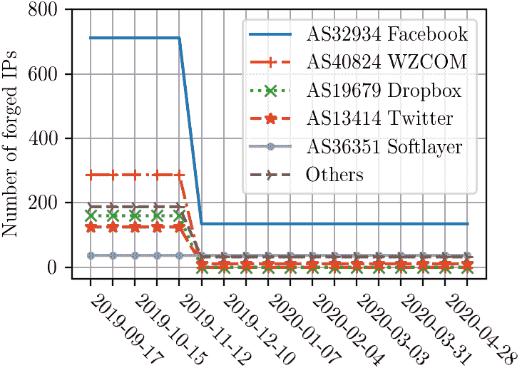
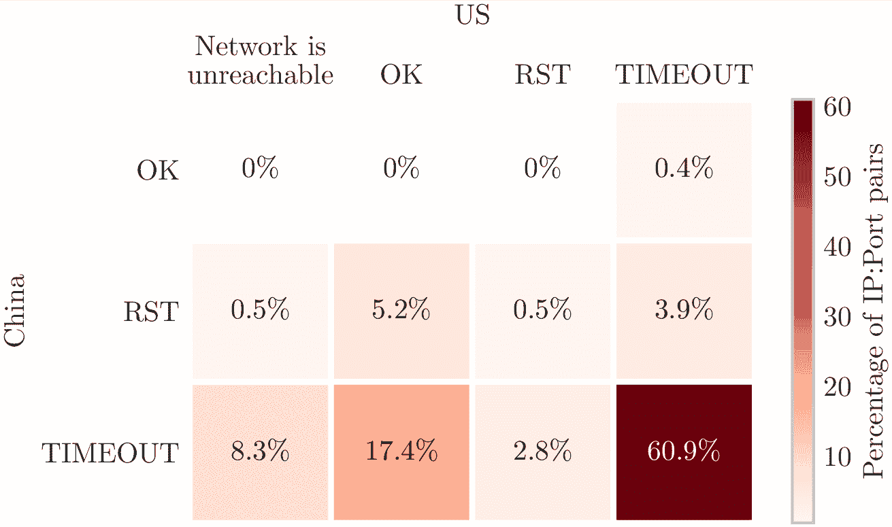
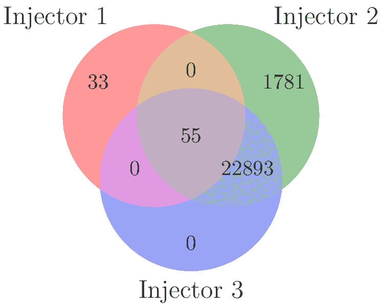
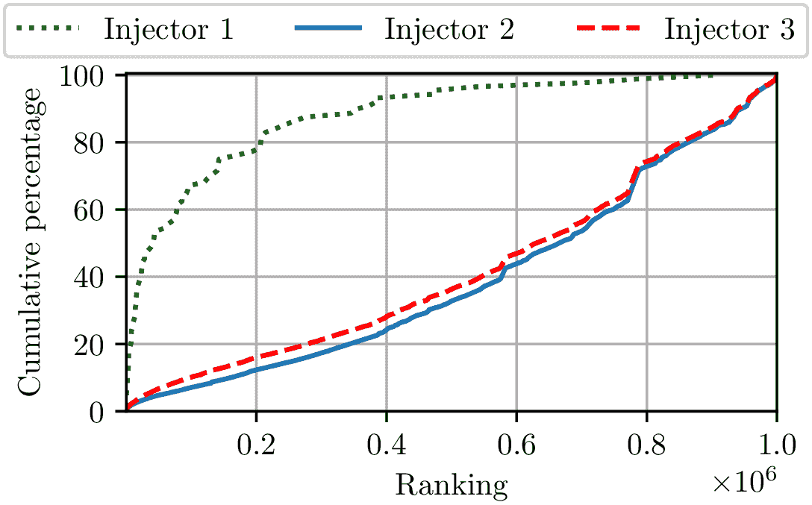
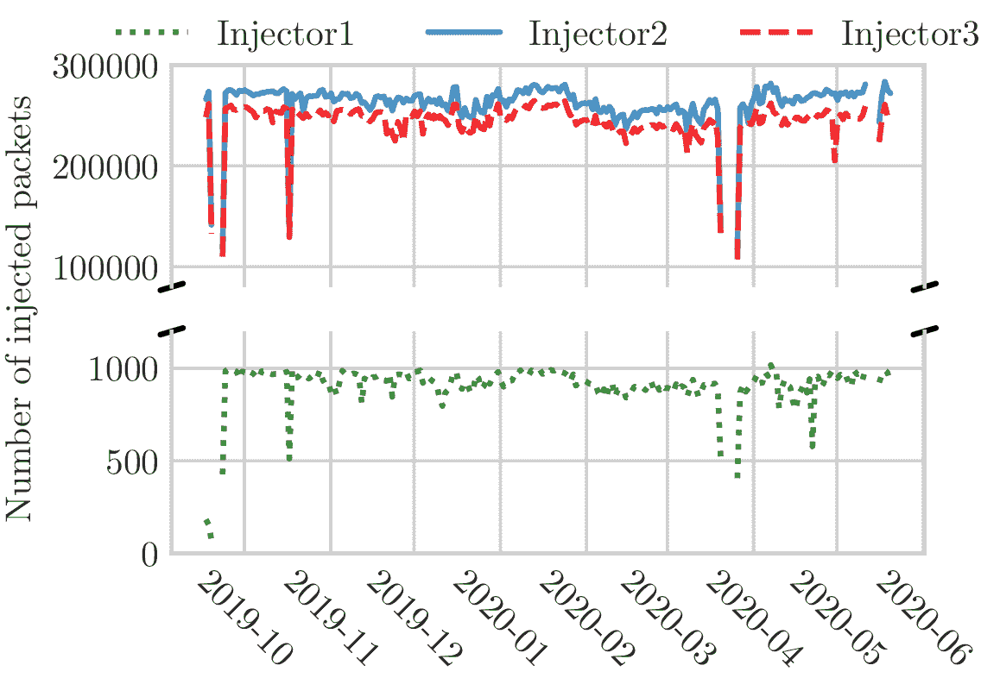
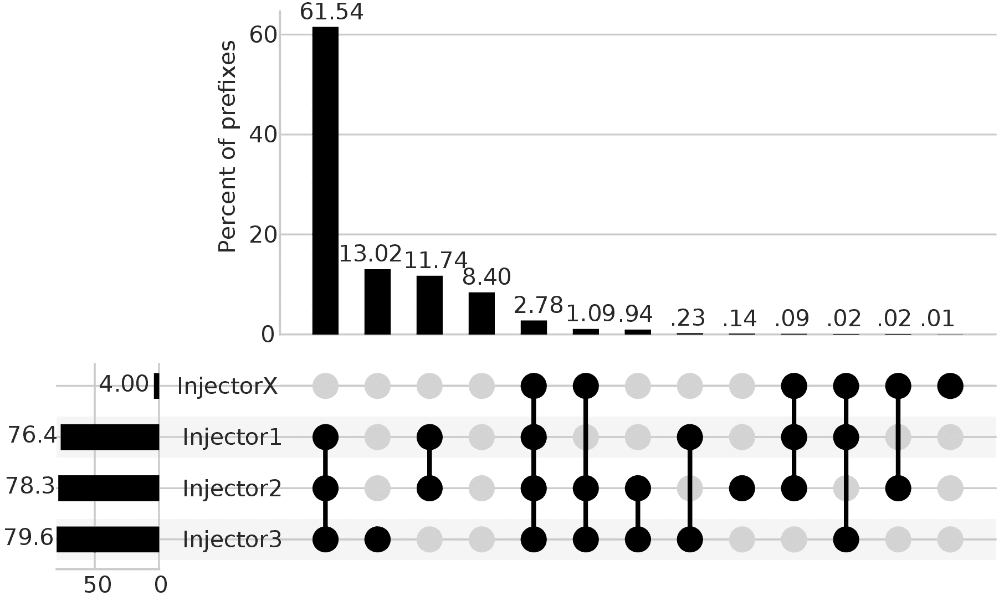

<!--yml
category: 防火墙
date: 2026-06-12 19:02:13
-->

# 三重审查：揭秘防火长城的DNS审查行为

> 来源：[https://gfw.report/publications/foci20_dns/zh/](https://gfw.report/publications/foci20_dns/zh/)

# 三重审查：揭秘防火长城的DNS审查行为

Arian Akhavan Niaki

University of Massachusetts Amherst

Nguyen Phong Hoang

Stony Brook University

Phillipa Gill

University of Massachusetts Amherst

Amir Houmansadr

University of Massachusetts Amherst

中国的防火长城（GFW）长期以来一直使用DNS数据包注入来审查互联网访问。在这项工作中，我们使用Alexa前100万个域名作为测试列表分析了GFW在九个月内的DNS注入行为。我们首先专注于理解GFW使用的公共可路由IP，并观察到用于过滤特定域名集合的IP组。我们还注意到，2019年11月，GFW注入的公共IP数量急剧下降。然后，我们对我们测量中观察到的三种不同的注入器进行了指纹识别。值得注意的是，其中一个注入器将其注入数据包中的IP TTL值与探测数据包中的TTL值保持一致，这对于使用TTL限制的探测来定位审查者具有重要意义。最后，我们确认我们的观察结果通常适用于中国注册的IP前缀。

许多国家都以注入DNS响应的方式实施审查  [[3](#cite:Aryan2013a), [8](#cite:), [15](#cite:Gill2015a), [21](#cite:Niaki2020a), [28](#cite:Verkamp2012a)]，而中国防火长城（GFW）使用DNS注入的情况尤为引人关注，成为了研究的热点之一 [[1](#cite:Anonymous2014a), [2](#cite:gfwreport2020b), [10](#cite:Duan2012a), [11](#cite:Farnan2016a), [14](#cite:gfwrev2009a), [16](#cite:Hoang2019a)-[18](#cite:Lowe2007a), [22](#cite:Pearce2017b), [26](#cite:Sparks2012a), [30](#cite:Yan2006a)]。虽然其他国家倾向于使用NXDOMAIN或保留的IP地址空间  [[3](#cite:Aryan2013a), [4](#cite:rfc8020), [8](#cite:Chaabane2014a), [20](#cite:Nabi2013a)]，但中国使用各种组织拥有的公共IP地址范围的情况非常引人注目。这种使用公共IP地址的做法可能会使中国基于DNS的审查的检测变得复杂  [[5](#cite:censored-plannet-Satellite-Iris), [12](#cite:Filasto2012a), [21](#cite:Niaki2020a)]，并且可能使规避GFW的意外DNS缓存污染变得具有挑战性  [[10](#cite:Duan2012a), [26](#cite:Sparks2012a)]。

虽然关于中国的DNS审查已经有了许多研究  [[1](#cite:Anonymous2014a), [2](#cite:gfwreport2020b), [10](#cite:Duan2012a), [11](#cite:Farnan2016a), [14](#cite:gfwrev2009a), [16](#cite:Hoang2019a)-[18](#cite:Lowe2007a), [22](#cite:Pearce2017b), [26](#cite:Sparks2012a)]（部分原因是GFW会向国外的客户端注入回复），但在这项研究中，我们采取了纵向的方法，专注于中国使用公共IP进行过滤的情况。我们对中国的DNS注入器进行了为期九个月的测量，这使我们能够观察到GFW使用的公共IP地址集合的变化（[§2](#sec:2-methodology)）。我们进一步进行了有针对性的测量，以指纹识别GFW的DNS数据包注入器的行为，并考虑了我们的结果在中国的自治系统（AS）通告的3.6万个前缀中的普适性（[§5](#sec:5-multipath-results)）。

我们的研究揭示了中国过滤系统的几个先前未知的特性：

IP组。首先，我们观察到一组IP地址被用于注入回复到特定的域名集合（[§3](#sec:3-characterizing-dns-injection)）。这些组可能指向被一个共同的基础设施或阻断流程阻断的域名组。我们在阻断的域名和随时间使用的阻断IP上讨论了这些组（[§3.2](#sec:3.2-injected-ips)）

三种不同的注入器。我们还观察到单个DNS查询可能会导致GFW注入的多个DNS回复。通过使用IP ID、IP TTL、DNS TTL和DNS标志，我们能够对这些多个回复进行指纹识别，并确定三种不同的用于DNS请求的数据包注入器（[§4.1](#sec:4.1-fingerprinting-the-injectors)）。

注入数据包中的TTL回显。在对审查器进行指纹识别的过程中，我们观察到其中一个数据包注入器实际上会回显探测数据包的TTL，这对于使用TTL限制的探测数据包定位网络审查的常用技术具有重要意义（[§4.3](#sec:4.3-localizing-the-injectors)）。

我们现在描述我们用于纵向监测中国基于DNS的审查的方法论（[§2.1](#sec:2.1-baseline-longitudinal-experiment)）以及我们如何扩展此方法来了解不同地区的过滤差异（[§2.2](#sec:2.2-multipath-experiment)）。我们还讨论了在进行实验时采取的解决道德问题的步骤（[§2.3](#sec:2.3-ethics)）。

我们使用了一种常用的策略，即从中国以外的主机向位于中国的IP地址（特别是那些不托管DNS服务器的地址）发出可能敏感的域名的DNS查询。这样一来，当我们的数据包穿过GFW时，就可以触发GFW，而选择不托管DNS服务器的IP地址意味着我们查询的任何响应都可以被推断为是GFW注入的。我们从一个位于美国学术网络的运行Ubuntu 18.04 LTS的虚拟专用服务器（VPS）发出查询。然后，我们向一个位于中国的我们控制的VPS发送具有与我们的美国主机相同配置的DNS查询。我们使用标准DNS端口（53）执行查询。我们在端口1-65535上进行了初步测试，只观察到在端口53上发送的DNS查询上进行了审查。

有了这个源主机和目标主机，然后我们为一组测试域名发出DNS查询。在我们的情况下，我们从Alexa前100万个网站列表（于2019年2月22日访问）中提取了一组100万个域名。对于任何没有前缀“www.”的域名，我们都添加了此前缀，因为GFW在缺少此前缀时不一致地注入DNS回复  [[1](#cite:Anonymous2014a), [9](#cite:Chai2019a)]。我们在2019年9月至2020年5月之间每两个小时查询这些域名。总计，我们发送了28亿次DNS查询，并观察到GFW伪造了1.196亿次响应。

我们基线方法的一个局限性是，我们只会观察到美国的VPS和中国的VPS之间的路径上的过滤。为了补充这种方法，我们进行了额外的实验，将DNS查询指向广泛范围的中国IP前缀。我们通过使用CAIDA的AS-to-organization数据集  [[6](#cite:as2org)]来识别中国注册的自治系统编号（ASN），进而确定中国IP前缀。然后，我们使用CAIDA的prefix-to-AS映射工具  [[7](#cite:pfx2as)]来收集这些自治系统通告的IP前缀，总共有36,629个前缀。

在每个前缀内，我们随机选择一个IP地址，确保此IP地址没有托管会响应DNS查询的主机。为了确定这一点，我们向候选IP地址发送10个对非敏感域名 www.baidu.com 的查询。如果我们的DNS查询没有任何回复，我们推断此IP不托管DNS服务器，然后继续我们的测试。如果我们在50次尝试后找不到未响应的IP地址，则将IP前缀排除在测试之外。总计，我们选择了36,146个IP前缀，属于417个中国自治系统。

对于这个测试，我们专注于一个单一的域名 www.google.sm ，我们观察到这个域名触发了我们基线实验中观察到的三个数据包注入器的审查（[§4](#sec:4-understanding-the-gfw-injectors)），因为我们的目标是理解多个网络路径的行为。我们尝试向我们识别的每个中国前缀查询此域名100次。

对于我们的基线实验，我们发送DNS查询的两个主机都是我们控制的机器。对于我们的多路径实验，我们首先验证所选IP地址上是否运行了DNS服务。我们还注意到，我们的实验是从中国以外的主机发起的，因此对于GFW来说，查询似乎来自外部（学术）网络，而不是中国境内的任何主机。最后，我们的多路径实验限制了发送到每个IP地址的流量量为1 MB。

在本节中，我们描述随时间过滤的域名（[§3.1](#sec:3.1-censored-domains)）以及注入回复中的IP地址（[§3.2](#sec:3.2-injected-ips)）。

[**图1**](#fig:1-censored-domain-name-changes-sept-to-may): 从2019年9月至2020年5月，Alexa前100万名中被审查的域名变化。

 | 类别 | Alexa% | 类别 | 被审查% |
| 商业 | 27.7 | 代理规避 | 46.0 |
| 信息技术 | 13.3 | 个人网站 | 43.0 |
| 购物 | 5.9 | 明显暴力 | 20.5 |
| 教育 | 5.7 | 极端主义团体 | 10.0 |
| 个人网站 | 4.4 | 其他成人内容 | 9.4 |
| 新闻和媒体 | 4.1 | 内容服务器 | 9.3 |
| 娱乐 | 3.5 | 动态 DNS | 7.3 |
| 色情 | 2.8 | 色情 | 6.2 |
| 健康和健身 | 2.7 | 歧视 | 5.3 |
| 政府和法律组织 | 2.6 | 即时通讯 | 4.2 |

[表1:](#tbl:1-fortiguard-categories-alexa-domains-censored-percentage) FortiGuard类别。Alexa百万域名测试列表上最常见的10个类别以及每个类别中被审查域名的百分比。 

我们看到，GFW 对被审查的域名数量存在逐渐增加的趋势。在我们进行的九个月的测量研究中，被审查的域名数量从23,995增加到24,636（增长了2.8%）。[图1a](#fig:1a-domain-churn-gfws-all)显示了随时间变化的被审查唯一域名的数量。有趣的是，先前的研究 [[1](#cite:Anonymous2014a)]也表明，他们在2014年的研究中看到了被审查域名数量的增长，增长了10%（也使用了Alexa百万域名作为他们的测试域名）。

[图1b](#fig:1b-domain-churn-b)描绘了每天从Alexa百万域名中被添加和移除的域名数量。我们手动分析了从被阻止集合中移除超过20个域名的日期，在11月18日，移除了一个包含关键词 youtube.com 的50个域名，而在11月22日，移除了一个包含关键词 line.me 的22个域名。这表明GFW仍然通过关键词来审查域名，而不是维护一个固定的域名集合。

被审查域名的类别。 我们利用由FortiNet运营的“FortiGuard” URL分类服务 [[13](#cite:fortinet)] 对Alexa百万域名进行分类。Alexa列表中排名靠前的类别列在[表1](#tbl:1-fortiguard-categories-alexa-domains-censored-percentage)的左列中。我们进一步分析了Alexa百万域名列表中每个类别中被审查域名的百分比。在[表1](#tbl:1-fortiguard-categories-alexa-domains-censored-percentage)的右列中显示了具有最高被审查域名百分比的前10个类别。我们可以看到，“代理规避”类别中有46%的域名被GFW审查。对于“个人网站”类别中的高数量（42.9%被审查的域名），是因为“个人网站”类别中42.7%的被审查域名都包含 .blogspot.com 或 .tumblr.com 关键词，这些域名似乎被GFW过滤了。我们进一步分析发现，这实际上是一个基于关键词的阻止列表，即任何以 .blogspot.com 或 .tumblr.com 结尾的域名都将被GFW审查。

[**图2**](#fig:2-top-asns-injected-ip-addresses): 头部自治系统编号和GFW使用的注入IP地址数目。

纵向趋势。我们观察到GFW注入的类型A DNS记录返回了一组不同的1,510个IP地址。虽然我们观察到的大部分响应都是类型A DNS记录，但我们观察到了单个域名（www.sunporno.com）的注入的CNAME记录。本文重点研究了A类型记录，并计划在未来的工作中深入研究GFW使用CNAME记录的情况。

[图2](#fig:2-top-asns-injected-ip-addresses)显示了由GFW注入的IP地址所属的前几个自治系统。我们观察到与注入IP地址关联的总共有41个自治系统。其中大部分自治系统对应于美国的组织，尤其是Facebook、WZCOM、Dropbox和Twitter。我们注意到在 2019年11月23日，注入的IP地址数量从1,510个（关联了41个自治系统）骤降到了仅有216个（关联了21个自治系统）。我们在[第4节](#sec:4-understanding-the-gfw-injectors)中进一步调查了这一注入 IP 数量的下降。

注入IP的分组。我们注意到被注入的IP的一个特性是，某些被封锁的域名子集解析为一组固定的公共IP。也就是说，一组公共IP被用来过滤给定的一组被封锁的域名。[表2](#tbl:2-sensitive-domains-ip-groups-injectors-after-decrease) 描述了我们确定的六个不同的域名组。我们进一步对每个组中的域名进行了分类。组1、2和3中的域名中，顶级类别属于“代理规避”类别，而组4和5中的97%的域名包含关键词 google ，属于“搜索引擎”类别。组6包括了Alexa百万域名中被封锁的其余网站，这些网站大多与 blogspot 和 tumblr 相关。我们分析了11月23日从IP池中删除的IP，并发现接收到这些IP的99%的域名目前接收到了197个注入的IP（组 6），其中绝大多数（99%）的域名中含有关键词 tumblr.com。

 | 组别 | 域名数量 | IP数量 | 顶级类别% |
| 1 | 8 | 3 | 代理规避 50.0% |
| 商业 25.0% |
| 个人网站 12.5% |
| 2 | 53 | 4 | 代理规避 36.0% |
| 新闻和媒体 9.4% |
| 即时通讯 7.5% |
| 3 | 48 | 10 | 代理规避 79.2% |
| 信息技术 10.4% |
| 信息与计算机安全 2.1% |
| 4 | 33 | 4 | 搜索引擎 96.9% |
| 动态DNS 3.1% |
| 5 | 54 | 201 | 搜索引擎 96.3% |
| 商业 1.8% |
| 未知 1.8% |
| 6 | ~24K | 197 | 个人网站 76.7% |
| 色情 6.3% |
| 信息技术 2.8% |

[表2:](#tbl:2-sensitive-domains-ip-groups-injectors-after-decrease) 关于减少注入IP地址数量后，敏感域名、伪造IP分组和注入器之间关系的概述。 

被注入的IP地址的可达性。 考虑到中国正在使用公共可路由的IP地址，一个自然的问题是这些IP地址是否托管内容或者在更广泛的互联网上是可达的。我们通过在中国和美国的VPS上初始化端口80和端口443上的TCP握手来测试注入IP地址的可达性。我们每天进行这个实验并持续七天，并将结果平均在[图3](#fig:3-reachability-of-ports-and-injected-ips)中呈现。我们注意到每天的结果看起来都很相似。在大多数情况下（60.9%），TCP握手尝试在美国和中国的源主机上都超时，这表明在我们测量时可能没有从这些IP地址提供内容。这些IP地址过去可能提供过内容，这导致它们被添加到被注入IP地址的集合中。

[**图3**](#fig:3-reachability-of-ports-and-injected-ips): 从中国和美国到注入IP地址的端口80和443的可达性。数字是平均值，持续七天。

我们现在描述观察到多个注入的DNS回复的情况。我们能够对这些回复进行指纹识别，并识别出三个不同的注入过程 ([§4.1](#sec:4.1-fingerprinting-the-injectors))。我们描述了注入器的纵向趋势 ([§4.2](#sec:4.2-longitudinal-trends))。最后，我们还定位了这些注入器，并观察到一个注入器反映了探测TTL值的奇特镜像情况 ([§4.3](#sec:4.3-localizing-the-injectors))。

[**图4**](#fig:4-ipid-ttl-values-dns-injector-behaviors): 我们测量中观察到的三种DNS注入器行为的IPID和TTL值。注入器1类似于之前在  [[1](#cite:Anonymous2014a)] 中观察到的情况。 我们观察到第三个注入器反映了IP TTL值，导致当我们的查询的初始IP TTL值不变时，出现了固定的值。

 | 注入器 | 描述 | IP数量 | 域名数量 | IP组 |
| 1 | DNS: TTL=60; AA=1 | 4 | 88 | 4, 5, 6 |
| IP: DF=0 |
| 递增的IP TTL |
| 2 | DNS: AA=0 | 1,506 | 24,729 | 1, 2, 3 |
| IP: DF=1 | 5, 6 |
| 随机化的IP TTL |
| 3 | DNS: AA=0 | 958 | 22,948 | 1, 2, 3, 5 |
| IP: DF=0; ID=0 |
| 固定的IP TTL |

[表3:](#tbl:3-summary-dns-injectors-dns-aa-ip-df-flags) 三个DNS注入器的摘要。“DNS AA”指DNS权威回答标志。“IP DF”指IP“不分段”标志。 

[**图5**](#fig:5-domains-receiving-injected-responses-combinations): 三个观察到的DNS注入器注入的不同响应组合接收到的域名数量的文氏图。

[**图6**](#fig:6-cdf-censored-domains-popularity-ranking-injector): 各注入器对被审查域名的受欢迎程度排名的累积分布。

在我们的测量中，我们观察到单个DNS查询可能导致多个注入的DNS回复。经过仔细检查，我们能够根据IP不分段 (DF)、IP TTL、DNS权威回答 (AA) 和DNS TTL字段在这些多个注入的回复中识别出三种不同的指纹。[表3](#tbl:3-summary-dns-injectors-dns-aa-ip-df-flags)总结了三个注入器的指纹，[图4](#fig:4-ipid-ttl-values-dns-injector-behaviors)绘制了这三个注入器在查询被迅速连续发送时的IPID和TTL值。 此外，我们还发现这三个注入器在格式化它们的DNS回复方面也略有不同。具体来说，注入器1在DNS回复中原样使用查询中的域，而注入器2和3使用“压缩指针” [[19](#cite:rfc1035)] 减少响应中查询域的重复，这可能是这些注入器在操作中使用不同代码库的迹象。

与之前的工作相似  [[1](#cite:Anonymous2014a)]，我们观察到注入器1在连续数据包之间具有递增的IP TTL值。然而，我们发现这个注入器在过滤的域名数量方面要少得多。[图5](#fig:5-domains-receiving-injected-responses-combinations)显示了每个注入器观察到的收到注入回复的域名数量。我们可以看到，注入器1最接近2014年观察到的注入器，仅过滤了总共88个域名。

有趣的是，我们没有观察到只触发注入器3的域名，它只对注入器2的域名子集进行操作。当我们考虑注入器与IP/域名组之间的关系时 (参见[表3](#tbl:3-summary-dns-injectors-dns-aa-ip-df-flags))，我们发现注入器1是唯一一个在第四个IP/域名组中过滤IP的注入器，其中有33个域名，主要属于“搜索引擎”类别 (参见[表2](#tbl:2-sensitive-domains-ip-groups-injectors-after-decrease))。

虽然[图5](#fig:5-domains-receiving-injected-responses-combinations)给出了每个注入器过滤的域名数量的概念，但它并不一定反映了注入器触发的频率。为此，我们考虑了每个注入器操作的域名的受欢迎程度。 [图6](#fig:6-cdf-censored-domains-popularity-ranking-injector)显示了每个注入器相对于它们的Alexa排名对过滤域名的累积百分比。在这里，我们看到由注入器1过滤的域名往往比其他注入器过滤的域名更受欢迎。由注入器1过滤的域名中，97%包含关键字google，其中90%在Alexa前350K个域中。而由注入器2和3过滤的域名中，大多数 (80%) 是 *.blogspot和.*tumblr域名，位于Alexa前100万列表的长尾中 [[25](#cite:scheitle2018long)]。

注入器的停止间隔。[图7](#fig:7-total-injected-packets-per-day)显示了每天注入的总数据包数。由于我们测量的频率，我们无法发现少于两小时的间隔。在以两小时为基础进行数据分析时，我们发现，尽管注入器2已连续工作，但注入器1和注入器3偶尔会停止工作几个小时。具体来说，注入器1的三个停止间隔分别是2019年9月18日的13:00至15:22，2019年9月19日的9:26至13:00，以及2019年9月19日的17:06至10:22。注入器3的唯一停止间隔是5月1日的2:36至8:00（北京时间）。我们注意到，实际的停止往往是我们发现的子间隔。所有这些偶尔发生的停止都持续不6小时，其中大部分发生在中国的工作时间内。

[**图7**](#fig:7-total-injected-packets-per-day)：每天注入的总数据包数每个注入器在时间上接收。所有的间隔都是由于测量中的中断。

注入器和在[图2](#fig:2-top-asns-injected-ip-addresses)中看到的IP丢失之间的关系。 我们分析了注入器随时间使用的IP，特别是在2019年11月注入的不同IP数量减少之前和之后。减少对注入器1没有影响，因为它始终使用相同的四个不同IP。然而，注入器2和注入器3最初分别使用了958和1,506个IP来发送注入的DNS回复。在降低后，注入器2和3都使用相同的IP池（共有212个IP）来发送它们的注入DNS回复。

接下来，我们尝试定位在[§4.1](#sec:4.1-fingerprinting-the-injectors)中识别出的三个注入器。我们使用常用的方法发送具有递增IP TTL 值的数据包，直到我们收到注入的DNS回复，以确定数据包注入器位于路径上的位置 [[1](#cite:Anonymous2014a), [18](#cite:Lowe2007a), [23](#cite:Pearce2017b), [26](#cite:Sparks2012a), [29](#cite:Xu2011a)]。对于此测试，我们关注一个触发了所有三个注入器的单个域名：www.google.sm。然后，我们从美国的VPS发送针对此域的DNS查询到中国的VPS。

根据这些TTL限制的探测，我们能够观察到注入器1和注入器2位于离我们美国VPS 15跳的位置。为了比较，我们的中国VPS距离美国VPS 25跳。然而，我们观察到了注入器3的异常行为，我们直到我们的探测数据包的初始TTL设置为29时才收到注入的DNS回复。考虑到我们探测数据包的目的地IP只有25跳的距离，这种行为似乎很不寻常。然而，经过进一步的检查，我们确定这种行为源自注入器3在其注入的回复中回显了探测数据包的递增TTL。

[图8](#fig:8-injector-ip-ttl-impacts-probing)说明了这一现象。我们发现当探测数据包的TTL为29时，到达我们美国主机时，注入的回复的IP TTL为1。同样，当探测数据包的TTL为30时，注入回复的TTL为2，依此类推。观察到这种行为所需的精确探测TTL是2n−1 ，其中n是探测主机和数据包注入器之间的跳数。我们注意到，这种讨论隐含地假设了注入器和探测主机之间的路径是对称的。这种行为可能潜在地用于识别路径上的非对称路由（当使用将触发多个注入器的域名时），但我们将更深入地分析留给未来的工作。

我们还比较了发送DNS查询和收到注入回复之间的时间，以了解注入器的位置。具体地，我们比较了三个注入器的延迟，并发现超过90%的时间，延迟相差不到0.2毫秒。这支持了这三个设备安装在同一物理位置的理论。

我们从中国以外的七个主机（我们在美国的VPS和在荷兰、新加坡、英国、法国、加拿大和印度的云托管VM）重复了这些实验，并得到了一致的结果。

[**图8**](#fig:8-injector-ip-ttl-impacts-probing). 图示了注入器3模仿DNS查询的IP TTL如何影响有限TTL探测的结果。 [图8a](#fig:8a-type3-illustration-a)显示当DNS查询的IP TTL为29时，相应的注入数据包的TTL足够高以到达发送方。 [图8b](#fig:8b-type3-illustration-b)显示当DNS查询的IP TTL低于29时，伪造响应的初始IP TTL太小，无法到达发送方。

在[第2节](#sec:2-methodology)中，我们描述了向3.6万个中国前缀发送DNS查询的方法。我们的目标是确认我们的结果对我们用于长期实验的主机位置的稳健性。 [图9](#fig:9-unique-ip-prefixes-response-types-injectorx)显示了结果：每个柱形对应于观察到的注入器组合，柱形的高度对应于观察到该注入器组合的前缀百分比。

我们将我们的查询目标指向了3.6万个前缀中的62% ，观察到了所有三个DNS注入器的情况。我们观察到12%的情况下观察到了三个注入器中的两个，以及13%的情况下只观察到了三个注入器中的一个。对于每个IP地址，我们发送100个查询，这表明这些情况不仅仅是由于瞬时的数据包丢失导致的。我们还观察到一些注入器在这个更广泛的研究中没有出现在我们的纵向数据中（在[图9](#fig:9-unique-ip-prefixes-response-types-injectorx)中以Injector X表示）。总共有大约4%的前缀观察到了与我们的指纹不匹配的注入器。

有趣的是，我们发现了8%的前缀，注册了134个自治系统（AS），其中没有触发DNS注入器。使用RIPE NCC的AS可见性工具，我们发现其中22%的前缀的可见性低于15%，这表明我们的查询可能永远不会到达这些前缀。对于剩下的前缀，我们使用Team Cymru提供的基于RIR的IP到ASN映射，并发现其中一半的前缀是注册在中国以外的地区（例如，一个中国公司在ARIN注册了一个IP地址）。在这些情况下，前缀可能位于中国以外，不受审查。值得注意的是，仍然有1027个IP前缀似乎位于中国境内，但没有观察到注入的数据包。这些IP前缀对应着120个自治系统。经过进一步检查，我们发现这些自治系统往往与技术公司或政府机构有关。

[**图9**](#fig:9-unique-ip-prefixes-response-types-injectorx): 响应不同类型的唯一IP前缀的数量。 InjectorX指的是具有与总结不同指纹的注入器。

在这项工作中，我们分析了GFW在九个月内的DNS投毒行为。我们观察到一组IP地址被用于审查特定组域名，并识别出三种不同的DNS数据包注入器。我们定位和描述了这些注入器的行为，并确定了一种模仿探测数据包TTL的注入器，这对使用TTL受限数据包来定位DNS审查具有重要意义。

我们已经发布了我们的代码和数据集，以保持可重现性并激发未来的工作，可在[https://gfw.report/publications/foci20_dns/en/](https://gfw.report/publications/foci20_dns/en/)获取。

我们要感谢我们的导师Anita Nikolich对我们的认真反馈和指导。我们还要感谢Nicholas Weaver对注入器行为的有益讨论。这项工作得到了Google教师研究奖、NSF CAREER基金CNS1553301、NSF基金CNS1740895和CNS1719386的资助，以及开放技术基金会在信息控制奖学金下的支持。

1.  Anonymous. Towards a comprehensive picture of the Great Firewall’s DNS censorship. In *Free and Open Communications on the Internet*, USENIX, 2014. [https://www.usenix.org/system/files/conference/foci14/foci14-anonymous.pdf.](https://www.usenix.org/system/files/conference/foci14/foci14-anonymous.pdf)
2.  Anonymous. GFW Archaeology: gfw-looking-glass.sh, March 2020. [https://gfw.report/blog/gfw_looking_glass/en/.](https://gfw.report/blog/gfw_looking_glass/en/)
3.  Simurgh Aryan, Homa Aryan, and J. Alex Halderman. Internet censorship in Iran: A first look. In *Free and Open Communications on the Internet*, USENIX, 2013. [https://censorbib.nymity.ch/pdf/Aryan2013a.pdf.](https://censorbib.nymity.ch/pdf/Aryan2013a.pdf)
4.  S. Bortzmeyer and S. Huque. NXDOMAIN: There Really Is Nothing Underneath. RFC 8020, IETF, November 2016. [https://tools.ietf.org/html/rfc8020.](https://tools.ietf.org/html/rfc8020)
5.  CensoredPlanet: Satellite and Iris. Available at [https://censoredplanet.org/projects/satellite.](https://censoredplanet.org/projects/satellite)
6.  Center for Applied Internet Data Analysis. Inferred AS to Organization Mapping Dataset. Web page, Accessed 2020. [https://www.caida.org/data/as-organizations/.](https://www.caida.org/data/as-organizations/)
7.  Center for Applied Internet Data Analysis. Routeviews Prefix to AS mappings Dataset for IPv4 and IPv6\. Web page, Accessed 2020. [http://www.caida.org/data/routing/routeviews-prefix2as.xml.](http://www.caida.org/data/routing/routeviews-prefix2as.xml)
8.  Abdelberi Chaabane, Terence Chen, Mathieu Cunche, Emiliano De Cristofaro, Arik Friedman, and Mohamed Ali Kaafar. Censorship in the wild: Analyzing Internet filtering in Syria. In *Internet Measurement Conference*, ACM, 2014. [http://conferences2.sigcomm.org/imc/2014/papers/p285.pdf.](http://conferences2.sigcomm.org/imc/2014/papers/p285.pdf)
9.  Zimo Chai, Amirhossein Ghafari, and Amir Houmansadr. On the importance of encrypted-SNI (ESNI) to censorship circumvention. In *Free and Open Communications on the Internet*, USENIX, 2019. [https://www.usenix.org/system/files/foci19-paper_chai_update.pdf.](https://www.usenix.org/system/files/foci19-paper_chai_update.pdf)
10.  Haixin Duan, Nicholas Weaver, Zongxu Zhao, Meng Hu, Jinjin Liang, Jian Jiang, Kang Li, and Vern Paxson. Hold-On: Protecting against on-path DNS poisoning. In *Securing and Trusting Internet Names*, National Physical Laboratory, 2012. [http://conferences.npl.co.uk/satin/papers/satin2012-Duan.pdf.](http://conferences.npl.co.uk/satin/papers/satin2012-Duan.pdf)
11.  Oliver Farnan, Alexander Darer, and Joss Wright. Poisoning the well – exploring the Great Firewall’s poisoned DNS responses. In *Workshop on Privacy in the Electronic Society*, ACM, 2016. [https://dl.acm.org/authorize?N25517.](https://dl.acm.org/authorize?N25517)
12.  Arturo Filastò and Jacob Appelbaum. OONI: Open observatory of network interference. In *Free and Open Communications on the Internet*, USENIX, 2012. [https://www.usenix.org/system/files/conference/foci12/foci12-final12.pdf.](https://www.usenix.org/system/files/conference/foci12/foci12-final12.pdf)
13.  FortiGuard Labs Web Filter, Accessed 2018. [https://fortiguard.com/webfilter.](https://fortiguard.com/webfilter)
14.  gfwrev. 深入理解GFW: DNS污染, November 2009. [https://gfwrev.blogspot.com/2009/11/gfwdns.html.](https://gfwrev.blogspot.com/2009/11/gfwdns.html)
15.  Phillipa Gill, Masashi Crete-Nishihata, Jakub Dalek, Sharon Goldberg, Adam Senft, and Greg Wiseman. Characterizing web censorship worldwide: Another look at the OpenNet Initiative data. *Transactions on the Web*, 9(1), 2015. [https://censorbib.nymity.ch/pdf/Gill2015a.pdf.](https://censorbib.nymity.ch/pdf/Gill2015a.pdf)
16.  Nguyen Phong Hoang, Sadie Doreen, and Michalis Polychronakis. Measuring I2P censorship at a global scale. In *Free and Open Communications on the Internet*, USENIX, 2019. [https://www.usenix.org/system/files/foci19-paper_hoang.pdf.](https://www.usenix.org/system/files/foci19-paper_hoang.pdf)
17.  Nguyen Phong Hoang, Arian Akhavan Niaki, Nikita Borisov, Phillipa Gill, and Michalis Polychronakis. Assessing the Privacy Benefits of Domain Name Encryption. In *ACM ASIACCS 2020*. [https://arxiv.org/pdf/1911.00563.pdf.](https://arxiv.org/pdf/1911.00563.pdf)
18.  Graham Lowe, Patrick Winters, and Michael L. Marcus. The great DNS wall of China. Technical report, New York University, 2007. [https://censorbib.nymity.ch/pdf/Lowe2007a.pdf.](https://censorbib.nymity.ch/pdf/Lowe2007a.pdf)
19.  P. Mockapetris. DOMAIN NAMES - IMPLEMENTATION AND SPECIFICATION. RFC 1035, IETF, November 1987. [https://tools.ietf.org/html/rfc1035.](https://tools.ietf.org/html/rfc1035)
20.  Zubair Nabi. The anatomy of web censorship in Pakistan. In *Free and Open Communications on the Internet*, USENIX, 2013. [https://censorbib.nymity.ch/pdf/Nabi2013a.pdf.](https://censorbib.nymity.ch/pdf/Nabi2013a.pdf)
21.  Arian Akhavan Niaki, Shinyoung Cho, Zachary Weinberg, Nguyen Phong Hoang, Abbas Razaghpanah, Nicolas Christin, and Phillipa Gill. ICLab: A global, longitudinal internet censorship measurement platform. In *Symposium on Security & Privacy*, IEEE, 2020. [https://people.cs.umass.edu/~phillipa/papers/oakland2020.pdf.](https://people.cs.umass.edu/~phillipa/papers/oakland2020.pdf)
22.  Paul Pearce, Ben Jones, Frank Li, Roya Ensafi, Nick Feamster, Nick Weaver, and Vern Paxson. Global measurement of DNS manipulation. In *USENIX Security Symposium*, USENIX, 2017. [https://www.usenix.org/system/files/conference/usenixsecurity17/sec17-pearce.pdf.](https://www.usenix.org/system/files/conference/usenixsecurity17/sec17-pearce.pdf)
23.  Thomas H Ptacek and Timothy N Newsham. Insertion, evasion, and denial of service: Eluding network intrusion detection. Technical report, Secure Networks inc Calgary Alberta, 1998. [https://users.ece.cmu.edu/~adrian/731-sp04/readings/Ptacek-Newsham-ids98.pdf.](https://users.ece.cmu.edu/~adrian/731-sp04/readings/Ptacek-Newsham-ids98.pdf)
24.  RIPE NCC AS Visibility Tool, Accessed 2020. [https://stat.ripe.net.](https://stat.ripe.net)
25.  Quirin Scheitle, Oliver Hohlfeld, Julien Gamba, Jonas Jelten, Torsten Zimmermann, Stephen D Strowes, and Narseo Vallina-Rodriguez. A long way to the top: Significance, structure, and stability of internet top lists. In *Proceedings of the Internet Measurement Conference 2018*, 2018. [https://dl.acm.org/doi/pdf/10.1145/3278532.3278574.](https://dl.acm.org/doi/pdf/10.1145/3278532.3278574)
26.  Sparks, Neo, Tank, Smith, and Dozer. The collateral damage of Internet censorship by DNS injection. *SIGCOMM Computer Communication Review*, 42(3):21–27, 2012. [http://conferences.sigcomm.org/sigcomm/2012/paper/ccr-paper266.pdf.](http://conferences.sigcomm.org/sigcomm/2012/paper/ccr-paper266.pdf)
27.  Team Cymru IP to ASN Mapping Service, Accessed 2020. [https://team-cymru.com/community-services/ip-asn-mapping/.](https://team-cymru.com/community-services/ip-asn-mapping/)
28.  John-Paul Verkamp and Minaxi Gupta. Inferring mechanics of web censorship around the world. In *Free and Open Communications on the Internet*, USENIX, 2012. [https://www.usenix.org/system/files/conference/foci12/foci12-final1.pdf.](https://www.usenix.org/system/files/conference/foci12/foci12-final1.pdf)
29.  Xueyang Xu, Z. Morley Mao, and J. Alex Halderman. Internet censorship in China: Where does the filtering occur? In *Passive and Active Measurement Conference*, Springer, 2011. [https://web.eecs.umich.edu/~zmao/Papers/china-censorship-pam11.pdf.](https://web.eecs.umich.edu/~zmao/Papers/china-censorship-pam11.pdf)
30.  Boru Yan, Binxing Fang, Bin Li, and Yao Wang. DNS欺骗攻击的检测和防范. 计算机工程, 32(21):130–132, 2006. [https://web.archive.org/web/20200726140258/https://tomcat.one/files/papers/DNS%E6%AC%BA%E9%AA%97%E6%94%BB%E5%87%BB%E7%9A%84%E6%A3%80%E6%B5%8B%E5%92%8C%E9%98%B2%E8%8C%83_%E9%97%AB%E4%BC%AF%E5%84%92.pdf.](https://web.archive.org/web/20200726140258/https://tomcat.one/files/papers/DNS%E6%AC%BA%E9%AA%97%E6%94%BB%E5%87%BB%E7%9A%84%E6%A3%80%E6%B5%8B%E5%92%8C%E9%98%B2%E8%8C%83_%E9%97%AB%E4%BC%AF%E5%84%92.pdf)

* * *