<!--yml
category: 防火墙
date: 2026-06-12 19:01:10
-->

# 中国的防火长城是如何检测和封锁完全加密流量的

> 来源：[https://gfw.report/publications/usenixsecurity23/zh/](https://gfw.report/publications/usenixsecurity23/zh/)

# 中国的防火长城是如何检测和封锁完全加密流量的

Jackson Sippe

University of Colorado Boulder

Danesh Sivakumar

University of Maryland

Jack Burg

University of Maryland

Peter Anderson

Independent researcher

Xiaokang Wang

V2Ray Project

Kevin Bock

University of Maryland

Amir Houmansadr

University of Massachusetts Amherst

Dave Levin

University of Maryland

Eric Wustrow

University of Colorado Boulder

全加密协议是翻墙生态系统中的一块基石。这类协议对数据包有效载荷的*每一个*字节都进行了加密，以期让流量"看起来什么都不像"。2021年11月初，中国的防火长城（GFW）部署了一种新的审查技术，这种技术可以实时地被动检测并阻断全加密流量。GFW这一新添的审查能力影响到一大批流行的翻墙协议，包括但不限于Shadowsocks、VMess和Obfs4。虽然中国长期以来一直采用*主动*探测来识别此类协议，但这次是第一次有关于采用*纯被动*检测来识别全加密流量的报告。面对这一新的现象，反审查社区不禁要问检测是如何做到的。

在这篇论文中，我们测量并描述了GFW用于审查完全加密流量的新系统。我们发现，审查者并没有直接定义什么是完全加密流量，而是应用*粗糙但高效的启发式规则*来豁免那些不太可能是完全加密的流量；然后它阻止其余未被豁免的流量。这些启发式规则基于常见协议的指纹、1比特的占比以及可打印的ASCII字符的数量、比例和位置。我们对互联网进行扫描，并揭示了GFW都检查哪些流量和哪些IP地址。我们在一个大学网络的实时流量上模拟我们推断出的GFW的检测算法，以评估其全面性和误报率。结果表明，我们推断出的检测规则很好地覆盖了GFW实际使用的检测规则。 我们估计，如果这一检测算法被广泛地应用，它将有可能误伤大约0.6%的非翻墙互联网流量。

我们对GFW的新审查机制的理解帮助我们得出了几个实用的规避封锁的策略。我们负责任地将我们的发现和建议透露给不同的反审查工具的开发者，从而帮助数以百万计的用户成功绕开了这种新的封锁。

完全加密的翻墙协议是翻墙生态系统中的一块基石。不同于像TLS这样的协议以明文握手开始，完全加密（随机化）的协议--如VMess [[23](#Xvmess)]、Shadowsocks [[22](#Xshadowsocks)]和Obfs4 [[7](#Xobfs4)]--被设计成连接中的*每个*字节都与随机数据没有区别。这些 "看起来什么都不像 "的协议的设计理念是，它们应该很难被审查者抓住特征，因此阻断的成本很高。

2021年11月6日，中国的互联网用户报告说他们的Shadowsocks和VMess服务器被封锁了 [[10](#XAnonymous2021Shadowsocks)]。 11月8日，一个Outline [[42](#Xoutline)]开发者报告说来自中国的使用量突然下降 [[69](#XXspeed2021)]。这次封锁的开始时间恰逢2021年11月8日至11日召开的中国共产党第十九届中央委员会第六次全体会议 [[4](#XWikipediaSixthPlenary)，[1](#XWikipedia19CPC)]。能够封锁这些翻墙工具代表中国的防火长城（GFW）具备了一种全新的新能力。据我们所知，虽然中国自2019年5月以来一直在采用被动流量分析和主动探测相结合的方式来识别Shadowsocks服务器 [[5](#XAlice2020a)]，但这是审查者第一次能够*仅基于被动流量分析*，就实时地大规模封锁完全加密的代理。全加密协议对整个反审查生态系统的重要性以及GFW的未知行为，促使我们去探索和了解检测和封锁的机制原理。

在这项工作中，我们对GFW被动检测和封锁全加密流量的新系统进行了测量和描述。我们发现，审查者没有直接定义什么是完全加密的流量，而是应用了至少五条*粗糙但高效的启发式规则*来豁免那些不太可能是完全加密的流量；然后，它阻止其余未豁免的流量。这些豁免规则基于常见的协议指纹、基于1比特比例的粗略熵测试、以及第一个TCP数据包的有效载荷中可打印的ASCII字符的比例、位置和最大连续数。

由于GFW的黑箱性质，我们推断出的规则可能并不详尽；但是我们使用科罗拉多大学博尔德分校的实时网络流量，对我们推断出的检测规则进行了评估。有证据表明我们推断出的规则与GFW实际使用的规则间有非常大的重叠。我们还发现，推断出的检测算法会阻断大学网络中所有连接的大约0.6%。 可能是为了减轻假阳性引起的封锁误伤，我们的互联网扫描显示，GFW策略性地只监控26%的连接，而且只监控发往流行数据中心的特定IP范围的连接。

我们还分析了这种新形式的被动封锁与GFW广为人知的主动探测系统 [[5](#XAlice2020a)]之间的关系。二者是独立运行的。我们发现，主动探测系统也依赖于这种流量分析算法，并额外应用了一条基于数据包长度的豁免规则。因此，能够逃避这种新的封锁的规避策略，也可以帮助防止GFW识别并随后主动探测代理服务器。

我们从对这种新审查技术的理解中得出了各种规避策略。我们负责任且及时地与各种流行的反审查工具的开发者分享了我们的发现和规避建议，包括Shadowsocks [[22](#Xshadowsocks)], V2Ray [[59](#Xv2ray)], Outline [[42](#Xoutline)], Lantern [[20](#Xlantern)], Psiphon [[21](#Xpsiphon3)], 和Conjure [[33](#Xconjure)]的开发者。自2022年1月以来，这些规避策略被广泛采用和部署，已帮助*数百万用户*绕过这一新的封锁技术。据反馈，截至2023年2月，这些工具采用的所有规避策略在中国*仍然有效*。

Tschantz等人将混淆翻墙流量的方法分为两类：*隐写(steganography)*和*多态(polymorphism)* [[57](#XTschantz2016a), § V]。隐写代理的目标是使翻墙流量看起来像应该被允许的流量；多态性的目标是使翻墙流量看起来不像应该被禁止的流量。

实现隐写术的两种最常见的方法是*模仿(mimicking)*和*隧道传输(tunneling)*。Houmansadr等人 [[39](#XHoumansadr2013b)]得出结论，模仿类协议有着根本性的缺陷，并指出将原始流量通过被允许的协议进行隧道传输是一种更抗封锁的方法。Frolov和Wustrow二人 [[35](#Xtlsfingerprint)]证明，即使使用隧道传输，翻墙软件的设计者仍然需要额外的努力让翻墙协议的指纹与流行的实现方式的指纹保持完全一致，以避免受到基于协议指纹的封锁。例如，在2012年，中国和埃塞俄比亚部署了深度包检测系统，通过Tor使用的不常见的密码套件来检测Tor流量 [[44](#Xtor-cipher-list-ticket),[67](#XWinter2012a),[55](#Xtor-block-ethiopia-ciphers)]。审查设备供应商之前已经根据`meek` [[29](#XFifield2015a)]发出的TLS指纹和SNI值来识别并封锁它了 [[28](#Xmeek-cyberoam)]。

为了避免这种复杂性，许多流行的翻墙软件选择了多态的设计。实现多态性的一个常见方法是，从连接中的第一个数据包开始，就对其有效载荷进行完全加密。由于没有任何明文或固定的包头结构指纹，审查者没办法简单地使用正则表达式或通过寻找流量中的特定模式来识别代理流量。这种设计在2009年首次被引入Obfuscated OpenSSH [[16](#Xobfuscated-openssh)]。此后，Obfsproxy [[24](#Xobfsproxy)]、Shadowsocks [[22](#Xshadowsocks)]、Outline [[42](#Xoutline)]、VMess [[23](#Xvmess)]、ScrambleSuit [[68](#XWinter2013b)]、Obfs4 [[7](#Xobfs4)]都采用了这种设计。Geph4 [[58](#Xgeph4-sosistab)]、Lantern [[20](#Xlantern)]、Psiphon3 [[21](#Xpsiphon3)]和Conjure [[33](#Xconjure)]也部分采用这种设计。

完全加密的流量经常被称为“看起来什么都不像”的流量，又或者被误解为“没有特征”；然而，更准确的描述应该是"看起来像随机数据"。事实上，这种流量确实有一个使其与其他流量不同的重要特点：*完全加密的流量与随机流量是无法区分的*。由于没有可识别的头，整个连接中的流量都是均匀且高熵的，甚至在第一个数据包中就已经如此。相比之下，即使像TLS这样的加密协议也还有相对低熵的握手包，用以传达支持的版本和扩展。

2015年，Wang等人 [[61](#XWang2015a)，§5.1]利用连接中第一个数据包有效载荷的长度和高香农熵的特点来识别随机流量，比如Obfs4。同样，在2017年，Zhixin Wang发布了一个概念验证工具，其使用连接中前三个数据包有效载荷的高香农熵来识别Shadowsocks流量 [[40](#Xsssniff-isofew)]。Madeye扩展了该工具，额外使用有效载荷长度分布来检测ShadowsocksR流量 [[47](#Xsssniff-madeye)]。He等人 [[70](#XHe2019a)，§IV.A]和Liang等人 [[46](#XLiang2020a)，§II.A]使用单比特频率检测算法，而不是香农熵，来衡量Obfs4流量的随机性。2019年，Alice等人发现，GFW使用每个连接中第一个数据包的长度和熵来怀疑Shadowsocks流量 [[5](#XAlice2020a)]。

在*主动探测*攻击中，审查者向被怀疑的服务器发送精心制作的有效载荷，并测量它的反应。如果服务器以与众不同的方式回应这些探测（例如让审查者将其作为代理使用），审查者就可以识别并封锁它。 早在2011年8月，人们观察到GFW向接受过来自中国的SSH登录的外国SSH服务器发送看似随机的有效载荷 [[49](#Xactive-probing-ssh)]。2012年，GFW首先寻找一个独特的TLS密码来怀疑Tor流量；然后向可疑的服务器发送主动探测，以确认其猜测 [[67](#XWinter2012a),[66](#XWinter-obfs2-probe),[64](#Xknock-knock-tor)]。2015年，Ensafi等人对GFW针对各种协议的主动探测攻击进行了详细分析 [[27](#XEnsafi2015b)]。自2019年5月起，中国部署了一个审查系统，分两步检测和封锁Shadowsocks服务器：它首先使用每个连接中第一个数据包有效载荷的长度和熵来被动地识别可能的Shadowsocks流量，然后在分阶段地向可疑的服务器发送各种探针，以确认其猜测 [[5](#XAlice2020a)]。作为回应，研究人员提出了各种针对主动探测攻击的防御措施，包括让服务器对各种连接的反应保持一致 [[34](#XFrolov2020a)，[9](#XAnonymous2021ShadowsocksAdvise)]和*应用前置* [[45](#Xnaiveproxy)，[36](#XFrolov2020b)]。 Shadowsocks、Outline和V2Ray都采用了*防主动探测*的设计 [[34](#XFrolov2020a),[5](#XAlice2020a),[19](#XShadowsocks2022-spec),[43](#Xoutline-v1.1.0),[32](#Xoutline-changes),[71](#Xshadowsocks-rust-v1.8.5)]，使得它们自2020年9月以来在中国就没再被封锁过 [[5](#XAlice2020a)]，直到最近在2021年11月被再次封锁 [[10](#XAnonymous2021Shadowsocks)]。

我们在中国境内外的主机之间制作并发送各种测试探针，让它们被GFW观察到。我们在两个端点主机上抓包并比较流量，来观察GFW的反应。这种记录使我们能够识别任何被丢弃或被操纵的数据包，包括主动探测。

| 实验名称 | 时间跨度 | 中国节点 | 美国节点 | 章节 |
|  
* * *

 |  
* * *

 |  
* * *

 |  
* * *

 |  
* * *

 |
| 特征化测量 | 2021年11月6日 – 2022年5月18日 （6个月） | 3 (TC, BJ),1 (Ali, BJ) | 3 (DO, SFO) | §[4](#sec:reverse-engineering) |
| 复现实验 | 2023年2月16日 （1天） | 1 (TC, BJ) | 1 (DO, SFO) | §[4.1](#sec:bit-counting),§[4.2](#sec:ascii-exemption),§[4.3](#sec:allowed-protocols) |
| 主动探测 | 2022年5月19日 – 6月8日 （3周） | 1 (TC, BJ) | 2 (DO, SFO) | §[5](#sec:active-probing) |
| 网络扫描 | 2022年5月12日–13日 （2天） | 9 (TC, BJ) | 1 (Scan, Univ) | §[6](#sec:widespread) |
| 实际流量 | 2022年7月–9月 （3个月） | 1 (TC, BJ) | 1 (DO, SFO), 1 (Tap, Univ) | §[7](#sec:evaluation) |

[表 1:](#table:exp-summary) **实验时间线以及实验节点** — 我们总共用了1台阿里云北京服务器 (Ali) (自治系统号：AS37963)， 10台腾讯云北京服务器 (TC) (自治系统号：AS45090)， 4台Digital Ocean旧金山服务器(DO) (自治系统号：AS14061)， 以及两台位于科罗拉多大学博尔德分校的服务器 (Univ) (自治系统号：AS104)。

**实验时间线和实验节点。** 我们在[表1](#table:exp-summary)中总结了所有主要实验的时间线和所使用的实验节点。我们总共使用了腾讯云北京（AS45090）的10台VPS和阿里云北京（AS37963）的1台VPS。 我们没有观察到中国境内的实验节点或任何受影响的国外节点之间的审查行为有任何差异。我们使用了Digital Ocean旧金山（AS14061）的四台VPS：其中三台受到了新审查机制的影响，剩下一台则没有受到影响。我们把这四台VPS变成了水槽服务器(sink server)；也就是说，服务器监听1到65535的所有端口，接受TCP连接，但不向客户端发送任何有效载荷。我们还采用了科罗拉多大学博尔德分校（AS104）中的两台机器进行互联网扫描和实时流量分析。我们根据IP2Location数据库 [[3](#Xip2location)]检查了我们的VPS的IP地址，并确认它们的地理位置与供应商所报告的位置相符。

**触发审查制度。**因为*外界观察者是无法区分完全加密的流量与随机数据的*，所以除了使用实际的翻墙工具外，我们还开发了测量工具用来在我们的研究中发送随机数据以触发封锁。这些工具完成一个TCP握手后，会发送一个给定长度的随机有效载荷，然后关闭连接。

**使用残留审查(residual censorship)来确认封锁。** 与GFW封锁许多其他协议的方式类似 [[13](#XBock2021a),[17](#XChai2019a),[63](#XWang2017a),[14](#XBock2020ESNI)]，在一个连接触发审查后，GFW会阻止所有具有相同三元组（客户端IP、服务器IP、服务器端口）的后续连接180秒。这种残留审查允许我们通过从同一客户端发送后续连接到服务器的同一端口来确认封锁。我们逐一进行共计五次的TCP连接，中间有一秒钟的时间间隔。如果五次连接都失败了，我们就得出结论，这个三元组被封锁了。如果一个三元组被封锁，我们在接下来的180秒内不会再使用它进行进一步的测试。

**对重复测试的概率阻断进行计算。** 我们经常要用相同的有效载荷进行多次连接，才能观察到封锁。在[第6.3节中](#sec:blocking-rate)，我们解释了这是因为GFW采用了一种*概率*阻断策略，大约只有四分之一的概率触发审查。为了减少这种概率行为造成的测量误差，我们在对任何一次阻断（或不阻断）的观察下判断之前，都要发送最多25次有着相同有效载荷的连接。如果我们能够连续成功地用相同的有效载荷进行25次连接，那么我们就得出结论，该有效载荷（或服务器）不受这种新审查的影响。如果在至少发送一次有效载荷后，随后的5次连接尝试都（由于残留审查而）超时了，那么我们就将有效载荷（和服务器）标记为受到了新的审查的影响。在整个研究过程中，我们对所有有效载荷的测试，都采用了这种重复连接的方法。

我们进行实验以了解GFW如何检测和阻止完全加密的连接。详见[表1](#table:exp-summary)，在2021年11月6日至2022年5月18日期间，我们使用了三台中国的VPS和三台美国的水槽服务器来进行实验。在同一时期，我们还使用了一台阿里云北京VPS（自治系统号：AS37963）来重复我们所有的实验。我们没有观察到中国境内的实验节点与任何受影响此次审查影响的境外节点之间的审查行为有任何差异。2023年2月16日，我们重新进行了实验，确认*所有检测规则仍然有效。*这一次，我们使用了一台腾讯云北京的VPS和一台位于Digital Ocean旧金山的水槽服务器。

[算法1](#alg:blocking)展示并概述了我们通过测量实验推断出的GFW检测规则。[图1](#fig:example-blocking)则举出了每个推断规则被应用时的例子。虽然我们无法推断这些检测规则被应用的顺序，也无法推断这些规则是否详尽，但我们的实验证实了GFW审查策略的具体组成部分。我们发现，审查者没有直接定义什么是完全加密的流量，而是应用了至少五条*粗糙但高效的*启发式规则来豁免那些不太可能是完全加密的流量；然后它阻止其余任何未被豁免的流量。这些豁免规则是基于常见的协议指纹、使用1比特比例的粗略熵测试、以及可打印的ASCII字符的占比、位置和最大连续数。

[算法1：](#alg:blocking) GFW使用*至少*五条启发式规则来检测和封锁完全加密的流量。审查者将此算法应用于从中国发往某些IP子网的TCP连接，并采用概率封锁（详见[第6节](#sec:widespread)）。

* * *

如果客户端发送的第一个TCP有效载荷(\(\mathtt {pkt}\))满足以下任何一条豁免规则，则*允许*连接继续：

*   Ex1: \(\frac {\mathit {popcount}(\mathtt {pkt})}{\mathit {len}(\mathtt {pkt})} \le 3.4\) 或者 \(\frac {\mathit {popcount}(\mathtt {pkt})}{\mathit {len}(\mathtt {pkt})} \ge 4.6\).
*   Ex2: 如果\(\mathtt {pkt}\)的前6个（或更多）字节均在 \([\mathtt {0x20},\mathtt{0x7e}]\) 区间.
*   Ex3: 如果\(\mathtt {pkt}\)中超过50%的字节均在 \([\mathtt {0x20},\mathtt {0x7e}]\) 区间.
*   Ex4: 如果\(\mathtt {pkt}\)中有超过20个连续字节均在 \([\mathtt {0x20},\mathtt {0x7e}]\) 区间.
*   Ex5: 如果数据包与TLS或HTTP协议的指纹相符.

如果上述条件都不满足，则*阻断*连接。

我们观察到，*为1的比特*数影响了一个连接是否被阻断。为了确定这一点，我们向服务器重复发送连接，并观察哪些连接被阻止。在每个连接中，我们发送256个不同的字节模式中的一个，由1个字节重复100次组成（例如，`\x00\x00\x00...`，`\x01\x01\x01...`，...，`\xff\xff\xff...`）。 我们对每个模式都发送25次包含这一模式的连接到我们的服务器，并观察是否有任何模式导致后续连接被阻断。如果有某个连接被阻断，则表明它的有效载荷触发了审查。我们发现*共有40个字节的模式触发了封锁*，而其余216个模式没有。 被封锁的模式例子包括`\x0f\x0f...`，`\x17\x17\x17...`，和`\x1b\x1b\x1b...`（以及其他37个）。

所有被阻断的模式的每个字节的八位比特中都恰好有4位是\(1\)比特（例如，二进制的`\x1b`是`00011011`）。 我们猜想每个字节的\(1\)比特的数量可能起作用，因为均匀的随机数据将有接近相同数量的二进制的\(1\)比特和\(0\)比特。实质上，这是在测量客户端数据包内的比特的熵。

我们发送这样的字节组合来确认这一猜想：组合中的每种字节单独发送都被允许，但组合起来发送就会被禁止。例如，`\xfe\xfe\xfe...`和`\x01\x01\x01...`都没有被单独封锁，但这些字节作为`\xfe\x01\xfe\x01...`一起发送却被阻止。 我们注意到`\xfe\x01`的16位比特中有8位被设置为\(1\)（平均每个字节设置4个比特），而`\xfe`的8位比特中有7位被设置为\(1\)，`\x01`的8为比特中有1位被设置为\(1\)。这解释了为什么它们单独发送被允许，但组合起来发送就被阻止。

当然，随机或加密的数据不会总是正好有一半的比特被设置为\(1\)。我们通过发送一串50个随机字节（400比特），并设置了越来越多的比特为\(1\)的实验，来测试GFW需要多接近一半的比特才能阻断。 我们产生了401个比特串，其中有0-400个比特被设置为 \(1\)，并对每个字符串的比特位置进行洗牌，以产生一组随机字符串，每个字节设置0-8比特（以0.02比特/字节为增量）。对于每个字符串，我们发送25次连接含有它的连接，以观察它是否会引发后续连接的封锁。我们发现，所有具有3.4比特/字节的字符串都没有被封锁，而3.4至4.6比特/字节的字符串则被封锁了。

这其中有一个例外，那就是有一个4.26比特/字节集的字符串也没有被封锁。这是因为它有超过50%的字节是可打印的ASCII字符；我们接下来会介绍这是另一条豁免规则`（Ex2`）。我们重复了我们的实验，并确认其他具有相同\(1\)比特数但可打印的ASCII字符较少的字符串，确实被阻止了。

综上所述，我们发现，如果一个连接中，客户端的第一个数据包中\(1\)比特比例偏离一半，GFW就会豁免这个连接。这相当于对熵的粗略测量：随机（加密）数据z总有接近一半的比特被设置为\(1\)，而其他协议由于明文或有零填充的协议头，每字节的\(1\)比特数通常较少。例如，谷歌浏览器105版发送的TLS Client Hello包，由于用零填充，每字节平均只有1.56个\(1\)比特，属于豁免范围。

[图1：](#fig:example-blocking) GFW的流量豁免规则的例子 - 如果一个TCP连接的第一个数据包的有效载荷与上述任何规则相匹配，GFW就会豁免该连接。未被任何规则豁免的流量将被阻止。 可打印的字符是指范围内的任何字符\([\mathtt {0x20},\mathtt {0x7e}]\)。 图[1(a)](#fig:first-six-exempt),[1(b)](#fig:halfprintable-exempt), 和[1(c)](#fig:contiguous-run-exempt)在[第4.2节](#sec:ascii-exemption)介绍 图[1(d)](#fig:popcount-exempt)在[第4.1节](#sec:bit-counting)介绍。 图[1(e)](#fig:protocol-match-exempt)在[第4.3节介绍](#sec:allowed-protocols) 。

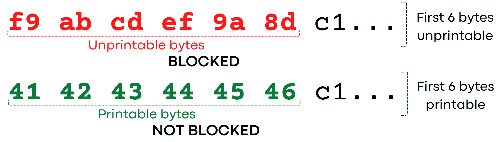

[(a) 前六个字节为可打印的ASCII的豁免规则](#fig:first-six-exempt)（`Ex2`）： 如果一个连接的前六个（或更多）字节都是可打印的ASCII，则GFW将其豁免。

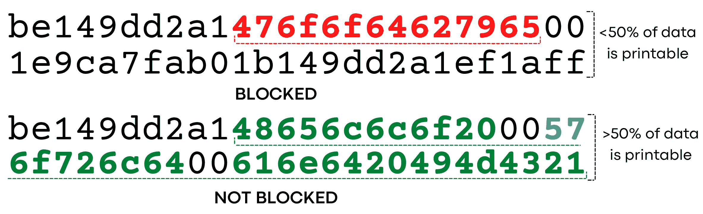

[(b) 半数字节为可打印的ASCII的豁免规则](#fig:halfprintable-exempt)（`Ex3`）：如果一个连接的第一个有效载荷有超过50%的可打印的ASCII，则GFW将其豁免。

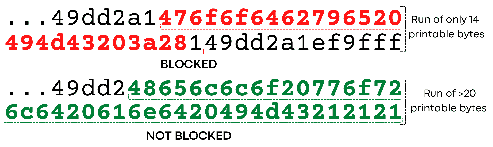

[(c) 连续可打印豁免](#fig:contiguous-run-exempt)（`Ex4`）：GFW计算连续可打印的ASCII字节的最大数量，如果该值超过20个字节，则豁免连接。

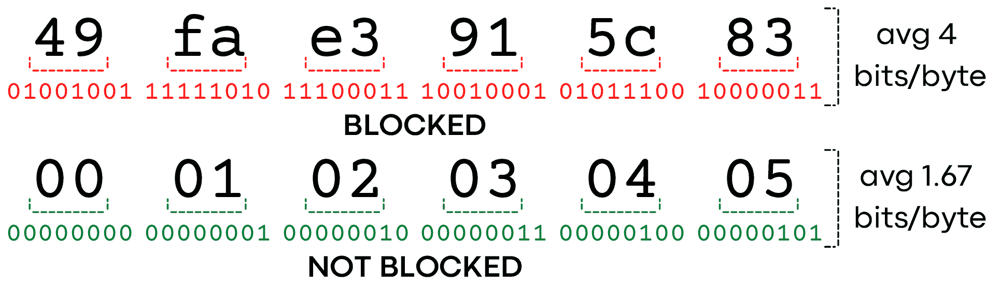

[(d) popcount豁免](#fig:popcount-exempt)（`Ex1`）：GFW计算每个字节的平均1比特数（popcount），作为衡量熵的粗略标准，如果该值小于3.4或大于4.6，则豁免连接。

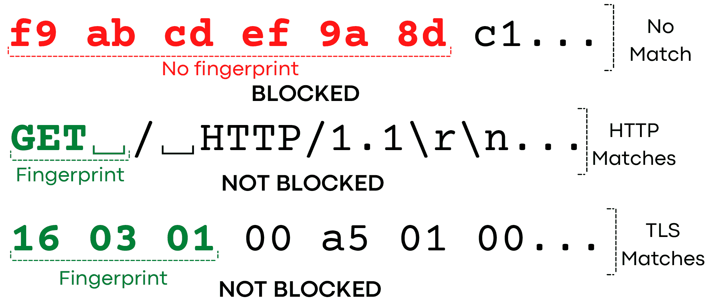

[(e) 协议豁免](#fig:protocol-match-exempt)（`Ex5`）：如果一个连接的前几个字节符合HTTP或TLS协议，则GFW豁免其连接。

我们观察到在[第4.1节中](#sec:bit-counting)发现的比特计数规则有几个例外。例如，模式`\x4b\x4b\x4b...`没有被封锁，尽管每个字节正好设置了4位。事实上，实际上有70个字节（8选4）正好有4位为\(1\)比特，但是我们的分析发现，其中只有40个触发了审查。那另外30个呢？

这另外30个字节的值都属于*可打印的ASCII字符*的字节范围，即`0x20-0x7e`。 我们推测，GFW豁免这些字符可能是为了允许"明文"（人类可读）协议。

我们发现，GFW有*三种关于可打印的ASCII字符的豁免方式*，都是基于连接中客户端发送的第一个数据包的有效载荷：如果前六个字节是可打印的（`Ex2`）；如果超过一半的字节是可打印的（`Ex3`）；或者如果它包含超过20个连续的可打印字节（`Ex4`），则允许连接。

**前六个字节是可打印的（`Ex2`）。** 我们观察到，如果一个连接的前6个字节在可打印的字节范围`0x20-0x7e`内，那么GFW就会豁免该连接。如果前6个字节中有超出这个范围的字符，那么连接就可能会被阻止，前提是它没有符合其他豁免的规则（例如，每个字节集有少于3.4位的\(1\)比特）。 我们通过生成不同有效载荷进行测试，其中前\(n\)字节来自不同的字符集（如可打印的ASCII字符），而消息的其余分部将是随机的不可打印字符。 我们观察到，对于\(n \lt 6\)，连接被阻断，但对于\(n\ge 6\)，即前\(n\)字节都是可打印的ASCII字符时，没有发生阻断。

**第一个数据包有一半的有效载荷是可打印的（`Ex3`）。** 如果第一个数据包的有效载荷中超过一半的字节属于可打印的ASCII范围`0x20-0x7e`，那么GFW就会豁免该连接。 我们通过构造并发送这样的有效载荷来测试：其前10字节由可打印ASCII范围以外的字符组成（例如`0xe8`），然后是一个6个字节的重复序列：5个在这个可打印范围内（如`0x4b`），而最后一个在可打印范围外。我们重复这个6字节的序列5次，然后在字符串的末尾用可打印范围外的\(n\)个字节来填充(用Python符号表示：`"\xe8"*10 + ("\x4b"*5 + "\xe8")*5 + "\xe8"*n)`)。 这个实验给我们一个可变长度的模式，随着我们增加\(n\)，可打印的ASCII范围内的字节的比例减少了。 我们发现，对于 \(n < 10\)，连接不会被阻断，而对于 \(n \ge 10\)，连接会被阻断。 这相当于当可打印字符的比例小于或等于一半时被阻断，而当大于一半时不被阻断。

我们设计这样的有效载荷是为了避免触发其他GFW豁免规则，例如\(1\)比特比例（`Ex1`）、可打印前缀（`Ex2`）或连续的可打印字符（`Ex4`）。 例如，我们分别使用 `0x4b`和`0xe8` 作为可打印和不可打印的字符，因为它们都正好有4位的设置。 这可以防止GFW因为前面讨论过的\(1\)比特比例规则（`Ex1`）而豁免封锁我们的连接的情况。 此外，我们避免让可打印字符`0x4b`连续出现，因为我们观察到这样的模式也能豁免封锁连接，这一点我们接下来会讨论。 我们用其他同样符合这些限制条件的模式（如`0x8d`和`0x2e`）重复了我们的实验，并观察到相同的结果。

**超过20个连续的字节是可打印的（`Ex4`）。** 一个可打印字符的连续出现也可以免除封锁，即使可打印字符的总比例不到一半。 为了测试这一点，我们发送了一个由可打印范围以外的字符（`0xe8`）组成的100个字节的模式，以及来自可打印范围的不同数量的连续字节（我们使用`0x4b`）。 我们的有效载荷从10个字节的`0xe8`开始，接着是\(n\)字节的`0x4b`，然后是\(90-n\)字节的`0xe8`，总长度为100个字节。 我们让变量\(n\)在0-90之间变化，并把每个相同的载荷都向我们的服务器发送25次。 我们发现，对于 \(n\le 20\)，连接被阻断了。当 \(n > 20\)，连接没有被阻断。 这证明当有连续的可打印的ASCII字符出现时，连接会被豁免。 当然，当 \(n > 50\)，连接也会被豁免，因为豁免规则`Ex3`。

**其他编码方式。** 我们测试了如果第一个数据包中包含中文字符，是否也可以与可打印的ASCII字符一样，让连接免于阻断。 我们使用了以UTF-8编码的6-36个中文字符串，以及GBK（与我们使用的GB2312字符相同）。 所有这些测试连接都被阻断了，这表明*不存在基于汉字的豁免规则*。 这可能是因这些编码中出现的汉字的情况很少，或者是因为如果要解析这些编码，会对审查系统增加不合理的复杂性，因为很难知道一个编码字符串的开始或结束位置。

为了避免误伤流行的协议，我们观察到GFW明确地豁免了两种流行的协议。 GFW似乎是用*客户端数据包的前3-6个字节*来推断协议：如果它们与已知协议的字节相匹配，连接就会被免除阻断，即使数据包的其余部分不符合该协议。我们测试了六种常见的协议，发现TLS和HTTP协议被明确地豁免了。这个豁免列表可能并不详尽，因为可能还有其他我们没有测试的豁免协议。

**TLS。** TLS连接以TLS ClientHello消息开始，该消息的前三个字节会使GFW豁免连接。我们观察到，GFW豁免了任何前三个字节与以下正则表达式匹配的连接：

> `[\x16-\x17]\x03[\x00-\x09]`

这对应于一个字节的记录类型(record type)，后面是一个两字节的版本(version)。 我们列举了所有256个`XX\x03\x03`的模式，并在后面加上97个字节的随机数据。我们发现除了那些以`0x16`（对应TLS中的Handshake包，用于ClientHello）或`0x17` （对应TLS中的应用数据类包(Application Data)）开始的模式外，其他所有模式都被封锁。 虽然通常的TLS连接不会以应用数据开头 [[53](#Xrfc5246-appendixE),[52](#Xrfc8446-tls13-hello)]， 但当TLS被用于多路径TCP（MPTCP） [[31](#Xmptcp)]时， 常见的情况是，其中一个TCP子流被用于ClientHello，而其他子流在TCP连接建立后立即发送应用数据 [[15](#Xbonaventure-mptcp-tls-00)]。 到目前为止，只有TLS的`0x03[0x00-0x03]` 版本被定义 [[53](#Xrfc5246-appendixE),[52](#Xrfc8446-tls13-hello)]，但GFW甚至允许更晚的（尚未定义）版本。

**HTTP。** 审查者用来识别HTTP流量的字节模式很简单，就是在HTTP请求方法的后面跟有一个空格。如果一个信息以`GET␣`、`PUT␣`、`POST␣`或`HEAD␣`开头，那么这个连接就会被免于阻断。每个请求方法的后面的空格字符（`0x20`）是让连接免于屏蔽的必要条件。如果不包括这个空格字符，或用任何其他字节代替它，就不能豁免连接。其他的HTTP请求方式（`OPTIONS␣, DELETE␣, CONNECT␣, TRACE␣, PATCH␣`）均因为前6个字节是可打印字符，而已经满足可打印的ASCII豁免规则（`Ex2`）。我们发现HTTP请求方法是不区分大小写的：`GeT␣`、`get␣`和类似的变体都可以使连接被豁免。请求方式的错误拼写（例如，`TEG␣`）不属于豁免范围。

**不被豁免的协议。** 我们测试了其他常见的协议：SSH、SMTP和FTP将被豁免，因为它们都以至少6个字节的可打印的ASCII开头（规则`Ex2`）。DNS-over-TCP由于包含很大一部分的零，使得它被`Ex1`规则豁免。然而，如果在DNS-over-TCP消息后附加足够多的随机数据，它将被阻止。

上面观察到的现象让大家提出了一个问题：为什么审查者使用明确的规则来豁免TLS和HTTP，而不是其他协议。 毕竟，审查者不需要明确地豁免这两种协议：HTTP通常会都满足前6个字节为可打印的ASCII的豁免规则（`Ex2`），而TLS ClientHello包由于有许多零字段，其也会因位数熵相对较低而满足`Ex1`豁免规则。也许这是因为审查者可以采用这些简单而高效的规则来快速地豁免大部分的网络流量（TLS和HTTP），而不需要进行如计算载荷中\(1\)比特的比例、可打印的ASCII的比例等更深入的分析。

一旦GFW使用[算法1](#alg:blocking)检测到完全加密的流量，就会按照下面介绍的方式阻断后续流量。

**丢弃从客户端到服务器的数据包。** 我们先触发GFW的阻断，然后比较在客户端和服务器捕获的数据包。我们观察到，在触发审查后，客户端的数据包被GFW丢弃，并没有到达服务器。然而，服务器发送的数据包没有被阻断，客户端仍然可以收到。

**UDP流量不受影响。** 新的审查系统只限于TCP。发送一个具有随机有效载荷的UDP数据包不能触发审查。此外，即使某个3元组（客户端IP、服务器IP、服务器端口）由于TCP连接而被封锁，往来于同一（服务器IP、服务器端口）的UDP数据包也不受影响。由于没有UDP拦截，用户在使用Shadowsocks时可能会遇到奇怪的现象：他们仍然可以使用某些依赖UDP的网站或应用程序（如QUIC或FaceTime），但无法访问使用TCP的网站。这是因为Shadowsocks用TCP代理TCP流量，用UDP代理UDP流量。审查者不检测或阻止UDP流量，可能反映了其*更糟就是更好(worse is better)*的工程思维。从实际情况来看，目前的TCP封锁已经足够有效地让这些流行的翻墙工具瘫痪，而如果增加UDP审查，则需要额外的资源，并给审查系统引入额外的复杂性。

**所有端口的流量都可能被阻断。** 我们在美国建立了一个监听在所有端口（从1到65535）的水槽服务器。然后，我们让中国的客户端不断地用50字节的随机有效载荷与美国服务器的每个端口进行连接，并在某个端口被封锁后停止反复地连接这一端口。我们发现，从1到65535的所有端口都可能被封锁。因此，在一个不寻常的端口上运行翻墙服务器并不能缓解封锁。我们也没有观察到使用不同端口会导致不同的审查行为。

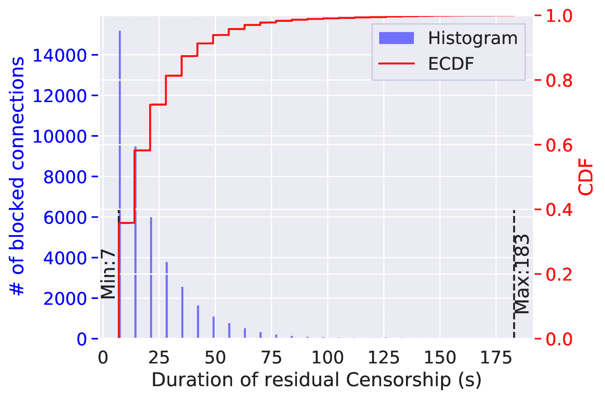

[图2：](#fig:residual-two) 残留审查时间 --当我们反复地将50字节的随机数据同时发送到单个服务器的500个端口时，残留审查时间急剧下降。大约40%的封锁只持续了10秒，短于只有一个端口被封锁时的180秒持续时间。这表明，GFW可能会限制它在任何特定时间内残留审查的连接数量。

**残留审查(residual censorship)的持续时间受到正在被残留审查的元组的数量的影响。**我们发现，这个新的审查系统一旦阻断了一个连接，它就会在后续的120或180秒内继续丢弃*所有*具有相同3元组（客户端IP、服务器IP、服务器端口）的TCP数据包。这种行为通常被称为“残留审查” [[13](#XBock2021a),[17](#XChai2019a),[63](#XWang2017a),[14](#XBock2020ESNI)]。与其他一些残留审查系统不同 [[13](#XBock2021a)]，GFW的残留审查定时器不会在观察到更多触发审查的数据包后被重置。

我们还发现，GFW似乎限制了它在任何给定时间内残余审查的连接的数量。我们让中国的客户端重复性地同时连接到一个服务器的500个端口。在每个连接中，客户端发送50字节的随机数据，然后关闭连接。我们记录了每次发生残留审查的持续时长。[如图2](#fig:residual-two)所示，与只有一个端口被封锁时的180秒持续时间相比，该实验中的残留审查持续时间大幅下降。

在这一节中，我们将研究GFW的新审查系统是如何重新组合流量，并考虑流量方向的。

**一个完整的TCP握手是必要的。** 我们观察到，发送一个`SYN`包，然后再发送一个包含随机数据的`PSH+ACK`包（在服务器没有完成握手的情况下），并不足以触发阻断。这样的残留审查更难被攻击者利用 [[13](#XBock2021a)]。

**只有客户端到服务器的数据包可以触发阻断。** 我们发现，GFW不仅检查随机数据是否被发送到属于受影响的IP范围内的目标IP地址，而且还检查并只在随机数据从客户端发送到服务器时才进行阻断。这里的服务器被定义为在TCP握手过程中发送`SYN+ACK`的主机。

我们通过在两台主机之间设置的四个实验来了解这一点。在第一个实验中，我们让在中国的客户端连接并向外国服务器发送随机数据；在第二个实验中，我们仍然让中国的客户端连接到外国服务器，但让外国服务器向客户端发送随机数据；在第三个实验中，我们让美国的客户端连接并向中国服务器发送随机数据；在第四个实验中，我们让美国的客户端连接到中国服务器，但随后让中国服务器向美国客户端发送随机数据。只有第一个实验中的连接被封锁了。

**GFW只检查第一个数据包。** GFW似乎只分析TCP连接中的第一个数据包，而不对有多个数据包的流量进行重新组合。我们通过以下实验来测试这一点。在TCP握手后，我们发送第一个数据包，其中只有一个字节的有效载荷 `\x21`。在等待一秒钟后，我们再发送带有200字节随机有效载荷的第二个数据包。我们重复了25次实验，但连接从未被封锁。 这是因为在看到第一个数据包后，GFW已经通过规则`Ex1`豁免了连接，因为它的有效载荷中包含100%可打印的ASCII。换句话说，如果GFW在其流量分析过程中把多个数据包重新组合成一个流，它就能够阻止这些连接。

我们发现，GFW不会等到看到服务器的ACK响应时才去阻止一个连接。我们用一个`iptables`规则将我们的服务器配置为放弃任何传出的ACK数据包。然后我们用200字节的随机有效载荷与服务器建立连接。尽管服务器没有发送任何ACK数据包，GFW仍然阻止了这些连接。

**GFW对第一个数据包等待时间超过了5分钟。** 我们研究了GFW会在TCP握手之后，但在看到第一个数据包之前，对一个TCP连接进行了多长时间的监控。根据观察，它需要一个完整的TCP握手来触发封锁，我们因此推断GFW可能是有状态的。因此，我们有理由怀疑GFW只在有限的时间内监控一个连接，因为要永久追踪一个连接的状态而不放弃的开销很大。

我们的客户端完成了TCP握手，然后等待了100秒、180秒或300秒，然后发送200字节的随机数据。接着，我们重复了这个实验，但使用`iptables`规则丢弃了任何RST或TCP keepalive数据包，以防它们帮助GFW保持对连接的追踪。 我们发现这些连接仍然触发了阻断，这表明GFW对连接状态的追踪至少有5分钟。

| 有效载荷 | 受影响的服务器 | 未受影响的服务器 |
|  | 连接数 | 探测数 | 连接数 | 探测数 |
| 2字节的随机(\xfe\x01) | 33k | 0 | 169k | 0 |
| 50字节的随机 | 29k | 0 | 169k | 0 |
| 200字节的随机 | 33k | 141 | 169k | 679 |
| "GET " + 50字节的随机数 | 170k | 0 | 169k | 0 |
| \x16\x03\x03 + 50个字节的随机数 | 170k | 0 | 169k | 0 |
| \x17\x03\x03 + 50个字节的随机数 | 170k | 0 | 169k | 0 |
| "GET " + 50个字节的随机数 | 170k | 0 | 169k | 0 |
| \x16\x03\x03 + 200字节的随机数 | 170k | 0 | 169k | 0 |
| \x17\x03\x03 + 200字节的随机数 | 170k | 0 | 169k | 0 |
| 低\(1\)比特平均值（2.5） | 170k | 0 | 169k | 0 |
| 高\(1\)比特平均值（5.2） | 170k | 0 | 169k | 0 |
| 超过一半的可打印 | 170k | 0 | 169k | 0 |
| 前六个字节可打印+200字节随机 | 170k | 0 | 169k | 0 |
| 超过20个连续的字节 | 170k | 0 | 169k | 0 |

[表2：](#table:probes) 在2022年5月19日至6月8日期间，我们的客户从中国腾讯云北京数据中心的VPS重复发送相同的14个有效载荷，到美国DigitalOcean旧金山数据中心的两个不同主机的14个端口。据了解，其中一台美国主机受到了当前审查系统的影响，而另一台美国主机则不受影响。总的来说，我们在中国的客户重复向这两台美国服务器的每个端口发送了大约17万个连接。唯一的例外情况是，当残留审查制度被触发，客户端无法与受影响的服务器进行连接时，成功的合法连接总数约为3.3万次。

正如[第2.2节](#sec:background-active-probing)所介绍的，GFW自2019年以来一直在向Shadowsocks服务器发送主动探测探针 [[5](#XAlice2020a)]。在这一节中，我们研究了这个新发现的实时阻断系统和已知的主动探测系统之间的关系。通过测量实验和对历史数据集的分析，我们发现，虽然这两个审查系统并行工作，但主动探测系统的流量分析模块应用了[算法1](#alg:blocking)和[图1](#fig:example-blocking)中总结的所有五条豁免规则，并且还用一条额外的规则，来检查第一个数据包的有效载荷长度。我们还表明，主动探测系统[[5](#XAlice2020a)]使用的流量分析算法可能自2019年以来有所进化。

**主动探测实验。** 在部署这个新的实时阻断系统之前，从外界推断主动探测系统的流量分析算法，如果说是有可能的话，也是极具挑战性的。这是因为GFW在看到触发连接和发送主动探测之间设置了一个任意长度的延迟 [[5](#XAlice2020a)，§3.5]。这就使得我们很难说明GFW的哪些探测是由我们发送的哪些连接触发的。现在我们已经在[第4节中](#sec:reverse-engineering)推断出了这个新的阻断系统的流量检测规则列表，我们可以测试被[算法1](#alg:blocking)豁免的有效载荷是否也不会被主动探测系统所怀疑。

我们在2022年5月19日和6月8日之间进行了实验。[如表2](#table:probes)所示，我们制作了14种不同类型的有效载荷：其中3种是长度为2、50和200字节的随机数据；其余11种是具有不同长度的数据，这些数据仅能被[算法1](#alg:blocking)中的某一个豁免规则豁免。然后，我们从中国北京腾讯云的一个VPS向美国旧金山DigitalOcean的两个不同主机的14个端口，发送了14种有效载荷。其中一台美国主机已知受到当前阻断系统的影响，而另一台美国主机则不受影响。这样，如果我们收到来自GFW的任何探测，我们就知道当前封锁系统使用的某些豁免规则没有被主动探测系统使用。

我们在中国的客户端总共向两台美国服务器的每个端口发送了约17万次连接。然后我们采取措施，将来自GFW的主动探测与其他互联网扫描探测隔离开。我们根据IP2Location数据库 [[3](#Xip2location)]和AbuseIPDB [[2](#XAbuseIPDB)]检查每个探测的源IP地址。如果它是一个非中国的IP或者来自一个已知的被用来扫描的IP地址，我们就不认为它是来自GFW的主动探测。我们进一步检查并确认该探针是否属于GFW发送的任何已知类型的探针。

**这两个系统独立工作。** 新的审查机器*纯粹是*根据被动流量分析做出封杀决定，而不依赖中国知名的主动探测基础设施 [[67](#XWinter2012a),[5](#XAlice2020a),[66](#XWinter-obfs2-probe),[64](#Xknock-knock-tor),[27](#XEnsafi2015b)]。我们之所以知道这一点，是因为虽然GFW仍然向服务器发送主动探测，但在超过99%的测试中，GFW在封锁一个连接之前没有向服务器发送过任何主动探测。举个例子，[如表2](#table:probes)所总结的，我们进行了33119次连接，但只收到179次主动探测。事实上，与之前的工作 [[5](#XAlice2020a), §4.2]的发现相似，主动探测很少被触发。

我们想强调的是，这一发现并不意味着对主动探测的防御没有必要或不再重要 [[34](#XFrolov2020a),[5](#XAlice2020a),[9](#XAnonymous2021ShadowsocksAdvise)]。恰恰相反，我们认为GFW对纯被动流量分析的依赖，部分原因是Shadowsocks、Outline、VMess和其他许多翻墙软件已经对主动探测采取了有效的防御措施 [[34](#XFrolov2020a)、[5](#XAlice2020a)、[9](#XAnonymous2021ShadowsocksAdvise)、[19](#XShadowsocks2022-spec)、[43](#Xoutline-v1.1.0)、[32](#Xoutline-changes)、[71](#Xshadowsocks-rust-v1.8.5)]。GFW仍然向服务器发送主动探测这一事实，意味着审查者仍然试图使用主动探测，尽可能准确地识别翻墙服务器。

**主动探测系统对可疑流量应用了五条豁免规则，并增加了一条基于载荷长度的豁免规则。** 这个实验表明了两点。首先，与Alice等人 [[5](#XAlice2020a), §4.2]的研究结果类似，主动探测系统应用一个额外的规则来检查连接中的有效载荷的长度。在我们的案例中，只有200字节有效载荷的连接曾经触发了主动探测，而2字节或50字节的连接则从来没有。其次，如果流量符合[算法1](#alg:blocking)中列出的五条豁免规则中的任何一条，那么该流量也不会触发主动探测系统。

**自2019年以来，主动探测系统已经有所发展。** 我们想知道[算法1](#alg:blocking)中的检测规则是否曾经被用来触发主动探测。为了分析它，我们从Alice等人 [[5](#XAlice2020a), §4.1]的低熵实验中获得了282个曾经被重放的有效载荷（这证明这些有效载荷曾经触发了GFW的主动探测）。然后我们写了一个程序来确定一个有效载荷是否会被当前的阻断系统豁免，并将获得的282个有效载荷输入该程序。结果，以前触发主动探测的45个探测被豁免了（根据规则`Ex3`）。2022年5月19日，我们反复发送这45个有效载荷，让它们被GFW看到，并确认它们确实被当前的阻断系统豁免了。对于每个有效载荷，我们用它从腾讯云北京的VPS到Digital Ocean旧金山的水槽服务器进行了25次连接。 这个结果表明， *自2020年以来，GFW很可能已经更新了其主动探测系统的流量分析模块*。此外，目前GFW发送的探针也与2020年观察到的探针不同 [[5](#XAlice2020a), §3.2]。 新的探针基本上是随机有效载荷，分别以16、64和256字节为中位数的分布。对于这些长度中的每一个，GFW发送的探针数量大致相同：一台服务器收到了48、46和47个探针，另一台收到了238、228和233个探针。

在本节中，我们进行了测量实验，以确定审查者的封锁策略。我们发现，可能是为了减少误报和降低运营成本，审查者策略性地将封锁范围限制在热门数据中心的特定IP范围内，并对发往这些IP范围的所有连接采用概率性封堵策略，封锁率大约为26%。

2022年5月12日，我们从位于科罗拉多大学博尔德分校的服务器上对互联网上10%的IPv4地址的TCP 80端口进行了扫描。按照前人工作中，如何识别在互联网扫描中发现不可靠主机的方法 [[41](#Xlzr)]，我们排除了那些TCP响应窗口为0的服务器（因为我们无法向他们发送数据），以及不接受后续连接的IP地址。这就给我们留下了700万个可扫描的IP地址。然后，我们将这700万个IP地址随机平均分成九个组，并将每组分配到腾讯云北京数据中心的九个实验节点上。然后，我们将一个我们编写的测量程序安装在所有九个实验节点上，并用它进行实验。对于每个IP，该程序连续连接到其80端口，最多25次，每次连接间有一秒钟的间隔。在每个连接中，我们发送相同的50个字节的随机的、可以触发封锁的数据。如果我们在发送数据后看到连续5次连接超时（连接失败），我们就将该IP标记为受影响新审查系统的影响。 反之，如果所有25次连接都成功，我们则将该IP标记为未受到影响。我们将完全无法连接的IP标记为未知（例如，服务器关闭，或者与GFW无关的网络故障使我们无法首先连接）。

我们还重复了这个过程，但发送了50个字节的`\x00`，这个载荷并会不触发GFW的封锁。如果一个服务器在这个测试中也被标记为受到影响，那这很可能是由于服务器封锁了我们的连接，而不是GFW封锁的。我们从受到影响的IP结果中排除这些IP。这样就只剩下600多万个IP了。

最后，我们排除了可能是由于间歇性网络故障或不可靠的有利条件造成的 "模棱两可 "的结果。 具体来说，我们排除了那些被我们的随机载荷或全零载荷扫描标记为未知（我们从未能够连接），或有间歇性连接超时（例如，几个连接超时，但不是连续的5个）的IP。这就留下了550万个我们可以很容易地将其标记为不受影响（所有25个连接都成功了）或受影响（在某些时候，在我们发送随机数据后，它似乎被封锁了）的IP地址。

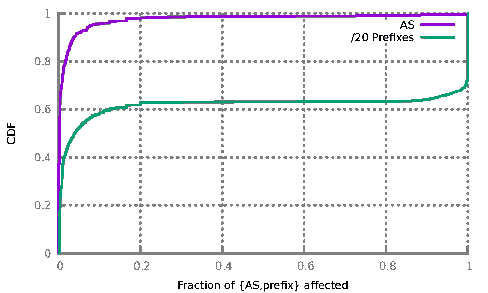

[图3： 受影响的AS和IP前缀的比例 --](#fig:asn-prefix) 对于每个自治系统（AS）（和/20IP前缀），我们计算GFW影响的IP占其中所有测试IP的比例，并绘制CDF。我们可以看到，只有一小部分AS受到影响，大多数子网受影响与否的状态是"全有或全无"（要么整个子网的IP都受到影响，要么只有极少数IP受到影响）。

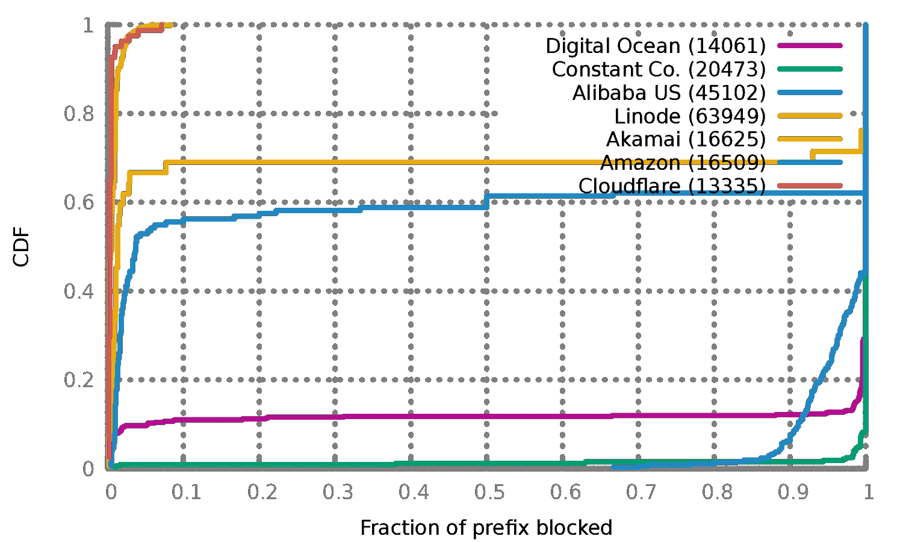

[图4： 受影响最大的自治系统](#fig:top-asn) --我们观察到，并非所有的自治系统（AS）都受到影响，甚至在每个AS中，不同的前缀受到的影响也不同。对于每个AS，我们查看了他们网络中的每个/20IP前缀，并计算了每个/20子网中被封锁的IP的比例。结果非常接近于全有或全无：要么/20中的所有IP都受到影响，要么没有。

在经过处理的550万个IP中，**98%的IP地址没有受到**GFW封锁的**影响**，这表明中国在采用这种新的审查系统时是相当保守的。我们使用`pyasn`以及2022年4月的AS数据库 [[51](#Xpyasn)]，将这550万个IP地址归入其分配的IP前缀和AS中。 对于大于/20的IP前缀，我们将其分成每/20前缀一组，以保持分配的大小大致相同。我们的550万个IP包括了538个至少有5个测量结果的AS，其中绝大多数基本不受GFW的阻断影响。

[图3](#fig:asn-prefix)显示了受影响的自治系统（ASes）和/20IP前缀的分布情况。我们发现，90%以上的AS是以全有或全无的方式受到影响的：要么我们在AS中测试的所有IP地址都受到GFW的阻断影响，要么我们在AS中测试的所有IP地址都没有受到影响。我们还观察到，只有少数AS受到影响：超过95%的AS被观察到只有不到10%的IP地址受到影响，只有7个AS被观察到其中有超过30%的IP地址受到了影响。

[图4](#fig:top-asn)显示了受影响最大的AS。虽然测量结果偏向于显示较大规模的AS（因为在我们的扫描中占有更多的IP），但它显示了受到严重影响的AS（例如，阿里巴巴美国，Constant）和未受影响的AS（Akamai，Cloudflare）。此外，一些AS既有受影响的IP前缀，也有不受影响的IP前缀（亚马逊、Digital OCean、Linode）。我们看到的所有受影响或部分受影响的AS都是**受欢迎的，可用于托管代理服务器的VPS供应商**。而未受影响的大型AS通常不向个人客户出售VPS主机（如CDN）。

正如[第3节](#sec:methodology)所介绍的，在得出任何关于封锁的结论之前，我们发送最多25次具有相同有效载荷的连接。这是必要的，因为审查者仅是有概率地实行封锁的。换句话说，仅仅向受影响的服务器发送一次随机的有效载荷，只是有时会触发阻断；但是，如果一个人不断向受影响的服务器发送相同有效载荷的连接，那么阻断终会发生。这就产生了一个疑问：一个连接被封锁的概率是多少？以及为什么审查者只是有概率地实行封锁？

**估计封锁概率。** 在我们对10%的互联网的扫描中（[第6.2节](#sec:affected-ips-asns)），有109,489个IP地址被我们标记为受到封锁影响。如[第5节](#figure:blocking-rate-fit)所示，在被封锁之前，我们可以与每个IP地址进行成功的随机数据连接的数量分布符合一个几何分布。这个结果表明，对每次连接的阻断是独立的，概率为\(26.3\%\)。

**为什么采用概率封锁。** 我们猜想，审查者采用概率封锁可能有两个原因：首先，它允许审查者只检查四分之一的连接，减少计算资源。第二，它帮助审查者减少对非翻墙连接的误伤。虽然这种减少也是以降低真阳性率为代价的，但残留审查可能弥补了这一点：一旦一个连接被封锁，其随后的连接也会被封锁数分钟。这使得翻墙流量一旦被发现就很难再成功连接。这也可能进一步支持了之前的说法，即审查者更重视降低检测中的假阳性率，而不执着于极高的真阳性率 [[57](#XTschantz2016a)]。

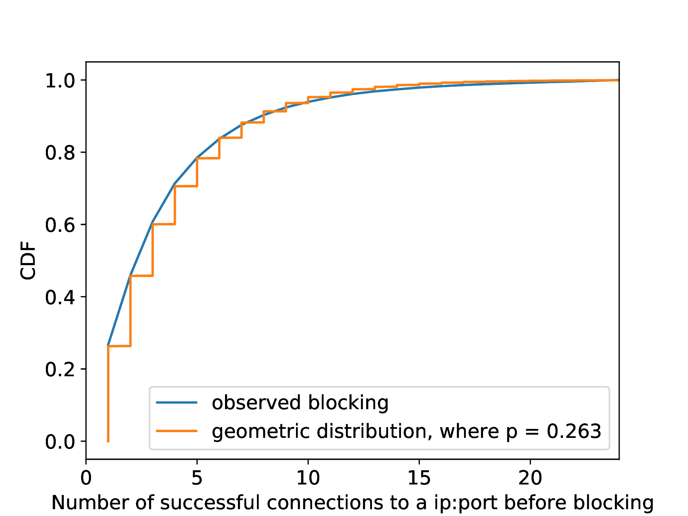

[图5：](#figure:blocking-rate-fit) 从我们在中国的客户端发往109,489个受影响的IP地址，在每个IP地址被封锁前，已经成功的连接的数量的累积分布函数(CDF)。我们对每个IP地址的80端口进行了最多25次连接。该分布符合几何分布，表明GFW对每个连接的阻断是独立的，其概率为\(p=26.3\%\)。

在本节中，我们评估了[第4节](#sec:reverse-engineering)中推断出的GFW检测规则的假阳性率和我们推测的全面性。为了确定这种阻断对常规流量可能产生的影响，我们在不实际阻断任何流量的情况下，在我们大学的网络流量上模拟了推断出的检测规则。与GFW不同，我们对观察到的*所有*TCP连接模拟了检测规则，而没有将检测仅仅限制在26%的发往流行数据中心的特定IP范围。我们假设在大学网络中很少甚至没有翻墙流量，这样任何根据检测规则被阻断的流量就可能代表了检测中的*假阳性*。我们发现，我们推断出的检测算法将阻止大学网络上所有连接的大约0.6%。由于GFW的黑箱性质，我们推断出的规则可能只是GFW使用全部规则的一个子集；但是，证据表明，当我们将被判断为会被阻断的连接的前缀加上随机数据，一并从中国发往受到影响的IP地址时，所有被[算法1](#alg:blocking)判断为会被阻断的连接真的被GFW阻断了。这表明我们推断的规则很好地覆盖了GFW实际使用的规则。

我们拥有对科罗拉多大学博尔德分校40Gbps的实时网络流量的访问权。这一权限允许我们处理校园内所有传入和传出的数据包的副本。利用这一点，我们收集了一个数据集，其中*只包含目的地IP和端口号*，以及不符合[算法1](#alg:blocking)中任何豁免规则的连接的的有效载荷的*前6个字节*。更确切地说，我们使用`PF_RING` [[50](#Xpfring)]实现了一个自定义的数据包分析工具。对于每个连接，我们检查了客户端发送的第一个数据包。我们确保该数据包具有正确的TCP校验和，并且其序列号是连接中TCP握手后的第一个预期数据包（确保我们没有错过第一个数据包）。对于那些没有被[算法1](#alg:blocking)豁免的连接，即那些我们预计会被封锁的连接，我们记录了目标端口和连接的前六个字节，以帮助识别其协议。

我们在2022年7月至2022年9月期间进行了这种收集。我们总共分析了17亿个连接，并记录了44,2928个不同的将被封锁的连接的前6字节。对于这44,2928个6字节前缀中的每一个，我们将相同的194字节的随机数据附加到它上面，使之成为一个200字节的有效载荷。然后，我们在2022年9月重复发送每个有效载荷，使其经过真正的GFW，以测试它们是否真的被封锁了，或者反而有我们之前没有发现的豁免情况。对于每个有效载荷，我们携带着它，从腾讯云北京的VPS向Digital Ocean旧金山的水槽服务器发送多达25个连接。

**估算假阳性率。** 在2022年7月至2022年9月期间，我们总共分析了该大学网络上的17亿个连接。对于每个连接，我们确定[算法1](#alg:blocking)中的哪些豁免规则可以使其免于被阻断。[如图6](#figure:exemptions)所示，我们观察到，在我们推断的GFW的检测规则下，*该大学平均有0.6%的TCP连接会被阻止*。

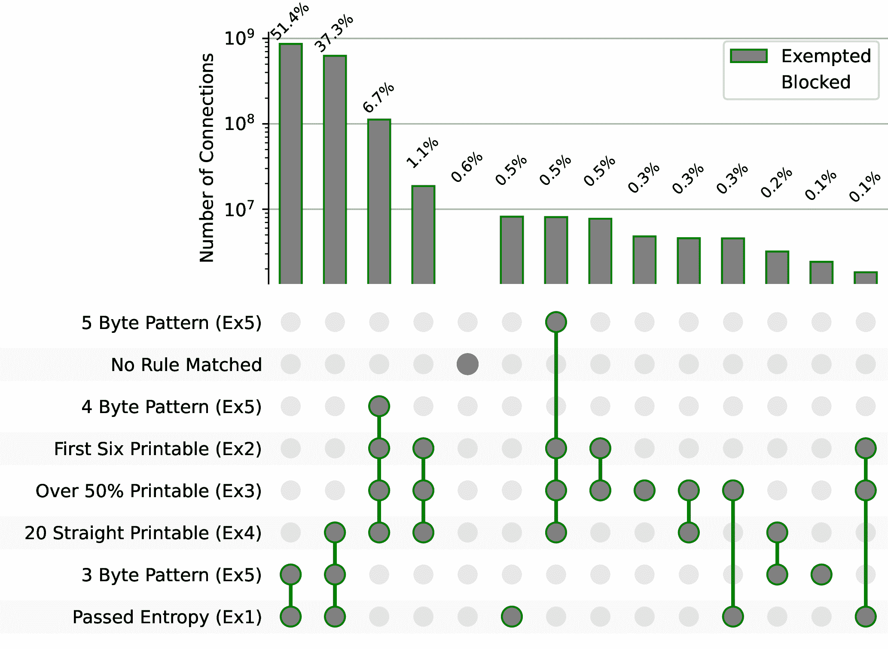

[图6： **常见的豁免**](#figure:exemptions) --对于科罗拉多大学博尔德分校的实时流量中的每个连接，我们确定[算法1](#alg:blocking)中的哪些规则可以使其免于被阻止。我们将第[4.3节中](#sec:allowed-protocols)的豁免规则Ex5分为3、4、5字节的模式，并将它们呈现在三行中，以便进行细粒度的分类。我们分析了从2022年7月到2022年9月收集的17亿个连接。为了简洁起见，这张图只显示了计数大于100万的交叉点。 我们在全集中观察到37个不同的豁免交叉点。

审查者至少采用了两种策略来减少假阳性（误封）。首先，正如[第6节](#sec:widespread)所介绍的，GFW只对一部分IP子网进行审查。这一决定可能是为了缓解审查者所面临的基本比率谬误问题(base rate fallacy) [[11](#Xaxelsson1999base)]。由于翻墙连接相对占比较小，所以即使算法的的误报率很小（如0.6%），但如果算法被广泛应用于所有流量，也会导致误伤很多的非翻墙流量。通过缩小其适用的IP范围，中国可以减少其检测算法带来的误伤。其次，正如[第6.3节](#sec:blocking-rate)所探讨的那样，即使是对这一小部分发往受到审查影响的IP子网上的流量，GFW也只阻止所有流量的四分之一。这就进一步将误伤数量降低到原本的四分之一。

我们发现的0.6%的连接也有可能就是完全加密流量。为了研究这种可能性，我们对每个连接中看到的独特的6字节前缀的数量进行了统计，根据推断出的规则，这些前缀将被GFW阻止。如果这些连接都真的是完全加密的代理，那么我们与其会看到在可能的6字节值上有一个均匀的分布（256^6）。否则，如果有频繁出现的6字节值，那么这些前缀则有可能属于流行协议，这也就代表GFW的流量检测出现了误报。

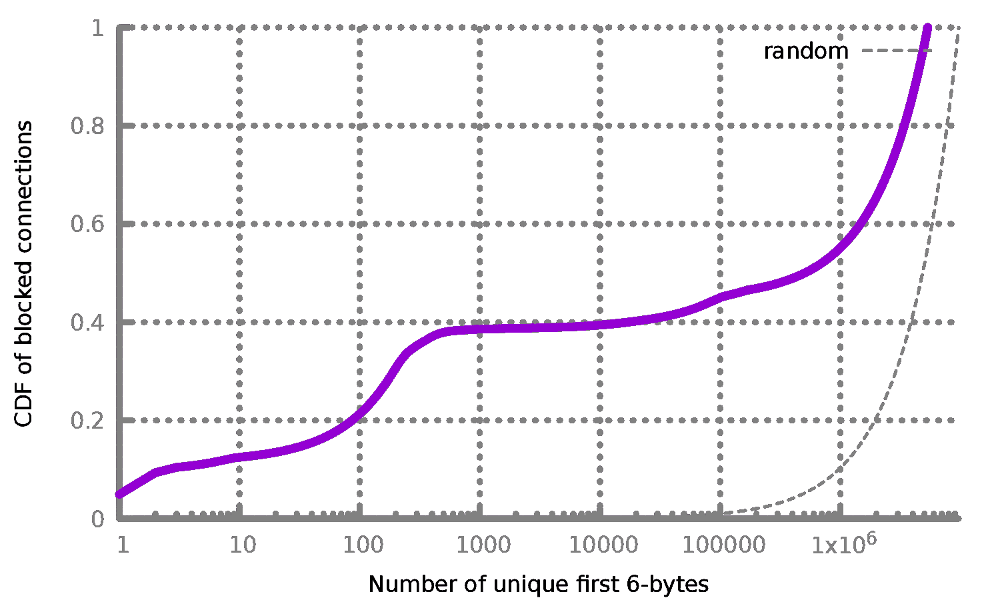

[图7： **被阻断的连接的前6字节** --](#fig:blocked-cdf) 对于在我们推断的GFW规则下，会被阻断的来自我们网络实时流量的970万（0.6%）连接，我们计算其不同的前6字节出现的次数。最流行的6字节前缀在47.9万个连接中出现（5.0%），这意味着一条明确允许这个6字节值的豁免规则可以将GFW的假阳性率降低。

[图7](#fig:blocked-cdf)显示了在我们推断的GFW规则下，来自大学网络的实时流量中，被标记会被阻断的所有970万个连接的前6字节的分布情况。此外，[表3](#table:repeated)显示了将被阻断的连接的前6字节值。虽然我们无法识别其中的许多协议，但它们的出现频率和低熵表明，它们不可能是完全加密的代理。

| 字节数（十六进制） | 端口号 | 出现频次 |
| 45 44 00 01 00 00 | 5222 | 479K | 5.0% |
| ee 2f 8c ec 40 d1 | 8000 | 427K | 4.4% |
| 00 00 00 00 00 00 | 50386 | 104K | 1.1% |
| 00 c4 71 58 64 51 | 443 | 34K | 0.4% |
| 00 C4 71 42 30 6E | 443 | 33K | 0.3% |
| 0E 53 77 61 72 6D | 7680 | 32K | 0.3% |
| 1B 00 04 C6 27 53 | 8886 | 32K | 0.3% |
| c6 e6 cd ed 00 00 | 33445 | 29K | 0.3% |
| 00 01 00 00 0f 00 | 443 | 27K | 0.3% |
| 16 f1 04 00 a1 00 | 80 | 12K | 0.1% |

[表3： **十个最常见的被阻断连接的前六个字节**--](#table:repeated) 我们记录了在科罗拉多大学博尔德分校网络上模拟被阻断的所有连接的前六个字节。在这个数据中，我们找到重复的六个字节，并显示前十个最常见的六个字节的端口号，以及各自占总模拟被阻断连接的百分比。

**估计推断出的规则的全面性。** 在我们制作的442,928个有效载荷中，我们发现只有一个前缀被GFW豁免了，它提醒我们注意TLS应用数据前缀豁免（`\x17\x03[\x00-\x09]`）。我们把这条豁免规则加入到了我们的推断规则中（`Ex5`）。这一结果表明，我们推断的豁免规则很好地覆盖了GFW实际使用的检测规则。

我们对这个新的审查制度的理解帮助我们能够推导出多种规避策略。在[第8.1节](#sec:customizable-iv)和[第8.2节](#sec:popcount)中，我们介绍了两种被广泛采用的规避检测的方法，它们分别从2022年1月和2022年10月开始帮助中国的用户绕过这次的新审查技术。我们在[附录A](#sec:other-circumvention-strategies)中讨论了其他规避策略。我们负责任地及时与拥有数百万用户的各种流行的翻墙软件的开发者分享了我们的发现和建议，这一点我们将在[第8.3节](#sec:responsible-disclosure)中详细说明。

[算法1](#alg:blocking)中的豁免规则`Ex2`和`Ex5`只查看连接中的前几个字节。这样做能让GFW高效地豁免不是完全加密的流量；但这样的做法同时也使其可以被用来规避检测。具体来说，我们建议在（翻墙）连接的第一个数据包的有效载荷上预置一个可定制的前缀。

**可定制的IV头。** Shadowsocks连接以初始化向量（IV）开始，根据加密方式的不同，其长度为16或32字节 [[22](#Xshadowsocks)]。正如[第4.2节](#sec:ascii-exemption)所介绍的，将IV的前6个（或更多）字节变成可打印的ASCII，将使这些连接被`Ex2`规则豁免。同样，将IV的前3、4或5个字节变成普通协议头，将使连接被`Ex5`规则豁免（例如，将IV的前3个字节变成`0x16 0x03 0x03`）。这些对策只需对客户端进行很小的改动，而对服务器没有任何改动，因此已经被许多流行的翻墙工具所采用 [[72](#Xshadowsocks-rust-salt),[62](#Xv2ray-salt),[48](#Xsagernet-salt),[56](#Xoutline-salt)]。将32字节IV的前几个字节限制为可打印的ASCII，不会将其随机性降低到影响加密安全性的程度。例如，即使将前6个字节固定为某个可打印的ASCII，IV中仍然有26个随机字节，这仍然比典型的16字节IV的随机性要大。

**局限性。** 这是一个权宜之计，有可能被审查者很容易地阻止。审查者可能会跳过前几个字节，将检测规则应用于连接中的其余数据。协议模仿在实践中也很困难 [[39](#XHoumansadr2013b)]。审查者可以执行更严格的检测规则，或对服务器进行主动探测，以检查它是否真的在运行TLS或HTTP。然而，这一策略在自2022年1月被许多流行的翻墙工具采用后，直到目前的2023年2月仍然有效。这一事实强调了即使是简单的应对方案也能有效对抗资源有限的审查者 [[8](#Xcat-and-mouse),[57](#XTschantz2016a),[30](#XFifield2016a)]。

正如[第4.1节](#sec:bit-counting)所介绍的，如果一个连接的第一个数据包每字节的1比特数量的平均值（popcount）小于等于3.4或大于等于4.6（`Ex1`），GFW就会豁免该连接。基于这一观察，人们可以通过在数据包中插入额外的1（或者0）来增加（减少）popcount，以绕过封锁。我们设计并分析了一个灵活的方案，它可以将每字节的popcount改变为任何给定的值或范围。我们在Shadowsocks-rust [[54](#Xshadowsocks-rust)]和Shadowsocks-Android [[6](#Xshadowsocks-android)]上实现了这个方案。自2022年10月以来帮助中国的用户绕过封锁 [[8](#Xcat-and-mouse)]。2023年1月，面向中国的一个大型翻墙服务提供商（要求不具名），也采用了这个方案的其中一个版本，并取得了类似的成功。

从一个高度概括的层面看，我们把原始的完全加密的数据包作为输入：通过只对密文进行操作，我们无需承担其保密性被破坏的风险。当发送一个数据包时，我们首先计算其每字节的平均popcount；如果该值大于4，那么我们计算我们必须向数据包中添加多少个1比特，以获得一个超过4.6popcount的载荷。反之，如果popcount小于4，那么我们要计算要增加多少个0比特才能使popcount减少到3.4以下。在任何一种情况下，我们在原始密文中添加必要数量的1比特或0比特，然后添加4个字节，表示所添加的比特数，最终给我们一个比特串\(B\)，使其每字节的popcount值会被豁免。

当然，简单地添加1或0会很容易产生协议指纹。为了解决这个问题，我们进行比特级的随机重新排序。特别是，我们利用现有的共享秘密，如密码，作为一个种子，以确定的方式构建一个置换向量。在每个连接中，我们更新这个排列向量，并在发送前用它来对比特串\(B\)中的所有比特重新排序。为了解码，接收方首先更新排列向量，然后用它来还原对比特串的排序；然后读取最后4个字节来确定增加的比特数，删除该比特数，从而能够恢复原来的（完全加密）数据包。

在实践中，我们额外采取了两个步骤来进一步混淆流量。因为如果所有的连接都共享相同的平均字节popcount值，那这是就会成为一个明显的指纹，所以我们将popcount的目标值设置为一个可参数化的范围。其次，由于明文的4字节长度标签可能成为一个指纹，所以我们对其进行加密（与这些翻墙工具对代理流量进行加密的方式相同）。

这个方案有几个优点。*首先*，该方案支持可参数化地调整平均每字节popcount的值，以防GFW更新其popcount规则来缩小被豁免的popcount范围。*其次*，由于它的精心设计，没有明显的指纹会向审查者发出信号，表明这是一个经过popcount调整的数据包。*最后*，它的流量开销很低；它只添加严格需要数量的1（或0）比特。在最坏的情况下，即把popcount从4增加到4.6，这只产生了大约17.6%的额外开销。因此，它不仅可以应用于第一个数据包，还可以应用于连接中的每一个数据包。这样即使审查者在未来检测除第一个数据包以外的数据包，这一策略也仍然有效。

2021年11月16日，在GFW采用这种新的封锁方式的十天后 [[10](#XAnonymous2021Shadowsocks)]，我们向公众披露了这种新封锁方式的细节 [[37](#Xtwitter-blocking-announcement-en),[38](#Xtwitter-blocking-announcement-zh)]。随着我们对这种新封锁的更深入理解，我们得出并评估了不同的规避策略。我们负责任地及时与拥有*数百万用户*的各种流行的翻墙工具的开发者分享了我们的发现和建议，包括Shadowsocks [[22](#Xshadowsocks)], V2Ray [[59](#Xv2ray)], Outline [[42](#Xoutline)], Lantern [[20](#Xlantern)], Psiphon [[21](#Xpsiphon3)], and Conjure [[33](#Xconjure)]。下面我们详细介绍我们的披露和反审查社区的反应。

2022年1月13日，我们与一群开发者分享了我们的第一个规避策略。这个解决方案，详见[第8.1节](#sec:customizable-iv)，只需要对客户端进行的很少量的代码修改，而无需对服务器进行任何修改。到2022年1月14日，Shadowsocks-rust开发者zonyitoo、V2Ray开发者Xiaokang Wang和Sagernet开发者nekohasekai已经将这个规避解决方案作为选项添加到他们的客户端 [[72](#Xshadowsocks-rust-salt),[62](#Xv2ray-salt),[48](#Xsagernet-salt)]。2022年10月4日，database64128在Shadowsocks-go上实现了这种策略的用户自定义版本 [[18](#Xshadowsocks-go-salt)]。2022年10月25日，Outline开发者为他们的客户端采用了一个高度可定制的解决方案 [[56](#Xoutline-salt)]。2022年10月14日，我们发布了修改过的Shadowsocks [[8](#Xcat-and-mouse)]，其采用了我们在[第8.2节](#sec:popcount)中详述的改变popcount的策略。

截至2023年2月14日，这些工具所采用的所有规避策略据报告*在中国仍然有效*。2023年1月，Outline的开发者报告说，自从他们采用上述缓解措施后，（选择加入匿名数据统计的）Outline服务器的数量增加了一倍。2023年1月，中国的一家大型翻墙服务提供商（目前要求不具名）也采用了我们提出的方案，并且也取得了成功。

虽然我们没有研究中国以外的国家，但根据汇报，我们提出的规避策略在另一个封锁全加密代理的国家——伊朗，也是有效的 [[65](#Xiran-shadowsocks-not-working)]。2023年2月13日，Lantern的开发者报告说，自2023年1月以来，所采用的协议"占了我们来自伊朗流量的大部分"。2023年2月13日，另一个翻墙服务提供商报告说，自2022年11月启用Outline的规避功能后，他们的服务从完全被封锁变成了每天为85万名来自伊朗的用户提供服务。

对审查机器的测量研究带有一定的风险和责任，我们对此非常重视。我们的研究涉及处理敏感的网络流量，扫描大量的主机，并在一个敏感国家进行网络测量。由于这项工作的敏感性，我们向我们机构的伦理审查委员会(IRB)提出了详细的研究计划以供审核。虽然IRB决定这项工作不涉及人类主体（因此不需要IRB审核），但我们仍然设计并采取了广泛的防范措施，以尽量减少潜在的风险和伤害。在本节中，我们将讨论这些风险，并详细介绍我们为管理和减轻这些风险而采取的防范措施。

**流量分析。** 我们在部署我们的网络测量工具时，与我们大学的网络运营商密切合作。他们在管理此类项目方面有着丰富的经验，可以确保我们的测量工具在网络使用政策允许的范围内，并尊重用户隐私。我们设计的实验避免收集潜在的敏感信息，如IP地址，因为这可能会暴露人类的身份信息。我们收集最少的信息，并专注于跟踪汇总统计，以避免可能分析个人信息的风险。具体来说，我们只分析每个连接中的第一个TCP数据包，而忽略任何后续数据包。此外，我们只记录*前六个字节*的数据，并对其出现次数进行汇总统计；没有任何原始流量被人类检查或记录。我们奉行最小特权原则，只让我们团队中的一部分人访问这些数据。

**互联网扫描。** 为了最大限度地减少因互联网扫描让某些服务器不堪重负的风险，我们遵循了先前在互联网扫描和大规模审查制度测量方面的最佳做法 [[26](#Xzmap),[60](#XVanderSloot2018a)]。我们在科罗拉多大学博尔德分校的扫描主机的80端口上设置了一个专门的网页，以及一个反向DNS。该网页解释了我们的扫描收集了哪些数据，并提供了选择退出未来扫描的方法。在我们的整个实验期间，我们收到并履行了七个删除请求，根据过去扫描互联网的经验，七个请求属正常情况 [[25](#XDurumeric-Internet-Scan-2014)，§5.3] [[26](#Xzmap)，§5.1]。我们对这些服务器的后续扫描只占用很低的带宽：我们为每个请求发送不到100字节，而且对每台服务器每一次只发送一个连接，以避免压垮他们的网络或连接池资源。

**实验节点的使用。** 从受审查国家内部对审查进行主动测量需要额外的考虑和审慎的评估。我们首先探索了采用远程测量的可能性，但确认这种审查不能从中国境外触发。虽然被审查者观察到敏感连接所产生的风险可能很低，但我们仍然遵循先前工作中讨论的类似标准，限制了我们发送的敏感连接的数量 [[5](#XAlice2020a)]。特别是，我们只将80端口的查询发送给正在监听该端口的服务器，并且没有对同一服务器进行并发连接，以避免让服务器不堪重负。

我们的研究团队咨询了对中国审查制度的性质和法律问题有着深刻理解的专家，他们帮助我们在使用哪些VPS供应商和如何使用它们方面做出了明智的决定。我们选择了两家由知名商业公司经营的大型VPS供应商，以避免任何潜在的针对个人的法律风险。我们用一位既不是中国公民也没有居住在中国的研究人员的准确身份和联系信息注册了我们的VPS。在整个研究过程中，我们没有收到来自VPS供应商的投诉。 正如在之前的工作中所做的那样 [[5](#XAlice2020a)]，我们没有提前通知这些大型的VPS供应商。这样做一方面避免了潜在的实验偏差（如对结果的干扰），另一方面也避免了给VPS供应商带来潜在的法律义务或负担。

我们对服务器可能被GFW暂时或长期封锁的风险进行管理。对于在本研究中我们控制的所有主机，我们给它们分配了专用的IP地址，以避免共享的IP地址被封锁。此外，我们从一家允许翻墙，甚至提供自动安装翻墙工具的VPS供应商那里租用了我们位于非审查网络的主机。我们使用自己的服务器进行了测试，与之前关于中国残留审查的研究结果类似 [[13](#XBock2021a),[17](#XChai2019a),[63](#XWang2017a),[14](#XBock2020ESNI)]，我们确认GFW从未封锁我们任何机器的IP地址超过180秒，而且封锁只影响我们自己的客户端到服务器的流量，不干扰其他人的客户端到服务器的流量。在我们的服务器已经被使用了五个月后仍未被长期封锁的情况下，我们才开始进行大规模扫描。

在这项工作中，我们曝光并研究了中国最新的审查系统，该系统可以实时动态地封锁完全加密流量。这种强大的新审查形式已经部分地或完全地影响了许多主流翻墙工具，包括Shadowsocks、Outline、VMess、Obfs4、Lantern、Phiphon和Conjure。我们进行了广泛的测量，以推断GFW的流量分析算法的各种属性，并用真实世界的流量评估了算法的全面性和误报率。我们利用我们对这个新审查系统的了解，得出有效的规避策略。我们负责任地将我们的发现和建议透露给不同的反审查工具的开发者，从而帮助数百万用户成功地规避了这种新形式的封锁。

我们感谢我们的牧羊人和其他匿名审稿人的宝贵意见和反馈。我们也感谢勇敢的中国用户向我们立即报告封锁事件。我们感谢Benjamin M. Schwartz, zonyitoo, nekohasekai, database64128, AkinoKaede, Max Lv, Mygod, DuckSoft, 以及其他许多来自反审查社区的开发者，感谢他们及时的补丁、协助和讨论。我们对来自Jigsaw的Outline开发者Vinicius Fortuna表示诚挚的感谢，感谢他提供有见地的建议并协助我们接触社区。我们感谢Lantern开发者Adam Fisk和Ox Cart分享了他们的工具在伊朗的部署情况。我们也感谢Milad Nasr提供的丰富信息。 我们感谢klzgrad针对论文初稿分享的独到思考和评论。我们也非常感谢David Fifield，他提供了一个针对obfs4的概念验证补丁，为研究讨论做出了贡献，对论文的早期草稿提供了建设性的反馈和建议，并在整个研究过程中提供了指导和支持。

这项工作得到了美国国家科学基金会CNS-1943240、CNS-1953786、CNS-1954063和CNS-2145783拨款的部分支持，也得到了美国国防部高级研究计划局（DARPA）的青年教师奖计划（DARPA-RA-21-03-09-YFA9-FP-003）和DARPA的HR00112190125号协议支持。所表达的观点、意见和/或发现属于作者本人，不应解读为代表美国国防部或美国政府的官方观点或政策。批准公开发布；分发无限制。

为了保持可复现性并鼓励后续的研究，我们发布了我们的源代码和数据： [https://gfw.report/publications/usenixsecurity23/en](https://gfw.report/publications/usenixsecurity23/en)。

1.  19th Central Committee of the Chinese Communist Party. [https://en.wikipedia.org/wiki/19th_Central_Committee_of_the_Chinese_Communist_Party](https://en.wikipedia.org/wiki/19th_Central_Committee_of_the_Chinese_Communist_Party) .
2.  Abuseipdb. [https://www.abuseipdb.com/](https://www.abuseipdb.com/) .
3.  Ip2location lite data. [http://www.ip2location.com/](http://www.ip2location.com/) .
4.  Sixth Plenary Session of the 19th CPC Central Committee. [https://zh.wikipedia.org/zh-cn/中国共产党第十九届中央委员会第六次全体会议](https://zh.wikipedia.org/zh-cn/%E4%B8%AD%E5%9B%BD%E5%85%B1%E4%BA%A7%E5%85%9A%E7%AC%AC%E5%8D%81%E4%B9%9D%E5%B1%8A%E4%B8%AD%E5%A4%AE%E5%A7%94%E5%91%98%E4%BC%9A%E7%AC%AC%E5%85%AD%E6%AC%A1%E5%85%A8%E4%BD%93%E4%BC%9A%E8%AE%AE) .
5.  Alice, Bob, Carol, Jan Beznazwy, and Amir Houmansadr. How China detects and blocks Shadowsocks. In Internet Measurement Conference . ACM, 2020. [https://censorbib.nymity.ch/pdf/Alice2020a.pdf](https://censorbib.nymity.ch/pdf/Alice2020a.pdf) .
6.  Shadowsocks android developers. Shadowsocks-android. [https://github.com/shadowsocks/shadowsocks-android](https://github.com/shadowsocks/shadowsocks-android) .
7.  Yawning Angel et al. Obfs4 specification. [https://gitlab.com/yawning/obfs4/blob/master/doc/obfs4-spec.txt](https://gitlab.com/yawning/obfs4/blob/master/doc/obfs4-spec.txt) .
8.  Anonymous and Amonymous. Sharing a modified Shadowsocks as well as our thoughts on the cat-and-mouse game, October 2022. [https://github.com/net4people/bbs/issues/136](https://github.com/net4people/bbs/issues/136) .
9.  Anonymous, Anonymous, Anonymous, David Fifield, and Amir Houmansadr. A practical guide to defend against the GFW’s latest active probing, January 2021. [https://github.com/net4people/bbs/issues/58](https://github.com/net4people/bbs/issues/58) .
10.  Anonymous, Vinicius Fortuna, David Fifield, Xiaokang Wang, Mygod, moranno, et al. Properly configured shadowsocks servers reportedly blocked in china, November 2021. [https://github.com/net4people/bbs/issues/69#issuecomment-962666385](https://github.com/net4people/bbs/issues/69#issuecomment-962666385) .
11.  Stefan Axelsson. The base-rate fallacy and its implications for the difficulty of intrusion detection. In Proceedings of the 6th ACM Conference on Computer and Communications Security , pages 1–7, 1999. [https://www.cse.psu.edu/~trj1/cse543-f16/docs/Axelsson.pdf](https://www.cse.psu.edu/~trj1/cse543-f16/docs/Axelsson.pdf) .
12.  Kevin Bock. Iran: A new model for censorship, March 2020. [https://geneva.cs.umd.edu/posts/iran-whitelister/](https://geneva.cs.umd.edu/posts/iran-whitelister/) .
13.  Kevin Bock, Pranav Bharadwaj, Jasraj Singh, and Dave Levin. Your censor is my censor: Weaponizing censorship infrastructure for availability attacks. In Workshop on Offensive Technologies . IEEE, 2021. [http://www.cs.umd.edu/~dml/papers/weaponizing_woot21.pdf](http://www.cs.umd.edu/~dml/papers/weaponizing_woot21.pdf) .
14.  Kevin Bock, iyouport, Anonymous, Louis-Henri Merino, David Fifield, Amir Houmansadr, and Dave Levin. Exposing and circumventing China’s censorship of ESNI, August 2020. [https://github.com/net4people/bbs/issues/43#issuecomment-673322409](https://github.com/net4people/bbs/issues/43#issuecomment-673322409) .
15.  Olivier Bonaventure. MPTLS : Making TLS and Multipath TCP stronger together. Internet-Draft draft-bonaventure-mptcp-tls-00, Internet Engineering Task Force, October 2014. [https://datatracker.ietf.org/doc/draft-bonaventure-mptcp-tls/00/](https://datatracker.ietf.org/doc/draft-bonaventure-mptcp-tls/00/) .
16.  brl. Obfuscated OpenSSH. [https://github.com/brl/obfuscated-openssh](https://github.com/brl/obfuscated-openssh) .
17.  Zimo Chai, Amirhossein Ghafari, and Amir Houmansadr. On the importance of encrypted-SNI (ESNI) to censorship circumvention. In Free and Open Communications on the Internet . USENIX, 2019. [https://www.usenix.org/system/files/foci19-paper_chai_update.pdf](https://www.usenix.org/system/files/foci19-paper_chai_update.pdf) .
18.  database64128\. taint: add unsafe stream prefix, October 2022. [https://github.com/shadowsocks/shadowsocks-org/issues/204#issuecomment-1266710067](https://github.com/shadowsocks/shadowsocks-org/issues/204#issuecomment-1266710067) .
19.  database64128, zonyitoo, Xiaokang Wang, and nekohasekai. Shadowsocks 2022 Edition: Secure L4 Tunnel with Symmetric Encryption, October 2022. [https://github.com/net4people/bbs/issues/58](https://github.com/net4people/bbs/issues/58) .
20.  Lantern developers. Lantern. [https://github.com/getlantern](https://github.com/getlantern) .
21.  Psiphon3 developers. Psiphon3. [https://psiphon.ca/](https://psiphon.ca/) .
22.  Shadowsocks developers. Shadowsocks aead cihpher specification. [https://shadowsocks.org/guide/aead.html](https://shadowsocks.org/guide/aead.html) .
23.  VMess developers. Vmess. [https://www.v2fly.org/en_US/developer/protocols/vmess.html](https://www.v2fly.org/en_US/developer/protocols/vmess.html) .
24.  Roger Dingledine. Obfsproxy: the next step in the censorship arms race. [https://blog.torproject.org/obfsproxy-next-step-censorship-arms-race](https://blog.torproject.org/obfsproxy-next-step-censorship-arms-race) , February 2012.
25.  Zakir Durumeric, Michael Bailey, and J. Alex Halderman. An Internet-Wide view of Internet-Wide scanning. In 23rd USENIX Security Symposium (USENIX Security 14) , pages 65–78, San Diego, CA, August 2014\. USENIX Association. [https://www.usenix.org/conference/usenixsecurity14/technical-sessions/presentation/durumeric](https://www.usenix.org/conference/usenixsecurity14/technical-sessions/presentation/durumeric) .
26.  Zakir Durumeric, Eric Wustrow, and J. Alex Halderman. ZMap: Fast internet-wide scanning and its security applications. In 22nd USENIX Security Symposium (USENIX Security 13) , pages 605–620, Washington, D.C., August 2013\. USENIX Association. [https://www.usenix.org/conference/usenixsecurity13/technical-sessions/paper/durumeric](https://www.usenix.org/conference/usenixsecurity13/technical-sessions/paper/durumeric) .
27.  Roya Ensafi, David Fifield, Philipp Winter, Nick Feamster, Nicholas Weaver, and Vern Paxson. Examining how the Great Firewall discovers hidden circumvention servers. In Internet Measurement Conference . ACM, 2015. [http://conferences2.sigcomm.org/imc/2015/papers/p445.pdf](http://conferences2.sigcomm.org/imc/2015/papers/p445.pdf) .
28.  David Fifield. Cyberoam firewall blocks meek by TLS signature. [https://groups.google.com/forum/#!topic/traffic-obf/BpFSCVgi5rs/](https://groups.google.com/forum/#!topic/traffic-obf/BpFSCVgi5rs/) , 2016.
29.  David Fifield, Chang Lan, Rod Hynes, Percy Wegmann, and Vern Paxson. Blocking-resistant communication through domain fronting. Privacy Enhancing Technologies , 2015(2), 2015. [https://www.icir.org/vern/papers/meek-PETS-2015.pdf](https://www.icir.org/vern/papers/meek-PETS-2015.pdf) .
30.  David Fifield and Lynn Tsai. Censors’ delay in blocking circumvention proxies. In Free and Open Communications on the Internet . USENIX, 2016. [https://www.usenix.org/system/files/conference/foci16/foci16-paper-fifield.pdf](https://www.usenix.org/system/files/conference/foci16/foci16-paper-fifield.pdf) .
31.  A. Ford, C. Raiciu, M. Handley, O. Bonaventure, and C. Paasch. TCP Extensions for Multipath Operation with Multiple Addresses. RFC 8684, RFC Editor, March 2020. [https://tools.ietf.org/html/rfc8684](https://tools.ietf.org/html/rfc8684) .
32.  Vinicius Fortuna. Outline changes since the prelinimary report, August 2020. [https://github.com/net4people/bbs/issues/22#issuecomment-670781627](https://github.com/net4people/bbs/issues/22#issuecomment-670781627) .
33.  Sergey Frolov, Jack Wampler, Sze Chuen Tan, J. Alex Halderman, Nikita Borisov, and Eric Wustrow. Conjure: Summoning proxies from unused address space. In Computer and Communications Security . ACM, 2019. [https://jhalderm.com/pub/papers/conjure-ccs19.pdf](https://jhalderm.com/pub/papers/conjure-ccs19.pdf) .
34.  Sergey Frolov, Jack Wampler, and Eric Wustrow. Detecting probe-resistant proxies. In Network and Distributed System Security . The Internet Society, 2020. [https://www.ndss-symposium.org/wp-content/uploads/2020/02/23087.pdf](https://www.ndss-symposium.org/wp-content/uploads/2020/02/23087.pdf) .
35.  Sergey Frolov and Eric Wustrow. The use of TLS in censorship circumvention. In Network and Distributed System Security . The Internet Society, 2019. [https://tlsfingerprint.io/static/frolov2019.pdf](https://tlsfingerprint.io/static/frolov2019.pdf) .
36.  Sergey Frolov and Eric Wustrow. HTTPT: A probe-resistant proxy. In Free and Open Communications on the Internet . USENIX, 2020. [https://www.usenix.org/system/files/foci20-paper-frolov.pdf](https://www.usenix.org/system/files/foci20-paper-frolov.pdf) .
37.  GFW Report. The GFW has now been able to dynamically block any seemingly random traffic in real time, November 2021. [https://twitter.com/gfw_report/status/1460796633571069955](https://twitter.com/gfw_report/status/1460796633571069955) .
38.  GFW Report. 有证据表明中国的防火长城已经对任何看似随机的流量进行动态的封锁, November 2021. [https://twitter.com/gfw_report/status/1460800856086003717](https://twitter.com/gfw_report/status/1460800856086003717) .
39.  Amir Houmansadr, Chad Brubaker, and Vitaly Shmatikov. The parrot is dead: Observing unobservable network communications. In Symposium on Security & Privacy . IEEE, 2013. [https://people.cs.umass.edu/~amir/papers/parrot.pdf](https://people.cs.umass.edu/~amir/papers/parrot.pdf) .
40.  isofew. sssniff, 2017. [https://github.com/isofew/sssniff](https://github.com/isofew/sssniff) .
41.  Liz Izhikevich, Renata Teixeira, and Zakir Durumeric. \(\{\)LZR\(\}\): Identifying unexpected internet services. In 30th USENIX Security Symposium (USENIX Security 21) , pages 3111–3128, 2021. [https://www.usenix.org/conference/usenixsecurity21/presentation/izhikevich](https://www.usenix.org/conference/usenixsecurity21/presentation/izhikevich) .
42.  Jigsaw. Outline. [https://getoutline.org/](https://getoutline.org/) .
43.  Jigsaw. Outline v1.1.0. [https://github.com/Jigsaw-Code/outline-ss-server/releases/tag/v1.1.0](https://github.com/Jigsaw-Code/outline-ss-server/releases/tag/v1.1.0) .
44.  George Kadianakis. GFW probes based on tor’s ssl cipher list, 2011. [https://gitlab.torproject.org/legacy/trac/-/issues/4744](https://gitlab.torproject.org/legacy/trac/-/issues/4744) .
45.  klzgrad. NaïveProxy. [https://github.com/klzgrad/naiveproxy](https://github.com/klzgrad/naiveproxy) .
46.  Di Liang and Yongzhong He. Obfs4 traffic identification based on multiple-feature fusion. In 2020 IEEE International Conference on Power, Intelligent Computing and Systems (ICPICS) , pages 323–327, 2020. [https://ieeexplore.ieee.org/document/9202018](https://ieeexplore.ieee.org/document/9202018) .
47.  madeye. sssniff, 2017. [https://github.com/madeye/sssniff](https://github.com/madeye/sssniff) .
48.  nekohasekai. Add shadowsocks reducedIvHeadEntropy option, January 2022. [https://github.com/SagerNet/v2ray-core/commit/27fad5daaa1c33ed1c928d6c447df983a88d14a3](https://github.com/SagerNet/v2ray-core/commit/27fad5daaa1c33ed1c928d6c447df983a88d14a3) .
49.  Leif Nixon. Some observations on the Great Firewall of China, November 2011. [https://www.nsc.liu.se/~nixon/sshprobes.html](https://www.nsc.liu.se/~nixon/sshprobes.html) .
50.  ntop. PF_RING: High-speed packet capture, filtering and analysis. [https://www.ntop.org/products/packet-capture/pf_ring/](https://www.ntop.org/products/packet-capture/pf_ring/) .
51.  pyasn developers. pyasn. [https://github.com/hadiasghari/pyasn](https://github.com/hadiasghari/pyasn) .
52.  Eric Rescorla. The Transport Layer Security (TLS) Protocol Version 1.3\. RFC 8446, August 2018. [https://datatracker.ietf.org/doc/html/rfc8446#section-4.1.2](https://datatracker.ietf.org/doc/html/rfc8446#section-4.1.2) .
53.  Eric Rescorla and Tim Dierks. The Transport Layer Security (TLS) Protocol Version 1.2\. RFC 5246, August 2008. [https://datatracker.ietf.org/doc/html/rfc5246#appendix-E](https://datatracker.ietf.org/doc/html/rfc5246#appendix-E) .
54.  Shadowsocks rust developers. Shadowsocks-rust. [https://github.com/shadowsocks/shadowsocks-rust](https://github.com/shadowsocks/shadowsocks-rust) .
55.  Runa Sandvik. Ethiopia introduces deep packet inspection. [https://blog.torproject.org/ethiopia-introduces-deep-packet-inspection](https://blog.torproject.org/ethiopia-introduces-deep-packet-inspection) , 2012.
56.  Benjamin M. Schwartz and Vinicius Fortuna. feat: salt prefix support, November 2022. [https://github.com/Jigsaw-Code/outline-client/pull/1454](https://github.com/Jigsaw-Code/outline-client/pull/1454) .
57.  Michael Carl Tschantz, Sadia Afroz, Anonymous, and Vern Paxson. SoK: Towards grounding censorship circumvention in empiricism. In Symposium on Security & Privacy . IEEE, 2016. [https://www.eecs.berkeley.edu/~sa499/papers/oakland2016.pdf](https://www.eecs.berkeley.edu/~sa499/papers/oakland2016.pdf) .
58.  Eric Tung. Geph4 sosistab - an obfuscated datagram transport for horrible networks. [https://github.com/geph-official/sosistab](https://github.com/geph-official/sosistab) .
59.  V2Ray developers. V2Ray. [https://github.com/v2fly/v2ray-core](https://github.com/v2fly/v2ray-core) .
60.  Benjamin VanderSloot, Allison McDonald, Will Scott, J. Alex Halderman, and Roya Ensafi. Quack: Scalable remote measurement of application-layer censorship. In USENIX Security Symposium . USENIX, 2018. [https://www.usenix.org/system/files/conference/usenixsecurity18/sec18-vandersloot.pdf](https://www.usenix.org/system/files/conference/usenixsecurity18/sec18-vandersloot.pdf) .
61.  Liang Wang, Kevin P. Dyer, Aditya Akella, Thomas Ristenpart, and Thomas Shrimpton. Seeing through network-protocol obfuscation. In Computer and Communications Security . ACM, 2015. [http://pages.cs.wisc.edu/~liangw/pub/ccsfp653-wangA.pdf](http://pages.cs.wisc.edu/~liangw/pub/ccsfp653-wangA.pdf) .
62.  Xiaokang Wang. Shadowsockets reduecd IV head entropy experiment, January 2022. [https://github.com/v2fly/v2ray-core/pull/1552](https://github.com/v2fly/v2ray-core/pull/1552) .
63.  Zhongjie Wang, Yue Cao, Zhiyun Qian, Chengyu Song, and Srikanth V. Krishnamurthy. Your state is not mine: A closer look at evading stateful Internet censorship. In Internet Measurement Conference . ACM, 2017. [http://www.cs.ucr.edu/~krish/imc17.pdf](http://www.cs.ucr.edu/~krish/imc17.pdf) .
64.  Tim Wilde. Knock knock knockin’ on bridges’ doors, 2012. [https://blog.torproject.org/blog/knock-knock-knockin-bridges-doors](https://blog.torproject.org/blog/knock-knock-knockin-bridges-doors) .
65.  WinkVPN, GibMeMyPacket, wkrp, et al. Shadowsocks blocked in Iran?, October 2022. [https://github.com/net4people/bbs/issues/142#issuecomment-1289393093](https://github.com/net4people/bbs/issues/142#issuecomment-1289393093) .
66.  Philipp Winter. GFW actively probes obfs2bridges, March 2013. [https://bugs.torproject.org/8591](https://bugs.torproject.org/8591) .
67.  Philipp Winter and Stefan Lindskog. How the Great Firewall of China is blocking Tor. In Free and Open Communications on the Internet . USENIX, 2012. [https://www.usenix.org/system/files/conference/foci12/foci12-final2.pdf](https://www.usenix.org/system/files/conference/foci12/foci12-final2.pdf) .
68.  Philipp Winter, Tobias Pulls, and Juergen Fuss. ScrambleSuit: A polymorphic network protocol to circumvent censorship. In Workshop on Privacy in the Electronic Society . ACM, 2013. [https://censorbib.nymity.ch/pdf/Winter2013b.pdf](https://censorbib.nymity.ch/pdf/Winter2013b.pdf) .
69.  xspeed, Vinicius Fortuna, et al. I think SS is detected by GFW, November 2021. [https://github.com/shadowsocks/shadowsocks-libev/issues/2860#issuecomment-974250511](https://github.com/shadowsocks/shadowsocks-libev/issues/2860#issuecomment-974250511) .
70.  He Yongzhong, Hu Liping, and Gao Rui. Detection of Tor traffic hiding under obfs4 protocol based on two-level filtering. In 2019 2nd International Conference on Data Intelligence and Security (ICDIS) , pages 195–200, 2019. [https://ieeexplore.ieee.org/document/8855280](https://ieeexplore.ieee.org/document/8855280) .
71.  zonyitoo. Shadowsocks-rust v1.8.5. [https://github.com/shadowsocks/shadowsocks-rust/releases/tag/v1.8.5](https://github.com/shadowsocks/shadowsocks-rust/releases/tag/v1.8.5) .
72.  zonyitoo. Security: First 6 bytes of payload should be printable characters, January 2022. [https://github.com/shadowsocks/shadowsocks-rust/commit/53aab484f8daba6f5cee6896b034af943cc3d406](https://github.com/shadowsocks/shadowsocks-rust/commit/53aab484f8daba6f5cee6896b034af943cc3d406) .

**使用非TCP传输协议。** 正如[第4.4节](#sec:residual)所介绍的，UDP流量不会触发阻断。目前，人们可以通过简单地切换到（或隧道传输）UDP或QUIC来翻墙。这只是一种权宜之计，因为审查者可以对UDP进行审查。

**对第一个数据包进行Base64编码。** 回顾一下，如果第一个数据包的50%以上的字节是可打印的ASCII码，GFW就不会对连接进行审查。满足这一特性的一个直接方法是对所有的加密流量进行简单的base64编码。这也只是一个权宜之计；base64编码的数据很容易被发现，审查者可以简单地进行base64解码，然后应用其规则。虽然它今天对GFW很有效，但我们不认为它是一个长期的解决方案。

**超过20个连续的可打印的ASCII字节。** 如果第一个数据包有超过20个连续的可打印的ASCII字节，GFW就会豁免连接。满足这一要求的方法之一是只对完全加密的数据包的一小部分进行base64编码，或者甚至只是在密码文本中插入至少21个可打印的ASCII字符。虽然我们认为这比对整个数据包进行base64编码更难发现，但它也让我们觉得仅仅是一种短期的权宜之计。

所有上述对策都可以只在客户端实现，而不需要代理服务器的支持。 这可以通过应用先前工作 [[12](#XBock2020Iran)]中的一个想法来实现：发送一个诸如上述的数据包，由审查者处理，而*不是*由代理服务器处理。例如，在发送连接的*实际*第一个数据包之前，客户端可以发送一个满足上述规则之一的数据包，但它有一个错误的校验值（审查者不会检查，但代理会）或一个有限的TTL（大到足以到达审查者，但到达不了目标服务器）。 虽然这些技术首先是针对伊朗的协议过滤器验证的，但我们已经验证了相同的方法对GFW针对完全加密流量的封锁也起作用。虽然这为部署提供了一个令人鼓舞的简单途径，但它本身并没有将这些权宜之计提升为长期的解决方案。

* * *