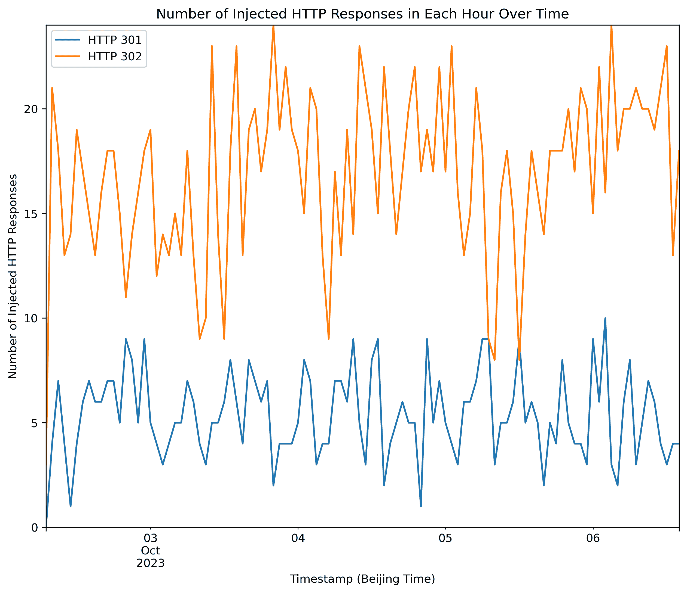

<!--yml
category: 防火墙
date: 2026-06-12 19:00:54
-->

# 中国的防火长城自2023年10月1日起封锁了1.1.1.1

> 来源：[https://gfw.report/blog/blocking_of_1111/zh/](https://gfw.report/blog/blocking_of_1111/zh/)

自 2023 年 10 月 1 日起，已有[许多](https://github.com/net4people/bbs/issues/285#issuecomment-1742195415) [报告](https://github.com/net4people/bbs/issues/292#issuecomment-1742192257)称中国开始屏蔽 `1.1.1.1`。

在 [Net4People的另一篇帖子](https://github.com/net4people/bbs/issues/285) 的讨论中提到，中国在 2023 年 9 月 5 日至 20 日期间通过注入 TCP RST 包来阻断 `1.1.1.1:443`。

## 主要观察结果

以下是我们在 2023 年 10 月 1 日，从腾讯云北京（`AS45090`）的一台 VPS 上的观察：

*   与 @5e2t 的观察不同，我们未能在 `1.1.1.1:443` 上看到 TCP RST 注入。尤其是，我们能够使用 `curl -v https://1.1.1.1` 成功获取完整网页。这表明此次新的审查事件在不同地理位置或不同 AS 之间存在不一致性。
*   我们观察到，`1.1.1.1` 的 TCP 端口 `80` 有可能被注入 `"302 Moved Temporarily"` 或 `"301 Moved Permanently"` 消息，试图将用户重定向到国家反诈中心网站（[维基](https://en.wikipedia.org/wiki/National_Anti-Fraud_Center)）。

## 对 `1.1.1.1:80` 注入的分析

以下是一个没有注入的例子：

```
ubuntu@VM-32-5-ubuntu:~$ curl -v http://1.1.1.1
... 
```

这是一个 `"302 Moved Temporarily"` 被注入的例子：

```
ubuntu@VM-32-5-ubuntu:~$ curl -v http://1.1.1.1
... 
```

特别地，输出中 **已编辑** 的参数总共有 319 个字符。从同一观察点跨时间查询时，只有 `第129到150个字符（22个字符）` 和 `第257到278个字符（22个字符）` 发生变化。目前尚不清楚该参数编码了什么信息。

来自 `1.1.1.1` 的真实 `301 Moved Permanently` 响应最终仍会到达客户端（但比注入消息更晚到达），表明审查方并没有丢弃来自 `1.1.1.1:80` 的真实响应。

承载国家反诈中心网站的 IP `182.43.124.6` 的 ASN：

| host | asn | asname | cc | registry |
| --- | --- | --- | --- | --- |
| 182.43.124.6 | AS58519 | CHINATELECOM-CTCLOUD Cloud Computing Corporation, CN | CN | apnic |

## 实验

我们在腾讯云北京（ASN AS45090）的一个观察点进行了持续实验。具体来说，我们每分钟执行一次 `curl https://1.1.1.1` 和 `curl http://1.1.1.1`，并捕获网络流量。

以下是基于我们在 2023 年 10 月 1 日星期日 19:54（北京时间，UTC+8）到 10 月 6 日星期五 14:43（北京时间，UTC+8）收集到的数据的分析。总共进行了 `6169` 个 HTTP 请求，其中我们接收到 559 个被注入的 `HTTP/1.1 301 Moved Permanently` 报文和 1760 个 `HTTP/1.1 302 Moved Temporarily` 报文。

下表总结了每种注入响应的所有可能值：

| HTTP 状态码 | 301 | 302 |
| --- | --- | --- |
| 注入总次数 | 559 | 1760 |
| 注入比例（6169 请求中占比） | 9.06% | 28.5% |
| IP ID | 0X99b3 | 0x4c57 |
| IP TTL | 251 | 251 |
| IP Flags | 0x0 | 0x0 |
| TCP Flags | 0x18 (PSH+ACK) | 0x19 (PSH+ACK+FIN) |
| TCP 窗口大小 | 502 | 65535 |

与 @klzgrad 的观察对比：

> 注入的 HTTP/1.1 301 Moved Permanently 报文的 IP ID 为 0x99d1、0x99d2、0x99d3、0x99d4。注入的 HTTP/1.1 302 Moved Temporarily 报文的 IP ID 为 0x4c57。

我们仅观察到 `HTTP/1.1 301 Moved Permanently` 注入的 IP ID 值为 `0x99b3`，与报告的四个值不同。

> 它们也有一致的 TTL。

我们同样观察到 TTL 值一致，并且其值与真实的 `1.1.1.1` 服务器发出的报文相同。

下图展示了我们每小时接收到的注入数量。我们每小时大约发送 60 个请求，`301` 和 `302` 响应的平均注入率仅分别为 9.06% 和 28.5%：



* * *