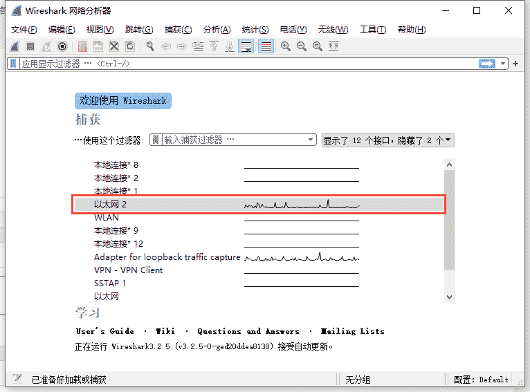

<!--yml
category: 社会工程
date: 2022-11-10 10:30:40
-->

# 使用Wireshark抓包获取QQ好友的IP地址-FancyPig's blog

> 来源：[https://www.iculture.cc/sg/pig=273](https://www.iculture.cc/sg/pig=273)

## 介绍

很多人喜欢在互联网上装逼、口嗨，很多骗子在互联网上各种嚣张，通过这个教程可以很好的治一治这些人，本教程教大家如何通过Wireshark获取QQ好友的IP地址。

## 声明

本教程仅用于教育目的，请不要从事违法用途。

## 图文教程

### 正文

1.打开WireShark，选择你现在使用的网络接口

<figure class="wp-block-image"></figure>

2.打开后就会有大量网络数据显示出来，然后按Ctrl+F快捷键 设置搜索参数（如图所示）→分组详情→字符串→填写”020048″

<figure class="wp-block-image"></figure>

3.与你想获取IP地址的好友进行语音通话

<figure class="wp-block-image"></figure>

4.待对方接受语音通话后或WireShark可以自动定位至连接数据（部分版本不接受通话也能获取到IP 但我现在使用的最新版QQ不行了 可以尝试下载旧版的PC QQ），然后点击WireShark里的红色方块把捕获给暂停（防止数据过多不好查找），最后点击在WireShark软件中点击查找即可跳至符合条件的记录，只会有两种IP地址记录，一种是192.168开头的保留地址（你自己的局域网IP），另外一种就是对方的公网IP了。

<figure class="wp-block-image"></figure>

<figure class="wp-block-image"></figure>

### 定位工具

定位查询
[https://www.chaipip.com/ip.php](https://www.iculture.cc/?golink=aHR0cHM6Ly93d3cuY2hhaXBpcC5jb20vaXAucGhw)
[https://www.opengps.cn/Data/IP/ipplus.aspx](https://www.iculture.cc/?golink=aHR0cHM6Ly93d3cub3Blbmdwcy5jbi9EYXRhL0lQL2lwcGx1cy5hc3B4)

## Wireshark教程

下面的视频资料可以更深入的使用wireshark

## Wireshark下载