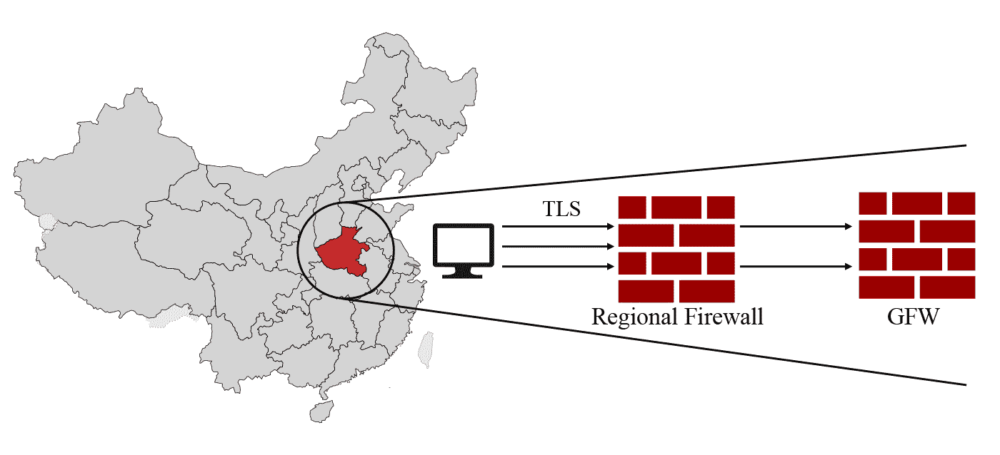
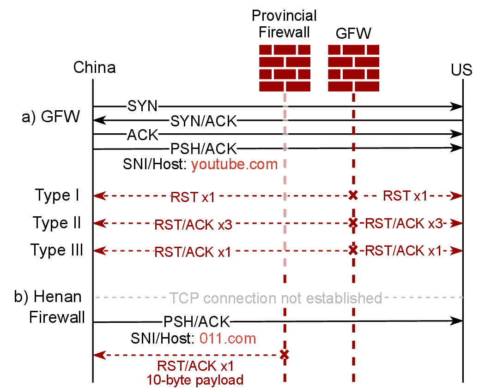
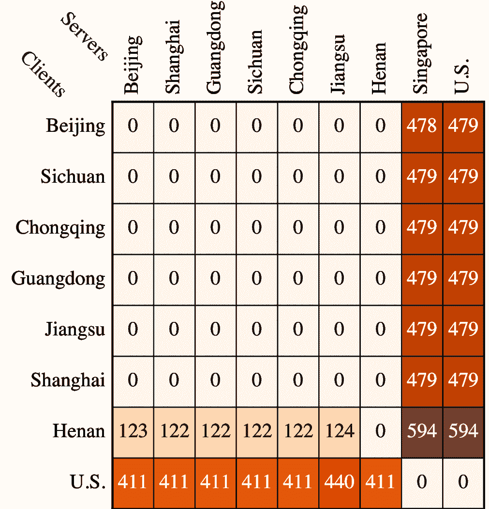
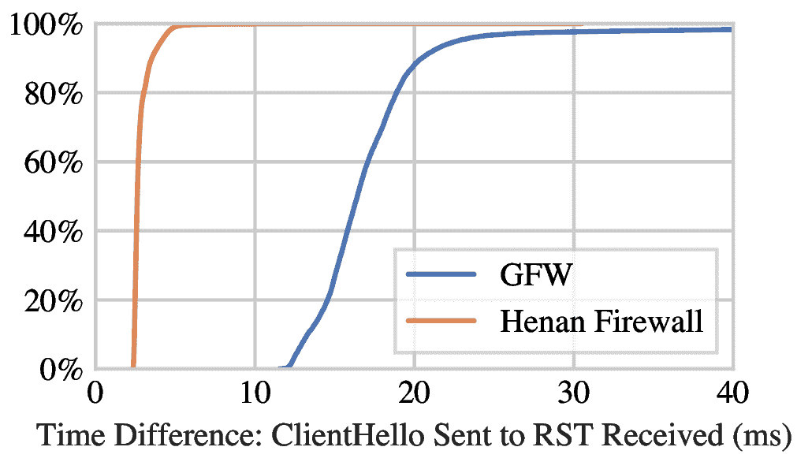
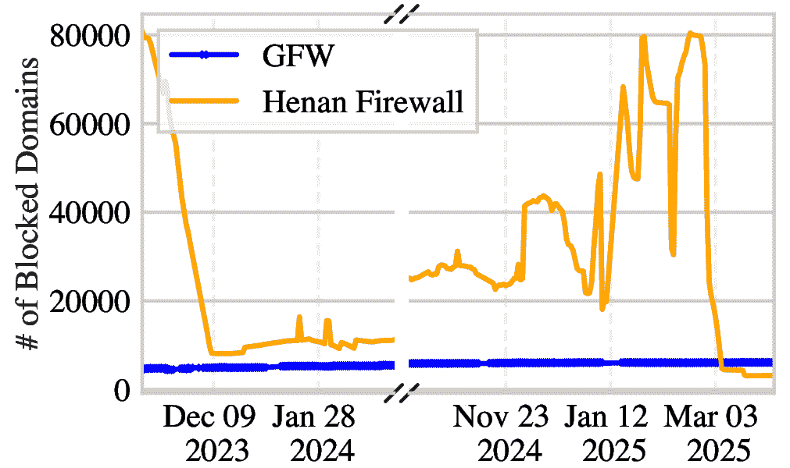
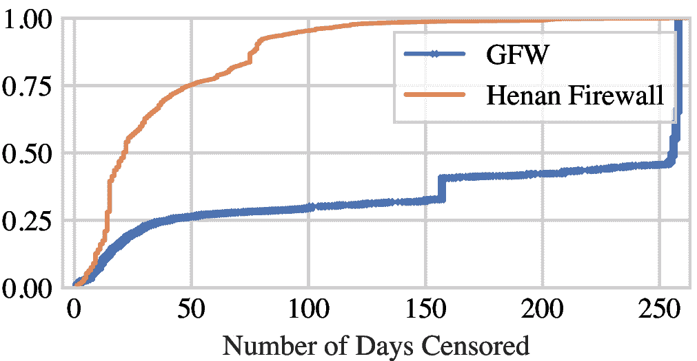
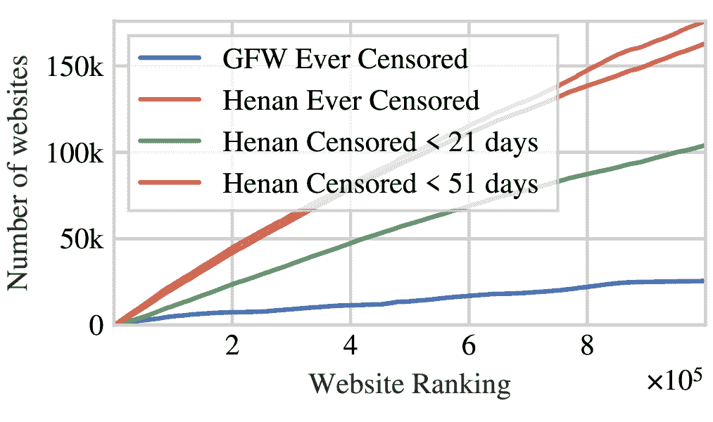
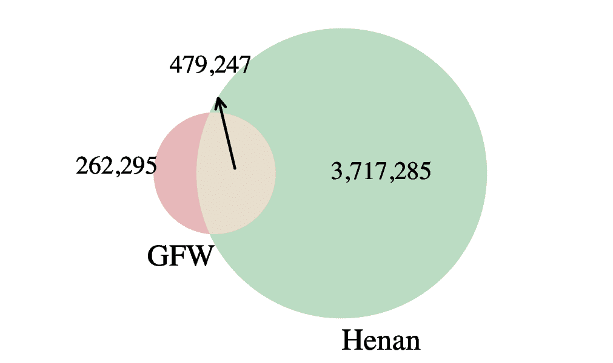

<!--yml
category: 防火墙
date: 2026-06-12 19:00:27
-->

# 墙中之墙：中国地区性审查的兴起

> 来源：[https://gfw.report/publications/sp25/zh/](https://gfw.report/publications/sp25/zh/)

# 墙中之墙：中国地区性审查的兴起

长期以来，中国的互联网审查有着相对集中的政策和统一的实现，这套系统被称为中国防火长城（GFW）。然而，自2023年8月以来，有传闻称河南省部署了自己的地区性审查系统。在这项工作中，我们对河南省的省级审查进行描述和分析，并将其与国家级的GFW进行了比较。我们发现，河南建立了基于TLS SNI和HTTP Host的审查机制，用于检测和封锁离开该省的流量。虽然河南防火墙在复杂性和应对网络流量多样性方面有所欠缺，但其不稳定且激进的二级域名封锁策略，一度使其封锁的网站数量达到GFW的十倍之多。我们基于对河南防火墙的流量解析缺陷和注入行为的观察，提出了一些简单的仅需客户端实现的办法来绕过河南省的审查。我们的工作记录了一种值得警惕的现象，即中国的地区性审查正在抬头。

中华人民共和国开发并维护着世界上最复杂的互联网审查系统之一，通常被称作中国防火长城（GFW）。通过DNS投毒 [[1](#cite:Duan2012a), [2](#cite:Chai2019a), [3](#cite:Hoang2021a), [4](#cite:Anonymous2020a), [5](#cite:Fan2025a)]、HTTP Host头部过滤 [[6](#cite:Clayton2006a), [7](#cite:Wang2017a), [8](#cite:Rambert2021a), [9](#cite:Hoang2024a)]、TLS SNI/ESNI过滤 [[2](#cite:Chai2019a), [9](#cite:Hoang2024a), [10](#cite:Bock2020ESNI), [11](#cite:Bock2021c) §3]、IP地址封锁 [[2](#cite:Chai2019a) §4]、主动探测 [[12](#cite:Ensafi2015b), [13](#cite:Dunna2018a), [14](#cite:Alice2020a), [15](#cite:Wu2023a) §5] 以及代理流量检测 [[15](#cite:Wu2023a) §4] 等手段，中国阻止其公民访问大量的互联网内容和服务。

长期以来，中国的审查系统一直被认为在政策和实现两方面都相对集中化。实证测量揭示了中国对审查策略 [[3](#cite:Hoang2021a), [4](#cite:Anonymous2020a), [9](#cite:Hoang2024a), [15](#cite:Wu2023a)]、软件更新 [[16](#cite:Sakamoto2024a) §4.5] [[5](#cite:Fan2025a) §VII] 和基础设施 [[14](#cite:Alice2020a) §3.4] [[4](#cite:Anonymous2020a) §5] 进行统一的协调与管理。审查设备部署在国家网络边界 [[4](#cite:Anonymous2020a), [17](#cite:Xu2011a), [18](#cite:Wright2012a)]，检测并过滤进出国家的流量。因此，在中国国内交换的流量不会受到GFW的检测或封锁。

然而，近期的传闻表明，这种集中统一的审查模式可能已不再是中国互联网审查的全貌。2023年8月，在中国人口第三大省、重要的劳务中心——河南省的用户开始报告，一些在中国其他地区可以访问的网站，在当地却无法访问 [[19](#cite:Henan-user-report)]。

在本研究中，我们首先探讨了在发现河南地区性审查后自然提出的一个问题（[第3节](#sec:3-detecting-regional-censorship)）：中国的其他省份是否也部署了相同或类似的地区性审查？我们在中国的七个省市进行了测量研究，包括北京、上海、广东、浙江、江苏、四川和河南，以识别潜在的地区性审查。 可能由于我们在中国所能使用的测量点有限，我们没有在除河南以外的六个省份发现地区性审查的证据。

随后，我们分析了河南省新兴的地区性审查，将其封锁策略和实现与国家级GFW进行了比较。如[图1](#fig:1-two-firewalls)所示，我们的调查显示，河南的省级中间设备通过基于HTTP Host和基于TLS服务器名称指示（SNI）的过滤来封锁对特定HTTP和HTTPS网站的访问（[第4.1节](#sec:4.1-methodology)）。与监控并封锁进出境流量的GFW不同，这个地区性防火墙仅审查离开该省的流量（[第4.2节](#sec:4.2-what-traffic-is-targeted)）。它在连接追踪和解析逻辑（[第4.3节](#sec:4.3-how-the-henan-firewall-parses-connections)）、注入行为和指纹（[第4.4节](#sec:4.4-how-the-henan-firewall-blocks-traffic)）以及网络位置（[第4.5节](#sec:4.5-where-are-the-censorship-devices-deployed)）方面也不同于GFW。

[图1](#fig:1-two-firewalls)：河南省部署了基于TLS SNI和HTTP Host的审查中间设备，用于检测和封锁离开该省的流量。

我们进行了一项长期研究，以了解河南防火墙所封锁的内容及其与 GFW 所封锁内容的差异（[第5节](#sec:5-understanding-the-blocklists)）。在 2023 年 11 月至 2025 年 3 月期间（2024 年 3 月至 10 月之间没有测量），我们每天测试 Tranco 排名前一百万的域名，并每周测试 CZDS 的 2.27 亿个域名。我们发现河南防火墙采用了比 GFW 更激进且不稳定的封锁策略。河南防火墙累计封锁了 420 万个域名，是 GFW 累计封锁列表规模的五倍多。造成这种情况的一个关键原因是其封锁了许多通用二级域名（如 *.com.au）。我们的测试还揭示，在一些时期，其封锁的域名数量是 GFW 的十倍之多。

基于观察到的解析缺陷和注入行为，我们介绍规避技术来绕过这种地区性审查（[第6节](#sec:6-circumvention-strategies)），这些技术已被许多流行的反审查工具使用。河南的地区性审查标志着中国首个被正式记录的省级自主运作防火墙案例。我们希望这项研究能向更广泛的审查研究社区发出警报，以识别、调查和应对中国及其他地区出现的地区性审查。

中国防火长城 (GFW) 是部署在中国的一系列不同的审查设备和机制。GFW利用部署在中国边界自治系统 (AS) 的网络中间设备来检测和封锁互联网流量 [[17](#cite:Xu2011a)]。GFW 不仅封锁特定网站和网络服务，而且试图识别和封锁翻墙行为。

网站审查。 为了封锁对特定网站和服务的访问，GFW 通常同时使用多种技术手段，包括 DNS 污染 [[1](#cite:Duan2012a), [3](#cite:Hoang2021a)]、基于 HTTP Host 的过滤 [[8](#cite:Rambert2021a)]、基于 TLS SNI/ESNI 的过滤 [[2](#cite:Chai2019a), [9](#cite:Hoang2024a), [10](#cite:Bock2020ESNI), [20](#cite:2022-tls-blocking)] 以及 IP 地址封锁 [[2](#cite:Chai2019a) §4]。

为了审查 DNS 流量，GFW设备并联（旁路分光部署）于网络，注入带有错误 IP 地址的伪造 DNS 响应，以阻止对特定域名的访问 [[3](#cite:Hoang2021a), [4](#cite:Anonymous2020a), [5](#cite:Fan2025a), [21](#cite:Farnan2016a), [22](#cite:Anonymous2014a)]。2002 年的早期报告记录了 GFW 在其伪造响应中使用单一错误 IP 地址 [[23](#cite:Dong2002a), [24](#cite:Zittrain2003a)]。随着时间的推移，其演变成了一个更复杂的系统，使用了越来越多的虚假地址，并扩大了其域名封锁列表 [[3](#cite:Hoang2021a), [4](#cite:Anonymous2020a), [22](#cite:Anonymous2014a), [25](#cite:Lowe2007a)]。研究人员还发现过 GFW DNS注入系统中的内存数据泄露漏洞 [[5](#cite:Fan2025a), [16](#cite:Sakamoto2024a), [26](#cite:gfw-looking-glass-post)]。

为了审查 HTTP 和 TLS 流量，GFW 有状态地检查连接中未加密的文本。一旦在 HTTP 请求的 Host 字段或 TLS ClientHello 的服务器名称指示 (SNI) 扩展中检测到被审查的域名，GFW 会向连接两端的主机注入 TCP RST 数据包以终止连接 [[6](#cite:Clayton2006a), [7](#cite:Wang2017a), [9](#cite:Hoang2024a), [27](#cite:tang2016depth), [28](#cite:Bock2021b)]。[图2](#fig:2-waterfall-diag) 展示了 GFW 对包含禁止域名的 TLS Client Hello 的 SNI 的连接的审查。

[图2](#fig:2-waterfall-diag)：河南防火墙和三种不同类型 GFW 的概述。我们在数据包的 SNI 或 HTTP Host 字段中使用仅被某一种墙审查的域名，以单独触发和研究每种墙的审查机制。例如，在 2024 年 4 月，011.com 仅被河南防火墙封锁，而 youtube.com 仅被 GFW 封锁。

GFW 通常是双向审查的，这意味着进入和离开中国的流量都可能触发其审查 [[4](#cite:Anonymous2020a), [9](#cite:Hoang2024a), [29](#cite:Sparks2012a)]。审查中间设备的双向审查使得研究人员能够从国家外部测量审查 [[3](#cite:Hoang2021a), [30](#cite:Marczak2015a), [31](#cite:Pearce2017b)]。

诸如 OONI [[32](#cite:Filasto2012a)]、Censored Planet [[33](#cite:Raman2020c)] 和 ICLab [[34](#cite:Niaki2020a)] 等项目多年来一直在全球范围内测量审查。也已经有几个大型项目专为监控中国的网站审查，包括 GreatFire Analyzer [[35](#cite:greatfire_analyzer)]、Blocky [[36](#cite:greatfire_blocky)]、GFWatch [[3](#cite:Hoang2021a)] 和 GFWeb [[9](#cite:Hoang2024a)]。虽然长期的、大规模研究在跟踪和理解 GFW 封锁列表变化方面表现出色，但有时重新审视现有的审查机制仍然可以揭示审查者的新更新。例如，Bock 等人 [[11](#cite:Bock2021c)] 发现了中国次级的 TLS 审查中间设备，这些设备在被深入分析之前一直未被注意到。

代理审查。 仅仅对网站进行封锁并不足以阻止用户访问被禁止的内容，因为用户可以使用翻墙工具来绕过封锁。因此，GFW 与中国的互联网用户之间展开了一场看似永无止境的猫鼠游戏 [[37](#cite:cat-and-mouse)]。例如，GFW 采用主动探测技术来识别和封锁翻墙工具，如 Tor [[12](#cite:Ensafi2015b), [13](#cite:Dunna2018a), [38](#cite:Winter-obfs2-probe), [39](#cite:Winter2012a), [40](#cite:knock-knock-tor)] 和 Shadowsocks [[14](#cite:Alice2020a), [15](#cite:Wu2023a) §5]，现在这些工具已可以成功抵御主动探测 [[41](#cite:Anonymous2021ShadowsocksAdvise), [42](#cite:Anonymous2021ShadowsocksTutorial), [43](#cite:Frolov2020a), [44](#cite:Frolov2020b)]。GFW 还使用流量分析以识别和封锁完全加密的代理 [[15](#cite:Wu2023a)]。

其他审查机制。 中国还存在一些独特的审查组件，似乎区别于 GFW 针对网站和代理的审查。其中值得注意的是，在 2015 年，研究人员发现了中国的“大炮”(Great Cannon)，它向 HTTP 流量中注入 Javascript，以利用受害者的浏览器发动对特定主机的拒绝服务攻击 [[30](#cite:Marczak2015a)]。

在审查政策严格的国家，本地化或分散化的审查机制很常见。在俄罗斯，数千家私营互联网服务提供商 (ISP) 各自实施自己的过滤机制，导致审查环境多样化 [[45](#cite:Xue2022b), [46](#cite:Ortwein2023a), [47](#cite:Ramesh2020a)]。类似地，在印度，研究人员表明 ISP 在执行政府审查令方面存在显著差异，导致全国范围内的审查碎片化 [[48](#cite:Yadav2018a)]。

然而，先前的研究表明，中国的审查系统和政策在全国范围内基本是统一和集中化的。2011 年，Xu 等人 [[17](#cite:Xu2011a)] 测量了中国审查设备的位置。他们发现，中国的关键词审查中间设备主要位于网络边缘，并采用符合当时全国性封锁策略的规则。2012 年，Wright [[18](#cite:Wright2012a)] 对中国的 DNS 审查进行了一项小规模研究，发现DNS 响应在全国各地有所不同。然而，这项工作没有考虑 DNS 响应变化的其​​他可能原因（例如基于地理位置的负载均衡，或 DNS 配置的变化）。2018 年，Bao 等人 [[49](#cite:Bao2018a)] 从住宅和移动 IP 地址测量了中国的 DNS 投毒差异。全网地持续性测量揭示了中国在审查策略 [[4](#cite:Anonymous2020a), [3](#cite:Hoang2021a), [15](#cite:Wu2023a), [9](#cite:Hoang2024a)]、审查软件更新 [[16](#cite:Sakamoto2024a) §4.5] [[5](#cite:Fan2025a) §VII] 和审查基础设施 [[14](#cite:Alice2020a) §3.4] [[4](#cite:Anonymous2020a) §5] 方面，进行了统一的协调和管理。

中国境外的反审查研究人员通常依赖境内用户的报告来了解中国审查策略的新变化和升级。部分原因是研究人员难以在中国境内获得多样化的测量服务器，并持续监测各种互联网服务和协议的可访问情况。令人鼓舞的是，在线论坛——例如 Net4People BBS [[50](#cite:net4people_bbs_issues)]、NTC Party 论坛 [[51](#cite:ntc_party_forum)]，以及 Xray [[52](#cite:xtls_xray_core_issues)]、V2Ray [[53](#cite:v2fly_v2ray_core_issues)]、sing-box [[54](#cite:sagernet_sing_box_issues)] 和 Hysteria [[55](#cite:apernet_hysteria_issues)] 等流行反审查工具的 GitHub 问题汇报页面——为用户在遇到新的审查事件时立即报告遭遇提供了平台。这也使得研究人员能够迅速调查这些报告 [[37](#cite:cat-and-mouse)]。

这种众包协作的方式在识别和对抗河南省的省级审查方面也很有效。具体来说，我们的研究始于一群河南用户报告他们无法访问某些网站 [[19](#cite:Henan-user-report), [56](#cite:net4people442), [57](#cite:net4people416), [58](#cite:ghostcomment), [59](#cite:tsinbei_tcp_timestamps)]。然后，我们在河南省获得了一台服务器，并确认了地区性防火墙的存在。特别是，如[图2](#fig:2-waterfall-diag)所示，我们发现河南地区性防火墙会针对某些服务器名称指示（SNI）和 HTTP Host 值封锁 TLS 和 HTTP 连接，但其运作方式与 GFW 不同。最显著的区别是，河南的地区性防火墙通过向客户端注入一个包含固定 10 字节载荷的 TCP RST+ACK 数据包来封锁 TCP 连接。这种独特的 TCP RST 数据包载荷将河南防火墙与 GFW 注入的所有三种类型的数据包区分开来。

在河南省发现地区性审查自然地引出了一个的问题：中国的其他省份是否也部署了相同或类似的地区性审查？下面，我们将通过全国范围的测量来探讨这个问题。

我们的目标是通过比较中国境内外每对主机之间被封锁的域名数量，来量化中国各地 TLS 审查的地区性差异。如[表1](#tbl:1-experiment-timeline-and-vantage-points)第二行所总结的，我们在中国的七个城市各获得了两个测量点，包括上海、北京、重庆、广州（广东省）、南京（江苏省）、成都（四川省）和郑州（河南省）。我们还在中国境外的三个地点各设置了两个 VPS：西雅图（美国）、旧金山（美国）和新加坡。我们选择测量点的依据详见[第7节](#sec:7-ethics)中的一系列伦理考量。

[表1](#tbl:1-experiment-timeline-and-vantage-points)：实验时间线和测量点。我们总共使用了位于河南省郑州市的China VPS（CVC, AS4837）的14台虚拟主机，位于旧金山（SF）、新加坡（SG）和西雅图（SE）的Akamai Linode（LD, AS63949）的6台虚拟主机，位于北京（BJ）、上海（SH）、重庆（CQ）、广东省广州市（GZ）、四川省成都市（CD）、江苏省南京市（NJ）的腾讯云（TC, AS45090）的12台虚拟主机，以及一台位于美国某大学的裸金属网络流量捕获服务器（TAP）。

| 实验名称 | 实验时间 | 实验时长 | 中国测量点 | 境外测量点 | 章节 |
| 识别 | 24年7月10日 | 1 |  天 | 12 (TC), 2 (CVC: HN) | 4 (LD: SG,SE) | §[3](#sec:3-detecting-regional-censorship) |
| 特征分析 | 23年10月2日 – 24年11月12日 | 13 |  个月 | 2 (CVC: HN) | 1 (LD: SF), 3 (TC: GZ,BJ,SH) | §[4](#sec:4-characterizing-the-censorship-devices) |
| 流量分析 | 24年10月31日 | 1 |  小时 | – | 1 (TAP: US) | §[4.3](#sec:4.3-how-the-henan-firewall-parses-connections) |
| 定位 | 23年10月2日 – 23年12月8日 | 2 |  个月 | 1 (CVC: HN), 1 (TC: GZ) | 1 (LD: SF) | §[4.5](#sec:4.5-where-are-the-censorship-devices-deployed) |
| 封锁列表 | 23年11月5日 – 24年3月5日 & 24年10月7日 – 25年3月31日 | 9 |  个月 | 14 (CVC: HN), 2 (TC: GZ) | 2 (LD: SF) | §[5](#sec:5-understanding-the-blocklists) |

对于中国境内或境外的每个地点的两个 虚拟主机（VPS），我们把其中一个作为客户端，把另一个作为水槽服务器。水槽服务器被配置为接受端口 1 到 65535 上的 TCP 握手。它们会发送ACK来确认发送给它们的 TCP 数据，但绝不会向客户端发回任何 TCP 载荷。我们在客户端和水槽服务器上都配置了 iptables 规则来丢弃任何传出的 RST 数据包。这样，任何一端收到的 RST 数据包都一定是由网络路径上的某些中间设备注入的伪造包。因此，我们可以通过检查 TCP 连接是否被重置来确认审查的存在。

我们在 2024 年 7 月 10 日，在每对客户端和水槽服务器之间发送了包含各种不同 SNI 值的 TLS 流量。具体来说，我们使用了 Tranco 列表 [[60](#cite:LePochat2019tranco)] 5YZ7N 中排名前 10,000 的域名进行测试。 为了减少因丢包导致的假阴性概率，我们在同一天重复测试了三次，并在每次测试中，让操作系统控制数据包的重传。

局限性。 理想情况下，我们希望使用多样化的测量点来识别中国潜在的地区性审查。然而，由于获取中国的VPS很困难，我们只能在有限数量的地点和自治系统（AS） 中获取测量点。虽然使用住宅测量点可以让我们从中国更多的网络位置观察到潜在的审查中间设备，但这可能会给不知情的用户和住宅代理提供商带来潜在风险[[61](#cite:Mi2019-resident-evil)]。出于这个原因，我们专注于使用中国的两家大型 VPS 提供商——China VPS和腾讯云，以避免给个人带来风险或迫害。我们利用了这两家 VPS 提供商提供的所有可用地点，以最大化我们的覆盖范围。我们承认我们的结果仅限于测量 TLS 审查，这可能会遗漏针对其他协议的地区性审查。此外，由于配置错误，我们没能使用新加坡的客户端进行测试，因此错过了从该视角进行的审查测量。

[图3](#fig:3-client-to-sink-server-data-matrix) 显示了不同地区之间被封锁域名的数量。我们首先观察到，从中国发往我们位于新加坡和美国的水槽服务器的连接，受到国家级中国防火长城（GFW）的影响几乎相同，在大约 10,000 个域名中约有 479 个被封锁。最显著的封锁发生在河南省，省级（河南防火墙）和国家级（GFW）审查机制共同拦截，导致了较高的封锁数量。

[图3](#fig:3-client-to-sink-server-data-matrix)：该矩阵显示了在不同区域的每对主机之间被封锁的域名数量。对于每对主机，我们发送了包含 Tranco 列表 [[60](#cite:LePochat2019tranco)] 5YZ7N（生成于 2023 年 8 月 15 日）中排名前 10,000 个域名的 SNI 值的 TLS ClientHello 消息。结果表明：1）河南省存在地区性审查，证据是从河南郑州向中国其他地区的水槽服务器发起连接时，被封锁域名的数量不为零；2）河南的审查不是双向的，因为从外部向河南发起 TLS 连接并未触发任何封锁；3）GFW 维护着一个仅在中国境内访问时才会被审查的封锁列表，证据是由内向外和由外向内测试时被封锁域名数量有差异。

离开河南的流量受到地区性防火墙的审查，无论水槽服务器的位置如何，即使是发往中国境内其他地区的连接也会受到审查。平均而言，有 122 个域名被河南防火墙封锁。我们没有观察到在河南省内交换的 TLS 连接被封锁；然而，由于我们的客户端和水槽服务器都位于同一个数据中心，我们只能谨慎地得出结论，即河南防火墙不影响该数据中心内部的流量。

当从河南省郑州连接到中国境外地点（新加坡和西雅图）时，总共有 594 个域名被封锁。这表明两个具有独立封锁列表的防火墙在同时运作，河南防火墙在流量到达 GFW 之前对其进行审查，从而增加了被封锁域名的总数。然而，我们没有观察到从中国其他区域连接到河南或中国境内其他水槽服务器区域时存在任何封锁。这一发现表明，河南防火墙是中国已知的第一个部署地区性防火墙的案例。

此外，如[图3](#fig:3-client-to-sink-server-data-matrix)最后一行所示，从美国到中国不同地点的测试一致地识别出相同的 411 个被 GFW 封锁的域名，只有一个例外：从美国到江苏省的测试检测到 440 个被封锁的域名。进一步分析表明，在江苏省由外向内方向额外被封锁的 29 个域名是 GFW 在由内向外方向封锁的 479 个域名的一个子集。这一发现表明，这 29 个域名的额外审查很可能并不反映江苏省特有的地区性审查。相反，它表明江苏省内的 GFW 被配置为对这29个域名进行双向封锁。

这些结果尤其值得注意，因为它们显示了远程测量无法触发地区性防火墙，更重要的是，揭示了 GFW 的不对称行为。虽然从中国境内发起的连接平均有 479 个域名被封锁，但从中国境外发起的连接只有 411 个域名被封锁。这种差异表明 GFW 对源自中国境内的流量执行不同的封锁列表。直到最近，人们仍普遍认为 GFW 是对称运作的，无论流量方向如何，都会触发相同的封锁列表。然而，最近的研究表明这种假设是不正确的 [[9](#cite:Hoang2024a)]，我们在此的发现与其观测结果一致。

我们注意到 GFW 和河南防火墙都在不同程度上表现出不对称的封锁。如[图4(a)](#fig:4a-henan-inside-outside)所示，虽然离开河南的流量受到地区性防火墙（由内向外）的影响，但进入河南的入站流量（由外向内）完全不会触发地区性防火墙。这与 GFW 形成对比，GFW 是双向的（但其行为根据查询的域名而表现出不对称性）。

[图4(b)](#fig:4b-gfw-inside-outside) 提供了一个清晰的例子来说明这种行为。在我们的案例中，当一个 SNI 值为 docker.com 的 TLS ClientHello 从中国境内发送时（由内向外），GFW 会通过三个 TCP RST 数据包触发封锁。然而，当相同的 TLS ClientHello 从中国境外发送时（由外向内），GFW 不会触发任何封锁。另一方面，当发送带有 SNI 值 youtube.com 的 TLS ClientHello 数据包时（在此示例中），无论数据包是从中国境内还是境外发送，GFW 都会在两种情况下触发封锁。这种行为表明存在一个明显的域名封锁列表，这些域名仅在从中国境内访问时才会被 GFW 审查。

[图4](#fig:4-demo-two-firewalls): [(a)](#fig:4a-henan-inside-outside) 河南防火墙不审查进入河南的入站 TLS 或 HTTP 流量，这与 GFW 采用的双向审查形成对比。 [(b)](#fig:4b-gfw-inside-outside) GFW 的 TLS 和 HTTP 审查机器检查进出中国的双向流量；然而，某些域名仅在从中国境内访问时才被审查。在此示例中，虽然从中国境内发送带有 SNI 值 docker.com 的 TLS ClientHello 可以触发 GFW 发送三个 TCP RST 数据包，但从中国境外发送时则不会触发任何封锁。

在我们检测地区性审查的实验中，我们无意中发现了 GFW 运作机制的一个重要方面，而这直到最近才被记录下来 [[9](#cite:Hoang2024a)]。新观察到的 GFW 和地区性防火墙共有的不对称性，表明审查测量需要由内向外的测量，以全面捕捉审查的范围和细微差别。仅仅依赖由外向内的远程测量，正如其他许多研究中常见的那样，则无法提供此类审查机制的全面情况。

为了进一步证实 GFW 的不对称行为，我们提供了一个域名列表，这些域名仅在从中国境内发送 TLS ClientHello 消息时被封锁，如[表2](#tbl:2-gfw-blocked-domains)所示。在我们的实验中，10,000 个域名中有 68 个在从中国境外测试时未触发任何审查，仅在从中国境内探测时才被封锁。这些域名包括流行的网站，如 google.com、nyt.com 和 docker.com。该列表提供了具体的证据，证明 GFW 根据流量来源和相关域名选择性地执行其封锁列表。

[表2](#tbl:2-gfw-blocked-domains)：仅能从中国境内发送 TLS ClientHello 消息时触发 GFW 封锁的部分域名示例。截至 2024 年 7 月 10 日，这些域名在从中国境外向境内发送时未触发审查。在我们测试的 10,000 个 Tranco 热门域名中，有 68 个域名仅在由内向外发送时触发封锁，没有域名仅在由外向内发送时触发封锁。

| binance.com | godaddy.com | note.com |
| cdninstagram.com | google.com | nyt.com |
| docker.com | google.com.hk | tiktokcdn.com |
| gmail.com | linktr.ee | torproject.org |

自 2023 年 10 月以来，我们进行了一系列实验来分析审查设备的特征，并理解中国防火长城（GFW）与河南地区性审查设备之间的差异。在本节中，我们将回答几个研究问题：地区性审查设备位于何处？哪些数据包可以触发河南 SNI 防火墙？河南防火墙监控哪些端口？注入的TCP RST 包是否具有特定的指纹？河南防火墙是否会引发残余审查？

如前所述，我们针对地区性和国家级两种防火墙的具体特征制定了一套测量方法。为了精确评估每种防火墙的影响，我们的方法单独隔离并分析这两个系统。这种基于我们初步观察设计的测量方法，是我们进行全面测量实验的基础。我们的测量方法概述如下。

获取测量点。 我们总共在中国郑州（河南）通过China VPS（AS 4837）获取了 10 个测量点，在广州、北京和上海通过腾讯云（AS 45090）获取了两台 VPS，以及在美国旧金山通过 Akamai 的 Linode（AS 63949）获取了两台 VPS。位于广州、北京、上海和旧金山的 VPS 作为水槽服务器，被设置为监听在从 1 到 65535 的所有端口以接受 TCP 连接，但不向发送方发回任何TCP载荷数据。我们所有的机器都运行 Ubuntu 22.04，并使用 IP2Location [[62](#cite:ip2location)] 数据库验证了它们宣称的位置。我们在[表1](#tbl:1-experiment-timeline-and-vantage-points)中总结了我们实验的时间线和每个实验使用的测量点。

在 VPS 上丢弃传出的 RST 数据包。 我们在客户端和水槽服务器上都配置了 iptables 规则来丢弃所有传出的 RST 数据包。这种配置确保客户端收到的任何 RST 数据包都一定是由中间设备伪造的。

触发基于 TLS SNI 的审查。 我们通过发送在 SNI 字段中包含可能被审查域名的 TLS ClientHello 来触发审查。由于水槽服务器被配置为不发送任何带有载荷的数据包，并且在观察到 FIN 或 RST 数据包之前不切断连接，我们预期收到的任何 RST 数据包都一定是防火墙注入的伪造包。如果包含该域名的 TLS 连接收到了 RST 数据包，我们就将该域名标记为被审查。

触发基于 HTTP Host 的审查。 为了触发 HTTP 审查，我们发送了 HTTP GET 请求，请求的 Host 头部包含被禁止的域名：

`GET / HTTP/1.1\r\nHost: example.com\r\n`

虽然我们后来发现河南防火墙不需要完整的 TCP 握手来触发封锁，但在发送 HTTP 请求之前，我们仍然完成了 TCP 握手，这使得我们对于河南防火墙的测试方法与对 GFW 的测试方法一致。如果包含该域名的 HTTP GET 请求收到了 RST 数据包，我们就将该域名标记为被审查。

隔离河南防火墙。 为了区分河南防火墙和 GFW 的响应，我们识别了每种防火墙的独特指纹。先前的工作记录了 GFW 在观察到包含禁止的SNI的 TLS ClientHello 消息时，会向连接的两端注入最多三个 RST+ACK 数据包来中断连接 [[2](#cite:Chai2019a), [63](#cite:Bock2020b)]。相比之下，河南防火墙仅向连接的客户端注入单个 RST+ACK 数据包。此外，河南防火墙的 RST+ACK 数据包包含载荷，使其易于与 GFW 的响应区分开来。我们将在[第4.4节](#sec:4.4-how-the-henan-firewall-blocks-traffic)中对此进行更详细的介绍。

最后，我们从河南的测量点向广州、北京和上海的服务器发送探测包，以确保我们的流量不会路由到中国境外（在边境可能会遇到 GFW），但仍然受到河南地区性防火墙的影响。

局限性。 我们在河南省的测量仅限于单个自治系统（AS），即中国联通（AS 4837），这是因为在中国获取可用于审查测量的测量点存在困难，并且需要考虑伦理问题。因此，我们的实证结果仅限于这家互联网服务提供商（ISP）的网络环境。节点的缺乏限制了我们确认或描述河南其他 ISP 或 AS 审查的能力。

虽然用户报告表明河南的 ISP 采用了地区特定的审查，但据报告审查的实施方式有所不同 [[64](#cite:Henan-user-report-1)]。例如，Github 用户 5e2t 报告称，中国移动河南公司审查其在蜂窝数据网络上的流量，并且能够重组间隔很近的 TCP 数据包 [[64](#cite:Henan-user-report-1)]，这与我们在[第4.3节](#sec:4.3-how-the-henan-firewall-parses-connections)中观察到的中国联通河南的行为不同。因此，我们的结果应被理解为仅反映了中国联通河南的审查情况，而不一定代表全省所有 ISP 的审查情况。

河南防火墙是否对流量进行抽样监控和审查？ 据观察，一些审查者有时仅监控和审查一部分流量，这可能是为了减少其审查设备的计算负载 [[15](#cite:Wu2023a) §6.3]。然而，我们没有观察到河南防火墙有任何流量采样或概率性封锁行为。我们观察到河南防火墙持续封锁其封锁列表上的域名。我们连续发送了 1,000 个包含被禁止域名的 ClientHello 消息，每个请求都使用一对不同的端口进行发送，并带有微小的间隔。我们建立的每个连接都收到了 TCP RST 数据包，这表明河南防火墙对被禁域名的封锁触发率为 100%。

河南防火墙监控哪些端口？ 先前的工作表明，GFW 的 TLS ESNI 审查中间设备监控所有端口，即 1-65535 [[10](#cite:Bock2020ESNI)]。为了测量河南防火墙，我们向位于中国广州的水槽服务器的所有端口发送了带有已知被禁 SNI 的 TLS ClientHello 消息。我们发现，与 GFW 类似，河南防火墙监控流向任何 TCP 端口号（范围在 1 到 65535 之间）的 TLS 流量。

河南防火墙是双向的吗？ 由于在受审查区域获取测量点存在难度和限制，研究人员通常选择从外部向内进行测量，而不是从内部向外测量。特别是在中国，研究 GFW 的工作 [[3](#cite:Hoang2021a), [4](#cite:Anonymous2020a), [9](#cite:Hoang2024a)] 使用了中国境外的测量点，因为 GFW 具有双向性。然而，正如[第3节](#sec:3-detecting-regional-censorship)所述，从中国境外发送探测不会触发河南防火墙，因为河南的防火墙只审查离开河南的流量。如[图3](#fig:3-client-to-sink-server-data-matrix)所示，我们通过在河南节点和中国其他地区的节点之间发送包含 Tranco 列表 [[60](#cite:LePochat2019tranco)] 5YZ7N 中不同 SNI 值的 TLS ClientHello 消息来测试这一点。我们发现只有离开河南的流量被河南防火墙封锁。先前的工作也观察到 GFW 存在类似的不对称封锁行为 [[9](#cite:Hoang2024a), [10](#cite:Bock2020ESNI)]。

在本节中，我们研究河南防火墙和 GFW 的流量解析逻辑。我们进行实验以检查触发河南防火墙和 GFW 审查的 TCP 握手要求。我们还使用 DPYProxy [[65](#cite:Niere2023a)] 来测试这两种防火墙的 TCP 和 TLS 重组能力，以及是否存在残余审查。我们在[表3](#tbl:3-parsing-logic-of-the-gfw-and-the-henan-firewall)中总结了我们的发现。

[表3](#tbl:3-parsing-logic-of-the-gfw-and-the-henan-firewall)：GFW 和河南防火墙的流量解析逻辑。河南防火墙似乎是无状态的，并且在应对不同网络流量时不如 GFW 健壮。

|  | GFW | 河南防火墙 |
| 需要看到 SYN | ✓ | ✗ |
| 需要看到 SYN+ACK | ✗ | ✗ |
| 支持TCP重组 | ✓ | ✗ |
| 支持TLS重组 | ✗ | ✗ |
| TCP 头部长度要求 | 任意 | 仅 20 字节 |

TCP 握手完整性要求。 网络中间设备的设计者通常需要在流量解析逻辑的健壮性和效率之间进行权衡。例如，由于互联网的非对称路由特性，以及河南防火墙和 GFW 并非总是客户端或服务器的直接邻居（如[表5](#tbl:5-results-from-our-ttl-limited-probing-experiment)所示），网络中间设备可能只能观察到单向的流量。这种特性常常使得中间设备的设计者放弃使用完整的 TCP 三次握手来追踪 TCP 连接并进行审查。在 2024 年 10 月 10 日，我们从河南的测量点测试了河南防火墙和 GFW 对 TCP 握手完整性的要求。我们发送了一个 TCP 数据包，其载荷是一个包含被禁止域名 011.com 作为 SNI 的 TLS ClientHello 消息，发送该数据包之前：1) 我们发送了来自客户端的 SYN 数据包，或 2) 我们发送了来自客户端的 SYN 数据包和来自服务器的 SYN+ACK 数据包，或 3) 我们根本没有发送任何其他数据包。

如[表3](#tbl:3-parsing-logic-of-the-gfw-and-the-henan-firewall)所总结的，虽然 GFW 需要观察到来自客户端的 SYN 数据包（但不需要来自服务器的 SYN+ACK 数据包）才能触发审查 [[9](#cite:Hoang2024a)]，但河南防火墙不需要观察到任何 TCP 握手数据包即可被触发。

。 TCP分段能够将较大的 TCP 载荷分割成较小的载荷。在规避审查的背景下，将 TLS ClientHello 消息分割成多个 TCP 分段已被用于绕过不对数据包进行重组的无状态审查者。然而，我们确认 GFW 执行 TCP 重组，因此是有状态的。另一方面，我们发现河南防火墙不进行 TCP 重组，因此可以通过将 ClientHello 的 TCP 载荷分割成多个 TCP 分段（SNI 分布在这些分段之间）来绕过它。我们通过从河南的测量点向广州的 VPS 发起一个带有被禁止 SNI 的 TLS 连接，并将 ClientHello 分割成两个分段（第二个分段包含被禁止的域名）来测试这一点。我们观察到，虽然完整的 ClientHello 消息被河南防火墙封锁，但如果第一个分段中不包含完整的 SNI 扩展，则可以绕过河南防火墙。

TLS 分片。 虽然 TCP分段长期以来被用来绕过无状态审查者，但 TLS 分片的使用直到最近才由 Niere 等人 [[65](#cite:Niere2023a)] 分析并在他们的 DPYProxy 工具中实现。在 TLS 消息被封装到 TCP 分段之前，它首先被包含在一个称为 TLS 记录的结构中。鉴于 TLS 消息的最大大小超过了 TLS 记录的最大允许大小，TLS 标准允许将 TLS 消息分割到多个 TLS 记录中。Niere 等人 [[65](#cite:Niere2023a)] 发现 GFW 不执行 TLS 重组，因此可以通过将 TLS ClientHello 消息分片到多个 TLS 记录中（其中 SNI 被分割到同一 TCP 载荷内的多个 TLS 分片中）来绕过它。我们确认，截至 2024 年 4 月 4 日，河南防火墙和 GFW 都不执行 TLS 重组，因此可以通过 TLS ClientHello 分片来绕过它们。

TCP 头部长度必须为 20 字节。 TCP 头部的第 13 个字节的前四个有效位表示 TCP 数据偏移量，它指定了 TCP 头部的长度（以 32 位字为单位）。当没有 TCP 选项存在时，TCP 数据偏移字段的最小值为 5 个字（20 字节），最大值为 15 个字（60 字节）。

我们发现河南防火墙要求 TCP 头部长度必须正好是 20 字节才能正确解析和封锁 TLS ClientHello 或 HTTP 请求消息。我们在 2024 年 10 月 17 日，通过从河南的测量点向广州的水槽服务器发送包含被禁止消息（例如，带有被禁止 SNI 011.com 的 TLS ClientHello 消息）并设置不同的 TCP 选项来进行测试。在改变 TCP 头部长度的同时，我们确保 TCP 选项始终是四字节的倍数，以符合 TCP 头部的 32 位字对齐要求。我们测试的 TCP 选项包括常见的选项，如最大分段大小（MSS）、窗口缩放、时间戳、选择性确认许可（SAckOk）、无操作（NOP）、选项列表结束（EOL），以及不常用的自定义 TCP 选项。我们发现，只要设置了任何 TCP 选项，河南防火墙就不会封锁连接。

一个自然提出的假设是，河南防火墙不解析 TCP 头部中的 TCP 头部长度字段，并错误地假设 TCP 头部长度始终为 20 字节。这样，当 TCP 头部因 TCP 选项而超过 20 字节时，它会将 TCP 选项视为 TCP 载荷的一部分，从而无法识别完整的 TLS ClientHello 或 HTTP 请求消息。然而，我们证伪了这一假设，并确认河南防火墙确实解析了 TCP 头部长度字段。具体来说，我们首先发送了带有被禁止 SNI 011.com 且 TCP 头部未设置任何 TCP 选项的 TLS ClientHello 消息，并确认该消息被河南防火墙封锁。如果河南防火墙不解析 TCP 头部长度字段，那么无论我们在 TCP 头部中放入什么 TCP 头部长度值，该消息都应该被封锁。我们将 TCP 头部中的 4 位 TCP 头部长度字段更改为所有 2⁴ 种可能的值（从 0 到 15），并为每个 TCP 数据包重新计算了正确的 TCP 校验和，发现河南防火墙仅在 TCP 头部长度值为 5 个字（20 字节）时才封锁连接。该实验表明河南防火墙确实解析了 TCP 头部中的 TCP 头部长度字段，但有一个条件，即仅在 TCP 头部长度为 20 字节时才封锁连接。

虽然我们无法确定此条件背后的意图——也许是审查者的疏忽——但这引出了一个重要问题：由于此条件的存在，有多少真实世界的流量避免了被检测？我们在美国的一所大学网络进行了测试。具体来说，我们使用 Retina [[66](#cite:wan2022retina)] 在 2024 年 10 月 31 日下午 3:56:14 到 4:56:14（UTC–7）的一个小时内捕获了校园网络上所有流量的 TCP 头部长度字段。总共，我们收集了 231 亿个 TCP 数据包和 50 亿个 TLS 数据包。如[图5](#fig:5-header-length)所示，只有 22% 的 TCP 数据包头部长度为 20 字节，只有 19% 的 TLS 数据包头部长度为 20 字节。这一结果表明，河南防火墙可能只能审查大约 20% 的目标连接。

[图5](#fig:5-header-length)：2024 年 10 月 31 日在一所大学网络上捕获的一小时内所有 TCP 和 TLS 数据包的 TCP 头部长度字段分布。总共捕获了约 231 亿个 TCP 数据包和 50 亿个 TLS 数据包。只有 22% 的 TCP 数据包头部长度为 20 字节，而只有 19% 的 TLS 数据包头部长度为 20 字节。这一评估结果表明，河南防火墙可能只能审查大约 20% 的目标连接。

河南防火墙是否采用残余审查？ 残余审查是审查者经常使用的一种手段，即在检测并打断两台主机之间的通讯后，在一定时间内（通常是 90 秒或 180 秒）继续封锁这两个主机（源IP、目的IP、目的端口 - 三元组）之间的所有后续连接。这种现象已被多项研究 GFW 的先前工作记录在案 [[6](#cite:Clayton2006a), [8](#cite:Rambert2021a), [67](#cite:Bock2021a)]。我们发现河南防火墙不执行任何残余审查。在河南防火墙进行任何重置注入后，我们仍然能够使用相同的三元组建立连接。

注入行为指纹分析。 延续前人对 GFW 不断演变的注入行为进行指纹分析的工作 [[7](#cite:Wang2017a) §2.1, [65](#cite:Niere2023a) §3.1, [68](#cite:klzgrad2009gfw), [69](#cite:gfwrev2010http), [70](#cite:Weaver2009a) §7.1.6]，我们对 GFW 和河南防火墙注入的 TCP RST 数据包进行了指纹分析。利用[第4.5节](#sec:4.5-where-are-the-censorship-devices-deployed)中收集的 RST 数据包，我们分析了它们的数据包特征，例如 IP 标识符（IP ID）、IP 生存时间（IP TTL）、TCP 标志、TCP 载荷和载荷长度。

[表4](#tbl:4-injection-behaviors-packet-fingerprints)：河南防火墙与三种类型的 GFW TCP RST 注入器的注入行为和数据包指纹比较。所有注入均由基于 TLS SNI 的审查触发。显示的 IP TTL 是观测值；它们的初始值应该更高。'C' 和 'S' 分别指客户端和服务器。

|  | GFW (I) | GFW (II) | GFW (III) | 河南防火墙 |
| 观测到的 IP TTL | 55–118 | 39–238 | 248 | 58 |
| IP ID | 0000 | 00A3 – FE5F | 9916 – 9933 | 0001 |
| IP 标志 (DF) | 0 | 1 | 0 | 0 |
| TCP 载荷长度 | 0 字节 | 0 字节 | 0 字节 | 10 字节 |
| TCP 载荷 | - | - | - | 0102 03 04 05 06 07 08 09 00 |
| TCP 标志 | RST | RST+ACK | RST+ACK | RST+ACK |
| 数据包数量 | x1 | x3 | x1 | x1 |
| 目标主机 | C&S | C&S | C&S | C |
| 残余审查持续时间 | 180 秒 | 180 秒 | 180 秒 | - |

[表4](#tbl:4-injection-behaviors-packet-fingerprints) 比较了河南防火墙与 GFW 三种类型（I、II、III）的重置数据包注入行为。虽然 GFW 的注入机制同时针对客户端（C）和服务器（S），但河南防火墙仅向客户端注入重置数据包。

检查防火墙 RST 数据包的 IP 和 TCP 标志，我们观察到河南防火墙发送单个 RST+ACK 数据包，且 IP DF（不分片）标志未设置。在 GFW 注入器中，类型 I 发送单个不带 ACK 的 RST 数据包，且 IP DF 标志未设置；类型 II 发送三个相同的 RST+ACK 数据包，且 IP DF 标志已设置；类型 III 发送单个 RST+ACK 数据包，且 IP DF 标志未设置。

三种 GFW 注入器注入的 TCP RST 数据包的观测到的 IP TTL 值呈现一定的范围：类型 I 为 55–118，类型 II 为 39–238，类型 III 为固定的 248。我们观察到河南防火墙注入的 RST+ACK 数据包具有固定的 IP TTL 值 58。需注意，这些是客户端观测到的 IP TTL 值；审查设备设置的初始 TTL 值会更高，随后会因审查设备到客户端的网络跳数而减少。

关于 IP ID 值，我们观察到类型 I GFW 注入一个 IP ID 固定为 0x0000 的 RST 数据包，类型 II GFW 注入三个 IP ID 值范围从 0x00A3 到 0xFE5F（163–65119）的 RST+ACK 数据包，类型 III GFW 注入 IP ID 值范围从 0x9916 到 0x9933（39190–39219）的 RST+ACK 数据包。另一方面，河南防火墙的 TCP RST 数据包具有固定的 IP ID 值 0x0001。

河南防火墙 RST 数据包最独特的指纹是其 10 字节的 TCP 载荷模式 0102 03 04 05 06 07 08 09 00 ，这在任何 GFW 注入器中都未发现。虽然 RFC 9293 规定 “TCP 实现应允许接收到的 RST 段包含数据（SHLD-2）”[[71](#cite:rfc9293) §3.5.3]，但在现实世界中看到带有载荷的 RST 数据包仍然非常罕见。在[第6节](#sec:6-circumvention-strategies)中，我们介绍了一种利用这种独特指纹来绕过河南防火墙的翻墙技术。

为了找出河南防火墙设备在网络中的位置，我们测量审查设备距离我们河南客户端的网络延迟和 TTL 跳数距离。

首先，我们从位于河南省郑州的测量点独立地向位于广州和旧金山的水槽服务器发送 ClientHello 数据包，并测量了我们的客户端从发送 ClientHello 到接收到 RST包之间的时间差。我们利用了 Tranco 列表中的前一百万个域名，每天进行四次实验，并捕获收到的 RST 数据包。

[图6](#fig:6-cdf-response-time) 显示了发送 ClientHello 消息与接收到河南审查设备和 GFW 发出的第一个 TCP RST 数据包之间时间差的累积分布。该分析基于 2023 年 10 月 2 日至 12 月 8 日期间从河南收到的 36,480 个 RST 数据包和从 GFW 收集的 16,649 个 RST 数据包。虽然 GFW 可以为一个被封锁的连接注入超过三个 RST 数据包，但我们只用收到第一个 RST 数据包的时间来计算，因为它是那个导致连接被打断的数据包。该图清楚地显示了延迟的差异：时间差表明河南审查设备距离客户端更近，而 GFW 则位于国家网关。具体而言，GFW 的时间差范围从 11.52 毫秒到 445.38 毫秒（平均值为 17.98 毫秒），而河南设备的时间差范围从 2.30 毫秒到 30.49 毫秒（平均值为 2.82 毫秒）。这一证据有力表明，河南的地区性审查是独立于GFW部署的，并且更接近我们的测量点，这意味着这些审查设备位于河南省境内。

[图6](#fig:6-cdf-response-time)：发送包含被禁止域名的 TLS ClientHello 数据包与接收到审查设备发出的第一个伪造 TCP RST 数据包之间时间差的累积分布。

接着，为了确定审查发生的确切网络跳数，我们使用了基于 traceroute 的 TTL 操纵探测方法。具体来说，我们发送包含已知被审查域名的 TLS ClientHello 数据包，逐渐增加探测包的 IP TTL 值，直到观察到注入的 RST 数据包。触发 RST 的探测的 TTL 反映了到审查设备的跳数。这种方法类似于先前工作（如 CenTrace [[72](#cite:Raman2022a)]）中使用的方法。

[表5](#tbl:5-results-from-our-ttl-limited-probing-experiment)：基于TTL操纵的探测实验结果显示河南的中间设备比 GFW 更靠近我们的客户端两跳。我们从河南郑州向美国旧金山的水槽服务器发送 TLS ClientHello 探测，在不同的跳数触发了两个不同的中间设备。

|  | 跳数距离 | ASN | ISP |
| 河南 | 5 | 4837 | 中国联通河南省分公司网络 |
| GFW | 7 | 4837 | 骨干网 - 中国联通 |

[表5](#tbl:5-results-from-our-ttl-limited-probing-experiment) 显示了我们在郑州进行的、目标是美国水槽服务器的测量结果。我们使用 011.com 来触发地区性审查（河南），并使用 youtube.com 来触发国家级审查（GFW）。我们的发现表明，河南的中间设备位于第 5 跳（中国联通省级网络），而 GFW 出现在更深的第 7 跳（中国联通骨干网）。这些结果证实了两个审查实体都作为中间设备运行，其中河南设备距离客户端更近。

我们持续监测并分析了被河南防火墙和 GFW 封锁的网站。我们还推断了其采用的封锁规则。

实验设置。 由于很难在河南获取高带宽机器，我们将测量分为两部分。首先，我们每天测试 Tranco 列表 5YZ7N 中排名前一百万的网站。其次，我们每周测试2.27 亿个域名，它们是从互联网名称与数字地址分配机构（ICANN）的集中区域数据服务（CZDS）提供的超过 1,000 个顶级域名（TLD）的域文件中提取的 [[73](#cite:SignInCe67:online)]。

对于 Tranco 前一百万域名的每日测试，我们通过向我们控制的位于中国的服务器发送相应的连接，来测试基于 TLS SNI 和 HTTP Host 的封锁。对于每个域名，针对基于 TLS SNI 的审查，我们每天发送四个连接；针对基于 HTTP Host 的审查，我们每天发送两个连接。在一天之中，如果某一测试中被测域名收到了 TCP RST 响应，我们就将该域名标记为在该协议下被封锁。

由于带宽限制，对于每周测试的 2.27 亿个域名，我们为每个域名向我们的服务器发送一个 TLS 连接，如果请求收到 TCP RST，则将该域名标记为被封锁。

实验时间线。 [表1](#tbl:1-experiment-timeline-and-vantage-points) 总结了具体的实验时间线和测量点使用情况。需要特别指出的是，我们在 2024 年 3 月 5 日至 10 月 7 日期间未能运行监测实验。此外，我们在广州的 VPS 出现的意外中断，也导致了一些较小的数据缺口。这些缺口在[图7](#fig:7-censored-domains-over-time-all)中也有所体现。由于我们使用相同的机器来测量河南防火墙和 GFW，广州水槽服务器的中断同时影响了我们对两个防火墙的测量。因此，我们将这些小的测量缺口（总计额外 25 天）从分析中移除。

[图7](#fig:7-censored-domains-over-time-all)：河南防火墙和 GFW 封锁的域名数量随时间变化关系。我们在 2023 年 11 月 5 日至 2025 年 3 月 31 日期间，使用 Tranco 前一百万域名列表 ID 5YZ7N 进行了测试，其中 2024 年 3 月 5 日至 10 月 7 日没能测试。

河南防火墙对基于 HTTP Host 和基于 TLS SNI 的审查使用相同的封锁列表。 先前的工作表明，GFW 对不同的协议使用不同的域名封锁列表[[2](#cite:Chai2019a) §4.1][[9](#cite:Hoang2024a) §5.2]。相比之下，我们发现河南防火墙对基于 HTTP Host 和基于 TLS SNI 的审查使用同一个封锁列表。具体来说，我们比较了在同一天（2024 年 11 月 14 日）被河南基于 HTTP Host 和 TLS SNI 的审查封锁的域名列表。两种协议封锁的域名数量相近：基于 HTTP Host 的审查封锁了 24,795 个域名，而基于 TLS SNI 的审查封锁了 24,974 个域名。这两个列表之间微小的 1% 差异可归因于测量误差：我们对两个名单中存在差异的域名进行了重复检测以减少假阴性，并发现列表之间的差异消失了。

比较封锁列表大小随时间的变化。 我们监控了河南防火墙和 GFW 封锁列表随时间的变化。[图7](#fig:7-censored-domains-over-time-all) 显示了各个时刻河南防火墙和 GFW 封锁的域名总数。在 2025 年 3 月 4 日之前，河南防火墙的封锁列表一直远大于 GFW 的封锁列表。

河南防火墙频繁添加和删除通用二级域名封锁规则（例如 *.com.au、*.net.br、*.gov.co），导致被封锁域名数量发生剧烈变化。例如，[图7](#fig:7-censored-domains-over-time-all) 显示，在 2023 年 11 月 10 日至 12 月 8 日期间，河南防火墙封锁的域名数量持续大幅下降。这一下降主要是由于至少 112 条通用二级域名封锁规则被移除。特别是，在2023 年 11 月 22 日移除 *.com.au 这一条封锁规则，就解封了超过五千个域名。

我们观察到河南防火墙使用的封锁列表也针对与其他国家相关的州或市政府网站。例如，美国的大多数州政府网站，如 texas.gov、seattle.gov、alabama.gov、nc.gov 都在河南被封锁，但未被 GFW 封锁。与 GFW 封锁列表中出现的 83 个 *.gov* 域名相比，我们发现河南防火墙封锁了 1,002 个 *.gov* 域名，这表明其倾向于封锁任何展示来自世界各地的治理数据或新闻内容。事实上，如[表6](#tbl:6-top-ten-tlds-censored-by-gfw-henan-firewall)所示，我们注意到河南防火墙比 GFW 更倾向于针对国家代码顶级域名（ccTLD）。其中一些封锁范围很广：2024 年，河南在 1月19日，和2月1日至2月2日封锁了我们测试的所有 5,334 个 *.com.au 域名，在 2 月 15 日至 3 月 4 日封锁了所有 2,075 个 *.co.za 域名，在 2 月 8 日至 3 月 4 日封锁了所有 1,547 个 *.org.uk 域名。这些可能是过度封锁的实际例子，即防火墙包含过于宽泛的规则。我们不清楚河南防火墙为何会重复封锁和解封这些国家代码二级域名。

[表6](#tbl:6-top-ten-tlds-censored-by-gfw-henan-firewall)：GFW 和河南防火墙在三个月内审查的前十大顶级域名（TLD）。河南防火墙封锁的国家代码顶级域名（ccTLD）多于 GFW。

| GFW | 河南 |
| TLD | 封锁列表 % | TLD | 封锁列表 % |
| .com | 45.8% | .com | 37.4% |
| .org | 6.1% | .au | 11.4% |
| .net | 5.6% | .za | 4.6% |
| .jp | 2.4% | .net | 4.5% |
| .cc | 2.1% | .uk | 4.1% |
| .de | 1.7% | .org | 4.0% |
| .xyz | 1.7% | .in | 2.9% |
| .in | 1.7% | .jp | 2.4% |
| .tw | 1.5% | .tw | 1.1% |
| .io | 1.3% | .de | 1.0% |

河南防火墙的封锁列表比 GFW 更不稳定。 如[图8](#fig:8-cdf-censored-duration-both)所示，河南防火墙的封锁列表比 GFW 的封锁列表更不稳定。75% 被封锁的域名被河南防火墙审查的时间少于 51 天，而超过 50% 曾被 GFW 审查的域名在整个测量期间（256 天）都被封锁。与河南防火墙封锁的域名（平均：35.7 天；中位数：21 天）相比，被 GFW 封锁的域名审查持续时间更长（平均：173.8 天；中位数：256 天）。

[图8](#fig:8-cdf-censored-duration-both)：2023 年 11 月 5 日至 2025 年 3 月 31 日期间（其中 2024 年 3 月 5 日至 10 月 7 日没有测量），所有曾被 GFW 和河南防火墙审查的域名的被封锁时长累积分布。与 GFW 相比，河南防火墙的封锁策略更不稳定，更大比例的域名被封锁的时间较短。

如上所述，河南防火墙这种不稳定的封锁策略也主要是由于频繁添加和删除通用二级域名封锁规则所致。例如，[图7](#fig:7-censored-domains-over-time-all) 显示，在 2024 年 1 月 11 日至 1 月 12 日以及 2 月 1 日至 2 月 3 日期间，河南防火墙封锁的域名数量出现了两次峰值。这主要是由于添加和删除了 *.com.au 封锁规则。值得注意的是，即使在 *.com.au 规则被移除后，例如在 2024 年 1 月 12 日和 2 月 3 日，河南防火墙仍然分别封锁了 44 个和 26 个以 .com.au 结尾的域名。这一观察结果表明，封锁规则的粒度可以比二级域名更细。

两个防火墙是否针对相似的网站？ [图9](#fig:9-cdf-ranking) 显示了在我们九个月的测量期间，GFW 和河南地区性审查设备在 Tranco 前一百万域名中封锁的域名的累积分布。

[图9](#fig:9-cdf-ranking)：GFW 和河南防火墙在 Tranco 前一百万列表 5YZ7N 中封锁的域名的累积分布。数据收集于 2023 年 11 月 5 日至 2025 年 3 月 31 日，其中 2024 年 3 月 5 日至 10 月 7 日没有测量。

对于 GFW，如果一个域名在我们的测量期间至少被封锁过一次，我们就将其归类为被封锁。由于河南防火墙封锁列表的不稳定性，我们将域名分为三类：曾被封锁的域名、被封锁时间少于 21 天的域名以及被封锁时间少于 51 天的域名。我们根据对两个防火墙平均封锁持续时间的观察（如 [图8](#fig:8-cdf-censored-duration-both) 所示）选择了这些阈值。

在测量期间，我们累计观察到 25,441 个域名被 GFW 审查，而有 175,925 个域名至少被河南防火墙封锁过。在被河南防火墙审查的域名中，我们的分析确定了 104,100 个域名的封锁期少于 21 天，而 163,083 个域名的封锁持续时间短于 51 天。

通过观察累积分布和域名排名，我们发现最流行的域名更有可能同时被 GFW 和河南防火墙封锁。河南防火墙在封锁域名方面，就其流行度而言，表现得更为同质化，而 GFW 的封锁列表则呈现出更异构的分布。从图中可以看出，虽然 GFW 防火墙针对更流行的网站，但河南防火墙更均匀地针对网站。然而，两个封锁列表的大小显示出两个防火墙之间的鲜明对比。

两个封锁列表之间的重叠。 为了了解两个封锁列表的大小和重叠情况，我们进行了一项长期实验，在 2023 年 12 月 26 日至 2025 年 3 月 31 日期间，每周测试 2.27 亿个域名。[图10](#fig:10-venn-diagram-accumulated) 显示了 GFW 和河南防火墙累积的封锁列表。在实验期间，河南防火墙封锁了 4,196,532 个域名——是 GFW 曾封锁的 741,542 个域名的五倍多。有 479,247 个域名同时被两个防火墙封锁。两个封锁列表之间的 Jaccard 指数约为 0.0885，表明它们的相似度低于 9%，因此在覆盖范围上很大程度上是独立的，但又互为补充。

[图10](#fig:10-venn-diagram-accumulated)：GFW 和河南防火墙曾封锁的累积域名的维恩图。我们在 2023 年 12 月 26 日至 2025 年 3 月 31 日期间（其中 2024 年 3 月 5 日至 10 月 7 日没有测量）每周测试 2.27 亿个域名。河南封锁列表的大小是 GFW 封锁列表的五倍多。

对被封锁域名进行分类。 我们使用了 whoisxmlapi.com [[74](#cite:WebsiteC13:online)] 网站分类服务，对 2023 年 11 月 21 日至 2024 年 1 月 15 日期间获取的每个防火墙的封锁列表进行了分类。我们承认并非所有域名都能被分类，因为有些域名不活跃或不托管内容。[表7](#tbl:7-top-categories-blocked-by-henan-and-gfw) 显示了每个防火墙审查域名的前十个类别。

[表7](#tbl:7-top-categories-blocked-by-henan-and-gfw)：河南防火墙和 GFW 在 Tranco 前一百万域名中封锁域名的主要类别。未进入各防火墙前十名的类别标记为“–”。

| 类别 | 河南 | GFW |
|  |  |  |
|  | 数量 | 比例 (%) | 数量 | 比例 (%) |
| 商业 | 4861 | 26.9 | 1183 | 15.3 |
| 计算机 | 2517 | 13.9 | 642 | 8.3 |
| 色情 | 2394 | 13.2 | 2207 | 28.6 |
| 赌博 | 1276 | 7.1 | – | – |
| 社会 | 1265 | 7.0 | 459 | 5.9 |
| 购物 | 1261 | 7.0 | 288 | 3.7 |
| 旅游 | 1230 | 6.8 | – | – |
| 娱乐 | 1134 | 6.3 | 548 | 7.1 |
| 教育 | 1104 | 6.1 | – | – |
| 未分类 | 1057 | 5.8 | 395 | 5.1 |
| 新闻 | – | – | 1378 | 17.9 |
| 个人网站 | – | – | 313 | 4.1 |
| 流媒体 | – | – | 305 | 4.0 |

我们在此注意到的一个有趣的点是，河南防火墙比 GFW 更倾向于针对商业、经济、计算机和互联网信息领域的域名。河南防火墙封锁列表上出现的总域名中，超过 35% 来自这两个类别。为了找出关注这些类别的原因，我们假设河南省一直是许多金融争议的中心，其中最突出的是 2022 年因涉及当地贷款机构的金融丑闻而引发的大规模抗议活动[[75](#cite:Security88:online)]。鉴于针对国家控制的金融机构的金融丑闻，该省很可能希望限制对其经济相关信息的访问。另一方面，这可能是审查批评该国商业和经济政策的国家政策的一部分。

另一方面，GFW 则更多地针对新闻和媒体以及成人内容域名。这与长期以来对 GFW 的理解一致，即其旨在更多地限制新闻、道德敏感和政治敏感内容。

另一种观察各个防火墙如何配置过滤规则的方法是推断可能用于封锁列表匹配的正则表达式。正如 Anonymous 等人 [[22](#cite:Anonymous2014a) §6] 和 Hoang 等人 [[3](#cite:Hoang2021a) §4.1] 在他们对 GFW 的 DNS 审查研究中指出的那样，GFW 使用可能针对二级域名、顶级域名和/或子域名的规则来封锁域名。他们开发了一种方法来涵盖 GFW 应用的封锁规则。我们使用了基于[表8](#tbl:8-permutations-str-testing-henan-gfw)中列出的排列组合的类似方法，来推断河南防火墙和 GFW 的封锁规则。我们注意到，我们推断的正则表达式可能无法完全反映审查者使用的规则，因为我们的排列组合可能会遗漏基于二级域名的正则表达式或更复杂的正则表达式，例如我们观察到河南防火墙封锁的 *.gov*。尽管如此，我们推断的规则使我们能够识别河南防火墙封锁列表与 GFW 相比的结构性差异。

[表8](#tbl:8-permutations-str-testing-henan-gfw)：用于测试河南防火墙和 GFW 封锁规则的排列组合。占位符 {str} 代表单独或与其他字符串组合时不应触发审查的字符串。在这项工作中，我们使用了字符串 ZZZZ。

| 测试 | 模式 | 测试 | 模式 |
| 测试 0 | {str}domain{str} | 测试 5 | {str}domain |
| 测试 1 | domain | 测试 6 | {str}.domain.{str} |
| 测试 2 | domain.{str} | 测试 7 | {str}.domain{str} |
| 测试 3 | domain{str} | 测试 8 | {str}domain.{str} |
| 测试 4 | {str}.domain |  |  |

如[表8](#tbl:8-permutations-str-testing-henan-gfw)所示，我们为在每日测量实验（[第5节](#sec:5-understanding-the-blocklists)）中识别出的每个被审查域名，通过在域名前面和/或后面添加一个固定字符串，生成了九种排列组合。这种方法曾被 Anonymous 等人 [[22](#cite:Anonymous2014a) §6] 于 2014 年和 Hoang 等人 [[3](#cite:Hoang2021a) §4.1] 于 2021 年使用。在这项工作中，我们选择了模式字符串 ZZZZ 来构造每种排列组合。然后，我们独立地向我们的水槽服务器发送包含每种排列组合作为 SNI 的 ClientHello 消息，并记录了每次测试的结果。在我们的测量期间，该实验每天进行四次。

如[表9](#tbl:9-inferred-regex-patterns)所示，河南防火墙和 GFW 使用的最流行的封锁正则表达式模式是 `^(.*\.)?keyword$`。此模式旨在用于封锁域名及其子域名。GFW 使用的第二种最流行的封锁正则表达式模式是 `^keyword$`，仅用于封锁域名本身，而不封锁其子域名。GFW 使用的第三种最流行的封锁正则表达式模式是 `^(.*\.)?keyword`，这很可能是在正则表达式模式中未包含结束锚点的错误。有趣的是，与 GFW 有时采用没有结束锚点的正则表达式模式不同，河南防火墙总是在其正则表达式模式中包含结束锚点。这一结果可能是由于封锁列表维护得更仔细、更一致，或者可能是审查软件本身强制使用以结束锚点结尾的正则表达式模式，以防止人为错误。

[表9](#tbl:9-inferred-regex-patterns)：我们推断了 GFW 和河南防火墙采用的封锁规则的等效正则表达式。GFW 和河南防火墙分别采用了 24 种和 5 种正则表达式模式。该表仅显示了 GFW 使用超过十次的正则表达式模式。

| 推断的正则表达式 | 命中的测试 | 规则数量 (比例) |
|  |  |
|  |  | GFW | 河南 |
| `^(.*\.)?keyword$` | 1&4 | 163,355 | 85% | 248,770 | 64% |
| `^keyword$` | 1 | 17,764 | 9.3% | 3 | 0.0% |
| `^(.*\.)?keyword` | 1–4&6&7 | 7,272 | 3.8% | – | – |
| `keyword$` | 1&4&5 | 2,483 | 1.3% | 139,575 | 36% |
| `keyword` | 0–8 | 647 | 0.3% | – | – |
| `\.keyword$` | 4 | 429 | 0.2% | 4 | 0.0% |
| `^keyword` | 1&2&3 | 36 | 0.0% | – | – |

基于我们在[第4.3节](#sec:4.3-how-the-henan-firewall-parses-connections)中发现的解析逻辑缺陷，以及在[第4.4节](#sec:4.4-how-the-henan-firewall-blocks-traffic)中观察到的注入行为和指纹，我们介绍了一些简单但有效的策略来绕过河南防火墙。所有策略都只需要客户端进行更改，无需服务器端配合，因此易于采用和实施。这些策略已被各种流行的规避工具实现，包括但不限于 Xray [[76](#cite:Xray)]、GoodbyeDPI [[77](#cite:GoodbyeDPI)] 和 Shadowrocket [[78](#cite:shadowrocket)]。

启用任意 TCP 选项字段。 如[第4.3节](#sec:4.3-how-the-henan-firewall-parses-connections)所述，河南防火墙只能解析和封锁 TCP 头部长度为 20 字节的数据包。在操作系统上启用任何 TCP 选项都会导致 TCP 头部长度超过 20 字节。虽然这种规避方案依赖于河南防火墙不寻常的实现方式，但用户或规避工具可以轻松利用这一特性来规避审查。例如，启用 TCP 时间戳（在某些 Windows 版本上默认禁用）将绕过河南防火墙的封锁 [[56](#cite:net4people442), [59](#cite:tsinbei_tcp_timestamps)]。

丢弃带有特定载荷的 TCP RST 数据包。 如[第4.4节](#sec:4.4-how-the-henan-firewall-blocks-traffic)所示，河南防火墙注入的 TCP RST 数据包带有一个不寻常的 10 字节载荷 0102 03 04 05 06 07 08 09 00 。其独特性使得客户端可以只丢弃由河南防火墙伪造的 RST 数据包，同时保留服务器发送的真实的 RST 数据包。通常情况下，仅丢弃发送给客户端的 TCP RST 数据包不足以规避 GFW 的 TCP RST 审查，因为 GFW 也会向服务器注入 RST 数据包。然而，正如[第4.4节](#sec:4.4-how-the-henan-firewall-blocks-traffic)所解释的，河南防火墙仅向客户端注入 RST 数据包，因此丢弃发送给客户端的 RST 数据包足以规避审查。这种规避策略可以通过 iptables 规则轻松实现，类似于 Clayton 等人 [[6](#cite:Clayton2006a) §5] 介绍的方法。

将 TLS ClientHello 分割或分片到多个数据包中。 如[第4.3节](#sec:4.3-how-the-henan-firewall-parses-connections)所解释的，河南防火墙不执行 TCP 重组，河南防火墙和 GFW 都不执行 TLS 重组 [[65](#cite:Niere2023a)]。因此，客户端可以通过将 TCP 数据包分割或将 TLS ClientHello 消息分片到多个 TLS 记录中来规避河南防火墙 [[65](#cite:Niere2023a)]。

审查测量研究，特别是在威权政权下，需要在整个研究过程中进行仔细的伦理考量并对潜在的风险进行持续评估。在这项工作中，我们所有的审查测量都是在我们控制的机器上进行的，网络流量由我们的程序自动生成。这是审查测量研究中的一种常见做法，旨在减轻对互联网上其他主机的负担并避免给互联网用户带来风险 [[3](#cite:Hoang2021a), [4](#cite:Anonymous2020a), [9](#cite:Hoang2024a), [14](#cite:Alice2020a), [15](#cite:Wu2023a)]。在分析大学网络上的真实世界流量时，我们仅收集了数据包的 TCP 头部长度字段，没有捕获任何可识别个人身份的信息或其他敏感信息。由于本研究不涉及人类受试者，因此 IRB 批准不适用，我们遵循了《门洛报告》(Menlo Report) [[81](#cite:menlo-report)] 中概述的伦理指南。我们的研究团队还咨询了对中国审查制度及其法律问题有深入了解的专家。下面，我们讨论了我们识别出的潜在风险以及为减少这些风险所采取的措施 [[81](#cite:menlo-report) §C.3.2]。

流量分析。 为了评估河南防火墙的有效性，我们测量了大学网络上所有 TCP 数据包的 TCP 头部长度字段。我们获得大学隐私和安全办公室的批准以使用这一网络数据。我们还与具有管理类似项目经验的校园网络和安全团队密切合作。这种批准和合作确保我们遵循了标准的安全程序，遵守了网络使用政策，尊重了用户隐私，并最小化了网络的攻击面。此外，我们将用于网络分析的服务器设计为仅接收流量镜像，以确保即使在我们的系统故障时也不会对网络用户的数据产生影响。

我们设计实验以避免收集任何可能与个人关联的潜在敏感信息，例如 IP 地址。具体来说，我们仅以聚合方式收集了所有 TCP 头部中的 4 位数据偏移字段。我们从未手动检查或记录任何原始流量数据。我们奉行最小权限原则，仅将对网络流量分析服务器的访问权限授权给我们团队中一部分的成员。

测量点。 在受审查区域内获取测量点已变得越来越具有挑战性。然而，我们旨在回答的两个关键研究问题需要在中国境内实现多样化的测量点覆盖：1）河南防火墙是否也部署在中国的其他省份？2）其他省份是否也部署了自己的地区性审查设备？我们格外小心地在尽可能寻找多样化的测量点与可能带来的潜在风险之间寻求平衡 [[81](#cite:menlo-report) §C.3.2]。例如，虽然使用住宅测量点可以让我们从中国更多的网络位置观察到审查情况，但考虑到这样做可能给不知情的用户带来风险 [[61](#cite:Mi2019-resident-evil)]，我们决定不使用它们。

我们还探讨了从省外或中国境外远程测量河南防火墙的可能性，这将进一步降低从该区域内部发起连接的风险；然而，正如[第4.2节](#sec:4.2-what-traffic-is-targeted)所述，这种方式无法触发河南防火墙。

因此，我们遵循先前工作 [[14](#cite:Alice2020a), [15](#cite:Wu2023a)] 中概述的基本原理和常见做法，策略性地选择了由大型商业云提供商提供的测量点，以减轻针对个人的潜在法律风险。我们使用我们团队中一位既非中国公民也不居住在中国的研究人员的准确身份和联系信息注册了我们的 VPS 账户。在整个研究过程中，我们没有收到来自提供商的任何投诉。为了避免我们的机器导致其他云用户的资源被审查者封锁的可能性，我们为每台机器分配了单独的 IP 地址。

探测速率与设计。为了避免给我们的测量点和探测经过的网络带来过载，我们限制发送到水槽服务器的传输速率。对于 [第 3 节](#sec:3-detecting-regional-censorship) 和 [第 4 节](#sec:4-characterizing-the-censorship-devices) 中的实验，我们将探测速率限制为每秒最多一次连接；对于 [第 5 节](#sec:5-understanding-the-blocklists) 中的实验，我们对每个客户端设置了最高 1 Mbps 的流量上限。虽然我们的探测被审查方记录的风险和潜在危害很小，但我们在实验设计中也考虑了合理否认性（plausible deniability）。也就是说，由于我们的水槽服务器从未回复任何 ServerHello 消息或 HTTP 响应，且未曾建立完整的 TLS 或 HTTP 连接，因此我们的测量行为并不类似用户访问被审查网站时的情形。

在本文中，我们揭示并记录了中国互联网审查策略中一个令人警惕的迹象：我们对中国七个不同城市和省份的测量表明河南省存在一个全新的地区性防火墙。这个河南防火墙对离开该省的流量实施基于 HTTP Host 和 TLS SNI 的审查。与 GFW 相比，它展现出独特的特征，包括独特的数据包注入行为和指纹、不同的连接追踪、解析和封锁逻辑、一个一度比GFW大十倍且更动态的封锁列表，以及更靠近客户端的网络位置。这种本地化的审查表明中国可能正在偏离其集中化的审查体系，允许地方当局在各自区域内施加更大程度的控制。我们提出了一些简单但有效的规避技术来绕过河南的审查系统，这些技术已被各种流行的规避工具所整合。我们希望我们的研究能向更广泛的审查研究社区发出警报，使其意识到并进一步研究中国及其他地区新兴的地区性审查。

为了鼓励未来的研究并促进透明度和可复现性，我们公开了代码、匿名化的数据以及持续更新的封锁列表。为了提高可访问性，本文还提供了中英双语的 HTML 网页版本。项目主页位于： [https://gfw.report/publications/sp25/en](https://gfw.report/publications/sp25/en)。

我们感谢我们的牧羊人和其他匿名审稿人提出的宝贵意见和反馈。我们也感谢勇敢的中国用户们立即报告并积极研究封锁事件，包括但不限于 5e2t、Hsukqi、ThEWiZaRd0fBsoD、louiesun 和 lemon99ee。我们感谢 ValdikSS、radioactiveAHM、RPRX、Fangliding、GFW-knocker、sambali9、rrouzbeh、nekohasekai、znlihk、V2Ray 开发者、Hysteria 开发者、Shadowrocket 开发者以及许多其他开发者提供的有益讨论，并/或将 TCP 分割和/或 TLS 分片功能集成到他们各自的翻墙工具中。我们还要感谢 Jackson Sippe、Jade Sheffey、Paul Flammarion、斯坦福实证安全研究小组、斯坦福大学安全和网络团队以及许多其他希望保持匿名的个人提供的有益讨论和支持。我们感谢 Net4People BBS、NTC Party 论坛、Xray 社区、V2Ray 社区和 sing-box 社区为审查讨论提供了在线空间。我们感谢 David Fifield 在整个项目过程中提供的反馈、支持与指导。

这项工作部分得到了美国国家科学基金会（NSF）的资助，项目编号为 CNS-2145783、CNS-2319080 和 CNS-2333965，部分得到了斯隆研究奖学金以及美国国防高级研究计划局（DARPA）的青年教师奖计划（项目编号 DARPA-RA-21-03-09-YFA9-FP-003）的支持。文中所表达的观点、意见和/或发现仅代表作者本人，不应被解读为代表美国国防部或美国政府的官方观点或政策。

1.  H. Duan, N. Weaver, Z. Zhao, M. Hu, J. Liang, J. Jiang, K. Li, and V. Paxson, “Hold-On: Protecting against on-path DNS poisoning,” in Securing and Trusting Internet Names. National Physical Laboratory, 2012\. [Online]. Available: [https://www.icir.org/vern/papers/hold-on.satin12.pdf](https://www.icir.org/vern/papers/hold-on.satin12.pdf)
2.  Z. Chai, A. Ghafari, and A. Houmansadr, “On the importance of encrypted-SNI (ESNI) to censorship circumvention,” in Free and Open Communications on the Internet. USENIX, 2019\. [Online]. Available: [https://www.usenix.org/system/files/foci19-paper_chai_update.pdf](https://www.usenix.org/system/files/foci19-paper_chai_update.pdf)
3.  N. P. Hoang, A. A. Niaki, J. Dalek, J. Knockel, P. Lin, B. Marczak, M. Crete-Nishihata, P. Gill, and M. Polychronakis, “How great is the Great Firewall? Measuring China’s DNS censorship,” in USENIX Security Symposium. USENIX, 2021\. [Online]. Available: [https://www.usenix.org/system/files/sec21-hoang.pdf](https://www.usenix.org/system/files/sec21-hoang.pdf)
4.  Anonymous, A. A. Niaki, N. P. Hoang, P. Gill, and A. Houmansadr, “Triplet censors: Demystifying Great Firewall’s DNS censorship behavior,” in Free and Open Communications on the Internet. USENIX, 2020\. [Online]. Available: [https://www.usenix.org/system/files/foci20-paper-anonymous_0.pdf](https://www.usenix.org/system/files/foci20-paper-anonymous_0.pdf)
5.  S. Fan, J. Sippe, S. San, J. Sheffey, D. Fifield, A. Houmansadr, E. Wedwards, and E. Wustrow, “Wallbleed: A memory disclosure vulnerability in the Great Firewall of China,” in Network and Distributed System Security. The Internet Society, 2025\. [Online]. Available: [https://gfw.report/publications/ndss25/data/paper/wallbleed.pdf](https://gfw.report/publications/ndss25/data/paper/wallbleed.pdf)
6.  R. Clayton, S. J. Murdoch, and R. N. M. Watson, “Ignoring the Great Firewall of China,” in Privacy Enhancing Technologies. Springer, 2006, pp. 20–35\. [Online]. Available: [https://www.cl.cam.ac.uk/~rnc1/ignoring.pdf](https://www.cl.cam.ac.uk/~rnc1/ignoring.pdf)
7.  Z. Wang, Y. Cao, Z. Qian, C. Song, and S. V. Krishnamurthy, “Your state is not mine: A closer look at evading stateful Internet censorship,” in Internet Measurement Conference. ACM, 2017\. [Online]. Available: [https://www.cs.ucr.edu/~krish/imc17.pdf](https://www.cs.ucr.edu/~krish/imc17.pdf)
8.  R. Rambert, Z. Weinberg, D. Barradas, and N. Christin, “Chinese wall or Swiss cheese? keyword filtering in the Great Firewall of China,” in WWW. ACM, 2021\. [Online]. Available: [https://censorbib.nymity.ch/pdf/Rambert2021a.pdf](https://censorbib.nymity.ch/pdf/Rambert2021a.pdf)
9.  N. P. Hoang, J. Dalek, M. Crete-Nishihata, N. Christin, V. Yegneswaran, M. Polychronakis, and N. Feamster, “GFWeb: Measuring the Great Firewall’s Web censorship at scale,” in USENIX Security Symposium. USENIX, 2024\. [Online]. Available: [https://www.usenix.org/system/files/sec24fall-prepub-310-hoang.pdf](https://www.usenix.org/system/files/sec24fall-prepub-310-hoang.pdf)
10.  K. Bock, iyouport, Anonymous, L.-H. Merino, D. Fifield, A. Houmansadr, and D. Levin. (2020, Aug.) Exposing and circumventing China’s censorship of ESNI. [Online]. Available: [https://github.com/net4people/bbs/issues/43#issuecomment-673322409](https://github.com/net4people/bbs/issues/43#issuecomment-673322409)
11.  K. Bock, G. Naval, K. Reese, and D. Levin, “Even censors have a backup: Examining China’s double HTTPS censorship middleboxes,” in Free and Open Communications on the Internet. ACM, 2021\. [Online]. Available: [https://doi.org/10.1145/3473604.3474559](https://doi.org/10.1145/3473604.3474559)
12.  R. Ensafi, D. Fifield, P. Winter, N. Feamster, N. Weaver, and V. Paxson, “Examining how the Great Firewall discovers hidden circumvention servers,” in Internet Measurement Conference. ACM, 2015\. [Online]. Available: [https://conferences2.sigcomm.org/imc/2015/papers/p445.pdf](https://conferences2.sigcomm.org/imc/2015/papers/p445.pdf)
13.  A. Dunna, C. O’Brien, and P. Gill, “Analyzing China’s blocking of unpublished Tor bridges,” in Free and Open Communications on the Internet. USENIX, 2018\. [Online]. Available: [https://www.usenix.org/system/files/conference/foci18/foci18-paper-dunna.pdf](https://www.usenix.org/system/files/conference/foci18/foci18-paper-dunna.pdf)
14.  Alice, Bob, Carol, J. Beznazwy, and A. Houmansadr, “How China detects and blocks Shadowsocks,” in Internet Measurement Conference. ACM, 2020\. [Online]. Available: [https://censorbib.nymity.ch/pdf/Alice2020a.pdf](https://censorbib.nymity.ch/pdf/Alice2020a.pdf)
15.  M. Wu, J. Sippe, D. Sivakumar, J. Burg, P. Anderson, X. Wang, K. Bock, A. Houmansadr, D. Levin, and E. Wustrow, “How the Great Firewall of China detects and blocks fully encrypted traffic,” in USENIX Security Symposium. USENIX, 2023\. [Online]. Available: [https://www.usenix.org/system/files/sec23fall-prepub-234-wu-mingshi.pdf](https://www.usenix.org/system/files/sec23fall-prepub-234-wu-mingshi.pdf)
16.  Sakamoto and E. Wedwards, “Bleeding wall: A hematologic examination on the Great Firewall,” in Free and Open Communications on the Internet, 2024\. [Online]. Available: [https://www.petsymposium.org/foci/2024/foci-2024-0002.pdf](https://www.petsymposium.org/foci/2024/foci-2024-0002.pdf)
17.  X. Xu, Z. M. Mao, and J. A. Halderman, “Internet censorship in China: Where does the filtering occur?” in Passive and Active Measurement Conference. Springer, 2011, pp. 133–142\. [Online]. Available: [https://web.eecs.umich.edu/~zmao/Papers/china-censorship-pam11.pdf](https://web.eecs.umich.edu/~zmao/Papers/china-censorship-pam11.pdf)
18.  J. Wright, “Regional variation in Chinese Internet filtering,” University of Oxford, Tech. Rep., 2012\. [Online]. Available: [https://papers.ssrn.com/sol3/Delivery.cfm/SSRN_ID2265775_code1448244.pdf?abstractid=2265775&mirid=3](https://papers.ssrn.com/sol3/Delivery.cfm/SSRN_ID2265775_code1448244.pdf?abstractid=2265775&mirid=3)
19.  Anonymous, “Issue 2426 | XTLS/Xray-core,” [https://github.com/XTLS/Xray-core/issues/2426](https://github.com/XTLS/Xray-core/issues/2426), 2023, (Accessed on 02/06/2024).
20.  G. Report. (2022, Oct.) Large scale blocking of TLS-based censorship circumvention tools in China. [Online]. Available: [https://github.com/net4people/bbs/issues/129](https://github.com/net4people/bbs/issues/129)
21.  O. Farnan, A. Darer, and J. Wright, “Poisoning the well – exploring the Great Firewall’s poisoned DNS responses,” in Workshop on Privacy in the Electronic Society. ACM, 2016\. [Online]. Available: [https://dl.acm.org/authorize?N25517](https://dl.acm.org/authorize?N25517)
22.  Anonymous, “Towards a comprehensive picture of the Great Firewall’s DNS censorship,” in Free and Open Communications on the Internet. USENIX, 2014\. [Online]. Available: [https://www.usenix.org/system/files/conference/foci14/foci14-anonymous.pdf](https://www.usenix.org/system/files/conference/foci14/foci14-anonymous.pdf)
23.  B. Dong, “A report about national DNS spoofing in China on Sept. 28th,” Dynamic Internet Technology, Inc., Tech. Rep., Oct. 2002\. [Online]. Available: [https://web.archive.org/web/20021015121616/http://www.dit-inc.us/hj-09-02.html](https://web.archive.org/web/20021015121616/http://www.dit-inc.us/hj-09-02.html)
24.  J. Zittrain and B. G. Edelman, “Internet filtering in China,” IEEE Internet Computing, vol. 7, no. 2, pp. 70–77, Mar. 2003\. [Online]. Available: [https://nrs.harvard.edu/urn-3:HUL.InstRepos:9696319](https://nrs.harvard.edu/urn-3:HUL.InstRepos:9696319)
25.  G. Lowe, P. Winters, and M. L. Marcus, “The great DNS wall of China,” New York University, Tech. Rep., 2007\. [Online]. Available: [https://censorbib.nymity.ch/pdf/Lowe2007a.pdf](https://censorbib.nymity.ch/pdf/Lowe2007a.pdf)
26.  Anonymous. (2020, Mar.) GFW archaeology: gfw-looking-glass.sh. [Online]. Available: [https://github.com/net4people/bbs/issues/25](https://github.com/net4people/bbs/issues/25)
27.  C. Tang, “In-depth analysis of the Great Firewall of China,” [http://www.cs.tufts.edu/comp/116/archive/fall2016/ctang.pdf](http://www.cs.tufts.edu/comp/116/archive/fall2016/ctang.pdf), 2016.
28.  K. Bock, A. Alaraj, Y. Fax, K. Hurley, E. Wustrow, and D. Levin, “Weaponizing middleboxes for TCP reflected amplification,” in USENIX Security Symposium. USENIX, 2021\. [Online]. Available: [https://www.usenix.org/system/files/sec21-bock.pdf](https://www.usenix.org/system/files/sec21-bock.pdf)
29.  Sparks, Neo, Tank, Smith, and Dozer, “The collateral damage of Internet censorship by DNS injection,” SIGCOMM Computer Communication Review, vol. 42, no. 3, pp. 21–27, 2012\. [Online]. Available: [https://conferences.sigcomm.org/sigcomm/2012/paper/ccr-paper266.pdf](https://conferences.sigcomm.org/sigcomm/2012/paper/ccr-paper266.pdf)
30.  B. Marczak, N. Weaver, J. Dalek, R. Ensafi, D. Fifield, S. McKune, A. Rey, J. Scott-Railton, R. Deibert, and V. Paxson, “An analysis of China’s “Great Cannon”,” in Free and Open Communications on the Internet. USENIX, 2015\. [Online]. Available: [https://www.usenix.org/system/files/conference/foci15/foci15-paper-marczak.pdf](https://www.usenix.org/system/files/conference/foci15/foci15-paper-marczak.pdf)
31.  P. Pearce, B. Jones, F. Li, R. Ensafi, N. Feamster, N. Weaver, and V. Paxson, “Global measurement of DNS manipulation,” in USENIX Security Symposium. USENIX, 2017\. [Online]. Available: [https://www.usenix.org/system/files/conference/usenixsecurity17/sec17-pearce.pdf](https://www.usenix.org/system/files/conference/usenixsecurity17/sec17-pearce.pdf)
32.  A. Filastò and J. Appelbaum, “OONI: Open observatory of network interference,” in Free and Open Communications on the Internet. USENIX, 2012\. [Online]. Available: [https://www.usenix.org/system/files/conference/foci12/foci12-final12.pdf](https://www.usenix.org/system/files/conference/foci12/foci12-final12.pdf)
33.  R. S. Raman, P. Shenoy, K. Kohls, and R. Ensafi, “Censored Planet: An Internet-wide, longitudinal censorship observatory,” in Computer and Communications Security. ACM, 2020\. [Online]. Available: [https://www.ramakrishnansr.com/assets/censoredplanet.pdf](https://www.ramakrishnansr.com/assets/censoredplanet.pdf)
34.  A. A. Niaki, S. Cho, Z. Weinberg, N. P. Hoang, A. Razaghpanah, N. Christin, and P. Gill, “ICLab: A global, longitudinal internet censorship measurement platform,” in Symposium on Security & Privacy. IEEE, 2020\. [Online]. Available: [https://people.cs.umass.edu/~phillipa/papers/oakland2020.pdf](https://people.cs.umass.edu/~phillipa/papers/oakland2020.pdf)
35.  GreatFire, “GreatFire Analyzer,” [https://en.greatfire.org/analyzer](https://en.greatfire.org/analyzer), n.d., accessed: 2025-04-18.
36.  GreatFire, “Blocky,” [https://blocky.greatfire.org/](https://blocky.greatfire.org/), accessed: 2025-04-18.
37.  Anonymous and Amonymous. (2022, Oct.) Sharing a modified Shadowsocks as well as our thoughts on the cat-and-mouse game. [Online]. Available: [https://github.com/net4people/bbs/issues/136](https://github.com/net4people/bbs/issues/136)
38.  P. Winter. (2013, Mar.) GFW actively probes obfs2bridges. [Online]. Available: [https://bugs.torproject.org/8591](https://bugs.torproject.org/8591)
39.  P. Winter and S. Lindskog, “How the Great Firewall of China is blocking Tor,” in Free and Open Communications on the Internet. USENIX, 2012\. [Online]. Available: [https://www.usenix.org/system/files/conference/foci12/foci12-final2.pdf](https://www.usenix.org/system/files/conference/foci12/foci12-final2.pdf)
40.  T. Wilde. (2012) Knock knock knockin’ on bridges’ doors. [Online]. Available: [https://blog.torproject.org/blog/knock-knock-knockin-bridges-doors](https://blog.torproject.org/blog/knock-knock-knockin-bridges-doors)
41.  Anonymous, Anonymous, Anonymous, D. Fifield, and A. Houmansadr. (2021, Jan.) A practical guide to defend against the GFW’s latest active probing. [Online]. Available: [https://github.com/net4people/bbs/issues/58](https://github.com/net4people/bbs/issues/58)
42.  Anonymous. (2021, Jan.) How to Deploy a Censorship Resistant Shadowsocks-libev Server. [Online]. Available: [https://gfw.report/blog/ss_tutorial/en/](https://gfw.report/blog/ss_tutorial/en/)
43.  S. Frolov, J. Wampler, and E. Wustrow, “Detecting probe-resistant proxies,” in *Network and Distributed System Security*. The Internet Society, 2020\. [Online]. Available: [https://www.ndss-symposium.org/wp-content/uploads/2020/02/23087.pdf](https://www.ndss-symposium.org/wp-content/uploads/2020/02/23087.pdf)
44.  S. Frolov and E. Wustrow, “HTTPT: A probe-resistant proxy,” in *Free and Open Communications on the Internet*. USENIX, 2020\. [Online]. Available: [https://www.usenix.org/system/files/foci20-paper-frolov.pdf](https://www.usenix.org/system/files/foci20-paper-frolov.pdf)
45.  D. Xue, B. Mixon-Baca, ValdikSS, A. Ablove, B. Kujath, J. R. Crandall, and R. Ensafi, “TSPU: Russia’s decentralized censorship system,” in *Internet Measurement Conference*. ACM, 2022\. [Online]. Available: [https://dl.acm.org/doi/pdf/10.1145/3517745.3561461](https://dl.acm.org/doi/pdf/10.1145/3517745.3561461)
46.  A. Ortwein, K. Bock, and D. Levin, “Towards a comprehensive understanding of Russian transit censorship,” in *Free and Open Communications on the Internet*, 2023\. [Online]. Available: [https://www.petsymposium.org/foci/2023/foci-2023-0012.pdf](https://www.petsymposium.org/foci/2023/foci-2023-0012.pdf)
47.  R. Ramesh, R. S. Raman, M. Bernhard, V. Ongkowijaya, L. Evdokimov, A. Edmundson, S. Sprecher, M. Ikram, and R. Ensafi, “Decentralized control: A case study of Russia,” in *Network and Distributed System Security*. The Internet Society, 2020\. [Online]. Available: [https://www.ndss-symposium.org/wp-content/uploads/2020/02/23098.pdf](https://www.ndss-symposium.org/wp-content/uploads/2020/02/23098.pdf)
48.  T. K. Yadav, A. Sinha, D. Gosain, P. K. Sharma, and S. Chakravarty, “Where the light gets in: Analyzing web censorship mechanisms in India,” in *Internet Measurement Conference*. ACM, 2018\. [Online]. Available: [https://delivery.acm.org/10.1145/3280000/3278555/p252-Yadav.pdf](https://delivery.acm.org/10.1145/3280000/3278555/p252-Yadav.pdf)
49.  B. Liu, C. Lu, H. Duan, Y. Liu, Z. Li, S. Hao, and M. Yang, “Who is answering my queries: Understanding and characterizing interception of the DNS resolution path,” in *USENIX Security Symposium*, Aug. 2018\. [Online]. Available: [https://www.usenix.org/system/files/conference/usenixsecurity18/sec18-liu_0.pdf](https://www.usenix.org/system/files/conference/usenixsecurity18/sec18-liu_0.pdf)
50.  Net4People, “Net4People BBS Issues.” [Online]. Available: [https://github.com/net4people/bbs/issues](https://github.com/net4people/bbs/issues)
51.  NTC Community, “NTC Party: “No Thought is a Crime” — Internet Censorship Circumvention Forum.” [Online]. Available: [https://ntc.party/](https://ntc.party/)
52.  XTLS, “Xray-core Project Issue Tracker.” [Online]. Available: [https://github.com/XTLS/Xray-core/issues](https://github.com/XTLS/Xray-core/issues)
53.  V2Fly, “V2Ray Core Project Issue Tracker.” [Online]. Available: [https://github.com/v2fly/v2ray-core/issues](https://github.com/v2fly/v2ray-core/issues)
54.  SagerNet, “sing-box Project Issue Tracker.” [Online]. Available: [https://github.com/SagerNet/sing-box/issues](https://github.com/SagerNet/sing-box/issues)
55.  Hysteria, “Hysteria Proxy Project Issue Tracker.” [Online]. Available: [https://github.com/apernet/hysteria/issues](https://github.com/apernet/hysteria/issues)
56.  ThEWiZaRd0fBsoD, “在启用 TCP Timestamp（TCP 时间戳）后 GFW 对 obfs4 的审查无效 / After enabling TCP Timestamp, GFW’s censorship of obfs4 is rendered ineffective,” [https://github.com/net4people/bbs/issues/442](https://github.com/net4people/bbs/issues/442), Jan 2025, (Accessed on April 18, 2025).
57.  ——, “The operators in Henan Province, China, seem to have less stringent censorship regarding IPV6,” [https://github.com/net4people/bbs/issues/416](https://github.com/net4people/bbs/issues/416), Nov 2024, (Accessed on April 18, 2025).
58.  ghost, ““河南新上的 SNI/HOST 黑名单墙” (GitHub Discussion #3601),” [https://github.com/XTLS/Xray-core/discussions/3601#discussioncomment-10293992](https://github.com/XTLS/Xray-core/discussions/3601#discussioncomment-10293992), Aug 2024, (Accessed on April 18, 2025).
59.  H. Lee, “启用 TCP Timestamps 解决 SNI 阻断,” [https://blog.tsinbei.com/archives/1361/](https://blog.tsinbei.com/archives/1361/), Sep 2023, (Accessed on April 18, 2025).
60.  V. L. Pochat, T. Van Goethem, S. Tajalizadehkhoob, M. Korczyński, and W. Joosen, “Tranco: A research-oriented top sites ranking hardened against manipulation,” in *Network and Distributed System Security Symposium 2019*, ser. NDSS ’19, 2019.
61.  X. Mi, X. Feng, X. Liao, B. Liu, X. Wang, F. Qian, Z. Li, S. Alrwais, L. Sun, and Y. Liu, “Resident Evil: Understanding residential IP proxy as a dark service,” in *2019 IEEE Symposium on Security and Privacy (SP)*, 2019, pp. 1185–1201\. [Online]. Available: [https://ieeexplore.ieee.org/document/8835239](https://ieeexplore.ieee.org/document/8835239)
62.  “IP2Location LITE IP address geolocation database.” [Online]. Available: [https://www.ip2location.com/database/ip2location](https://www.ip2location.com/database/ip2location)
63.  K. Bock, G. Hughey, L.-H. Merino, T. Arya, D. Liscinsky, R. Pogosian, and D. Levin, “Come as you are: Helping unmodified clients bypass censorship with server-side evasion,” in *SIGCOMM*. ACM, 2020\. [Online]. Available: [https://geneva.cs.umd.edu/papers/come-as-you-are.pdf](https://geneva.cs.umd.edu/papers/come-as-you-are.pdf)
64.  5e2t, “After enabling TCP timestamp, GFW’s censorship of obfs4 is rendered ineffective,” [https://github.com/net4people/bbs/issues/442#issuecomment-2566913190](https://github.com/net4people/bbs/issues/442#issuecomment-2566913190), Jan 2025, (Accessed on April 7, 2025).
65.  N. Niere, S. Hebrok, J. Somorovsky, and R. Merget, “Poster: Circumventing the GFW with TLS record fragmentation,” in *Computer and Communications Security*. ACM, 2023\. [Online]. Available: [https://nerd2.nrw/wp-content/uploads/2024/05/3576915.3624372.pdf](https://nerd2.nrw/wp-content/uploads/2024/05/3576915.3624372.pdf)
66.  G. Wan, F. Gong, T. Barbette, and Z. Durumeric, “Retina: analyzing 100GbE traffic on commodity hardware,” in *ACM SIGCOMM*, 2022\. [Online]. Available: [https://zakird.com/papers/retina.pdf](https://zakird.com/papers/retina.pdf)
67.  K. Bock, P. Bharadwaj, J. Singh, and D. Levin, “Your censor is my censor: Weaponizing censorship infrastructure for availability attacks,” in *Workshop on Offensive Technologies*. IEEE, 2021\. [Online]. Available: [https://www.cs.umd.edu/~dml/papers/weaponizing_woot21.pdf](https://www.cs.umd.edu/~dml/papers/weaponizing_woot21.pdf)
68.  klzgrad, “GFW技术报告：入侵防御系统的评测和问题,” [https://www.chinagfw.org/2009/09/gfw_21.html](https://www.chinagfw.org/2009/09/gfw_21.html), Aug 2009, accessed: 2025-04-11.
69.  gfwrev, “HTTP URL/深度关键词检测,” [https://gfwrev.blogspot.com/2010/03/http-url.html](https://gfwrev.blogspot.com/2010/03/http-url.html), Mar 2010, accessed: 2025-04-07.
70.  N. Weaver, R. Sommer, and V. Paxson, “Detecting forged TCP reset packets,” in *Network and Distributed System Security*. The Internet Society, 2009\. [Online]. Available: [https://www.ndss-symposium.org/wp-content/uploads/2017/09/weav.pdf](https://www.ndss-symposium.org/wp-content/uploads/2017/09/weav.pdf)
71.  W. Eddy, “Transmission Control Protocol (TCP),” RFC 9293, Aug. 2022\. [Online]. Available: [https://www.rfc-editor.org/info/rfc9293](https://www.rfc-editor.org/info/rfc9293)
72.  R. S. Raman, M. Wang, J. Dalek, J. Mayer, and R. Ensafi, “Network measurement methods for locating and examining censorship devices,” in *Emerging Networking Experiments and Technologies*. ACM, 2022\. [Online]. Available: [https://dl.acm.org/doi/pdf/10.1145/3555050.3569133](https://dl.acm.org/doi/pdf/10.1145/3555050.3569133)
73.  “Centralized Zone Data Service,” [https://czds.icann.org/home](https://czds.icann.org/home), (Accessed on 01/31/2024).
74.  “Website categorization api | domain category check | whoisxml api,” [https://website-categorization.whoisxmlapi.com/api](https://website-categorization.whoisxmlapi.com/api), (Accessed on 04/25/2024).
75.  “Security forces in china attack protesters seeking frozen funds - the new york times,” [https://www.nytimes.com/2022/07/11/business/china-bank-protest.html](https://www.nytimes.com/2022/07/11/business/china-bank-protest.html), (Accessed on 04/25/2024).
76.  XRay developers. XRay. [Online]. Available: [https://github.com/XTLS/Xray-core](https://github.com/XTLS/Xray-core)
77.  GoodbyeDPI developers. GoodbyeDPI. [Online]. Available: [https://github.com/ValdikSS/GoodbyeDPI](https://github.com/ValdikSS/GoodbyeDPI)
78.  ShadowRocket developers. ShadowRocket. [Online]. Available: [https://apps.apple.com/us/app/shadowrocket/id932747118](https://apps.apple.com/us/app/shadowrocket/id932747118)
79.  S. Frolov and E. Wustrow, “The use of TLS in censorship circumvention,” in *Network and Distributed System Security*. The Internet Society, 2019\. [Online]. Available: [https://tlsfingerprint.io/static/frolov2019.pdf](https://tlsfingerprint.io/static/frolov2019.pdf)
80.  XRay developers. XRay pull request. [Online]. Available: [https://github.com/XTLS/Xray-core/pull/3660](https://github.com/XTLS/Xray-core/pull/3660)
81.  M. Bailey, D. Dittrich, E. Kenneally, and D. Maughan, “The menlo report,” *IEEE Security and Privacy*, vol. 10, no. 2, p. 71–75, Mar 2012\. [Online]. Available: [https://doi.org/10.1109/MSP.2012.52](https://doi.org/10.1109/MSP.2012.52)

以下元评审由 2025 IEEE Symposium on Security and Privacy (S&P) 的程序委员会根据论文征集要求，在评审过程中编写。

本文实证性地确认了中国河南省已开始部署地区性审查机制的传闻，且其审查比防火长城更为严格。论文对河南防火墙实施的审查进行了全面分析，涵盖入站和出站两个方向，揭示了其运作方式、封锁策略和残余审查机制。此外，论文还检查了中国其他省份是否存在类似的地区性审查，但未发现除防火长城之外的额外干扰证据。

*   对先前研究有限的重要结果进行了独立确认
*   在一个成熟领域中取得了有价值的进步

1)

本文对先前研究有限的重要结果提供了独立确认。论文构建了一个测量体系，以确认（并扩展）关于中国河南省内地区性审查的传闻报告。除了对这种新型地区性审查的存在和封锁行为提供系统性理解外，本文还独立确认了防火长城封锁行为的不对称性。

2)

通过应用不同的已知研究方法，对中国部分地区一种新的审查现象进行了详尽研究，本文在一个成熟领域中取得了有价值的进步。研究所进行的测量是可靠的，并依赖于经过验证的测量方法，为一种此前未被进一步分析的审查形式提供了见解。

* * *