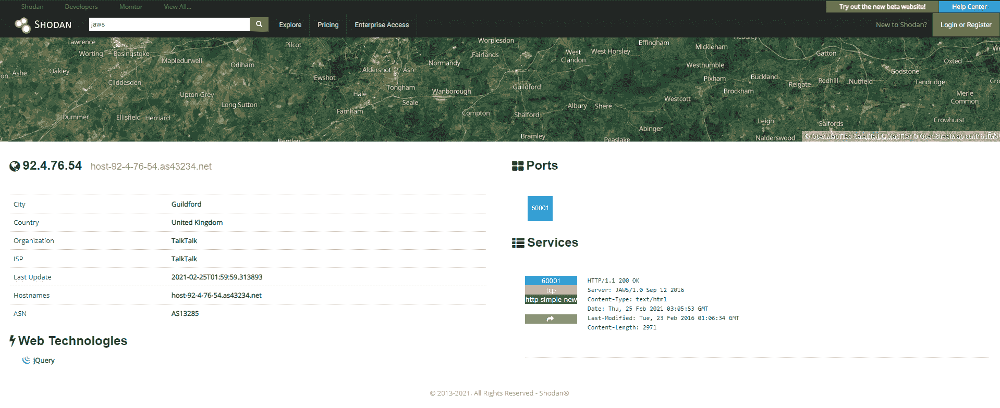

<!--yml
category: 社会工程
date: 2022-11-10 10:30:59
-->

# 如何使用shodan/zoomeye搜索引擎进行社工？-FancyPig's blog

> 来源：[https://www.iculture.cc/sg/pig=193](https://www.iculture.cc/sg/pig=193)

## 简介

我们今天所介绍的搜索引擎，与以往大家熟知的百度、Sogou、360、必应、google这些搜索引擎有所不同，shodan/zoomeye两款搜索引擎是更加偏向于搜索网络中在线设备的，想一想，网络中在线的设备都有哪些？网络摄像头？录像机？办公系统？管理系统？等等一系列通过上面的产品都搜索到。

## 免责声明

以下内容仅用于教育目的，请勿用于非法用途。

## 扯淡杂谈

下面的话纯个人经历分享，不喜欢看跳过看下一个。

我记得很久以前，有人开玩笑说“互联网时代,我们每个人都像是穿着衣服的裸体人!”
这点确实是不可否认的，从2017年6月1日起，互联网就开始要求注册必须实名认证，这也是为什么现在你下载的每一款APP、注册的每一个账户都需要手机号验证，这就是实名认证。而且，没有实名认证的电话会被销号，这也让我想起有一阵子很多人都在买一些没实名的物联卡。

我之前家里养过宠物，相信很多养过宠物的人都有类似的习惯吧，就是外出上班的时候照顾不便，就想看看自己的宠物在做什么，然后会购买使用摄像头产品，然后通过APP来观看实时记录。

既然你能看到摄像头里的东西，那么说明摄像头产品是联网的，既然联网就有可能被搜索引擎记录下来，百度、谷歌这种搜索引擎一般是不会去爬设备的链接的，你即使是故意提交几个链接它90%情况下也不收录的。但是，上面说的两款产品shodan/zoomeye均可以搜索到在线摄像头产品的地址。我个人感觉，这也是之前360水滴摄像头凉了的很大原因，一个正儿八经的摄像头被挂在网上做直播，里面还涉及到一些那种性暗示的内容，再加上又能被上面的产品搜索到，这更加暴露了人们的隐私。

## shodan

> 网址：[https://www.shodan.io](https://www.iculture.cc/?golink=aHR0cHM6Ly93d3cuc2hvZGFuLmlv)

### 如何使用shodan查询摄像头？

常见的摄像头设备名字有webcam、JAWS（CCTV网络设备）、cams、netcam，这些你可以自行去搜索。
我们随便搜了一个JAWS，点开查看
这里要提一点的是，很多设备初始密码都是弱口令或者压根就没密码，我们可以进去看看

点开了页面[http://92.4.76.54:60001/](https://www.iculture.cc/?golink=aHR0cDovLzkyLjQuNzYuNTQ6NjAwMDEv)

进去之后直接点login居然进去了


> 由于2020年12月31日之后Adobe将不再支持Flash Player，并且Adobe将自（美国时间）2021年1月12日开始禁止Flash内容在FlashPlayer中运行，因此Adobe强烈建议所有用户立即卸载Flash Player以保护其系统
> 这里是因为flash已经不支持了，因此看不了（当然你也可以自行恢复，网上有类似的教程，这里不讲解了）

弄好flash你就能看到画面了，这里大多是一些公共摄像头，比方说餐饮行业很多为了展示自己的厨房工作间就会有摄像头


你还可以尝试搜索webcam，然后就有一些奇奇怪怪的画面了。因此，一定要注意自己的隐私，尤其是住酒店、住民宿的时候一定要先观察检测一下，很多都有针孔摄像头之类的东西，说不好听点的有可能摄像头就变直播秀了


你也可以自己探索，这里就不多bb了

### 如何使用shodan查询站点

这一点是做站长的人比较感兴趣的

#### 常见命令

*   `hostname`：搜索指定的主机或域名，例如 `hostname:"google"`
*   `port`：搜索指定的端口或服务，例如 `port:"21"`
*   `country`：搜索指定的国家，例如 `country:"CN"`
*   `city`：搜索指定的城市，例如 `city:"Hefei"`
*   `org`：搜索指定的组织或公司，例如 `org:"google"`
*   `isp`：搜索指定的ISP供应商，例如 `isp:"China Telecom"`
*   `product`：搜索指定的操作系统/软件/平台，例如 `product:"Apache httpd"`
*   `version`：搜索指定的软件版本，例如 `version:"1.6.2"`
*   `geo`：搜索指定的地理位置，参数为经纬度，例如 `geo:"31.8639, 117.2808"`
*   `before/after`：搜索指定收录时间前后的数据，格式为dd-mm-yy，例如 `before:"11-11-15"`
*   `net`：搜索指定的IP地址或子网，例如 `net:"210.45.240.0/24"`

#### 搜索实例

查找位于合肥的 Apache 服务器：

```
apache city:"Hefei"
```

查找位于国内的 Nginx 服务器：

```
nginx country:"CN"
```

查找 GWS(Google Web Server) 服务器：

```
"Server: gws" hostname:"google"
```

查找指定网段的华为设备：

```
huawei net:"61.191.146.0/24"
```

当然，在shodan里面也有一些别人搜索的相关分享，你也可以参考[https://www.shodan.io/explore](https://www.iculture.cc/?golink=aHR0cHM6Ly93d3cuc2hvZGFuLmlvL2V4cGxvcmU=)


## zoomeye

> 网址：[https://www.zoomeye.org](https://www.iculture.cc/?golink=aHR0cHM6Ly93d3cuem9vbWV5ZS5vcmc=)

第二款要介绍的是国内知道创宇公司在做的产品，zoomeye也被称为钟馗之眼。其实产品的功能都类似，但是它做的比较牛逼的地方是把我们想要搜的都列出来了
[https://www.zoomeye.org/component](https://www.iculture.cc/?golink=aHR0cHM6Ly93d3cuem9vbWV5ZS5vcmcvY29tcG9uZW50)

因此，你通过它可以搜索到更多你想要知道的信息。再比方说很多站长比较想了解的，哪些程序用在了哪些网站上，这里都可以查询。

或者你想要搜索某个网站的信息，它开放了哪些端口，用的是什么IDC，或者跟他用一样的产品的或者有友链的，这里面都可以展示。
对于很多商业同行来讲，这是一个很好的研究渠道，可以更快的发现别人使用的开源产品以及相关资料。


类似的产品还有censys，功能都大同小异，当然我们也只是粗浅的分析了一些大多数人可能感兴趣的功能，它们还有漏洞检测等更多安全方面的功能可以使用，后面我再详细做一个分享。

> censys网址[https://censys.io/](https://www.iculture.cc/?golink=aHR0cHM6Ly9jZW5zeXMuaW8v)