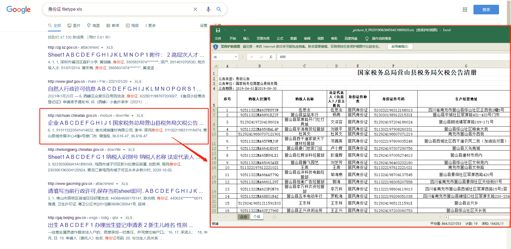

<!--yml
category: 社会工程
date: 2022-11-10 10:35:19
-->

# 常见搜索引擎Google Hacking语法整理-FancyPig's blog

> 来源：[https://www.iculture.cc/knowledge/pig=312](https://www.iculture.cc/knowledge/pig=312)

# 常见搜索引擎Google Hacking语法整理

## 杂谈

最近很多人在问搜索引擎怎么用，之前介绍过shodan/zoomeye/fofa这些高级的搜索引擎

但是我们也不能忽略百度/Google/Bing/360/搜狗，这些日常使用的搜索引擎，合理的运用语法可以帮助我们更快的检索内容

这里说下个人看法：我个人认为Google是我用过的最好的搜索引擎，毕竟搜出来的东西多

## 温馨提示

使用Google，需要科学上网，访问密码评论获取

## 信息收集

直接列出来一大堆语法会显得比较枯燥乏味，因此这里结合实例给大家做一下演示

### 基本逻辑

*   逻辑与：and
*   逻辑或： or
*   逻辑非： –
*   完整匹配：”关键词”
*   通配符：* ?

上面的逻辑用的比较少，这里不做说明

### filetype文件类型

```
filetype:指定文件类型
```

比方说，我们想搜索一些`xls格式`的泄露身份证信息

```
身份证 filetype:xls
```

<figure class="wp-block-image"></figure>

比方说，我们想搜索一篇`pdf格式`的关于直播行业的报告

```
直播行业 filetype:pdf
```

<figure class="wp-block-image"></figure>

比方说，我们想搜索一篇`docx格式`的感谢信模板

除了上述格式，我们还可以搜索网站使用的开发语言

### 关键词包含

当我们搜索内容时，必须包含某个关键词时，可以使用下面的语句

```
XXXXX "必须包含的关键词"
```

比方说，我想搜索一个在机关单位上班的人，那我们可以使用下面的语句

```
税务局 "张三"
```

### site指定站点

```
site:网站
```

比方说，我想搜索FancyPig’s blog下面所有涉及到社工的资料

```
社工 site:www.iculture.cc
```

比方说，我想搜索清华大学的2021招生信息

```
招生 site:www.tsinghua.edu.cn
```

<figure class="wp-block-image"></figure>

### inurl指定路径

```
inurl:指定路径
```

`inurl`可以帮我们更快的找到类似路径的页面
比方说我想找到路径为admin/login.php的后台入口

```
inurl:admin/login.php
```

<figure class="wp-block-image"></figure>

### intitle指定标题

```
intitle:指定标题
```

比方说我们想搜索标题为`后台登陆`的界面

```
intitle:后台登陆
```

### related相似页面

```
related:参考网站
```

如果我想找一个和人民日报界面布局类似的网站

```
related:www.people.com.cn
```

<figure class="wp-block-image"></figure>

### Index of

查找允许目录浏览的页面，比方说我想看看/admin目录下的文件（部分网站因为配置疏忽的原因，导致目录可以被所有人访问，目录的文件也可以被下载）

```
index of /admin
```

从上面我们可以下载到admin目录下的所有文件


与之类似的查询语句还有

*   index of /passwd
*   index of /password
*   index of /mail
*   “index of /” +passwd
*   “index of /” +password.txt
*   “index of /” +.htaccess
*   “index of /root”
*   “index of /cgi-bin”
*   “index of /logs”
*   “index of /config”

## 实战案例