<!--yml
category: 防火墙
date: 2026-06-12 19:00:15
-->

# 揭示并绕过中国防火长城基于SNI的QUIC封锁机制

> 来源：[https://gfw.report/publications/usenixsecurity25/zh/](https://gfw.report/publications/usenixsecurity25/zh/)

# 揭示并绕过中国防火长城基于SNI的QUIC封锁机制

Ali Zohaib

University of Massachusetts Amherst

Jackson Sippe

University of Colorado Boulder

Abdulrahman Alaraj

University of Colorado Boulder

Amir Houmansadr

University of Massachusetts Amherst

Zakir Durumeric

Stanford University

Eric Wustrow

University of Colorado Boulder

尽管 QUIC 握手数据包是加密的，中国防火长城（GFW）自2024年4月7日起，已开始封锁针对特定域名的 QUIC 连接。在此次研究中，我们对 GFW 针对 QUIC 的审查行为进行了测量与分析，以理解其封锁方式以及封锁对象。我们的测量结果显示，GFW 能够大规模解密 QUIC Initial 数据包，应用启发式过滤规则，并采用与其他审查机制不同的封锁名单。我们揭示了这一新系统的一个关键缺陷：解密带来的计算开销在中等流量负载下即会削弱其封锁效果。我们还展示了该审查机制如何被滥用，以阻断中国与全球任意主机之间的 UDP 流量。我们与多个开源社区合作，将绕过封锁的策略集成进一款行业领先的浏览器、quic-go 库以及所有基于 QUIC 的主流翻墙工具中。

自 2021 年标准化以来，QUIC 已迅速成为主流互联网协议。它现在是 HTTP/3 [[7](#cite:rfc9114)] 的加密基础，并且在 2024 年，Cloudflare 估算超过 30% 的网页请求使用了 QUIC [[14](#cite:cloudflare-radar-worldwide)]。QUIC 的流行也给审查者带来了新挑战，他们必须调整以往的技术来适应这一新协议。此前，审查者通常会直接封锁整个QUIC协议 [[25](#cite:Elmenhorst2021a), [70](#cite:Xue2022b) §5.2]，但 2024 年 4 月，用户首次报告中国的防火长城（GFW）开始针对特定域名封锁 QUIC 连接 [[33](#cite:God2024QUIC)]，类似于其基于 SNI （服务器名称指示）的 TLS 流量审查 [[11](#cite:Chai2019a), [37](#cite:Hoang2024a)]。

对特定网站的 QUIC 连接进行审查，在国家层面极具挑战性，因为 QUIC 加密了所有数据包，而相较之下 TLS 协议则会以明文发送目标服务器名称。在 QUIC 中，即使是第一个握手消息（QUIC client Initial）也是加密的，尽管被动网络观察者可以推导出密钥。这意味着，若审查者希望基于 SNI 字段封锁 QUIC 连接，就必须解密每个 QUIC 连接的首个数据包以获取用户的目标站点。因此，反审查社区亟需了解 GFW 的新审查设计与实现细节，以便及时更新绕过策略。

在本工作中，我们测量了中国针对 QUIC 的新型检测与封锁能力——中国是全球首个对 QUIC 进行全国范围的检测与定向审查的国家。我们证实中国能够大规模解密并检测 QUIC 连接的首个数据包。通过一系列实验，我们推断出 GFW 处理 QUIC 连接的规则和高层解析逻辑。例如，我们发现 GFW 会忽略源端口小于或等于目标端口的 QUIC 数据包，这很可能是为了仅检测客户端发起的流量而作的优化。

我们通过类似 traceroute 的测量方法，发现进行 QUIC 审查的设备与现有 GFW 设备位于网络的同一跳，表明它们可能共用基础设施或有类似的管理体系。尽管如此，我们测量了会触发 QUIC 审查的域名集合，发现 GFW 的 QUIC 封锁名单与中国用于 TLS、HTTP 或 DNS 审查的名单有显著不同。具体来说，QUIC 封锁名单的域名数量大约是 DNS 封锁名单的 60%。令人惊讶的是，其中大量域名甚至并不支持 QUIC，原因尚不明确。

我们进一步证明，中国的定向 QUIC 审查可以被“压垮”，导致 GFW 无法完全封锁 QUIC 连接。这揭示了 GFW QUIC 审查机制的一个可被利用的缺陷：攻击者只需发送适量的 QUIC Initial 数据包（即使目标是未被封锁的域名），就能让 GFW 忙于处理，从而大幅降低对被封锁域名的拦截率。

最后，我们展示了 GFW 的 QUIC 审查系统是如何置全国范围的主机于被攻击的风险之中的。我们提出了一种可用性攻击，利用GFW的 QUIC 审查机制阻断中国任意主机与境外任意主机之间的 UDP 通信。例如，该攻击可用于阻断中国全境对境外所用 DNS 服务器的访问，导致大范围的互联网中断。我们以位于全球各地的我们自己的服务器为目标，进行了攻击实验，结果显示，攻击者仅需一台处于不对伪造源IP的数据包进行过滤的网络中的主机，即可阻止全球大多数主机与我们在中国的观测点主机间的通信。鉴于该漏洞的严重性，我们已向中国国家互联网应急中心（CERT）进行了披露。最后，我们讨论了该发现对反审查社区的意义，以及在对抗有害行为者（如 GFW）时，进行漏洞利用的复杂伦理问题。

QUIC 协议。QUIC 是一种基于 UDP 的网络协议，最初由 Google 开发 [[27](#cite:quic2017)]，后由 IETF 于 2021 年标准化为 RFC 9000 [[43](#cite:rfc9000)]。QUIC 类似于 TLS，但建立在 UDP 之上，能够降低延迟，并支持由浏览器控制的拥塞控制。QUIC 被采纳为 HTTP/3 [[7](#cite:rfc9114)] 的加密基础。2024 年，Cloudflare 估算超过 30% 的网页请求使用了 QUIC [[14](#cite:cloudflare-radar-worldwide)]。QUIC 也为反审查社区带来了新的变化，因为它对所有数据包进行加密，以防止中间盒的跟踪和篡改 [[27](#cite:quic2017) §3]。

QUIC Client Initial。QUIC 握手的第一个数据包是 Client Initial 数据包。由于 QUIC 数据包从一开始就被加密，但尚未完成密钥交换，初始数据包使用从目标连接 ID（DCID）和特定版本的 salt 派生出的密钥加密 [[58](#cite:rfc9001)]。这两个字段都以明文形式出现在 QUIC client initial 数据包中，使得服务器（以及网络观察者）能够解密其载荷。因此，这种加密并不能提供机密性或完整性，但可以防止路径外的数据包伪造攻击。

一旦初始数据包的载荷被解密，就会暴露出一个或多个 CRYPTO 帧，帧中包含 TLS 1.3 Client Hello 消息，其中列出了客户端支持的密码套件和 TLS 扩展。通常，其中一个 TLS 扩展就是服务器名称指示（SNI），用于指定客户端试图连接的主机名。由于初始密钥可以被任何网络观察者计算出来，TLS Client Hello 及其中的明文内容（包括 SNI）都可以被解密。

QUIC 封锁。2021 年，Elmenhorst 等人发现，虽然伊朗和中国的许多 QUIC 网站无法访问，但这并非由于基于 SNI 的审查。实际上，伊朗是通过封锁这些 QUIC 终端的 UDP 流量 [[25](#cite:Elmenhorst2021a) §5.2]，而中国则同时封锁了这些终端的 TCP 和 UDP 流量 [[25](#cite:Elmenhorst2021a) §5.1]。2022 年 3 月，ValdikSS 发现俄罗斯 TSPU 封锁了所有使用 QUIC 版本 1（0x00, 0x00, 0x00, 0x01）、目标端口为 443 、且载荷长度至少为 1001 字节的 QUIC 连接 [[70](#cite:Xue2022b) §5.2, [63](#cite:ValdikSS_2022_NTC_HTTP3_QUIC_Post10)]。2024 年 12 月，乌兹别克斯坦封锁了带有加密 Client Hello（ECH）扩展的 QUIC 连接 [[16](#cite:uzbekistan-quic-ech-block)]。据我们所知，中国自 2024 年 4 月起基于 SNI 字段封锁 QUIC 连接，使其成为截至 2025 年 6 月，世上首个也是唯一一个能做到这一点的国家。

其他审查机制。GFW 采用多种手段封锁互联网，包括 DNS 污染 [[4](#cite:Anonymous2014a), [6](#cite:Anonymous2020a), [20](#cite:Duan2012a), [29](#cite:Farnan2016a), [38](#cite:Hoang2021a)]、IP 封锁 [[25](#cite:Elmenhorst2021a), [66](#cite:Wu2023a)]、基于关键字的过滤 [[11](#cite:Chai2019a), [13](#cite:Clayton2006a), [37](#cite:Hoang2024a)]，以及主动探测 [[2](#cite:Alice2020a), [26](#cite:Ensafi2015b), [66](#cite:Wu2023a) §5, [65](#cite:Winter2012a) §4.5, [22](#cite:Dunna2018a) §4.3]。对于基于 UDP 的 DNS 请求，GFW 会向被封锁域名的查询注入伪造响应包。对于 HTTP(S) 流量，GFW 会对 TCP 连接进行有状态的检测，并在检测到被审查域名（出现在 HTTP Host 头或 TLS SNI 扩展字段中）时，注入伪造的 RST 包 [[67](#cite:Wu2025a)]。随后会GFW有一段“封锁残留”期(residual censorship)，其间主要通过注入伪造的 SYN+ACK 和 RST 数据包阻断连接，最新研究表明GFW也可能在此期间采用丢包手段阻断连接 [[37](#cite:Hoang2024a) §5.4, [10](#cite:Bock2020ESNI)]。

本节我们探讨 GFW 如何检测并封锁包含特定域名的 QUIC 连接。我们发现，GFW 会基于 client Initial 包中的 SNI 字段进行封锁，无论服务器 IP 地址为何。GFW 检查 UDP 流的首个数据包，如果该数据包为QUIC client Initial，且其中的SNI在 QUIC 专用封锁名单上，那么GFW会在之后的 3 分钟内丢弃从客户端到服务器相应端口的后续所有UDP数据包（见 [图 1](#fig:1-quic-blocking-overview)）。

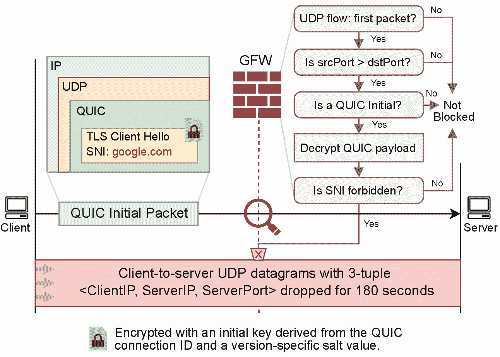

[图 1](#fig:1-quic-blocking-overview)：QUIC SNI 审查机制概览，包括决策流程、首包解密、基于 SNI 的过滤，以及针对被标记连接触发的残留封锁。

实验设置与测量点。我们在中国境内外部署了一组测量点，支持双向测试穿越 GFW 的连接。中国境内共部署了 7 个测量点：北京 4 个，广州 2 个，上海 1 个。选择这些地区是因为它们是中国主要的互联网交换点（IXP），GFW 也被证实部署于此 [[52](#cite:Sakamoto2024a) §4.5, [36](#cite:Hanson2015a), [28](#cite:Fan2025a) VI.C]。这些测量点分别托管于腾讯云（AS45090）和阿里云（AS37963）。境外测量点分布于新加坡（AS16509）、圣何塞（AS14618）、旧金山（AS14061）、弗吉尼亚北部（AS14618）、开普敦（AS16509）以及一所美国大学（AS32）。

我们基于 Quiche [[46](#cite:cloudflare-quiche)]开发了可灵活构造特定的 client Initial 包的QUIC 客户端。由于我们观察到无论服务器是否响应，只要客户端发的数据包经过GFW就会触发封锁，因此实验中服务器仅运行 tcpdump，而非真正的 QUIC 服务端。为确保测量准确且避免干扰，服务器端配置了 iptables 规则，丢弃所有发往客户端的 ICMP 包。

在检测到包含应被禁止的 SNI 的 QUIC Client Initial 消息后，GFW 会丢弃后续所有与触发包具有相同源 IP、目的 IP 及目的端口的 UDP 数据包。我们通过从中国三个测量点向美国服务器发送 QUIC 版本 1 且 SNI 为 google.com 的 Initial 消息发现，该消息能够到达服务器，但随后客户端到服务器方向的任何 UDP 数据包在 180 秒内均被该审查系统丢弃。

在此期间，即便客户端从不同源端口向相同服务器端点（相同目的 IP 与端口）发送 10 字节随机数据包，GFW 也会同样丢弃。然而，若将随机数据包发送至服务器上的新的目的端口，则不会被丢弃，这表明 GFW 基于三元组（源 IP、目的 IP、目的端口）进行封锁，以防止客户端仅通过更改源端口就可以简单地绕过审查。我们通过让服务器在接收 QUIC Client Initial 消息后发送 Server Initial 消息及携带10 字节随机负载的 UDP 数据包，进一步确认了该封锁仅发生在客户端到服务器的方向；而服务器发送到客户端的数据包并不会被丢弃。

一个数据包即可触发残留封锁。 与此前文献中记录的 GFW 对 TLS‑SNI 的封锁 [[38](#cite:Hoang2021a) §3.1] 需要至少检测到两个数据包（SYN包后跟 PSH/ACK包）不同，QUIC 的封锁机制仅需单个包含被封锁 SNI 的Client Initial 数据包即可激活。这是已知首例 GFW 针对基于 UDP 协议实施的残留封锁。尽管 GFW 早前通过注入伪造数据包来审查 UDP 上的 DNS 流量 [[4](#cite:Anonymous2014a), [6](#cite:Anonymous2020a), [38](#cite:Hoang2021a)]，但此前并未以丢包方式阻断 UDP 协议流量。这或许因为如要具备丢弃数据包的能力，审查设备须串联部署在链路中，而先前基于注入伪造数据包的审查方式则仅需让审查设备并联部署在链路上，并复制一份数据流到审查设备的链路上即可。GFW残留丢包的行为引入了新的可用性攻击漏洞，攻击者可利用 GFW 阻断国内外任意主机间的通信。我们将在[第 6 节](#sec:6-availability-attack)深入讨论此攻击。

双向不一致封锁。 我们起初的实验结果显示，进出中国的流量均可触发QUIC封锁，但GFW的这一特征在 2024 年 9 月 30 日后发生了变化。此后，从国外发往中国大多数测量点的QUIC流量已不再触发封锁，发往北京和广州的流量除外。

封锁延迟。 我们的实验显示，GFW从检测到包含被封锁 SNI 的 QUIC Client Initial 数据包到其开始丢弃数据包之间存在短暂延迟，这使得一些数据包能够到达服务器。GFW 未能即时丢弃触发封锁的 Initial 包，反映出其具有并联部署设备的特征 [[64](#cite:Wang2017a) §2.1]。结合其串联部署才会拥有的丢包能力，我们认为其部署架构为混合型，类似于 GFW 在封锁 TLS ESNI 流量的时采用的部署架构 [[32](#cite:gfw2020esni)]。

为精确测量此封锁延迟的时长，我们采用了与 2020 年一项研究相似的方法，该项研究测量了GFW对 TLS ESNI流量封锁的延迟 [[32](#cite:gfw2020esni)]。具体而言，我们测定在QUIC Initial 数据包触发封锁后，服务器还能在后续的多长时间里接收到客户端发来的数据包。

我们在北京测量点进行了为期一天的实验，以确定 GFW 对 QUIC 的封锁延迟。在每小时头五分钟内，我们向位于新加坡的控制服务器发起 25 条 UDP 流（每条流的的源端口和目的端口均不同），我们在每条连接中以 100 包/秒的速率持续发送独特的 10 字节负载。实验进行至第 5 秒时，我们从不同源端口向这 25 个目的端口分别发送带有被封锁 SNI google.com 的 QUIC Initial 包，从而触发 GFW 对这 25 个目的端口（无论源端口如何）的封锁，进而使持续发往服务器的 10 字节负载被GFW丢弃。

在服务器端，我们捕获数据包并寻找在 UDP 数据包间存在至少 120 秒间隔的连接，以判定 QUIC Client Initial 包成功触发了封锁。对于这些触发了封锁的连接，我们对比了触发封锁的Client Initial包的发送时间与服务器收到的最后一个 UDP 负载包的发送时间，该时间差即为封锁延迟（精确到 10 毫秒）。

如[图 2](#fig:2-how-fast-the-gfw-blocks)所示，封锁延迟范围在 60 毫秒至 7.5 秒之间。超过 90% 的连接在一秒内被阻断，但仍有少数存在较长延迟。我们假设延迟差异源于 GFW 需处理的 QUIC 流量的大小（详见 [附录 A](#app:appendix-a)）。我们在[第 5 节](#sec:5-gfw-degradation-attack)探讨如何利用GFW的此特性来削弱其封锁 QUIC 流量的能力。

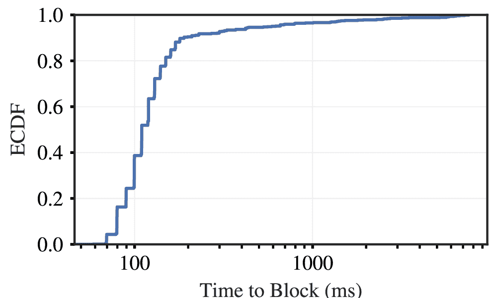

[图 2](#fig:2-how-fast-the-gfw-blocks)：CDF 显示 GFW 从观察到需要被审查的QUIC流量到开始丢弃后续数据包所需时间的分布。在超过 90% 的情况下，连接在一秒内被封锁；实验中观测到的延迟的最小值为 0.06 秒，最大值为 7.5 秒。

与具有明确三次握手以标志新连接开始的 TCP 不同，UDP 是无连接的，且无任何明显的传输层握手，这使得中间盒难以识别新的 UDP 流的起始。虽然可通过连接 ID（CID）跟踪 QUIC 连接，但我们发现 GFW 并未使用 CID。相反，GFW 使用 UDP 四元组（源 IP、目的 IP、源端口、目的端口），并在其流追踪系统中采用60 秒超时的设定以维护连接状态。我们的结论基于这样一个事实：只有当 UDP 流的首个数据包是带有被封锁 SNI 的 QUIC 客户端 Initial 消息时，GFW 才会封锁该流；若有其他 UDP 包先行，则不会触发封锁。

在北京的一个测量点，我们向美国服务器发送了一个带有10 字节随机负载的 UDP 包。然后等待一定的时间后，在同一UDP流中每隔一秒发送三个 QUIC 客户端 Initial 消息。我们重复该实验，每次将发送随机负载包与发送客户端 Initial 包之间的延迟增加一秒，直至触发封锁（即 180 秒内没有数据包到达服务器）。

我们发现，当首次随机负载包与客户端 Initial 包之间的延迟达到 60 秒时就封锁就会被触发，这表明该随机 UDP 流的状态被追踪了 60 秒。超过此超时窗口后发送的 QUIC Initial 包可以触发封锁，说明 GFW 已重置该流状态，并将之后的 Initial 包视为新流。

无 UDP 重组。 我们发现 GFW 不会重组跨多个 UDP 数据包分片的 QUIC Initial 包。鉴于该设计于 2024 年 4 月 7 日部署时，很少有 QUIC 客户端发送大于单个 UDP 数据包的 Initial 包，此设计可能合理。然而，如[第 7 节](#sec:7-circumvention)所述，自 2024 年 9 月 13 日 Chrome 引入一系列对 Initial 包的更改后，这些包变得过大，无法装入单个 UDP 数据包，进而使 GFW 只能在首个数据包中出现 SNI 扩展时才能够封锁QUIC流，从而降低了GFW封锁的有效性。

我们发现向美国服务器发送带被封锁 SNI 的 QUIC Client Initial 包并不总会触发封锁。为进一步调查，我们进行了多次实验以确定审查器过滤 QUIC 连接的具体规则。

我们选择 401 至 450 的端口范围，端口间间隔为 1。从北京测量点向美国服务器发送带 SNI值为 google.com 的 QUIC Initial 消息，枚举该端口范围内所有源端口与目的端口的组合。每次发送后，等待 1 秒，然后每隔 1 秒发送五个带独特 10 字节负载的 UDP 包。该过程重复 10 次，每次使用分配给服务器的 /28 子网中的不同目的 IP，并在重复每次测量时等待 5 分钟以避免前次连接的残留封锁依旧存在。对于每个端口对，我们记录被封锁（即无后续 UDP 包到达）和未被封锁的连接数量。

如 [图 3](#fig:3-heatmap-ports-401-450-step-1_heatmap) 所示，当源端口号 ≤ 目的端口号时，GFW 不会封锁连接。但如果封锁封锁能被触发，其封锁情况并不一致，表明GFW执行规则时存在变动。我们对 1 至 65535 全端口范围以 1000 为间隔重复实验，发现该规则在所有端口范围内均保持一致（详见 [附录 B](#app:appendix-b)）。

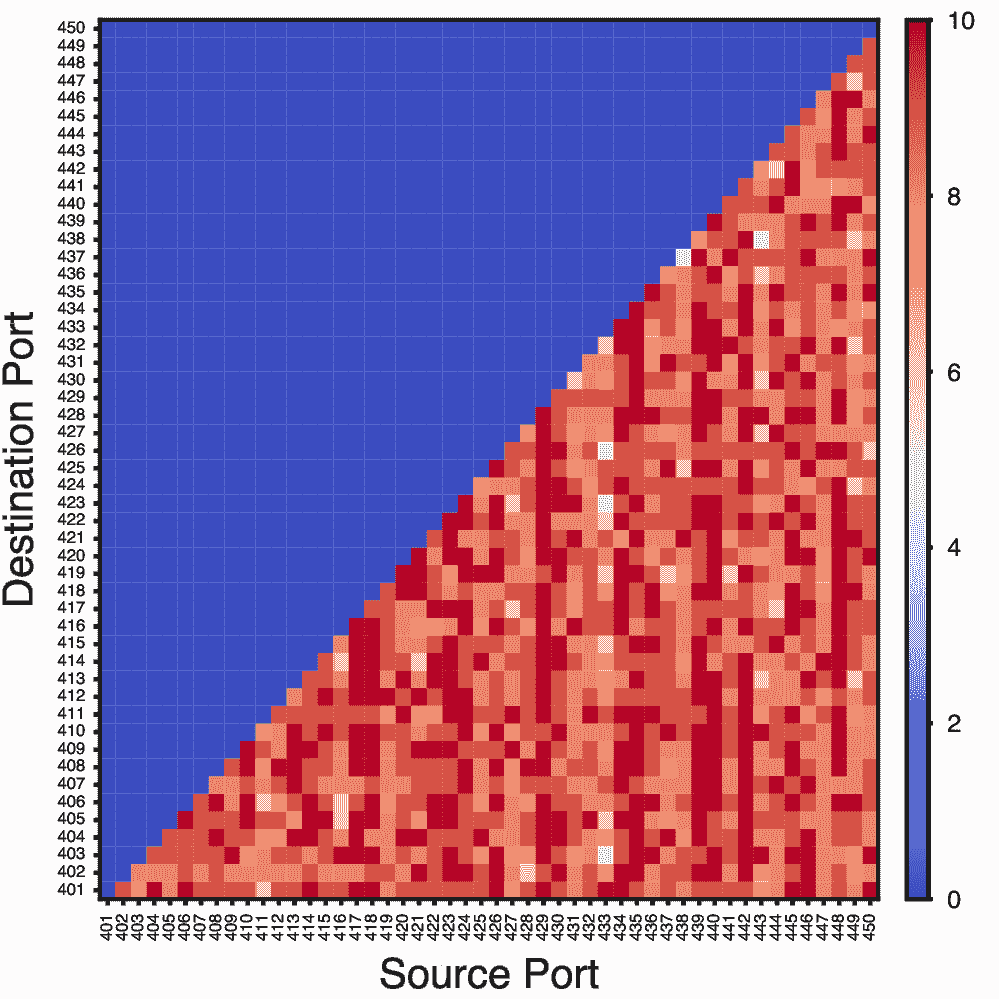

[图 3](#fig:3-heatmap-ports-401-450-step-1_heatmap)：当 QUIC Initial 包的源端口 ≤ 目的端口时，GFW 不予封锁。该实验于 2024 年 12 月 2 日在中国北京测量点进行。

GFW 限制需检查的连接数量。 GFW应用此基于端口的启发式规则，来减少其需要检查的连接数量。由于大多数客户端会选择较高的临时端口 并连接至较低的知名端口（如 443），GFW 可通过忽略源端口低于目的端口的数据包，以快速忽略可能的服务器到客户端流量。

了解到GFW采用了此规则后，我们自然的产生了两个疑问：1）采用此规则能够帮助GFW快速地忽略多少网络流量？2）采用此规则会导致GFW漏检了多少 QUIC Initial 包？为评估GFW的效率与漏报率，我们从美国某大学网络 TAP 收集 UDP 流，并分析源/目的端口分布。

[表 1](#tbl:1-distribution-packet-counts) 显示了 2025 年 1 月 22 日 8:00–9:00（太平洋标准时间，UTC-8）期间，美国某大学 TAP 上观察到的 QUIC Initial 包和 UDP 数据包按源/目的端口的分布。审查器仅在 UDP header 的 sport > dport 时进一步考虑流追踪，使其仅需为约 30% 的 UDP 数据包查表，就可以捕获超过 90% 的 QUIC Initial 包。GFW 实际需要尝试解密的 UDP 包的比例则比30%更低：如 [第 3.2 节](#sec:3.2-flow-tracking-logic) 所述，GFW 仅解析 60 秒内未见的流（五元组：源 IP、目的 IP、源端口、目的端口、UDP 协议）的首个 UDP 数据包的负载。

[表 1](#tbl:1-distribution-packet-counts)：2025 年 1 月 22 日 8:00–9:00（太平洋标准时间，UTC-8）期间，美国某大学 TAP 上按源/目的端口统计的包计数分布。GFW仅在 UDP 包的 sport > dport 时进行流追踪，使其能捕获超过 90% 的 QUIC Initial 包，却仅查表约 30% 的 UDP 数据包。

|  |
|  | QUIC Initial 包 | UDP 数据包 |
|  |
| sport > dport | 6.7 百万 | (92.3%) | 37 亿 | (29.8%) |
|  |
| sport < dport | 0.6 百万 | (7.6%) | 84 亿 | (68.0%) |
|  |
| sport = dport | 4.6 千 | (0.06%) | 27.7 百万 | (2.2%) |
|  |

[图 3](#fig:3-heatmap-ports-401-450-step-1_heatmap) 中的封锁情况表明，连接并非始终被封锁，封锁具有非确定性。为探究此现象，我们从不同测量点进行了为期一周的实验，观察全天及所有目的端口的 QUIC 连接封锁频率。我们从中国的三个测量点向美国服务器每次并发 1000 条QUIC连接（即每 5 秒从三个不同地点向美国服务器的 10 个 IPv4 地址的所有端口发送一个 SNI 值为google.com 的 QUIC Client Initial 包，随后等待 1 秒后发送 5 个带特定 10 字节负载的 UDP 包）。我们在所有情况下均确保源端口大于目的端口（参见[第 3.3 节](#sec:3.3-source-port-must-exceed-destination-port)）。若在 QUIC Initial 后服务器未收到任何 10 字节后续负载包，则将该连接标记为被封锁。我们随后按小时汇总各地客户端的数据，计算封锁连接的百分比。

封锁概率受日间不同时段的影响。 如 [图 4](#fig:4-diurnal-timeseries-three-sources) 所示，对来自三座城市的流量的封锁均呈现明显的日间模式：封锁率在凌晨时段达到峰值，白天下降至最低。北京的封锁率始终最高，其次为上海和广州。该模式表明，封锁率受中国网络流量使用情况的影响，在网络流量低峰期封锁最为严重。

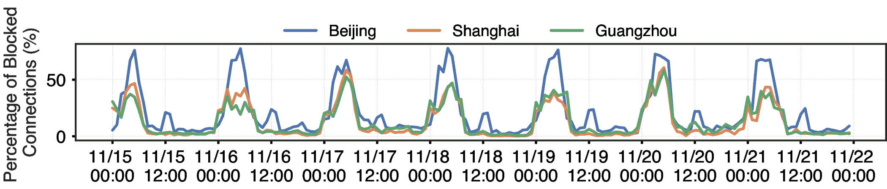

[图 4](#fig:4-diurnal-timeseries-three-sources)：来自中国三大城市的客户端到美国服务器的 QUIC 连接封锁百分比随时间的变化（中国标准时间 CST，UTC+8），实验日期为 2024 年 11 月 15 日至 22 日。

我们在此假设此现象源于 GFW 在任意时刻仅能处理有限流量。由于大规模解密 QUIC Initial 包的运行成本很高，使得封锁率对网络负载敏感，而负载随时段波动。先前研究也在 GFW 的关键词过滤和 DNS 注入中观察到日间封锁模式 [[4](#cite:Anonymous2014a) §7, [15](#cite:Crandall2007a)  §3.2]，表明GFW受计算能力限制而在网络流量高峰期审查效率下降。鉴于解析 QUIC 流量较解析 HTTP 和 DNS 等明文协议更耗费资源，我们将在[第 5 节](#sec:5-gfw-degradation-attack)进一步展示，通过持续向 GFW 发送大量 QUIC Initial 包可导致其审查性能下降。

我们使用递增 IP TTL 值的方法进行测距，以定位审查设备。在 QUIC Client Initial 消息中设置特定的 IP TTL值，从 1 开始每次 +1。在每次实验的第一秒，向美国服务器的 53 端口发送 10 个 SNI 值为 google.com 的 QUIC Initial 包，这样只要数据包到达审查设备即可触发封锁。5 秒后，我们再发送 100 个与 Initial 包相同四元组的 UDP 数据包，其负载为 10 字节，包含所用到的 TTL 的初始值。若这 100 个 UDP 包均被丢弃，则表明 Initial 包已到达审查设备。该测量在北京、上海和广州三个测量点各重复 10 次。

如 [表 2](#tbl:2-traceroute-blocking-points) 所示，我们发现上海、北京和广州的 QUIC 封锁分别在 IP TTL 初始值为 9、11 和 12 时触发。触发封锁的那一跳位于上海和广州的中国电信骨干网，及北京的中国联通骨干网。

类似地，我们对 google.com 发起 DNS 查询，使用相同四元组和递增 IP TTL，发送至服务器 53 端口。DNS 注入同样在与 QUIC 封锁拥有相同的IP TTL 初始值时触发，表明这些新QUIC审查设备与现有 GFW 设备位于网络的同一跳。

[表 2](#tbl:2-traceroute-blocking-points)：traceroute 结果揭示 GFW UDP 审查节点的位置：QUIC 和 DNS 封锁设备所在跳点的信息，及从三个客户端出发的最后一个未被审查跳点的信息。

|  |
| 城市 | 跳点计数 (QUIC/DNS) | 触发封锁前的一跳 (ISP/AS) | 触发封锁的跳点 (ISP/AS) |
|  |
| 上海 | 9/9 | 中国电信上海省网络 (AS4812) | 中国电信骨干网 (AS4134) |
|  |
| 北京 | 12/12 | 中国联通骨干网 (AS4837) | 中国联通骨干网 (AS4837) |
|  |
| 广州 | 11/11 | 中国电信广东省网络 (AS4134) | 中国电信骨干网 (AS4134) |
|  |

GFW 对 QUIC 的封锁在多个方面并未严格遵循 QUIC 规范 [[43](#cite:rfc9000), [58](#cite:rfc9001)]。 我们制作并发送了一些修改过的QUIC负载。根据RFC规范，合规的实现应该拒绝这些负载。我们想以此来观察它们是否依旧会触发防火长城（GFW）的审查机制。 若确实触发，则表明 GFW 并未正确忽略不合规的 QUIC 负载，从而可能为规避审查或寻找其他漏洞提供机会。 我们所用的修改后 QUIC 负载详见 [表 3](#tbl:3-experiment-characterization)。[图 5](#fig:5-quic_parse_heatmap)展示了向 GFW 发送这些负载的结果。对于每种负载，我们在两个方向（中国境内测量点到境外服务器，及反方向）各发送 20 条连接，以判断该连接是否会触发封锁。

[表 3](#tbl:3-experiment-characterization)：以下是我们为探明防火长城（GFW）的QUIC解析机制所做的各项实验的描述。对于每一项实验，我们都标明了其负载是否曾被封锁（[第 3.6 节](#sec:3.6-quic-parsing-idiosyncrasies)），以及它能否被用来降低GFW的性能（[第 5 节](#sec:5-gfw-degradation-attack)）。

|  |
| 实验编号 | 对被用于测试的 QUIC Initial 数据包的描述 | 能否触发封锁？ | 能否削弱GFW性能？ |
|  |
| 1 | QUIC包packet编号为 1 字节。 | ✓ | ✓ |
|  |
| 2 | 从 QUIC 数据包中移除最后一个字节。 | ✕ | ✓ |
|  |
| 3 | 使用错误的版本号和不正确的认证标签。版本号：0x00000002。 | ✕ | ✕ |
|  |
| 4 | 源连接 ID 和目的连接 ID 的长度均设置为 0x00。 | ✓ | ✓ |
|  |
| 5 | 源连接 ID 长度为 0xff。 | ✕ | ✓ |
|  |
| 6 | CRYPTO 帧长度为 0x00，但仍包含有效载荷。 | ✓ | ✓ |
|  |
| 7 | 在非 SNI 扩展中包含敏感域名（例如在 ALPN 中包含 google.com）。 | ✕ | ✓ |
|  |
| 8 | QUIC 负载仅包含 1 个 CRYPTO 帧，以及多个 PING 和 PADDING 帧。 | ✕ | ✓ |
|  |
| 9 | 在 TLS Client Hello 中使用带有外部 SNI cloudflare-ech.com 的 Encrypted Client Hello 扩展。 | ✕ | ✓ |
|  |
| 10 | QUIC 版本 2 的数据包。 | ✕ | ✕ |
|  |

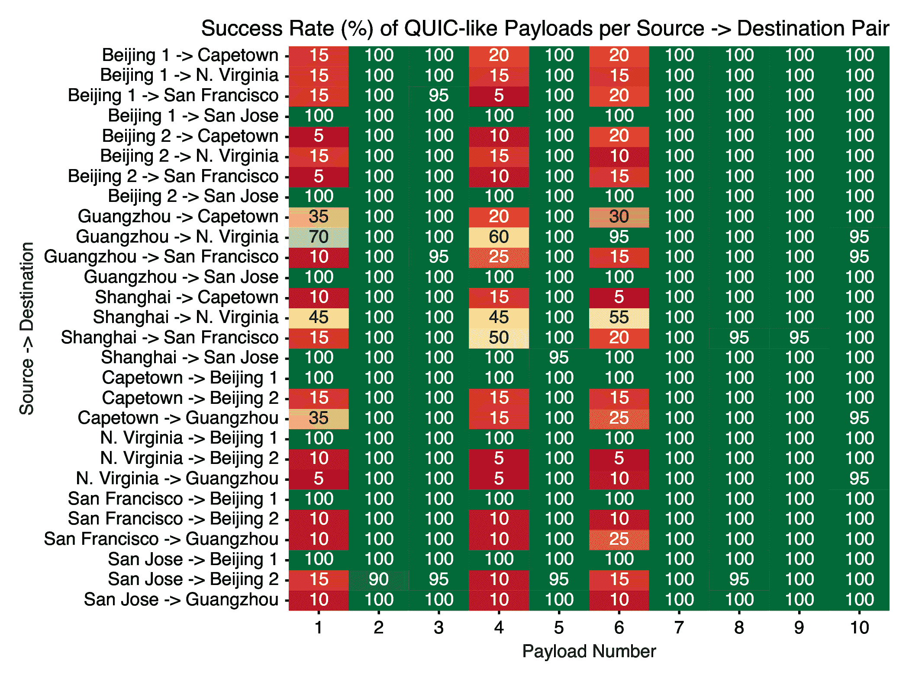

[图 5](#fig:5-quic_parse_heatmap)：各实验中QUIC 数据包触发封锁的比例。对每种负载，我们创建 20 个连接，并统计到达目标主机的数量。表 3 中描述的每种负载都对标准 QUIC Initial 包进行了修改，从而揭示了 GFW QUIC 封锁器的解析逻辑。

无需填充。 尽管 QUIC 规范要求 Initial 数据包的长度至少为 1200 字节，但我们发现 GFW 并未强制执行此要求。我们发送仅 137 字节的负载就能触发封锁。但由于 GFW 不会注入伪造的数据包，因此不存在放大攻击的风险。

长度字段歧义。 规范中定义连接 ID 长度应在 8 到 20 字节之间；但该字段实际支持最多 255 字节。我们发现，将源连ID和目的连接ID的长度均设为 0x00（过短）仍会触发封锁，尽管规范中规定应当在此情况下忽略数据包；而设为 0xff（过长）则未触发封锁，表明 GFW 正确检查了上限。有趣的是，即使 CRYPTO 帧的长度字段为 0x00，只要实际负载中包含被封锁的 SNI，GFW 仍会封锁该负载。这表明 GFW 根据剩余负载推断 CRYPTO 帧长度，因此无法正确处理分片的 CRYPTO 帧（例如 Google Chrome 浏览器所用）。

仅封锁特定版本的QUIC。GFW仅对QUIC版本 1 的数据包（即明文的版本字段为 0x00000001 ）进行解析和封锁。新标准化的 QUIC 版本 2 [[21](#cite:rfc9369)]（其初始加密密钥使用不同的 salt 值）仍然不受封锁。这表明 GFW 要么未更新其对新版本 salt 值的封锁机制，要么仅依赖针对版本 1 的明文字节模式匹配进行检测。

在本节中，我们调查 GFW QUIC‑SNI 封锁机制所屏蔽的网站，考察当前被封锁站点、封锁名单随时间的变化，以及 QUIC 封锁名单与 TLS‑SNI、HTTP 和 DNS 等其他审查方式使用的封锁名单的对比。如[第 3.4 节](#sec:3.4-diurnal-blocking-pattern)所述，GFW 的 QUIC 封锁机制具有非确定性，因此需采用能最小化漏报的实验方法。对每个待测域名，我们从多个测量点发送携带该 SNI 的 QUIC Client Initial 数据包，并进行多次试验。此外，为避免目的端口上的可能的残留封锁，我们不会在180 秒的窗口内重复使用相同的三元组（源 IP、目的 IP、目的端口）进行测试。

我们对 GFW 的 QUIC 封锁名单进行了超过三个月的监测。由于双向封锁的不一致性——具体而言，大多数测量点在 2024 年 9 月 30 日后不再采用双向封锁——我们采用“由内到外”的测量方式。我们在北京（AS45090）部署 10 个测量点并运行客户端的测试程序，在美国某大学（AS32）部署 1 个测量点作为服务器。该服务器分配了一个 /28 IPv4 子网。对每个待测域名，客户端发送一个 QUIC Client Initial 消息至服务器，等待 1 秒后再发送 5 个间隔 1 秒的包含独特 10 字节负载的UDP包。若所有后续 UDP 包均未到达服务器，则将该 SNI 标记为被封锁。

我们使用 2024 年 10 月 2 日获取的完整 Tranco 列表（ID: 664NX）用于测试，该列表包含约 700 万条完全限定域名（FQDN）。我们承认该列表或无法穷尽所有被封锁域名，但认为基于此类流行域名的大规模测试得出的样本，能代表 GFW 的 QUIC 封锁名单。

在每次测试中，北京的 10 个客户端测量点分别向美国服务器的不同 IP 地址发送一个 QUIC Client Initial 消息。基于[第 3.3 节](#sec:3.3-source-port-must-exceed-destination-port)的发现，我们使用的源端口始终大于目的端口以触发封锁。实验通过 cronjob 在中国标准时间（CST）凌晨 3 点至 6 点间运行，因为我们观察到此时段的封锁率最高。

由于该时段我们测得的封锁率至少为50%，我们对每个 QUIC Client Initial 测试重复 10 次，以确保封锁名单提取准确率高于 1−(1 − 50%)^(10)≈ 99.9%。服务器端按天聚合各被封锁 SNI 的数据。实验自 2024 年 10 月 8 日至 2025 年 1 月 15 日持续运行超过三个月。

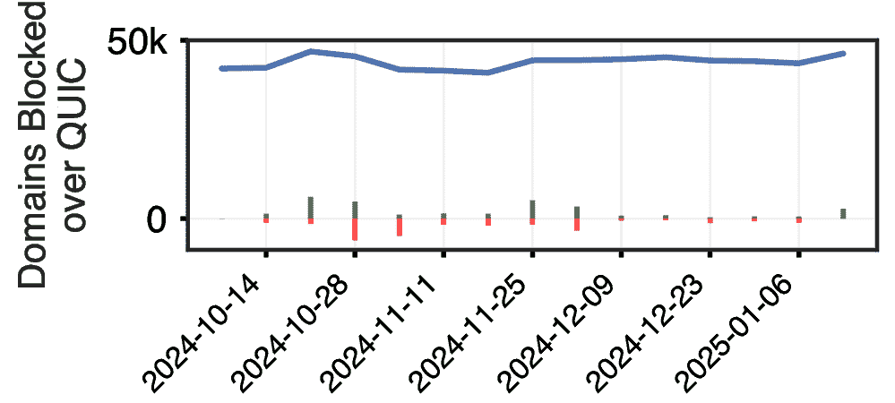

[图 6](#fig:6-availability-attack)：2024 年 10 月 8 日至 2025 年 1 月 15 日期间，GFW QUIC‑SNI 封锁 Tranco 列表（ID: 664NX）中的 FQDN 数量。柱状图展示了每周封锁名单的增减情况。

QUIC 封锁名单。 按周统计，我们发现 GFW 平均封锁 43.8K 个Tranco 列表中FQDN（见 [图 6](#fig:6-availability-attack)）。在整个实验期间，共观测到 58,207 个不同的 FQDN 被封锁（见 [表 4](#tbl:4-fqdn-quic-block)）。

[表 4](#tbl:4-fqdn-quic-block)：支持 QUIC 的 FQDN 总数、被 QUIC‑SNI 封锁的 FQDN 数量及两者交叉情况。QUIC 封锁测试时间为 2024 年 10 月 8 日至 2025 年 1 月 15 日。

|  |
| 完全限定域名（FQDN） | 数量 |
|  |
| 测试总数（Tranco 列表） | 6,955,968 |
|  |
| 支持 QUIC | 1,489,967 |
|  |
| 曾被GFW QUIC 封锁 | 58,207 |
|  |
| 曾被封锁且支持 QUIC | 38,451 |
|  |

被 QUIC 封锁的域名可能并不支持 QUIC。 我们通过直接发起 HTTP/3 请求以测试域名的 QUIC 支持情况，而非依赖 Alt-Svc 头，因为部分服务器虽支持 HTTP/3‑over‑QUIC，却并未宣告该支持。测量结果显示，58,207 个 FQDN 曾被 QUIC 封锁，其中仅 38,451 个支持 HTTP/3‑over‑QUIC（见 [表 4](#tbl:4-fqdn-quic-block)）。在这些被封锁域名中，有 9,345 个常见二级域名（如 google.com、hrw.org、youtube.com、tiktok.com）被屏蔽，但仅其中的 3,233 个支持 QUIC。值得注意的是，googlevideo.com 子域名大规模出现在封锁名单（35,443 个），暗示存在针对 *.googlevideo.com 的广泛规则，并导致 QUIC 支持域名数量增加。由于并非所有被 QUIC 封锁的域名都支持 QUIC，我们难以确定审查者是如何决定 GFW 的QUIC封锁名单的。GFW 可能是为了预防这些域名未来会支持 QUIC 而进行了提前封锁，或基于与 QUIC 无关的其他标准做出封锁决策。

我们对 GFW 的 QUIC‑SNI 封锁名单与其他既有审查机制的封锁名单（包括 TLS‑SNI、HTTP Host 及基于 DNS 的封锁）进行了对比分析。为评估 TLS‑SNI 封锁名单，我们采用了基于先前工作的实验方法 [[11](#cite:Chai2019a), [37](#cite:Hoang2024a)]。我们在北京部署客户端，并在美国部署接收服务器以执行“由内到外”的测量，与 QUIC‑SNI 的测量方向保持一致。我们将服务器配置为接受 TCP 连接但不返回任何数据。每次测试中，完成 TCP 握手后，客户端发送包含测试域名 SNI 的 TLS Client Hello 消息。我们通过监测 TCP RST 包（SNI 封锁的典型特征）来判断封锁情况。相似地，在对于 HTTP Host 的测试中，我们将测试域名包含在HTTP GET 请求的 Host 头字段。

在 DNS 审查测试中，我们遵循先前研究中的成熟方法 [[6](#cite:Anonymous2020a), [38](#cite:Hoang2021a)]。我们将北京客户端配置为向美国受控 IP（无 DNS 服务运行）发送 DNS 查询，从而任何收到的 DNS 应答均可归因于 GFW 注入，以确保准确性。为保证三种测试方法（TLS‑SNI、HTTP Host、DNS）结果的可比性，我们使用了相同的 Tranco 列表域名，并于 2025 年 1 月 9 日至 15 日进行为期一周的测量，收集各封锁名单域名。

[图 7](#fig:7-venn-intersection-between-lists) 显示了 TLS‑SNI、HTTP Host、DNS 与 QUIC 封锁名单的重叠情况。对于我们测试的 Tranco 域名，DNS 封锁域名数量最多（106,973），其次是 HTTP（105,488）和 HTTPS（102,216）。QUIC 封锁名单显著较小，仅为其他三种名单规模的约 55%。在 58,207 个曾被 QUIC 封锁的域名中，有 11,854 个仅在该协议下被封锁；在这些 QUIC 专属封锁域名中，只有 2,329 个实际支持 QUIC。

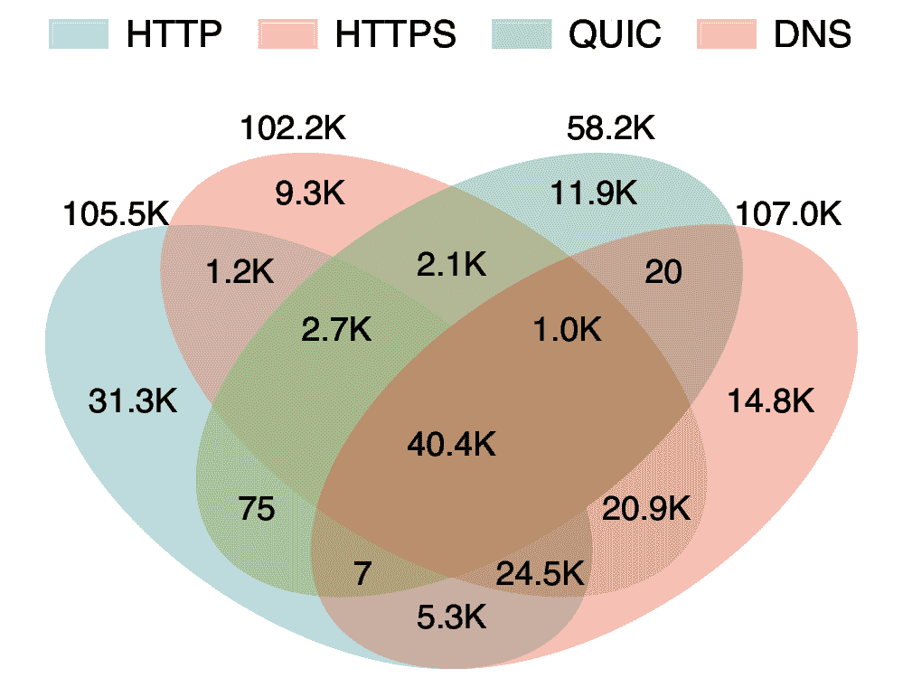

[图 7](#fig:7-venn-intersection-between-lists)：展示 HTTPS、HTTP、DNS 与 QUIC 封锁名单重叠的 Venn 图。各协议封锁名单汇总自 2025 年 1 月 9 日至 15 日一周的测量数据。

我们发现共有 40,447 个域名同时出现在四个封锁名单中，交并比 24.4%。逐一与其他三种协议比较，QUIC 与 HTTPS 的交并比最高，为 46,251 个域名（40.51%），其次是 HTTP 43,191 个（35.84%），以及 DNS 41,484 个（33.54%）。这些结果表明，各审查机制虽各自独立，却存在重叠，共同构成互补体系，最大化 GFW 的封锁覆盖。例如，现代浏览器中的 HTTP/3‑over‑QUIC 会话通常先进行 DNS 查询，再发送 HTTP/2（或更早）请求，最终升级到 HTTP/3 over QUIC。GFW 的审查策略设计在各阶段或组合阶段进行干预，确保用户无法访问被禁止内容。

[表 5](#tbl:5-jaccard-index) 显示了 GFW 针对 Tranco 前 10k 域名的 DNS、HTTP、TLS 与 QUIC 封锁名单的 Jaccard 指数（交并比），并与支持 QUIC 的网站以及随机抽取的 500 个 FQDN 样本进行了对比。

[表 5](#tbl:5-jaccard-index)：GFW 针对 Tranco Top 10k 域名的 DNS、HTTP、TLS 与 QUIC 封锁名单的 Jaccard 指数（交并比），以及支持 QUIC 网站与 500 个随机 FQDN 样本的比较。

|  |
|  | DNS | HTTP | TLS | QUIC | 支持 QUIC | 样本 500 |
|  |
| DNS | - | - | - | - | - | - |
|  |
| HTTP | 0.57 | - | - | - | - | - |
|  |
| TLS | 0.67 | 0.43 | - | - | - | - |
|  |
| QUIC | 0.19 | 0.20 | 0.26 | - | - | - |
|  |
| 支持 QUIC | 0.19 | 0.20 | 0.13 | 0.05 | - | - |
|  |
| 样本 500 | 0.03 | 0.03 | 0.03 | 0.01 | 0.05 | - |
|  |

在 [图 4](#fig:4-diurnal-timeseries-three-sources) 中，我们观察到 GFW 对 QUIC 的封锁在中国网络流量高峰期时效果较差。这使我们假设，我们或许可以发送需要GFW处理的 QUIC 数据包，来有意地降低其封锁效果。尽管我们的实验为了解中国审查系统的设计提供了重要见解，但也引发了多项伦理考量，我们在[第 9 节](#sec:9-conclusion) 中作了详细的讨论。我们设计实验时确保不会影响用户或其他互联网设备，仅针对 GFW 进行性能降级。

本实验使用三个测量点：一个在中国（北京，阿里云，AS37963），简称 ChinaVP；一个在美国东部（Digital Ocean，AS14061），简称 USVP；另一个在美国密歇根大学（AS36375），简称 StressVP。我们的目标是在中等量级的 QUIC 流量干扰下，测量 GFW 对 QUIC 封锁的有效性。实验分为同时运行的两部分：测量部分与施压部分。

在测量部分，三个测量点按如下配置：ChinaVP 向 USVP 发送一个负载 267 字节的 QUIC Initial 包，其 SNI 字段为被封锁域名 google.com，且目的端口小于源端口（参见[第 3 节](#sec:3-quic-censorship-mechanism)，以触发封锁）。暂停 1 秒后，在同一流中发送 100 个固定无害载荷（1,111 字节）的 UDP 包。该过程针对 1,000 个不同的源-目的端口对重复执行。若服务器（USVP）收到了 Initial 包以及随后的 95% 以上的数据包，则认为该连接未被封锁。

在施压部分，StressVP 向 ChinaVP 所在 /14 网段内的所有 IPv4 地址发送两类流量，发送速率从 100 kpps 增加至 1500 kpps，每 100 kpps 增量持续施压 7 分钟，每次施压间隔 3 分钟。因选择大网段，单个主机受到的流量冲击被稀释，从而避免影响网络链路或路由器。

为避免施压流量到达终端主机，我们先通过 ZMap 对 /14 网段运行控制 TTL 的 DNS 扫描，解析 example.com，并根据接收到的 164 个 DNS 服务器的响应终止情况，估算各 IP 的距离扫描服务器的跳数。随后将 StressVP 发送的数据包 TTL 设置为最小跳点距离减 1，以保证流量仅到达 GFW。

施压过程中，我们发送两种（使用较小TTL的）流量：QUIC Initial 包和固定长度的随机 UDP 包。QUIC 包使用与 ChinaVP→USVP 相同的 Initial 负载及被封锁的 SNI 以触发 GFW；随机包使用等长的无害随机字节。流量发送由 ZMap 执行，该配置平均对 /14 内的每个 IP 的发送速率不超 6 pps。

本实验在不同日子重复三次（一次按升序速率进行测试，另两次按乱序速率进行测试），期间 StressVP 向 ChinaVP /14 网段发送（TTL 较小的）QUIC Initial 包，同时测量ChinaVP→USVP可通过封锁的连接比例。随后再独立进行三次实验（与 QUIC 施压不同时进行），将 QUIC Initial 包替换为随机载荷，测量相同指标。[图 8](#fig:8-stressing-rates) 显示了实验结果的平均值：随着 QUIC Initial 包速率提升，GFW 对 ChinaVP→USVP 连接的封锁效率下降；而使用随机载荷施压时则不存在该趋势，表明降级效应来自 GFW 处理 QUIC 包的开销，而非处理所有网络流量时的影响。所有实验均在中国凌晨封锁更高效的时段进行（见 [图 4](#fig:4-diurnal-timeseries-three-sources)）。

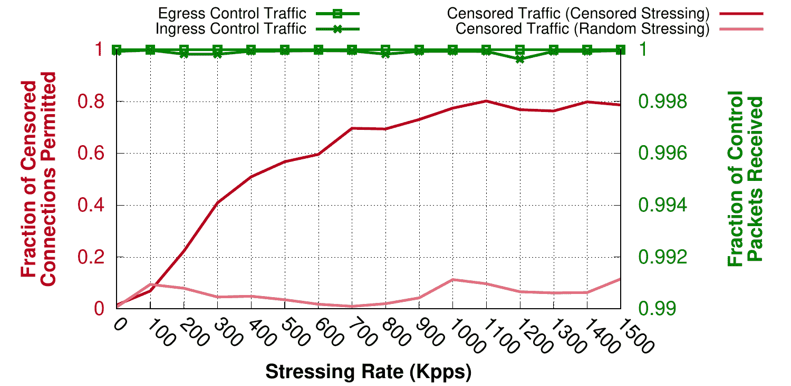

[图 8](#fig:8-stressing-rates)：我们以 0–1500 Kpps 的速率向 GFW 施加两类等长包：包含被封锁 SNI 的 QUIC Initial 包（审查压力）和随机负载 UDP 包（随机压力）。期间，我们通过发送固定速率的 QUIC Initial 包及 100 个数据包，模拟 1000 条来自中国到美国的 QUIC 连接，计算 GFW 未能封锁的连接比例（审查失败率）。结果表明，随着 QUIC Initial 包速率上升，GFW 的封锁能力下降。我们通过监测出入境双向的非敏感 QUIC 连接的丢包率，以确保压力测试只影响 GFW 而不影响网络链路。

网络监测。 实验期间，我们从两方面监测 ChinaVP↔USVP 网络：其一，双向发送非敏感 QUIC 连接，监测两端数据包接收率；其二，使用 ZMap 以 650 pps 速率扫描 /14 网段的 tcp/443 端口，测量响应率。两项指标在实验中均无显著下降，表明我们的施压流量仅对 GFW 产生了降级效果，而对网络链路和路由器的影响可忽略。

逆向分析。 除帮助用户绕过审查外，性能降级攻击还能揭示 GFW 的数据处理流程。例如，某 QUIC 负载能导致封锁效率下降，则表明 GFW 至少对该负载执行了部分处理；若某负载对GFW性能无任何影响，则可能表示该负载在触发GFW高开销操作前便被忽略。

[表 3](#tbl:3-experiment-characterization) 显示了各负载对 GFW 审查效率的降级效果。我们以 1200 Kpps 的速率发送每种负载，并在可绕过封锁的连接比例超过 60% 时判定该负载具备降级作用。结果表明，GFW 会处理所有 QUIC 版本为 1 的数据包，即使该数据包的负载无法被解密或其认证标签无效，也能造成性能降级；但仅有有效认证标签（可以被成功解密）的负载才能触发封锁，由此可推测GFW最“慢”的部分在于解密负载时的密码学运算。

先前研究表明，残留封锁有时可被攻击者“武器化”用于实施可用性攻击 [[8](#cite:Bock2021b), [9](#cite:Bock2021a)]。在此攻击中，攻击者向目标 B 发送触发审查的请求，并伪造源 IP 为受害者 A的IP地址。如果该请求触发了 A 与 B 之间的防火墙的残留封锁，则两者将无法通信，因为防火墙误以为 A 发送了被禁止的请求。残留封锁通常持续 1至3 分钟 [[9](#cite:Bock2021a), [10](#cite:Bock2020ESNI), [11](#cite:Chai2019a), [37](#cite:Hoang2024a), [64](#cite:Wang2017a), [66](#cite:Wu2023a)]，攻击者可以不断伪造触发审查的数据包以维持阻断。

我们的研究揭示了GFW首次对基于 UDP 的协议实施残留封锁。尽管 GFW 历来通过注入伪造的DNS响应包来封锁 UDP 上的 DNS 流量，但此前未以丢包的方式阻断 UDP 协议流量。这次新出的GFW QUIC 封锁机制因为使用丢包手段而引入了新的可用性攻击向量，影响整个中国。攻击者可利用此攻击阻断中国境内主机与境外服务器间的 UDP 流量，例如阻止所有境外公共或根 DNS 解析器，导致全国范围的 DNS 故障。

本节中，我们使用自己的主机与服务器作为攻击对象，探讨该攻击的可行性。

攻击部署。 此攻击需具备 IP 伪造能力，因此需使用不受出口过滤限制的服务器。我们从公共 VPS 提供商处获取一台可伪造 IP 包并在中国境内被接收的主机。在中国境内，我们使用一台位于广州的 VPS 来模拟“受害者”主机，因为该主机入站与出站均可以触发 QUIC 封锁。我们另在中国境外的 32 个区域各部署一台 AWS EC2 实例，用于模拟不同“受害者”。

对每台 EC2 实例，我们先向广州 VPS 发送一个 DNS 查询包，确认请求被接收，表明两主机之间的连接初始时是可用的。

随后，我们从可伪造源IP的攻击服务器，向我们位于广州的 VPS 发送QUIC Initial包。我们将每个包的源 IP 伪造为不同的 EC2 实例的 IP。这些包可以触发 GFW 的残留封锁机制，导致广州 VPS 的特定端口无法与 EC2 实例通信。对于每个 EC2 实例的IP，我们伪造10个包，间隔1秒发送到广州 VPS。我们伪造数据包所经过的路径可能与发自EC2的真实数据包的路径不同，因此这两种包穿过的 GFW 节点也可能不同，这可能导致攻击失效。

与此同时，为了测量攻击效果，我们每 5 秒从各 EC2 实例向广州的 VPS 发送一个 DNS 查询包。若残留封锁在EC2实例与 广州的VPS 之间生效，那么DNS请求将被丢弃，这也就表明可用性攻击成功了。

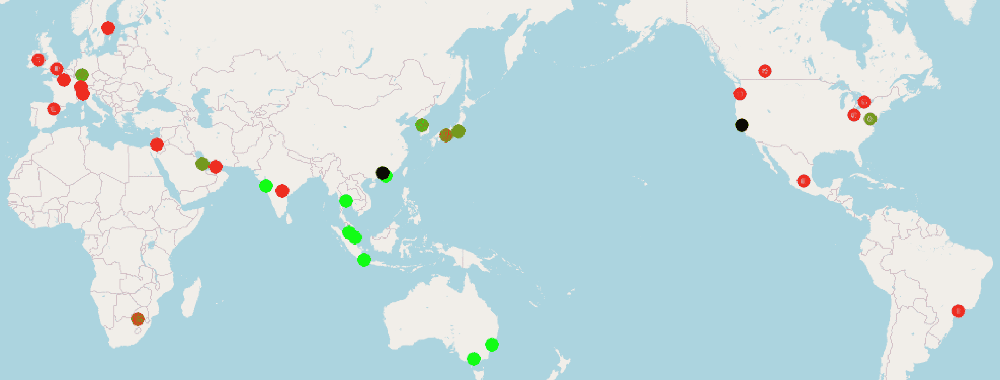

[图 9](#fig:9-affected_hosts)：受可用性攻击影响的 EC2 实例地理分布图。受影响最严重的主机以红色显示，受影响较轻的以绿色显示。黑点分别表示位于广州的“受害者”服务器，以及位于美国的攻击服务器。

[表 6](#tbl:6-region-packet-counts) 与 [图 9](#fig:9-affected_hosts) 显示 EC2 实例位置及攻击效果。在 32 台实例中，超过半数（17 台）被严重影响。部分实例仍能接收少量包，主要因 3 分钟残留封锁到期后到下一次伪造包到达之间有 1 秒窗口；加大发包频率或选准时机可提升阻断率。另有 7 台实例的约半数请求被丢弃，表明存在多条网络路径，而只有部分路径受到残留封锁的影响。

[表 6](#tbl:6-region-packet-counts)：各 AWS 区域的数据包接收情况。可用性攻击持续了 30 分钟，真实客户端每 5 秒发 1 个监测数据包。攻击服务器在美国，受害服务器在广州。对于每台 EC2 实例，攻击服务器伪造其IP地址，每秒发送10个 QUIC Initial 包。

|  |
| 洲/区域 | 城市/地区 | 接收到的数据包数量 | 占共计360个数据包的百分比 |
|  |
| 非洲 | 开普敦 | 110 | 30.56% |
|  |
| 亚太地区 | 香港 | 360 | 100.00% |
|  |
| 亚太地区 | 海得拉巴 | 13 | 3.61% |
|  |
| 亚太地区 | 雅加达 | 360 | 100.00% |
|  |
| 亚太地区 | 马来西亚 | 360 | 100.00% |
|  |
| 亚太地区 | 墨尔本 | 360 | 100.00% |
|  |
| 亚太地区 | 孟买 | 360 | 100.00% |
|  |
| 亚太地区 | 大阪 | 145 | 40.28% |
|  |
| 亚太地区 | 首尔 | 246 | 68.33% |
|  |
| 亚太地区 | 新加坡 | 360 | 100.00% |
|  |
| 亚太地区 | 悉尼 | 360 | 100.00% |
|  |
| 亚太地区 | 泰国 | 360 | 100.00% |
|  |
| 亚太地区 | 东京 | 229 | 63.61% |
|  |
| 加拿大 | 卡尔加里 | 26 | 7.22% |
|  |
| 加拿大 | 中部 | 13 | 3.61% |
|  |
| 欧洲 | 法兰克福 | 244 | 67.78% |
|  |
| 欧洲 | 爱尔兰 | 16 | 4.44% |
|  |
| 欧洲 | 伦敦 | 12 | 3.33% |
|  |
| 欧洲 | 米兰 | 17 | 4.72% |
|  |
| 欧洲 | 巴黎 | 10 | 2.78% |
|  |
| 欧洲 | 西班牙 | 15 | 4.17% |
|  |
| 欧洲 | 斯德哥尔摩 | 14 | 3.89% |
|  |
| 欧洲 | 苏黎世 | 17 | 4.72% |
|  |
| 以色列 | 特拉维夫 | 18 | 5.00% |
|  |
| 墨西哥 | 中部 | 13 | 3.61% |
|  |
| 中东 | 巴林 | 201 | 55.83% |
|  |
| 中东 | 阿联酋 | 22 | 6.11% |
|  |
| 南美洲 | 圣保罗 | 12 | 3.33% |
|  |
| 美国东部 | 北弗吉尼亚 | 195 | 54.17% |
|  |
| 美国东部 | 俄亥俄 | 21 | 5.83% |
|  |
| 美国西部 | 北加州 | 21 | 5.83% |
|  |
| 美国西部 | 俄勒冈 | 19 | 5.28% |
|  |

剩余 8 台实例未受任何影响，它们主要分布于太平洋地区，表明攻击服务器与这些实例未共享相同网络路径。我们确认，当真实客户端直接发送触发审查的数据包到不同实例时，所有 32 台实例均能触发 GFW 的封锁。

防御。 由于 UDP 无状态且易伪造，防御此攻击并保持审查功能极具挑战。一种潜在缓解方案是仅在检测到对应的 QUIC Server Hello 及后续客户端包后再触发封锁，以确保连接真实存在。但此方案需对连接进行有状态跟踪，对审查设备造成巨大开销。此外，路径不对称会导致审查设备可能看不到 Server Hello 而无法审查。即便如此，攻击者仍可同时伪造双向流量以触发封锁，使该防御失效。

另一种方案是采用注入式封锁机制，避免丢包式残留封锁。但此方案也有风险和限制。例如，鉴于解密延迟（见 [图 2](#fig:2-how-fast-the-gfw-blocks)），QUIC Server Initial 可能先到达客户端并建立密钥，随后注入包才到达，导致注入无效。

在 QUIC 中防御这类可用性攻击尤为困难：QUIC协议在设计是就考虑到要抵御攻击者通过注入伪造包来阻断连接，因此GFW才需要使用基于丢包的残留封锁；而与此同时， UDP 的无连接特性使伪造 Initial 包极为简单，这使得GFW在使用残留封锁时，增加了可用性攻击的风险。要在 QUIC 中实现有针对性的封锁并防止可用性攻击，需要谨慎的工程设计。

如[第 3.2 节](#sec:3.2-flow-tracking-logic)所述，GFW 为了在线路速率下高效解析和封锁 QUIC 流量，采取了若干简化假设。这些设计选择再次体现出 GFW 设计者和开发者所遵循的“worse-is-better”理念 [[31](#cite:worse-is-better)]。然而，这些假设以牺牲审查系统的准确性和鲁棒性为代价，从而为绕过封锁带来了机会。我们已将所发现的绕过策略负责任地披露给反审查社区和开源社区。

源端口 <= 目标端口。如[第 3.4 节](#sec:3.4-diurnal-blocking-pattern)所详细说明的，GFW 忽略 源端口 <= 目标端口 的 UDP 数据包，从而做到仅关注客户端到服务器方向的流量。因此，一种临时绕过办法是使用目标端口大于等于源端口的方式。例如，服务器可将翻墙代理运行在高于或等于客户端临时端口范围的端口；Web 服务亦可监听在非常规高端口上，并通过 HTTP 头的Alt-Svc值或 DNS HTTPS 记录向客户端公布端口。对于无法变更监听端口或无法监听多个端口的软件，可通过 iptables 规则将所有发往高端口（如 65535）的流量重定向到当前监听端口（如 443），例如 iptables -t nat -A PREROUTING -p udp --dport 65535 -j REDIRECT --to-port 443。此方法对无法修改监听端口的软件尤其有用。

在 QUIC Client Initial 前发送任意 UDP 数据包。GFW 的 QUIC 封锁机制假定 QUIC client Initial 是新流的首个数据包。一个简单的绕过方式是在发送 client Initial 之前先发送一个带有随机负载的 UDP 数据包。对于真实的 QUIC 服务器而言，首个 UDP 数据包会被忽略，但对 GFW 而言，因为无法从首包解析出 SNI，所以会让该流被豁免。后续真正的client Initial 将不再被检查，连接可顺利建立。我们通过在发送 QUIC client Initial 之前发送带随机负载的 UDP 数据包，实证了该防御策略可绕过 GFW 的封锁。同时，我们也对 Chromium Quiche [[35](#cite:google_quiche_2025)]QUIC 服务器实现进行了测试，确认其会忽略冗余 UDP 数据包。

连接迁移。QUIC 的连接迁移能力利用连接 ID 跨网络变化保持会话。GFW 采用选择性过滤策略：允许首个 QUIC 包，随后封锁客户端到服务器方向的数据包，但不监控连接 ID。由于服务器到客户端方向的数据包未被封锁，客户端只要在封锁激活前完成 1-RTT 握手，并迁移到不同网络四元组（源 IP、源端口、目的 IP、目的端口），即可绕过 GFW。

QUICstep [[44](#cite:jia2023quicstepcircumventingquicbasedcensorship)]提出了一种相关方法，通过连接迁移技术实现 QUIC 封锁绕过。该方法先在低带宽高延迟的安全通道上完成 QUIC 握手，随后将连接迁移到常规通信通道，从而保证所有数据均为加密传输。

QUIC Client Initial 分片。QUIC client Initial 可通过多份 UDP 数据包发送，或以单个 UDP 数据包承载多个 QUIC 帧。截至 2025 年 1 月，GFW 不会重组被分片成多个 UDP 数据包，也不会重组在单个 UDP 数据包中被拆分为多帧的 TLS Client Hello。因此，可利用该弱点，将 SNI 拆分进 client Initial 内的多个 QUIC CRYPTO 帧以绕过 GFW 的 QUIC 封锁。

值得注意的是，Chrome 自 2021 年引入的 Chaos Protection 机制 [[19](#cite:chaos-protection-quiche2025)]，会将 QUIC client Initial 拆分进多个 QUIC 帧，并分散在不同 UDP 数据包中。同时，自 Chrome 124 版 [[12](#cite:chrome124relnotes)]起，支持在 TLS 1.3 下进行后量子密钥协商（ML-KEM 与 Kyber 密钥），启用该功能后，由于密钥长度超出 QUIC 单包最大长度，client Initial 会被分片到多个 UDP 数据包。这些特性实际上恰好利用了 GFW 无法重组分片 QUIC client Initial 的弱点，使 Chrome 的流量能够绕过 GFW 的 QUIC 封锁。

加密 Client Hello（ECH）。ECH [[51](#cite:ietf-tls-esni-24)]允许客户端使用通过 DNS HTTPS 记录获取的密钥，将部分 TLS Client Hello 消息加密发送给服务器，从而加密 SNI 扩展，令审查者无法获知 SNI。与 QUIC 的 client Initial 加密不同，ECH 加密为非对称加密，网络观察者无法解密。

审查者可选择封锁所有包含 ECH 的负载。然而，现代浏览器即便服务器不支持 ECH 也会发送“伪装” ECH 负载。截至 2025 年 1 月，GFW 不会封锁带有 ECH 的 QUIC 负载，除非外层（可解密）SNI 属于被封锁域名。

版本协商。QUIC 的版本协商机制 [[43](#cite:rfc9000) §6]为绕过封锁提供了新的思路。通常，服务器收到不支持的版本号的 Initial 包后，会返回 Version Negotiation 包，等待客户端使用受支持版本重新发送 Initial。客户端可利用该机制，故意先发送带未知版本号的 Initial 包，使首包负载无法被解密，从而让后续连接流量绕过 GFW 的过滤。随后，客户端可继续以受支持版本完成握手，实现对审查机制的规避。

“权宜之计”值得部署吗？虽然上述方法多为利用 GFW 实现细节的机会型绕过策略，但中国审查者方面因为受限于资源和优先级 [[5](#cite:cat-and-mouse)]，要全面修复这些漏洞也并非易事。过往研究也发现，类似的权宜之计在与审查者的博弈中可持续多年 [[66](#cite:Wu2023a) §8.3]。另一方面，这些绕过方案对 QUIC 代理和翻墙软件开发者而言，部署门槛较低，且不像GFW一样受到官僚体系约束 [[5](#cite:cat-and-mouse)]。

负责任披露。我们已将关于中国 QUIC 封锁及绕过策略的发现分享给反审查社区及开源社区。具体包括：Mozilla Firefox [[48](#cite:MozillaFirefox)]、Mozilla Neqo 库 [[49](#cite:MozillaNeqo2025)]、quic-go 库 [[53](#cite:quic-go-release)]、Lantern [[18](#cite:lantern)]、Hysteria [[39](#cite:hysteria)]、TUIC [[59](#cite:tuic)]、sing-box [[54](#cite:sing-box)]、V2Ray [[61](#cite:v2ray)] 和 Xray [[68](#cite:xray)]的开发者。

在我们向 Mozilla 进行负责任披露之前， SNI 分割功能（通过客户端初始包分片实现）就已于 2025 年 1 月 27 日，作为协议扩展性测试的一部分， 被包含在 Neqo v0.12.0 版本中 [[24](#cite:neqo_pr2228_2024), [50](#cite:neqo_v0_12_0_release)]。 Mozilla Firefox 在 2025 年 4 月 30 日发布的 137 版本中集成了此功能并默认启用 [[24](#cite:neqo_pr2228_2024), [47](#cite:bugzilla_1942325)] （可通过 about:config 页面中的 network.http.http3.sni-slicing 参数进行配置）。 而这一功能的集成与启用，也恰好在无意间绕过了 GFW 针对 QUIC SNI 的封锁。

[表 7](#tbl:7-integration-timeline)：quic-go v0.52.0 [[53](#cite:quic-go-release)]集成时间线。自 2025 年 5 月 23 日发布以来，主流绕过工具已更新依赖，默认启用 SNI 切片以绕过 GFW 针对 QUIC SNI 的封锁。

|  |
| 项目 | 版本 | 发布日期 |
|  |
| sing-box | 1.12.0-beta.17 |  |
|  |
| V2Ray | 5.33.0 |  |
|  |
| Xray | 25.6.8 |  |
|  |
| Hysteria | 2.6.2 |  |
|  |

quic-go 库于 2025 年 5 月 23 日在 v0.52.0 版本 [[53](#cite:quic-go-release)]引入了 SNI 切片功能。如[表 7](#tbl:7-integration-timeline)所示，这一更新允许依赖 quic-go 的绕过工具默认启用 SNI 切片，从而绕过 GFW 针对 QUIC SNI 的封锁。

截至 2025 年 6 月，我们正与某款主流浏览器合作，将“握手前伪装负载”方案集成于其中，以进一步提升对 GFW 的抗封锁能力。

我们的研究结果引出了关于 GFW 封锁 QUIC 连接的两个关键问题：（1）其对常规网页流量的影响；（2）其对基于 QUIC 的代理的影响。当用户访问网站时，浏览器首先会通过 HTTP(S)-over-TCP 连接服务器，仅当服务器通过 Alternate Service 头声明支持 QUIC 时，才会尝试使用 QUIC。因此，基于 HTTP Host 和 TLS SNI 的封锁仍是拦截网页流量的主要机制，只有当网站未被这两种机制封锁时，GFW 的 QUIC 封锁才会介入。GFW 的 QUIC 封锁本质上是网页流量的二级审查机制。

针对基于 QUIC 的代理，Hysteria [[39](#cite:hysteria)]等工具的流行和 IETF MASQUE [[41](#cite:ietf-masque-working-group)]工作组的标准化进展，表明该协议在 VPN 和代理领域具有重要发展潜力。QUIC 的流控和多路复用特性、快速建立连接以及支持连接迁移都带来了显著的性能优势。通过在 HTTP/3 服务器中采用非交互式认证，QUIC 隧道流量可混杂于主流 HTTP/3 流量中，甚至可以防御主动探测。然而，我们的研究结果显示，GFW 的基于 SNI 的过滤在握手早期就抑制了这些优势，有效地在连接初期就封锁了大量 QUIC 代理。

一个典型案例是 Cloudflare 的 WARP VPN，近期已采用 MASQUE [[17](#cite:warp-supports-masque)]（HTTP/3-over-QUIC 代理）进行流量隧道。我们发现，其用于 MASQUE 的子域名已被 GFW 封锁，导致 VPN 客户端启动握手失败。这一现象表明 GFW 正在有针对性地封锁 MASQUE 代理。同样，Hysteria 也面临类似情况，不仅其主项目域名 v2.hysteria.network 被封锁，用户自定义的 Hysteria 代理域名亦被封锁。

针对自 2024 年 4 月 7 日以来 GFW 基于 QUIC SNI 的审查机制，我们开展了测量实验，系统性地刻画、监测、揭示并提出绕过策略。结果表明，这一新型封锁机制可被滥用于阻断中国内外主机间任意 UDP 流量。我们还提出了一种 off-path的审查绕过策略，使用中等的流量负载来降低 GFW 的有效性。我们与多个开源社区合作，将审查绕过策略集成进一款主流浏览器、quic-go 库及所有主流的基于 QUIC 的翻墙工具中。

我们感谢匿名的牧羊人和评审专家的宝贵反馈。本研究得以启动，离不开勇敢的中国用户最早报告了QUIC审查问题，我们为他们的勇气深表敬意。我们特别感谢匿名的RQWDKM，其与我们共同进行了初步测量和调查，参与讨论，并对本文提出了详细的反馈。

我们衷心感谢 Mozilla Neqo 和 Firefox 团队的众多成员，感谢他们的讨论与支持。

我们感谢 Hysteria、Lantern、sing-box、TUIC、V2Ray、Xray 等项目的开发者与贡献者，为反审查讨论提供了宝贵的在线空间，并将审查绕过方案快速集成在他们的翻墙软件中。

我们同时也感谢下列个人及许多匿名贡献者的支持、反馈与富有洞见的讨论：Bill Marczak、David Fifield、Jeffrey Knockel、Juraj Somorovsky、klzgrad、nekohasekai、Nick Sullivan、Niklas Niere 及 Prateek Mittal。

本研究部分由美国国家科学基金会（NSF）CNS-2145783 项目资助，因该机构优先级调整，导致该项目提前终止，对相关研究造成重大影响 [[30](#cite:nsf-shift)]。

本研究亦部分获得 NSF CNS-2319080、CNS-2333965 项目、斯隆研究奖和美国国防高级研究计划局（DARPA）青年教师奖 DARPA-RA-21-03-09-YFA9-FP-003 的资助。文中所表达的观点、意见和/或发现仅代表作者本人，不应被解读为代表美国国防部或美国政府的官方观点或政策。

本研究的伦理考量主要包括两方面：实验可能对网络基础设施造成的潜在影响，以及对所发现漏洞的披露处理。

可用性攻击。在[第 6 节](#sec:6-availability-attack)中，我们展示了 GFW 可以被攻击者利用以封锁互联网上的任意主机。为降低实验过程中对外部造成影响的风险，我们仅以我们自己的服务器为攻击目标。虽然攻击涉及伪造 IP 包，但我们仅伪装为属于自己的 IP 地址。该攻击的结果是，在短时间内，我们自己的 EC2 实例无法与中国服务器通信。

我们还基于计算机安全与伦理领域的两大伦理框架 [[45](#cite:kohno2023ethical)]，对相关工作进行了分析。从结果主义伦理视角看，该攻击带来的外部风险可忽略不计；从义务伦理视角看，仅攻击自有主机最大限度地避免了牵涉他人，履行了对他人的基本责任。

GFW 性能降级攻击。在[第 5 节](#sec:5-gfw-degradation-attack)，我们介绍了一种通过发送大量 QUIC Initial 包削弱 GFW 封锁能力的方法。该实验涉及若干风险，直接影响了我们的实验设计。首先，我们考虑了主动破坏 GFW的道德正当性（即便连其设计者亦承认[[71](#cite:Yan2006a) §1]，GFW本身就是伤害源 [[28](#cite:Fan2025a) §9.c], [[28](#cite:Fan2025a) §9.B, [3](#cite:Anderson2012b), [42](#cite:InternetSociety2023)]）。一方面，GFW 并非我们拥有和控制的系统，其被破坏可能带来负面或不可预知的后果；另一方面，促使 GFW 无法审查将为中国用户带来福祉，因为其网络本已违背人权 [[60](#cite:unhrc2016internet)]。权衡后，我们认为，只要将风险控制在 GFW 审查体系内，对其实施性能降级具备道德正当性。

但我们同时必须评估攻击对其他系统的影响和风险。例如，若干扰 GFW 导致所有跨境流量被丢弃，则将影响中外正常通信。尽管[第 3.1 节](#sec:3.1-quic-connection-blocking)分析表明 GFW 的 QUIC 审查并非纯串联，但我们仍担心其与串联相关的部分可能影响所有流量。然而，全日封锁（diurnal pattern）测量结果显示，白天 QUIC 连接量较高时，GFW 仅能封锁一小部分连接（[图 4](#fig:4-diurnal-timeseries-three-sources)），且未影响不再封锁域名名单上的 QUIC 及其他流量。

最后，我们还评估了实验可能对网络本身造成干扰的风险。由于需发送大量 QUIC 包，存在压垮链路或终端服务器的可能。我们采取多重措施降低这一风险：一，发送速率控制在 150 万包/秒，带宽占用低于 4 Gbps；二，确认与上游互联网提供商链路带宽至少为 40 Gbps，国际链路通常为 100 Gbps 或多 Tbps，实验流量仅占极小比例；三，限定包 TTL，仅穿越 GFW 而不抵达目的地，仅影响骨干链路，该类链路有足够余量承载我们的流量；四，持续监测网络的健康，包括 ZMap 扫描和双向连接性测试。实验期间未观测到网络性能下降，说明未对网络造成过载。

从义务伦理视角[[60](#cite:unhrc2016internet) §4.1]，我们需兼顾他人（如中国网民）的权利和本研究的初衷。本研究方法直面两种道德义务的冲突：一方面应尽量避免对他人网络资源的干扰，另一方面实验又肩负着阻止 GFW 持续伤害的责任。我们认为后者更具道德优先性，因此选择继续实验。从结果主义视角[[60](#cite:unhrc2016internet) §4.1]，需权衡利弊——本实验揭示了恢复用户信息获取权利的途径，同时将对其他网络和主机的风险降到最低。

漏洞披露。漏洞披露是安全研究领域的标准伦理实践，有助于提升系统安全水平并保护受影响用户。但我们的研究对象是 GFW，对其改进本身会带来负面后果，故披露过程需慎重。另一方面，我们又有必要保护可能因 GFW 漏洞受攻击的互联网用户。因此，我们仔细权衡披露内容，力求在不提升 GFW 审查能力的前提下，最大化地保护用户的利益。我们的目标是保护用户，同时避免“协助”中国强化审查的风险。

综合考量后，我们决定将可用性攻击（[第 6 节](#sec:6-availability-attack)）披露给审查方，因为该漏洞可能对用户造成危害。2025 年 1 月 22 日，我们向 CNCERT 及被誉为“GFW 之父”的方滨兴 [[34](#cite:goldkorn2013fang)]披露了漏洞，并建议移除存在漏洞的 QUIC 审查设备。邮件内容见[附录 C](#app:appendix-c)。为确保信息准确传达，我们以中英文邮件联络审查方，并分别提供中英文两份详细说明网页的链接。尽管未收到回复或正式回应，但2025年1月24日至2月24日间，英文网页被访问 37 次（中文版无访问），说明信息已被接收。CNCERT 不予直接回应，体现了与互联网审查机构进行漏洞披露的难度[[9](#cite:Bock2021a) §VIII]。中国官方极少承认审查系统的存在 [[57](#cite:Streisand2023a)]，更遑论承认其所带来的安全风险并考虑拆除审查设施。

但自2025年3月13日起，GFW行为发生变化：从境外发起的 QUIC 流量不再触发封锁。这一变化一定程度上缓解了该漏洞的影响，即可用性攻击无法再由境外发起。我们尚不清楚此举是否因我们的披露所致，类似不再双向触发审查的情况曾在有关 GFW 对 ESNI 审查的研究被公开后发生过 [[10](#cite:Bock2020ESNI)]。

尽管如此，若在中国境内发起攻击，可用性攻击仍然有效。攻击者只要在与受害者共享同一 GFW 节点路由下、且网络出站无过滤的情况下，即可阻断中国境内主机与境外任意目的主机间的 UDP 流量。由于中国审查方不太可能移除 QUIC 审查设备（这是唯一彻底的修复办法），我们选择将漏洞的公开作为主要风险缓解策略。即是说，通过发表本文，我们希望披露并公开该漏洞，提升整个社会对大规模审查系统所带来的安全风险的认知 [[28](#cite:Fan2025a)]。

我们未将性能降级攻击（[第 5 节](#sec:5-gfw-degradation-attack)）直接披露给审查方，而是优先私下告知反审查社区，并让其随着论文的发表而公开。我们选择此策略是因为性能降级攻击仅影响 GFW 自己的基础设施，不威胁用户。如若直接披露，反而会使审查方有机会在反审查社区知晓漏洞前强化其审查机制。

虽然公开漏洞可能促使审查方修补漏洞（审查者可能本身就知道该漏洞，但因为论文的公开，审查者现在则知道了他人也发现了该漏洞），但我们认为公开披露的价值高于相关风险。只有让更广泛的技术社区了解审查系统的弱点，才能推动协议设计和反审查策略的进步。例如，QUIC Initial 包被设计为是加密的（尽管中间盒可解密），部分目的就是为了提升中间盒的解析难度。GFW 的 QUIC 审查系统难以跟上解密开销，说明即便协议设计仅略微增加处理成本，也能有效降低审查系统的效率[[5](#cite:cat-and-mouse)]。

未收集个人身份信息（PII）。本研究不涉及人类被试者，也未收集任何个人身份信息（PII）。

为促进后续研究与结果可复现性，我们已公开发布本研究的全部代码与数据。为提高可访问性，我们亦以 HTML格式提供论文的中英文版本。项目主页位于：[https://gfw.report/publications/usenixsecurity25/en/](https://gfw.report/publications/usenixsecurity25/en/)。

1.  D. Adrian. A new path for kyber on the web. URL: [https://security.googleblog.com/2024/09/a-new-path-for-kyber-on-web.html](https://security.googleblog.com/2024/09/a-new-path-for-kyber-on-web.html).
2.  Alice, Bob, Carol, J. Beznazwy, and A. Houmansadr. How China detects and blocks Shadowsocks. In Internet Measurement Conference. ACM, 2020\. URL: [https://censorbib.nymity.ch/pdf/Alice2020a.pdf](https://censorbib.nymity.ch/pdf/Alice2020a.pdf).
3.  D. Anderson. Splinternet behind the Great Firewall of China: Once China opened its door to the world, it could not close it again. Queue, 10(11):40–49, November 2012\. URL: [https://queue.acm.org/detail.cfm?id=2405036](https://queue.acm.org/detail.cfm?id=2405036), [doi:10.1145/2390756.2405036](https://doi.org/10.1145/2390756.2405036).
4.  Anonymous. Towards a comprehensive picture of the Great Firewall’s DNS censorship. In Free and Open Communications on the Internet. USENIX, 2014\. URL: [https://www.usenix.org/system/files/conference/foci14/foci14-anonymous.pdf](https://www.usenix.org/system/files/conference/foci14/foci14-anonymous.pdf).
5.  Anonymous and Anonymous. Sharing a modified Shadowsocks as well as our thoughts on the cat-and-mouse game, October 2022\. URL: [https://github.com/net4people/bbs/issues/136](https://github.com/net4people/bbs/issues/136).
6.  Anonymous, A. A. Niaki, N. P. Hoang, P. Gill, and A. Houmansadr. Triplet censors: Demystifying Great Firewall’s DNS censorship behavior. In Free and Open Communications on the Internet. USENIX, 2020\. URL: [https://www.usenix.org/system/files/foci20-paper-anonymous_0.pdf](https://www.usenix.org/system/files/foci20-paper-anonymous_0.pdf).
7.  M. Bishop. HTTP/3\. RFC 9114, June 2022\. URL: [https://www.rfc-editor.org/info/rfc9114](https://www.rfc-editor.org/info/rfc9114), [doi:10.17487/RFC9114](https://doi.org/10.17487/RFC9114).
8.  K. Bock, A. Alaraj, Y. Fax, K. Hurley, E. Wustrow, and D. Levin. Weaponizing middleboxes for TCP reflected amplification. In USENIX Security Symposium. USENIX, 2021\. URL: [https://www.usenix.org/system/files/sec21-bock.pdf](https://www.usenix.org/system/files/sec21-bock.pdf).
9.  K. Bock, P. Bharadwaj, J. Singh, and D. Levin. Your censor is my censor: Weaponizing censorship infrastructure for availability attacks. In Workshop on Offensive Technologies. IEEE, 2021\. URL: [https://www.cs.umd.edu/~dml/papers/weaponizing_woot21.pdf](https://www.cs.umd.edu/~dml/papers/weaponizing_woot21.pdf).
10.  K. Bock, iyouport, Anonymous, L.-H. Merino, D. Fifield, A. Houmansadr, and D. Levin. Exposing and circumventing China’s censorship of ESNI, August 2020\. URL: [https://github.com/net4people/bbs/issues/43#issuecomment-673322409](https://github.com/net4people/bbs/issues/43\#issuecomment-673322409).
11.  Z. Chai, A. Ghafari, and A. Houmansadr. On the importance of encrypted-SNI (ESNI) to censorship circumvention. In Free and Open Communications on the Internet. USENIX, 2019\. URL: [https://www.usenix.org/system/files/foci19-paper_chai_update.pdf](https://www.usenix.org/system/files/foci19-paper_chai_update.pdf).
12.  Chrome Developers. Chrome 124 — release notes, April 2024\. URL: [https://developer.chrome.com/release-notes/124](https://developer.chrome.com/release-notes/124).
13.  R. Clayton, S. J. Murdoch, and R. N. M. Watson. Ignoring the Great Firewall of China. In Privacy Enhancing Technologies, pages 20–35\. Springer, 2006\. URL: [https://www.cl.cam.ac.uk/~rnc1/ignoring.pdf](https://www.cl.cam.ac.uk/~rnc1/ignoring.pdf).
14.  Cloudflare. Cloudflare Radar – Adoption and Usage Worldwide, 2025\. URL: [https://radar.cloudflare.com/adoption-and-usage?dateStart=2024-01-01&dateEnd=2024-12-31](https://radar.cloudflare.com/adoption-and-usage?dateStart=2024-01-01&dateEnd=2024-12-31).
15.  J. R. Crandall, D. Zinn, M. Byrd, E. Barr, and R. East. ConceptDoppler: A weather tracker for Internet censorship. In Computer and Communications Security, pages 352–365\. ACM, 2007\. URL: [http://www.csd.uoc.gr/~hy558/papers/conceptdoppler.pdf](http://www.csd.uoc.gr/~hy558/papers/conceptdoppler.pdf).
16.  critical_error. QUIC streams with encrypted_client_hello extensions in QUIC initials are being blocked in Uzbekistan. NTC Party Forum, 12 2024\. URL: [https://ntc.party/t/13953](https://ntc.party/t/13953).
17.  Dan Hall. Zero Trust WARP: tunneling with a MASQUE. URL: [https://blog.cloudflare.com/zero-trust-warp-with-a-masque/](https://blog.cloudflare.com/zero-trust-warp-with-a-masque/).
18.  L. developers. Lantern. URL: [https://github.com/getlantern](https://github.com/getlantern).
19.  dschinazi. Chaos Protection in QUIC, 2025\. URL: [https://quiche.googlesource.com/quiche/+/cb6b51054274cb2c939264faf34a1776e0a5bab7](https://quiche.googlesource.com/quiche/+/cb6b51054274cb2c939264faf34a1776e0a5bab7).
20.  H. Duan, N. Weaver, Z. Zhao, M. Hu, J. Liang, J. Jiang, K. Li, and V. Paxson. Hold-On: Protecting against on-path DNS poisoning. In Securing and Trusting Internet Names. National Physical Laboratory, 2012\. URL: [https://www.icir.org/vern/papers/hold-on.satin12.pdf](https://www.icir.org/vern/papers/hold-on.satin12.pdf).
21.  M. Duke. QUIC Version 2\. RFC 9369, May 2023\. URL: [https://www.rfc-editor.org/info/rfc9369](https://www.rfc-editor.org/info/rfc9369).
22.  A. Dunna, C. O’Brien, and P. Gill. Analyzing China’s blocking of unpublished Tor bridges. In Free and Open Communications on the Internet. USENIX, 2018\. URL: [https://www.usenix.org/system/files/conference/foci18/foci18-paper-dunna.pdf](https://www.usenix.org/system/files/conference/foci18/foci18-paper-dunna.pdf).
23.  Z. Durumeric, E. Wustrow, and J. A. Halderman. ZMap: Fast internet-wide scanning and its security applications. In USENIX Security Symposium. USENIX, August 2013\. URL: [https://www.usenix.org/conference/usenixsecurity13/technical-sessions/paper/durumeric](https://www.usenix.org/conference/usenixsecurity13/technical-sessions/paper/durumeric).
24.  L. Eggert. Pull request #2228: feat: Shuffle the client Initial crypto data. [https://github.com/mozilla/neqo/pull/2228](https://github.com/mozilla/neqo/pull/2228).
25.  K. Elmenhorst, B. Schütz, N. Aschenbruck, and S. Basso. Web censorship measurements of HTTP/3 over QUIC. In Internet Measurement Conference. ACM, 2021\. URL: [https://dl.acm.org/doi/pdf/10.1145/3487552.3487836](https://dl.acm.org/doi/pdf/10.1145/3487552.3487836).
26.  R. Ensafi, D. Fifield, P. Winter, N. Feamster, N. Weaver, and V. Paxson. Examining how the Great Firewall discovers hidden circumvention servers. In Internet Measurement Conference. ACM, 2015\. URL: [https://conferences2.sigcomm.org/imc/2015/papers/p445.pdf](https://conferences2.sigcomm.org/imc/2015/papers/p445.pdf).
27.  A. L. et al. The quic transport protocol: Design and internet-scale deployment. SIGCOMM ’17\. ACM, 2017\. [doi:10.1145/3098822.3098842](https://doi.org/10.1145/3098822.3098842).
28.  S. Fan, J. Sippe, S. San, J. Sheffey, D. Fifield, A. Houmansadr, E. Wedwards, and E. Wustrow. Wallbleed: A memory disclosure vulnerability in the Great Firewall of China. In Network and Distributed System Security. The Internet Society, 2025\. URL: [https://gfw.report/publications/ndss25/data/paper/wallbleed.pdf](https://gfw.report/publications/ndss25/data/paper/wallbleed.pdf).
29.  O. Farnan, A. Darer, and J. Wright. Poisoning the well – exploring the Great Firewall’s poisoned DNS responses. In Workshop on Privacy in the Electronic Society. ACM, 2016\. URL: [https://dl.acm.org/authorize?N25517](https://dl.acm.org/authorize?N25517).
30.  N. S. Foundation. Updates on nsf priorities. [https://www.nsf.gov/updates-on-priorities](https://www.nsf.gov/updates-on-priorities), 2025.
31.  R. P. Gabriel. Worse is better. URL: [https://dreamsongs.com/WorseIsBetter.html](https://dreamsongs.com/WorseIsBetter.html).
32.  gfw-report. Rapid blocking of connections following ESNI triggers, August 2020\. URL: [https://github.com/net4people/bbs/issues/43#issuecomment-673490763](https://github.com/net4people/bbs/issues/43\#issuecomment-673490763).
33.  P. God. QUIC connection with SNI of *.eu.org has been blocked. Telegram post, 2024\. URL: [https://t.me/c/1166154022/909198](https://t.me/c/1166154022/909198).
34.  J. Goldkorn. Fang Binxing and the Great Firewall. In G. R. Barmé and J. Goldkorn, editors, China Story Yearbook 2013: Civilising China. Australian Centre on China in the World. URL: [https://www.thechinastory.org/yearbooks/yearbook-2013/chapter-6-chinas-internet-a-civilising-process/fang-binxing-and-the-great-firewall/](https://www.thechinastory.org/yearbooks/yearbook-2013/chapter-6-chinas-internet-a-civilising-process/fang-binxing-and-the-great-firewall/).
35.  Google. QUICHE: QUIC, HTTP/2, HTTP/3 and related protocol toolkit. URL: [https://github.com/google/quiche](https://github.com/google/quiche).
36.  L. Hanson. The chinese internet gets a stronger backbone. [https://www.forbes.com/sites/lisachanson/2015/02/24/the-chinese-internet-gets-a-stronger-backbone](https://www.forbes.com/sites/lisachanson/2015/02/24/the-chinese-internet-gets-a-stronger-backbone).
37.  N. P. Hoang, J. Dalek, M. Crete-Nishihata, N. Christin, V. Yegneswaran, M. Polychronakis, and N. Feamster. GFWeb: Measuring the Great Firewall’s Web censorship at scale. In USENIX Security Symposium. USENIX, 2024\. URL: [https://www.usenix.org/system/files/sec24fall-prepub-310-hoang.pdf](https://www.usenix.org/system/files/sec24fall-prepub-310-hoang.pdf).
38.  N. P. Hoang, A. A. Niaki, J. Dalek, J. Knockel, P. Lin, B. Marczak, M. Crete-Nishihata, P. Gill, and M. Polychronakis. How great is the Great Firewall? Measuring China’s DNS censorship. In USENIX Security Symposium. USENIX, 2021\. URL: [https://www.usenix.org/system/files/sec21-hoang.pdf](https://www.usenix.org/system/files/sec21-hoang.pdf).
39.  Hysteria developers. Hysteria. URL: [https://github.com/apernet/hysteria](https://github.com/apernet/hysteria).
40.  Hysteria Developers. Hysteria software release. URL: [https://github.com/apernet/hysteria/releases/tag/app%2Fv2.6.2](https://github.com/apernet/hysteria/releases/tag/app%2Fv2.6.2).
41.  IETF. Multiplexed Application Substrate over QUIC Encryption (masque), 2025\. URL: [https://datatracker.ietf.org/wg/masque/about/](https://datatracker.ietf.org/wg/masque/about/).
42.  Internet Society. When is the Internet not the Internet?, December 2023\. URL: [https://www.internetsociety.org/resources/internet-fragmentation/the-chinese-firewall/](https://www.internetsociety.org/resources/internet-fragmentation/the-chinese-firewall/).
43.  J. Iyengar and M. Thomson. QUIC: A UDP-Based Multiplexed and Secure Transport. RFC 9000, May 2021\. URL: [https://www.rfc-editor.org/info/rfc9000](https://www.rfc-editor.org/info/rfc9000), [doi:10.17487/RFC9000](https://doi.org/10.17487/RFC9000).
44.  W. Jia, M. Wang, L. Wang, and P. Mittal. QUICstep: Circumventing QUIC-based censorship, 2023\. URL: [https://arxiv.org/abs/2304.01073](https://arxiv.org/abs/2304.01073).
45.  T. Kohno, Y. Acar, and W. Loh. Ethical frameworks and computer security trolley problems: Foundations for conversations. In 32nd USENIX Security Symposium (USENIX Security 23), 2023\. URL: [https://securityethics.cs.washington.edu/](https://securityethics.cs.washington.edu/).
46.  madeye. Savoury implementation of the QUIC transport protocol and HTTP/3, 2024\. URL: [https://github.com/cloudflare/quiche](https://github.com/cloudflare/quiche).
47.  Mozilla Developers. Bug 1942325 - update Neqo to v0.12.2 in mozilla-central. [https://bugzilla.mozilla.org/show_bug.cgi?id=1942325](https://bugzilla.mozilla.org/show_bug.cgi?id=1942325).
48.  Mozilla Foundation. Firefox Web Browser Source Code. [https://github.com/mozilla-firefox/firefox](https://github.com/mozilla-firefox/firefox).
49.  Mozilla Foundation. Neqo: Next Generation QUIC Client and Server Library. [https://github.com/mozilla/neqo](https://github.com/mozilla/neqo).
50.  Mozilla Neqo Team. Neqo version 0.12.0 release. [https://github.com/mozilla/neqo/releases/tag/v0.12.0](https://github.com/mozilla/neqo/releases/tag/v0.12.0).
51.  E. Rescorla, K. Oku, N. Sullivan, and C. A. Wood. TLS Encrypted Client Hello. Internet-draft, March 2025\. Work in Progress. URL: [https://datatracker.ietf.org/doc/draft-ietf-tls-esni/24/](https://datatracker.ietf.org/doc/draft-ietf-tls-esni/24/).
52.  Sakamoto and E. Wedwards. Bleeding wall: A hematologic examination on the Great Firewall. In Free and Open Communications on the Internet, 2024\. URL: [https://www.petsymposium.org/foci/2024/foci-2024-0002.pdf](https://www.petsymposium.org/foci/2024/foci-2024-0002.pdf).
53.  M. Seemann. quic-go: A QUIC implementation in pure Go (version 0.52.0). [https://github.com/quic-go/quic-go/releases/tag/v0.52.0](https://github.com/quic-go/quic-go/releases/tag/v0.52.0).
54.  Sing-box developers. Sing-box. URL: [https://github.com/SagerNet/sing-box](https://github.com/SagerNet/sing-box).
55.  sing-box Developers. sing-box software release. URL: [https://github.com/SagerNet/sing-box/releases/tag/v1.12.0-beta.17](https://github.com/SagerNet/sing-box/releases/tag/v1.12.0-beta.17).
56.  N. Software. The ephemeral port range. URL: [https://www.ncftp.com/ncftpd/doc/misc/ephemeral_ports.html](https://www.ncftp.com/ncftpd/doc/misc/ephemeral_ports.html).
57.  M. Streisand, E. Wustrow, and A. Houmansadr. Where have all the paragraphs gone? detecting and exposing censorship in Chinese translation. In Free and Open Communications on the Internet, 2023\. URL: [https://www.petsymposium.org/foci/2023/foci-2023-0001.pdf](https://www.petsymposium.org/foci/2023/foci-2023-0001.pdf).
58.  M. Thomson and S. Turner. Using TLS to Secure QUIC. RFC 9001\. URL: [https://www.rfc-editor.org/info/rfc9001](https://www.rfc-editor.org/info/rfc9001).
59.  TUIC Protocol. tuic: Delicately-tuiced 0-rtt proxy protocol. [https://github.com/tuic-protocol/tuic](https://github.com/tuic-protocol/tuic).
60.  United Nations Human Rights Council. The promotion, protection and enjoyment of human rights on the Internet. [https://www.article19.org/data/files/Internet_Statement_Adopted.pdf](https://www.article19.org/data/files/Internet_Statement_Adopted.pdf), June 2016\. Resolution A/HRC/32/L.20.
61.  V2Ray developers. V2Ray. URL: [https://github.com/v2fly/v2ray-core](https://github.com/v2fly/v2ray-core).
62.  V2Ray Developers. V2Ray Core software release. URL: [https://github.com/v2fly/v2ray-core/releases/tag/v5.33.0](https://github.com/v2fly/v2ray-core/releases/tag/v5.33.0).
63.  ValdikSS. Restriction HTTP/3 (QUIC) - post 10\. ntc.party, Mar 2022\. Accessed: 2024-05-27\. URL: [https://ntc.party/t/1823/10](https://ntc.party/t/1823/10).
64.  Z. Wang, Y. Cao, Z. Qian, C. Song, and S. V. Krishnamurthy. Your state is not mine: A closer look at evading stateful Internet censorship. In Internet Measurement Conference. ACM, 2017\. URL: [https://www.cs.ucr.edu/~krish/imc17.pdf](https://www.cs.ucr.edu/~krish/imc17.pdf).
65.  P. Winter and S. Lindskog. How the Great Firewall of China is blocking Tor. In Free and Open Communications on the Internet. USENIX, 2012\. URL: [https://www.usenix.org/system/files/conference/foci12/foci12-final2.pdf](https://www.usenix.org/system/files/conference/foci12/foci12-final2.pdf).
66.  M. Wu, J. Sippe, D. Sivakumar, J. Burg, P. Anderson, X. Wang, K. Bock, A. Houmansadr, D. Levin, and E. Wustrow. How the Great Firewall of China detects and blocks fully encrypted traffic. In USENIX Security Symposium. USENIX, 2023\. URL: [https://www.usenix.org/system/files/sec23fall-prepub-234-wu-mingshi.pdf](https://www.usenix.org/system/files/sec23fall-prepub-234-wu-mingshi.pdf).
67.  M. Wu, A. Zohaib, Z. Durumeric, A. Houmansadr, and E. Wustrow. A wall behind a wall: Emerging regional censorship in China. In Symposium on Security & Privacy. IEEE, 2025\. URL: [https://gfw.report/publications/sp25/data/paper/paper.pdf](https://gfw.report/publications/sp25/data/paper/paper.pdf).
68.  XRay developers. XRay. URL: [https://github.com/XTLS/Xray-core](https://github.com/XTLS/Xray-core).
69.  Xray Developers. Xray software release. URL: [https://github.com/XTLS/Xray-core/releases/tag/v25.6.8](https://github.com/XTLS/Xray-core/releases/tag/v25.6.8).
70.  D. Xue, B. Mixon-Baca, ValdikSS, A. Ablove, B. Kujath, J. R. Crandall, and R. Ensafi. TSPU: Russia’s decentralized censorship system. In Internet Measurement Conference. ACM, 2022\. URL: [https://dl.acm.org/doi/pdf/10.1145/3517745.3561461](https://dl.acm.org/doi/pdf/10.1145/3517745.3561461).
71.  B. Yan, B. Fang, B. Li, and Y. Wang. Detection and defence of DNS spoofing attack, November 2006\. URL: [https://github.com/user-attachments/files/18172972/Yan2006a.pdf](https://github.com/user-attachments/files/18172972/Yan2006a.pdf).

[图 10](#fig:10-how-fast-the-gfw-blocks-boxplot) 展示了 GFW 封锁延迟在一天中的变化。封锁延迟指 GFW 在检测到含有被封锁 SNI 的 QUIC Initial 包后，阻断该连接所需的时间。其测量方式为：客户端发送 QUIC Initial 包的时间与客户端首次发送被 GFW 丢弃的 UDP 数据包之间的时间差。

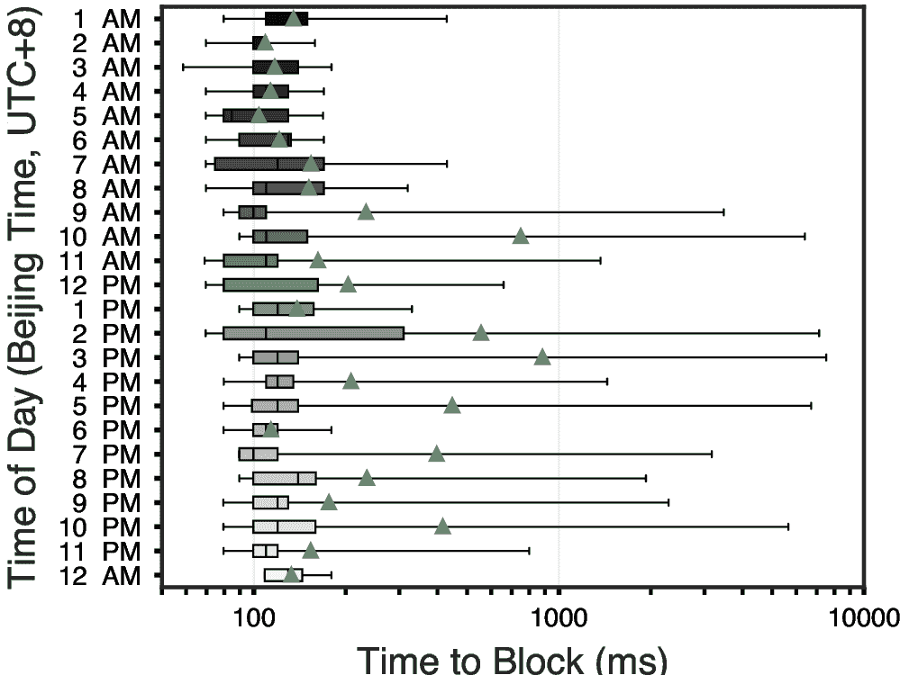

[图 10](#fig:10-how-fast-the-gfw-blocks-boxplot)：箱线图展示了 GFW 阻断连接所需时间的分布。横坐标为对数刻度。绿色三角形表示均值，须状线显示最小值和最大值。

最小封锁延迟在白天始终低于 100 毫秒，这很可能受限于 GFW 内部处理和响应速度。

最大封锁延迟则随一天内时段波动，可能与 GFW 处理的 QUIC 连接数量有关（[第 5 节](#sec:5-gfw-degradation-attack)亦有提示）。在通常人类活动较少的凌晨时段（凌晨 12 点至 6 点），GFW 封锁连接所需时间相对较短，平均封锁延迟约为 150 毫秒。相比之下，在人类活动高峰时段（上午 7 点至晚上 11 点），平均封锁延迟可达 800 毫秒，且最大延迟在下午 3 点左右达到 7000 毫秒。

为进一步验证[第 3.3 节](#sec:3.3-source-port-must-exceed-destination-port)中关于 GFW 基于源端口和目标端口过滤启发式规则的结论，我们扩展了分析范围，覆盖更多端口。采用相同方法，我们测试了从 1 到 65535 的端口，间距为 1000，并特别包含了65535号端口。

[图 11](#fig:11-heatmap-ports-1-65000-step-1000_heatmap) 展示了在扩展端口范围下 GFW 的封锁行为。结果进一步证实了我们的最初发现：如果 QUIC Initial 包的源端口小于或等于目标端口，GFW 不会追踪或封锁对应的 UDP 流。

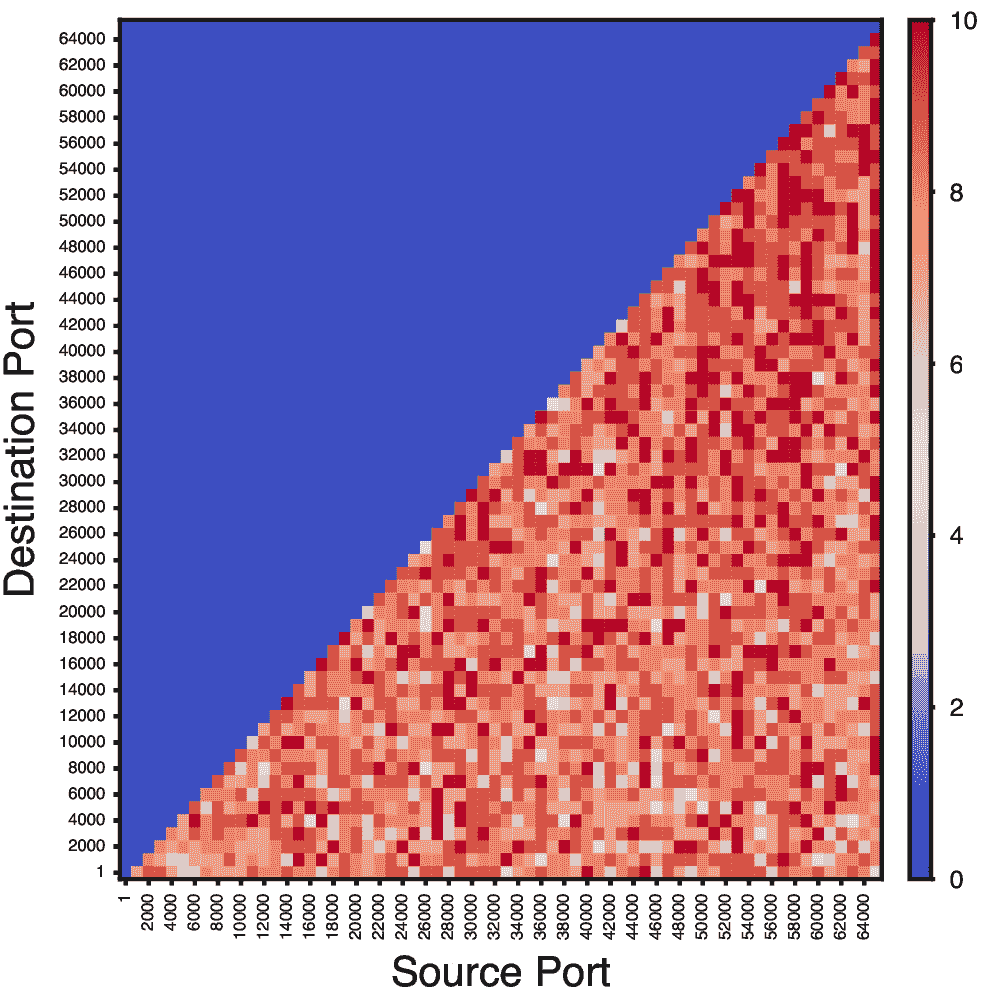

[图 11](#fig:11-heatmap-ports-1-65000-step-1000_heatmap)：如果 QUIC Initial 包的源端口小于或等于目标端口，审查方不会追踪或封锁相应 UDP 流。该规则适用于所有端口号（1 至 65535）。

如[第 9 节](#sec:9-conclusion)所述，因该漏洞允许攻击者利用 GFW 对用户造成进一步伤害，我们决定将可用性攻击（[第 6 节](#sec:6-availability-attack)）披露给审查者。2025年1月22日，我们向 CNCERT/CC 及被誉为“GFW 之父”的方滨兴 [[34](#cite:goldkorn2013fang)] 发送如下邮件，建议移除存在漏洞的 QUIC 审查设备并部署出站过滤以防止 IP 欺骗攻击。该邮件以中英文撰写，并提供了两个介绍攻击详情的中英文私有网页链接。尽管我们未收到任何回复或正式回应，但从2025年1月24日（周五）下午 2:04（UTC+8）至2025年2月24日（周一）上午 9:35（UTC+8）期间，英文网页共被访问 37 次（中文版无访问），说明信息已被接收。

```
主题:       Disclose a Vulnerability in the GFW’s QUIC Filtering Mechanism
发件人:     gfw.report <[email protected]>
收件人:     CNCERT/CC <[email protected]>
抄送:       Fang Binxing <[email protected]>
日期:       Thu, 23 Jan 2025 12:01:46 +0000

尊敬的CNCERT团队：

我们撰写此信是为了披露一种由中国骨干网络上部署的QUIC过滤机制引发的漏洞。该机制至少自2024年4月7日以来一直在运行。该漏洞允许具有伪造IP数据包能力的网络攻击者利用中国的防火长城（GFW）长期中断或阻断中国境内外主机之间的通信。

以下是关于此漏洞的详细信息、影响和缓解措施。此外，我们在以下链接提供了此披露的最新版本：[此处隐去中文版负责任披露页面的网址。]

## 漏洞详情

攻击者可以向特定的IP:端口发送带有防火长城屏蔽名单中的SNI（例如google.com）的QUIC初始数据包（参见以下示例），从而触发GFW的残留审查机制，持续约180秒。如果攻击者将源IP地址伪造成中国境内的受害者IP地址，则此机制可被利用来阻止受害者的IP地址与指定的服务器IP:端口通信三分钟。同样，攻击者可以将源IP地址伪造成中国境外的受害者服务器IP地址，并向中国境内受害者的IP地址的多个端口发送数据包。通过不断发送伪造的QUIC初始数据包，攻击者可以无限期维持封锁。

当防火长城的审查机制被触发时，它会基于三元组（源IP、目标IP、目标UDP端口）阻断通信，时间为3分钟（180秒）。审查可以通过包含屏蔽名单中SNI的单个UDP数据包（如以下示例中的QUIC初始数据包）触发。通常情况下，这种阻断只会影响尝试连接的客户端和服务器之间的通信。然而，由于阻断可以由单个UDP数据包触发，能够伪造IP数据包的网络攻击者可以轻松地让防火墙阻断其他主机的通信。

例如，假设中国境内的某主机地址为19.89.5.35，一个位于中国境外的DNS服务器地址为4.2.2.1，使用UDP端口53。如果攻击者从19.89.5.35:x（任意源端口x）发送一个UDP数据包到4.2.2.1:53，这将触发防火长城阻止19.89.5.35向4.2.2.1:53发送任何数据包，持续3分钟。攻击者可以通过使用不同的源端口伪造数据包，来无限期延长封锁时间。

## 影响

GFW的开发和部署，以及此次发现的问题，对中国用户构成了严重风险，并可能在大范围内中断通信。例如，它可以被利用来阻止基于UDP的DNS流量，从而在中国的DNS解析器与外部网络之间造成广泛的连接问题。

为了展示此攻击的潜在影响，我们使用了32个全球分布的Amazon EC2实例进行了实验。在实验中，我们通过让每个EC2实例向我们在广州控制的VPS发送DNS请求，同时从美国的一个不进行出口过滤的服务器，向每个EC2 IP地址伪造包含屏蔽名单中SNI的QUIC初始数据包并发送到广州VPS。以下地图展示了仅使用一个伪造点时，哪些实例受到了影响。绿色点代表没有连接问题，红色点代表成功向广州主机发送请求有困难。黑色点分别代表我们的受害服务器（广州）和伪造服务器（美国）的位置。

## 缓解措施

由于此攻击可能造成的严重危害，我们敦促立即采取行动解决这一问题。UDP是一种无连接协议，很难完全防止伪造攻击。因此，最彻底的缓解措施是禁用负责阻断UDP连接的审查设备。除了导致这些有害攻击，防火长城还通过阻止信息访问，侵犯了基本人权。

一种较不彻底的缓解措施是部署出口过滤以防止IP数据包伪造，但只要攻击者能够找到一个能够伪造数据包的位置，即使在中国境外，此攻击仍然可能实现。鉴于此，我们建议：1）立即且永久性地禁用QUIC审查过滤设备；2）在边缘网络部署出口过滤以限制IP伪造。

感谢您对这一关键问题的关注。我们随时愿意提供更多技术细节或解答后续问题，以确保此问题得到及时解决。

此致
敬礼
Team

---

Example command:
nc -s $SRC_IP -p $SRC_PORT -vnu $DST_IP $DST_PORT <<<$(xxd -r -p \
<<< "c600000001104ebdf7c473c1c15db3ffa4534f5b3158102154b19e765d7a3caa33a20b92c56da30040e182
dcfd47c61c7fff552b8c61053c0c91ab148d199277a3b459519768aa6c79533eecd2d2e678dbac45dadef121d1d
3f5f56454c6b9305c45d919053fea8c1c1bd950d1fd14ee770d8312d10c03a18aea463538d721af70b4e732037e
ac620f361d0435114eea55204caa685dd33f8b2cb1dac6568b320e2d348f77e72a4c150ed5ac27a9ce9edf696ea
929baf34f28598320b0baa993fbdeddf7c45b724eee8f6fa9c7860a973f0138777422347161743bc6d36e519951
47d7f6d2cf4a398b7ea1066f77bcdee89e760d2568bc3c9bb8f7d5c43482a11a7d696c7dc62fe6ecade80000000
0000000000000000000000000000000000000000000000000000000000000000000000000000000000000000000
0000000000000000000000000000000000000000000000000000000000000000000000000000000000000000000
0000000000000000000000000000000000000000000000000000000000000000000000000000000000000000000
0000000000000000000000000000000000000000000000000000000000000000000000000000000000000000000
0000000000000000000000000000000000000000000000000000000000000000000000000000000000000000000
0000000000000000000000000000000000000000000000000000000000000000000000000000000000000000000
0000000000000000000000000000000000000000000000000000000000000000000000000000000000000000000
0000000000000000000000000000000000000000000000000000000000000000000000000000000000000000000
0000000000000000000000000000000000000000000000000000000000000000000000000000000000000000000
0000000000000000000000000000000000000000000000000000000000000000000000000000000000000000000
0000000000000000000000000000000000000000000000000000000000000000000000000000000000000000000
0000000000000000000000000000000000000000000000000000000000000000000000000000000000000000000
0000000000000000000000000000000000000000000000000000000000000000000000000000000000000000000
0000000000000000000000000000000000000000000000000000000000000000000000000000000000000000000
0000000000000000000000000000000000000000000000000000000000000000000000000000000000000000000
0000000000000000000000000000000000000000000000000000000000000000000000000000000000000000000
0000000000000000000000000000000000000000000000000000000000000000000000000000000000000000000
0000000000000000000000000000000000000000000000000000000000000000000000000000000000000000000
0000000000000000000000000000000000000000000000000000000000000000000000000000000000000000000
0000000000000000000000000000000000000000000000000000000000000000000000000000000000000000000
000000000000000000000000000000000000000")

```

* * *