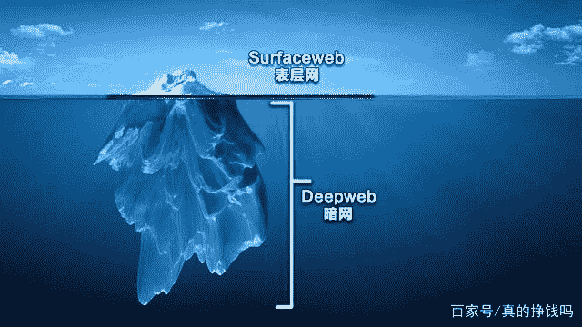

<!--yml
category: 暗网
date: 2022-11-04 11:33:53
-->

# 揭秘“暗网”，带你走近互联网神秘的世界

> 来源：[https://baijiahao.baidu.com/s?id=1660332770011384020&wfr=spider&for=pc](https://baijiahao.baidu.com/s?id=1660332770011384020&wfr=spider&for=pc)

暗行者

截至2020年全球的网民总数已经超过了44亿人，预计年底将达到50亿人。现如今互联网已经渗透了我们的生活中的每一个角落，无论是我们的衣食住行还是娱乐工作都与其紧密相关。最新数据显示，在互联网世界里，每一秒内世界上就有30万条短信和313万封邮件被发出，全球大型搜索引擎上会产生大约实1000,000,000次搜索，各大应用商店里有超过大约15,000次应用下载，还有约20,000人在互联网上发出自己的感想，而全球网民平均的上网时间已经达到了每天6小时。这些网民整个2020年的上网时间加在一起，消耗的时间大概相当于10亿年。而这10亿年中我们所浏览的绝大部分网站，却仅仅占据了全部互联网世界的4%。

这个世界有阴就会有阳，有白天就会有黑夜，互联网的世界也不例外。互联网被分为三个层级，最上面表层面，就是我们日常浏览的表层网。表层网占据全部网络的4%，我们平时上的谷歌、某度、油管、B站、脸书、还有某东某宝等等，这些对所有用户开放的互联网络，基本上可以为我们提供一切日常的上网需求，我们可以从中找到任何人的基本信息看到他们的生活日常，但是你却找不到他们的银行账户信息或者病例等隐私信息。因为这些信息是被保护隐藏的，而这部分内容就存在于深网中"deepweb”。

暗网示意图

“暗网”是指不被搜索索引的互联网部分，只供私人机构或组织使用。并在密码的保护下，不对外界开放。没有密码或者没有权限是无法对其访问的，并不是所有“暗网”都是非法网站，比如银行、政府、医院的内部工作网络。比如你的个人邮箱、个人网盘都属于“暗网”的一部分，这一部分是互联网的主题。在2001年加州大学的一项研究发现，当时身“暗网”有着7.5PB的字节，但是仅仅过了两年，这个数字就达到了91000PB。PB是计算机存贮容量单位，1PB等于1024TB，1TB等于1024G。我们现在主流家用电脑的硬盘大小就是1TB左右，而PB并不是最大的计算机储存容量单位。最大的计算机存储容量单位是BB也就是千亿亿字节。

如今“暗网”占据了整个互联网世界的96%。在暗网的最下面还隐藏着鲜为人知的神秘网络地带=暗网。暗网是被包含在深网中的极其私密的一小部分，只能使用屏蔽IP的浏览器通过特殊的方式访问，任何的访问也都是被匿名的。暗网中没有IP地址，这就使得他们几乎是无法被识别访问，因此，用户可以通过加密的消息进行通讯，并且可以完全匿名的买卖任何东西。

互联网的产生本身就是军事技术的附属品，暗网也不例外，1969年11月，美国国防部高级研究计划局开始建立了一个命名ARPAnet的网络，ARPAnet只有四个节点，分布在加州大学洛杉矶分校，加州大学圣巴巴拉分校，斯坦福大学，犹他大学的四台大型计算机。这就是互联网的鼻祖，就在几个月后世界历史上第一个电子商务的交易完成，这宗交易是在1970年有两个学生完成毒品交易，可以说暗网的基础架构是与互联网同时建立的。

而后互联网在随后的几十年中爆炸式的发展，但是此时的互联网协议并非匿名的，这在军事通讯上就存在着极大的风险，因此到1990年代中期，美国海军研究实验室为了保护美国在线情报系统。开发了洋葱路由，其后国防高等研究计划署接受该项目并继续开发并在1998年获得了海军的专利，2002年计算机科学家罗杰丁高戴恩和尼克马修森加入了该项目并开始开发“洋葱路由项目tor”。tor后来成为了规模最大的洋葱路由并广为人知，并衍生出了tor浏览器，成为了人们敲开暗网大门的钥匙。

本文较长，小编将分为三部分同时发布，看下一期的话关注我，然后在小编的主页看就可以。谢谢！